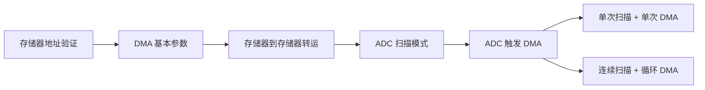
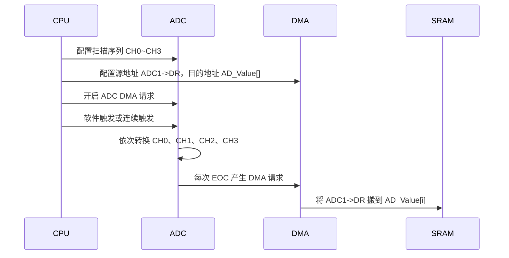
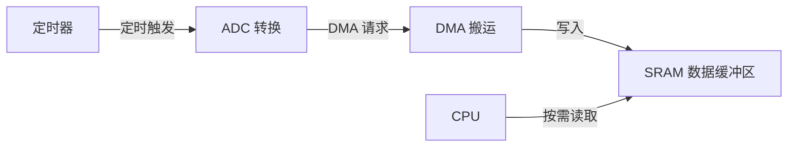

# STM32 DMA 数据转运与 DMA+ADC 多通道学习笔记

## 视频信息

| 项目 | 内容 |
|---|---|
| 来源 | Bilibili：`BV1th411z7sn`，P24 |
| 课程 | STM32 入门教程 2023 版 |
| 本节标题 | `[8-2] DMA 数据转运 & DMA+AD 多通道` |
| 主要芯片 | STM32F103 系列 |
| 主要库 | STM32 标准外设库 |
| 本节目标 | 掌握 DMA 存储器到存储器转运，以及 ADC 扫描模式配合 DMA 自动搬运多通道转换结果 |

> 本笔记由视频语音转写整理而来；将 ASR 中的“ABC”等误识别统一整理为 `ADC`。

## 1. 本节知识主线



DMA 的核心作用是：在不依赖 CPU 逐个读写的情况下，把数据从一个地址自动搬运到另一个地址。它既可以做 SRAM 数组之间的搬运，也可以把外设寄存器的数据搬运到 SRAM 数组中。

## 2. 存储器与外设地址基础

| 地址开头 | 区域 | 特点 | 常见用途 |
|---|---|---|---|
| `0x0800_0000` | Flash | 只读，掉电不丢失 | 程序代码、`const` 常量、字库、查找表 |
| `0x2000_0000` | SRAM | 可读可写，掉电丢失 | 普通全局变量、数组、运行时数据 |
| `0x4000_0000` | 外设寄存器区 | 固定地址，由芯片手册规定 | GPIO、ADC、DMA、TIM、USART 等寄存器 |

示例：

```c
uint8_t AA = 0x66;        // 通常分配在 SRAM，地址常见为 0x2000 开头
const uint8_t BB = 0x66;  // 通常分配在 Flash，地址常见为 0x0800 开头
```

显示变量地址时要注意类型转换：

```c
OLED_ShowHexNum(2, 1, (uint32_t)&AA, 8);
```

如果一大段数据在运行期间不会被修改，例如 OLED 字库、查找表、固定波形表，建议定义为 `const`。这样数据会放在 Flash 中，避免占用宝贵的 SRAM。去掉 `const` 后程序功能可能仍然正常，但会浪费与数组同等大小的 SRAM 空间。

## 3. DMA 基础参数

DMA 初始化结构体的关键成员可以按“源站点、目的站点、传输控制”来理解。

| 参数 | 含义 | 常见选择 |
|---|---|---|
| `DMA_PeripheralBaseAddr` | 外设站点地址 | 外设寄存器地址，或在存储器到存储器时借用为源/目的地址 |
| `DMA_PeripheralDataSize` | 外设站点数据宽度 | `Byte`、`HalfWord`、`Word` |
| `DMA_PeripheralInc` | 外设站点地址是否自增 | 数组搬运常自增；ADC `DR` 寄存器不自增 |
| `DMA_MemoryBaseAddr` | 存储器站点地址 | SRAM 数组地址 |
| `DMA_MemoryDataSize` | 存储器站点数据宽度 | 通常与另一端一致 |
| `DMA_MemoryInc` | 存储器站点地址是否自增 | 接收数组通常自增 |
| `DMA_DIR` | 传输方向 | `PeripheralSRC` 或 `PeripheralDST` |
| `DMA_BufferSize` | 传输计数器 | 要传几个数据单元 |
| `DMA_Mode` | 传输模式 | `Normal` 单次；`Circular` 循环 |
| `DMA_M2M` | 是否存储器到存储器 | `Enable` 为软件触发；`Disable` 为硬件触发 |
| `DMA_Priority` | DMA 优先级 | 多通道同时工作时用于仲裁 |

### 数据宽度选择

| 宏 | 宽度 | C 类型示例 | 使用场景 |
|---|---:|---|---|
| `DMA_PeripheralDataSize_Byte` | 8 位 | `uint8_t` | 字节数组 |
| `DMA_PeripheralDataSize_HalfWord` | 16 位 | `uint16_t` | ADC 12 位结果、半字数据 |
| `DMA_PeripheralDataSize_Word` | 32 位 | `uint32_t` | 32 位数据 |

`DMA_BufferSize` 填的是“数据单元个数”，不是字节数。例如半字传输时 `DMA_BufferSize = 4` 表示搬运 4 个 `uint16_t`，总共 8 字节。

### DMA 的三个启动条件

1. 传输计数器不为 0。
2. 有触发源信号：软件触发或外设硬件触发。
3. DMA 通道已经使能。

存储器到存储器转运使用软件触发，`DMA_Cmd()` 使能后通常会立即开始；ADC+DMA 使用 ADC 转换完成作为硬件触发，DMA 使能后不会马上搬运，必须等 ADC 产生 DMA 请求。

## 4. 实验一：DMA 存储器到存储器转运

### 目标

把数组 `DataA` 中的数据通过 DMA 自动搬运到数组 `DataB` 中，然后通过 OLED 显示地址和数据，观察 DMA 搬运效果。

### 初始化流程

1. 开启 DMA1 时钟：`RCC_AHBPeriphClockCmd(RCC_AHBPeriph_DMA1, ENABLE);`
2. 配置 DMA 通道，存储器到存储器时通道可任选，本节使用 `DMA1_Channel1`。
3. 配置源地址、目标地址、数据宽度、地址自增、计数器、普通模式、软件触发。
4. 清除完成标志位。
5. 使能 DMA。
6. 等待 `DMA1_FLAG_TC1` 置位。
7. 关闭 DMA，便于下次重新设置计数器。

### 示例代码

```c
#include "stm32f10x.h"

uint8_t DataA[] = {0x01, 0x02, 0x03, 0x04};
uint8_t DataB[] = {0x00, 0x00, 0x00, 0x00};

void MyDMA_Init(uint32_t AddrA, uint32_t AddrB, uint16_t Size)
{
    DMA_InitTypeDef DMA_InitStructure;

    RCC_AHBPeriphClockCmd(RCC_AHBPeriph_DMA1, ENABLE);
    DMA_InitStructure.DMA_PeripheralBaseAddr = AddrA;
    DMA_InitStructure.DMA_PeripheralDataSize = DMA_PeripheralDataSize_Byte;
    DMA_InitStructure.DMA_PeripheralInc = DMA_PeripheralInc_Enable;
    DMA_InitStructure.DMA_MemoryBaseAddr = AddrB;
    DMA_InitStructure.DMA_MemoryDataSize = DMA_MemoryDataSize_Byte;
    DMA_InitStructure.DMA_MemoryInc = DMA_MemoryInc_Enable;
    DMA_InitStructure.DMA_DIR = DMA_DIR_PeripheralSRC;
    DMA_InitStructure.DMA_BufferSize = Size;
    DMA_InitStructure.DMA_Mode = DMA_Mode_Normal;
    DMA_InitStructure.DMA_M2M = DMA_M2M_Enable;
    DMA_InitStructure.DMA_Priority = DMA_Priority_Medium;
    DMA_Init(DMA1_Channel1, &DMA_InitStructure);
}

void MyDMA_Transfer(uint16_t Size)
{
    DMA_Cmd(DMA1_Channel1, DISABLE);
    DMA_SetCurrDataCounter(DMA1_Channel1, Size);
    DMA_ClearFlag(DMA1_FLAG_TC1);
    DMA_Cmd(DMA1_Channel1, ENABLE);
    while (DMA_GetFlagStatus(DMA1_FLAG_TC1) == RESET);
    DMA_Cmd(DMA1_Channel1, DISABLE);
}
```

调用示例：

```c
MyDMA_Init((uint32_t)DataA, (uint32_t)DataB, 4);
MyDMA_Transfer(4);
```

### 关键点

| 点 | 说明 |
|---|---|
| 地址传参 | SRAM 数组地址由编译器分配，通常不要手写绝对地址，用数组名取地址即可 |
| `DMA_M2M_Enable` | 开启后表示存储器到存储器，触发源为软件触发 |
| 普通模式 | 一次搬运完成后计数器归零，下次搬运前需要重新写入 `DMA_SetCurrDataCounter()` |
| 完成标志 | 可用 `DMA_GetFlagStatus(DMA1_FLAG_TC1)` 等待转运完成 |
| `const` 源数组 | 源数组可以放 Flash，DMA 可从 Flash 搬到 SRAM，但不能修改 Flash 中的 `const` 数据 |

## 5. 实验二：ADC 扫描模式 + DMA 多通道采集

### 硬件接线

| ADC 通道 | GPIO | 外部模块 | 说明 |
|---|---|---|---|
| ADC_Channel_0 | PA0 | 电位器 | 模拟电压输入 |
| ADC_Channel_1 | PA1 | 光敏模块 AO | 模拟电压输入 |
| ADC_Channel_2 | PA2 | 热敏模块 AO | 模拟电压输入 |
| ADC_Channel_3 | PA3 | 反射红外模块 AO | 模拟电压输入 |

### 工作过程



ADC 的 `DR` 数据寄存器只有一个。如果扫描多个通道但 CPU 没有及时读取，后一次转换结果可能覆盖前一次结果。DMA 的作用就是在每次转换完成后立刻把 `DR` 搬到 SRAM 数组中。

### ADC 配置要点

| 参数 | 配置 | 原因 |
|---|---|---|
| `ADC_Mode` | `ADC_Mode_Independent` | 独立模式 |
| `ADC_ScanConvMode` | `ENABLE` | 多通道扫描必须开启 |
| `ADC_ContinuousConvMode` | 单次实验用 `DISABLE`，自动刷新用 `ENABLE` | 对应单次扫描或连续扫描 |
| `ADC_ExternalTrigConv` | `ADC_ExternalTrigConv_None` | 使用软件触发 |
| `ADC_DataAlign` | `ADC_DataAlign_Right` | 右对齐，常规读取方式 |
| `ADC_NbrOfChannel` | `4` | 本节采集 4 个通道 |

通道序列：

```c
ADC_RegularChannelConfig(ADC1, ADC_Channel_0, 1, ADC_SampleTime_55Cycles5);
ADC_RegularChannelConfig(ADC1, ADC_Channel_1, 2, ADC_SampleTime_55Cycles5);
ADC_RegularChannelConfig(ADC1, ADC_Channel_2, 3, ADC_SampleTime_55Cycles5);
ADC_RegularChannelConfig(ADC1, ADC_Channel_3, 4, ADC_SampleTime_55Cycles5);
```

数组中的结果顺序与扫描序列一致：`AD_Value[0]` 到 `AD_Value[3]` 分别对应规则组序列 1 到 4。

### DMA 配置要点

| 参数 | 配置 | 原因 |
|---|---|---|
| 源地址 | `(uint32_t)&ADC1->DR` | ADC 转换结果在数据寄存器 `DR` 中 |
| 源宽度 | `HalfWord` | ADC 结果为 12 位，用 16 位搬运 |
| 源地址自增 | `DISABLE` | 每次都读同一个 `ADC1->DR` |
| 目的地址 | `(uint32_t)AD_Value` | 搬到 SRAM 数组 |
| 目的宽度 | `HalfWord` | `uint16_t` 数组 |
| 目的地址自增 | `ENABLE` | 依次存入数组下标 0~3 |
| 方向 | `DMA_DIR_PeripheralSRC` | 外设站点作为源头 |
| 计数器 | `4` | 四个 ADC 通道 |
| 模式 | `Normal` 或 `Circular` | 单次采集或循环刷新 |
| `DMA_M2M` | `DISABLE` | 由 ADC 硬件触发，不是软件触发 |
| 通道 | `DMA1_Channel1` | ADC1 的 DMA 请求固定接到 DMA1 通道 1 |

注意：ADC1 触发 DMA 时，DMA 通道不能随便选，必须使用 `DMA1_Channel1`。

### 单次扫描 + 单次 DMA

这种方式适合“调用一次函数，采集一组四通道数据”。

```c
uint16_t AD_Value[4];

void AD_GetValue(void)
{
    DMA_Cmd(DMA1_Channel1, DISABLE);
    DMA_SetCurrDataCounter(DMA1_Channel1, 4);
    DMA_ClearFlag(DMA1_FLAG_TC1);
    DMA_Cmd(DMA1_Channel1, ENABLE);

    ADC_SoftwareStartConvCmd(ADC1, ENABLE);
    while (DMA_GetFlagStatus(DMA1_FLAG_TC1) == RESET);
}
```

初始化时 ADC 要使用扫描模式、单次转换模式，DMA 要使用普通模式：

```c
ADC_InitStructure.ADC_ScanConvMode = ENABLE;
ADC_InitStructure.ADC_ContinuousConvMode = DISABLE;
ADC_InitStructure.ADC_NbrOfChannel = 4;

DMA_InitStructure.DMA_PeripheralBaseAddr = (uint32_t)&ADC1->DR;
DMA_InitStructure.DMA_PeripheralDataSize = DMA_PeripheralDataSize_HalfWord;
DMA_InitStructure.DMA_PeripheralInc = DMA_PeripheralInc_Disable;
DMA_InitStructure.DMA_MemoryBaseAddr = (uint32_t)AD_Value;
DMA_InitStructure.DMA_MemoryDataSize = DMA_MemoryDataSize_HalfWord;
DMA_InitStructure.DMA_MemoryInc = DMA_MemoryInc_Enable;
DMA_InitStructure.DMA_DIR = DMA_DIR_PeripheralSRC;
DMA_InitStructure.DMA_BufferSize = 4;
DMA_InitStructure.DMA_Mode = DMA_Mode_Normal;
DMA_InitStructure.DMA_M2M = DMA_M2M_Disable;
```

主循环中调用：

```c
while (1)
{
    AD_GetValue();
    OLED_ShowNum(1, 1, AD_Value[0], 4);
    OLED_ShowNum(2, 1, AD_Value[1], 4);
    OLED_ShowNum(3, 1, AD_Value[2], 4);
    OLED_ShowNum(4, 1, AD_Value[3], 4);
}
```

### 连续扫描 + 循环 DMA

这种方式更自动：ADC 一直循环扫描，DMA 一直循环把最新结果刷新到数组中，CPU 想用数据时直接读数组即可。

核心改动：

```c
ADC_InitStructure.ADC_ContinuousConvMode = ENABLE;
DMA_InitStructure.DMA_Mode = DMA_Mode_Circular;
```

初始化最后直接启动一次 ADC：

```c
DMA_Cmd(DMA1_Channel1, ENABLE);
ADC_DMACmd(ADC1, ENABLE);
ADC_Cmd(ADC1, ENABLE);
ADC_SoftwareStartConvCmd(ADC1, ENABLE);
```

之后不再需要 `AD_GetValue()`，主循环直接读取 `AD_Value[]` 即可。

## 6. 两种 ADC+DMA 工作方式对比

| 方式 | ADC 模式 | DMA 模式 | 是否需要采集函数 | 适合场景 |
|---|---|---|---|---|
| 单次扫描 + 单次 DMA | `DISABLE` 连续转换 | `Normal` | 需要，每次采集前重装 DMA 计数器 | 按需采样、低频读取 |
| 连续扫描 + 循环 DMA | `ENABLE` 连续转换 | `Circular` | 不需要，初始化后自动刷新数组 | 实时显示、连续监测 |

连续扫描 + 循环 DMA 的自动化程度更高，CPU 不需要轮询 ADC 完成标志，也不需要中断服务函数，硬件会持续把最新结果放到 SRAM 数组中。

## 7. 常见坑与排查

| 问题 | 原因 | 处理方法 |
|---|---|---|
| ADC 多通道只读到一个值 | 没开扫描模式或通道数量没设对 | `ADC_ScanConvMode = ENABLE`，`ADC_NbrOfChannel = 4` |
| 数组顺序和预期不一致 | ADC 规则组序列顺序配置不同 | 检查 `ADC_RegularChannelConfig()` 的 rank 参数 |
| DMA 没有搬运 | 未开启 `ADC_DMACmd()` 或 DMA 通道没使能 | 调用 `ADC_DMACmd(ADC1, ENABLE)` 并 `DMA_Cmd()` |
| ADC1 DMA 选错通道 | ADC1 固定连接 DMA1_Channel1 | 使用 `DMA1_Channel1` |
| 数据一直为 0 或异常 | GPIO 没设为模拟输入，或 ADC 时钟/校准遗漏 | GPIO 设 `GPIO_Mode_AIN`，配置 ADC 分频并校准 |
| 第二次单次采集无效 | 普通模式下 DMA 计数器归零 | 每次启动前 `DMA_SetCurrDataCounter()` |
| ADC 结果覆盖 | 多通道扫描时没有及时搬走 `DR` | 使用 DMA 自动转运到数组 |
| SRAM 被大数组占满 | 大字库/查找表未加 `const` | 不修改的数据放 Flash |

## 8. 外设自动协作思想



这类结构不再是 CPU 单独控制所有外设，而是外设之间互相触发、互相协作。常见例子包括定时器触发 ADC、ADC 触发 DMA、串口触发 DMA、定时器触发 DAC 等。优点是降低 CPU 负担，提高采样/传输及时性，也让程序结构更简洁。

## 9. 复习速记

| 记忆点 | 结论 |
|---|---|
| SRAM 地址 | `0x2000_0000` 开头 |
| Flash 地址 | `0x0800_0000` 开头 |
| 外设地址 | `0x4000_0000` 开头 |
| `const` 作用 | 不可修改，通常放入 Flash，节省 SRAM |
| ADC1 数据寄存器 | `ADC1->DR`，地址可用 `(uint32_t)&ADC1->DR` 获取 |
| ADC1 DMA 通道 | `DMA1_Channel1` |
| ADC 结果宽度 | 12 位，DMA 通常用 `HalfWord` 搬运 |
| 多通道 ADC 必开 | 扫描模式 `ADC_ScanConvMode = ENABLE` |
| 多通道结果顺序 | 由规则组 rank 决定 |
| DMA 普通模式 | 一次完成后计数器归零，下次需重装 |
| DMA 循环模式 | 自动重装计数器，适合持续刷新 |

## 10. 本节总结

1. DMA 可以在不占用 CPU 逐个搬运的情况下完成数据转运。
2. 存储器到存储器转运使用 `DMA_M2M_Enable`，通常由软件触发。
3. ADC 多通道扫描时，DMA 可以及时把 `ADC1->DR` 的结果搬到 SRAM 数组中，避免数据覆盖。
4. 单次扫描 + 普通 DMA 适合按需采集；连续扫描 + 循环 DMA 适合实时自动刷新。
5. STM32 外设可以形成“定时器触发 ADC、ADC 触发 DMA、DMA 写入 SRAM”的硬件自动化链路，从而减少 CPU 参与。
