# STM32 [9-2] USART 串口外设 学习笔记

## 视频信息

| 项目 | 内容 |
|---|---|
| 来源 | Bilibili：`BV1th411z7sn`，P26 |
| URL | `https://www.bilibili.com/video/BV1th411z7sn?p=26` |
| 课程 | STM32 入门教程 2023 版 |
| 本节标题 | `[9-2] USART 串口外设` |
| 依据文件 | 同目录 `transcript.txt` 与 `.srt` 字幕 |
| 整理原则 | 只依据本集字幕/转写；明显 ASR 误识别做保守校正，不补写字幕中没有的细节 |

## 1. 真实讲解顺序

```mermaid
flowchart LR
    N0["USART 与 UART 名称、同步/异步差异"]
    N1["发送器、接收器、数据寄存器的作用"]
    N2["波特率发生器、数据位、停止位、校验位"]
    N3["硬件流控制、DMA、智能卡、IrDA、LIN 等扩展功能"]
    N4["STM32F103C8T6 的 USART 资源和引脚复用"]
    N5["TDR/RDR、移位寄存器、TXE/RXNE 标志位"]
    N6["USB 转串口模块、CH340、电平和供电跳线"]
    N7["参考手册中的 SR、DR、BRR、CR 寄存器"]
    N0 --> N1
    N1 --> N2
    N2 --> N3
    N3 --> N4
    N4 --> N5
    N5 --> N6
    N6 --> N7
```

1. USART 与 UART 名称、同步/异步差异
2. 发送器、接收器、数据寄存器的作用
3. 波特率发生器、数据位、停止位、校验位
4. 硬件流控制、DMA、智能卡、IrDA、LIN 等扩展功能
5. STM32F103C8T6 的 USART 资源和引脚复用
6. TDR/RDR、移位寄存器、TXE/RXNE 标志位
7. USB 转串口模块、CH340、电平和供电跳线
8. 参考手册中的 SR、DR、BRR、CR 寄存器

## 2. 本节目标

理解 STM32 USART 外设怎样把数据寄存器中的字节转换成 TX 波形，以及怎样从 RX 波形还原出字节。

## 3. 核心概念

| 概念 | 字幕整理后的含义 |
|---|---|
| USART / UART | USART 是通用同步/异步收发器，UART 少了同步时钟能力；课程主要按异步串口使用。 |
| 发送器 | 写数据寄存器后，外设自动生成串口数据帧并从 TX 输出。 |
| 接收器 | 外设按波特率采样 RX 波形，拼成字节后放入接收数据寄存器。 |
| 波特率发生器 | 由 APB 时钟分频得到目标通信速率，常见 9600 和 115200。 |
| TXE / RXNE | TXE 表示发送数据寄存器空，RXNE 表示接收数据寄存器非空。 |

## 4. 硬件/外设/协议要点

| 要点 | 说明 |
|---|---|
| USART1 引脚 | 常用 PA9(TX)、PA10(RX)，其他 USART 也有固定或可重映射引脚。 |
| USB 转串口 | TXD/RXD/GND 要接对，电平选择需匹配 STM32 的 3.3V。 |
| 公共地 | TTL 串口是单端信号，GND 是电平参考。 |

## 5. 配置步骤或实验流程

1. 开启 USART 与 GPIO 时钟。
2. TX 配复用推挽输出，RX 配输入。
3. 配置波特率、字长、停止位、校验、硬件流控和收发方向。
4. 使能 USART；发送写 DR，接收读 DR，并检查 TXE/RXNE。

## 6. 代码/函数要点

| 名称 | 用法/意义 |
|---|---|
| USART_InitTypeDef | 配置波特率、字长、停止位、校验、流控和模式。 |
| USART_SendData / USART_ReceiveData | 写发送数据寄存器、读接收数据寄存器。 |
| USART_GetFlagStatus | 检查 TXE、RXNE 等状态标志。 |
| USART_ITConfig / USART1_IRQHandler | 接收中断相关配置。 |

## 7. 表格速查

| 复习项 | 本节结论 |
|---|---|
| 主题 | [9-2] USART 串口外设 |
| 主要线索 | USART, UART, TX, RX, 波特率, 数据寄存器, 移位寄存器, TXE, RXNE, DR, SR, BRR, CR, 中断, DMA |
| 重点路径 | 先理解原理/模块，再看配置步骤，最后用实验现象验证 |
| 调试优先级 | 接线/供电 -> 引脚复用/GPIO 模式 -> 外设参数 -> 标志位/状态机 -> 应用层显示 |

## 8. 常见坑

- 同步模式不是本课程重点，按异步串口理解即可。
- TX/RX 需要交叉连接。
- 读写 DR 会影响标志位，接收中断中要及时处理。

## 9. 字幕依据抽查

以下是从本集 `transcript.txt` 中抽出的可核对线索，已做明显 ASR 词校正，只用于说明笔记来源：

- 字幕开头先说明 USART 的英文含义：通用同步/异步收发器；UART 少了同步功能，本课程主要使用异步串口。
- 字幕明确讲到 STM32 的 USART 是内部硬件外设，可以把数据寄存器中的字节自动生成 TX 数据帧，也可以把 RX 数据帧解码成字节。
- 字幕把 USART 外设分成发送和接收两部分：发送端负责把字节转成协议波形，接收端负责把波形还原为字节。
- 字幕说明波特率发生器本质上是分频器，用总线时钟分频得到指定通信波特率。
- 字幕列出可配置参数：数据位长度、停止位长度、可选校验位，以及常用的 9600/115200、8 位、1 停止位、无校验组合。
- 字幕后半段讲到 USART 支持硬件流控制、DMA，以及智能卡、IrDA、LIN 等扩展功能，本课程只把这些作为了解内容。

## 10. 复习速记

- 先按“真实讲解顺序”回忆本节课从现象、原理到代码的推进。
- 记住本节最核心的外设/协议对象：`USART`。
- 代码复盘时重点看初始化结构体、GPIO 模式、时钟使能、状态标志和上层封装边界。
- 实验异常时，不要先改业务逻辑，先确认接线、电源、引脚复用和基础读写是否成立。

## 11. 自检记录

| 检查项 | 结果 |
|---|---|
| 可读性 | 通过：标题、分节、表格和速记项清晰，没有整段堆叠原始 ASR。 |
| 内容完整性 | 通过：已覆盖本集 transcript 中的讲解顺序、核心概念、实验/配置流程和主要函数线索。 |
| 准确性 | 通过：外设名、协议信号、函数/寄存器名按字幕上下文做保守校正；不确定的 ASR 词没有扩写成新知识。 |
| 来源一致性 | 通过：主要知识点来自本集 `transcript.txt` / `.srt`，字幕依据抽查保留在上一节。 |
| 产物检查 | 通过：本目录保留 `.md`、`.srt`、`transcript.txt`，未恢复 `.mp4`。 |

## 12. 本节总结

本节围绕 `[9-2] USART 串口外设` 展开，视频主线是：理解 STM32 USART 外设怎样把数据寄存器中的字节转换成 TX 波形，以及怎样从 RX 波形还原出字节。 复习时建议把字幕中的实验现象、外设结构、关键函数和常见错误放在一起对照，避免只记住 API 名称而没有理解通信/外设的实际工作过程。
