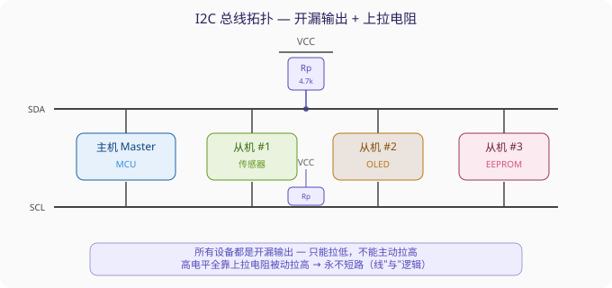
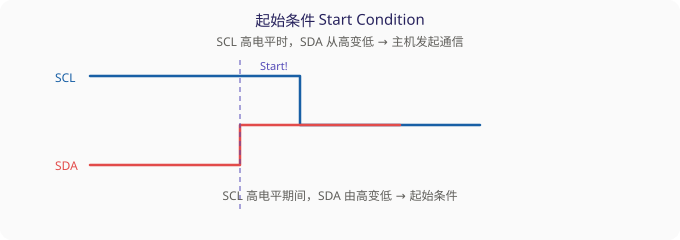
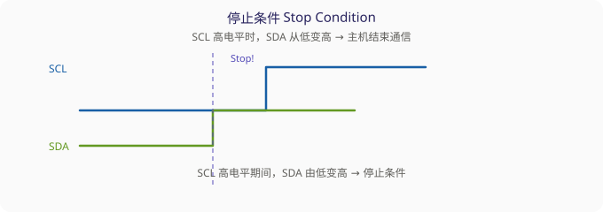
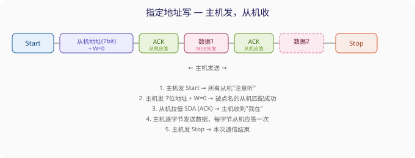
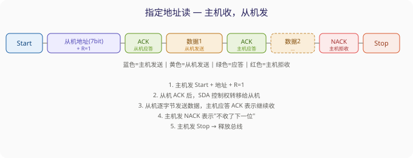
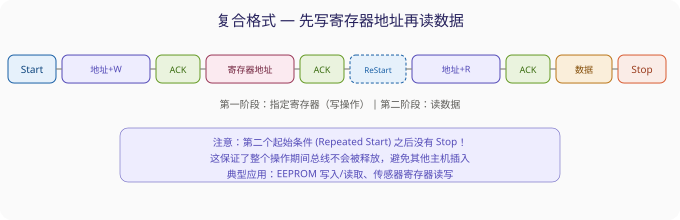
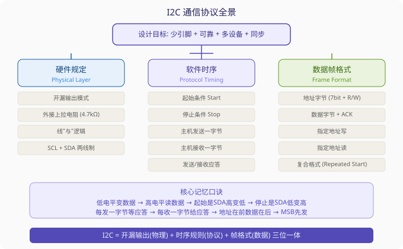

# STM32 I2C 通信协议详解 — 学习笔记

> **视频来源**: [B站 江协科技 STM32入门教程-2023版 p31 [10-1]](https://www.bilibili.com/video/BV1th411z7sn?p=31)
> **芯片型号**: STM32F103C8T6
> **前置知识**: USART 串口通信基础
> **本节定位**: I2C 协议理论（纯理论课，代码在后续课时）

---

## 一、课程概览与前置知识

本节课是 I2C 通信协议的理论基础课，不涉及代码编写。重点是理解 I2C 的设计思路、硬件电路规定和软件时序规定——这三者构成了完整的通信协议。

**已学通信协议回顾**：串口 USART 是异步、全双工、点对点的协议，只有两根线（TX 和 RX），收发互不干扰，非常简单直接。本节要学的 I2C 在很多方面和串口截然不同，理解这种差异是掌握 I2C 的关键。

---

## 二、I2C 的设计背景：从并口到串口的演进

### 2.1 为什么需要 I2C？

在早期的电路设计中，芯片之间的通信普遍使用并口方式——比如 8 位数据就需要 8 根数据线，再加上读、写、片选等控制线，一个芯片总共可能要 10 多根线才能完成通信。如果板子上有多个这样的芯片，走线会变得非常复杂，不仅占 PCB 面积，还会增加布线和电磁兼容的难度。

**大公司（飞利浦）提出的设计需求**：

| 需求编号 | 需求内容 | 对应 I2C 的设计 |
|:---:|:---|:---|
| ① | 节省引脚资源，一根线既要能发送又要能接收 | **半双工**，SDA 单线分时复用 |
| ② | 通信要有确认机制，保证可靠性 | **带数据应答**（ACK/NACK） |
| ③ | 一根总线能挂多个设备 | **总线挂载多设备**，通过地址区分 |
| ④ | 用同步时序降低对硬件的依赖，提高稳定性 | **同步通信**，SCL 时钟线统一节拍 |

### 2.2 I2C 协议的基本特征

根据以上需求设计出的 I2C（Inter-Integrated Circuit）协议具有以下特征：

- **同步、半双工**：有一根专门的时钟线 `SCL`，所有设备都按照同一个时钟节拍工作。只有一根数据线 `SDA`，发的时候不能收，收的时候不能发。
- **带数据应答**：每发完一个字节，接收方必须回一个应答位（ACK=0）或非应答位（NACK=1）。
- **支持总线挂载多设备**：一根 I2C 总线上可以挂多个从机（Slave），主机通过地址来选择要和哪一个从机通信。
- **支持一主多从和多主多从**：本课程只讲一主多从，多主多从涉及总线仲裁和时钟同步，较为复杂，不做要求。

---

## 三、一主多从模型：教室里的师生关系

I2C 的一主多从模型可以用教室场景来理解：

> **老师（主机）** 主导整个课堂的节奏，所有 **学生（从机）** 都可以同时听到老师讲的话。但是学生只有在被老师点名之后才能发言，未经允许不能擅自说话——否则课堂就乱套了。

在这个模型下，主机的权力很大：

- **SCL 时钟线**：主机在任何时刻都完全掌控 SCL。从机只能被动读取 SCL，不允许去碰它。
- **SDA 数据线**：在空闲状态下，主机可以主动发起对 SDA 的控制。只有在两种情况下，主机会临时交出 SDA 控制权给从机：
  1. 主机发送"读取从机数据"的命令后 → 从机需要把数据放到 SDA 上
  2. 从机应答（ACK）时 → 从机需要拉低 SDA 表示"我收到了"

> **关键**：从机不允许主动发起对 SDA 的控制。只有主机点名了，从机才能短暂地控制一下 SDA，完事之后立即归还。这个规定是一主多从模型的核心约束，理解了这个就理解了 I2C 的基本权力分配。

---

## 四、硬件电路规定：开漏输出 + 上拉电阻

### 4.1 为什么不能直接用推挽输出？

考虑一个问题：SDA 是一根半双工线，主机的 SDA 在发送时是输出，在接收时是输入；从机的 SDA 同样要在输入和输出之间切换。如果所有设备的 SDA 都配置成推挽输出，一旦时序没协调好，两个设备同时处于输出状态，一个输出高电平、一个输出低电平——这就是 **电源短路**，电流会瞬间拉得很高，芯片可能烧毁。

### 4.2 I2C 的解决方案：开漏 + 上拉

I2C 的硬件设计巧妙地规避了这个问题，规定了两条铁律：

1. **所有设备的 SCL 和 SDA 都要配置成开漏输出模式**
2. **SCL 和 SDA 各外接一个上拉电阻（通常 4.7kΩ）到 VCC**

**开漏输出的特性**：
- 引脚只能输出低电平（拉低总线），或者处于高阻态（放手不管）
- 高电平完全由外部的上拉电阻提供

**这样设计的好处**：
- 任何一个设备拉低总线，总线就是低电平——这是 **线"与"逻辑**
- 所有设备都放手时，上拉电阻把总线拉回高电平
- **永远不会出现"一个输出高、一个输出低"导致短路的情况**，因为没有任何设备能主动输出高电平

这就是 I2C 硬件设计最核心的智慧。

> **注意**：SCL 同样配置为开漏输出。虽然在一主多从模型下 SCL 只有主机在控制，但从机也可以在某些情况下拉低 SCL——比如从机处理速度跟不上，可以通过拉低 SCL 来"拖住"主机，实现 **时钟拉伸（Clock Stretching）**。

---

## 五、软件时序规定：六个基本时序单元

I2C 的完整通信是由六个最基本、最原子化的时序单元组合而成的。理解这六个单元，就理解了整个 I2C 协议。我们先从最简单的一个 bit 开始。

### 5.1 SDA 数据变化的规则

> **核心规则**: SCL 低电平时，允许改变 SDA；SCL 高电平时，SDA 必须保持稳定。

这是因为数据是在 SCL 高电平期间被读取的。如果在 SCL 高电平期间 SDA 发生了变化，接收方读到的数据就是不确定的。

### 5.2 六个基本单元

#### 单元一：起始条件（Start Condition）

**时序要求**：SCL 处于高电平时，SDA 从高变低。这个特殊的边沿组合就是起始条件。

作用：主机通知所有从机——"我要开始通信了，都注意听！"收到起始条件后，从机就开始准备接收后续的数据。

#### 单元二：停止条件（Stop Condition）

**时序要求**：SCL 处于高电平时，SDA 从低变高。

作用：主机通知所有从机——"本次通信结束，大家可以休息了。"总线进入空闲状态。

#### 单元三：主机发送一个字节

这是 I2C 中最核心的时序单元。主机控制 SCL，在 SCL 低电平期间把数据放到 SDA 上，然后释放 SCL，从机在 SCL 高电平期间读取 SDA 上的数据。循环 8 次，发完一个字节。

**详细流程**（逐位拆解）：

1. 主机拉低 SCL（进入低电平）
2. 主机根据要发送的这一位来操作 SDA：
   - 发 0 → 拉低 SDA
   - 发 1 → 放手不管（上拉电阻将 SDA 拉回高电平）
3. 数据放好后，主机释放 SCL（上拉电阻将 SCL 拉回高电平）
4. **SCL 上升沿时，从机立即读取 SDA 上的数据**——从机不能磨蹭，因为主机随时可能拉低 SCL 传下一位
5. 主机在 SCL 高电平保持一段时间后，再次拉低 SCL
6. 重复步骤 1-5，发送下一位

> **注意**：I2C 发送字节是 **高位先行（MSB First）**，先发 bit7，最后发 bit0。这和串口（低位先行）正好相反，要注意区别。

> **同步时序的好处**：如果主机在发送中途被中断了，SCL 和 SDA 的电平都会暂停变化，传输完全暂停。等中断结束后回来继续操作，传输仍然不会出错。这就是同步通信相比异步通信的巨大优势。

#### 单元四：主机接收一个字节

和发送一个字节非常相似，差别在于数据的控制方换成了从机：

1. 主机拉低 SCL
2. **主机释放 SDA**（切换为输入状态，不再主动控制 SDA）
3. 从机把数据放到 SDA 上：发 0 拉低，发 1 放手
4. 主机释放 SCL（高电平）
5. 主机在 SCL 高电平期间读取 SDA
6. 主机拉低 SCL，循环发送下一位

> **关键**：主机接收之前必须先释放 SDA！如果你还拽着 SDA 不放，那从机无论发什么都没用，总线始终被你拉死了。就像别人要说话，你捂着人家的嘴不让人家说——那还怎么通信？

#### 单元五：发送应答（主机给从机的 ACK/NACK）

主机在接收完一个字节后，下一个时钟位发送一个应答位：

- 发 **0（ACK）**：表示"我收到了，继续发"
- 发 **1（NACK）**：表示"我不收了，到此为止"

时序等同于发送一个 bit。

#### 单元六：接收应答（主机读取从机的 ACK/NACK）

主机在发送完一个字节后，下一个时钟位接收一个应答位：

- 读到 **0**：从机应答了，表示"我收到了"
- 读到 **1**：从机未应答，表示"我没收到"或者"指定的从机不在总线上"

时序等同于接收一个 bit，主机先释放 SDA，等 SCL 高电平时读取。

> **应答机制的意义**：这就像快递签收——你发了货，对方签收了你才放心。如果对方没签收（NACK），说明可能地址发错了，或者从机不在总线上，主机应该停止后续发送，避免做无用功。

---

## 六、完整的数据帧格式

有了六个基本单元，就可以组装出完整的数据帧了。

### 6.1 指定地址写：主机发，从机收

**流程说明**：

1. 主机发出起始条件
2. 主机发送一字节：高 7 位是 **从机地址**，最低位是 **读写位**（0 = 主机要写/发送，1 = 主机要读/接收）
3. 主机释放 SDA，等待从机应答
4. 被点名的从机拉低 SDA（ACK），其他从机不响应
5. 主机收到 ACK 后，开始发送数据字节
6. 每发一个字节，从机应答一次
7. 全部数据发完后，主机发出停止条件

### 6.2 指定地址读：主机收，从机发

**流程说明**：

1. 主机发出起始条件
2. 主机发送地址字节，最低位 R=1（读）
3. 从机应答
4. **SDA 控制权转移给从机**，从机发送数据字节
5. 每收一个字节，主机回应 ACK（继续）或 NACK（停止）
6. 主机发出停止条件

### 6.3 复合格式（指定寄存器地址再读写）

很多 I2C 器件（如 EEPROM、传感器）内部有寄存器地址，操作时需要先指定要读/写哪个寄存器。这时使用复合格式：

> **注意**：第二个起始条件（Repeated Start）和停止条件不同！第一个起始条件后没有停止条件，而是直接在总线上再发一个起始条件。这保证了在整个操作期间总线不会被释放。

---

## 七、常见问题与避坑

| 现象 | 原因 | 解决方法 | 深入理解 |
|:---|:---|:---|:---|
| 通信完全无响应 | 没接上拉电阻，总线始终为不确定电平 | SCL 和 SDA 各接 4.7kΩ 到 VCC | 不加上拉，开漏输出只能产生低电平，高电平永远出不来 |
| 上拉电阻太大导致波形畸变 | 上拉电阻阻值过大，RC 充电时间太长，上升沿变圆 | 减小上拉电阻（如 2.2kΩ）或降低通信速率 | 总线电容越大、上拉电阻越大，上升时间越长。高速 I2C（400kHz+）需要更小的上拉电阻 |
| 收不到 ACK | 从机地址错误，或者从机不在总线上 | 核对数据手册中的 7 位地址（注意地址可能左移 1 位） | 很多芯片手册给出的地址是 8 位的（含读写位），而 STM32 库函数传的是 7 位纯地址，差一位就会挂 |
| 读取数据全 0xFF | 从机未响应，上拉电阻把 SDA 拉高了，主机读到全是 1 | 检查接线、上拉、从机地址 | 0xFF 在 I2C 上基本等同于"没人理你" |
| SCL 被从机拉死不动 | 从机使用了 Clock Stretching，处理太慢 | 增加超时机制，或换更快的从机 | 从机可以拉低 SCL 来拖慢主机，这是合法的 I2C 特性。如果从机卡死了，SCL 就永远回不来 |
| 起始条件后第一字节不是地址 | 对 I2C 帧结构理解不深，忘记发地址 | 起始条件后的第一个字节必须是地址+R/W | I2C 规定：起始条件后第一个字节永远是地址。数据放在后面 |

---

## 八、知识总结

### 和串口 USART 的对比

| 特性 | USART（串口） | I2C |
|:---|:---|:---|
| 通信方式 | 异步 | 同步 |
| 双工方式 | 全双工 | 半双工 |
| 线数 | 2（TX + RX） | 2（SCL + SDA） |
| 多设备 | 不支持（点对点） | 支持（总线挂多设备） |
| 应答机制 | 无 | 有（ACK/NACK） |
| 波特率精度要求 | 高（双方时钟需匹配） | 低（SCL 同步） |
| 电路要求 | 直接连接 | 外接上拉电阻 |
| 数据方向 | 低位先行（LSB） | 高位先行（MSB） |

---

*笔记生成时间: 2026-06-16 | 基于 B站视频 BV1th411z7sn p=31 转录*
