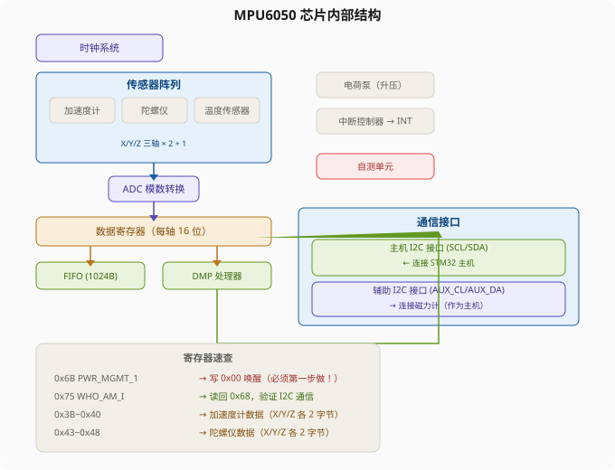
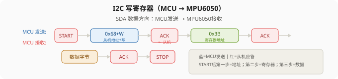
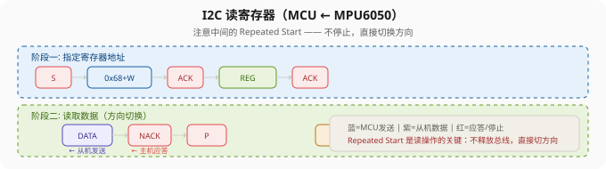

# STM32 MPU6050 六轴传感器简介 — 学习笔记

> **视频来源**: [B站 江协科技 STM32入门教程-2023版 p32 [10-2]](https://www.bilibili.com/video/BV1th411z7sn?p=32)
> **芯片型号**: STM32F103C8T6 + MPU6050
> **前置知识**: I2C 通信协议基础（p31）
> **本节定位**: MPU6050 硬件与寄存器层面的认识（纯介绍课，下节课讲软件读写）

---

## 一、MPU6050 是什么

MPU6050 是 InvenSense（后被 TDK 收购）推出的一款 **六轴 MEMS 传感器芯片**，内部集成了三轴加速度计和三轴陀螺仪，能同时输出六个维度的运动数据。这六个轴分别对应空间中的六个自由度——三个方向的平动和三个方向的转动，所以叫"六轴"。

市面上常见的还有九轴传感器（如 MPU9250），在六轴基础上再加一个三轴磁力计。MPU6050 虽然没有内置磁力计，但它提供了一个辅助 I2C 接口，可以外挂一个磁力计（如 AK8963 或 HMC5883L），由 MPU6050 内部的 DMP 统一管理和读取，对外呈现出九轴传感器的效果。所以想要九轴功能的话，再买一个磁力计模块接上去就行。

> **应用场景**: 手机屏幕自动旋转、体感游戏手柄、无人机姿态控制、机器人平衡、智能手表计步——凡是需要检测运动和姿态的地方，几乎都能看到这类 MEMS 传感器。

---

## 二、模块硬件电路分析

### 2.1 引脚定义

MPU6050 模块（常见的紫色/蓝色小板）引脚排列如下：

| 引脚 | 名称 | 方向 | 功能说明 |
|:---:|:---|:---|:---|
| 1 | `VCC` | 输入 | 供电输入（3.3V~5V，经板载 LDO 稳压到 3.3V） |
| 2 | `GND` | — | 电源地 |
| 3 | `SCL` | 输入 | I2C 时钟线（接 MCU 的 SCL） |
| 4 | `SDA` | 双向 | I2C 数据线（接 MCU 的 SDA） |
| 5 | `XDA` | 双向 | 辅助 I2C 数据线（接外部磁力计） |
| 6 | `XCL` | 输出 | 辅助 I2C 时钟线（接外部磁力计） |
| 7 | `ADO` | 输入 | I2C 地址选择位（低电平=0x68，高电平=0x69） |
| 8 | `INT` | 输出 | 中断输出（自由落体、运动检测等事件触发） |

### 2.2 LDO 供电电路

模块上有一颗 3.3V 的 LDO（低压差线性稳压器），输入端 `VCC` 可以接 3.3V 到 5V，经过 LDO 输出稳定的 3.3V 给 MPU6050 芯片。

> **注意**: MPU6050 芯片本身的 `VDD` 供电范围是 2.375V~3.46V，属于 3.3V 设备，**不能直接接 5V**！如果你有稳定的 3.3V 电源，可以直接接到模块输出端的 3.3V 焊盘上，绕过 LDO。

模块上还有一个电源指示灯 LED，只要 3.3V 端有电就会亮，方便确认供电是否正常。

### 2.3 ADO 地址引脚

ADO 是 I2C 从机地址选择引脚。MPU6050 的 7 位 I2C 地址由 ADO 的电平决定：

| ADO 电平 | 7 位从机地址 | 说明 |
|:---|:---|:---|
| 低电平（GND） | `0b1101000` = `0x68` | 模块默认，板载下拉电阻 |
| 高电平（VCC） | `0b1101001` = `0x69` | 同一总线上挂两个 MPU6050 时用 |

模块电路上 ADO 默认通过一个下拉电阻接到了 GND，所以悬空就是低电平，默认地址为 `0x68`。如果同一根 I2C 总线上需要挂两个 MPU6050，可以把其中一个的 ADO 接到 VCC，区分地址。

> **提示**: 实际写代码时要注意，很多 I2C 库函数接收的是 7 位地址左移一位后的值（即 8 位带读写位的格式），如果传错了地址就会收不到 ACK。这个坑在下一节课写代码时会具体讲。

---

## 三、芯片内部结构：模块框图走读

### 3.1 传感器部分

MPU6050 内部集成了三个独立的 MEMS 传感器：

- **三轴加速度计（Accelerometer）**：检测 X、Y、Z 三个方向的加速度。原理类似于一个"弹簧-质量块"结构——当发生加速运动时，质量块产生位移，位移量通过可变电容转换成电信号，再经 ADC 转为数字量。
- **三轴陀螺仪（Gyroscope）**：检测绕 X、Y、Z 三个轴的角速度。基于科里奥利力原理，内部有振动的 MEMS 结构。
- **温度传感器（Temperature Sensor）**：测量芯片温度。因为 MEMS 传感器的输出会受温度影响（温漂），内置温度传感器可以用于温度补偿。

### 3.2 ADC 与数据寄存器

所有传感器的输出都是模拟电压，经过内部 ADC 转换为数字量。每个轴的数据都是 **16 位有符号整数**（-32768 ~ +32767），存放在对应的数据寄存器中。加速度计和陀螺仪的输出量程可配置，量程越大分辨率越低，下节课会详细讲解配置方法。

与之前学的 STM32 ADC 不同，MPU6050 内部的数据转换是**全自动静默进行**的——你只要配置好采样率，传感器就会按固定频率自动把新数据刷新到寄存器中，不会发生数据覆盖的问题。需要数据的时候直接去读寄存器就行了，不需要管 ADC 什么时候启动、什么时候完成。

### 3.3 自测功能（Self-Test）

每个传感器都有一个自测单元。启动自测后，芯片内部会模拟一个外力施加在传感器上，此时读到的数据会比平时大一些。

自测流程：
1. 启用自测 → 读取数据 A
2. 禁用自测 → 读取数据 B
3. 计算差值 `Δ = A - B`（称为"自测响应"）

芯片数据手册给出了自测响应的正常范围。如果 Δ 在这个范围内，说明芯片正常；如果不在，芯片可能损坏了。这个功能在量产测试和故障诊断时很有用。

### 3.4 电荷泵（Charge Pump）

陀螺仪内部需要较高的驱动电压，所以 MPU6050 内置了一个电荷泵升压电路。CPOUT 引脚需要外接一个电容。

电荷泵的工作原理可以用一个通俗的比喻理解：我有一个 5V 的电池，还有一个电容。先把电池和电容**并联**——电池给电容充电，充完之后电容也是 5V。然后瞬间切换电路，把电池和电容**串联**——5V 电池 + 5V 电容 = 10V 输出！当然电容的电荷量很少，用一下就没电了，所以切换速度必须非常快，趁电容还没放完电就赶紧切回并联充电。这样一直循环"并联充电 → 串联放电 → 并联充电 → 串联放电"，再经过滤波，就能实现平稳的升压输出。

> **提示**: 电荷泵升压过程是全自动的，不需要我们干预，知道有这么个东西就行。CPOUT 引脚上的电容按照数据手册的要求选即可。

### 3.5 数字运动处理器（DMP）

DMP 是 MPU6050 的一大特色。它是芯片内部的一个硬件加速器，专门用来做**姿态解算**——也就是把加速度计和陀螺仪的原始数据融合成四元数或欧拉角（俯仰/横滚/偏航）。姿态解算算法本身比较复杂（涉及卡尔曼滤波、互补滤波等），如果让 STM32 的 CPU 来做，开销会很大。而 DMP 是硬件实现的，配合 InvenSense 官方提供的 DMP 固件库，可以省去自己在 MCU 上实现算法的麻烦。

> **注意**: 本课程暂不涉及 DMP，本节的重点是学会如何通过 I2C 读写 MPU6050 的寄存器，获取原始传感器数据。

### 3.6 FIFO 缓冲区

MPU6050 内置一个 1024 字节的 FIFO，可以把传感器数据先缓存起来，再统一通过 I2C 读取。这在需要降低 I2C 读取频率、或者需要在中断中批量取数据的场景下非常方便。不过本章暂时用不到 FIFO，先了解其存在即可。

### 3.7 辅助 I2C 接口

MPU6050 有两个 I2C 接口：

- **主 I2C 接口（连接 MCU）**：`SCL` 和 `SDA`，MPU6050 作为从机，接收 MCU 的读写命令
- **辅助 I2C 接口（连接磁力计）**：`AUX_CL` 和 `AUX_DA`（即 XCL 和 XDA），MPU6050 作为主机，主动读取磁力计数据。这个接口的好处是 MPU6050 内部的 DMP 可以直接拿到磁力计数据做九轴融合，MCU 不需要额外开通一个 I2C 通道去单独读磁力计。

---

## 四、寄存器概览

MPU6050 有大量的寄存器，这里先了解几个最重要的：

| 寄存器地址 | 名称 | 功能 |
|:---|:---|:---|
| `0x75` | WHO_AM_I | 器件 ID，上电默认为 `0x68`。读取这个寄存器可以验证 I2C 通信是否正常 |
| `0x6B` | PWR_MGMT_1 | 电源管理，bit6 写 1 复位所有寄存器，写 0 唤醒芯片（****先要做的操作**） |
| `0x1A` | CONFIG | 低通滤波器配置 |
| `0x1B` | GYRO_CONFIG | 陀螺仪量程配置（±250/500/1000/2000 °/s） |
| `0x1C` | ACCEL_CONFIG | 加速度计量程配置（±2/4/8/16 g） |
| `0x3B~0x40` | ACCEL_XOUT_H ~ ACCEL_ZOUT_L | 加速度计 X/Y/Z 数据（共 6 个寄存器） |
| `0x41~0x42` | TEMP_OUT_H / TEMP_OUT_L | 温度数据 |
| `0x43~0x48` | GYRO_XOUT_H ~ GYRO_ZOUT_L | 陀螺仪 X/Y/Z 数据（共 6 个寄存器） |

> **关键**: 上电后，MPU6050 默认处于**睡眠模式**（PWR_MGMT_1 的 bit6 为 1）。在读写任何其他寄存器之前，必须先向 `0x6B` 写 `0x00` 将芯片从睡眠中唤醒，否则读出来的数据全是零！

---

## 五、I2C 读写时序回顾

结合上节学的 I2C 协议，MPU6050 的读写就是用"指定从机地址 → 指定寄存器地址 → 读写数据"的格式：

### 5.1 写寄存器（MCU → MPU6050）

### 5.2 读寄存器（MCU ← MPU6050）

注意读操作使用了 **Repeated Start**：先发"我要写"来指定要读哪个寄存器，然后不停止，直接发"切换为读"，开始接收数据。这是 I2C 最常见的读寄存器模式。

---

## 六、下节课预告与准备

下节课（p33）将进入实战——通过 I2C 通信读写 MPU6050 的寄存器，获取加速度计、陀螺仪和温度数据，并在 OLED 上显示。需要提前准备：

1. MPU6050 模块一块（常见的紫色小板）
2. 杜邦线 4 根（VCC、GND、SCL、SDA）
3. 检查 I2C 引脚：STM32F103C8T6 的 `PB6` 是 I2C1_SCL，`PB7` 是 I2C1_SDA（重映射后）

### 常见问题预判

| 现象 | 原因 | 解决方法 |
|:---|:---|:---|
| WHO_AM_I 读不到 `0x68` | I2C 通信失败（没接上拉电阻、地址错了、芯片在休眠） | 检查 4.7kΩ 上拉、地址 `0x68`、先写 `0x6B=0x00` 唤醒 |
| 数据全为零 | 芯片在睡眠模式，传感器没工作 | 确认已写 `PWR_MGMT_1 = 0x00` |
| SDA 一直被拉低 | 模块损坏或接线错误 | 断开 SDA 测模块端电平，排除硬件问题 |
| 数据跳动大 | 没配置低通滤波器 | 设置 `CONFIG` 寄存器启用 DLPF |

---

*笔记生成时间: 2026-06-17 | 基于 B站视频 BV1th411z7sn p=32 转录*
