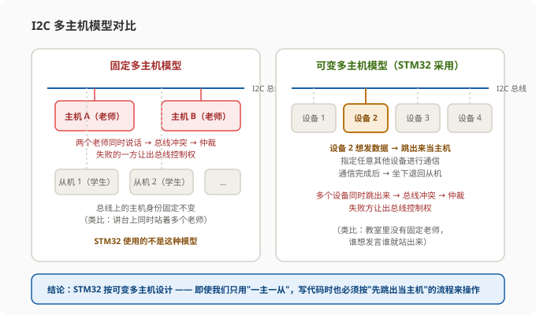
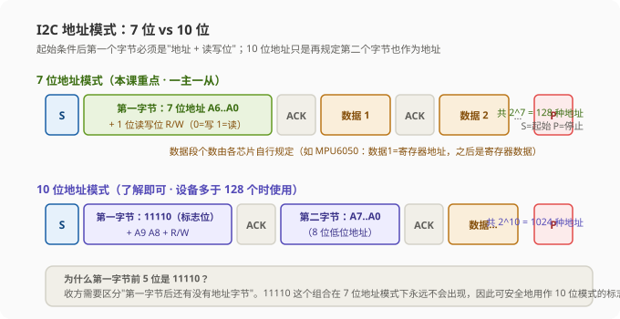
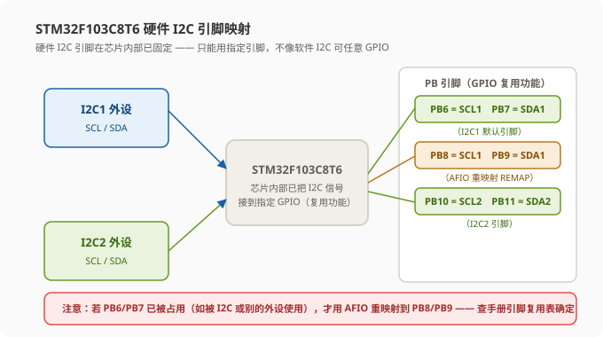
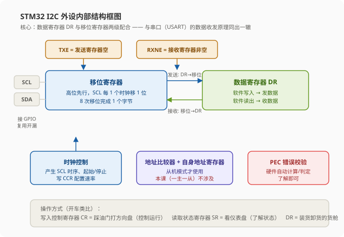
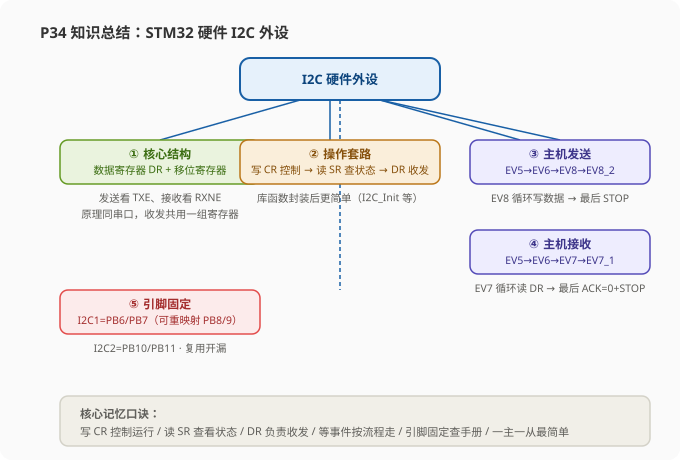

# STM32 [10-4] I2C 通信外设 — 学习笔记

> **视频来源**: [B站 江协科技 STM32入门教程-2023版 p34 [10-4]](https://www.bilibili.com/video/BV1th411z7sn?p=34)
> **芯片型号**: STM32F103C8T6
> **前置知识**: I2C 通信协议（p31）、MPU6050 简介（p32）、软件 I2C 读写 MPU6050（p33）
> **本节定位**: 硬件 I2C 外设的原理、内部结构、寄存器与主机收发流程（纯理论课，程序现象与软件 I2C 一致，故不做演示，下一节 p35 再写代码）

---

## 一、课程概览：从软件 I2C 到硬件 I2C

前两节课我们已经了解了 I2C 的协议规定和通信意义，并且用 GPIO 口模拟的软件 I2C 实现了读写 MPU6050 的程序。在这个过程中可以发现一个规律：**I2C 通信协议中，时序（波形）是最重要的东西**。只要理解清楚了时序的意义，就能按照协议规定去翻转通信引脚的高低电平；只要我们翻转产生的波形符合 I2C 协议的规定，通信双方就能理解并解析这个波形，通信自然而然就实现了。

之前我们用的是软件模拟时序：手动拉低或释放 SDA 数据线，然后对每个数据位依次判断、拉低或释放数据线，这样来产生波形。这种软件方式之所以可行，是因为 **I2C 是同步时序**——每一位的时序时间要求并不严格，某一位时间长一点、短一点，甚至中途暂停一会儿，对时序的影响都不大。所以 I2C 是比较容易用软件模拟的，在实际应用中软件模拟 I2C 也是非常常见的。

> **原理**: 为什么同步时序这么"宽容"？因为同步通信有 SCL 时钟线"打拍子"，数据线 SDA 的高低变化都被 SCL 的时钟沿同步，收方只在约定好的时钟沿读取数据。时间长短只影响速度，不影响正确性。而异步通信（如串口）没有时钟线，收方靠约定的波特率来采样，所以每一位的时间必须严格，不能过长过短，更不能中途暂停。

但作为一个协议标准，I2C 通信也是可以有硬件收发电路的，就像之前的串口（USART）一样。回想串口的学习过程：我们先讲了串口的时序波形，但在程序中并没有用软件去手动翻转电平来实现这个波形。这是因为串口是异步时序，每一位的时间要求很严格，软件模拟操作起来比较困难；再加上串口的硬件收发器在单片机中普及程度非常高，基本上每个单片机都有串口的硬件资源，而且硬件实现的串口使用起来还非常简单——配置 USART 外设，写入数据寄存器 DR，硬件收发器就会自动产生波形发送数据，最后等待发送完成的标志位即可。所以串口通信基本都是用硬件收发器来实现的。

而 I2C 这里，既可以有软件模拟，也可以有硬件收发器自动操作：

| 特性 | 串口（USART） | I2C |
|:---|:---|:---|
| 时序类型 | 异步（每位时间要求严格） | 同步（每位时间要求宽松） |
| 软件实现 | 很麻烦，基本不用 | 简单灵活，很常见 |
| 硬件实现 | 非常简单，几乎全用硬件 | 可以省心，但也不能完全放心 |
| 实际倾向 | 全部倒向硬件 | 软件模拟仍大量存在 |

**那为什么还要学硬件 I2C？** 因为硬件 I2C 也有很多优点：执行效率比较高、可以节省软件资源、功能比较强大（可以支持完整的多主机通信模型）、时序波形规则的一致性更好、速率快等等。所以硬件方式也有相应的应用场景——如果你只是简单应用，可以选择比较灵活的软件方式；如果对性能指标要求比较高，就可以考虑硬件方式。

> **提示**: 本小节是纯理论课，讲的硬件 I2C 外设程序现象和软件 I2C 完全一样（都是实现 I2C 通信），所以老师不演示程序，直接把精力放在讲清楚"硬件外设到底长什么样、怎么用"上。

---

## 二、硬件 I2C 外设简介

首先看 I2C 外设的简介，第一条：**STM32 内部集成了硬件 I2C 外设**，就像之前的 USART——USART 是串口通信的硬件收发器，这里的 I2C 外设就是 I2C 通信的硬件收发器。

有了硬件收发器之后，就可以由硬件自动执行：自动产生起始条件、终止条件，自动生成地址，自动进行数据收发等功能。也就是说，**有硬件电路来自动翻转电平、执行时序，软件只需要写入控制寄存器 CR 和数据寄存器 DR，就可以实现协议了**。当然，为了实时监控时序的状态，软件还得读取状态寄存器 SR，才能了解外设电路当前处于什么状态。

> **原理**（老师的开车类比）: 写入控制寄存器 CR，就像是踩油门、打方向盘来控制汽车运行；读取状态寄存器 SR，就像是观看仪表盘来了解汽车的运行状态。有了这些寄存器，我们就可以完全掌控外设电路的运行。等 STM32 的库函数封装之后，这个操作就更简单了——调用函数给个参数，函数内部就会自动配置或读取各种寄存器。

那么这个外设存在的意义是什么呢？有了 I2C 外设之后，**由硬件自动实现时序，就可以减轻 CPU 的负担、节省软件资源**；另外由硬件来做这个事情，可以更加专注时序本身的性能，效率也会更高。这就是 I2C 外设存在的意义——用硬件电路实现 I2C 通信。

---

## 三、I2C 外设功能特性

接着看 I2C 外设的功能介绍。STM32 的 I2C 外设支持：

- **多主机模型**（multimaster）
- **7 位或 10 位地址模式**
- **不同的通信速度**：标准速度高达 100 kHz，快速高达 400 kHz
- **兼容 SMBus 协议**（系统管理总线）

> **注意**: 这些功能大家都只需要了解，不需要完全掌握。因为 I2C 协议还是比较庞大的，硬件 I2C 作为一个专业的外设，它的设计比较复杂，基本支持 I2C 协议的所有规定。但在实际应用中，我们只需要那个最简单、最常用的应用领域——**普通的一主多从模型、7 位地址的模式**。如果你完全没学外设的东西，想自己看手册学习 I2C，那基本是学不会的：手册上来就是 I2C 的完整设计，包括从发送、从接收、主发送、主接收四种模式，一会儿是从模式一会儿是主模式，一会儿几个模式互相切换，还有 7 位地址和 10 位地址等等，涉及得比较复杂。只有先把简单的 I2C 通信学会了，再回来仔细看，这才容易理解。

所以本节内容只要求掌握**一主多从、7 位地址的 I2C**。对于多主机模型、10 位地址这些东西，都只需要了解即可。下面老师把这两块大概介绍一下，方便大家理解后续内容。

### 3.1 多主机模型

I2C 通信分为主机和从机：主机是拥有主动控制总线权利的一方，而从机只能在主机允许的情况下才能控制总线。

在一主多从的情况下很简单——假设这是 I2C 总线，上面这个是唯一的主机，下面这里可以挂多个从机。整个过程很容易操作：主机一个人掌控所有，所有从机都得听它的话，不存在什么通信冲突。

而进阶版的 I2C 还涉及多主机的模型。多主机模型又可以分为**固定多主机**和**可变多主机**：

- **固定多主机**：总线上有两个或更多个固定的主机，上面这几个始终固定为主机，下面这几个始终固定为从机。这个状态就像在教室里讲台上同时站了多个老师，下面坐的所有学生可以被任意一个老师点名，老师可以主动发起对学生的控制，学生不能去控制老师。当两个老师同时想说话时，就是总线冲突状态，这时就要进行总线仲裁了——仲裁失败的一方让出总线控制权。
- **可变多主机**：假设 I2C 总线可以挂多个设备，总线上没有固定的主机和从机，任何一个设备都可以在总线空闲时跳出来作为主机，然后指定其他任何一个设备进行通信；当这个通信完成之后，这个跳出来的主机就要退回到从机的位置。这就像教室里面只有一堆学生、没有老师——平时所有学生都是从机，都不能说话；当然某个学生想说话时，就得跳出来变成主机，然后指定其他任何一个学生进行通信，通信完成后再坐下变为从机。当有多个学生同时跳出来时，就是总线冲突状态，这时就要进行总线仲裁，仲裁失败的一方让出总线控制权。

> **关键**: 对于 STM32 的 I2C 而言，它使用的是**可变多主机的模型**。虽然我们只需要一主一从（没人跟 STM32 去争主机的位置），但 STM32 是按照可变多主机的模型设计的，所以我们还是得按照"谁要发数据，谁就跳出来当主机"的流程来操作。这一点在写代码时非常重要——即使你只想让 STM32 当唯一的主机，也要老老实实地走"跳出为主机"的流程。

### 3.2 7 位地址 vs 10 位地址

从之前的时序可以看到，我们使用的是 7 位地址的模式：起始条件之后紧跟的第一个字节，必须是 7 位地址加读写位。这种 7 位地址是最简单、最常见的。

但 7 位地址只有 128 种情况（2^7 = 128），如果设备非常多就不够用了。比如一条总线必须挂 128 个以上的设备，那 7 位地址必然不够用；另外如果有非常多的厂商都来申请 I2C 地址，也必然会有部分型号的芯片地址是一样的。对于不同芯片的地址一样其实也好办——因为地址的低位通常是可配置的，前面都一样，我配置后面不一样就行了，只要你不在一条总线上挂过多的设备就行。另外即使确实需要很多设备、在配置都允许的情况下，也可以开辟多条 I2C 总线来解决。所以地址的问题一般好解决。

当然，在协议上分配更多的地址也是一种可行的方案，于是 **I2C 协议就支持 10 位地址模式**，10 位地址最多有 1024 种情况（2^10 = 1024）。那 10 位地址是如何设计的呢？之前说了 I2C 起始之后的第一个字节必须是"地址加读写位"，这一个字节只能有 7 位地址。那我只需要再规定起始之后的前两个字节都作为地址，这不就行了吗？

这就是 10 位地址的基本思路：第一个字节有 7 个空位，第二个字节有 8 个空位，加起来是 15 位地址，但 I2C 只有 10 位地址模式，还有 5 位跑哪去了呢？这 5 位被当作标志位去了——因为你发送第一个字节之后，谁也不知道后面这个字节还是不是地址呢，所以这就需要在第一个字节写一个特定的数据作为 10 位地址模式的标志位。这个标志位就是 **11110**：如果你第二个字节也是地址，那第一个字节的前 5 位就必须是 11110。你看这里，前 5 位是 11110 就代表它是 10 位地址；如果前 5 位不是 11110，那它就是 7 位地址。如果是 10 位地址，那么第一个字节剩下的 2 位和第二个字节的 8 位都作为地址，加起来正好 10 位地址。当然，11110 这个组合作为 10 位地址模式的标志位，它是不会在 7 位地址模式下出现的。

> **原理**: 为什么选 11110 当标志位？因为收方需要区分"第一字节后面还有没有第二个地址字节"。如果前 5 位是 11110，说明后面还有第二个地址字节（10 位地址）；否则就是 7 位地址，后面紧跟的是数据。11110 这个组合在 7 位地址模式下永远不会出现，因此可以安全地用作 10 位模式的标志位，不会造成歧义。

### 3.3 其他功能特性

- **通信速度**：标准速度高达 100 kHz，快速高达 400 kHz。这个速度是协议规定的：如果某个设备声称支持快速 I2C，那它就支持最大 400 kHz 的时钟频率。当然作为一个同步协议，时钟并不严格，只要不超过最大频率多少就可以，所以这个频率的具体值我们一般关注不多。
- **多字节传输**：在连续传输的时候可以提高传输效率。比如指定地址读多字节或写多字节的时候，如果想连续读或写非常多的字节，那用一下多字节传输（burst 模式），这种"边传输边递进地址"的过程效率就会大大提升。当然如果只有几个字节，那就没必要用多字节传输。
- **兼容 SMBus 协议**：SMBus 是系统管理总线，由 I2C 总线发展而来，主要用于电源管理系统。SMBus 和 I2C 非常相似，所以 STM32 的 I2C 外设就顺便兼容了一下 SMBus。这个了解下即可，我们主要学习 I2C。

---

## 四、I2C 资源与引脚

最后看一下我们这个型号（STM32F103C8T6）的硬件 I2C 资源：**有 I2C1 和 I2C2 两个独立的 I2C 外设**。

可以看出来，硬件 I2C 和软件 I2C 的区别之一就是资源限制：硬件 I2C 必须要有硬件电路的支持，所以硬件 I2C 的资源是有限的——比如我们这个型号的 STM32 最多就只能有两路硬件 I2C。而软件 I2C 一般没有很大的限制，我们只需要复制一下代码就可以开辟一条新的软件 I2C，只要代码能存得下，基本上想开几路就开几路，没有资源的限制。这是硬件 I2C 和软件 I2C 资源上的差异。

像这种外设模块引出的引脚，一般都是接触 GPIO 口的复用功能与外部世界相连的。具体是复用在哪两个 GPIO 口呢？要查引脚定义表（在"复用功能"这一栏查找）：

| 外设 | 默认引脚 | 可重映射引脚 |
|:---|:---|:---|
| `I2C1` | `PB6` = SCL1，`PB7` = SDA1 | `PB8` = SCL1，`PB9` = SDA1（AFIO 重映射） |
| `I2C2` | `PB10` = SCL2，`PB11` = SDA2 | 无 |

> **注意**: 因为内部电路设计的时候这些引脚就是连接好的，所以如果想使用硬件 I2C，就只能使用它连接好的指定引脚，不像软件 I2C 那样任意引脚都可以。硬件 I2C 引脚就是固定的这几个，不能随便指定，所以硬件 I2C 对引脚的限制也比较大。这一点用的时候要注意——如果 PB6/PB7 被别的功能占用了，就要查手册看能否重映射到 PB8/PB9。

---

## 五、I2C 外设框图详解

了解了 I2C 外设的用途和设计之后，来看 I2C 外设的框图（内部结构图）。

左边这里是这个外设的通信引脚 SDA 和 SCL，这是 I2C 通信的两个引脚。上面还有一个 SMBAL 引脚是 SMBus 用的，I2C 用不到，不用管它。

**SDA 数据收发部分（核心）**：数据收发的核心部分是这里的数据寄存器和数据移位寄存器。当我们需要发送数据时，可以把一个字节数据写到数据寄存器 DR；当移位寄存器没有数据在移位时，这个数据寄存器的值就会进一步转到移位寄存器里；在移位的过程中，我们就可以直接把下一个数据放到数据寄存器里等着了——一旦前一个数据移位完成，下一个数据就可以无缝衔接继续发送。当数据由数据寄存器转到移位寄存器时，就会置状态寄存器的 TXE 为 1，表示发送寄存器为空，这就是发送的流程。

在接收时也是这一路数据：数据从引脚逐位移入移位寄存器里；当一个字节的数据收齐之后，数据就整体从移位寄存器转到数据寄存器，同时置标志位 RXNE（读作"receive not empty"），表示接收寄存器非空，这时候我们就可以把数据从数据寄存器读出来了。

> **原理**: 这个流程和之前的串口（USART）是不是一样？串口的数据收发也是由数据寄存器和移位寄存器两级实现的，只不过串口是双工（数据收和发是分开的），在 I2C 这里是半双工，所以数据收发用的是同一个数据寄存器和移位寄存器。但是数据寄存器和移位寄存器的配合设计，实际思路都是一曲同工（两级流水线，一边移位一边准备下一个字节）。

**时钟控制部分**：时钟控制是用来控制 SCL 线的，控制时钟寄存器 CR 写对应的位，电路就会执行对应的功能；控制逻辑电路也是个"黑盒"，写入控制寄存器可以对整个电路进行控制，读取状态寄存器可以得知电路的工作状态。具体控制细节这里不深究，把它当作一个黑盒即可。另外当内部有些标志位置 1 之后，可能事件比较紧急，就可以申请中断——如果我们开启了中断，当这个事件发生后程序就可以跳到中断服务函数来处理这个事件；还有 DMA 请求，在多字节数据传输时可以配合 DMA 来提高效率。中断和 DMA 都了解一下即可。

**地址比较器与自身地址寄存器**：数据收发下面还有两个模块——地址比较器和自身地址寄存器。这两个块在从机模式才使用：前面说了 STM32 的 I2C 是按可变多主机模型设计的，STM32 不进行通信的时候就只是个从机。既然作为从机，它就应该可以被别人寻址；想被别人寻址，它就应该有从机地址。从机地址是多少呢？就可以由自身地址寄存器（OAR1/OAR2）来指定。当 STM32 作为从机被选中时，如果收到的地址通过比较器判断和自身地址相同，STM32 就作为从机响应外部主机的寻址。并且这个外设支持同时响应两个从机地址，所以就有自身地址寄存器 OAR1 和 OAR2。这一块需要放在多主机模型下理解——STM32 作为从机才需要这部分。当然我们只要求一主一从的模型，STM32 不会做从机，所以这一块就不需要配置。

**PEC 错误校验**：这也是了解内容。这是 STM32 设计的一个数据校验模块：当我们发送一个多字节的数据帧时，硬件可以自动执行 I2C 校验计算（PEC，一种很长的数据校验算法），它会根据前面这些数据经过各种数据运算得到一个校验位，附加在这个数据帧后面；在接收到这一帧数据后，硬件也可以自动执行校验判定，如果数据在传输过程中出错了，校验算法就通不过，硬件就会置校验错误标志位，告诉你数据错了。这个校验过程就跟串口的奇偶校验差不多，也是用于进行数据有效性检查的。当然这一块我们也不会用，了解即可。

**基本结构图**：把框图中用不到的东西去掉，整理一下得到内部的简化结构：首先是移位寄存器和数据寄存器 DR 的配合，这是通信的核心部分。因为 I2C 是高位先行，所以这个移位寄存器是向左移位的，在发送的时候最高位先移出去（代表最高位），每一个 SCL 时钟移位一次，移位八次，这样就能把一个字节从高到低依次放到 SDA 线上了。在接收的时候，数据通过 GPIO 口从右边依次移入，最终移八次，一个字节就接收完整了。

---

## 六、GPIO 复用开漏输出

使用硬件 I2C 的时候，两个对应的 GPIO 口**必须配置成复用开漏输出模式**：

- **复用（AF）**：GPIO 的状态交由片上外设控制，不再由 GPIO 模块自己控制输出。I2C 外设的输出就接在这里，通过控制 MOS 管的通断，进而控制这个引脚是拉低到低电平还是释放（悬空，由外部上拉电阻拉高）。
- **开漏输出（Open-Drain）**：这是 I2C 协议要求的。看 GPIO 内部结构，推挽输出有上管（PMOS）和下管（NMOS），而开漏输出模式只有下管（NMOS）没有上管（PMOS）——所以叫"开漏"，也就是漏极开路。I2C 外设的输出接到这里之后，控制这个 NMOS 的通断，进而控制这个引脚是拉低到低电平还是释放。
- **输入仍然有效**：虽然配置成开漏输出，但 GPIO 的输入一路仍然有效。引脚的高低电平通过输入电路进入片上外设进行复用功能输入（读 SDA），所以主机才能读到从机放上来的数据。

> **关键**: 为什么 I2C 必须用开漏输出？因为 I2C 总线是"线与"结构——多个设备共享两条线，任何一个设备都能把 SDA/SCL 拉低。开漏输出允许设备只能拉低或释放（不能主动拉高），高电平完全靠上拉电阻提供。这样多个设备同时操作总线时不会发生"一个输出高、一个输出低导致短路"的问题。软件 I2C 用推挽输出也能工作（因为主机独占），但硬件 I2C 设计上就是按开漏+上拉来工作的，所以必须配复用开漏。

---

## 七、主机发送流程（EV5 / EV6 / EV8 / EV8_2）

手册上给出了主机发送和主机接收的操作流程图。这个操作流程图告诉我们要想产生 I2C 时序，什么时候该干什么、什么时候会产生什么事件。写程序的时候也就是参考这个流程来写的，所以要仔细分析一下。

手册里给出了从机发送、从机接收、主机发送、主机接收四个流程图，从机部分我们暂时不管，只看主机发送和主机接收。10 位地址的流程和 7 位地址的区别是：7 位地址起始条件后的一个字节是地址，10 位地址起始条件后的两个字节都是地址。这里主要关注 7 位地址。

先理解一个概念——**事件（EV）是什么**：为什么设计成"EV 事件"而不是直接说"什么标志位"？因为有的状态会同时产生多个标志位，所以一个 EV 事件就是**组合了多个标志位的一个大标志位**。在库函数中也有对应的检查 EV 事件是否发生的函数（`I2C_CheckEvent`），所以你就把它当成一个大标志位来理解即可。

**7 位地址主机发送时序**：起始条件之后是从机地址 + 应答，后面是数据 1 + 应答、数据 2 + 应答……最后是停止条件 P。因为协议规定起始之后必须是地址，至于后面数据的含义并没有明确的规定，这些数据可以由各个芯片厂商自己来规定。比如 MPU6050 规定：选择之后数据 1 为指定寄存器地址、数据 2 为指定寄存器地址下的数据，之后的数据就是从指定寄存器地址开始一直往后写——这就是一个典型的"指定寄存器"的时序流程。

具体流程（对照[主机发送流程图](diagrams/主机发送流程.svg)）：

1. **写 CR1 的 START 位产生起始条件**：复位之后总线处于空闲状态，STM32 此时是从模式。为了产生一个起始条件，需要写入控制寄存器 CR1，其中有个 START 位，在这一位置 1 协议就可以产生起始条件了。当起始条件发出后这一位可以由硬件自动清除。所以只要在这一位置 1，STM32 就自动产生起始条件（这就是前面说的"写入控制寄存器 = 踩油门打方向盘"）。之后 STM32 就从从模式转为主模式（也就是多主机模型下，STM32 有数据要发就要"跳出来"）。
2. **等待 EV5 事件（SB = 1）**：控制完硬件电路之后，我们就要检查标志位来看看硬件有没有达到我们想要的状态。起始条件发出之后会发生一个 EV5 事件——SB 标志位置 1，SB 是状态寄存器 SR1 的一个位，表示"起始条件已发送"。按照正常流程，读 SR1 之后写数据寄存器 DR 的操作会自动清除该位，所以状态寄存器是不需要手动清除的。
3. **写 DR 发送从机地址**：检测到起始条件已发送时，就可以发送一个字节的从机地址。从机地址需要写到数据寄存器 DR。写 DR 之后硬件电路就会自动把这一字节转到移位寄存器里，再把这个字节发送到 I2C 总线上。之后硬件会自动接收应答位并判断：如果没有应答，硬件就会置应答失败的标志位（AF），这个标志位可以触发中断来提醒我们。
4. **等待 EV6 事件（ADDR = 1）**：地址发送完成之后会发生 EV6 事件——ADDR 标志位置 1，在主模式状态下代表地址发送完成。这个事件对应的标志位需要读 SR1 再读 SR2 才会清除（库函数里会处理）。
5. **写 DR 发送数据 1，等待 EV8 事件（TXE = 1）**：接下来是 EV8 事件——TXE 标志位等于 1，代表移位寄存器空、数据寄存器空，这时需要我们写入数据到 DR 进入数据发送。一旦写入 DR 之后，因为移位寄存器也是空的，DR 会立刻转到移位寄存器进行发送，这时就变成了 EV8_2 事件的状态（移位寄存器非空、数据寄存器空），也就是移位寄存器正在发数据的状态。这里数据的时序就体现了数据寄存器和移位寄存器的配合——**发送的时候数据先写入数据寄存器，如果移位寄存器没有数据，再转到移位寄存器进行发送**，这个流程要理解清楚，否则看到"移位寄存器非空、数据寄存器空"就不知道是啥意思了。
6. **重复 EV8 流程发送后续数据**：在数据 2 的位置，写入 DR 会清除 EV8 事件；数据 1 接收应答位之后数据 2 就转入移位寄存器进行发送，此时又是 EV8_2 的状态。当数据 1 还在移位发送时，下一个数据已经被写到数据寄存器里等着了。所以按照这个流程，**一旦检测到 EV8 事件（TXE=1）就可以写入下一个数据**，形成两级流水线。
7. **等待 EV8_2 事件（TXE=1 且 BTF=1）**：到我们想要发送的数据都写完之后，就没有新的数据可以写入数据寄存器了。当移位寄存器当前的数据移位完成时，此时就是移位寄存器空、数据寄存器也空的状态，这个事件就是 EV8_2——TXE 等于 1（数据寄存器空），BTF 等于 1（字节发送结束标志）。BTF 的定义是：发送时当一个新数据将被发送且数据寄存器还未写入新的数据时，BTF 标志位置 1。意思就是当前移位寄存器已经移完了，该找数据寄存器要下一个数据了，但一看数据寄存器没有数据，这就说明主机不想发了，这时就代表发送结束，是时候停止了。
8. **写 CR1 的 STOP 位产生停止条件**：检测到 EV8_2 事件之后就可以产生停止条件了。控制寄存器 CR1 中有 STOP 位，直到写 1 就会在当前字节传输或当前起始条件发送后产生停止条件。到这里一个完整的时序就发送完成了。

> **提示**: 整个过程看上去比较复杂，操作和事件也比较多。但简单总结就是：**写入控制寄存器 CR 或数据寄存器 DR，就可以控制时序单元的发生**（比如产生起始条件、发送一个字节）；时序单元发生后，**检查相应的事件（本质是查状态寄存器 SR）来等待时序单元的发送完成**；然后依次地"操作 → 等待 → 操作 → 等待"就能实现时序了。当然在程序中我们又有库函数，不需要实际去配置寄存器，所以这个过程会比想象中简单一些。等下一节写程序的时候再进一步理解，现在的流程大家先有个印象。

---

## 八、主机接收流程（EV5 / EV6 / EV7 / EV7_1）

接着看主机接收的流程。7 位地址主机接收的时序是：起始条件、从机地址加读位、应答，然后就是接收数据、发送应答，接收最后一个数据给非应答，最后停止。这里时序上"当前地址读"的方式需要我们自己组合一下（读 MPU6050 时就是先写寄存器地址，再用重复起始条件切换为读）。10 位地址读就复杂一些：起始后发送帧头（读写位是写），再发送第二字节的 8 位地址；要转入读时序，必须再发送重复起始条件、发送帧头（此时读写位是读），直接转入接收数据的时序。10 位地址的流程稍微复杂，主要看 7 位地址的就行。

具体流程（对照[主机接收流程图](diagrams/主机接收流程.svg)）：

1. **写 CR1 的 START 位产生起始条件**：和发送流程一样，写入控制寄存器 CR1 的 START 位置 1 产生起始条件。
2. **等待 EV5 事件（SB = 1）**：起始条件已发送。
3. **写 DR 发送从机地址（读方向）**：发送从机地址 + 读写位，此时读写位是 1（读方向）。地址接收应答之后产生 EV6 事件。
4. **等待 EV6 事件（ADDR = 1）**：地址发送完成。此后 SDA 的控制权交给从机，由从机放数据、主机读取。
5. **等待 EV7 事件（RXNE = 1）读数据 1**：EV7 事件——RXNE 标志位等于 1，数据寄存器非空，即收到一个字节的数据。当把数据读走之后这个事件就没有了。数据还没读走的时候，数据 2 就可以直接移入移位寄存器，之后数据 2 移位完成、收到数据、产生 EV7 事件、读走数据 2……按照这个流程就可以一直接收数据。
6. **重复 EV7 流程读后续数据**：注意每个字节接收完成时，硬件会自动根据我们的配置把应答位发送出去。应答位的配置看控制寄存器 CR1 里的 ACK 位：如果写 1，在接收一个字节后就返回一个应答（ACK）；写 0 就是不给应答（NACK）。
7. **最后一个数据前设 ACK = 0 和停止条件**：当我们不需要继续接收时，需要在最后一个时序单元发生时提前把刚才说的应答位控制寄存器 ACK 置 0，并设置终止条件（STOP 位）。这就是 EV7_1 事件——和 EV7 一样（RXNE=1），后面加了一句"设置 ACK 等于 0 和停止条件"。
8. **收完最后 1 字节 → 硬件发 NACK → 停止条件**：由于设置了 ACK=0，所以最后这个数据接收完成后就会给出非应答（NACK），告诉从机"不要再发了"；最后由于设置了停止位，就产生终止条件，一帧接收完成。

> **关键**: 主机接收和主机发送的区别就在结尾——发送是"没有新数据可写了"自然结束（EV8_2），接收是"我不想再收了"主动结束（EV7_1 设 ACK=0 + STOP）。为什么接收结束一定要发 NACK？因为从机一直在等你应答，你不发 NACK 它就以为你还要继续收，会一直把数据放上来。给 NACK 就是从机停止发送的信号。

整体上流程和发送差不多：写入控制寄存器 CR 和读取数据寄存器 DR 产生时序单元，然后等待相应的事件来确保时序单元完成。**这就是主机发送和主机接收的时序流程**，等下一节写程序的时候就对应这两个流程图来实现硬件 I2C 的代码。

---

## 九、软件 I2C vs 硬件 I2C 波形对比

这里老师用示波器抓取了软件 I2C 和硬件 I2C 的时序波形对比（上面是软件模拟的波形，下面是硬件外设的波形），可以看出这是一个"起始 + 多字节"的时序：

1. **电平变化基本一致**：从引脚电平变化的趋势上看，两者的波形都是一样的，对应的数据也都是一样的——毕竟都是按 I2C 协议在通信。
2. **时序的规则程度不同**：硬件 I2C 的波形会更加规则，每个时钟的周期和占空比都非常均匀；而软件 I2C 这里，每次操作引脚之后都加了延时，这个延时有时候加得多有时候加得少，所以软件时序的时钟周期和占空比可能不规则。当然因为 I2C 是同步时序，这也不规则也不影响通信。
3. **沿与数据的贴合度不同**：SDA 波形高电平读——虽然整个电平的任意时候都可以读写，但是一般要求保证"尽早"的原则，可以认为是 SCL 下降沿写、上升沿读。软件 I2C 在下降沿之后，因为操作端口之后有些延迟，所以等一会儿才进行写入操作，后面的写操作也是等一会儿；而硬件 I2C 数据写入都是紧贴下降沿的。
4. **ACK 之后的细节差异**：比如应答结束这个时刻，软件 I2C 从机在 SCL 下降沿立刻释放了 SDA，但软件 I2C 的主机过来一会儿才变化数据，所以这里就出现了一个短暂的高电平；而硬件 I2C 应答结束后，SCL 下降沿从机立刻释放 SDA，同时主机也立刻拉低 SDA，所以这里就出现了一个小尖峰。

> **提示**: 后面大家也可以继续对比，硬件操作的方式包括后面有些从机的硬件操作，这些 SDA 的数据变化都是在 SCL 的下降沿进行的；而这些软件操作的 I2C 波形可能就不是那么标准。当然还是因为 I2C 同步时序的原因，这种不标准的波形也完全不影响通信——这也正是同步时序的好处，可以容忍不标准的波形。这部分波形对比作为困难部分了解一下即可。

---

## 十、数据手册导读（第 24 章 I2C 接口）

最后看一下手册第 24 章 I2C 接口的内容：

- **简介和主要特点**：前面基本都介绍过了。其中有模式选择——因为这个硬件 I2C 是基于多主机的模型来设计的，所以这里就有从发送器、从接收器、主发送器、主接收器这四种模式。下面写的是：**复位模块默认工作在从模式接口，在产生起始条件后自动地从模式切换为主模式；当仲裁丢失或产生停止信号时，则从主模式切换回从模式**——允许多主机功能。这个应该就可以理解了，这就是 I2C 协议的内容。
- **功能框图**：前面讲过，就是对从模式和主模式的介绍。其中从模式包括从发送器和从接收器的流程，从模式不做要求，主要是主模式。上面有些整体的介绍、有些细节可能没讲过，可以再看看。
- **主发送器和主接收器的流程**：这是写程序的依据，要仔细分析（就是本笔记第七、八节的内容）。
- **错误条件**：其中包括总线错误、应答错误、总线冲突、过载（超载）错误等。这些就是当时序没有按照正常的情况进行时产生的错误标志位，可以触发中断，这是硬件的错误处理机制。
- **SMBus**：兼容的系统管理总线，暂时可以不看。
- **DMA 请求**：进行多字节的数据收发时可以配合 DMA 提高效率，需要的话可以看看。
- **PEC 错误校验**：硬件自带的 CRC 校验功能（PEC），需要的话可以看看。
- **I2C 中断**：发生一些事件或错误时置标志位，这个标志位可以申请中断，总共有表里这么多事件可以触发中断，需要的话可以开启对应的中断。

**寄存器总览**：

| 寄存器 | 作用 |
|:---|:---|
| `CR1` / `CR2`（控制寄存器） | 控制外设电路的运行：是否使能、是否应答、是否产生起始/停止条件、时钟频率（CCR 配置）等 |
| `OAR1` / `OAR2`（自身地址寄存器） | 设置从模式时自己的从机地址（OAR2 用于双地址模式）——我们使用不到 |
| `DR`（数据寄存器） | 数据收发时通过它读写数据，背后配合一个移位寄存器，是通信的核心部分 |
| `SR1` / `SR2`（状态寄存器） | 各种标志位，反映外设电路状态（SB、ADDR、TXE、RXNE、BTF 等） |
| `CCR`（时钟控制寄存器） | 决定通信的 SCL 频率，包括时钟的占空比 BRA 和分频系数——库函数会自动帮我们计算这些参数，公式不需要我们了解 |
| `TRISE`（上升时间寄存器） | 不用了解 |

> **提示**: 寄存器的具体位定义可以在手册第 24 章的寄存器描述小节查找，需要时查一下即可。有了库函数，平时写代码不需要直接操作这些寄存器，但知道"什么功能在哪个寄存器"对理解库函数和排查问题很有帮助。

---

## 十一、知识总结

**本节课的核心脉络**：

1. **为什么要有硬件 I2C**：同步时序让软件 I2C 简单灵活；但硬件 I2C 效率高、省资源、功能强（支持完整多主机模型）、时序规则、速率快——性能要求高就用硬件。
2. **外设本质**：硬件 I2C 就是 I2C 通信的硬件收发器，类似 USART 之于串口。软件只需"写 CR 控制 + 读 SR 查状态 + DR 收发数据"，库函数封装后更简单。
3. **数据收发核心**：数据寄存器 DR + 移位寄存器两级流水线配合，发送看 TXE、接收看 RXNE；原理与串口同出一辙，只是半双工共用一组寄存器。
4. **引脚**：硬件 I2C 引脚固定，I2C1 = PB6/PB7（可重映射 PB8/PB9）、I2C2 = PB10/PB11，GPIO 必须配置为复用开漏输出。
5. **主机发送**：EV5（起始已发）→ EV6（地址完成）→ EV8（TXE=1 循环写数据）→ EV8_2（TXE+BTF 发送结束）→ STOP。
6. **主机接收**：EV5 → EV6 → EV7（RXNE=1 循环读数据）→ EV7_1（最后 1 字节前设 ACK=0 + STOP）→ NACK → 停止。
7. **多主机与地址**：STM32 按可变多主机设计（谁要发谁跳出来）；实际只用一主多从 + 7 位地址即可，10 位地址了解其帧格式（第一字节前 5 位 11110 标志）。
8. **下一节预告**：p35 将对应主机收发流程图，用库函数实现硬件 I2C 读写 MPU6050 的代码。

---

*笔记生成时间: 2026-08-06 | 基于 B站视频 BV1th411z7sn p=34 转录*
