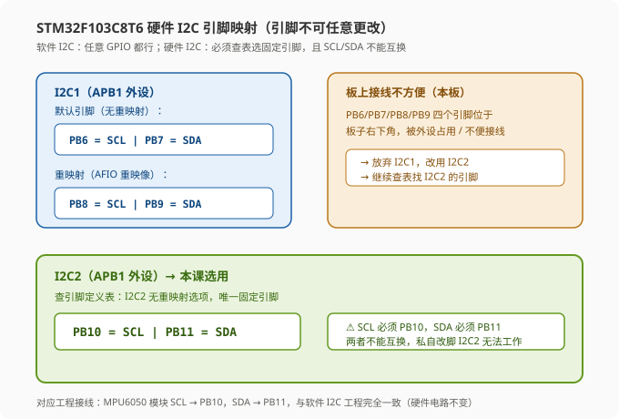
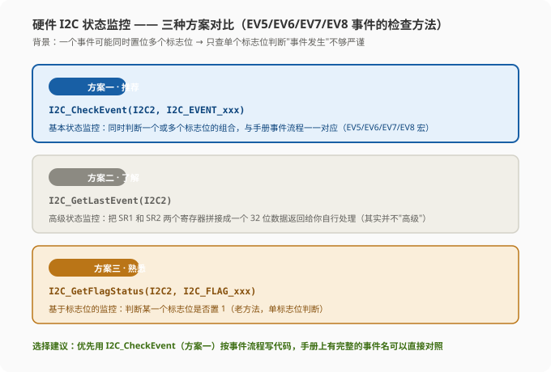
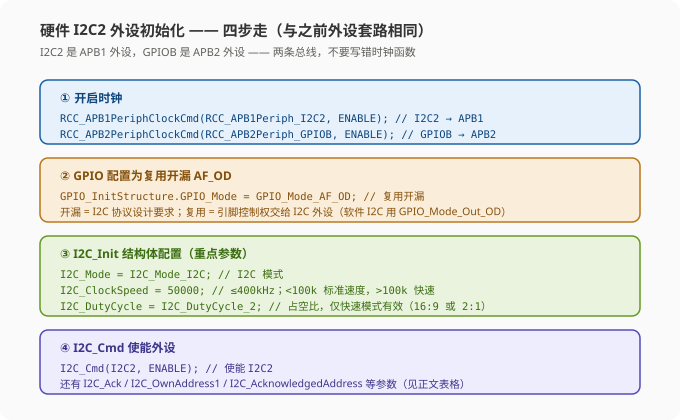
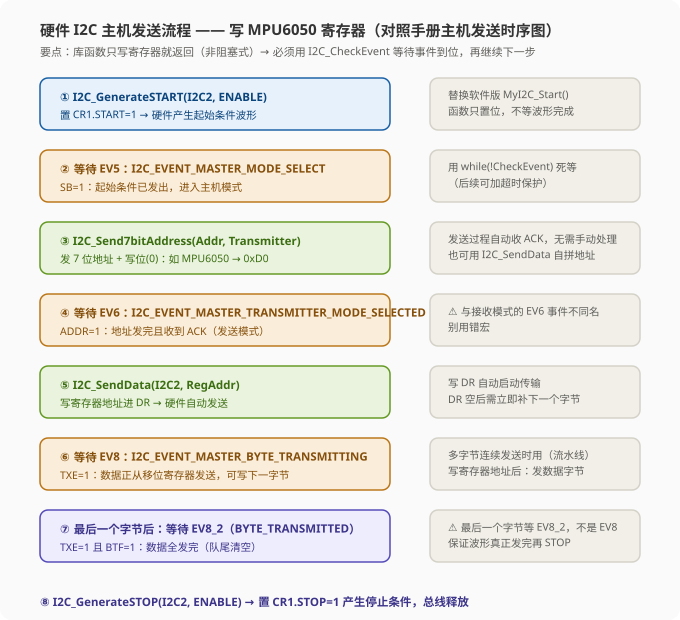
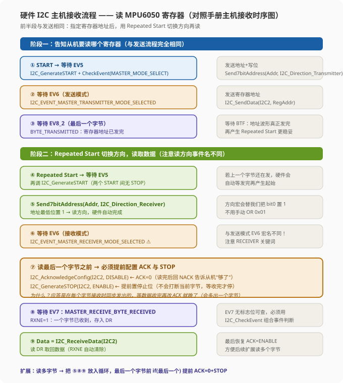
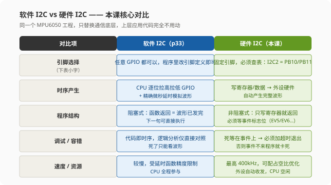
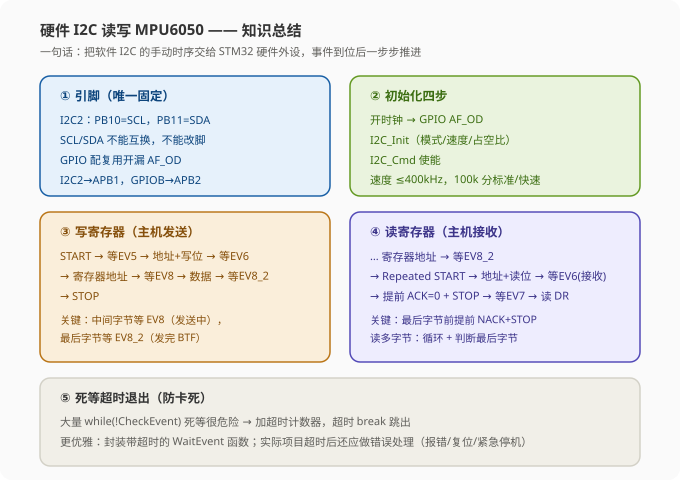

# STM32 硬件 I2C 读写 MPU6050 — 学习笔记

> **视频来源**: [B站 江协科技 STM32入门教程-2023版 p35 [10-5]](https://www.bilibili.com/video/BV1th411z7sn?p=35)
> **芯片型号**: STM32F103C8T6 + MPU6050
> **前置知识**: I2C 通信协议（p31）、MPU6050 硬件介绍（p32）、软件 I2C 读写 MPU6050（p33）、I2C 通信外设（p34）
> **本节定位**: 把 MPU6050 的底层通信从软件模拟 I2C 替换为 STM32 硬件 I2C 外设，上层接口完全不变

---

## 一、课程概览

上节课（p34）学习了 STM32 的硬件 I2C 外设结构，本节课进入实战——用硬件 I2C2 外设替换 p33 中手写的软件 I2C（MyI2C 模块），实现同样的 MPU6050 寄存器读写。

**核心思想：只换底层，不动上层。** 软件 I2C 和硬件 I2C 的区别全部集中在通信底层（起始/停止/收发字节的实现方式），而 MPU6050 的寄存器配置、数据解析、OLED 显示这些应用层逻辑完全不用改。

> **提示**: 本课的工程改造思路在真实开发中非常常见——"接口替换"。底层驱动换了实现方式，只要接口（函数签名、行为语义）不变，上层代码一行都不用动。这也是模块化编程的意义所在。

---

## 二、硬件接线与引脚规划（本节最关键的第一步）

### 2.1 硬件电路没有变化

本节硬件电路和上一个工程（软件 I2C 读写 MPU6050）**完全一样**，接线不用改：

| STM32 引脚 | 连接 | MPU6050 模块 | 说明 |
|:---:|:---:|:---|:---|
| `PB10` | → | `SCL` | I2C2 的时钟线 |
| `PB11` | ↔ | `SDA` | I2C2 的数据线 |
| `3.3V` | → | `VCC` | 供电（模块板载 LDO） |
| `GND` | — | `GND` | 地线 |

> **注意**: 这个接线位置是刻意设计的——软件 I2C 的引脚可以任意选择，所以上一工程直接把 SCL/SDA 接在了硬件 I2C2 的固定引脚 PB10/PB11 上，这样两个版本的程序都可以用同一块板子、同一份接线，不用改电路。

### 2.2 硬件 I2C 引脚是固定的，不能随意更改！

这是硬件 I2C 与软件 I2C 最本质的区别：

- **软件 I2C**：SCL/SDA 就是普通 GPIO，任意引脚都行，程序里操作哪个引脚就接哪个引脚（GPIO 配通用开漏）。
- **硬件 I2C**：引脚由外设固定，**必须查引脚定义表**来确定能接哪里，且 SCL 和 SDA **不能互换**，私自改脚外设无法工作。



查表结论（以 STM32F103C8T6 为例）：

- **I2C1**：默认引脚 PB6/PB7，可重映射（AFIO）为 PB8/PB9。但本板上 PB6/PB7/PB8/PB9 四个引脚位于板子右下角，被外设占用、不便接线 → 放弃。
- **I2C2**：唯一引脚就是 **PB10=SCL、PB11=SDA**，且**无重映射选项**，只能这么接。

> **关键**: 如果你私自把引脚改到其他位置，I2C2 是无法工作的。这就是硬件外设的"绑定代价"——灵活性换来的是稳定和低 CPU 占用。

---

## 三、工程改造：复制工程并移除 MyI2C 模块

1. **复制工程**：复制 `10-1 软件I2C读写MPU6050` 工程，改名 `10-2 硬件I2C读写MPU6050`。
2. **移除 MyI2C 模块**（三步）：
   - 第一步：在选项卡（项目树顶部）对应的文件处右键，把 MyI2C.c 和 MyI2C.h **从工程中移除**（"移出工程"）。
   - 第二步：在工程树对应文件处右键，同样把两个文件移除。
   - 第三步：到工程文件夹的 `User` 目录下，**把磁盘上的 MyI2C.c / MyI2C.h 文件删掉**，保证工程树和工程目录的文件一致，方便工程管理。
3. **清理 MPU6050.c**：删掉 `#include "MyI2C.h"`，注释掉 MPU6050.c 中所有调用 MyI2C 的代码（`MyI2C_Init`、`MyI2C_Start/Stop`、`MyI2C_SendByte/ReceiveByte` 等）。
4. 确认上层逻辑（MPU6050_Init / MPU6050_WriteReg / MPU6050_ReadReg / MPU6050_GetID / MPU6050_GetData 的调用处）**全部保留**。

> **提示**: 上面第四步能成立的前提是——我们只替换"通信底层"，所以上层继续使用这些函数的地方（MPU6050 的初始化、读 ID、读六轴数据）都不需要更改。

---

## 四、硬件 I2C 库函数速览

展开标准外设库，找到 `stm32f10x_i2c.c`，重点看以下几个函数（都是老朋友了，套路和 GPIO/定时器一样）：

| 库函数 | 作用 | 类比软件 I2C |
|:---|:---|:---|
| `I2C_Init` | 初始化 I2C 外设（结构体配置） | `MyI2C_Init` |
| `I2C_Cmd` | 使能/失能外设 | — |
| `I2C_GenerateSTART` | 置 CR1.START=1，产生起始条件 | `MyI2C_Start` |
| `I2C_GenerateSTOP` | 置 CR1.STOP=1，产生停止条件 | `MyI2C_Stop` |
| `I2C_AcknowledgeConfig` | 配置 CR1.ACK 位（收完字节回 ACK 还是 NACK） | `MyI2C_SendAck` |
| `I2C_SendData` | 写数据到数据寄存器 DR（自动启动传输） | `MyI2C_SendByte` |
| `I2C_ReceiveData` | 读 DR 数据 | `MyI2C_ReceiveByte` |
| `I2C_Send7bitAddress` | 发送 7 位从机地址（自动处理读写位） | — |

### 4.1 几个关键函数的内部原理

- **`I2C_GenerateSTART`**：内部就是操作 CR1 寄存器的 `START` 位——置 1 产生起始条件，清 0 产生重复起始条件（配合软件代码产生 Repeated Start）。**注意**：调用它时如果当前还有字节正在发送（DR 还有数据没发完），硬件不会强行中断——起始条件会**延迟等待当前字节发送完毕后**再产生。所以读寄存器时"用 GenerateSTART 产生 Repeated Start"是安全的，不会破坏正在进行的传输。
- **`I2C_GenerateSTOP`**：操作 CR1 的 `STOP` 位，置 1 产生停止条件。
- **`I2C_AcknowledgeConfig`**：配置 CR1 的 `ACK` 位——决定 STM32 作为主机**收到一个字节后是给从机 ACK 还是 NACK**。ACK=1 时收到字节后回 ACK；ACK=0 时回 NACK。
- **`I2C_SendData(I2C2, Data)`**：把 Data 写入数据寄存器 DR。手册说明：**写 DR 自动启动数据传输**；一旦传输开始（DR 空），如果能及时把下一个字节写入 DR，硬件会保持连续的数据流（流水线）。
- **`I2C_ReceiveData(I2C2)`**：读取 DR。接收模式下，收到的字节被拷贝到 DR，置 RXNE（接收寄存器非空）；在下一个字节收到之前把数据读走，即可实现连续接收（防止数据覆盖）。

> **提示**: 发送地址时既可以用专用函数 `I2C_Send7bitAddress`（自动把 7 位地址放 DR 并处理最低位读写位），也可以直接调 `I2C_SendData` 自己拼地址字节（把最低位置 0=写 / 置 1=读）。觉得"不就是或一个最低位吗，我自己来就行"的同学，直接用 `I2C_SendData` 完全没问题。

### 4.2 三种状态监控方案（本节重点）

硬件 I2C 是非阻塞式外设，函数只写寄存器就返回，**必须等待事件标志位确认波形执行到位**。库提供了三种监控方案：



| 方案 | 函数 | 说明 | 使用建议 |
|:---|:---|:---|:---|
| ① 基本状态监控 | `I2C_CheckEvent(I2C2, I2C_EVENT_xxx)` | **同时判断一个或多个标志位的组合**，与手册事件流程一一对应（EV5/EV6/EV7/EV8 等宏） | **推荐使用** |
| ② 高级状态监控 | `I2C_GetLastEvent(I2C2)` | 把 SR1 和 SR2 两个状态寄存器拼接成 32 位数据返回，自行处理 | 了解即可，一般不常用 |
| ③ 基于标志位 | `I2C_GetFlagStatus(I2C2, I2C_FLAG_xxx)` | 判断某一个标志位是否置 1（老方法） | 熟悉即可，单标志位判断不够严谨 |

> **为什么方案一更严谨**: 一个"事件"可能同时置位多个标志位。如果只查其中一个标志位就认为事件发生了，可能不够严谨；而 `I2C_CheckEvent` 是按手册定义好的事件组合（一个大标志位）判断的，和我们代码流程里的 EV5/EV6/EV7 一一对应，所以推荐用它。

另外还有四个老朋友：`I2C_ReadRegister` / `I2C_WriteRegister`（读写 I2C 寄存器）、`I2C_GetITStatus` / `I2C_ClearITPendingBit`（读/清中断标志），用法和之前外设一样，不多说。

---

## 五、I2C2 外设初始化

初始化套路和之前的外设完全一样，四步走：



### 5.1 开启时钟（注意两条总线！）

```c
RCC_APB1PeriphClockCmd(RCC_APB1Periph_I2C2, ENABLE);   // I2C2 → APB1 外设！
RCC_APB2PeriphClockCmd(RCC_APB2Periph_GPIOB, ENABLE);  // GPIOB → APB2 外设！
```

> **关键**: I2C1 和 I2C2 都是 **APB1** 总线外设；而 GPIOB 是 **APB2** 总线外设。两条总线不一样，参数不要写错。记不住就右键转到定义，从函数上方的注释里挑对应的外设即可。

### 5.2 GPIO 配置为复用开漏

```c
GPIO_InitTypeDef GPIO_InitStructure;
GPIO_InitStructure.GPIO_Mode = GPIO_Mode_AF_OD;   // 复用开漏
GPIO_InitStructure.GPIO_Pin   = GPIO_Pin_10 | GPIO_Pin_11;  // PB10/PB11
GPIO_InitStructure.GPIO_Speed = GPIO_Speed_50MHz;
GPIO_Init(GPIOB, &GPIO_InitStructure);
```

- **开漏（OD）**：I2C 协议的设计要求（线与机制，靠上拉电阻提供高电平）。
- **复用（AF）**：引脚的控制权交给 I2C 外设。之前软件 I2C 时引脚是我们程序手动控制，所以用**通用开漏（GPIO_Mode_Out_OD）**；现在波形由硬件外设产生，控制权必须交给外设，所以用**复用开漏（GPIO_Mode_AF_OD）**。

### 5.3 I2C_Init 结构体配置

```c
I2C_InitTypeDef I2C_InitStructure;
I2C_InitStructure.I2C_Mode = I2C_Mode_I2C;          // I2C 模式
I2C_InitStructure.I2C_ClockSpeed = 50000;           // 时钟频率 50kHz（≤400kHz）
I2C_InitStructure.I2C_DutyCycle = I2C_DutyCycle_2;  // 占空比 2:1（快速模式才有效）
I2C_InitStructure.I2C_Ack = I2C_Ack_Enable;         // ACK 使能
I2C_InitStructure.I2C_AcknowledgedAddress = I2C_AcknowledgedAddress_7bit; // 7 位地址
I2C_InitStructure.I2C_OwnAddress1 = 0x00;           // 自身地址（随便填）
I2C_Init(I2C2, &I2C_InitStructure);
```

**参数详解**：

| 参数 | 值 | 含义 |
|:---|:---|:---|
| `I2C_Mode` | `I2C_Mode_I2C` | I2C 模式（还有 SMBus 模式，不用管） |
| `I2C_ClockSpeed` | ≤400000 | SCL 时钟频率。**标准速度 ≤100kHz，快速模式 100k~400kHz**，超过 400kHz 不行 |
| `I2C_DutyCycle` | `16:9` 或 `2:1` | SCL 高低电平占空比，**仅在快速模式（>100kHz）下生效**；标准速度下固定 1:1 |
| `I2C_Ack` | Enable/Disable | 收完字节后是否给从机 ACK |
| `I2C_AcknowledgedAddress` | 7bit/10bit | STM32 作为**从机**时可被寻址的地址位数（主机模式无关，一般选 7 位） |
| `I2C_OwnAddress1` | 任意 | STM32 作为**从机**时的自身地址，方便别的主机呼叫它。我们只做主机，随便给个不冲突的值即可，如 0x00 |

### 5.4 使能外设

```c
I2C_Cmd(I2C2, ENABLE);   // 使能 I2C2
```

> **提示**: 一个小软件技巧——很多人反馈在 Keil 里按 `Ctrl + Alt + Space` 快捷提示不出来，是因为和**搜狗输入法**的按键冲突了。解决：右下角搜狗图标 → 右键 → 按键配置 → 把"中英文模式切换的 Ctrl+Space 勾选"去掉即可。

### 5.5 深入理解时钟频率与占空比（波形实验）

为什么快速模式要改占空比？江协用示波器做了完整实验，结论很直观：

- **50kHz（标准速度）**：SCL 高电平 : 低电平 ≈ 1:1，完美的 50% 方波。
- **100kHz（标准速度上限）**：仍是 1:1。但注意——**下降沿非常果断，上升沿却缓慢爬升**。原因：总线是开漏 + 上拉电阻模型。拉低时是强下拉（力大，果断）；拉高时靠上拉电阻给电容充电（弱上拉，缓慢）。RC 充放电的经典现象。
- **100kHz+（快速模式）**：占空比被调整为约 **2:1（低电平时间更长）**。为什么增大低电平比例？因为**低电平期间数据变化、高电平期间数据读取**——数据变化需要时间（尤其上升沿缓慢），所以快速传输时要把"低电平（数据变化）"的时间分配更多。就像硬盘：读数据速度要大于写数据速度，快速传输就得给写入（数据变化）多留时间。
- **400kHz（快速模式极限）**：波形已经很"惨"——SCL 高电平还没完全爬回就被拉下来，变成三角波；低电平期间数据变化也没有完全贴到下降沿。这说明**上拉电阻的 RC 充放电是限制 I2C 最大传输速度的物理瓶颈**。

> **关键**: 因此 `I2C_ClockSpeed` 必须 ≤400kHz；占空比参数只在快速模式下起作用（标准速度固定 1:1）。MPU6050 支持最大 400kHz，实际需求多大就配多大（如 50kHz 已经很快了，不够再加）。

---

## 六、主机发送流程 —— 实现写寄存器

对照手册的"主机发送时序图"，一步步写 MPU6050_WriteReg（指定地址写一个字节）：



```c
void MPU6050_WriteReg(uint8_t RegAddr, uint8_t Data)
{
    /* ① 产生起始条件 */
    I2C_GenerateSTART(I2C2, ENABLE);
    /* ② 等待 EV5：起始条件已发出（主机模式选择） */
    while (I2C_CheckEvent(I2C2, I2C_EVENT_MASTER_MODE_SELECT) == ERROR);

    /* ③ 发送从机地址 + 写位 */
    I2C_Send7bitAddress(I2C2, MPU6050_ADDR, I2C_Direction_Transmitter);
    /* ④ 等待 EV6：地址发送完成（发送模式选中） */
    while (I2C_CheckEvent(I2C2, I2C_EVENT_MASTER_TRANSMITTER_MODE_SELECTED) == ERROR);

    /* ⑤ 发送寄存器地址 */
    I2C_SendData(I2C2, RegAddr);
    /* ⑥ 等待 EV8：数据正在发送（可写下一个字节） */
    while (I2C_CheckEvent(I2C2, I2C_EVENT_MASTER_BYTE_TRANSMITTING) == ERROR);

    /* ⑦ 发送数据字节 */
    I2C_SendData(I2C2, Data);
    /* ⑧ 等待 EV8_2：最后一个字节发送完毕（TXE=1 且 BTF=1） */
    while (I2C_CheckEvent(I2C2, I2C_EVENT_MASTER_BYTE_TRANSMITTED) == ERROR);

    /* ⑨ 产生停止条件 */
    I2C_GenerateSTOP(I2C2, ENABLE);
}
```

### 6.1 事件等待详解

| 事件 | 宏名 | 含义 | 何时等待 |
|:---|:---|:---|:---|
| EV5 | `I2C_EVENT_MASTER_MODE_SELECT` | SB=1，起始条件已发出，进入主机模式 | START 之后 |
| EV6 | `I2C_EVENT_MASTER_TRANSMITTER_MODE_SELECTED` | ADDR=1，地址发送完成并收到 ACK | 发地址之后 |
| EV8 | `I2C_EVENT_MASTER_BYTE_TRANSMITTING` | TXE=1，数据正从移位寄存器发送 | 中间每个数据字节之后 |
| EV8_2 | `I2C_EVENT_MASTER_BYTE_TRANSMITTED` | TXE=1 且 BTF=1，字节全部发完 | **最后一个字节之后** |

> **EV8 vs EV8_2 怎么选**: 有连续数据要发送时，中间字节写 DR 后等 EV8（字节正在发送，数据转进移位寄存器了，DR 空了可以立即写下一个）；**最后一个字节**要等 EV8_2（BTF：不仅 DR 空，移位寄存器也把数据全发完了——就像排队，前面的人消化完且没有新人进队，才表示服务完毕）。顺序：`发数据1 → 等EV8 → 发数据2 → 等EV8 → … → 发最后一个 → 等EV8_2 → STOP`。

> **注意**: ACK 不用手动处理。库函数发送数据时**自动附带接收 ACK 的过程**（接收数据时也自动附带发送 ACK）；若 ACK 出错，硬件会通过标志位和中断提示。所以发地址之后直接等 EV6 事件即可。

> **EV6 为什么要区分发送/接收两种宏?**: 同一个 EV6 事件（ADDR=1，地址发送完成），主机是"发送模式"还是"接收模式"，对应的事件宏名不同——发送模式用 `I2C_EVENT_MASTER_TRANSMITTER_MODE_SELECTED`，接收模式用 `I2C_EVENT_MASTER_RECEIVER_MODE_SELECTED`。因为方向位不同，SR2 寄存器的标志位组合也不同。**复制粘贴时最容易把这两个宏搞混**，注意看宏名里的 `TRANSMITTER` / `RECEIVER` 关键词。

---

## 七、主机接收流程 —— 实现读寄存器（含 Repeated Start）

读寄存器比写多一步：指定完寄存器地址后，要用 **Repeated Start** 切换方向再读。对照手册"主机接收时序图"：



```c
uint8_t MPU6050_ReadReg(uint8_t RegAddr)
{
    uint8_t Data;

    /* ---- 阶段一：告知从机要读哪个寄存器（与发送流程相同）---- */
    I2C_GenerateSTART(I2C2, ENABLE);
    while (I2C_CheckEvent(I2C2, I2C_EVENT_MASTER_MODE_SELECT) == ERROR);

    I2C_Send7bitAddress(I2C2, MPU6050_ADDR, I2C_Direction_Transmitter);
    while (I2C_CheckEvent(I2C2, I2C_EVENT_MASTER_TRANSMITTER_MODE_SELECTED) == ERROR);

    I2C_SendData(I2C2, RegAddr);                      // 寄存器地址
    while (I2C_CheckEvent(I2C2, I2C_EVENT_MASTER_BYTE_TRANSMITTED) == ERROR);  // 等 BTF 发完

    /* ---- 阶段二：Repeated Start 切换方向，读数据 ---- */
    I2C_GenerateSTART(I2C2, ENABLE);                  // 重复起始条件（两个 START 间无 STOP！）
    while (I2C_CheckEvent(I2C2, I2C_EVENT_MASTER_MODE_SELECT) == ERROR);

    I2C_Send7bitAddress(I2C2, MPU6050_ADDR, I2C_Direction_Receiver);  // 读方向（bit0=1）
    while (I2C_CheckEvent(I2C2, I2C_EVENT_MASTER_RECEIVER_MODE_SELECTED) == ERROR);  // ⚠ 接收模式的 EV6

    /* 读最后一个字节之前：提前 NACK + 停止 */
    I2C_AcknowledgeConfig(I2C2, DISABLE);             // ACK=0：收完回 NACK
    I2C_GenerateSTOP(I2C2, ENABLE);                   // 提前置停止位

    while (I2C_CheckEvent(I2C2, I2C_EVENT_MASTER_RECEIVE_BYTE_RECEIVED) == ERROR);  // EV7
    Data = I2C_ReceiveData(I2C2);                     // 读 DR 取出数据

    I2C_AcknowledgeConfig(I2C2, ENABLE);              // 恢复 ACK=1（默认值），方便后续扩展
    return Data;
}
```

### 7.1 为什么最后一个字节前要"提前"配 ACK 和 STOP？

这是硬件 I2C 最反直觉、也最容易出错的一步。原因：

1. **应答是在每个字节接收的同时发出的**。数据还没收到时，从机先发出应答位；等数据都收完了你再改 ACK，应答位已经发过去了，**晚了**——你只能在下个字节之后回 NACK，时序就乱了。
2. **提前置 STOP 位不会打断当前字节**。硬件会等当前字节接收完整后，再产生停止条件的波形。
3. 结论：**接收最后一个字节之前**，必须提前 `ACK=0`（告诉从机"够了，别再发"）+ `STOP`（准备结束）。

> **提示**: 如果只读一个字节，EV6（接收模式）之后就要立刻配置 ACK=0 + STOP，然后再等 EV7 读数据。EV7 事件（RXNE=1）**没有对应的标志位可查**，必须用 `I2C_CheckEvent` 判断组合事件。

### 7.2 扩展：读多个字节

读多字节时把发送地址和"等 EV7 → 读 DR"放进循环即可：

```c
for (i = 0; i < N; i++)
{
    if (i == N - 1)            // 最后一个字节
    {
        I2C_AcknowledgeConfig(I2C2, DISABLE);   // 提前 NACK
        I2C_GenerateSTOP(I2C2, ENABLE);         // 提前 STOP
    }
    while (I2C_CheckEvent(I2C2, I2C_EVENT_MASTER_RECEIVE_BYTE_RECEIVED) == ERROR);
    Data[i] = I2C_ReceiveData(I2C2);
}
```

> **注意**: 中间字节读完后不回 NACK（保持 ACK=1 继续收），只有最后一个字节前才置 NACK+STOP。这就是从"指定地址读一个字节"升级为"读多个字节"的通用写法，学有余力可以尝试改造 MPU6050_GetData（连续读 14 字节时用多次单字节读也行，但连续读效率更高）。

### 7.3 收尾：恢复 ACK

因为接收函数默认假设 ACK=1（收完继续给 ACK），在接收最后一个字节前把它改成了 NACK，所以函数结束前**把 ACK 恢复为默认**（ENABLE），方便后续其他接收代码直接用默认状态。

---

## 八、死等超时退出机制（防卡死）

上面的代码里出现了大量 `while (I2C_CheckEvent(...) == ERROR);` 死等——**非常危险**：一旦某个事件一直不产生（如接线错误、地址不对、从机无响应），程序就卡死在这里。

### 8.1 简单方案：计数器超时

```c
uint16_t Timeout = 10000;                  // 超时计数初值
while (I2C_CheckEvent(I2C2, I2C_EVENT_MASTER_MODE_SELECT) == ERROR)
{
    Timeout--;
    if (Timeout == 0)
        break;                             // 超时跳出循环
}
```

- `break` 是跳出循环的关键字，强制打破 while 继续执行后面的代码。
- 也可以用 `return` —— 直接结束整个函数（后面的代码不执行）。
- 循环 10000 次具体耗时多少不好确定，实际给多大初值可以自己下载调试，**通过实验得到一个合理的计数值**是常用且简单的调参方式。

### 8.2 优雅方案：封装带超时的等待函数

每个事件等待都写一遍超时很繁琐，可以封装成一个通用函数：

```c
/**
 * @brief  带超时退出的事件等待
 * @param  Event  要等待的 I2C 事件（如 I2C_EVENT_MASTER_MODE_SELECT）
 * @retval 1=等待成功；0=超时退出
 */
uint8_t MPU6050_WaitEvent(uint16_t Event)
{
    uint16_t Timeout = 10000;
    while (I2C_CheckEvent(I2C2, Event) == ERROR)
    {
        Timeout--;
        if (Timeout == 0)
            break;                        // 超时退出（这里用 break 而不是 return）
    }
    return Timeout != 0;
}
```

然后把所有 `I2C_CheckEvent` 换成 `MPU6050_WaitEvent` 即可，参数原封不动传进去，代码立刻整洁很多。

> **注意**: 这个封装有个小缺点——原来 `return` 能直接跳出整个函数，封装后只能 `break` 跳出 while，后面的代码还是会执行。是否接受取决于你的容错策略。

### 8.3 生产级代码：超时后的错误处理

在实际项目中，超时退出**不能只是简单地 break**，还应该做相应的错误处理：

- 打印错误日志（方便排查）
- 重新初始化外设（复位恢复）
- 如果项目涉及危险机械结构，评估是否应该**紧急停机**

> **提示**: 错误处理的内容可以在之后的工作中考虑。本课先掌握"超时退出防卡死"这个基本思想即可。

---

## 九、实验验证与现象

1. 编译下载后，先读 MPU6050 的 WHO_AM_I（0x75）显示 ID——**正常应为 0x68**。
2. 再读六轴数据：加速度计（0x3B~0x40）、陀螺仪（0x43~0x48）、温度（0x41/0x42）。
3. 晃动模块，观察 OLED 上数据跟随变化。
4. 程序现象与软件 I2C 版本**完全一致**——说明替换成功。

> **验证要点**: 硬件 I2C 的程序现象和软件 I2C 一样，但底层实现完全不同。如果 ID 读出来不是 0x68，优先检查：接线（SCL/SDA 是否接反）、PB10/PB11 是否复用开漏、I2C2 时钟是否开启、上拉电阻是否正常。

---

## 十、常见问题与避坑

| 现象 | 原因 | 解决方法 |
|:---|:---|:---|
| WHO_AM_I 读不到 0x68 | 通信根本没通 | 查接线（SCL/SDA 接反）、模块供电（LED 亮？）、PB10/PB11 是否复用开漏 |
| 数据全为零 | 芯片在睡眠模式 | 确认初始化写了 `PWR_MGMT_1 = 0x00` 唤醒 |
| 卡死在某个 while 死等 | 事件一直不产生 | 先查地址、接线、上拉、GPIO 模式；给死等加超时退出 |
| 读数据多出一个字节/错位 | 最后一个字节前没提前 NACK+STOP | 接收最后一个字节前必须 `ACK=0` + `GenerateSTOP` |
| 使用了发送模式的 EV6 宏 | 复制粘贴用错 | 接收模式用 `I2C_EVENT_MASTER_RECEIVER_MODE_SELECTED`，注意宏名不同 |
| 时钟使能不生效 | I2C2 和 GPIOB 总线搞错 | I2C2→APB1，GPIOB→APB2 |
| 私自换了 I2C 引脚 | 硬件外设引脚固定 | 查引脚定义表，I2C2 只能 PB10/PB11，SCL/SDA 不能互换 |
| Keil 快捷提示按不出来 | 与搜狗输入法冲突 | 搜狗设置里取消"中英文切换 Ctrl+Space"的勾选 |

其中"最后一个字节前提前 NACK+STOP"和"EV6 宏选错方向"是硬件 I2C 新手最容易踩的两个坑——前者是时序反直觉，后者是复制粘贴不细心。

---

## 十一、软件 I2C vs 硬件 I2C 对比



| 特性 | 软件 I2C（p33） | 硬件 I2C（本课） |
|:---|:---|:---|
| 引脚 | 任意 GPIO，程序改定义即可 | 固定引脚（I2C2=PB10/PB11），SCL/SDA 不可互换 |
| 时序产生 | CPU 逐位拉 GPIO + 微秒延时 | 写寄存器/DR，外设自动产生波形 |
| 程序结构 | 阻塞式：函数返回即波形已发完 | 非阻塞式：只写寄存器就返回，须等事件 |
| CPU 占用 | 高（全程参与） | 低（外设自动收发） |
| 速度 | 慢（受延时精度限制） | 最高 400kHz，可配占空比优化 |
| 调试难度 | 低（代码即时序，逻辑分析仪对照） | 中（事件流程要熟，出问题查配置/事件） |
| 死等风险 | 低（无事件概念） | 高（必须加超时退出） |

> **提示**: 学会了软件 I2C 再看硬件 I2C 就简单了——硬件 I2C 本质上是把软件模拟的逻辑变成外设自动执行，你需要做的只是：配置寄存器参数 + 按事件流程写"等待事件 → 读写 DR"的代码。

---

## 十二、知识总结



```
        硬件 I2C 读写 MPU6050

   引脚固定：PB10=SCL，PB11=SDA（不可互换，I2C2 无重映射）
   初始化：开时钟(I2C2→APB1, GPIOB→APB2) → GPIO复用开漏
          → I2C_Init(模式/速度≤400k/占空比) → I2C_Cmd使能

   写寄存器（主机发送）：
     START → 等EV5 → 地址+写位 → 等EV6 → 寄存器地址 → 等EV8
     → 数据 → 等EV8_2 → STOP

   读寄存器（主机接收）：
     START → 等EV5 → 地址+写位 → 等EV6 → 寄存器地址 → 等EV8_2
     → Repeated START → 地址+读位 → 等EV6(接收) → 提前ACK=0+STOP
     → 等EV7 → 读DR → 恢复ACK=1

   死等超时：while(!CheckEvent) 加计数器，超时 break/return
   生产级：超时后做错误处理（日志/复位/紧急停机）

   核心口诀：写寄存器靠EV5-EV6-EV8-EV8_2，读寄存器多一个
             Repeated Start + 最后一个字节前提前NACK和STOP
```

---

*笔记生成时间: 2026-08-07 | 基于 B站视频 BV1th411z7sn p=35 转录*
