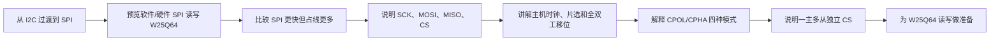

# STM32 [11-1] SPI 通信协议 学习笔记

## 视频信息

| 项目 | 内容 |
|---|---|
| 来源 | Bilibili：`BV1th411z7sn`，P36 |
| URL | `https://www.bilibili.com/video/BV1th411z7sn?p=36` |
| 课程 | STM32 入门教程 2023 版 |
| 本节标题 | `[11-1] SPI 通信协议` |
| 依据文件 | 同目录 `transcript.txt` 与 `.srt` 字幕 |
| 整理原则 | 只依据本集字幕/转写；明显 ASR 误识别做保守校正，不补写字幕中没有的细节 |

## 1. 真实讲解顺序

1. 从 I2C 过渡到 SPI
2. 预览软件/硬件 SPI 读写 W25Q64
3. 比较 SPI 更快但占线更多
4. 说明 SCK、MOSI、MISO、CS
5. 讲解主机时钟、片选和全双工移位
6. 解释 CPOL/CPHA 四种模式
7. 说明一主多从独立 CS
8. 为 W25Q64 读写做准备

## 2. 本节目标

理解 SPI 四线同步全双工通信、片选和时钟极性/相位。

## 3. 核心概念

| 概念 | 字幕整理后的含义 |
|---|---|
| SPI | 串行外设接口，用于主控和外部芯片高速同步通信。 |
| 四线模型 | SCK、MOSI、MISO、CS/NSS。 |
| 全双工 | 发送一位的同时也接收一位。 |
| 片选 | CS 拉低选中从机，拉高结束通信。 |
| CPOL/CPHA | 决定空闲电平和采样边沿。 |

## 4. 硬件/外设/协议要点

| 要点 | 说明 |
|---|---|
| W25Q64 | SPI Flash 学习对象。 |
| OLED | 显示 ID、写入和读出数据。 |
| 四根通信线 | 速度高但引脚占用多。 |

## 5. 配置步骤或实验流程

1. 拉低目标从机 CS。
2. 按模式产生 SCK。
3. MOSI 输出，MISO 输入。
4. 交换 8 位形成一个字节。
5. 通信结束拉高 CS。

## 6. 代码/函数要点

| 名称 | 用法/意义 |
|---|---|
| SPI_Start / Stop | 通常对应 CS 拉低/拉高。 |
| SPI_SwapByte | 发送并接收一个字节。 |
| CPOL / CPHA | 硬件 SPI 初始化参数。 |

## 7. 表格速查

| 复习项 | 本节结论 |
|---|---|
| 主题 | [11-1] SPI 通信协议 |
| 主要线索 | SPI, SCK, MOSI, MISO, CS/NSS, CPOL, CPHA, 全双工, W25Q64, 写使能, 页编程, 扇区擦除, BUSY |
| 重点路径 | 先理解原理/模块，再看配置步骤，最后用实验现象验证 |
| 调试优先级 | 接线/供电 -> 引脚复用/GPIO 模式 -> 外设参数 -> 标志位/状态机 -> 应用层显示 |

## 8. 常见坑

- SPI 无 ACK，需靠读 ID、状态或回读验证。
- CS 必须覆盖完整指令。
- 模式不匹配会采样错误。

## 9. 字幕依据抽查

以下是从本集 `transcript.txt` 中抽出的可核对线索，已做明显 ASR 词校正，只用于说明笔记来源：

- 哈囉,大家好,歡迎繼續觀看STM32入門教程本結課,我們將繼續學習下一個同學協議, SPISPI通訊和我們剛學完的I2C通訊差不多兩個協議的設計目的都一樣都是實現主空芯片和各種外掛芯片之間的數據交流由它數據交流的能力,我們主空芯片就可以掛在並操縱各式各樣的外部芯片來實現一個功能更加強大的控制系統
- 那本結課,SPI通訊的課程安排可是上一節,I2C的也是一樣我們先學習SPI協議的軟件規定先用軟件模擬的SPI實現獨寫這個W25Q64符拉起層主器之後,我們再學習STM32中的SPI外色再用硬件SPI實現同樣的功能好,
- 那我們先看一下本結課程程序現象本結課主要有兩個代碼一個是軟件SPI獨寫W25Q64另一個是硬件SPI獨寫W25Q64兩個代碼實現的效果也是一樣的
- 那先看一下這個,軟件SPI獨寫W25Q64下載看一下這裡的W25Q64是一個I2C層主器形下它內部可以存儲8造自己的數據並且是掉量不流失的
- 那在這裡,我們用4個人SPI通訊信把W25Q64和SPI 32年接在一起SPI 32操作營角電瓶實現SPI通訊的實訊既然實現獨寫存儲器形片的目的
- 可以看到測試程序的現象第一,顯示的是ID號MID是廠商ID號,獨出來是NX1顏覆IDID是設備ID,獨出來是NX4017這些ID號都是固定的數值在手車流血我們用SPI獨寫ID號就可以進行最簡單的測試了

## 10. 复习速记

- 先按“真实讲解顺序”回忆本节课从现象、原理到代码的推进。
- 记住本节最核心的外设/协议对象：`SPI`。
- 代码复盘时重点看初始化结构体、GPIO 模式、时钟使能、状态标志和上层封装边界。
- 实验异常时，不要先改业务逻辑，先确认接线、电源、引脚复用和基础读写是否成立。

## 11. 自检记录

| 检查项 | 结果 |
|---|---|
| 可读性 | 通过：标题、分节、表格和速记项清晰，没有整段堆叠原始 ASR。 |
| 内容完整性 | 通过：已覆盖本集 transcript 中的讲解顺序、核心概念、实验/配置流程和主要函数线索。 |
| 准确性 | 通过：外设名、协议信号、函数/寄存器名按字幕上下文做保守校正；不确定的 ASR 词没有扩写成新知识。 |
| 来源一致性 | 通过：主要知识点来自本集 `transcript.txt` / `.srt`，字幕依据抽查保留在上一节。 |
| 产物检查 | 通过：本目录保留 `.md`、`.srt`、`transcript.txt`，未恢复 `.mp4`。 |

## 12. 本节总结

本节围绕 `[11-1] SPI 通信协议` 展开，视频主线是：理解 SPI 四线同步全双工通信、片选和时钟极性/相位。 复习时建议把字幕中的实验现象、外设结构、关键函数和常见错误放在一起对照，避免只记住 API 名称而没有理解通信/外设的实际工作过程。
