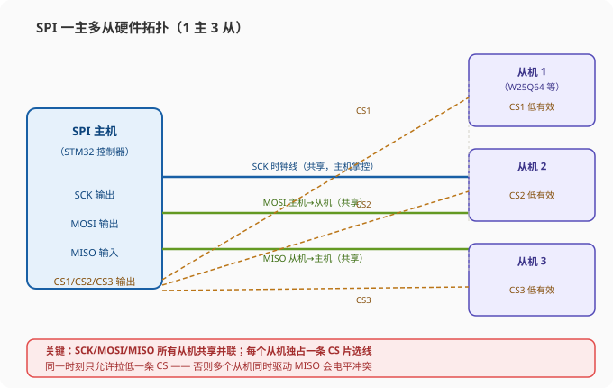
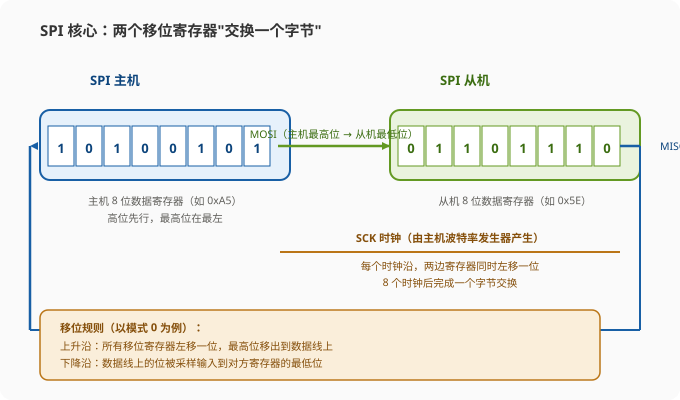
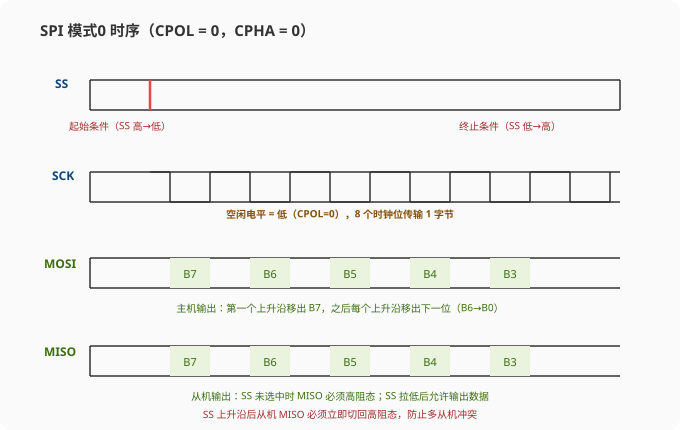
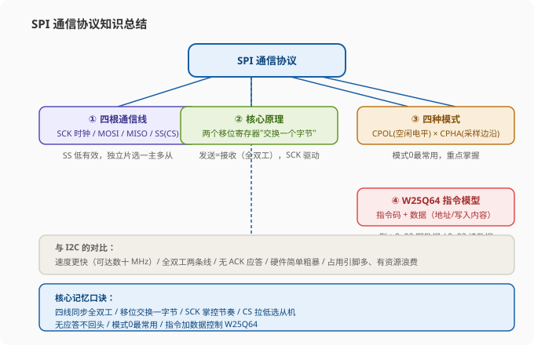

# STM32 [11-1] SPI 通信协议 — 学习笔记

> **视频来源**: [B站 江协科技 STM32入门教程-2023版 p36 [11-1]](https://www.bilibili.com/video/BV1th411z7sn?p=36)
> **芯片型号**: STM32F103C8T6（主控） + W25Q64（SPI Flash 从机）
> **前置知识**: I2C 通信协议（p31）、软件 I2C 读写 MPU6050（p33）、硬件 I2C 外设（p34）
> **本节定位**: SPI 通信协议的理论课——从 I2C 过渡引入 SPI，讲解 SPI 的四根通信线、基本特征、硬件电路、移位交换字节的核心原理、CPOL/CPHA 四种模式，并提前介绍 W25Q64 的指令与时序，为 p37 学习 W25Q64 芯片、p38 软件 SPI 读写打下基础

---

## 一、课程概览：从 I2C 到 SPI

大家好，欢迎继续观看 STM32 入门教程。本节课，我们继续学习下一个通信协议——**SPI**。

SPI 通信和我们刚学完的 I2C 通信差不多，两个协议的设计目的都一样——都是实现**主控芯片和各种外挂芯片之间的数据交流**。有了数据交流的能力，主控芯片就可以挂载并操纵各式各样的外部芯片，来实现一个功能更加强大的控制系统。

本节课 SPI 通信的课程安排，和上一节 I2C 的一样：**先学习 SPI 协议的软件规定**，用软件模拟的 SPI 实现读写 W25Q64（Flash 存储器）；之后，再学习 STM32 中的 SPI 外设，用硬件 SPI 实现同样的功能。也就是"先软件模拟、后硬件外设"的两步走。

> **提示**: 和 I2C 一样，SPI 也是一个通信协议。学协议的核心是"时序波形"——只要理解了时序的意义，就能按照协议规定去翻转引脚的高低电平；只要翻转出的波形符合协议规定，通信双方就能理解并解析这个波形，通信就实现了。所以本节课最重要的内容，就是搞懂 SPI 的时序到底长什么样、为什么这么设计。

---

## 二、程序现象预览：软件 SPI / 硬件 SPI 读写 W25Q64

本节课主要有两个代码工程：**软件 SPI 读写 W25Q64** 和**硬件 SPI 读写 W25Q64**，两个代码实现的效果是一样的。我们先看软件 SPI 读写 W25Q64 的程序现象。

这里的 **W25Q64 是一个 Flash 存储器芯片**，它内部可以存储 8 兆字节（8 MB，即 64 Mbit）的数据，并且是**掉电不丢失**的。如果你之后的项目中需要存储大量的数据（比如字库、图片、参数配置），就可以考虑外挂一个这样的存储芯片。

> **关键**: 掉电不丢失（非易失性）是 Flash 存储器的核心价值。主控芯片的内部 Flash 容量有限且一般被程序占用，需要存大量运行时数据时，外挂 W25Q64 这类 SPI Flash 是嵌入式项目最常见的做法之一。

在这里，我们用 4 根 SPI 通信线把 W25Q64 和 STM32 连接在一起，STM32 操作引脚电平实现 SPI 通信时序，从而实现读写存储器芯片的目的。在 OLED 上可以看到测试程序的运行现象：

1. **第一行显示 ID 号**：
   - **MID（厂商 ID）**读出来是 `0xEF`（Winbond 华邦电子的厂商代码）；
   - **DID（设备 ID）**读出来是 `0x4017`。
   - 这些 ID 号都是固定的数值，写死在芯片里。在手册里查到对应 ID 后，我们读 ID 号就可以进行最简单的通信测试——如果读出的 ID 号和手册一致，说明 SPI 通信基本是通的（"读写 ID 和手册一样"就说明 SPI 通信基本没问题）。
2. **第二行显示写入的内容**：写入 4 个字节 `0x01 0x02 0x03 0x04`。
3. **第三行显示读出的内容**：同样显示 `0x01 0x02 0x03 0x04`，读出来和写入的一样，说明读写存储芯片没问题。

> **提示**: 更进一步的测试（比如读写更多的数据、验证写入的数据是否真的掉电不丢失），我们之后写程序的时候再来看现象。先记住"读 ID + 读写数据"这个最基本的验证套路。

---

## 三、SPI 简介：与 I2C 的对比

### 3.1 SPI 是什么

**SPI（Serial Peripheral Interface，串行外设接口）**，是摩托罗拉（Motorola）公司开发的一种通信总线（通信数据总线）。和前面学的 I2C 一样，它也是一种通信总线，都是用于主控芯片和外挂芯片之间通信，用途领域非常相似。

当然，I2C 和 SPI 两者各有优势和历史：在某些芯片上，我们用 I2C；在另一些芯片上，用 SPI 更好。

### 3.2 回顾 I2C 的优势与缺点

我们之前学习 I2C 的时候可以发现，**I2C 无论是硬件电路，还是软件时序，设计得都相对比较复杂**：

- **硬件上**：要配置为开漏输出外加外接上拉电阻的模式；
- **软件上**：有很多功能和要求，比如起始条件/停止条件、从机寻址（设备地址）、数据收发、应答机制（ACK/NACK）、多主机仲裁的设计等等。

最终，通过这么多精心的设计，I2C 通信的性价比非常高——**I2C 在消耗最低硬件资源的情况下实现最多的功能**：硬件上，无论挂载多少个设备，都只需要两根通信线（SCL + SDA）；软件上，数据双向通信、多主机等都可以实现。

> **原理**（老师的人物类比）: 如果把通信协议比作一个人的话，那 I2C 就属于"**精打细算、思维缜密**"类型的人——要用最少的资源实现最多的功能。I2C 通过精心的设计，确实实现了这么多功能，可以说是非常优雅。

但是，在这些优雅之中也隐藏了一个缺点——就是我们上个视频说的：**由于 I2C 开漏 + 外接上拉电阻的电路结构，使得通信线高电平的驱动能力比较弱**。这就会导致通信线从低电平变到高电平的时候，**上升沿耗时比较长**，从而限制了 I2C 的最大通信速度。所以：

- I2C 的**标准模式**只有 100 kHz 的时钟频率；
- I2C 的**快速模式**也只有 400 kHz；
- 虽然 I2C 后来通过改进电路设计出了**高速模式**，可以达到 3.4 MHz，但高速模式目前普及程度不高。

所以一般情况下，我们认为 I2C 的时钟速度最多就是 400 kHz，这个速度相比 SPI 而言，还是慢了很多的。

### 3.3 SPI 相对 I2C 的三大优势

了解完 I2C 的优势和缺点，我们来看 SPI 在正式学习之前，简单概括几点 SPI 相对于 I2C 的优势：

1. **SPI 传输更快**：SPI 协议并没有严格规定最大传输速度，这个最大传输速度取决于芯片厂商的设计需求。比如我们这节课的 W25Q64 传输（存储）芯片，手册上写的 SPI 时钟频率**最大可达 80 MHz**——这比 STM32F1 的主频（72 MHz）还要高。
2. **SPI 设计简单粗暴**：实现的功能没有 I2C 那么多，所以学习起来 SPI 比 I2C 简单粗（容易）得多。
3. **SPI 硬件开销大**：通信线的个数比较多（4 根），并且通信过程中经常会有**资源浪费**的现象。

> **原理**（延续人物类比）: 如果继续把通信协议比作一个人的话，那 SPI 就属于"**土豪质地、有钱任性**"类型的人。SPI 说："我不在乎我花了多少钱，我只在乎我的任务有没有最简单、最快速地完成。"——这就是 SPI 的风格：用更多的线、更浪费资源，换取更简单、更快的通信。

经过这么多对比铺垫，大家应该对 SPI 有一个第一印象了。那么回到 PPT，现在开始正式研究 SPI。

## 四、SPI 的四根通信线

SPI 有四根通信线，分别是：

| 信号 | 英文全称 | 中文含义 |
|:---|:---|:---|
| `SCK` | Serial Clock | 串行时钟线 |
| `MOSI` | Master Output Slave Input | 主机输出、从机输入 |
| `MISO` | Master Input Slave Output | 主机输入、从机输出 |
| `SS` | Slave Select | 从机选择（片选） |

> **注意**: 这是 SPI 通信引脚的标准名称。实际情况下这些名称可能有别的表达方式，比如 SCK 有的地方可能叫 `SCLK`；MOSI 和 MISO 有的地方可能直接叫 `DI`（Data In）和 `DO`（Data Out）；SS 有的地方可能叫 `CS`（Chip Select）或 `NSS`。这些不同的名称都是一个意思，大家了解一下即可。本课程以 SPI 官方文档名称为准，在 PPT 里统一使用这几个名称。

### 4.1 各引脚的意义与作用

- **SCK 串行时钟线**：既然是同步串行通信，肯定得有时钟线。SCK 就是用来提供时钟信号的，数据的输出和输入都在 SCK 的上升沿或下降沿进行。这样，每一位数据的收发时刻就可以明确地确定。
- **MOSI 主机输出、从机输入**：主机通过这根线向从机发送数据。主机接在这根线上是输出，从机接在这根线上是输入——一根线上主机输出、从机输入，从机配置为输入才能接收主机的数据，主从不能同时配成输出或输入，否则就没法通信了。
- **MISO 主机输入、从机输出**：同理，从机通过这根线向主机发送数据，主机从这根线接收数据。
- **SS 从机选择线**：专门用来指定要和哪个从机通信（低电平有效），稍后详细讲。

## 五、SPI 的基本特征

### 5.1 同步串行

SPI 的基本特征是**同步串行通信**。既然是同步串行，肯定就得有时钟线，所以 SCK 就是用来提供时钟信号的，输出和输入都在 SCK 的上升沿或下降沿进行，每一位数据的收发时刻都可以明确确定。

> **原理**: 同步通信的时钟快一点、慢一点，或者中途暂停一会儿，都是没问题的——这就是同步通信的好处。对照 I2C 这种总线，这个 SCK 就相当于 I2C 的 SCL，两者作用相同。I2C 因为软件模拟方便，就是得益于同步时序的宽容性；SPI 也一样。

### 5.2 全双工

SPI 采用**全双工**通信。全双工是什么意思？就是**数据的发送和接收各自独占一条线**：发送用发送的线路，接收用接收的线路，两者互不影响。所以这里 MOSI 和 MISO 就是分别用于发送和接收的两条独立线路。

- MOSI：主机输出、从机输入，是**主机向从机发送数据**的线路；
- MISO：主机输入、从机输出，是**主机从从机接收数据**的线路。

> **原理**: 这两根通信线加在一起，就相当于 I2C 总线的 SDA。只不过 I2C 是一根线半双工发送接收（同一时刻只能一个方向），SPI 是一根发送、一根接收，是**全双工**。全双工的好处就是简单高效——输出线一直输出，输入线一直输入，信号方向不会改变，也不用担心发送和接收相互冲突了；坏处就是多带一根线，会有通信资源的浪费。

### 5.3 一主多从（独立片选）

SPI 支持总线挂载多个设备，使用的是一主多从的模型。**SPI 仅支持一主多从，不支持多主机**——这一点上，SPI 在功能上不如 I2C 强大。

I2C 实现一主多从的方式是：在起始条件之后，主机必须先发送一个设备地址（寻址），用来指定我要和哪个从机进行通信。所以 I2C 这里要设计分配地址和寻址的问题。

而 SPI 表示：你这太麻烦了，我直接"大手一挥"，再开辟一条通信线，专门用来指定我要跟哪个从机进行通信——这就是 **SS 从机选择线**。

并且这个 SS 线可能不止一条：**SPI 主机有几个从机，就开几条 SS 线，所有从机一人一根**。主机需要找谁的时候，就控制接到那个从机的一根 SS 线：

- 给这根线**低电平** → 说明我要找你了（选中该从机）；
- 给这根线**高电平** → 说明我不跟你玩了（取消选中）。

这样指定从机就是"动动手指"就能完成的事情，还分配什么地址、发什么寻址操作呢？这就是 SPI 实现一主多从、指定从机的方式。

> **关键**: SPI 片选是**低电平有效**（低电平选中，高电平取消）。一主多从的"多从"指的不是一个从机，而是通过多根独立的 SS 线分别控制多个从机。好处是简单直接，坏处是得加线（每加一个从机就要多一根 SS 线）。

### 5.4 无应答机制

SPI 没有设计**应答机制**（不像 I2C 那样每收一个字节回 ACK/NACK）：**发数据就发，收数据就收，至于对面是不是存在，SPI 不管**。这也呼应了 SPI"简单粗暴"的风格。

> **注意**: 没有应答机制意味着 SPI 通信缺少"握手确认"，通信是否正确需要靠**回读验证**（比如读 ID、读状态寄存器、写后读对比）来判断。这正是 SPI 的一个坑，之后用软件 SPI 读写 W25Q64 时，我们都是靠读 ID、写后读出来对比来验证通信正常的。

## 六、采用 SPI 的常见芯片与模块

PPT 上列出了几种采用 SPI 通信的芯片和模块，了解一下：

| 芯片/模块 | 说明 |
|:---|:---|
| **W25Q64**（本课程使用） | Flash 存储器。看它的引脚，和刚才说的并不一样：这里标的是 `DI` 和 `DO`，就是 MOSI 和 MISO。那 DI 到底是 MOSI 还是 MISO 呢？要看芯片的身份——这个芯片接在 STM32 上，显然是从机的身份。所以 DI（Data In，数据输入）就是从机的数据输入，对应接在主机的 MOSI 上；另一个 DO（Data Out，数据输出）就是 MISO 了 |
| **OLED 屏幕** | 利用 SPI 通信的 OLED 屏。上面的引脚也不是标准名称，需要查模块的手册，手册里会写明 |
| **NRF24L01（2.4G 无线通信模块）** | 芯片型号 NRF24L01，使用的就是 SPI 通信协议。想用这个芯片进行无线通信，就需要利用 SPI 读写这个芯片 |
| **MicroSD 卡** | SD 卡官方通信协议是 SDIO，但**它也支持 SPI 协议**，我们可以利用 SPI 对 SD 卡进行读写操作 |

> **提示**: 判断陌生模块的 MOSI/MISO 接法，关键看它的身份：从机设备上的 DI 接主机 MOSI、DO 接主机 MISO。像 STM32 这种可以进行主从身份转换的设备，一般都会把 MOSI/MISO 全名写完整；即使模块只标 DI/DO，只要明确了它是主机还是从机，辨别这两个引脚就很容易了。

## 七、SPI 硬件电路

### 7.1 拓扑结构与引脚方向

这张图是 SPI 一个典型的硬件电路（见下方拓扑图）：



- **左边是 SPI 主机**，主导整个 SPI 总线，主机一般都是控制器来做，比如 STM32；
- **下面（右边）是 SPI 从机 1、2、3**，就是挂在主机上的从设备了，比如存储器、显示屏、通信模块、传感器等等。

左边 SPI 主机实际引出了 6 根通信线：因为有 3 个从机，所以 **SS 线需要 3 根**，再加 SCK、MOSI、MISO，就是 6 根通信线。

> **注意**: SPI 所有通信线都是**单端信号**，它们的高低电平都是相对地（GND）的电压差。所以除了通信线，所有设备还需要**共地**——图中地线还没画出来，但是必须接的。另外，如果从机没有独立供电，主机还需要额外引出电源正极（VCC）给从机供电。这两个电源线（VCC 和 GND）也要注意接好。

再看这几根通信线的方向：

- **SCK 时钟线**：时钟完全由主机掌控，所以对主机来说 SCK 是输出，对所有从机来说 SCK 都是输入——主机的同步时钟就能送到各个从机；
- **MOSI 主机输出、从机输入**：传输方向是主机通过 MOSI 输出，所有从机通过 MOSI 输入；
- **MISO 主机输入、从机输出**：传输方向是三个从机通过 MISO 输出，主机通过 MISO 输入。

> **原理**: 连接方式总结就是"上面 SCK/MOSI/MISO 分别连在一起"——所有从机的 SCK 连一起、所有从机的 MOSI 连一起、所有从机的 MISO 连一起，形成共享总线；每条线的传输方向，图中都用箭头标出来了。

### 7.2 从机选择：SS 低电平有效

时钟和数据传输都搞定了，最后要解决的就是从机选择问题。为了确定通信的目标，主机需要额外引出多根 SS 控制线，分别接到各从机的 SS 引脚。主机的 SS 线都是输出，从机的 SS 线都是输入。

**SS 线是低电平有效的**。主机想选中谁，就把对应的 SS 输出线置低电平：

- 主机复位完之后，所有的 SS 都输出高电平，这样谁也不选中；
- 当主机需要和比如从机 1 通信时，就把 SS1 线输出低电平，从机 1 就知道主机在找我；
- 然后主机进行数据的传输，就只有从机 1 会响应，其他从机的 SS 线是高电平，它们都会保持沉默；
- 当主机和从机 1 通信完成之后，就会把 SS1 拉回高电平，从机 1 就知道主机结束了对我的通信；
- 之后主机需要和从机 2、从机 3 通信也是一样，要找谁通信就把谁的 SS 置低电平。

> **关键**: 同一时间，**主机只能置一个 SS 为低电平，只能选中一个从机**。如果主机同时选中多个从机，就会导致数据冲突——多个从机同时在 MISO 上输出，电平就打架了。这就是 SPI 实现选择从机的方式，不需要像 I2C 那样先寻址，是不是很省事？

### 7.3 引脚配置：输出推挽、输入浮空/上拉

SPI 引脚的配置：**输出引脚配置为推挽输出，输入引脚配置为浮空或上拉输入**。

推挽输出，高低电平均有很强的驱动能力，这会使 SPI 引脚信号的**下降沿非常迅速，上升沿也非常迅速**——不像 I2C 那样（开漏+上拉），下降沿非常迅速，但上升沿就比较缓慢了。得益于推挽输出的驱动能力，SPI 信号变化得快，自然就能达到更高的传输速度。一般 SPI 信号都能轻松打到几十 MHz 的输出级别。

> **原理**（为什么 I2C 不用推挽）: I2C 并不是不想使用更快的推挽输出，而是 I2C 要实现**半双工**（经常要切换输出方向）、还要实现**多主机的时钟同步和总线仲裁**，这些功能都不允许 I2C 使用推挽输出——要不然两台设备一个输出高一个输出低，不小心就电源短路了。所以 I2C 选择了更多的功能，自然就要放弃更强的驱动能力。
>
> 而 SPI：首先不支持多主机，然后又是全双工——SPI 的输出引脚（时钟输出、输出引脚）都是固定输出，基本不会出现电平冲突，所以 SPI 可以大量使用推挽输出。

### 7.4 MISO 的冲突与高阻态规定

不过，SPI 其实还是有一个冲突点的，就是图上的 **MISO 引脚**。在这个引脚上可以看到：主机是输入，但三个从机都是输出。如果三个从机都同时使用推挽输出，那必然会导致冲突。

所以 SPI 协议里有一条规定：

> **关键**: 当从机的 **SS 引脚为高电平（从机未被选中）时，它的 MISO 引脚必须切换为高阻态**。高阻态就像把引脚断开一样，不输出任何电平。这样就能防止"一条线上有多个输出"而导致电平冲突的问题。当 SS 为低电平（被选中）时，MISO 才允许变为推挽输出。

这就是 SPI 对可能冲突做出的规定。当然，这个切换过程都是在从机内部做的，我们一般都只写主机的程序，所以**主机的程序中并不需要关注这个问题**（但如果以后要设计从机芯片/模块，就要注意这个规定）。

> **提示**: 高阻态（High-Z）是理解 SPI 从机必须掌握的概念——一个引脚处于高阻态时，既不输出高也不输出低，相当于从电路中断开，这样才不会跟线上其他设备的输出"打架"。多从机共享一条 MISO 线，正是靠"未选中的从机 MISO 都高阻"来保证同一时刻只有被选中的从机在驱动这条线。

## 八、SPI 移位示意图：通信的核心原理

讲完 SPI 的硬件电路，接下来看这个**移位示意图**。这个移位示意图是 SPI 硬件电路设计的核心——只要把这个移位示意图搞懂了，那无论是上面的硬件电路，还是后面要学的软件时序，理解起来都会更加轻松。



### 8.1 移位寄存器模型

SPI 的基本收发电路，就是使用了这样一个移位的模型：

- **左边是 SPI 主机**，里面有一个**8 位的移位寄存器**；
- **右边是 SPI 从机**，里面也有一个**8 位的移位寄存器**。

这里移位寄存器有一个时钟输入口，因为 SPI 一般都是**高位先行**（MSB First）的，所以每来一个时钟，移位寄存器就会向左进行移位（最高位在最左边）。从机中的移位寄存器也是同理。

移位寄存器的时钟源，是由主机提供的，这里叫做**波特率发生器**。它产生的时钟驱动主机的移位寄存器进行移位，同时，这个时钟也通过 SPI 硬件电路输出，接到从机的移位寄存器里——这样主从两个移位寄存器就**同步移位**。

然后看移位寄存器的接法：

- 主机移位寄存器**左边移出去的**数据，通过 **MOSI** 硬件线，送到从机移位寄存器的右边；
- 从机移位寄存器**左边移出去的**数据，通过 **MISO** 硬件线，送到主机移位寄存器的右边。

这样主从两个移位寄存器首尾相连，**组成了一个环**。下面我们来模拟一下电路如何工作。

### 8.2 交换一个字节的逐步过程

首先我们规定：**波特率发生器时钟的上升沿，所有移位寄存器向左移动一位，移出去的位放在引脚（数据线）上；时钟的下降沿，引脚上的位被采样输入到移位寄存器的最低位**（这个规定对应 SPI 模式 0，后面第 9 节会讲）。

现在假设：主机有个数据 `1010 0101`（0xA5）要发给从机，同时从机有个数据 `0110 1110`（0x5E）要发给主机。我们驱动时钟：

**第 1 个时钟**：

1. **上升沿**：所有寄存器向左移动一次。主机和从机最高位移出去的位，分别放到 MOSI 和 MISO 线上——此时 MOSI 数据是 1，所以 MOSI 电平是高电平；MISO 数据是 0，所以 MISO 电平是低电平。第一个时钟上升沿执行的结果，就是把主机和从机移位寄存器的最高位，分别放到 MOSI 和 MISO 的通信线上，这时数据"出发"了。
2. **下降沿**：主机和从机内部都会进行数据采样输入——MOSI 的 1 会采样输入到从机这里的最低位，MISO 的 0 会采样输入到主机这里的最低位。这时第一个时钟结束。

**第 2、3 个时钟……直到第 8 个时钟**：都是同样的过程——上升沿移出、下降沿采样输入。主机的最高位（现在是原始数据的次高位）输出到 MOSI，从机的最高位输出到 MISO；下降沿再把线上的数据采样到对方的最低位。

**8 个时钟之后**，我们看到什么现象？

- 原来主机的 `1010 0101` 跑到从机里了；
- 原来从机的 `0110 1110` 跑到主机里了。

就实现了主机和从机**一个字节的数据交换**。

> **原理**: 实际上，SPI 的通信运行过程就是这样：**SPI 的数据收发都是基于"交换一个字节"这个基本单元来进行的**。当主机需要发送一个字节，并且同时需要接收一个字节时，就可以执行一次字节交换——主机要发送的数据跑到从机，主机要从从机接收的数据跑到主机，这就完成了"发送同时接收"的目的。

### 8.3 只发不接 / 只接不发怎么办

你可能会问：**如果执行发送，不想接收怎么办？**——接收的位我们仍然要用交换字节的时序，只是这个**接收到的数据，我们不看它就行了**。

**如果执行接收，不想发送怎么办？**——同理，我们还是用交换字节的时序，只是我们会**随便发送一个数据**，只要能把从机的数据换过来就行了。我们读"换过来的数据"，不就是接收了吗？这里我们随便发过去的那个数据，从机也不会去看它。

> **提示**: 这个"随便发的数据"我们不会真的随便发。一般在接收的时候，我们会**统一发送 0x00 或 0xFF** 去跟从机换数据——这既是惯例，也是写软件 SPI 读函数时的标准做法（发送一个占位字节，同时把从机回的数据收回来）。

总结一下就是：**SPI 通信的基础是交换一个字节**。有了交换一个字节，就可以实现"发送一个字节"、"接收一个字节"和"发送同时接收一个字节"这三种功能。可以看出，SPI 在只执行发送、或只执行接收的时候，会存在一些资源浪费现象——不过全双工功能的通信，本来就会有浪费的情况发生，SPI 表示：我不在乎（呼应前面"土豪任性"的人格化比喻）。

> **提示**: 了解完这个移位示意图，再看前面的硬件电路，是不是这几个硬件（SCK 波特率发生器、MOSI/MISO、SS 从机选择线）的功能就很容易理解了？——SCK 提供移位时钟、MOSI/MISO 完成环形移位数据交换、SS 负责从机选择。整个硬件电路就是围着"交换一个字节"这个核心转的。

## 九、SPI 时序规定：起始终止与四种模式

只要把刚才的移位示意图理解了，SPI 时序其实也很简单。我们看一下。

### 9.1 起始条件与终止条件

SPI 的**起始条件**是：**SS 从高电平切换到低电平**（左图）。因为 SS 是低电平有效的，SS 从高变低，就代表选中了某一个从机，这就是通信的开始。

SPI 的**终止条件**是：**SS 从低电平切换到高电平**（右图）。SS 从低变高，就是解除了对从机的选中，也就是通信的结束。

> **关键**: 在从机的整个选中期间（低电平期间），SS 要始终保持低电平，这期间代表正在通信。**SS 的下降沿是通信的开始，SS 的上升沿是通信的结束**。这个相比 I2C（起始条件 SDA 高变低、停止条件 SDA 低变高，还要区分 SCL）还是简单很多的。

### 9.2 数据交换的基本单元

紧接着要讲的就是**数据交换的基本单元**。这个基本单元，就是建立在刚才说的移位模型上的。并且，这个基本单元**什么时候开始移位、是上升沿移位还是下降沿移位，SPI 并没有限定死**，给到我们的是可以配置的选择——这样 SPI 就能兼容更多的芯片（不同芯片可能习惯不同的边沿）。

SPI 有两个可以配置的位，分别叫做：

- **CPOL（Clock Polarity，时钟极性）**：决定 SCK 空闲时的电平（0 = 空闲低电平，1 = 空闲高电平）；
- **CPHA（Clock Phase，时钟相位）**：决定数据移出/采样的边沿关系。

每位可以配置为 0 或 1，总共组合起来就有**模式 0、模式 1、模式 2、模式 3** 这四种模式。

> **提示**: 模式虽然多，但是它们的功能都是一样的（都是交换字节）。在实际使用的时候，我们主要学习其中一种（模式 0）就可以了，剩下的模式，你知道有这些东西可以配置；如果到时候真的需要用，再过来了解一下就行了。

### 9.3 模式 0 详解（重点）

先看模式 0，因为这个模式和我们刚才讲的移位模型是对应的。它的基本功能就是交换一个字节。用刚才模拟的现象来说明：

- **CPOL = 0**：表示空闲的状态时，SCK 为低电平；
- **CPHA = 0**：表示 SCK 第一个边沿移出数据，第二个边沿移入数据（有的资料写的是"SCK 的第二个边沿进行数据采样"或者"SCK 的 0 数边沿进行数据采样"，说法不同意思一样。这里为了照应刚才的移位模型，就写成"第一个边沿移出数据，第二个边沿移入数据"）。

看下面的时序图（见下方波形图）：



1. **SS 从机选择**：在通信开始前，SS 为高电平；通信过程中，SS 始终保持低电平；通信结束，SS 恢复高电平。
2. **MISO（主机输入、从机输出）**：因为多个从机输出连在一起，如果同时开始输出会造成冲突。所以解决方法是：在 SS 为未被选中的状态，从机的 MISO 必须关闭输出，即配置输出为**高阻态**。SS 高电平时，MISO 用一条中间的线表示高阻态；SS 下降沿之后，从机的 MISO 被允许开始输出；SS 上升沿之后，从机的 MISO 必须切回高阻态。
3. **一位数据的传输操作**：因为 CPHA = 0，SCK 第一个边沿移出数据。第一个边沿就是上升沿（CPOL=0 空闲低，第一个边沿为上升沿），主机和从机同时移出数据——主机通过 MOSI 移出最高位 B7（此时 MOSI 的电平就表示主机要发送数据的 B7），从机通过 MISO 移出最高位 B7（此时 MISO 表示从机要发送数据的 B7）。然后时钟继续运行，产生下降沿，此时主机和从机同时移入数据（采样输入）——主机移出的 B7 进入从机移位寄存器的最低位，从机移出的 B7 进入主机移位寄存器的最低位。这样**一个时钟沿对完成，一个数据位传输完毕**。
4. 接下来都是同样的过程：上升沿，主机和从机同时输出当前移位寄存器的最高位（第二次的最高位就是原始数据的 B6）；下降沿，主机和从机移入数据。B6 传输完整之后时钟继续运行，数据移出、移入、移出、移入……**最后一个下降沿，数据位传输完整，主机和从机就完成了一个字节的数据交换**。

> **原理**: 模式 0 的节奏总结成一句话就是：**SCK 空闲为低；上升沿移出数据（发送方把数据放到线上），下降沿采样输入（接收方把数据读进来）**。发送方在上升沿放数据，接收方在下降沿读——正好错开半个周期，保证数据线上电平稳定时读取，不会读错。这就是模式 0 对应移位模型的完整逻辑。

**交换一个字节后如何结束？**

- 如果主机只想交换一个字节，那么在这个时刻就可以把 SS 置为高电平结束通信。在 SS 的上升沿，MOSI 可以再变化一次（将 MOSI 置到一个默认的高电平或低电平），当然也可以不去管它，因为协议没有硬性规定 MOSI 的默认电平。
- 而 **MISO**，从机必须在 SS 上升沿时切回高阻态。此时如果主机的 MISO 为上拉输入的话，MISO 引脚的电平就是默认的高电平；如果主机 MISO 配置为普通速度输入，那 MISO 引脚的电平不确定。
- 如果主机还想继续交换多个字节呢？此时主机就不必把 SS 拉回高电平，**直接重复刚才"从这到那"交换一个字节的时序**，这样就可以交换多个字节了——这就是 SPI 传输数据的流程，正好对应之前演示的移位流程。

### 9.4 模式 1 / 模式 2 / 模式 3 简析

了解完模式 0 和模式 1，下面的模式 2 和模式 3 就非常简单了：

- **模式 1 和模式 0 的区别**：模式 1 的 CPHA = 1，模式 0 的 CPHA = 0，CPOL 都是 0。在时序上的区别对比一下就明白：**模式 1 的数据移出一路的时序会提前半个时钟，也就是相位提前**。看时序：CPHA = 1 表示 SCK 第一个边沿移入数据，第二个边沿移出数据——但数据总要先移出才能移入，所以在模式 1 的配置下，SCK 第一个边沿来之前就提前开始移出数据了（或者说在第一个边沿之前/时钟的半个周期移出）。SPI 协议允许这种"提前半个周期移出数据"的时序，同样可以实现通信。
- **模式 2 和模式 3 的区别**：模式 2 的 CPOL = 1、模式 3 的 CPOL = 1，与模式 0、模式 1 的相位关系分别相同——区别只是 **CPOL = 1 表示空闲时 SCK 为高电平**，其他流程上的东西完成一样。也就是说：**模式 0 和模式 2 的 CPHA 一样（都是 0），模式 1 和模式 3 的 CPHA 一样（都是 1）**，CPOL 决定了空闲电平和边沿的升降方向。

> **注意**: 这个 CPOL 表示的是"时钟空闲电平"，它决定的是第一个时钟沿是上升沿还是下降沿（CPOL=0 空闲低 → 第一沿为上升沿；CPOL=1 空闲高 → 第一沿为下降沿），**并不是规定"上升沿采样还是下降沿采样"**。当然在 CPOL 确定的情况下，CPOL 确实会改变采样沿的升降方向——比如模式 0 的时候是上升沿移出数据，模式 3 就可以下降沿移出数据；模式 1 的时候是下降沿采样。这个表述说明：CPOL 确定"第一个边沿"，但并不能单独决定"上升沿还是下降沿"（要结合 CPHA）。

> **提示**: 老师提到一个细节——实际应用中**模式 0 用的最多**（很多 SPI 从设备，包括 W25Q64，都工作在模式 0 或模式 3），所以后面的软件 SPI 和硬件 SPI 程序都基于模式 0 来讲解。大家重点掌握模式 0 即可。

## 十、W25Q64 指令与时序示例（提前预告）

最后看几个 W25Q64 完整的时序波形。每个芯片对 SPI 时序（对自己通信协议）的定义都不一样。这里以我们本课程使用的芯片 **W25Q64** 为例讲解它自己的通信规定。

### 10.1 指令码 + 读写数据的模型

W25Q64 对通信的规定和 SPI 的标准不一样：SPI 规定的是一般是有效数据流；第一个字节直接是寄存器或数据。而 W25Q64 中通常采用的是"**指令码 + 读写数据**"的模型：

> **原理**: 这个过程就是 SPI 通信中第一个交换发送给从机的数据，一般叫做**指令码**（Command）。在从机中对应会定义一个指令集（指令表）。当我们需要发送什么指令时，就可以在通信的第一个字节直接发送指令集里面的数据，这样就能驱动从机完成相应的功能。
>
> 不同的指令可以有不同的数据个数：
> - 有的指令只需要一个指令码就可以完成，比如 W25Q64 的**写使能、读状态寄存器**等指令；
> - 有的指令后面就需要再跟要读写的数据，比如写数据指令后面就得跟上"我要在哪里写、写什么"；读数据指令后面就得跟上"我要在哪里读、读的是什么"。
>
> 这就是"**指令码 + 读写数据**"的模型。在 SPI 从机芯片的手册里，都会定义好指令集：什么指令对应什么功能、什么指令后面得跟上什么数据。这些具体内容，我们下节课学习芯片的时候再具体分析。

### 10.2 发送指令（写使能 0x06）

这里先简单展示几个指令的波形。首先是**发送指令**，这个时序的功能是向 SPI 设备发送指令码 `0x06`。`0x06` 到底是什么含义，由芯片厂商在指令集中规定：**在 W25Q64 中，0x06 代表的是"写使能"**。

看这个波形（W25Q64 使用 SPI 模式 0）：

- **空闲状态**：SS 为高电平，SCK 为低电平，MOSI 和 MISO 的默认电平没有严格规定；
- **通信开始**：SS 产生下降沿，在这个下降沿时刻，MOSI 和 MISO 就要开始变化数据了。MOSI 由于指令码最高位是 0，所以保持低电平不变；MISO 从机此时没有数据要发给主机，引脚电平没有变化（实际上 W25Q64 不需要回数据时，手册规定 MISO 仍然是高阻态，从机没有输出数据，不过这不影响，反正这个数据我们也不要看——这里因为 MOSI/MISO 线上有上拉，所以 MISO 呈现高电平）；
- 之后 SCK 第一个上升沿进行数据采样（采样输入），主从各得到一位；
- 继续第二个时钟、第三个时钟……主机按位发送指令码 `0x06`（主机要发数据的位：下降沿数据变化，上升沿数据被采样）。因为软件模拟的时序，MOSI 的数据变化有些延迟，没有紧贴 SCK 的下降沿，不过这也没关系——时钟是主机控制的，只要在下一次 SCK 上升沿之前变化完就行了；
- **最后一位（bit0）下降沿数据变化，上升沿数据采样，从机接收到完整指令**。SCK 跟低电平是变化的时期、高电平是读取（采样）的时期。

整个交换：主机用 `0x06` 换来的从机的 `0xFF`（实际从机并没有输出这个 0xFF，是 MISO 的高电平），不过这个 0xFF 没有意义，我们不用管。

因为写使能是单独的一个指令，不需要跟随数据，SPI 主机只需要交换一个字节就完成了。之后，SCK 下降沿之后 SS 拉回高电平，结束通信。

> **关键**: 写使能（0x06）是 W25Q64 写操作的前提——芯片规定，**执行写数据（0x02）、页编程等写操作之前，必须先发一次写使能指令**，否则写操作会被忽略。这也是 W25Q64 的防误写保护机制。

### 10.3 写数据指令（0x02）

接着看写数据指令，功能是向 SPI 设备发送"写数据"指令：先在指令集中规定 `0x02` 为写数据指令，随后在指定寄存器（地址）下写入数据出去。

因为 W25Q64 芯片有 8 兆字节（64 Mbit）的存储空间，一个 8 位的地址肯定不够，所以这里的**地址是 24 位的，分 3 个字节存储**。看一下时序：

1. SS 下降沿，开始通信。MOSI 在空闲时是高电平，所以在下降沿之后、第一个时钟之前，可以看到 MOSI 在变换数据，由高电平变为低电平；
2. 然后 SCK 上升沿，数据采样输入；后面还是一样：下降沿变化数据，上升沿采样数据；
3. **8 个时钟之后，一个字节交换完成**。我们发送 `0x02`，换回来 `0xFF`（无用）——发送的 0x02 就是指令码，代表这是一个"写数据"的时序；接收到的 0xFF 不需要看；
4. 因为这是写数据指令，后面必然还要跟着要写的地址和数据。所以在最后一个下降沿，因为后续还需要继续交换，需要把下一个字节的最高位放到 MOSI 上（此时下一个字节的最高位是 0，所以数据没有变化）；
5. 之后还是同样的过程交换一个字节：**第二个字节发送 `0x02`（地址最高字节）**——根据 W25Q64 芯片的规定，写指令之后的字节定为地址高位，所以这个 `0x02` 表示发送地址的 **23~16 位**；
6. **第三个字节发送 `0x34`**——表示发送地址的 **15~8 位**；
7. **第四个字节发送 `0x56`**——表示发送地址的 **7~0 位**。通过 3 个字节的交换，**24 位的地址 `0x123456` 就发送完毕了**（同期收到的 24 位数据无意义，不看）；
8. 3 个地址字节结束后，就要发送要写入地址的数据。继续交换一个字节发送数据，这里的数据是 `0x55`——表示在 `0x123456` 地址下写入 `0x55`；
9. 最后，如果只想写入一个数据，就可以把 SS 置为高电平结束通信。但这里**也可以继续发送数据**：SPI 里也会有和"页编程/地址自增"一样的机制——**每读写一个字节，地址自动加 1**。如果发送一个字节之后不终止、继续发送的字节，就会依次写入到后续的存储单元里，这样就可以实现从指定地址开始写入多个字节。

> **提示**: 这就是 SPI 写数据的时序。由于 SPI 没有应答机制，所以交换一个字节后，就立刻交换下一个字节就行了（不用等 ACK）。另外观察整个流程，我们只需要发送的功能、没有接收的需求，所以 **MISO 这根接收的线路全程处于高阻挂机状态**，并没有用到——这就是 SPI 指定机制写数据的原理。不同的芯片肯定有不同的规定：我们这个存储器的容量大，所以需要连续指定 3 个字节的地址；如果容量小的话，可能 1 个字节的地址就够了；或者有的芯片会直接把地址融合到指令码里，这也是可以的。

### 10.4 读数据指令（0x03）

最后一个时序是**读数据指令**：功能是向 SPI 设备发送"读数据"指令，这里芯片定义 `0x03` 为读指令，随后在指定地址下读取从机数据。

看一下时序，波形套路和之前都一样，主要关注交换的数据：

1. **第一个字节**：主机发送指令 `0x03`，表示"我要读数据了"；
2. 主机继续交换 3 个字节，分别是 `0x12`、`0x34`、`0x56`，组合到一起就是 `0x123456`，代表 24 位地址；
3. **最后这个地方就是关键点了**：因为是读数据，指令地址指定之后，显然我们就要开始接收数据。所以 3 个字节的地址交换完之后，要把从机的数据"搞过来"。怎么搞过来呢？——还是**交换一个数据（伪传输）**：我们随便给从机一个数据（一般给 0x00 或 0xFF），然后从机此时不会再理会你发的是什么，而是**把 `0x123456` 地址下的数据通过 MISO 发给主机**。可以看到波形显示指定地址下的数据是 `0x55`，这样主机就实现了"指定地址读一个字节"的目的；
4. 如果继续伪传输，那么从机内部的地址会自动加 1，从机就会继续把指定地址下一个位置的数据发过来——这样**一次通信就可以实现从指定地址连续读多个字节**的目的；
5. 最后数据传出完毕，SS 拉回高电平，通信结束。

> **注意**（细节）: 读时序这里也会有些细节：由于 MISO 是硬件电路控制的波形，所以它的数据变化都可以紧贴时钟的下降沿；另外可以看到 **MISO 数据的最高位，实际上是在上一个字节最后一个下降沿提前发生的**——因为这是 SPI 模式 0，数据变化都要提前半个周期。这就是 W25Q64 规定的读时序。

> **原理**: W25Q64 当然还规定了非常多其他功能的时序（读状态寄存器、扇区擦除、页编程、芯片擦除等等），这个我们下节课再分析。不过再多的时序，它们的格式都是"大同小异"——都是"起始 → 交换 → 交换 → …… → 停止"。我们只需要关注一下每个字节的功能定义，就能很方便地利用 SPI 控制设备了。

## 十一、知识总结



### 本节课的核心脉络

1. **为什么学 SPI**：I2C 精打细算但受限于开漏上拉，速度最多 400 kHz；SPI 简单粗暴、速度快（可达数十 MHz）、全双工、无应答，但占用引脚多、有资源浪费。
2. **四根通信线**：SCK 串行时钟（主机掌控）、MOSI 主机输出/从机输入、MISO 主机输入/从机输出、SS 从机选择（低电平有效）。SCK/MOSI/MISO 所有从机共享并联，SS 每个从机独占一根。
3. **核心原理**：SPI 的本质是主从两个 8 位移位寄存器"**环形移位交换一个字节**"——主机最高位移出到 MOSI、从机最高位移出到 MISO，8 个时钟后完成交换；发送与接收同时进行（全双工）。
4. **一主多从与引脚**：SS 拉低选中、拉高结束；同一时刻只能选中一个从机；未选中的从机 MISO 必须切高阻态，防止多从机输出冲突；输出引脚配推挽、输入引脚配浮空/上拉。
5. **四种模式**：CPOL 决定空闲电平、CPHA 决定边沿关系；**模式 0（CPOL=0、CPHA=0，空闲低电平，上升沿移出/下降沿采样）最常用**，W25Q64 即工作在模式 0，重点掌握。
6. **指令模型**：W25Q64 用"**指令码 + 读写数据**"的模型——写使能 0x06、写数据 0x02（后跟 3 字节地址 0x123456 + 数据 0x55）、读数据 0x03（地址后伪传输换回数据）；地址每读写一个字节自动加 1。
7. **无应答的验证手段**：SPI 没有 ACK，通信是否正确靠**读 ID（0xEF / 0x4017）、写后读对比**来验证。
8. **下一节预告**：p37 将正式学习 W25Q64 这个芯片的数据手册——它是如何存储数据的、都有哪些指令、如何利用 SPI 去读写数据。

### 记忆口诀

```
四线同步全双工，SCK 掌控节奏中；
MOSI 去来 MISO，SS 拉低选从机。
主从移位连成环，交换一字节通信；
未选中者要高阻，防止线上一群输出。
CPOL 定空闲，CPHA 定边沿；
模式 0 最常用，上升移出下降采。
指令加数据，控制 W25Q64；
写使能 06，写 02 读 03，地址自动加一。
```

---

*笔记生成时间: 2026-08-06 | 基于 B站视频 BV1th411z7sn p=36 转录*
