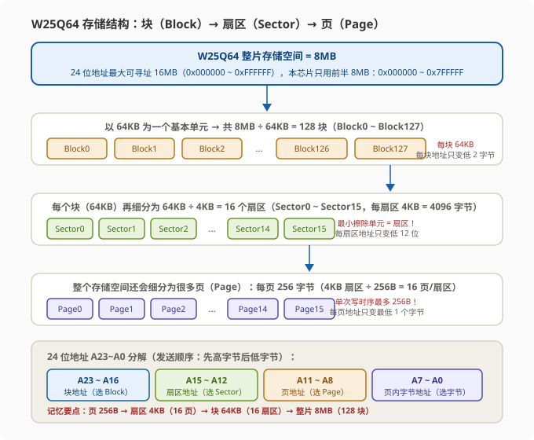
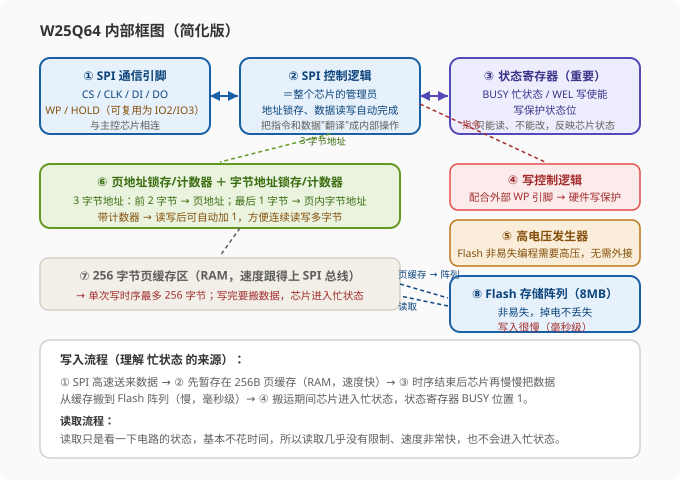
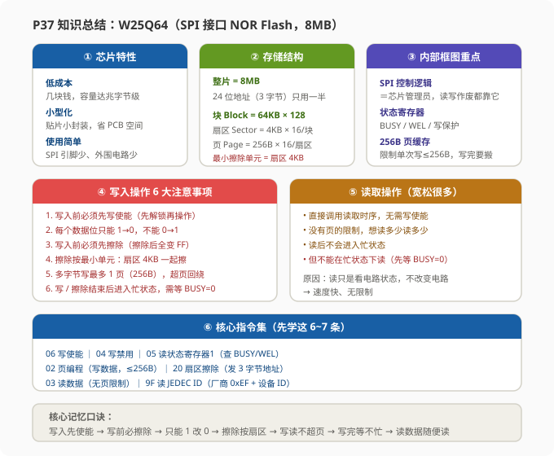

# STM32 [11-2] W25Q64 简介 — 学习笔记

> **视频来源**: [B站 江协科技 STM32入门教程-2023版 p37 [11-2]](https://www.bilibili.com/video/BV1th411z7sn?p=37)
> **芯片型号**: STM32F103C8T6 + W25Q64（SPI 接口 NOR Flash，容量 8MB）
> **前置知识**: SPI 通信协议（p36）、51 单片机时期的 AT24C02 使用经验（可回顾）
> **本节定位**: W25Q64 芯片整体介绍——芯片特性、引脚定义、存储结构、内部框图、Flash 读写注意事项、数据手册导读（纯理论课，p38 开始写程序）

---

## 一、课程概览

欢迎大家回来，本节我们继续学习 SPI 通信。这次要学习的是**使用了 SPI 通信的芯片之一——W25Q64**。

本节的安排是：首先看几张 PPT，整体介绍一下这个芯片；看完整体介绍后，相信大家对它就有了一个大致的印象；接着我们再过一遍细节，把里面的一些**重点和细节问题**再讲一下；这样结合上一节学的 SPI 协议，下一节就可以开始写程序，来读写这个芯片了。

> **提示**: 本节是"认识芯片"的理论课，全程不写代码。学习主线是：**这个芯片是什么 → 长什么样 → 内部怎么工作 → 读写要注意什么 → 数据手册怎么查**。把这一节吃透了，下一节写代码就是照着指令集填参数。

---

## 二、W25Q 系列芯片简介

### 2.1 第一条特性：低成本、小型化、使用简单、非易失性

PPT 上的第一条介绍：**W25Q 系列芯片，是一种低成本、小型化、使用简单的非易失性存储器**。这句话拆开看，每个词都有具体含义。

**型号系列与容量**：W25Q 系列包含多种型号，其中"W25Q"后面的数字代表不同的存储容量，比如 40、80、16、32、64 等等。**同一个系列的不同型号，操作方法完全一样，只是容量不同而已**。本节课使用的是 W25Q64 这个型号，容量是 64 兆比特（Mbit），也就是 8 兆字节（8MB）。

如果觉得 8MB 容量太大，也可以换成 W25Q32、W25Q16 等更小的型号——**换型号之后，硬件电路和底层驱动程序都不需要更改**。所以只要学会其中一个型号，再应用同系列的其他型号就很容易上手了。

> **提示**: 这是芯片选型的一个经验——先选"操作方式完全兼容"的同系列芯片，把驱动写一遍，将来换大容量型号时零成本迁移。后面 W25Q64 的程序，烧进 W25Q32/16 里依然能跑。

**低成本**：也就是说这个芯片一般也就几块钱，提供的存储容量一般在**兆字节（MB）级别**。这个容量级别在手机、电脑领域是很小的，但在嵌入式领域已经非常大了。回顾之前 51 单片机时代学过的经典存储芯片 AT24C02，它的容量一般是 KB 级别，相比之下 AT24C02 系列当然更便宜一些。

> **原理**: 存储容量从 KB 到 MB，价格、封装、接口都会变。AT24C02 用的是 I2C 接口，容量只有 256 字节；W25Q64 用的是 SPI 接口，容量有 8MB——接口不同、定位不同，一个适合存少量参数，一个适合存大量数据。这就是为什么学过 AT24C02 之后还要学 W25Q64。

**小型化**：从实物图片就能看出来，它是一个**贴片小封装**，在电路板中比较节省空间。

**使用简单**：这靠的是 SPI 协议的设计。这个芯片使用 SPI 串行通信，**通信引脚比较少、协议很简单**，所以芯片的硬件接线也不麻烦——除了几根通信线之外，剩下的引脚都可以接 GPIO，基本不需要其他电路，使用起来比较简单。

**非易失性（重点）**：存储器分为**易失性存储器**（一般指 SRAM、DRAM）和**非易失性存储器**（一般指 EEPROM、Flash 等），它们最主要的区别就是：**存储的数据，在掉电之后是否丢失**。

非易失性存储器就是"数据不容易丢失"的存储器——数据掉电不丢失。所以存储在这个芯片里的数据，在断电重启之后，**数据仍然保持原样**。

> **关键**: "非易失性"是 W25Q64 这一类 Flash 芯片最核心的价值。SRAM/DRAM 一掉电数据就没了，而 W25Q64 断电再上电，数据还在——这个特性决定了它最适合存"需要长期保留的数据"。

### 2.2 基于非易失性特性，能做什么应用？

既然数据掉电不丢失，就可以根据这个特性做一些应用，PPT 上列了三个典型场景：

**① 数据存储**：比如 STM32 里有些参数，或者采集到的数据，想要掉电不丢失地保存，就可以写入到这个芯片里来。这是最基础、最常用的场景。

**② 字库存储**：可以用在一些显示屏上，比如 OLED 显示屏或者 LCD 液晶屏。如果你想在屏幕上显示汉字，就得把汉字的**点阵数据**存起来。简单的方法是把字库直接存在 STM32 内部 Flash 里，这样适合**少量汉字**显示的情况；但如果汉字非常多，直接存在 STM32 内部就不合适了（容量不够），所以可以用 W25Q64 这种外挂芯片来存储汉字的字库点阵数据——在显示某个汉字时，先读取芯片查询字库，再在显示屏上显示对应的点阵数据，这样就能让显示屏**任意显示中文**。

**③ 固件程序存储**：相当于直接把程序文件下载到外挂芯片里，需要执行程序的时候，直接读取外挂芯片里的程序文件来执行——这就是 **XIP（eXecute In Place，就地执行）**。比如我们电脑里的 BIOS 固件，就可以存储在 W25Q 系列的芯片里。

> **注意**: 本节课只使用它**最简单的数据存储功能**，字库存储和 XIP 了解即可。但要知道"同一个芯片，在不同场景下有不同玩法"——理解了非易失性这个本质，所有应用都是它的延伸。

---

## 三、存储介质与通信接口

### 3.1 存储介质：NOR Flash

PPT 接着介绍，这个芯片的存储介质是 **NOR Flash**。

Flash 就是闪存芯片，像我们 STM32 的程序存储区、U 盘、电脑里的固态硬盘，用的都是 Flash 闪存。闪存分为 **NOR Flash** 和 **NAND Flash** 两种，两者各有优势和劣势、应用领域不同，感兴趣的话可以自己百度了解一下（老师不展开讲了）。大家只需要知道：**我们这个芯片是 NOR Flash**。

### 3.2 通信接口：SPI，最大时钟 80MHz

这个芯片使用的是 SPI 协议，其中 SPI 的 **SCK 线就是时钟线**，这根时钟线的最大频率是 **80MHz**。

这个频率相比 I2C 是非常快的，所以对我们软件写程序有个很实用的影响：**写软件模拟 SPI 程序的时候，翻转引脚就不用再加延时了**——即使不延时，GPIO 的翻转频率也不可能达到 80MHz，所以可以放心放弃延时。

> **提示**: 上节课学 I2C 软件模拟时，每个时钟周期都要加延时（I2C 快模式才 400kHz）；而 SPI 的时钟是 80MHz，软件模拟时 CPU 翻转引脚根本"喂不满"这个速度，所以不加延时就是对的。这也解释了为什么软件模拟 SPI 通常不需要 delay。

另外，手册上还有两个频率：**160MHz**——这是双倍 SPI（Dual SPI）模式等效的频率；**320MHz**——这是四倍 SPI（Quad SPI）模式等效的频率。这两种模式了解一下即可，本节课程序不会用到。

**双倍 SPI / 四倍 SPI 是什么意思？**

我们之前说过，普通 SPI 中 **MOSI 用于发送、MISO 用于接收，是全双工通信**，但在只发或者只收的时候，有一个方向是闲置的——有的芯片厂商觉得浪费，就对 SPI 做了一些改进：

- **双倍 SPI（Dual SPI）**：发送的时候，可以同时用 MOSI 和 MISO 两个线一起发送；接收的时候，也可以同时用 MOSI 和 MISO 一起接收。MOSI 和 MISO 同时兼具发送和接收的功能。这样一来，**一个时钟周期可以同时发送或接收两位数据**，相比普通 SPI，数据传输率就是 2 倍。所以"双倍 SPI 模式下等效的时钟频率 = 80MHz × 2 = 160MHz"——但实际的时钟频率最大还是 80MHz，只不过一个时钟发两位而已。
- **四倍 SPI（Quad SPI）**：更简单，**一个时钟周期发送或接收 4 位数据**，等效频率就是 80 × 4 = 320MHz。

**四根数据线从哪来？** 在我们这个芯片的引脚上，除了 SPI 通信引脚之外，还有两个引脚：一个是 **WP（写保护）**，另一个是 **HOLD（数据保持）**。这两个引脚如果不需要的话，也可以拉过来当数据引脚用——加上 MOSI 和 MISO，就可以 4 个数据位同时收发，这就是**四线 SPI（Quad SPI）**。

> **原理**: 这其实有点"并行发送"的意思了。串行是根据时钟一位一位地发送，并行是一个时钟 8 位同时发送，所以四线 SPI 其实就是"4 位并行"的 SPI。不过注意，普通双倍/四倍 SPI 模式下，MISO 也要被当作输出用，所以从机必须支持这个模式才行——这属于 SPI 协议的功能扩展，大概了解一下就行，我们暂时用不到。

### 3.3 型号与容量对照、24 位地址

PPT 最后给了不同型号对应的传输容量（存储容量），W25Q 系列总共有这么多型号：

| 型号 | 容量（Mbit） | 换算成字节（÷8） |
|:---|:---:|:---:|
| W25Q40 | 4 Mbit | 512 KB |
| W25Q80 | 8 Mbit | 1 MB |
| W25Q16 | 16 Mbit | 2 MB |
| W25Q32 | 32 Mbit | 4 MB |
| W25Q64 | 64 Mbit | **8 MB（本节使用）** |
| W25Q128 | 128 Mbit | 16 MB |
| W25Q256 | 256 Mbit | 32 MB |

> **关键**: 容量习惯以字节为单位，1 字节对应 8 个二进制位，所以型号上的数字**除以 8 就是存储容量**（注意 W25Q04/08 要写成 04、08 这样才对）。这个换算关系记牢，选型、看手册都会用到。

**24 位地址（3 字节）**：PPT 另外写的是，这个芯片使用的是 **24 位地址**，也就是 3 个字节。因为我们在进行读写的时候，肯定得给每一个字节都分配一个地址，这样才能找到它们——上一节讲 SPI 时序的时候也提到过，这里在指定地址时，**需要一次性发送 3 个字节（24 位）的地址**。

用计算机算一下 24 位地址最大的寻址能力：**2 的 24 次方 = 16MB**。所以 24 位地址的最大寻址空间是 16MB。在这个系列中，W25Q40 到 W25Q128 使用 3 字节 24 位地址都是足够的。

**但 W25Q256 就比较尴尬了**：24 位地址对于 32MB 来说是不够的（只能寻址 16MB），所以最后一个型号比较特殊。根据手册描述，**W25Q256 分为 3 字节地址模式和 4 字节地址模式**：在 3 字节地址模式下，只能读写前 16MB 的数据，后面 16MB 三个字节的地址"够不着"；要想读写到所有存储单元，可以进入 **4 字节地址模式**，这样就行了。

> **注意**: 如果你需要使用 W25Q256 这个型号，一定要留意地址模式切换这个问题——默认是 3 字节模式，只能访问前 16MB。这也是"同系列不同型号操作相同"之外的一个例外。

---

## 四、硬件电路：引脚定义与模块原理图

芯片介绍完了，接下来看这个芯片的硬件电路。PPT 上左边是**模块的原理图**，上边是**芯片的引脚定义**，下边是**每个引脚定义的功能表**。

### 4.1 引脚定义

W25Q64 是一个贴片小封装，一共 **8 个引脚**。先看电源部分：**4 脚是 VCC**，电源供电电压是 **2.7V ~ 3.6V**，是一个典型的 **3.3V 供电设备**，不能直接接 5V 电源；**地脚接 GND**。

再看 SPI 通信的四根线：

| 引脚号 | 引脚名 | 功能 |
|:---:|:---|:---|
| 1 | **CS** | 片选（Chip Select），低电平有效——左边画个斜杠或上面画条横线，都表示低电平有效；对应之前 SPI 讲的从机片选引脚 |
| 6 | **CLK** | 时钟线，对应 SPI 的 SCK |
| 5 | **DI** | 数据输入，对应 **MOSI**（SPI 主机输出、从机输入） |
| 2 | **DO** | 数据输出，对应 **MISO**（SPI 主机输入、从机输出） |

这四个引脚就是 SPI 通信的四个引脚，很好理解。除了这四个，芯片还有两个引脚：

| 引脚号 | 引脚名 | 功能 |
|:---:|:---|:---|
| 3 | **WP** | 写保护（Write Protect），低电平有效。配合内部的**状态寄存器配置**，可以实现引脚的写保护——WP 接低电平时"保护住"，不让写；WP 接高电平时不保护，可以写 |
| 7 | **HOLD** | 数据保持（Hold），低电平有效。这个用得不多，了解一下即可 |

**HOLD 引脚是干什么的？** 如果正在进行正常的读写时，突然产生中断，想用 SPI 总线去操控其他器件，这时如果把 SPI 片选拉高，那么这次读写就终止了；但如果**又不想终止当前的读写，又想操作其他器件**，这就可以把 HOLD 引脚拉低电平——这样芯片就"挂起"了：芯片暂停工作，但读写也不会终止，它会**记住当前的状态**；等你处理完其他器件、把 HOLD 拉回高电平，它就能继续之前的时序。

> **原理**: 相当于 SPI 总线在进行中可以被"中途暂停"，在暂停期间还可以用 SPI 总线做别的事情——这就是 HOLD 的功能。注意它和片选 CS 的区别：CS 拉高是"结束当前通信"，HOLD 拉低是"暂停但保留当前状态"，以后还能接上。这个功能用得少，了解即可。

**引脚括号里的 IO0 ~ IO3 是什么？** 注意到 DI、DO、WP、HOLD 旁边都有括号，写着 IO0、IO1、IO2、IO3——这对应前面说的双倍 SPI 和四倍 SPI：

- **普通 SPI 模式**：括号里的都不用看，DI/DO 各管各的；
- **双倍 SPI**：DI、DO 就变成 IO0 和 IO1，也就是数据同时收、同时发的两个数据位；
- **四倍 SPI**：再加上 WP 当 IO2、HOLD 当 IO3，四个引脚都作为数据收发引脚，一个时钟收发四个数据位。

这个了解一下，我们暂时不用。

### 4.2 模块原理图与接线

看模块的原理图：中间就是 W25Q64 芯片，旁边是一个 6 脚的排针。

- 芯片的 **VCC（电源正极）**，通过 VCC 引脚标号接到排针的 VCC 脚；芯片的 **GND（电源负极）**，通过 GND 标号接到排针的 GND 脚。
- 芯片 **SPI 通信的四个脚**（CS/CLK/DI/DO）直接通过排针引出来。
- **HOLD 和 WP** 两个引脚，都直接接到 VCC——因为低电平有效，接高电平（VCC）就表示"不保护、不暂停"，这两个功能我们都不用。
- 另外有个 **C1（电容）**，直接接在 VCC 和 GND 之间，显然是一个**电源滤波电容**；
- 还有个 **D1（LED）**，也接在 VCC 和 GND 之间（串联限流电阻），显然是一个**电源指示灯**，通电就亮。

> **关键**: 整个硬件接线整理起来非常简单：**VCC/GND 接 3.3V 电源，SPI 通信引脚直接接 STM32 的 SPI 通信引脚（或任意 GPIO 软件模拟），HOLD 和 WP 需要用就接到 GPIO，不需要就直接接 VCC**；电源滤波电容和电源指示灯都看需求酌情添加。这就是硬件接线——简单到几乎不会出错。

---

## 五、存储结构：块（Block）→ 扇区（Sector）→ 页（Page）

硬件看完，再看 W25Q64 的**框图（内部结构图）**。每个芯片都有框图，也是我们理解每个芯片最直观的方式，所以框图需要我们仔细分析。

### 5.1 为什么要划分存储空间？

首先，右边这一大块描述的是**存储系统的规划示意图**。我们的 W25Q64 容量是 8MB，如果不进行划分、只按照一整块来使用的话，这一整块容量太大，不利于管理；而且后续涉及到的擦除或者写入，都会有一个**基本单元**，我们得以这个基本单元为单位进行操作。所以这一整块"大蛋糕"（8MB 存储空间）就有必要进行合理的划分。

常见的划分方式就是：一整块存储空间，先划分为若干个**块（Block）**；其中每一块，再划分为若干个**扇区（Sector）**；每个扇区内部，又可以分成很多**页（Page）**。



### 5.2 具体怎么划分？

**存储单元与地址**：这一整个存储空间里是所有存储单元，存储单元以字节为单位，每个字节都有唯一的地址。W25Q64 的地址宽度是 24 位、3 个字节，所以可以看到：第一个字节的地址是 `0x000000`（0x 代表十六进制数），直到最后一个字节，地址是 `0x7FFFFF`。

> **原理**: 最后一个字节为什么是 `0x7FFFFF` 而不是 `0xFFFFFF`？因为 24 位地址的最大寻址范围是 16MB，我们这个芯片只有 8MB，地址空间只用了一半——8MB 空间排到最后一个字节，自然就是 `0x7FFFFF`。如果换 W25Q128（16MB），就能用满整个地址空间。

**第一层划分：块（Block）**：在这整个空间里，以 **64KB 为一个基本单元**，把它划分为若干个块。整片是 8MB，除以 64KB = 128 块，所以从 Block0 一直排到 **Block127**。

观察每块的地址变化规律：Block0 起始地址是 `0x000000`，结束地址是 `0x00FFFF`；Block1 起始是 `0x010000`，结束是 `0x01FFFF`……可以发现，**每一块内地址的变化范围，就是最低的两个字节**（A15~A0），每块的起始地址依次相差 `0x10000`（64KB）。这是块内地址的变化规律，了解一下。

**第二层划分：扇区（Sector）**：我们还要再对每一块进行更细的划分，分为多个扇区（Sector）。图中的虚线只画了右边的两个块，是告诉你**每一块里面都是这个样子的**。每块 64KB，以 4KB 为一个单元切分，64KB ÷ 4KB = 16 份——所以**每一块里都可以分为 Sector0 到 Sector15**（每扇区 4KB = 4096 字节）。

每个扇区内的地址范围是 `0xX000` 到 `0xXFFF`（低 12 位变化），这是对每一块再细分为 16 个扇区的分配方式。

**第三层划分：页（Page）**：当然，地址划分到扇区就结束了，但当我们**写入数据**时，还会有个更细的划分，就是**页（Page）**。页是对整个存储空间划分的，你也可以把它看成在扇区里再进行划分，都一样。页的大小是 **256 字节**：一个扇区 4KB（4096 字节），以 256 字节划分，能分成 16 份——所以一个扇区里可以分为 16 页。

页的地址规律：每一行就是一页，左边箭头写的是页地址的开始，右边箭头写的是页地址的结束。在一页中，地址变化范围是低 8 位（`0xX00` 到 `0xXFF`）——**一页内的地址变化，仅限由地址的最低一个字节**。

> **关键**: 存储空间的具体划分数值（128 块、16 扇区等）不需要死记，但**必须记住的结构**是：整个存储空间首先划分为若干块；每一块又划分为若干扇区；整个空间还会划分为很多很多页，**每页 256 字节**——这两个量后面编程经常用到。再配合"页 256B、扇区 4KB、块 64KB"这个层次，就能定位任何地址落在哪个块、哪个扇区、哪一页。

---

## 六、芯片内部框图详解

看完了存储空间，再来看左下角、右下角这些内部功能模块。注意，讲师展示的是 W25Q64 数据手册的系统框图简化版，各模块作用如下：

**① SPI 控制逻辑（芯片的管理员）**：芯片内部进行地址锁存、数据读写等操作，都可以由控制逻辑来自动完成，这个不用我们操心。**控制逻辑就是整个芯片的管理员**——我们有什么事，只需要告诉管理员就行了。管理员左边是 SPI 的通信引脚（CS/CLK/DI/DO 以及 WP、HOLD），它和我们的主控芯片相连；主控芯片通过 SPI 协议把指令和数据发给控制逻辑，控制逻辑就会自动去操作内部电路，来完成我们想要的功能。

**② 状态寄存器（比较重要）**：控制逻辑上面有一个状态寄存器，它比较重要——比如**芯片是否处于忙状态、是否写使能、是否写保护**，都可以在状态寄存器里体现。这个我们后面写程序的时候再分析。

**③ 写控制逻辑 + WP 引脚**：状态寄存器上面是写控制逻辑，和外部的 WP 引脚相连，显然是配合 WP 引脚实现**硬件写保护**的。

**④ 高电压发生器（配合非易失存储编程）**：右边是一个高电压发生器，配合非易失性存储进行编程。为什么需要高压？这里讲一下原理：

> **原理**: 非易失性是"掉电不丢失"，怎么实现呢？比如点燃一个熔丝表示 1、熄灭表示 0，但如果整个系统电路没有电，1 和 0 就无从说起了。所以要想掉电不丢失，就要在存储器里产生一些**不可逆的物理状态变化**——比如一个熔丝，给它加上很高的电压，熔丝就烧断了；用烧断的熔丝表示 1，没烧断的表示 0；然后断电，烧断的熔丝还是烧断的，有电没电它都是断的。这个烧断的状态不受有没有电影响，所以它就是掉电不丢失的。我们的非易失性存储系统也一样，要让它产生"即使断电也不会消失的状态"，一般都需要一个比较高的电压去刺激它。所以这种掉电不丢失的存储器，一般都需要一个**高压源**。而这里，芯片内部集成了高电压发生器，就不需要我们在外部接高压了，很方便。这里只是举了个简单例子说明"掉电不丢失的存储原理"，更复杂的原理大家可以在课下自己研究。

**⑤ 地址锁存/计数器**：下面是**页地址锁存计数器**，下面还有一个**字节地址锁存计数器**。这两个地址锁存计数器，就是用来锁定地址的。我们通过 SPI 总共发过来三个字节的地址：因为一页有 256 字节，所以页内的字节地址取决于**最低一个字节**，而**高位的两个字节**就对应页的地址。所以这里发的三个字节地址中，前两个字节会进到页地址锁存计数器里，最后一个字节会进到字节地址锁存计数器里。页地址通过页译码电路，来选择我要操作的页；字节地址通过列译码电路和 256 字节页缓存区，来进行指定地址的读写操作。

因为这两个地址锁存器都是带**计数器**的，所以这个地址在读写之后可以**自动加 1**——这样就可以很容易实现"从指定地址开始，连续读写多个字节"的目的。

**⑥ 256 字节页缓存区**：右边这里有个 256 字节的页缓存区，它其实是一个 256 字节的**随机存取存储器（RAM）**。这个稍微有个印象，等会还会提到。数据读写就是通过这个 RAM 缓存区来进行的。

**为什么写入要经过缓存区？** 因为我们的 SPI 写入频率非常高，而 Flash 的写入由于需要"掉电不丢失"、留下物理印记，它就比较慢。所以芯片的设计思路就是：一写入的数据，**先放在页缓存区里存着**（缓存区是 RAM，速度非常快，可以跟得上 SPI 总线的速度）；但这里有个小问题——这个缓存区只有 256 字节，所以**写入时序有个限制条件：一次写入的数据量不能超过 256 字节**；然后写完，芯片再慢慢地把数据从缓存区转移到 Flash 存储阵列。因为数据从缓存区转到 Flash 阵列需要一定的时间，所以**写入时序结束后，芯片会进入一段忙状态**——这里会有一条线通往状态寄存器，给状态寄存器的 **BUSY 位置 1**，表示芯片当前正在忙。在忙的时候，芯片就不会响应新的读写时序了。这就是写入的核心流程。

**读取也经过缓存区，但速度很快**：读取数据，按理说也会通过缓存区来读，但由于读取只是看一下电路的状态就行了，基本不花时间，所以读取的限制就很少了，**速度也非常快**。



> **关键**: 框图的四个重点部分：① 整个 Flash 空间划分成块、扇区和页；② SPI 控制逻辑——整个芯片的管理员，指定地址、读写数据都靠它；③ 状态寄存器——和忙状态、写使能、写保护这些功能有关；④ 256 字节的页缓存——对一次写入的数据量产生限制。把这四个记住了，框图就理解了。

---

## 七、Flash 操作注意事项（重点）

PPT 的最后，我们来看一下**Flash 操作的注意事项**。手册里列出的 Flash 写入和读取的要求还挺多、比较烦琐的。你可能会疑惑：不就是个存储器吗？我直接指定地址写、指定地址读，然后它直接给我把数据存在对应的存储单元里不就行了吗？为什么还要搞这么多注意事项？

> **原理**: 这是因为 Flash 作为一种掉电不丢失的存储器，为了在保证"掉电不丢失"这个特性的同时，还能保证**容量足够大、成本足够低**，Flash 存储芯片就在其他地方——比如**操作的便利性**上——作出了一些妥协和让步。所以 Flash 的写入和读取并不像 RAM 那样简单直接。

RAM 是"随写随用"的：想再改就再改，想写多少就写多少，并且 RAM 是可以**覆盖写入**的——比如原来 RAM 里存了个数据 A，之后我直接再写入一个新数据 B，那 RAM 里的数据就变成 B 了，这个特性非常好。但 **Flash 并没有这个特性**。

总之，Flash 的读写有很多要求，其中**写入的要求非常多**，需要我们掌握；读取的要求就比较少了——因为读取只是看一下电路的状态，不对电路做出实质性的改变，所以读取一般比较快，而且没有什么限制。

### 7.1 写入操作的注意事项（6 条）

**第一条：写入操作前必须先进行写使能（Write Enable）**。这是一种保护措施，防止误操作的——就像我们使用手机，先解锁再操作，这样可以防止手机在口袋里到处点点点。写使能的话，我们就使用 SPI 发送一个写使能的指令（`0x06`）就可以完成了。

**第二条：每个数据位只能由 1 改写为 0，不能由 0 改写为 1**。这个意思就是说，Flash 并没有像 RAM 那样"直接完全覆盖改写"的能力。举个例子：

假设一个字节的存储单元存储着 `0x5A`（二进制是 `01011010`）。如果直接再次在这个存储单元写入一个新数据，比如 `0x05`（二进制 `00000101`），那么写完之后这个存储单元存的是 `0x05` 吗？**实际上并不是**。因为 `0x05` 的二进制 `00000101` 要覆盖原来的 `01011010`，就会受限于刚才第二条规定的限制——每个数据位只能由 1 改写为 0，不能由 0 改写为 1。

为什么会有这个限制？那只能说是成本原因或技术原因了。我们一位一位来看（原数据 `01011010`，写入 `00000101`）：

| 位 | 原数据 | 要写入 | 是否允许 | 结果 |
|:---:|:---:|:---:|:---:|:---:|
| 最高位 bit7 | 0 | 0 | 0→0 | 0 |
| bit6 | 1 | 0 | **1→0 可以** | 0 |
| bit5 | 0 | 0 | 0→0 | 0 |
| bit4 | 1 | 0 | **1→0 可以** | 0 |
| bit3 | 1 | 0 | **1→0 可以** | 0 |
| bit2 | 0 | 1 | **0→1 不行** | 0（保持原样） |
| bit1 | 1 | 0 | **1→0 可以** | 0 |
| bit0 | 0 | 1 | **0→1 不行** | 0（保持原样） |

按这个规律进行下去，`0x5A` 在覆盖写入 `0x05` 之后，这个存储单元最终的数据是 `0x00`（8 位全为 0）——这其实就是按位**与**的结果：`0x5A & 0x05 = 0x00`。明明写入 `0x05`，它实际存进去的却是 `0x00`，这不就出问题了吗？

> **注意**: "只能 1 改 0、不能 0 改 1"意味着：想在某个字节里写 1 的位，如果它原来已经是 0，那么这次写入是无效的。程序员如果不知道这条，会写出"看起来成功、实际数据不对"的 Bug——所以这条必须理解透。

**第三条：写入数据前必须先擦除**。为了弥补"只能 1 改 0、不能 0 改 1"这个限制，就引出了第三条——写入数据前必须先把目标区域擦除掉。擦除后所有数据位为 1。在这里，Flash 是有一个"擦除"的概念的：擦除会有专门的擦除电路进行，我们只要给它发送擦除的指令就行了。通过擦除电路擦除之后，**所有的数据位都变成 1**，也就是十六进制的 `FF`。这样是不是就可以弥补第二条限制的缺陷了？

当我们写一个数据之前，无论原来存的是什么，我直接给它擦除掉——擦除之后所有的位变成 1（即 `FF`），这样无论我再写什么样的数据，就都可以正确写入了。比如写 `0x05`（`00000101`）：最高位 1 改写为 0，可以；第二位写入的是 1，虽然"不能 0 改 1"，但擦除之后它原来就已经是 1 了，所以这次写入 1 的数据位就不会出问题；之后也是同理。写入 `0x05` 之后，数据单元存的就是 `0x05`，没问题。

> **提示**: 总结一下——**Flash 中数据为 1 的位，有单独改成 0 的权力；一旦改写为 0 之后，就不能恢复再改写成 1 了；要恢复，就必须得先擦除，所有的位先统一变成 1，然后再重新来过**。这就是"Flash 不能随意改写"的特性和"写入数据必须先擦除"的原因。如果你非不擦除直接改写，这样的操作可以执行，但从数据角度来说结果只可能是错的（可以自己读一下验证）。
>
> 另外有个实用技巧：擦除之后所有的位变成 1，就是十六进制的 `FF`。所以有时候你读取 Flash 会发现数据全是 `FF`——那就说明这一段有可能是**擦除之后、还没有写入数据的空白空间**。在 Flash 中，`FF` 代表空白，而不是数字 0。

**第四条：擦除必须按最小擦除单元进行**。这个应该也是为了成本做出的妥协。你可能会想：写多少个字节进去就要先擦除吗？如果我想在某个地址下写入数据，那就先把该地址擦除，再写入数据到这个地址，不就行了吗？但这个方案有个问题——**Flash 的擦除有最小擦除单元的限制，你不能指定某一个字节去擦除，要擦就得一大片一起擦**。

一大片是多大一片？在我们这个芯片里，你可以选择**整个芯片擦除**，也可以选择**按块擦除**，或者**按扇区擦除**，再小就没有了。所以**最小的擦除单元就是一个扇区**。刚才我们看到一个扇区是 4KB（4096 字节），所以你擦除最少就得 4096 字节一起擦。

那你说我只想擦除某一个字节，没办法，你只能把那个字节所在扇区的 4096 字节全部擦掉。那如果这个扇区其他地方还存着数据怎么办？这也没办法——要想保留这些数据，你只能先把 4096 字节都读出来，再把整个扇区擦掉，擦完后再把读出来的数据全部写回去。这感觉是不是挺麻烦的？

> **提示**: 如果确实只想单独改写某一个字节，那只能这样"读→擦→改→写回"。当然实际情况下我们还有别的方法可以优化这个流程：
> - 比如先把 4096 字节数据读出来放到 RAM 里，当有数据变动时，再统一把整个扇区备份的 4096 字节写回（在 RAM 里改，改完一次写回）；
> - 或者把 4096 字节放在 RAM 里，攒够一扇区再一次性写回；
> - 如果你的数据量确实非常少，只像存几个字节的配置数据，那直接一个字节占一个扇区不就行了？
>
> 总结下来，**为了弥补擦除存在最小单元的限制，我们需要在程序设计上做出一些设计**（比如"扇区级缓存 + 统一回写"的软件方案）。

**第五条：连续读写多字节时，最多读写一页的数据；超过页末尾的数据，会回到页首重新读写**。这个意思就是说，读写的时候一次性不能写太多，一个读写时序最多只能写一页的数据，也就是 **256 字节**。

为什么有这个限制呢？只因为在这里有一个页缓存区，它只有 256 字节。为什么有缓存区呢？因为 Flash 的写入太慢了，跟不上 SPI 总线的频率，所以写入的数据会先放在 RAM（页缓存）里暂存；时序结束后，芯片再慢慢地把数据写到 Flash 阵列。所以这里会有限制：**每个时序最多读写一页的数据**，你写多了缓存区装不下。如果你非要写，那超过页末尾的数据会**回到页首重新开始读写**（地址回绕）。

另外，页缓存区是和 Flash 的页对应的，**必须与页边界对齐（从页首开始、不超过页尾）才能正确写满 256 字节**。如果你从页中间的地址开始写，那写到页尾时，这个地址就会跳回到页首——这会导致地址错乱。

> **注意**: 所以我们在进行多字节读写时，一定要注意地址范围，**不能越过页的边界**（比如从 0xXXFE 开始写 10 个字节，写到 0x0107 就越页回绕了）。要么保证单次读写不越页，要么在软件里把跨页的读写拆成多次操作。

**第六条：写操作结束后，芯片会进入忙状态，不响应新的读写操作**。这个应该好理解——我们的写操作都是对缓存区写的，等时序结束后，芯片还要花一段时间把数据搬运到 Flash 阵列，所以**每次写操作后都有一段时间的忙状态**。在这个状态下，我们不要进行新的读写操作，否则芯片是不会响应的。

要想知道芯片什么时候结束忙状态，我们可以使用**读状态寄存器**的指令，看一下状态寄存器的 **BUSY 位是否为 1**；BUSY 位为 0 时，芯片就不忙了，我们再进行操作。另外注意，这个写操作包括上面的擦除操作——**在发出擦除指令后，芯片也会进入忙状态**，我们也得等忙状态结束后再进行后续操作。

### 7.2 读取操作的注意事项（宽松很多）

读取操作的注意事项就宽松很多了：

- **直接调用读取时序即可，无需额外操作**（写使能和读取无关，读取不需要使能）；
- **没有页的限制**：连续读取想读多少就读多少，不用担心地址回绕或者覆盖的问题；
- **读取操作结束后不会进入忙状态**，可以立刻进行下一次操作；
- **但不能在忙状态时读取**：因为写/擦除操作进入忙状态后，芯片不会响应新的读写操作，所以我们在读取之前也要注意一下芯片是否处于忙状态，等不忙的时候再读就可以了。

> **关键**: 对比总结——写入要"写使能 + 先擦除 + 按扇区擦 + 不超页 + 等忙结束"，读取只要"等不忙 → 直接读"，非常简单。原因就一句话：写操作改变电路状态（慢、有限制），读操作只看电路状态（快、无限制）。

看完这些，是不是觉得有点麻烦？但是，**Flash 这种非易失性存储器，目前的市场应用量还是非常大的**——尽管它有这么多不方便，但这些不方便**可以用软件来弥补**，而它的优点是其他存储系统比不了的：比如**容量大、价格低**；速度相比 RAM 是慢，但在非易失性存储器当中，**Flash 是非常快的**。这就让它的市场地位不可替代。

---

## 八、数据手册导读：状态寄存器与指令集

到这里 PPT 的资料就看完了，像刚才说的，你对这个芯片也有了大概的了解。接着我们看一下**数据手册（Datasheet）**，手册里还有几个重要的资料要说一下。在模块资料里找到 W25Q 系列的参考资料，打开 W25Q64 的手册（如果资料里没找到，可以在网上下载，老师已更新过资料）。

手册的阅读顺序：

1. **芯片的概述和特性**：里面有些关键指标，可以把它当成"广告页"来看，看看它有什么优势，大家自己看看即可；
2. **芯片的引脚定义**：刚才讲过，引脚图也非常简单直接；
3. **每个引脚的描述**：老师讲过重点，有时间可以再看看；
4. **芯片的系统框图**：比较重要，刚才已经给大家详细分析过一遍（标准 SPI、双倍 SPI、四倍 SPI）；
5. **写保护的逻辑**：暂时不用写保护，大家随便看看；
6. 从后面开始，有两个很重要的东西要重点提醒：**① 状态寄存器（Status Register）**，**② SPI 指令集（Instruction Set）**。

### 8.1 状态寄存器（Status Register）

状态寄存器应该叫"控制状态寄存器"，它里面也有一些控制位，大家简单掌握就直接叫状态寄存器。**状态寄存器总共有两个：状态寄存器 1 和状态寄存器 2**，其中比较重要的是**状态寄存器 1**。状态寄存器 1 里有两个位比较重要：

**第一个是 BUSY 位（忙标志）**：当设备正在执行页编程（写入数据）、扇区擦除、块擦除、整片擦除，或者写状态寄存器指令时，BUSY 位置 1；在这期间，芯片将会**忽略进一步的指令**（除了读状态寄存器和擦除挂起指令）；当页编程、擦除、写状态寄存器指令结束后，BUSY 位清零，来指示设备准备好了。这就是 BUSY 位——**写/擦除后判断忙不忙，就看它**。

**第二个是写使能锁存位 WEL（Write Enable Latch）**：在执行完写使能指令后，WEL 置 1，代表芯片可以进行写入操作；当被写禁用时，WEL 清零。那什么时候处于写禁用状态呢？

> **原理**: **上电之后，芯片默认写禁用**（手册里也写了）。在执行完这些指令之后，其中包括我们发送了写使能指令，让 WEL 置 1；其实在执行扇区擦除、块擦除等写入操作后，WEL 会清零——也就是说，**写完数据操作后不需要手动再执行写禁用，因为写入操作后会顺便帮我们"锁上"**，相当于有个"顺手关门"的操作。同时这也说明：**我们在进行任何写入操作前，都得先执行写使能；一个写使能只能保证后续的一次操作**（写一次就自动锁上，下次还得再使能）。

好，有关状态寄存器主要提这两位的功能，其他位（主要是写保护功能相关的）大家需要的时候再自行查阅。状态寄存器的时序图（示意图）里，**状态寄存器 1 我们主要看最低的两位（S0 = BUSY，S1 = WEL）**，其他的位先不用管。再往后是一张**写保护的配置表**——你想保护哪些存储单元，就按这个表来配置寄存器位，需要时再看。

### 8.2 指令集（Instruction Set，重点）

指令集是手册里写"芯片比较新"的地方，指令种类应有尽有。**读设备 ID 的指令**：其中厂商 ID 是第 1 个字节，设备 ID 是后面两个字节（Winbond 的 W25Q64 读出来是 `EF / 40 / 17`）。我们写程序的时候，首先读一下 ID，验证一下 SPI 通信是否可行，到时候就参考这个表来验证结果。

手册下面这个大表就是 SPI 的指令集，指令非常多，我们目前先仔细学习标记的这几条指令。每一条的完整操作流程如下：

| 指令 | 指令码 | 操作流程（先片选拉低，再交换字节，最后片选拉高） |
|:---|:---:|:---|
| **写使能**（Write Enable） | `0x06` | 片选拉低 → 交换发送 `0x06` → 片选拉高（该指令后续不需要跟数据，直接停止就是一条完整的写使能指令） |
| **写禁用**（Write Disable） | `0x04` | 片选拉低 → 交换发送 `0x04` → 片选拉高（同上，也是发送指令码即完成） |
| **读状态寄存器 1**（Read Status Register 1） | `0x05` | 片选拉低 → 交换发送 `0x05` → 继续交换（读指令后面有数据）→ 交换读取一个字节，就是状态寄存器 1 的 S7~S0；如果继续交换接收，芯片会不断输出状态寄存器 1，其中 **S0 是 BUSY 位，S1 是 WEL 位**。这条指令主要用来**查看忙状态** |
| **页编程**（Page Program，写数据） | `0x02` | 片选拉低 → 交换发送 `0x02` → 继续交换发送地址的 23~16、15~8、7~0 位（三个字节地址）→ 之后写入数据 bit7~bit0，这个数据就写入到刚才指定的地址下；如果继续交换写入，后续的字节就从后续的地址开始依次存储。**但要注意页的限制（最多 256 字节）** |
| **扇区擦除**（Sector Erase） | `0x20` | 片选拉低 → 交换发送 `0x20` → 再交换发送三个字节的地址 → 发送之后，这个指定地址所在的扇区就会被整个擦除。这个地址即使指定到某个字节，我们一般会把地址**对齐到扇区的首地址**，这样表示擦除一整个扇区，含义更加明确 |
| **读设备 ID**（JEDEC ID） | `0x9F` | 片选拉低 → 交换发送 `0x9F` → 最后连续交换读取三个字节，其中第 1 个字节是厂商 ID（Winbond 为 `0xEF`），后两个字节是设备 ID（`0x40 / 0x17`） |
| **读数据**（Read Data） | `0x03` | 片选拉低 → 交换发送 `0x03` → 交换发送三个字节的地址 → 之后交换读出的数据就是这个地址下的数据；如果继续交换读取，后面的数据从起始地址开始依次读取。**读取没有页的限制**，直接指定地址想读多少就读多少 |

> **关键**: 这里交换发送/读取的本质，就是上一节软件 SPI 里的 `SPI_Start()` + `SPI_SwapByte()`：片选拉低对应 `SPI_Start()`，每交换一个字节数据，既发出去又收回来（全双工）。利用这个套路，以上 7 条指令（6 条核心 + 读 ID）全部可以照着流程实现——下一节写程序就是对着这个指令表和操作流程来写的，**所以这块需要多了解了解**。

以软件 SPI 的写法举例（下一节的预告代码，思路与 p36 完全一致）：

```c
// 写使能：CS拉低 → 交换发送 0x06 → CS拉高
void W25Q64_WriteEnable(void)
{
    SPI_Start();            // 片选拉低，开始通信
    SPI_SwapByte(0x06);     // 发送写使能指令
    SPI_Stop();             // 片选拉高，结束通信
}

// 读状态寄存器1：返回 BUSY 位和 WEL 位所在的状态字节
uint8_t W25Q64_ReadStatusReg1(void)
{
    uint8_t Status;
    SPI_Start();            // 片选拉低
    SPI_SwapByte(0x05);     // 发送读状态寄存器1指令
    Status = SPI_SwapByte(0xFF);   // 交换读取一字节（随便发个 0xFF 当假数据）
    SPI_Stop();             // 片选拉高
    return Status;          // bit0 = BUSY，bit1 = WEL
}

// 轮询等待：直到 BUSY 位为 0（芯片不忙）
void W25Q64_WaitBusy(void)
{
    while (W25Q64_ReadStatusReg1() & 0x01);   // 只要 bit0(BUSY)=1 就一直等
}

// 页编程：指令 0x02 + 3 字节地址 + 最多 256 字节数据
void W25Q64_PageProgram(uint32_t Addr, uint8_t *Data, uint16_t Count)
{
    W25Q64_WriteEnable();               // 第1步：写入前必须先写使能
    SPI_Start();                        // 第2步：片选拉低
    SPI_SwapByte(0x02);                 // 发送页编程指令
    SPI_SwapByte(Addr >> 16);           // 发送地址第 23~16 位
    SPI_SwapByte(Addr >> 8);            // 发送地址第 15~8 位
    SPI_SwapByte(Addr);                 // 发送地址第 7~0 位
    for (uint16_t i = 0; i < Count; i++)
        SPI_SwapByte(Data[i]);          // 依次写入数据（注意 Count 不能超过 256）
    SPI_Stop();                         // 片选拉高
    W25Q64_WaitBusy();                  // 第3步：等待忙状态结束
}

// 读数据：指令 0x03 + 3 字节地址，之后连续读取，没有页限制
void W25Q64_ReadData(uint32_t Addr, uint8_t *Data, uint16_t Count)
{
    SPI_Start();                        // 片选拉低
    SPI_SwapByte(0x03);                 // 发送读数据指令
    SPI_SwapByte(Addr >> 16);           // 发送地址第 23~16 位
    SPI_SwapByte(Addr >> 8);            // 发送地址第 15~8 位
    SPI_SwapByte(Addr);                 // 发送地址第 7~0 位
    for (uint16_t i = 0; i < Count; i++)
        Data[i] = SPI_SwapByte(0xFF);   // 连续交换读取数据
    SPI_Stop();                         // 片选拉高
}
```

> **提示**: 注意页编程函数和读数据函数的结构几乎一样，差别只在两点：写之前要 `W25Q64_WriteEnable()`（写使能）、写完要 `W25Q64_WaitBusy()`（等忙结束），而读完全不需要。这正好对应第七节讲的"写入要求多、读取要求少"。另外，真正写程序时还要考虑**跨页拆分**（超过 256 字节要分多次写）和**先擦除后写入**（扇区擦除指令 `0x20`），这些都在 p38 展开。

### 8.3 时序图：与 SPI 基本一致，兼容模式 0 和模式 3

手册后续部分就是对每条指令的详细解释，包括**时序图**，每条指令的时序图都画出来了，各种注意事项也都有提到。受限于时间，老师不带着大家逐条看，但听完刚才的讲解，大家自己看看应该是可以理解的。

时序图和我们之前学的 SPI 基本一致，有几个区别：

- 这里的地址是 24 位（3 字节），通过地址把它对应存储单元的数据发过来；
- 这是一个**写入指令**（比如页编程），确实不需要回传数据，所以这里的（数据线）在地址发完之后处于**高阻态**（空闲状态）。

另外，时序图里有个框，画了个区间，写着**模式 0 和模式 3**——意思是这个芯片可以兼容 SPI 的**模式 0 和模式 3**。

**为什么能兼容？** 对比一下模式 0 和模式 3：可以发现它们都是**下降沿输出、上升沿输入**，只是相位不一样。我们可以规定：在 SPI 的下降沿（或者 SPI 的第一个下降沿）输出数据，然后在 SPI 的上升沿移入数据——这样设计，硬件就可以同时兼容模式 0 和模式 3。当然我们一般软件实现模式 0 就可以了，所以区间部分可以忽略不看，只看时序的一些区别。

> **原理**: 兼容模式 0/模式 3 的意义在于——无论你的 SPI 主机配的是 CPOL=0/CPHA=0（模式 0）还是 CPOL=1/CPHA=1（模式 3），这个从机都能正确通信，省去了对齐相位的烦恼。硬件上靠"下降沿输出、上升沿输入"这个统一约定实现两者兼容。

### 8.4 电气特性与时间参数

最后，指令介绍完成之后，就是**电气特性**的一些表：

- 比如这里给出了芯片**供电电压的范围**，必须要在范围内才行（2.7V ~ 3.6V）；
- 还有一些参数是可能会用到的，就是**执行页编程和擦除的时间**：

| 操作 | 典型时间 | 最大时间 |
|:---|:---:|:---:|
| 页编程（写一页 256B） | 0.7 ms | 3 ms |
| 扇区擦除（4KB） | 30 ms | — |
| 块擦除（64KB） | 120 ~ 150 ms | — |
| 整片擦除（8MB） | 15 s | 30 s |

可以看出，**这个 Flash 芯片的写入时间，一般情况下大概处于毫秒的时间级别**（所以软件里写完都要等待忙状态结束）。后面这些就是时序的时间要求（各引脚电平建立/保持时间等），用到时再查。

> **注意**: 整片擦除要 15~30 秒！所以没事不要用整片擦除，调试时只擦需要改的扇区，能省大量等待时间。这也呼应了前面说的"最小擦除单元是扇区"——用扇区擦除只要几十毫秒。

最后，手册的封装外形尺寸图都是这个手册最后的部分。到这儿，本节的内容就结束了——下一节，我们开始编写读写 W25Q64 的程序。

---

## 九、知识总结



**本节课的核心脉络**：

1. **W25Q 系列是什么**：SPI 接口的 NOR Flash 芯片，低成本、小型化、使用简单、非易失（掉电不丢失）。同系列不同型号操作方法一致，W25Q64 = 8MB。
2. **三个应用场景**：数据存储、字库存储（OLED/LCD 显示汉字）、固件程序存储（XIP 就地执行）——本课只用数据存储。
3. **SPI 接口与速率**：SCK 最大 80MHz，比 I2C 快得多，软件模拟 SPI 不用加延时；双倍 SPI 等效 160MHz、四倍 SPI 等效 320MHz（了解即可）。
4. **地址与容量**：型号数字 ÷ 8 = 容量（字节）；24 位地址（3 字节）最大寻址 16MB，W25Q64 只用前 8MB（0x000000~0x7FFFFF）；W25Q256 需要 4 字节地址模式。
5. **存储结构**：整片 8MB → 128 块（64KB/块）→ 每块 16 扇区（4KB/扇区）→ 每扇区 16 页（256B/页）。记住"页 256B、扇区 4KB、块 64KB"。
6. **内部框图四重点**：SPI 控制逻辑（管理员）、状态寄存器（BUSY/WEL/写保护）、256B 页缓存（限制单次写≤256B）、地址锁存计数器（地址自动加 1）。
7. **写入 6 条注意**：写使能 → 只能 1 改 0 → 先擦除 → 最小擦除单元是扇区 → 单次写不超过一页 → 写后等忙结束（BUSY=0）。
8. **读取 3 条宽松**：无需使能、无页限制、读后不忙；但忙状态下不能读。
9. **核心指令 7 条**：`06` 写使能、`04` 写禁用、`05` 读状态寄存器 1、`02` 页编程、`20` 扇区擦除、`03` 读数据、`9F` 读 JEDEC ID。
10. **下一节预告**：p38 将用软件 SPI（SPI_Start / SPI_SwapByte）照着指令表实现读写 W25Q64。

**记忆口诀**：

```
写入先使能 → 写前必擦除 → 只能 1 改 0 → 擦除按扇区 → 写读不超页 → 写完等不忙 → 读数据随便读
```

---

*笔记生成时间: 2026-08-06 | 基于 B站视频 BV1th411z7sn p=37 转录*
