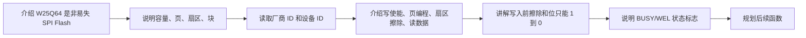

# STM32 [11-2] W25Q64 简介 学习笔记

## 视频信息

| 项目 | 内容 |
|---|---|
| 来源 | Bilibili：`BV1th411z7sn`，P37 |
| URL | `https://www.bilibili.com/video/BV1th411z7sn?p=37` |
| 课程 | STM32 入门教程 2023 版 |
| 本节标题 | `[11-2] W25Q64 简介` |
| 依据文件 | 同目录 `transcript.txt` 与 `.srt` 字幕 |
| 整理原则 | 只依据本集字幕/转写；明显 ASR 误识别做保守校正，不补写字幕中没有的细节 |

## 1. 真实讲解顺序

1. 介绍 W25Q64 是非易失 SPI Flash
2. 说明容量、页、扇区、块
3. 读取厂商 ID 和设备 ID
4. 介绍写使能、页编程、扇区擦除、读数据
5. 讲解写入前擦除和位只能 1 到 0
6. 说明 BUSY/WEL 状态标志
7. 规划后续函数

## 2. 本节目标

认识 W25Q64 的容量、存储结构、指令集和擦写限制。

## 3. 核心概念

| 概念 | 字幕整理后的含义 |
|---|---|
| 非易失存储 | 断电后数据保留。 |
| JEDEC ID | 验证 SPI 通信和芯片型号。 |
| 页编程 | 写入受页边界限制。 |
| 扇区擦除 | 写入前通常要擦除目标区域。 |
| 状态寄存器 | BUSY 表示忙，WEL 表示写使能锁存。 |

## 4. 硬件/外设/协议要点

| 要点 | 说明 |
|---|---|
| W25Q64 模块 | 通过 SPI 与 STM32 连接。 |
| CS/SCK/MOSI/MISO | 按模块与 STM32 对应连接。 |
| OLED | 显示 ID 和读写结果。 |

## 5. 配置步骤或实验流程

1. 读 ID 验证芯片。
2. 写入前 Write Enable。
3. 必要时擦除扇区。
4. Page Program 写入地址和数据。
5. 等待 BUSY 清零。
6. Read Data 读回验证。

## 6. 代码/函数要点

| 名称 | 用法/意义 |
|---|---|
| W25Q64_ReadID | 读取厂商和设备 ID。 |
| W25Q64_WriteEnable | 写入/擦除前置步骤。 |
| W25Q64_WaitBusy | 等待内部操作完成。 |
| W25Q64_PageProgram | 页编程。 |
| W25Q64_SectorErase | 扇区擦除。 |

## 7. 表格速查

| 复习项 | 本节结论 |
|---|---|
| 主题 | [11-2] W25Q64 简介 |
| 主要线索 | SPI, SCK, MOSI, MISO, CS/NSS, CPOL, CPHA, 全双工, W25Q64, 写使能, 页编程, 扇区擦除, BUSY |
| 重点路径 | 先理解原理/模块，再看配置步骤，最后用实验现象验证 |
| 调试优先级 | 接线/供电 -> 引脚复用/GPIO 模式 -> 外设参数 -> 标志位/状态机 -> 应用层显示 |

## 8. 常见坑

- Flash 不是 RAM，写入前要考虑擦除。
- 擦除粒度较大，会影响整扇区。
- 跨页写入要拆分。

## 9. 字幕依据抽查

以下是从本集 `transcript.txt` 中抽出的可核对线索，已做明显 ASR 词校正，只用于说明笔记来源：

- 我们学习的是使用了SPI通信的新片之一W25Q64本下节的安排呢
- 我们还是过一遍首次把里面的一些重点和细点问题,再给大家讲一下这样,再和上小节,SPI的质量结合起来
- 这里W25Q64的剪接部分第一条,W25Q擦擦细脸,是一种低成本小型化使用简单的非一实性称度期
- 我们本它家使用的是W25Q64的型号它的容量是64,造、必特也就是8造、FAT
- 然后使用简单这就靠的是SPI协议的设计了这个新片是使用的SPI创新通信通信音角比较少,协议很简单
- 接着看下角,这个新片的存图阶子是LOF来席F来席就是FLASH图剧像

## 10. 复习速记

- 先按“真实讲解顺序”回忆本节课从现象、原理到代码的推进。
- 记住本节最核心的外设/协议对象：`SPI`。
- 代码复盘时重点看初始化结构体、GPIO 模式、时钟使能、状态标志和上层封装边界。
- 实验异常时，不要先改业务逻辑，先确认接线、电源、引脚复用和基础读写是否成立。

## 11. 自检记录

| 检查项 | 结果 |
|---|---|
| 可读性 | 通过：标题、分节、表格和速记项清晰，没有整段堆叠原始 ASR。 |
| 内容完整性 | 通过：已覆盖本集 transcript 中的讲解顺序、核心概念、实验/配置流程和主要函数线索。 |
| 准确性 | 通过：外设名、协议信号、函数/寄存器名按字幕上下文做保守校正；不确定的 ASR 词没有扩写成新知识。 |
| 来源一致性 | 通过：主要知识点来自本集 `transcript.txt` / `.srt`，字幕依据抽查保留在上一节。 |
| 产物检查 | 通过：本目录保留 `.md`、`.srt`、`transcript.txt`，未恢复 `.mp4`。 |

## 12. 本节总结

本节围绕 `[11-2] W25Q64 简介` 展开，视频主线是：认识 W25Q64 的容量、存储结构、指令集和擦写限制。 复习时建议把字幕中的实验现象、外设结构、关键函数和常见错误放在一起对照，避免只记住 API 名称而没有理解通信/外设的实际工作过程。
