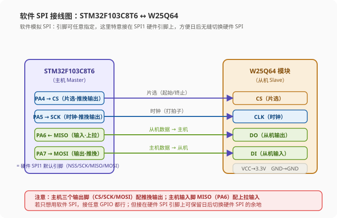
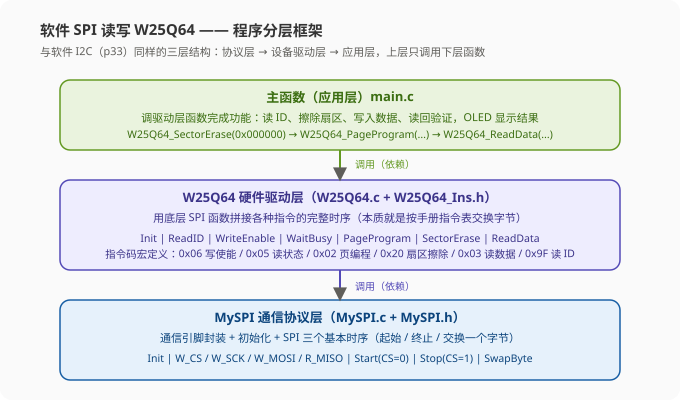
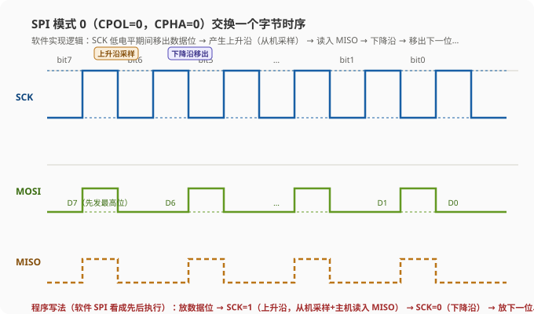
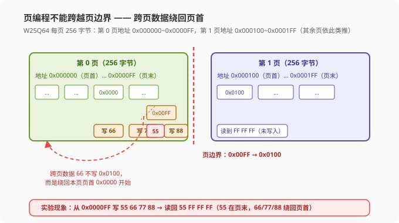
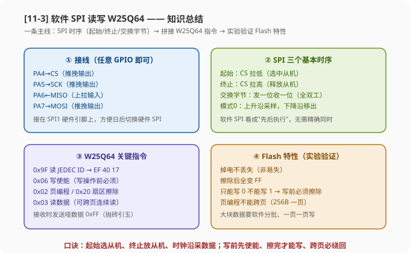

# STM32 [11-3] 软件 SPI 读写 W25Q64 — 学习笔记

> **视频来源**: [B站 江协科技 STM32入门教程-2023版 p38 [11-3]](https://www.bilibili.com/video/BV1th411z7sn?p=38)
> **芯片型号**: STM32F103C8T6 + W25Q64
> **前置知识**: SPI 通信协议（p36）、W25Q64 简介（p37）、软件 I2C 读写 MPU6050（p33，本节结构与之对照）
> **本节定位**: 用 GPIO 软件模拟 SPI 时序（bit-banging），实现对 W25Q64 Flash 的读 ID、擦除、写入、读回验证

---

## 一、课程概览

上节课我们介绍了 SPI 通信协议和 W25Q64 芯片的结构，本节课正式动手写代码：**用软件模拟 SPI（Software SPI）的方式，实现对 W25Q64 的读写**。和之前软件 I2C 的思路一样——不用 STM32 内部的硬件 SPI 外设，而是用普通的 GPIO 口，按照 SPI 协议规定的时序，手动翻转引脚电平来模拟通信。

为什么 SPI 也可以用软件模拟？因为 **SPI 是同步时序**，有 SCK 时钟线"打拍子"，每一位的时间要求并不严格，只要波形形态符合协议，通信双方就能正确解析数据。所以软件模拟 SPI 在嵌入式开发中非常常见，也特别适合初学者理解协议的本质。

> **提示**: 本节的学习路线和 p33 软件 I2C 完全对称——先把通信层的"三个基本时序"用 GPIO 实现好，再在之上拼接出设备（W25Q64）的各种指令时序，最后在主函数里调用驱动层函数完成功能。上一节学懂了软件 I2C，这一节会非常顺手。

---

## 二、硬件接线

### 2.1 接线总览

把 W25Q64 模块插在面包板的合适位置，用跳线把模块的 VCC 引到面包板正极电源孔（接 3.3V），GND 引到负极电源孔（接 GND）。剩下四个通信引脚用飞线接到 STM32：

| STM32 引脚 | 连接 | W25Q64 模块 | 说明 |
|:---:|:---:|:---|:---|
| `PA4` | → | `CS`（片选） | 主机输出，低电平选中从机 |
| `PA5` | → | `CLK`（SCK 时钟） | 主机输出，产生时钟 |
| `PA6` | ← | `DO`（从机输出/MISO） | 主机输入，读从机数据 |
| `PA7` | → | `DI`（从机输入/MOSI） | 主机输出，向从机发数据 |
| `3.3V` | → | `VCC` | 供电 |
| `GND` | — | `GND` | 地线 |



> **关键**: 软件模拟的 SPI，四个通信引脚接哪个 GPIO 都行（灵活性高，这是软件模拟的最大优势）。但老师特意接在了 PA4/PA5/PA6/PA7——这正好是 STM32 硬件 SPI1 的默认引脚（NSS/SCK/MISO/MOSI）。这样接的好处是：**以后想改用硬件 SPI 时，不用重新接线，代码里切换一下即可**。如果只打算用软件 SPI，那接任意引脚都可以，不必讲究。

接线完成后上电，观察模块上的电源指示灯点亮，说明供电正常，硬件电路部分就绪。

### 2.2 工程准备

回到工程目录，复制一个 OLED 显示屏的工程，把工程名改成"11-1 软件 SPI 读写 W25Q64"。准备工作就完成了。

---

## 三、程序整体框架规划

写代码前先规划程序的整体架构。整个工程分成三层，和上一节软件 I2C 的规划几乎一样：

1. **MySPI 模块（通信协议层）**：包含通信引脚的封装、初始化，以及 SPI 通信的三个基本时序——**起始、终止、交换一个字节**。这一层和具体设备无关，只是 SPI 协议本身。
2. **W25Q64 模块（硬件驱动层）**：基于底层的 SPI 函数，拼接出各种指令和功能的完整时序，比如**写使能、擦除、页编程、读数据**等等。这一层才是针对 W25Q64 芯片的。
3. **主函数（应用层）**：调用驱动层的函数，完成我们想要实现的功能。



---

## 四、MySPI 模块：GPIO 初始化与引脚封装

### 4.1 新建模块并初始化 GPIO

在硬件外设目录下新建模块，命名为 `MySPI`。模块建好后二话不说，先写初始化函数 `MySPI_Init`，在里面初始化 SPI 的通信引脚。

我们使用的是 PA4、PA5、PA6、PA7 四个引脚，所以先使能 GPIOA 时钟，再进行引脚初始化。**关键问题是：每个引脚应该配置成什么模式？** 回顾上一节学的 GPIO 知识：

- **输出引脚**配置为**推挽输出**；
- **输入引脚**配置为**浮空或上拉输入**。

对 SPI 主机来说，**SCK（时钟）、CS（片选）、MOSI（主机输出）都是输出引脚**，所以这三个配置为推挽输出；**MISO（主机输入）是输入引脚**，配置为浮空或上拉输入都行，我们选择**上拉输入**。看接线图，从机的 DO（MISO）对应主机的 PA6，所以**PA6 配上拉输入，其他三个（PA4、PA5、PA7）配推挽输出**。

```c
// MySPI.c

#include "stm32f10x.h"   // 设备头文件

/**
 * @brief  初始化软件 SPI 通信引脚
 * @note   CS=PA4, SCK=PA5, MISO=PA6, MOSI=PA7
 *         （恰好是硬件 SPI1 的引脚，方便日后切换硬件 SPI）
 */
void MySPI_Init(void)
{
    GPIO_InitTypeDef GPIO_InitStructure;

    /* 1. 使能 GPIOA 时钟 */
    RCC_APB2PeriphClockCmd(RCC_APB2Periph_GPIOA, ENABLE);

    /* 2. 配置三个输出引脚：CS/SCK/MOSI 推挽输出 */
    GPIO_InitStructure.GPIO_Mode = GPIO_Mode_Out_PP;    // 推挽输出
    GPIO_InitStructure.GPIO_Pin = GPIO_Pin_4 | GPIO_Pin_5 | GPIO_Pin_7;
    GPIO_InitStructure.GPIO_Speed = GPIO_Speed_50MHz;
    GPIO_Init(GPIOA, &GPIO_InitStructure);

    /* 3. 配置一个输入引脚：MISO 上拉输入 */
    GPIO_InitStructure.GPIO_Mode = GPIO_Mode_IPU;        // 上拉输入
    GPIO_InitStructure.GPIO_Pin = GPIO_Pin_6;
    GPIO_Init(GPIOA, &GPIO_InitStructure);

    /* 4. 设置默认电平：CS=1（默认不选中），SCK=0（SPI 模式0 空闲低电平） */
    MySPI_W_CS(1);
    MySPI_W_SCK(0);
}
```

> **提示**: 三个输出引脚用同一次 `GPIO_Init` 配置即可，输入引脚再单独配置一次。注意 MISO 是 PA6，别把输入引脚也配成推挽输出——那样会把从机的输出"顶死"，读不到数据。

### 4.2 引脚读写函数封装（改名）

接下来仿照上一节软件 I2C 的做法，把操作 GPIO 高低电平的函数都分别换个名字包装一下。这样做的目的是**让函数名语义化，并且方便日后移植**——如果以后换到其他型号的芯片，只需要改这几处引脚定义，上层代码完全不用动。

```c
/**
 * @brief  写 CS 引脚（片选，对应 PA4）
 */
void MySPI_W_CS(uint8_t Bit)
{
    GPIO_WriteBit(GPIOA, GPIO_Pin_4, (BitAction)Bit);
}

/**
 * @brief  写 SCK 引脚（时钟，对应 PA5）
 */
void MySPI_W_SCK(uint8_t Bit)
{
    GPIO_WriteBit(GPIOA, GPIO_Pin_5, (BitAction)Bit);
}

/**
 * @brief  写 MOSI 引脚（主机输出/从机输入 DI，对应 PA7）
 */
void MySPI_W_MOSI(uint8_t Bit)
{
    GPIO_WriteBit(GPIOA, GPIO_Pin_7, (BitAction)Bit);
}

/**
 * @brief  读 MISO 引脚（主机输入/从机输出 DO，对应 PA6）
 * @retval 引脚电平（0 或 1）
 */
uint8_t MySPI_R_MISO(void)
{
    return GPIO_ReadInputDataBit(GPIOA, GPIO_Pin_6);
}
```

其中 CS、SCK、MOSI 是输出引脚，用写函数；MISO 是输入引脚，用读函数。这样四个 SPI 通信引脚就包装好了。

> **注意**: 你也可以用宏定义完成相同的功能，但这里用函数包装更好——以后要移植到其他芯片，或者想加个延时，只需要改这几个函数。另外 SPI 的速度非常快，函数调用的开销本身就是天然的延时，所以**调用完引脚操作之后，暂时不需要额外加延时**（和软件 I2C 需要加延时不同）。

### 4.3 初始化后的默认电平

引脚初始化完成之后，还有一项工作要做：**设置初始化后引脚的默认电平**。

- **CS**：初始化后应该置为**高电平**，即"默认不选中从机"的状态（SPI 从机是低电平选中）；
- **SCK**：因为我们计划使用 **SPI 模式0**（CPOL=0，空闲低电平），所以默认置为**低电平**；
- **MOSI**：没有明确规定，可以不管；
- **MISO**：是输入引脚，不用输出电平。

所以 `MySPI_Init` 的最后两句就是 `MySPI_W_CS(1)` 和 `MySPI_W_SCK(0)`。这样初始化完之后的默认电平就设置好了。

---

## 五、MySPI 模块：SPI 三个基本时序函数

### 5.1 起始时序（MySPI_Start）

SPI 的起始时序非常简单：**把 CS 拉低**，就表示选中了从机，通信开始了。因为我们是模式0（CPOL=0），CS 低电平有效。

```c
/**
 * @brief  起始时序：拉低 CS，选中从机
 */
void MySPI_Start(void)
{
    MySPI_W_CS(0);
}
```

### 5.2 终止时序（MySPI_Stop）

终止时序更简单：**把 CS 拉高**，释放从机，通信结束。

```c
/**
 * @brief  终止时序：拉高 CS，释放从机
 */
void MySPI_Stop(void)
{
    MySPI_W_CS(1);
}
```

到这里，三个基本时序已经完成了两个。

### 5.3 交换一个字节（MySPI_SwapByte）—— 核心

最后一块也是 SPI 的核心：**交换一个字节**。注意是"交换"而不是"发送"或"接收"——因为 **SPI 是全双工通信**，主机每发送一个字节的同时，也从从机接收一个字节，两者是同时进行的。所以这个函数既能"发"又能"收"，有的地方也叫 `ReturnTransByte`（读写一个字节），都是一个意思。

W25Q64 支持的 SPI 模式中，一共有四种时序模式（模式0/1/2/3），而 W25Q64 支持模式0和模式3。**我们一般选择模式0**（CPOL=0，CPHA=0，即空闲低电平、上升沿采样）来实现。

#### 5.3.1 先讲清楚一个"哲学问题"：同时发生 vs 先后执行

看时序图，SPI 的**下降沿和数据移出是同时发生的**，后面每两个动作也都是同时的。但这并不意味着程序上要同时执行两段代码——当然也不可能做到。实际上它们是**有先后顺序**的：先有 SCK 下降沿，之后才有数据移出这个动作。**下降沿是触发数据移出的条件**，两者有因果关系。

- 对于**硬件 SPI**来说，由于内部使用硬件移位寄存器电路，这两个动作几乎是同时发生的；
- 对于**软件 SPI**来说，程序是一条一条执行的，不可能同时完成两个动作。所以软件 SPI 我们就直接"躺平"，把它看成**先后执行的逻辑**。

这个流程就是：

```
SCK 下降沿 → 移出数据 → SCK 上升沿 → 移入数据 → SCK 下降沿 → 移出数据 → …
```

这样一个具有先后顺序的流程，才对应一条条顺序执行的程序代码。

#### 5.3.2 模式0 的单步流程



结合时序图，交换一个字节的具体步骤（以收发最高位 bit7 为例）：

1. **移出数据**（SCK 低电平期间）：主机和从机同时移出数据。主机把要发数据的最高位放到 MOSI，从机把它的数据放到 MISO——MISO 上数据变化是从机的事，不用我们管。所以程序第一步是**写 MOSI**：发送的位是 `ByteSend` 的最高位，即 `ByteSend & 0x80`。

> **原理**: 这里有个"非零即一"的特性要保证——写引脚函数 `MySPI_W_MOSI()` 内部是 `GPIO_WriteBit`，只要传入非零值就会被当作高电平。所以 `ByteSend & 0x80` 的运算结果（要么是 0x80 要么是 0x00）可以直接当作电平值传入，不需要把数据位再移到最低位。

2. **移入数据**（SCK 上升沿之后）：主机和从机同时移入数据。和上面一样，从机会自动把 MOSI 上的数据位锁存走，不用我们管；**主机只需要读取 MISO 上的数据**。所以程序第二步是 `MySPI_W_SCK(1)` 产生上升沿——上升沿时从机自动采样 MOSI 的数据，而主机的任务就是在上升沿之后，把从机刚才放到 MISO 上的数据位读进来。

   读进来的数据是接收字节的**最高位**，用之前的做法：

   ```c
   MySPI_W_SCK(1);                          // 产生上升沿
   if (MySPI_R_MISO() == 1)                 // 读 MISO 上的数据位
       ByteReceive |= 0x80;                 // 如果是 1，把最高位写到接收字节里
   ```

3. **移出下一位**（SCK 下降沿之后）：SCK 产生下降沿，主机和从机移出下一位。程序 `MySPI_W_SCK(0)` 产生下降沿；下降沿后主机的任务是移出 B6（次高位），所以写 `MySPI_W_MOSI(ByteSend & 0x40)`。

之后就进入循环：SCK 上升沿 → 主机把从机的 B6 位接收进来；SCK 下降沿 → 移出下一位。如此重复 8 次，一个字节就交换完了。

> **提示**: 在交换结束时，SCK 恰好处于低电平的位置（循环最后一次是下降沿）。所以我们循环 8 次，就完整产生了这个时序模型。之后想继续交换字节可以，想终止也可以。

#### 5.3.3 方法一：掩码实现（老师最终保留的方法）

第一种方法使用 `0x80` 右移的**掩码（掩码数据）**方式，依次挑出 `ByteSend` 的每一位发送，同时把接收到的每一位通过掩码写进 `ByteReceive`：

```c
/**
 * @brief  交换一个字节（SPI 模式0，掩码实现）
 * @param  ByteSend 要发送的数据
 * @retval 接收到的数据
 */
uint8_t MySPI_SwapByte(uint8_t ByteSend)
{
    uint8_t i, ByteReceive = 0;

    for (i = 0; i < 8; i++)
    {
        // 第 1 步：SCK 低电平期间，主机移出数据位（当前最高位放到 MOSI）
        MySPI_W_MOSI(ByteSend & (0x80 >> i));   // 掩码挑出某一位，写引脚函数非零即一

        // 第 2 步：产生上升沿，从机采样 MOSI；主机读回 MISO 上的数据位
        MySPI_W_SCK(1);
        if (MySPI_R_MISO() == 1)
            ByteReceive |= (0x80 >> i);         // 把收到的位存入对应位置

        // 第 3 步：产生下降沿，为移出下一位做准备
        MySPI_W_SCK(0);
    }

    return ByteReceive;                          // 把接收到的数据返回给调用处
}
```

> **原理**: `0x80 >> i` 依次变成 `10000000`、`01000000`、`00100000`……它的作用就是**挑出数据的某一位**（或者屏蔽掉其他无关位）。这种"用掩码挑位"的数据就叫做掩码。方法一通过掩码，一次挑出每一位进行操作——**这种掩码方式不会改变传入参数 `ByteSend` 本身**，循环结束之后，如果还想继续使用最开始传入的 `ByteSend`，它还在，可以继续用。

#### 5.3.4 方法二：移位模型实现（效率更高）

对照时序图演示的"一位模型"，其实流程还可以优化——**直接对数据本身进行移位操作**，省掉接收变量：

```c
/**
 * @brief  交换一个字节（SPI 模式0，移位模型实现）
 */
uint8_t MySPI_SwapByte(uint8_t ByteSend)
{
    uint8_t i;

    for (i = 0; i < 8; i++)
    {
        MySPI_W_MOSI(ByteSend & 0x80);   // 移出最高位
        ByteSend <<= 1;                  // 左移一位：最高位移出，最低位自动补 0

        MySPI_W_SCK(1);                  // 产生上升沿，从机采样
        if (MySPI_R_MISO() == 1)
            ByteSend |= 0x01;            // 收到 1 就放到 ByteSend 的最低位
        MySPI_W_SCK(0);                  // 产生下降沿
    }

    return ByteSend;                     // 接收到的数据就存在 ByteSend 里
}
```

原理分析：`ByteSend` 左移一位后，最高位移出去了、最低位空出来（自动补 0），接下来接收到的数据正好可以放进**最低位**；下一个循环继续发送 `ByteSend` 的最高位——因为上一个循环已经左移过一次，所以第二次发送的最高位就是原始数据的**次高位**……这样循环 8 次，发送和接收都完成了，**接收到的数据就存在 `ByteSend` 里**，最后 `return ByteSend` 即可，完全没必要再定义 `ByteReceive`。

> **注意**: 方法二效率更高，但代价是** `ByteSend` 的数据在移位过程中被改变了**，循环结束后原始传入的参数就没有了。如果调用处还想继续使用最开始传入的 `ByteSend`，那就没办法了。方法一和方法二在时序实现上基本一一对应，用哪个都行，看你的喜好——**老师最终保留了第一种（掩码）方法**，因为它不破坏传入参数，语义更稳妥。

#### 5.3.5 两种方法对比小结

| 对比项 | 方法一：掩码 | 方法二：移位模型 |
|:---|:---|:---|
| 操作对象 | 用掩码提取每一位，不动原始数据 | 直接对数据本身左移 |
| 是否改变传入参数 | 不改变，之后可继续用 `ByteSend` | 改变，循环后原始值丢失 |
| 是否需额外接收变量 | 需要 `ByteReceive` | 不需要，复用 `ByteSend` |
| 效率 | 稍低 | 更高 |

### 5.4 SPI 四种模式的修改方法

这里顺便演示一下 **SPI 模式1、模式2、模式3** 怎么改。目前代码实现的是模式0，如果要改成模式1：

- 模式0 和模式1 的区别是**相位（CPHA）**不同。看时序图，模式1 是"上升沿之后移出数据"（数据移出动作相对模式0 挪了一个沿）。所以**只需要对程序的相位做小修改**——把"数据移出"的代码提前一下（移到产生上升沿的位置），就换成了模式1 的流程，是不是很简单。

模式2 和模式3 就更简单了：

- **模式1 → 模式3**：模式1 和模式3 的区别只是**时钟极性（CPOL）**不同。所以把所有出现 SCK 的地方，`0` 改成 `1`、`1` 改成 `0`，就变成模式3 了；
- **模式0 → 模式2**：同理，在模式0 的基础上，把所有 SCK 的 0、1 互换即可。

总结一句口诀：**改变相位 → 把数据移位代码提前一下；改变极性 → 把 SCK 的 0、1 互换**。

> **关键**: 本课代码使用的是 **SPI 模式0**。如果你需要用别的模式，就在这个基础上做小修改：改相位，就把数据移位代码挪个位置；改极性，就把 SCK 电平反过来。W25Q64 支持模式0 和模式3，选模式0 最常用。

到这里，SPI 的通信层代码就写完了。把下面的函数声明放到头文件里，编译一下确认没问题，接下来按照计划进入下一个模块。

---

## 六、W25Q64 驱动层：读 JEDEC ID 验证通信

### 6.1 W25Q64_Init

在 SPI 通信层之上，建立 W25Q64 的驱动层。新建模块命名 `W25Q64`。先写初始化函数 `W25Q64_Init`：

```c
// W25Q64.c

#include "stm32f10x.h"
#include "MySPI.h"      // 别忘了包含底层的头文件
#include "W25Q64.h"

/**
 * @brief  W25Q64 初始化
 * @note   W25Q64 本身不需要额外初始化其他东西，只需把底层 SPI 初始化好
 */
void W25Q64_Init(void)
{
    MySPI_Init();       // 底层 SPI 初始化好后，上层才能正常工作
}
```

作为 SPI 上层的 W25Q64 模块，它的初始化显然要调用底层的 `MySPI_Init`；而 W25Q64 自身没有需要初始化的寄存器，所以初始化函数里只要调用这一个函数就够了。编译确认没有问题，就可以开始实现真正的指令时序了。

### 6.2 指令宏定义头文件（W25Q64_Ins.h）

实现指令时序要参考数据手册，**主要参考的部分就是指令级的表格**。每个指令都对应一个指令码，如果直接在程序里写数字，意义不明显、可读性差——别人看程序根本不知道 `0x9F` 代表什么。所以像上一节 MPU6050 的宏定义一样，**把每个指令码用宏定义替换**。指令比较多，单独建一个头文件 `W25Q64_Ins.h` 存放：

```c
// W25Q64_Ins.h —— 指令宏定义（数值查 W25Q64 数据手册指令表）

#ifndef __W25Q64_INS_H
#define __W25Q64_INS_H

#define W25Q64_INS_WRITE_ENABLE        0x06    // 写使能
#define W25Q64_INS_WRITE_DISABLE       0x04    // 写禁止
#define W25Q64_INS_READ_STATUS_REG_1   0x05    // 读状态寄存器 1
#define W25Q64_INS_READ_STATUS_REG_2   0x35    // 读状态寄存器 2
#define W25Q64_INS_WRITE_STATUS_REG    0x01    // 写状态寄存器
#define W25Q64_INS_READ_DATA           0x03    // 读数据
#define W25Q64_INS_FAST_READ           0x0B    // 快速读数据
#define W25Q64_INS_FAST_READ_DUAL_OUT  0x3B    // 双输出快速读
#define W25Q64_INS_PAGE_PROGRAM        0x02    // 页编程（写数据）
#define W25Q64_INS_SECTOR_ERASE        0x20    // 扇区擦除（4KB）
#define W25Q64_INS_BLOCK_ERASE_32K     0x52    // 32KB 块擦除
#define W25Q64_INS_BLOCK_ERASE_64K     0xD8    // 64KB 块擦除
#define W25Q64_INS_CHIP_ERASE          0xC7    // 芯片擦除
#define W25Q64_INS_POWER_DOWN          0xB9    // 掉电模式
#define W25Q64_INS_RELEASE_POWER_DOWN  0xAB    // 释放掉电/读设备 ID
#define W25Q64_INS_DEVICE_ID           0xAB    // 读设备 ID
#define W25Q64_INS_MANUFACTURER_DEV_ID 0x90    // 读厂商 ID
#define W25Q64_INS_JEDEC_ID            0x9F    // 读 JEDEC ID（本课使用）
#define W25Q64_INS_READ_UNIQUE_ID      0x4B    // 读唯一 ID

#define W25Q64_DUMMY_BYTE              0xFF    // 哑数据：接收数据时交换过去的无关数据

#endif
```

上面这些宏定义依次对应指令表里的每个指令。最后多定义了一个 `W25Q64_DUMMY_BYTE` 表示 0xFF——这就是我们**接收数据时交换过去的无关数据**。编译确认没问题后，在 `W25Q64.c` 里包含 `W25Q64_Ins.h`，代码里的数字就可以替换成对应的宏定义符号了。比如 `0x9F` 替换成 `W25Q64_INS_JEDEC_ID`，一眼就能看出来是"读 ID 的指令"；`0xFF` 替换成 `W25Q64_DUMMY_BYTE`，语义也更明确。

### 6.3 W25Q64_ReadID：读 JEDEC ID

先实现"获取 ID"的时序，把 JEDEC ID 读出来看看对不对——这能一次性验证底层的 SPI 协议写得有没有问题。

从手册的指令表可以看到，读 JEDEC ID 的时序是：

```
起始 → 交换发送指令 0x9F → 连续交换接收三个字节 → 停止
```

那怎么判断哪个是交换发送、哪个是交换接收呢？指令表里已经写了：**标"需要交换接收"的，就是我们需要交换接收的数据**。这里三个字节都标注了需要接收，所以三个字节都要交换接收；另外通过时序图也能很容易看出来——你发出去的是读 ID 的指令，之后该干啥，不是很明显吗。

接收的三个字节含义：**第一个字节是厂商 ID**（表示是哪两个厂家生产的），**后两个字节是设备 ID（Device ID）**，其中设备 ID 的**高八位表示存储器类型、低八位表示容量**。

因为 `W25Q64_ReadID` 计划要有两个返回值（厂商 ID + 设备 ID），所以用**指针**来实现多返回值：

```c
/**
 * @brief  读 JEDEC ID
 * @param  MID 输出：8 位厂商 ID
 * @param  DID 输出：16 位设备 ID
 */
void W25Q64_ReadID(uint8_t *MID, uint16_t *DID)
{
    MySPI_Start();                                    // 起始：CS 拉低，开始传输

    MySPI_SwapByte(W25Q64_INS_JEDEC_ID);              // 交换发送 0x9F（读 ID 指令），返回值无意义，忽略

    *MID = MySPI_SwapByte(W25Q64_DUMMY_BYTE);         // 交换发送哑数据，换回厂商 ID

    *DID = MySPI_SwapByte(W25Q64_DUMMY_BYTE) << 8;    // 换回设备 ID 高 8 位，移到高字节

    *DID |= MySPI_SwapByte(W25Q64_DUMMY_BYTE);        // 换回设备 ID 低 8 位，拼到低字节

    MySPI_Stop();                                     // 终止：CS 拉高，时序结束
}
```

逐段讲解：

1. **起始**：`MySPI_Start()` 拉低 CS，开始传输；
2. **发送指令**：`MySPI_SwapByte(W25Q64_INS_JEDEC_ID)` 把 0x9F 发出去。SPI 起始之后的第一个字节都是指令码（芯片规定），从机收到"读 ID 号"的指令后，就会按照指令约定的规则，在**下一次交换时把 ID 号返回给主机**。这里返回的数据没有意义，所以返回值丢弃；
3. **接收厂商 ID**：`MySPI_SwapByte(W25Q64_DUMMY_BYTE)`——此时目的是接收，所以给它发什么都无所谓，但一般习惯给 0xFF。这个 0xFF 没有意义，它的目的就是"**抛砖引玉**"，把对面有意义的数据交换过来。交换回来的返回值就是我们想要的厂商 ID，存到 `MID` 指向的变量里；
4. **接收设备 ID 高 8 位**：根据手册再交换一次，收到的就是设备 ID 的高八位。把它存进 `DID` 指向的变量——但这里要注意，要把它放到**高字节**，所以 `<< 8`；
5. **接收设备 ID 低 8 位**：第三次交换，收到设备 ID 的低八位。此时必须用**或（`|=`）**，不能直接赋值——否则会覆盖掉刚放好的高字节；
6. **终止**：`MySPI_Stop()` 拉高 CS，获取 ID 的时序就完整完成了。

> **注意**（老师的强调点）: 虽然这里连续调用了两个（三个）一模一样的交换函数，但它们的返回值**并不是一样的**。千万不要以为"连续调用两个相同函数，返回值肯定一样"——我们是在通信，**通信是有时序的**！不同时间调用同一个交换函数，它的意义是不一样的：第一次换回来的是厂商 ID，第二次是设备 ID 高八位，第三次是设备 ID 低八位。

### 6.4 第一次下载测试：验证 SPI 通信

写到现在，可以进行第一次测试了。把 `W25Q64_Init` 和 `W25Q64_ReadID` 两个函数放到 `W25Q64.h` 头文件里声明，编译没问题后，回到主函数：

```c
// main.c（第一次测试：读 ID）

#include "stm32f10x.h"
#include "OLED.h"
#include "W25Q64.h"

int main(void)
{
    OLED_Init();
    W25Q64_Init();              // 初始化（内部会初始化底层 SPI）

    uint8_t MID;                // 存放厂商 ID
    uint16_t DID;               // 存放设备 ID

    W25Q64_ReadID(&MID, &DID);  // 把两个变量的地址传进去，等它执行完

    OLED_ShowHexNum(1, 1, MID, 2);     // 一行一列显示厂商 ID，长度 2 位
    OLED_ShowHexNum(1, 8, DID, 4);     // 一行八列显示设备 ID，长度 4 位

    while (1) { }
}
```

下载测试，可以看到屏幕上显示了两个数：**厂商 ID 是 EF，设备 ID 是 4017**。对照手册验证一下：EF 是 Winbond（华邦）的厂商代码，40 表示 SPI 存储器类型，17 表示 64Mbit 容量——这正是 W25Q64 的身份，**完全符合预期**。

> **关键**: 如果你在这一步不能正确读取 ID，说明你之前写的代码有问题，或者硬件接线有问题。要仔细对照检查。**走一步测一步**，确保之前的代码没问题再往后写，这样写程序心理才有底。

---

## 七、W25Q64 驱动层：核心指令时序

测试通过后，接下来的任务就是**把指令表里标黄的这些指令时序都实现出来**。指令比较多，但套路都一样：起始 → 交换发送指令码 → （按需发送地址/数据）→ 停止。

### 7.1 写使能 WriteEnable（0x06）

这个指令最简单：只需发送一个指令码 0x06 就行了，指令后续不需要跟任何数据，所以"起始 → 交换发送指令 → 直接停止"：

```c
/**
 * @brief  写使能（执行写操作之前必须先调用）
 * @note   写使能仅对之后紧接着的一条时序有效，时序结束会自动"关门"
 */
void W25Q64_WriteEnable(void)
{
    MySPI_Start();
    MySPI_SwapByte(W25Q64_INS_WRITE_ENABLE);   // 发送 0x06，无后续数据
    MySPI_Stop();
}
```

### 7.2 读状态寄存器1（0x05）

下一个指令是读状态寄存器1，指令码 0x05。发送完指令就可以接收状态寄存器了。我们读状态寄存器1的主要用途就是**判断芯片是不是忙（BUSY）状态**：状态寄存器1 的定义在前面有说明，**最低位 bit0（BUSY）为 1 表示芯片还在忙，为 0 表示不忙**。

最好再实现一个"等待 BUSY 为 0"的函数，这样更符合我们的需求。

### 7.3 等待忙 WaitBusy

读状态寄存器1/2 的时序是：起始之后先发送指令码，再接收状态寄存器；**如果持续不停地交换，这个芯片就会继续把最新的状态寄存器发过来**——手册里写的就是"状态寄存器可以被你连续读出"。这个**连续读出**特性，正好方便我们实现等待功能：

```c
/**
 * @brief  等待忙状态结束
 * @note   利用"状态寄存器可连续读出"特性，循环读取 BUSY 位直到其为 0
 */
void W25Q64_WaitBusy(void)
{
    uint32_t Timeout = 100000;             // 超时保护：初始值自己估摸一下，给大一点
    uint8_t Status;

    MySPI_Start();
    MySPI_SwapByte(W25Q64_INS_READ_STATUS_REG_1);   // 发送指令 0x05

    Status = MySPI_SwapByte(W25Q64_DUMMY_BYTE);     // 发送哑数据，换回状态寄存器1
    while ((Status & 0x01) == 0x01)                 // 取最低位判断：BUSY=1 说明芯片忙
    {
        Status = MySPI_SwapByte(W25Q64_DUMMY_BYTE); // 连续读出最新的状态寄存器
        Timeout--;                                  // 每循环一次超时计数减 1
        if (Timeout == 0)                           // 超时到 0 就退出，避免卡死
            break;                                  // 退出前可跳到自定义的错误处理
    }

    MySPI_Stop();                                   // 终止时序
}
```

逐段讲解：先 `MySPI_Start()`，发送读状态寄存器1 的指令码 0x05；然后发送哑数据 0xFF 换回状态寄存器1，把它**与上 0x01** 取出最低位——如果 `(Status & 0x01) == 0x01`，说明 BUSY=1，进入 `while` 循环等待：再次读出一次状态寄存器继续判断，直到 BUSY 为 0 才跳出循环。这样利用"连续读出状态寄存器"的特性，就实现了等待 BUSY 的功能。

> **提示**: 如果担心死循环在意外情况下会导致程序卡死，可以加一个**超时**：循环之前给 `Timeout` 赋一个初值（自己估摸一下，稍微给大点，比如 100000），在循环里每转一次 `Timeout--`，如果减到 0 就超时退出；退出前也可以跳到自定义的错误处理里。加不加看你的需求。
>
> 这个 `W25Q64_WaitBusy` 函数如果芯片不忙会很快返回，如果忙就会卡在函数里面等待，等不忙了才会返回。

### 7.4 页编程 PageProgram（0x02）

页编程（写入数据）的格式是：先发送指令码 0x02，再发送**三个字节的地址**，最后发送数据。注意这里的数据是**发送方向**的——手册里有的地方把"Dummy"标成接收数据，对这个指令来说应该是写错了。

```c
/**
 * @brief  页编程（写数据）
 * @param  Address   起始地址（24 位）
 * @param  DataArray 要写入的数据（通过指针传递）
 * @param  Count     写入的数据个数（0~256，故用 16 位）
 */
void W25Q64_PageProgram(uint32_t Address, uint8_t *DataArray, uint16_t Count)
{
    uint16_t i;

    MySPI_Start();
    MySPI_SwapByte(W25Q64_INS_PAGE_PROGRAM);        // 发送指令码 0x02

    MySPI_SwapByte(Address >> 16);                  // 地址最高字节（23~16 位）
    MySPI_SwapByte(Address >> 8);                   // 地址中间字节（15~8 位）
    MySPI_SwapByte(Address);                        // 地址最低字节（7~0 位）

    for (i = 0; i < Count; i++)
        MySPI_SwapByte(DataArray[i]);               // 依次发送要写入的数据

    MySPI_Stop();
}
```

参数设计上的几个注意点：

- **`Address` 用 32 位类型**：因为 C 语言里没有 24 位的数据类型，所以定义成 32 位的；
- **`DataArray` 用指针传递**：如果只想指定地址写一个字节，直接传一个数据就行；但我们一般存储的数据比较多，每次都调用函数只发一个字节效率太低，所以用指针把整个数据数组传进来（不会用指针传递数据的同学，可以复习指针章节）；
- **`Count` 用 16 位**：页编程一次性写入数据的范围是 0~256，如果定义成 8 位的，只能存 0~255——当你需要写入 256 个数据时就会出问题。

函数体拼接时序：先 `MySPI_Start()`，发送指令码 0x02；然后连续交换发送三个字节的地址（**高位字节先发送**），三次右移分别取出 24 位地址的最高、中间、最低字节；根据指令规定，发完地址后就可以一次发送写入的数据了——复制"交换发送"的代码，第一次写入 `DataArray[0]`、第二次写入 `DataArray[1]`……依次进行，所以用 `for` 循环交换发送 `DataArray[i]` 即可；最后 `MySPI_Stop()`。

### 7.5 扇区擦除 SectorErase（0x20）

接下来是擦除功能。W25Q64 有四种擦除选项：扇区擦除（4KB）、32KB 块擦除、64KB 块擦除、芯片擦除。老师只演示**扇区擦除**，其他擦除都非常类似，应该好理解。

执行扇区擦除需要先发送指令 0x20，再发送三个字节的地址，**指令地址所指的整个扇区就会被擦除**：

```c
/**
 * @brief  扇区擦除（擦除 4KB 扇区）
 * @param  Address 扇区地址（24 位）
 */
void W25Q64_SectorErase(uint32_t Address)
{
    MySPI_Start();
    MySPI_SwapByte(W25Q64_INS_SECTOR_ERASE);        // 发送指令码 0x20

    MySPI_SwapByte(Address >> 16);                  // 地址最高字节
    MySPI_SwapByte(Address >> 8);                   // 地址中间字节
    MySPI_SwapByte(Address);                        // 地址最低字节

    MySPI_Stop();
}
```

### 7.6 读数据 ReadData（0x03）

读数据是"最后一个指令"。时序是：交换发送指令 0x03，再发送三个字节地址，随后转入接收就可以**一直接收数据**了。从手册时序图可以看到：发送完三个字节地址后，DO 开启输出（进入高阻/输出状态），主机就可以接收有用数据；**接收时 MOSI 上传的数据是 0xFF 表示无关紧要**（哑数据区）。

> **原理**: 手册时序图里有一段"哑数据（Dummy）"区间，标注"给他发个 FF 就行，返回也是无关数据"——相当于抛砖引玉，接收到的数据都是没有意义的。它这么干，有的情况是为了给内部电路延时做准备（交换几个无关数据相当于有短暂延时）；也可能是在这段哑数据期间给内部电路产生一些额外的时钟，做一些准备工作。具体原因不一定深究，**总之见到这个哑数据，按规定交换一个无关数据就行了**。

读数据有几个特点：连续接收多次时，**芯片内部地址会自动递增**，而且**读数据没有页的限制，可以跨页连续读**。既然读的范围可以非常大（16 位数据最大只能到 65535，可能不够），所以 `Count` 参数**改成 32 位类型**：

```c
/**
 * @brief  读数据（无页限制，可跨页连续读，地址自动递增）
 * @param  Address   起始地址（24 位）
 * @param  DataArray 存放读出的数据
 * @param  Count     读取的数据个数（32 位）
 */
void W25Q64_ReadData(uint32_t Address, uint8_t *DataArray, uint32_t Count)
{
    uint32_t i;

    MySPI_Start();
    MySPI_SwapByte(W25Q64_INS_READ_DATA);           // 发送指令码 0x03

    MySPI_SwapByte(Address >> 16);                  // 地址最高字节
    MySPI_SwapByte(Address >> 8);                   // 地址中间字节
    MySPI_SwapByte(Address);                        // 地址最低字节

    for (i = 0; i < Count; i++)
        DataArray[i] = MySPI_SwapByte(W25Q64_DUMMY_BYTE);   // 发哑数据，换回读到的数据

    MySPI_Stop();
}
```

函数体前半段和页编程一样：起始 → 发送指令码 0x03 → 连续发送三个字节地址。然后根据协议规定，从这里开始就要转入读：复制"抛砖引玉"的代码——发送 0xFF 交换回有用的数据，**返回值就是读到的数据**，放到 `DataArray` 的某个位置；复制、继续读，放到第 1 位置、第 2 位置……依次进行。因为**每次调用交换读数据之后，芯片内部地址会自动递增**（新片内部地址自动递增，数据依次"顶上来"），数据就可以依次存在递增地址的数组里。所以套一个 `for (i = 0; i < Count; i++)` 循环，每次循环读一个字节放到 `DataArray[i]`，想读多少读多少。读完之后 `MySPI_Stop()` 终止时序。

到这里，基本的函数就写满了，编译确认没问题。

### 7.7 写使能的自动封装

每条时序写完之后，还可以做一项方便以后使用的工作——对应手册上的"注意事项"第一条：**写入操作前，必须先进行写使能**。在我们这里，涉及写入操作的时序有**页编程**和**扇区擦除**。

既然每次写入之前都必须写使能，那就**直接在这两个函数前面自带一个写使能**：把上面的 `W25Q64_WriteEnable` 调用放在扇区擦除函数前面，页编程函数开头也加一个写使能。这样之后在调用写入的函数时，就不用再额外调用写使能了，方便一些。

> **注意**: 写使能**仅对之后紧接着的一条时序有效**，一条时序结束会顺手"关门"（自动失效）。所以我们在每次写入之前都加一条写使能，写完就不用再管了——这就是写使能的操作方式。

### 7.8 等待忙的时机：后等待 vs 前等待

还要处理一件事：**写入操作结束后，芯片会进入忙（BUSY）状态**，所以在每次写操作时序结束后，可以调用一下 `W25Q64_WaitBusy`。但这里涉及"等待时机"的两种选择：

- **后等待**（老师的选择）：在每次写入之后**立刻**等 BUSY 清零再退出。这样最保险——函数结束后芯片肯定是不忙的状态；
- **前等待**：写入时序结束后**不等**，而是在每次操作**之前**在这个位置先等待，等不忙了再写入。这样效率会高一些——因为你写完之后不等，可以去执行其他代码，正好利用执行其他代码的时间来"抵消"等待的时间，说不定下一次调用时时间已经过去了，就不用等了。

两者的区别总结：

| 对比项 | 后等待 | 前等待 |
|:---|:---|:---|
| 保险程度 | 最保险（结束后肯定不忙） | 依赖调用方配合 |
| 效率 | 稍低（写完傻等） | 更高（写完去干别的） |
| 调用时机 | 只需在写入操作之后调用 | 写入操作和读取操作之前都得调用 |

> **关键**: 最后一个区别很重要——**前等待在写入操作和读取操作之前都得调用**，因为在芯片忙的时候，读取也是不行的。所以如果采取前等待，读取操作之前也得等。这里老师选择**后等待**：在页编程之后执行等待，擦除操作之后也来个后等待；而读取数据时，前等后等都不用——因为每次写操作之后都已经等过了，调用 `ReadData` 时芯片肯定不会忙。

至此，整个 W25Q64 驱动模块就写好了。

---

## 八、主程序测试与实验现象

把最后散干函数（`W25Q64_PageProgram`、`W25Q64_SectorErase`、`W25Q64_ReadData`）放到头文件里声明；**写使能和等待忙这两个函数不用外部调用**（已内嵌在写入函数里），不需要在头文件暴露。编译一下没问题，到主函数来执行测试。

### 8.1 基础读写测试

```c
// main.c（基础读写测试）

#include "stm32f10x.h"
#include "OLED.h"
#include "W25Q64.h"

uint8_t WriteData[] = {0x01, 0x02, 0x03, 0x04};   // 要写入的数据
uint8_t ReadData[4];                              // 存放读出的数据

int main(void)
{
    OLED_Init();
    W25Q64_Init();

    uint8_t MID;
    uint16_t DID;
    W25Q64_ReadID(&MID, &DID);
    OLED_ShowHexNum(1, 1, MID, 2);       // 显示厂商 ID
    OLED_ShowHexNum(1, 5, DID, 4);       // 显示设备 ID

    OLED_ShowString(2, 1, "W:");         // 第 2 行显示写入的数据
    OLED_ShowString(3, 1, "R:");         // 第 3 行显示读回的数据

    /* 在指定位置写入前，先擦除扇区 */
    W25Q64_SectorErase(0x000000);        // 擦除地址最好对齐扇区起始地址

    /* 写入数据 */
    W25Q64_PageProgram(0x000000, WriteData, 4);

    /* 读回数据 */
    W25Q64_ReadData(0x000000, ReadData, 4);

    /* 显示写入与读回的数据 */
    OLED_ShowHexNum(2, 3, WriteData[0], 2);
    OLED_ShowHexNum(2, 6, WriteData[1], 2);
    OLED_ShowHexNum(2, 9, WriteData[2], 2);
    OLED_ShowHexNum(2, 12, WriteData[3], 2);
    OLED_ShowHexNum(3, 3, ReadData[0], 2);
    OLED_ShowHexNum(3, 6, ReadData[1], 2);
    OLED_ShowHexNum(3, 9, ReadData[2], 2);
    OLED_ShowHexNum(3, 12, ReadData[3], 2);

    while (1) { }
}
```

几个要点：

- **擦除地址要对齐扇区起始**：虽然地址精确到了某个字节，但擦除操作是整个扇区一起擦的，最好把它对齐到扇区的起始地址。扇区起始地址有规律：每个扇区地址都是 0x000000、0x001000、0x002000……（每 4KB 一个扇区），**只要末尾三个十六进制数是 0，它就肯定是扇区的起始地址**。地址末尾三位是扇区内的地址，无论怎么变，它都落在同一个扇区里，所以末尾三位随便写，擦除的都是同一个扇区；但一般我们还是用扇区起始地址来擦除，这样意义更明确；
- **写入**：`W25Q64_PageProgram(0x000000, WriteData, 4)` 从 0x000000 开始写入 4 个字节；
- **读回**：`W25Q64_ReadData(0x000000, ReadData, 4)` 再从同样地址读回来，OLED 上第 2 行显示 W（写入的数据）、第 3 行显示 R（读回的数据）。

下载运行，可以看到：**第 2 行写入是 01 02 03 04，第 3 行读回也是 01 02 03 04**，读写一致。把写入数据改成 A1 B2 C3 D4，再下载，读回也是 A1 B2 C3 D4——读写基本没问题。

### 8.2 实验一：掉电不丢失

把擦除和写入这两条调用注释掉，只保留读取，编译下载。**断电重新上电**（掉电重启），读出的数据仍然是 A1 B2 C3 D4——说明数据是**掉电不丢失**的（Flash 的非易失特性）。

### 8.3 实验二：擦除之后变为 FF

解除擦除的注释、**只擦除不写入**，下载。可以看到读出的数据**全是 FF**——说明擦除之后数据变为 FF（Flash 擦除就是把所有位擦成 1）。

### 8.4 实验三：FLASH 只能写 0，不能写 1

先验证"有擦除的写入"：注释掉擦除，先写入 A1 B2 C3 D4，下载，写入什么读回什么，数据不会出错。

然后**不擦除直接改写**：原来写入的是 A1 B2 C3 D4，想直接改写为 55 66 77 88，会发生什么？下载，可以看到写入 55 66 77 88，读出来的却**不是**这组数——**A1 直接改写为 55，为什么会变成 01？**

因为 Flash 的写操作本质是**按位与**：写入 1 时保持原值，写入 0 时把原位的 1 清成 0。A1 改写为 55：`A1 & 55 = 10100001 & 01010101 = 00000001 = 01`。**不执行擦除，读出的数据 = 原始数据 & 写入数据**（按位与）。所以直接覆盖改写的数据大概率是错的。

> **关键**: 通过这个实验我们就知道了——**写入数据前必须先擦除**，否则直接覆盖改写的数据大概率是错的。擦除（全部变 1）之后再写入，按位与的结果就等于写入数据本身了。

### 8.5 实验四：写入数据不能跨页

最后验证"写入数据不能跨页"的现象。W25Q64 每页 256 字节，页地址有规则：页地址范围是 0x000000~0xFFFFFF（按页为单位），**每页的起始地址末尾是 00**，**每页最后一个字节的地址末尾是 FF**。

从页的最后一个地址开始写，看看能不能成功跨越到下一页：

```c
/* 从第 0 页最后一个字节开始写 4 个字节 */
W25Q64_SectorErase(0x000000);
W25Q64_PageProgram(0x0000FF, WriteData, 4);    // 起始地址末尾是 FF，页的最后一个字节
W25Q64_ReadData(0x0000FF, ReadData, 4);        // 读数据也从页末开始读
```



分析这个现象：

1. 写入 55 66 77 88，读出的确是 **55 FF FF FF**——说明**写入数据并没有跨越页边界**：55 写在了地址 0x0000FF，而 66 **并没有**跨越到下一个地址 0x0100（下一页页首），而是**返回了第一页的页首 0x0000**；
2. 又因为**读数据是能跨页连续读的**，所以读到的那三个 FF 是**第二页**的数据——第二页是擦除过的、没有写入，所以默认读出来是 FF；
3. 再把读取改到第一页的起始位置 0x0000，可以看到之前写入了后三个字节（66 77 88）确实在第一页的起始位置。

用一个图表理解：比如第一页开始地址是 0x0000，最后一个字节地址是 0x00FF；第二页开始地址是 0x0100。从第一页的最后一个字节 0xFF 开始写连续四个字节，第一个数据 55 肯定在指定位置；**关键的下一个字节，从地址 0x00FF 到 0x0100 跨越了页边界**——页编程是不能跨越写入的，所以下一个数据不会写到地址 0x0100，而是回到第一页的页首 0x0000 开始写。这就是**页边界**的重要性：不能跨越写入。

> **注意**: 如果你确实要写一个很大的数据连续写入，只能自己从软件上分批写进去：先计算你的数据总共需要跨多少页，然后该分组的分组，最后再分批一页一页写。这个分组可以封装成一个函数，只要用封装的函数就可以跨越连续写入了。这个功能就留给大家自己编写完成了。

---

## 九、常见问题与避坑

| 现象 | 原因 | 解决方法 |
|:---|:---|:---|
| JEDEC ID 读不出来（不是 EF 40 17） | SPI 通信根本没通 | 检查接线（CS/SCK/MOSI/MISO 有没有接错）、模块供电是否正常（LED 亮？）、引脚模式配置是否正确 |
| MISO 读到全 0 或全 1 | PA6 被误配成推挽输出，或接线松了 | PA6 必须配上拉输入（GPIO_Mode_IPU），检查飞线是否接牢 |
| 写入后读回全是 FF | 没有写使能，或写操作没执行成功 | 确认写操作前调用过写使能（0x06）；页编程前必须先扇区擦除 |
| 直接改写数据读回不对 | 没先擦除就写入 | Flash 只能写 0 不能写 1，写入前必须先擦除（擦除后变 FF） |
| 从页末连续写数据读回有 FF | 页编程不能跨页 | 超过页边界的数据会绕回页首，大块数据要软件分批一页一页写 |
| 程序偶尔卡住不运行 | 等待 BUSY 死循环 | 给 `WaitBusy` 加超时保护，超时后跳错误处理 |
| 使用了错误的 SPI 模式 | 模式0/1/2/3 相位极性配错 | W25Q64 支持模式0和模式3；改相位→移位代码提前，改极性→SCK 0/1 互换 |

---

## 十、知识总结



**本节课的核心脉络**：

1. **接线**：软件 SPI 引脚任意（灵活性高），本课特意接 PA4/PA5/PA6/PA7（=硬件 SPI1 引脚），保留日后切换硬件 SPI 的余地；主机三个输出配推挽，MISO 配上拉输入；初始化后 CS=1、SCK=0。
2. **SPI 三个基本时序**：起始（CS 拉低）、终止（CS 拉高）、交换一个字节（全双工，发一位收一位）；软件 SPI 把"同时发生"看成"先后执行"（下降沿移出、上升沿采样，循环 8 次）。
3. **交换字节的两种实现**：掩码法（不破坏传入参数，老师采用）vs 移位模型（效率更高但原始数据丢失）；四种模式修改口诀：**改相位→移位代码提前，改极性→SCK 0/1 互换**。
4. **W25Q64 驱动层套路**：起始 → 发送指令码 → （发 3 字节地址）→ （发/收数据）→ 停止；指令码用宏定义（`W25Q64_Ins.h`）；接收时发哑数据 0xFF "抛砖引玉"。
5. **关键指令**：0x9F 读 JEDEC ID（EF 40 17）验证通信；0x06 写使能（写前必调，自动封装进写函数）；0x05 读状态寄存器1（BUSY 位）；0x02 页编程；0x20 扇区擦除；0x03 读数据（可跨页连续读）。
6. **等待策略**：后等待（写后立刻等，最保险）vs 前等待（写前等，效率高但读前也要等）；本课用后等待。
7. **Flash 特性（实验验证）**：掉电不丢失；擦除后全变 FF；只能写 0 不能写 1（写入=按位与，写前必须擦除）；页编程不能跨页（256B 一页，跨页数据绕回页首，大块数据要软件分批）。

**记忆口诀**：

```
SPI 三时序：起始选从机、终止放从机、沿上交换字节（全双工，发一收一）
模式 0：空闲低电平，上升沿采样、下降沿移出
指令套路：起始 → 指令码 → 地址 → 数据 → 停止
写前先使能，擦完才能写，只能 0 变 1、不能 1 变 0（按位与）
页编程 256 字节一页，跨页必绕回页首
```

**下一节预告**：p39 开始学习 STM32 的硬件 SPI 外设，用硬件 SPI 的方式实现同样的读写 W25Q64 功能。

---

*笔记生成时间: 2026-08-06 | 基于 B站视频 BV1th411z7sn p=38 转录*
