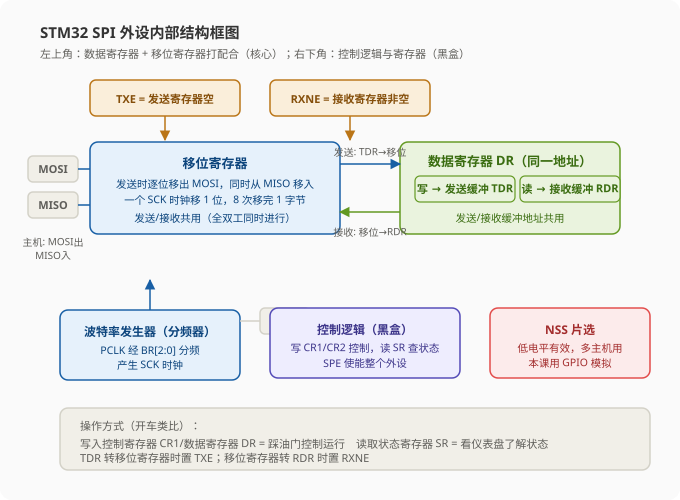
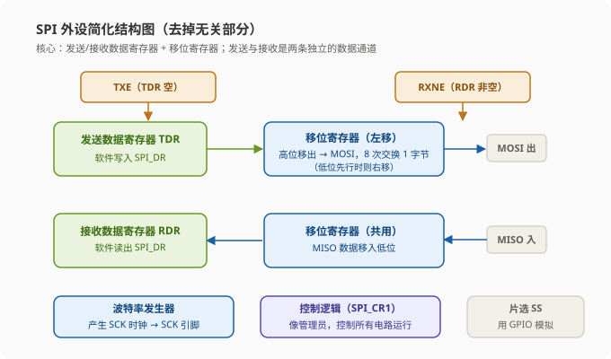
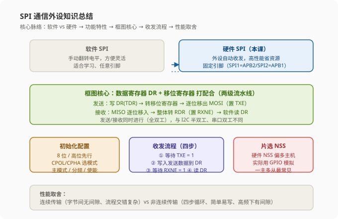

# STM32 [11-4] SPI 通信外设 — 学习笔记

> **视频来源**: [B站 江协科技 STM32入门教程-2023版 p39 [11-4]](https://www.bilibili.com/video/BV1th411z7sn?p=39)
> **芯片型号**: STM32F103C8T6
> **前置知识**: SPI 通信协议（p36）、W25Q64 简介（p37）、软件 SPI 读写 W25Q64（p38）
> **本节定位**: 硬件 SPI 外设的原理、内部结构框图、寄存器与主机收发时序流程（纯理论课，程序现象与软件 SPI 一致，故不做演示，下一节 p40 再写代码）

---

## 一、课程概览：从软件 SPI 到硬件 SPI

上一节我们学习了 SPI 的通信协议，并用 GPIO 口模拟的软件 SPI 成功驱动了 W25Q64。而本节课要学习的，是 STM32 内部的**硬件 SPI 外设**。

回想软件 SPI 的做法：我们用代码手动翻转电平，按照协议规定的时序产生波形。而硬件 SPI 的思路和之前 I2C 那节课完全一样——**使用 STM32 内部的 SPI 外设（硬件收发电路）来实现时序**。这两种实现方法各有优势：

- **软件实现**：主打方便灵活。任意引脚都能用、时序完全可控，适合学习和快速验证。
- **硬件实现**：主打高性能，可以节省软件资源。硬件自动收发，CPU 不用一直盯着翻转电平。

不过在这里提前说一句：**SPI 这个协议，用软件模拟本来就不难**（因为它是同步时序，对每位的时间要求并不严格）。相比之下，I2C 的软件模拟非常流行，很多产品里软件 I2C 大行其道；而 SPI 因为硬件外设普及度高、使用也简单，所以实际工程中基本都是用硬件 SPI。我们的学习安排和 I2C 类似：先软件后硬件，把两者的思路都打通。

> **原理**: 为什么说"软硬兼施"是个好策略？因为**软件模拟是在教我们"协议到底是怎么回事"**（每一个电平翻转都是对协议最直接的理解）；**硬件外设则是教我们"芯片怎么替我们干活"**（写寄存器配置、查标志位收结果）。两条路都走一遍，才能既懂协议、又会用外设。

---

## 二、SPI 外设简介：硬件收发电路

翻开手册看 SPI 外设简介，第一条就是：**STM32 内部集成了一个硬件 SPI 收发电路**。就像 USART 是串口的硬件收发器、I2C 外设是 I2C 的硬件收发器一样，SPI 外设就是 SPI 通信的硬件收发器。

有了这个硬件电路，就可以由硬件自动执行时序、自动生成数据收发等功能，从而**减轻 CPU 的负担**。换句话说：硬件电路自动翻转电平、自动完成时序，我们不用再像软件 SPI 那样手动翻转电平了，软件只需要写入数据寄存器 DR、读取状态寄存器 SR，剩下的事交给外设。

紧接着，手册列出了 STM32 内部 SPI 外设的一堆功能和技术参数。老师提醒：**看这些功能的时候会觉得比较繁杂**。这是有原因的——

> **原理**: 为什么外设功能这么多？因为**硬件电路不像软件那么灵活**。硬件电路一旦设计出来，功能基本上就定死了，之后只能通过一些开关电路、数据选择器之类的结构去微调电路的运行。不像软件，想改功能只需要改代码就行。所以芯片设计者在设计时，就要考虑最全面的应用场景，把各种可能的结构都设计出来放在里面，免得用户要用的时候找不到。这就导致外设电路的结构和资料非常多，而且有很多功能我们基本用不到。

因此老师给了一个重要的学习方法：

> **关键**: 学习 STM32 要使用**"主线 + 分支"**的设计方法。先把最常用、最简单的**主线**知识点搞通、学会，然后再逐渐细化，在实际使用中慢慢探索这些分支。看手册时如果遇到一些感觉非常偏、非常冷门的知识点，可以先不必深究，先把主线的东西拿下，其他的以后再研究。这样学起来才比较容易。

---

## 三、SPI 外设功能特性

下面把 SPI 外设的功能特性逐条过一遍。老师提前说明：这些功能介绍都比较繁杂，主线是最常用的配置，分支内容了解即可。

### 3.1 数据帧格式：8 位或 16 位、高位先行或低位先行

**SPI 最常用的配置就是：8 位数据帧 + 高位先行。**

什么是 8 位数据帧？看 SPI 的波形，每次交换的数据都是 8 个 bit——这就是 8 位数据帧。通信一般都以一个字节（8 位）为最小单位，所以 8 位帧用得最多。

那 16 位数据帧是什么意思？就是我们可以往数据寄存器 DR 写入一个 `uint16_t`（16 位无符号整数类型）的数据，这样它一次性就可以发 16 位（两个字节）。从波形上看，16 位数据帧的波形和连发两次 8 位数据是一样的。实际开发中 8 位帧占了绝大多数，16 位帧用得很少。

然后是高位先行或低位先行：

- **高位先行（MSB First）**：发送时先发数据的最高位。比如我想发 `0x34`，转成二进制就是 `00110100`（左边是数据高位，右边是数据低位），产生波形时数据从高位到低位依次出现，波形就是 `0 0 1 1 0 1 0 0`。**SPI 和 I2C 都采用高位先行的策略**。
- **低位先行（LSB First）**：发送时先发数据的最低位。**与 SPI/I2C 不同的是串口，串口是低位先行的**。

老师特意用 `0x55` 举了个低位先行的例子：`0x55` 转成二进制是 `01010101`。低位先行时，数据从低位到高位依次出现，所以波形从前往后看是 `1 0 1 0 1 0 1 0`；而我们要反着读——**从右往左看**，`0 1 0 1 0 1 0 1` 才是 `0x55`。

> **注意**: 高位先行还是低位先行，这个配置**通信双方必须一致**，否则数据就会读反。画波形图时也容易画错——低位先行看起来就像"反着"的波形，其实图没有画错，是要反过来看。这一点要注意一下。

### 3.2 时钟频率 SCK

SCK 就是时钟线的频率，**一个 SCK 时钟交换一个 bit**，所以 SCK 频率一般就是传输速率，单位是 Hz 或 bit/s。

SPI 的时钟频率由外设时钟 PCLK 分频得到：

```
SCK 频率 = PCLK ÷ 分频系数
```

分频系数可以配置为 2、4、8、16、32、64、128、256 这八个值。PCLK 就是外设时钟：**APB2 的 PCLK 是 72MHz，APB1 的 PCLK 是 36MHz**。

我们的 SPI1 挂在 APB2 上，PCLK = 72MHz，那么它的 SPI 时钟频率最大就是二分频：72 ÷ 2 = **36MHz**。回想之前 I2C 的频率最大只有 400kHz，所以 SPI 的最大频率比 I2C 快了 **90 倍**（36MHz ÷ 400kHz = 90）。

> **注意**: 关于频率有三个容易忽略的点：
> 1. **频率数值并不是任意设置的**，它只能是 PCLK 执行这些分频后得到的数字，一共就只有 8 个选项；最低频率是 PCLK 的 256 分频。
> 2. **SPI1 和 SPI2 挂的时钟总线不一样**：SPI1 挂在 APB2（PCLK = 72MHz），SPI2 挂在 APB1（PCLK = 36MHz）。所以同样的分频配置下，SPI1 的时钟频率要比 SPI2 大一倍。这个在开启时钟和计算频率时要特别注意。

### 3.3 多主机模型、主/从操作（了解）

SPI 外设支持多主机模型，可以做主机也可以做从机。这一块老师只要求了解即可——和之前 I2C 一样，手册里也有大量篇幅介绍多主机或主从模式，写得比较复杂，但实际用的很少。**我们只学习 SPI 做主机的情况**。

### 3.4 可配置为半双工或单工通信（了解）

正常的 SPI 是两个数据线：MOSI（主机发送、从机接收）、MISO（主机接收、从机发送），收发同时进行，这就是**全双工**。

- **半双工**：去掉一个数据线，只在其中一根线上分时进行发送或接收，这时通信线就只有一根双向数据线。
- **单工**：直接去掉接收的数据线，只在发送线上只发（单向发送，只发 MOSI）；或者直接去掉发送的数据线，只在接收线上只收（单向接收，只收 MISO）。

这些是 STM32 对 SPI 做的一些改动，为特殊情况提供支持。不过既然我们选择 SPI，正常情况下应该是要发挥它全双工的优势，所以这些精简模式一般不用，大家了解即可。

### 3.5 支持 DMA（了解）

SPI 支持 DMA 来自动搬运数据。如果我们需要快速传输大量的数据，使用 DMA 就比我们手动（逐字节查询标志位）操作更高效。但如果只是少量数据，就没必要上 DMA 了。

### 3.6 兼容 I2S 音频协议（了解）

SPI 外设还可以配置为 **I2S**——注意别和 I2C 搞混！I2S 和 I2C 除了名字有点像、都是飞利浦公司提出的之外，其他地方基本上是完全不一样的。**I2S 是一种数字音频信号传输的专用协议**。

老师简单介绍了一下 I2S 的应用场景：

> **原理**: 比如主控芯片里存放了一首音乐的数据——这个数据其实就是一个点一个点的电压数值，是数字信号。要把这个音乐播放出来，就得外接一个音频解码器（实际上就是 DAC 数模转换器），它负责把数字信号转成模拟信号，然后驱动扬声器把音乐播放出来。那么，数字信号发送到 DAC 的这些线路上，**数据怎么发？每一位数据的定义是什么？时序实际该怎么产生？产生速度是多快？**——这些配置就可以制定一个标准，这个标准就是数字音频输出协议，I2S 就是其中一种。

因为 I2S 和 SPI 有一些共同的特性，所以 SPI 和 I2S 的电路可以共用，最大化的利用资源。比如手册里 SPI 这一章，就有一半的内容都在介绍 I2S。大家知道 I2S 是什么东西就行了，感兴趣的话可以看看，我们基本使用不到。

### 3.7 本型号 SPI 资源：SPI1 与 SPI2

看我们这个型号（STM32F103C8T6）的 SPI 资源：**硬件 SPI 有 SPI1 和 SPI2 两个**。其中 **SPI1 是 APB2 外设，SPI2 是 APB1 外设**。

| 外设 | 挂载总线 | PCLK | 开时钟注意点 |
|:---|:---|:---|:---|
| `SPI1` | APB2 | 72 MHz | 开启 APB2 外设时钟 |
| `SPI2` | APB1 | 36 MHz | 开启 APB1 外设时钟 |

**开启时钟的时候需要注意挂在哪条总线上，计算 SPI 时钟频率时也要注意**，其他的操作基本没有区别。

---

## 四、SPI 外设框图详解（重点）



整体看一下 SPI 的框图，可以大致把它分成两部分：

- **左上角一部分**：数据寄存器和移位寄存器打配合的过程。这个和串口、I2C 的设计思路一脉相承，主要是为了实现连续的数据流——一个个数据前铺后继的效果。
- **右下角一部分**：控制逻辑和寄存器的标志位控制。这部分会产生各种标志，可以通过手册的寄存器描述查到。至于执行细节，手册里没有详细画出来，我们只要知道功能就行。

### 4.1 移位寄存器与 LSBFIRST

先看左上角横向这一块——移位寄存器。图中画的是：右边的数据低位一位一位地从 MOSI 移出去，同时 MISO 的数据一位一位地移入到左边的数据高位。显然这对应的是一个**右移**的移位寄存器，所以目前图上表示的是**低位先行**的配置。

对应右下角有一个 **LSBFIRST** 控制位，这一位控制的是低位先行还是高位先行：

| LSBFIRST | 含义 | 移位方向 |
|:---|:---|:---|
| `1` | 低位先行（先发 LSB） | 右移，数据低位先移出 |
| `0` | 高位先行（先发 MSB） | 左移，数据高位先移出 |

LSBFIRST 的全称是"给你先发送 MSB / 先发送 LSB"——MSB 就是高位的移出，LSB 就是低位的移出。图中当前状态 LSBFIRST 应该是 1（低位先行）。如果 LSBFIRST 设为高位先行，这个图还要变动一下：移位寄存器变为左移，输出从左边移出去、输入从右边移进来，这样才符合逻辑。

### 4.2 主机/从机引脚交叉电路

继续看左边这块画了个方框的地方——里面把 MOSI 和 MISO 做了一个交叉。这一块主要是用来进行**主/从模式引脚变换**的。

- **主机模式**：MOSI 为主机输出、MISO 为主机输入，这个交叉不用走（MOSI 输出直连，MISO 输入直连）。
- **从机模式**：角色反过来了——MOSI 为从机输入、MISO 为从机输出。这时输入就要走交叉的这一路进移位寄存器，输出也要走交叉的这一路输出到引脚。

> **原理**: 为什么需要交叉？因为**主机和从机的数据模式不同**：同样的两根线，主机这边 MOSI 是输出、MISO 是输入，从机那边刚好反过来。所以要切换主机和从机的话，线路就需要交叉一下。当然，如果我们始终做主机的话，这个交叉就不用看了。

老师还指出手册框图里这个小交叉的箭头方向画得可能有问题（箭头应该是往下指的才符合逻辑），大家知道交叉的作用即可。

### 4.3 数据寄存器 DR（TDR / RDR）与连续数据流

再往上看上下两个缓冲区——这是我们熟悉的设计。这两个缓冲区实际上就是数据寄存器 DR：

- 下面这个发送缓冲区，就是发送数据寄存器 **TDR**；
- 上面这个接收缓冲区，就是接收数据寄存器 **RDR**。

和串口、I2C 一样，**发送 DR 和接收 DR 占用同一个地址，统称叫做 DR**：写入 DR，数据从这里写到 TDR（发送缓冲）；读取 DR，数据从这里从 RDR（接收缓冲）读出来。

数据寄存器和移位寄存器打配合，可以实现连续的数据流。具体流程是：

**发送方向：**
1. 我们需要连续发送一批数据时，把数据写入 DR（即 TDR）。
2. 当移位寄存器没有数据在移位时，TDR 的数据会立刻转入移位寄存器，开始移位。
3. 这个转入时刻会置状态寄存器 SR 的 **TXE 为 1**，表示发送寄存器空。
4. 当我们检查到 TXE 之后，紧跟着的下一个数据就可以**提前写入 TDR 里等着**。
5. 等上一个数据发完，下一个数据就可以立刻转进移位寄存器，实现不间断的连续传输。

**接收方向：**
1. 移位寄存器在移出的过程中，MISO 的数据也会一位一位移入。
2. 一旦数据移出完成，移入是不是也完成了？这时移入的数据就会**整体从移位寄存器转入接收缓冲区 RDR**。
3. 这个时刻会置状态寄存器 SR 的 **RXNE 为 1**，表示接收寄存器非空。
4. 当我们检查到 RXNE 之后，就要**尽快把数据从 RDR 读出来**，在下一个数据到来之前读走，就可以实现连续接收。
5. 否则，如果下一个数据已经收到了，上一个数据还没从 RDR 读出来，**RDR 的数据就会被覆盖**，就不能实现连续的数据流了。

> **关键**: 一句话总结这套核心机制：**发送数据先写入 TDR，再转到移位寄存器发送；发送的同时接收数据，接收到的数据转到 RDR，我们再从 RDR 读出数据。**数据寄存器和移位寄存器配合，可以实现无缝的连续传输。这套"两级流水线"的设计思路和之前的串口、I2C 基本一样，是写 SPI 程序的理论基础，必须重点掌握。

### 4.4 与串口 / I2C 外设的设计对比

虽然三者设计理念相同，但执行的细节是不同的，关键区别在于**工作模式决定了寄存器怎么分**：

| 外设 | 工作模式 | 数据寄存器 | 移位寄存器 |
|:---|:---|:---|:---|
| **SPI** | 全双工（发送接收同时进行） | 发送/接收分离（TDR/RDR 两个缓冲） | 发送/接收共用 |
| **I2C** | 半双工（不会同时收发） | 发送/接收共用 | 发送/接收共用 |
| **串口 USART** | 全双工且收发可异步进行 | 发送/接收分离 | 发送/接收也分离 |

> **原理**: 为什么这样设计？SPI 是全双工，发送和接收同时进行，所以数据寄存器必须发送/接收分离（否则同时收发会打架），但移位寄存器是"边移出边移入"的一根管子，可以共用。I2C 是半双工，发送接收不会同时进行，所以数据寄存器和移位寄存器都可以共用。串口是全双工并且发送和接收可以异步进行，所以数据寄存器和移位寄存器都要分离。

### 4.5 波特率发生器

右下角首先是**波特率发生器**，它主要就是用来产生 SPI 的 SCK 时钟。内部主要就是一个分频器：输入时钟 PCLK（72MHz 或 36MHz）经过分频器之后，输出到 SPI 的 SCK 引脚。

分频器产生的时钟肯定要和移位寄存器**同步**：每产生一个等步调的时钟，就移入移出一个 bit。

右边 SPI 控制寄存器的三个位 **BR[2:0]** 用来控制分频器——BR[2:0] 是波特率控制，这三位决定的数值可以对 PCLK 时钟执行 2 到 256 的分频。分频之后就是 SPI 时钟。这一块就对应前面讲的"时钟频率 = PCLK 的 2~256 分频"。

### 4.6 控制逻辑与关键寄存器位

接着后面这些通信控制逻辑电路和各种寄存器，都是一些**黑盒电路**。要具体研究可以看这些位的寄存器描述，老师挑几个重点的讲一下：

- **LSBFIRST**：决定高位先行还是低位先行（前面讲过）。
- **SPE**：SPI 使能，就是 SPI 模块配置的位置。
- **BR[2:0]**：配置波特率，也就是 SCK 时钟频率。
- **MSTR**：配置主/从模式。1 是主模式，0 是从模式，我们一般用主模式。
- **CPOL 和 CPHA**：这个之前讲过，用来选择 SPI 的模式（四种模式）。
- **SR 状态寄存器**：最后两个位 **TXE**（发送寄存器空）和 **RXNE**（接收寄存器非空）比较重要，我们发送接收数据的时候需要关注这两位。
- **CR1 寄存器**里还有一些使能位，比如中断使能、DMA 使能等。另外一些深入的功能位用得不多，大家可以在自行研究。

### 4.7 NSS 引脚与多主机模型（了解）

框图的最后还有一个 **NSS** 引脚。NSS 就是片选（从机选择），低电平有效，所以前面加个 N（Not）。

> **注意**: 这个 NSS 和我们想象的片选可能不太一样。我们想象的片选应该是"用来指定某一个从机"，但根据手册的描述，这里的 NSS 设计更偏向于实现**多主机模型**。总的来说这个 NSS 引脚我们并不会用——**片选直接使用一个 GPIO 模拟就行**。因为片选很简单，就置一个高低电平；而且多从机的情况下片选会有多个，单个 NSS 引脚也完成不了"指定某一个从机"的功能。

那 NSS 是怎么实现多主机切换的呢？老师简单介绍一下，大家听一听就行，不用掌握：

> **原理**（"小辫子"类比）: 假设有 3 个 STM32 设备，把这 3 个设备的 NSS 引脚连在一起。NSS 可以配置为输出或输入：输出时输出电平告诉别的设备"我现在要变为主机，你们其他设备都给我变成从机，不要过来捣乱"；输入时接收别的设备的信号，当有设备输出了，那我就无论如何也变不成主机了。
>
> 内部电路设计：当 **SSOE**（NSS 输出使能）等于 1 时，NSS 作为输出硬件，并在当前设备变为主设备时给 NSS 输出低电平，这个低电平就是告诉其他设备"我现在是主机了"；当主机结束，SSOE 要清零，NSS 变为输入。NSS 引脚经过一个选择开关：选上面一路是硬件 NSS 模式——外部如果拉低了低电平，那当前设备就进入不了主模式（因为 NSS 低电平说明外部已经有设备进入主模式、提前告诉我了，我就不能跟它抢）；选下面一路是软件管理 NSS——NSS 是 1 还是 0 由 **SSI** 位来决定。
>
> 这个多主机模型，可以这样理解：NSS 输入就是留了个**小辫子**，一旦我的小辫子被别人揪住了（被拉低），我就只能乖乖听话（做从机）。把所有人的小辫子接在一起：要当主机就先跳出来，从自己的小辫子输出低电平，揪住其他所有人的小辫子，其他所有人都得乖乖听话。如果这时其他人也想跳出来做主机，就会发现自己的小辫子被别人揪住了，那就做不了主机了，只能先乖乖听话。

不过老师也提醒：NSS 作为多主机选择的这种"小辫子"玩法，把所有人的小辫子揪住之后，主机发送的数据就只能是**广播发送给所有人**的；如果想实现指定从机通信，可能还需要再加入选择机制，实现起来比较复杂。老师自己也没实际试过这种玩法，是根据看手册的理解推测的，实际使用可能还有很多事情要考虑。

实际最多的情况还是**一主多从或一主一从**，我们掌握一主多从就行，多主机的情况了解即可。

---

## 五、SPI 简化结构

看完详细的框图，老师又总结了一个简化结构——把框图中无关的东西都去掉，这样看起来更容易理解。



其中核心部分当然就是**数据寄存器和移位寄存器**了。这里老师把发送和接收直接叫做**发送数据寄存器（TDR）**和**接收数据寄存器（RDR）**，因为这样表示更清晰。

> **提示**: 注意命名不统一的问题。串口框图里叫"发送数据寄存器/接收数据寄存器"，而 SPI 框图这里又叫"发送缓冲区/接收缓冲区"。这是因为手册可能是多个人分工写的、最后整合到一起，不同章节的描述手法和词汇可能都不一样。但大家要有自己的判断，**知道它们其实是一个东西**就行。

简化结构里，移位寄存器画的是**左移**：高位移出去，通过 GPIO 到 MOSI；从 MISO 进来的数据移到移位寄存器的低位。这样移位八次，就能实现主机和从机交换一个字节——显然这是 SPI 的主机模式。

然后 TDR 和 RDR 配合可以实现连续的数据流（前面已经分析过）。另外几个词再记忆一下，等会儿会经常提到、别搞混了：

- **TDR** 数据整体转入移位寄存器的时刻 → 置 **TXE** 标志
- **移位寄存器** 数据整体转入 **RDR** 的时刻 → 置 **RXNE** 标志

下方部分：波特率发生器产生时钟，输出到 SCK 引脚；控制逻辑（寄存器）呢，就像一个**管理员**，控制所有电路的运行；最后的"开关控制"就是 SPI_CR1（控制寄存器），配置好之后给个指令使能整个外设。

因为简化结构里没有画 SS（从机选择）引脚，这个引脚我们还是使用普通的 **GPIO 模拟**即可——在一主多从模型下，GPIO 做片选是最佳选择。

---

## 六、初始化配置：用结构体统一配置

我们在写程序（代码）的时候，会用一个结构体（`SPI_InitTypeDef`）来统一配置这一部分参数，比如：

- 高位先行还是低位先行；
- CPOL 和 CPHA 选择 SPI 的模式（模式 0 ~ 模式 3）；
- 主机还是从机；
- 时钟频率是多少（分频系数）。

把这些参数用一个结构体统一配置，配置参数就挺简单的，所有代码部分应该是不复杂的。库函数里提供的初始化结构体，配置效果和直接操作寄存器一样，而且更容易理解。

> **提示**: 初始化部分解决之后，就要看运行控制的部分了——如何产生具体的时序？什么时候读电平、什么时候写电平？这就是接下来要学的：**读写时序产生时序的流程**。

---

## 七、时序流程（一）：主模式全双工连续传输

老师主要讲了两个时序图：

1. **主模式全双工连续传输**：演示借助缓冲区数据前铺后继实现连续数据流的过程。这个流程稍微比较复杂，也不太方便分析。
2. **非连续传输**：使用起来更加简单，实际用的话只需要几行代码就能完成任务。

网上参考别人的代码，基本上都是非连续传输的方法，我们的课程也是用非连续传输的代码。非连续传输的好处就是**容易分析、好理解**，但是会损失一些传输性能；连续传输呢，效率更高，但是操作起来相对复杂。

下面分别分析。

### 7.1 连续传输：发送流程

首先看连续传输时序图。配置：CPOL = 1，CPHA = 1，举例使用的是 **SPI 模式 3**，所以 SCK 空闲是高电平。在第一个下降沿，MOSI 和 MISO 移出数据；之后上升沿移入数据，依次这样的进行。

- 第二行是 MOSI 和 MISO 输出的波形，跟随 SCK 时钟变化，数据位依次移出。这里从前到后移出的是 B0、B1……到 B7，所以图中是低位先行的模式。实际 SPI 用高位先行比较多，不过这对我们理解时序影响不大，知道一下就行。
- 第三行是 **TXE** 发送寄存器空标志位，等会儿分析。

**发送的具体流程**：

1. SPI 从空闲电平开始持续，这个是必须得有的。
2. 在空闲状态时，TXE 保持 1，表示 TDR 空，可以写入数据开始传输。
3. **第一步：软件写入 TXD1 到 SPI_DR**（TXD1 就是要发送的第 1 个数据）。写入之后，TDR 变为 TXD1，同时 TXE 变为 0，表示 TDR 已经有数据了。
4. 此时 TDR 在等待数据，而**移位寄存器才是真正的发送端**。移位寄存器刚开始肯定没有数据，所以等待数据的 TDR 的数据就会**立刻转入移位寄存器**，开始发送。转入瞬间，置 TXE 标志为 1，表示发送寄存器空。
5. 老师指出：图上画的 SCK 波形时机可能有点早，应该是在数据转入移位寄存器的这个时刻 SCK 波形才该产生，在这之前数据还没有转入移位寄存器。不过这不影响理解，知道这意思就行。
6. 移位寄存器有数据了，波形就自动开始生成。在一位产生波形的同时，缓冲数据 TDR 是空的——为了未来一位完成时下一个数据能不间断地跟随，这里我们就要**提早把下一个数据写入 TDR 里等着**。
7. **第二步：写入 TXD1 之后，软件等待 TXE = 1**。在这个位置一旦 TDR 空，我们就写入 TXD2。写入之后可以看到 TDR 的内容就变成 TXD2 了，这样就把下一个数据放到了 TDR 里等着。
8. 之后的发送流程同理：TXD1 波形产生完整后，TXD2 转入移位寄存器开始发送，这时 TXE = 1，我们尽快把下一个数据 TXD3 放到 TDR 里等着。整体操作就是：软件等待 TXE = 1，然后写入 TXD3 到 DR，写入之后 TDR 变为 TXD3。
9. 如果我们只发送 3 个数据：TXD3 转入移位寄存器之后 TXE = 1，我们就不需要继续写入了，TXE 之后一直是 1。
10. **注意**：在最后一个 TXE = 1 之后，还需要继续等待一段时间，直到 TXD3 的波形产生完整、发送完成——等波形完整发送完之后，**BSY 标志被清除**，这才表示波形发送完成了。

### 7.2 连续传输：接收流程

SPI 产生发送的同时还有接收，所以可以看到：在第一个字节发送完成后，第一个字节的接收也完成了，接收到的数据是 RX1。这时移位寄存器的数据整体转入 RDR，RDR 最后存的就是 RX1；转入的同时，**RXNE 标志为 1**，表示收到数据了。

我们的操作是：软件等待 RXNE = 1（等于 1 表示收到数据了），然后从 SPI_DR（也就是 RDR）读出数据 RX1，这就是第一个接收到的数据。接收之后，软件清除 RXNE 标志位。

当下一个数据 RX2 收到之后，RXNE 重新置 1，我们监测到 RXNE = 1 时就继续读出 RDR，这是第二个数据 RX2。最后在最后一个字节时序完全产生之后，数据 RX3 直到这里产生读出来。

> **注意**: 一个字节波形收到后，移位寄存器的数据自动转入 RDR，**会覆盖原有的数据**。所以我们读出 RDR 要及时——比如 RX1 这个数据收到之后，尽早要在这里把它读走，否则下一个数据 RX2 到来就会把它覆盖掉，就不能实现连续的数据流接收了。

**小结整个发送和接收的流程**：这个连续数据流对软件的配合要求比较高，在每个标志位产生后，数据都要及时处理。配合得好，时钟可以连续不间断地产生，每个字节之间没有任何空隙，是产出效率最高的方式。如果对产出效率有非常高的要求，就需要好好研究这个连续数据流传输。

### 7.3 连续传输的"交错"问题

但是我们入门的话可以先不用这个，因为这个操作比较复杂，而且数据的**位置交叉比较多**：

我们发送数据 1，按说交换字节发生了，我们肯定想看一下接收的数据 1 对吧？但是这里接收的数据 1 要到后面才能收到，而在这之前我们就要把发送的数据 2 写入到 TDR 了。所以它的流程并不是我们想象的"发送数据 1 → 接收数据 1 → 发送数据 2 → 接收数据 2"这样一次交换，而是：

```
发送数据1 → 发送数据2 → 接收数据1 → 发送数据3 → 接收数据2 → 发送数据4 → 接收数据3 → ...
```

这个交换的流程是**交错**的，对程序设计不太友好。总之如果对效率要求很高，就研究一下这个连续传输；否则的话，我们更推荐下面这个非连续传输。

---

## 八、时序流程（二）：非连续传输（推荐入门）

非连续传输对程序设计非常友好，只需要几行代码就可以完成。来看它的时序图：下面这里只画了发送的波形，接收部分的波形没画出来，但我们可以想象到接收是什么样子的（老师也会展示一下接收的波形）。

这个非连续传输和连续传输有什么区别呢？首先配置还是 SPI 模式 3，SCK 空闲高电平。

**发送流程**：我们想发送数据时，检测到 TXE = 1（TDR 为空），就软件写入 TXD1 到 SPI_DR。这时 TDR 的值变为 TXD1，TXE 变为 0。目前移位寄存器是空的（没有数据），所以这个 TXD1 会立刻转入移位寄存器开始发送，波形产生，并且 TXE 置回 1，表示你可以把下个数据放在 TDR 里等着了。

**区别就在这里**：在连续传输里，一旦 TXE = 1，我们就会把下个数据写到 TDR 里等着，这样是为了让数据传输衔接得更紧密——但刚才说了，这样的话流程就比较混乱，程序写起来比较复杂。所以在非连续传输这里，**TXE = 1 了，我们不急着把下个数据写进去，而是一直等待**，等第一个字节发送结束。

在这个位置发送结束了，是不是接收第一个字节也完成了？这次接收的标志 RXNE 会置 1。我们等待 RXNE = 1 之后，**先把第一个接收到的数据读出来，之后再写入下个字节数据**。即这里的软件等待 RXNE = 1（前面步骤里软件先等待 TXE = 1），然后再写入 TXD2 到 SPI_DR。

写入 TDR 后，数据 TXD2 开始发送，我们还是不急着写数据 3；等到了这里，先把接收的数据 RX2 收走，再写入数据 3。注意 TXD3 发送结束后，最后再接收数据 3（换回来的数据）。

### 8.1 四步流程与函数封装

按照这个流程，整个步骤流程就是：

1. **第一步：等待 TXE = 1**（发送寄存器空，可以写数据）；
2. **第二步：写入发送的数据到 TDR**；
3. **第三步：等待 RXNE = 1**（接收寄存器非空，有数据）；
4. **第四步：读取 RDR 接收的数据**。

之后交换第 2 个字节重复这四步，交换第 3 个字节也是同理。

> **关键**: 这样我们就可以把这四步**封装到一个函数**，调用一次交换一个字节，程序逻辑是不是就非常简单了？这和我们之前软件 I2C 的流程基本上是一样的——只需要稍作修改，就可以把软件 I2C 改成硬件 I2C（下一个小节再演示）。

参考的伪代码结构（下节课会写完整实现）：

```c
/**
 * @brief  交换一个字节（主机发送一个字节，同时接收从机返回的一个字节）
 * @param  TxData  要发送的数据
 * @return 接收到的数据
 * @note   四步流程：等 TXE → 写 DR → 等 RXNE → 读 DR
 */
uint8_t SPI_SwapByte(uint8_t TxData)
{
    /* 第一步：等待 TXE = 1，即发送数据寄存器 TDR 空 */
    while (SPI_I2S_GetFlagStatus(SPI1, SPI_I2S_FLAG_TXE) == RESET);

    /* 第二步：写入发送数据到 SPI_DR（写入即送入 TDR） */
    SPI_I2S_SendData(SPI1, TxData);

    /* 第三步：等待 RXNE = 1，即接收数据寄存器 RDR 非空 */
    while (SPI_I2S_GetFlagStatus(SPI1, SPI_I2S_FLAG_RXNE) == RESET);

    /* 第四步：读取 SPI_DR，取出接收到的数据（从 RDR 读出） */
    return SPI_I2S_ReceiveData(SPI1);
}
```

### 8.2 非连续传输的缺点：字节间间隙

非连续传输的缺点就是：在这个位置**没有及时把下一个数据写入 TDR 等着**，所以等到第 1 个字节时序完整后，第 2 个字节还没有送过来，这个数据传输就会在这里等着。所以这里时钟和数据的时序在字节与字节之间会产生**间隙**，拖慢了整体数据传输的速度。

这个间隙在 SCK 频率低的时候影响不大，但是在 SCK 频率非常高时，间隙拖后的现象就比较严重了。

### 8.3 示波器实测：不同 SCK 频率下间隙的影响

老师用示波器实际抓了不同 SCK 频率下非连续传输的波形，对比间隙的影响。这里看 4 个波形，它们的 SCK 分频系数分别是 256、16、4、2（中间还有 64、32、8 分频，频率越来越大）：

| 分频系数 | SCK 频率（72MHz 分频） | 现象 |
|:---|:---|:---|
| 256 分频 | ≈ 281 kHz | 连续交换 5 个字节，几乎看不出字节之间的间隙——频率慢，间隙时长也不大，影响可忽略 |
| 16 分频 | = 4.5 MHz | 明显看出字节之间的间隙，字节和字节之间并不是严丝合缝，但间隙占的比例小，也可忽略 |
| 4 分频 | = 18 MHz | 频率增大、时间尺度缩小，间隙看起来更加明显 |
| 2 分频 | = 36 MHz | 频率非常快，已超过示波器的采样频率，每个字节的时钟已经看不完整，但哪里是间隙还是可以分辨的——间隙所占的时间比例已经是数据传输的好几倍，这时再忽略间隙就不合适了 |

（示波器波形里上面是 SCK，使用的是 SPI 模式 0（默认空闲低电平），下面是片选 NSS 线，低电平表示选中从机，交换 5 个字节。）

> **原理**: 如果忽略间隙算一下：二分频的数据传出速率理论上是 256 分频的 128 倍（36MHz ÷ 281.25kHz ≈ 128）。但你实际测一下，它肯定达不到这么高。为什么？因为二分频虽然干活效率高，但它**每干一个时间单位，就要休息好几个时间单位**（字节间间隙占比太大），这怎么能达到它所标称的真正效率呢？

所以通过看这个波形我们就清楚了：

> **关键**: 如果你想在极限频率下进一步提高数据传输速率、追求最高性能，那最好使用**连续传输**的操作，或者还要进一步采用 **DMA 自动搬运**，这些方法效率都非常高。否则的话，我们使用非连续传输，几行代码就完成任务，简单易理解。

---

## 九、软件 SPI vs 硬件 SPI 波形对比

最后老师还用示波器对比了软件 SPI 和硬件 SPI 的波形（上面是软件波形，下面是硬件波形）。这和之前 I2C 那节的软件/硬件波形对比其实都是差不多的：

1. **数据变化趋势肯定是一样的**，采到的数据也是一样的——毕竟都是按 SPI 协议在通信。
2. **区别**：硬件波形的数据线变化是紧接 SCK 边沿的；而软件波形的数据线变化在边沿之后有一些延迟。

另外我们还可以发现一个有趣的现象：I2C 那节所描述的"**低电平期间数据变化、高电平期间数据采样**"，和 SPI 这里描述的"**下降沿数据移出、上升沿数据移入**"，最终的波形表现形式都是一样的。

> **原理**: 无论设下降沿变化还是低电平期间变化，它们都是一个意思——下降沿和低电平期间都可以作为数据变化的时刻。只是硬件波形一般会紧接边沿，软件波形一般只能在变化期间。无论是哪种方式，都不会影响数据正确性。不过软件波形如果能贴近边沿，我们还是贴近边沿为好——否则如果等太久，比较靠近下一个边沿，那数据也容易出错。

---

## 十、数据手册导读：SPI 寄存器总览

最后看一下手册中 SPI 的资料（SPI 接口章节）：

- **简介**：在大容量产品和互联型产品上，SPI 结构可以配置为支持 SPI 协议或者支持 I2S 音频协议。SPI 结构默认工作在 SPI 模式，可以通过软件把功能从 SPI 模式切换到 I2S 模式。**在小容量和中容量产品上不支持 I2S 音频协议**。我们这个 C8T6 是中容量产品，所以也没有 I2S。
- **框图**：总体的框图我们只过一遍，下面的一些介绍，结合之前的结构分析，大家课下可以再看看。
- **NSS 引脚管理**：看不懂的话不必深究，我们使用 GPIO 模拟，这个引脚也不用这个功能。
- **时钟格式和自动极性管理**：这个和我们最开始讲 SPI 协议一样。这个图演示的就是 SPI 的四种模式——CPOL 时钟极性决定时钟空闲的状态，CPHA 时钟相位决定数据是第一个边沿开始采样还是第二个边沿开始采样，这个图可以对照前面讲的再看看。
- **SPI 从模式**：我们用到的不多，暂时不用学习；**主模式**是我们需要用的。
- **主模式配置**：手册里是连续的描述方式，实际配置我们用库函数提供的**初始化结构体**来配置，效果一样而且更容易理解。
- **数据发送与接收过程**：就是数据寄存器和移位寄存器的配合过程，另外 TXE、RXNE 这两个重要的标志位也得理解清楚。只要这个过程清楚了，手册里的文字理解起来就容易多了。
- **配置 SPI 为半双工**（手册标题写的是"单工"，可能是翻译错的）：把标准的全双工 SPI 变为一个时钟线和一根双向数据线，这就是半双工；或者一个时钟线和一根单向数据线，就是单工。这些是 SPI 线功能的描述，我们使用得非常少。
- **数据发送与接收过程**（手册分类非常多）：我们只需要看主模式全双工的部分就行，其他的基本用不到。主模式全双工连续传输，就是前面 PPT 介绍的那个——如果追求极限效率，就是用这个流程来写程序；其他杂七杂八的模式都不太需要看。后面的**非连续传输发送流程**我们也介绍过，写代码就用这种比较简单的方式来写，足够满足大多数情况。
- **CRC 计算**：可以在数据流后面加个 CRC 校验值，用来校验数据有没有传输出错。这个我们也不用，感兴趣的话看一下。
- **加完状态标志位 TXE、RXNE**：这两个我们提了很多次了，大家应该也清楚了。
- **关闭 SPI、利用 DMA 的 SPI 传输、错误标志和中断**：都了解即可，如果追求效率的话再来研究一下 DMA。

**寄存器总览**：

| 寄存器 | 作用 |
|:---|:---|
| `CR1`（控制寄存器 1） | 不用手动配置电路，库函数主要就是用来配置这些位的：高位先行/低位先行（LSBFIRST）、波特率（BR）、主模式还是从模式（MSTR）、SPE 使能、CPOL/CPHA、NSS 相关位等 |
| `CR2`（控制寄存器 2） | 一些中断使能的位，也是用于配置电路的 |
| `SR`（状态寄存器） | 有这么多标志位，重点是 **TXE**（发送寄存器空）和 **RXNE**（接收寄存器非空） |
| `DR`（数据寄存器） | 数据寄存器对应两个缓冲区：一个用于写发送缓冲（对应 TDR），另一个用于读接收缓冲（对应 RDR）。写操作将数据写到发送缓冲区，读操作将返回接收缓冲区里的数据 |
| I2S 相关寄存器（I2SCFGR / I2SPR） | 我们不用看，C8T6 没有 I2S |

最后是寄存器的总表，寄存器就都看完了，本小节课也就结束了。下一小节，我们开始写这些硬件 SPI 的代码。

---

## 十一、知识总结



**本节课的核心脉络**：

1. **软件 SPI vs 硬件 SPI**：软件实现主打方便灵活；硬件外设主打高性能、节省软件资源。学习方法用"主线 + 分支"策略，主线 = 最常用的 8 位帧 + 高位先行 + 主机模式。
2. **外设本质**：硬件 SPI 就是 SPI 通信的硬件收发器，硬件自动执行时序，软件只写控制/数据寄存器、读状态寄存器。功能多是因为硬件电路不灵活，所以要考虑全面。
3. **时钟频率**：SCK = PCLK ÷ 分频系数（2/4/8/16/32/64/128/256 八个选项）。SPI1 挂 APB2（72MHz）、SPI2 挂 APB1（36MHz），同配置下 SPI1 频率大一倍；最大 36MHz，比 I2C（400kHz）快 90 倍。
4. **框图核心**：数据寄存器 DR（TDR 发送缓冲 / RDR 接收缓冲）+ 移位寄存器两级流水线。TDR 转移位寄存器 → 置 TXE；移位寄存器转 RDR → 置 RXNE。与串口、I2C 设计理念相同，因工作模式不同寄存器分配不同。
5. **片选 NSS**：硬件 NSS 偏向多主机模型（"小辫子"揪住所有人），实际用 GPIO 模拟片选即可，一主多从最常见。
6. **连续传输**：借助缓冲区前铺后继，字节间无间隙、效率最高，但收发流程交错、程序难写；追求极限性能（高频）时使用，或上 DMA。
7. **非连续传输（推荐）**：四步流程——等待 TXE → 写入 DR → 等待 RXNE → 读取 DR，封装成函数一次交换一个字节，和软件 I2C 流程几乎一样；缺点是字节间有间隙，高频下间隙占比大，严重拉低实际速率。
8. **软件/硬件波形**：数据趋势一致，硬件数据线紧贴 SCK 边沿，软件有延迟；I2C 的"低电平变化/高电平采样"与 SPI 的"下降沿移出/上升沿移入"是同一回事。
9. **下一节预告**：p40 将用库函数实现硬件 SPI 读写 W25Q64 的代码。

---

*笔记生成时间: 2026-08-06 | 基于 B站视频 BV1th411z7sn p=39 转录*
