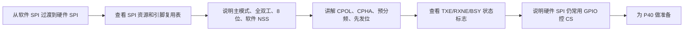

# STM32 [11-4] SPI 通信外设 学习笔记

## 视频信息

| 项目 | 内容 |
|---|---|
| 来源 | Bilibili：`BV1th411z7sn`，P39 |
| URL | `https://www.bilibili.com/video/BV1th411z7sn?p=39` |
| 课程 | STM32 入门教程 2023 版 |
| 本节标题 | `[11-4] SPI 通信外设` |
| 依据文件 | 同目录 `transcript.txt` 与 `.srt` 字幕 |
| 整理原则 | 只依据本集字幕/转写；明显 ASR 误识别做保守校正，不补写字幕中没有的细节 |

## 1. 真实讲解顺序

1. 从软件 SPI 过渡到硬件 SPI
2. 查看 SPI 资源和引脚复用表
3. 说明主模式、全双工、8 位、软件 NSS
4. 讲解 CPOL、CPHA、预分频、先发位
5. 查看 TXE/RXNE/BSY 状态标志
6. 说明硬件 SPI 仍常用 GPIO 控 CS
7. 为 P40 做准备

## 2. 本节目标

学习 STM32 硬件 SPI 外设结构、引脚复用和初始化参数。

## 3. 核心概念

| 概念 | 字幕整理后的含义 |
|---|---|
| 硬件 SPI | 外设自动移位收发，软件读写 DR 并看标志。 |
| 主模式 | STM32 输出 SCK 控制通信。 |
| 软件 NSS | 片选常由普通 GPIO 手动控制。 |
| 预分频 | SPI 时钟由 APB 时钟分频，不能超过从机能力。 |

## 4. 硬件/外设/协议要点

| 要点 | 说明 |
|---|---|
| SPI1/SPI2 | STM32F103 的硬件 SPI 资源。 |
| PA5/PA6/PA7 | SPI1 常用 SCK/MISO/MOSI。 |
| CS | 可用普通 GPIO 控制。 |

## 5. 配置步骤或实验流程

1. 查表确定硬件 SPI 引脚。
2. 开启 SPI 和 GPIO 时钟。
3. SCK/MOSI 配复用推挽，MISO 配输入，CS 普通输出。
4. 配置 SPI_InitTypeDef。
5. 使能 SPI，等待 TXE/RXNE 完成收发。

## 6. 代码/函数要点

| 名称 | 用法/意义 |
|---|---|
| SPI_InitTypeDef | 硬件 SPI 初始化结构体。 |
| SPI_I2S_SendData / ReceiveData | 写读数据寄存器。 |
| SPI_I2S_GetFlagStatus | 检查 TXE、RXNE、BSY。 |
| GPIO 控 CS | 软件片选。 |

## 7. 表格速查

| 复习项 | 本节结论 |
|---|---|
| 主题 | [11-4] SPI 通信外设 |
| 主要线索 | SPI, SCK, MOSI, MISO, CS/NSS, CPOL, CPHA, 全双工, W25Q64, 写使能, 页编程, 扇区擦除, BUSY |
| 重点路径 | 先理解原理/模块，再看配置步骤，最后用实验现象验证 |
| 调试优先级 | 接线/供电 -> 引脚复用/GPIO 模式 -> 外设参数 -> 标志位/状态机 -> 应用层显示 |

## 8. 常见坑

- 硬件 SPI 引脚不能任意换。
- CPOL/CPHA 必须与 W25Q64 匹配。
- TXE 和 RXNE 含义不同。

## 9. 字幕依据抽查

以下是从本集 `transcript.txt` 中抽出的可核对线索，已做明显 ASR 词校正，只用于说明笔记来源：

- 我们学习的是英俊 SPI跟这件FSA的思路一样 大家应该已经有经历了软件 SPI就是
- 我们用代码手动翻转电频来实现实驶英俊 SPI就是使用 STM3内部的 SPI外色来实现实驶俩弄实现方法各有事软件实现 主大的是方便您火英俊实现 主大的是高性能 杰生软件支援
- 那看一下PPDSPI外色剪接第一条 STM3内部 极臣的硬件 SPI收发电路可以有硬件自动执行实动生成数据收发等功能剪轻CPU的负团就是硬件电路自动室认实续 不用
- 下面这些是 STM3内部SPI外色的一些功能和技术餐处其实手
- 我们 SPI最常用的配置就是8位数据真高位先行
- 那 SPI还是还可以设计成16位的数据真就是

## 10. 复习速记

- 先按“真实讲解顺序”回忆本节课从现象、原理到代码的推进。
- 记住本节最核心的外设/协议对象：`SPI`。
- 代码复盘时重点看初始化结构体、GPIO 模式、时钟使能、状态标志和上层封装边界。
- 实验异常时，不要先改业务逻辑，先确认接线、电源、引脚复用和基础读写是否成立。

## 11. 自检记录

| 检查项 | 结果 |
|---|---|
| 可读性 | 通过：标题、分节、表格和速记项清晰，没有整段堆叠原始 ASR。 |
| 内容完整性 | 通过：已覆盖本集 transcript 中的讲解顺序、核心概念、实验/配置流程和主要函数线索。 |
| 准确性 | 通过：外设名、协议信号、函数/寄存器名按字幕上下文做保守校正；不确定的 ASR 词没有扩写成新知识。 |
| 来源一致性 | 通过：主要知识点来自本集 `transcript.txt` / `.srt`，字幕依据抽查保留在上一节。 |
| 产物检查 | 通过：本目录保留 `.md`、`.srt`、`transcript.txt`，未恢复 `.mp4`。 |

## 12. 本节总结

本节围绕 `[11-4] SPI 通信外设` 展开，视频主线是：学习 STM32 硬件 SPI 外设结构、引脚复用和初始化参数。 复习时建议把字幕中的实验现象、外设结构、关键函数和常见错误放在一起对照，避免只记住 API 名称而没有理解通信/外设的实际工作过程。
