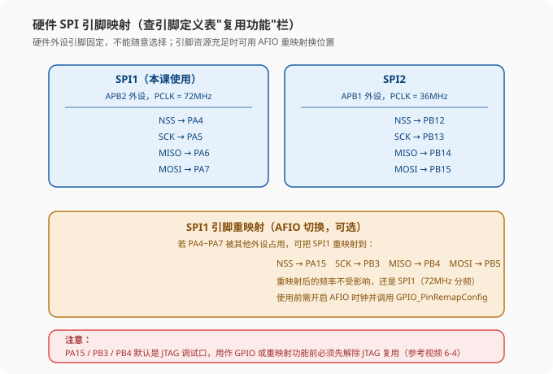
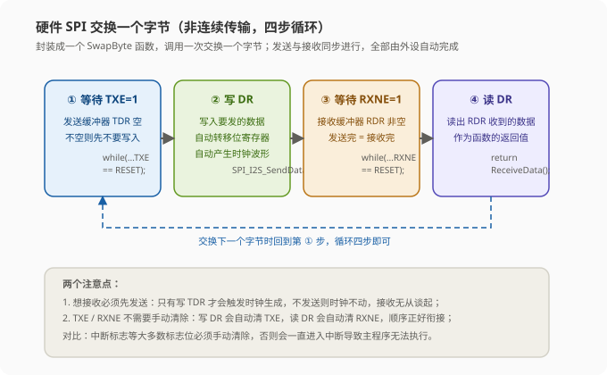
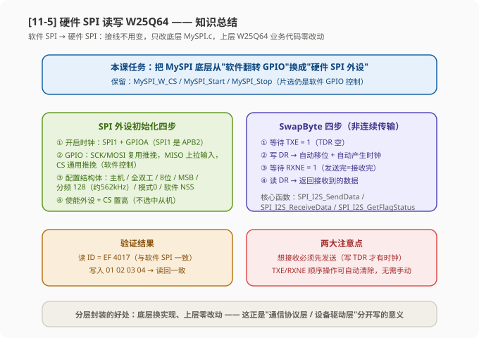

# STM32 [11-5] 硬件 SPI 读写 W25Q64 — 学习笔记

> **视频来源**: [B站 江协科技 STM32入门教程-2023版 p40 [11-5]](https://www.bilibili.com/video/BV1th411z7sn?p=40)
> **芯片型号**: STM32F103C8T6 + W25Q64
> **前置知识**: SPI 通信协议（p36）、W25Q64 简介（p37）、软件 SPI 读写 W25Q64（p38）、SPI 通信外设（p39）
> **本节定位**: 用 STM32 内部的硬件 SPI 外设替换软件 SPI，实现读写 W25Q64 Flash（接线不变、上层代码零改动）

---

## 一、课程概览：从软件 SPI 到硬件 SPI

上一节我们学习了 STM32 内部的硬件 SPI 外设——数据寄存器 DR（TDR/RDR）与移位寄存器打配合、主机发送/接收的时序流程。当时老师就预告：本小节要正式写代码，把 p38 的软件 SPI 程序改成硬件 SPI 外设的实现。

回顾一下我们走过的路：

- **p36** 学习了 SPI 通信协议本身（四根线、四种模式、全双工交换字节）；
- **p37** 学习了 W25Q64 芯片的内部结构（Flash 页/扇区/块、状态寄存器、指令表）；
- **p38** 用 GPIO 手动翻转电平，软件模拟 SPI 时序驱动 W25Q64；
- **p39** 学习了 STM32 硬件 SPI 外设的原理、框图、寄存器和收发流程；
- **本小节 p40** 是收官实战——把 p38 的软件实现换成硬件外设实现，跑通同样的功能。

为什么学了软件 SPI 还要学硬件 SPI？因为**实际工程中 SPI 基本都是用硬件外设实现的**。SPI 硬件外设普及度高、使用简单（只需要配置寄存器、写数据寄存器、读状态寄存器，时序由硬件自动产生），所以不像 I2C 那样软件模拟大行其道。我们"先软件后硬件"的目的，正是为了让软件实现教我们理解协议本质，让硬件实现教我们使用芯片外设——两条路都走通，知识才完整。

> **提示**: 本课的实现思路和 p35 的硬件 I2C 如出一辙——**"非连续传输"方案**：等待 TXE → 写 DR → 等待 RXNE → 读 DR，四步封装成一个函数，一次交换一个字节。p39 已经讲过这个流程，本课就是把它的代码真正写出来。

---

## 二、硬件接线：引脚固定，接线不变

### 2.1 先看接线图，发现"线路不用变"

打开工程自带的接线图（11-2 硬件 SPI 读写 W25Q64 的图片），可以看到**硬件 SPI 的接线图和之前软件 SPI 的接线图几乎一模一样**。

这是因为：p38 老师特意把软件 SPI 的四个引脚接到了 PA4/PA5/PA6/PA7——**这恰好就是硬件 SPI1 的默认引脚**。所以本课从软件 SPI 切换为硬件 SPI，线路一根都不用动，直接沿用之前的接线即可。

但这里有一个重要区别必须搞清楚：

| 对比项 | 软件 SPI | 硬件 SPI |
|:---|:---|:---|
| 引脚选择 | 任意 GPIO 都可以，随便选 | 引脚**固定**，必须查引脚定义表 |
| 灵活性 | 极高（软件想怎么接怎么接） | 低（硬件电路内部已经连死了） |
| 换引脚的代价 | 改几行代码 | 要查表、可能还要用重映射 |

> **关键**: 硬件 SPI 的引脚为什么不能随便选？因为硬件外设内部电路在芯片设计时就与特定引脚连接好了，引脚功能是"焊死"的。而软件 SPI 是程序里手动翻转电平，想让哪个引脚翻转都可以。这就是"硬件没有软件那么灵活"的体现——**凡涉及硬件 SPI，引脚基本都得参考引脚定义表，不能随意选择**。

### 2.2 引脚定义表：硬件 SPI 的引脚分配

在引脚定义表的"复用功能"这一栏，可以找到 SPI 相关的引脚。首先看到 **SPI1** 的相关引脚：

| SPI1 信号 | 复用引脚 |
|:---|:---|
| NSS（片选） | PA4 |
| SCK（时钟） | PA5 |
| MISO（主机输入/从机输出） | PA6 |
| MOSI（主机输出/从机输入） | PA7 |

所以如果你要使用 SPI1 这个外设，就得把相应的通信线接在 **PA4、PA5、PA6、PA7** 这四个引脚上。其中 **NSS（PA4）我们一般可以继续使用软件模拟的方式来实现**（片选就是拉高拉低一个电平，用 GPIO 控制更灵活），所以 NSS 没必要必须接在 PA4——但**另外三个引脚（SCK、MISO、MOSI）就必须得是 PA5、PA6、PA7**，没有商量的余地。

> **注意**: 有的资料把片选叫 NSS（硬件外设里的叫法），有的叫 CS（通用叫法）。硬件 SPI 的 NSS 引脚主要是为多主机模型设计的（p39 讲过的"小辫子"玩法），而我们实际用的是一主一从，**片选直接用一个普通 GPIO（PA4）软件模拟即可**，不需要用硬件 NSS 的功能。

### 2.3 SPI2 的引脚分配

继续看引脚定义表，下面这一块是 **SPI2** 的相关引脚：

| SPI2 信号 | 复用引脚 |
|:---|:---|
| NSS（片选） | PB12 |
| SCK（时钟） | PB13 |
| MISO | PB14 |
| MOSI | PB15 |

所以如果你要使用 SPI2 这个外设，通信线就必须接在 PB12~PB15。注意 SPI2 挂在 **APB1 总线上（PCLK = 36MHz）**，而 SPI1 挂在 **APB2 总线上（PCLK = 72MHz）**——同样分频系数下 SPI1 的时钟频率比 SPI2 大一倍。本课我们计划使用 **SPI1**。

### 2.4 SPI1 的引脚重映射（可选功能）

从引脚定义表还可以看到，SPI1 的引脚**可以重映射**到另一组引脚上。如果 SPI1 原来的 PA4~PA7 这一组被别的外设占用了，可以考虑把 SPI1 重映射到：

| SPI1 信号 | 重映射引脚 |
|:---|:---|
| NSS | PA15 |
| SCK | PB3 |
| MISO | PB4 |
| MOSI | PB5 |

重映射之后，SPI1 还是 SPI1（频率不受影响），只是引脚挪了个位置。这个功能可以在**引脚资源充足、其他外设占用默认引脚**的情况下，转移外设复用的引脚位置。

> **注意**: PA15、PB3、PB4 这几个引脚比较特殊——它们**默认是作为 JTAG 调试端口使用的**（引脚定义表里没有标出 SPI 复用，正是因为默认被 JTAG 占用了）。如果要用它们原本的 GPIO 功能，或者使用重映射的外设引脚功能，**都需要先解除 JTAG 调试端口的复用**，否则 GPIO 或外设引脚都不会正常工作。解除 JTAG 复用的方法在视频 6-4 里讲过（AFIO 时钟 + GPIO_PinRemapConfig 配置），不会的同学可以回去再看看。

### 2.5 本课的接线

既然我们计划使用 SPI1，那么接线就是：

| STM32 引脚 | 连接 | W25Q64 模块 | 说明 |
|:---:|:---:|:---|:---|
| `PA4` | → | `CS` | 片选（软件 GPIO 控制，低电平选中） |
| `PA5` | → | `CLK`（SCK） | SPI1 时钟（外设控制输出） |
| `PA6` | ← | `DO`（MISO） | SPI1 主机输入（外设输入） |
| `PA7` | → | `DI`（MOSI） | SPI1 主机输出（外设控制输出） |
| `3.3V` | → | `VCC` | 供电 |
| `GND` | — | `GND` | 地线 |



这几个引脚一定要**一一对应**，SCK 接 CLK、MISO 接 DO、MOSI 接 DI，互相不要搞混。然后给模块接上电源和地线，硬件线路部分就完成了。由于接线和之前软件 SPI 一模一样，老师已经接好了，本课就不重新演示接线过程了。

> **关键**: 硬件 SPI 的 SCK/MOSI/MISO 是**外设控制的**，必须接在外设对应的固定引脚上；而 CS 是**软件控制的**，接任意 GPIO 都行（本课继续用 PA4）。接线时"SCK↔CLK、MOSI↔DI、MISO↔DO"别接反，接反了读回的数据就会错乱。

---

## 三、工程准备：复制软件 SPI 工程，改底层

### 3.1 新建工程

回到工程文件夹，组织一下工程：**复制 p38 的软件 SPI 工程**，把工程名改成 `11-2 硬件SPI读写W25Q64`。我们还是在软件 SPI 的基础上更改，打开工程先编译一下确认无误。

### 3.2 本课的任务：只改底层 MySPI.c

本课的任务非常明确：**修改底层这个 `MySPI.c` 文件，把初始化代码和交换字节的执行步骤，从"软件实现"改成"硬件外设实现"**。

而**基于通信协议层的这些业务代码（W25Q64 驱动层的全部函数、主函数）不需要进行任何更改**——因为这些部分只是调用底层的通信函数，至于"SPI 通信具体是怎么实现的"这个地方是不用管的。

> **原理**: 这就是**代码隔离封装的好处**——通信协议层（MySPI）和业务层（W25Q64 驱动）是分层的，底层只暴露"初始化、起始、终止、交换字节"这几个接口，上层根本不知道也不关心底层是软件模拟还是硬件外设实现的。所以把底层的实现从软件 SPI 换成硬件 SPI，**不会影响到上层任何一行代码**。

### 3.3 非连续传输方案

由于本课硬件 SPI 的实现**计划使用"非连续传输"的方案**——每次交换一个字节，都完整走"等待 TXE → 写 DR → 等待 RXNE → 读 DR"的四步流程。这个方案**非常简单、也容易封装**，所以老师**保留 MySPI 这个模块，直接在原文件里修改代码**。

> **提示**: p38 软件 SPI 的代码我们是把 SPI 模块独立出来放在一起的（模块并没有被移除，是独立成一个文件）。到底哪些代码放哪个模块，取决于你对工程的规划、以及个人的编码习惯。这里保留 MySPI 模块直接修改是非常方便的，因为上层 W25Q64 的函数调用接口（MySPI_Init、MySPI_Start、MySPI_SwapByte、MySPI_Stop）完全不变。

### 3.4 具体修改清单

打开 `MySPI.c`，对照 p38 的代码，逐项处理：

1. **保留**：`MySPI_W_CS`（片选引脚操作）——CS 还是软件 GPIO 控制，这个函数继续留着；
2. **删除**：下面三个软件的"独置"SPI 通信引脚的函数——`MySPI_W_SCK`、`MySPI_W_MOSI`、`MySPI_R_MISO`。这三个函数是软件模拟 SPI 才需要的（手动翻转 SCK、写 MOSI、读 MISO），用硬件外设后就用不到了；
3. **替换**：`MySPI_Init` 里的内容——把软件 GPIO 初始化删掉，替换为 **SPI 外设的初始化**（删到这里就行了，上面这些代码等会儿还要用到，先留着）；
4. **保留**：`MySPI_Start`（产生起始信号 = CS 拉低）、`MySPI_Stop`（产生停止信号 = CS 拉高）——片选时序不变，继续用；
5. **替换**：`MySPI_SwapByte` 里面的内容——把软件逐位翻转的循环删掉，换成**硬件 SPI 外设交换一个字节的流程**。

这样软件 SPI 操作时序的部分就删掉了，接着写硬件 SPI 的代码。硬件 SPI 的代码实际上就是两部分：

- **第一部分**：在 `MySPI_Init` 里写上 **SPI 外设的初始化代码**；
- **第二部分**：在 `MySPI_SwapByte` 里写上 **SPI 外设操作时序、完成交换一个字节的流程**。

---

## 四、MySPI_Init：硬件 SPI 外设初始化（四步）

### 4.1 初始化流程总览

回顾 p39 学过的 SPI 基本结构，SPI 外设初始化的流程分为四步：

1. **开启时钟**：开启 SPI 和 GPIO 的时钟；
2. **初始化 GPIO 口**：配置各引脚的复用/模式；
3. **配置 SPI 外设**：使用一个结构体选参数（8 位还是 16 位数据、高位先行还是低位先行、SPI 模式、主机还是从机等），调用 `SPI_Init` 配置；
4. **开关控制**：调用 `SPI_Cmd` 给 SPI 使能。

初始化好外设之后，再参考 p39 的时序流程来执行运行控制，这样就能产生交换字节的时序了。运行控制的核心就是**写 DR、读 DR 和获取状态标志位**。

> **原理**: 初始化解决"外设长什么样"的问题（配置好寄存器），运行控制解决"怎么产生时序"的问题（写 DR 触发时钟、读 DR 取回数据、查标志位了解状态）。配置 + 运行，就是使用硬件外设的全部套路。

### 4.2 第一步：开启时钟

```c
/* 第一步：开启 SPI1 和 GPIOA 的时钟 */
RCC_APB2PeriphClockCmd(RCC_APB2Periph_SPI1, ENABLE);   // 开启 SPI1 外设时钟
RCC_APB2PeriphClockCmd(RCC_APB2Periph_GPIOA, ENABLE);  // 开启 GPIOA 时钟
```

目前使用的 GPIO 都是 A 端口（PA4~PA7），所以开启 GPIOA 的时钟。之后我们计划使用 **SPI1** 这个外设——**SPI1 也是 APB2 的外设**，所以可以复制上面这行，把对应的外设名换成 `RCC_APB2Periph_SPI1` 即可。

> **注意**: 这里要区分 SPI1 和 SPI2 的时钟总线。SPI1 是 APB2 外设（72MHz），SPI2 是 APB1 外设（36MHz）。开启时钟时挂在哪条总线上就开哪条总线的时钟；计算 SCK 频率时也要用对应的 PCLK。千万不要搞混。

### 4.3 第二步：初始化 GPIO

接下来配置相应的 GPIO 口。四个引脚四种情况，逐个分析：

- **NSS / CS（PA4）**：我们是**从机选择引脚**，计划还是使用软件模拟（GPIO 控制高低电平），所以 **PA4 配置为通用推挽输出**——和软件 SPI 时完全一样；
- **SCK（PA5）和 MOSI（PA7）**：这两个是**外设控制的输出**，所以**配置为复用推挽输出**（`GPIO_Mode_AF_PP`）。看一下引脚定义表，SCK 和 MOSI 分别是 PA5 和 PA7，所以代码里选择 `GPIO_Pin_5` 和 `GPIO_Pin_7`，这两个引脚的模式都选"复用推挽输出"；
- **MISO（PA6）**：要配置为 **SPI 输入模式**。看一下引脚定义表，SPI 输入是 PA6 引脚，所以选择 `GPIO_Pin_6`，模式选择**上拉输入**（`GPIO_Mode_IPU`）。

```c
/* 第二步：初始化 GPIO */
GPIO_InitTypeDef GPIO_InitStructure;

/* NSS（PA4）：软件控制的片选，通用推挽输出 */
GPIO_InitStructure.GPIO_Mode = GPIO_Mode_Out_PP;        // 通用推挽输出
GPIO_InitStructure.GPIO_Pin = GPIO_Pin_4;
GPIO_InitStructure.GPIO_Speed = GPIO_Speed_50MHz;
GPIO_Init(GPIOA, &GPIO_InitStructure);

/* SCK（PA5）+ MOSI（PA7）：外设控制的输出，复用推挽输出 */
GPIO_InitStructure.GPIO_Mode = GPIO_Mode_AF_PP;         // 复用推挽输出（引脚交给 SPI 外设控制）
GPIO_InitStructure.GPIO_Pin = GPIO_Pin_5 | GPIO_Pin_7;
GPIO_InitStructure.GPIO_Speed = GPIO_Speed_50MHz;
GPIO_Init(GPIOA, &GPIO_InitStructure);

/* MISO（PA6）：外设输入，上拉输入 */
GPIO_InitStructure.GPIO_Mode = GPIO_Mode_IPU;           // 上拉输入
GPIO_InitStructure.GPIO_Pin = GPIO_Pin_6;
GPIO_Init(GPIOA, &GPIO_InitStructure);
```

> **关键**: 三个输出引脚中，SCK 和 MOSI 是"复用推挽输出"（GPIO 让位给 SPI 外设，由外设内部控制这个引脚输出波形），而 CS 是"通用推挽输出"（纯软件 GPIO 控制片选电平）。这两种"推挽输出"模式不要搞混！MISO 则是输入模式（上拉输入），不要也配成推挽输出，否则会把从机的输出"顶死"读不到数据。

到这里 GPIO 的模式就配置好了。这一组模式（通用推挽 / 复用推挽 / 上拉输入）组合比较多，是初始化的第二步，大家不要搞混。

### 4.4 第三步：配置 SPI 外设

第三步是初始化 SPI 外设本身。函数名称写对的话很快就能记住，直接写：初始化肯定是 `SPI_Init`。参数第一个指定 `SPI1`，第二个是初始化结构体指针。

我们在上面定义一个结构体变量，结构体类型名是 `SPI_InitTypeDef`，变量名给个 `SPI_InitStructure`，然后把结构体成员都列出来，最后把结构体的地址传递给出初始化函数，让它根据结构体里的参数来自动配置相应的寄存器。这就是 SPI 外设初始化的步骤。

> **提示**: 这个结构体变量的顺序老师调整了一下——但**成员顺序是可以随意的**，只要功能上把参数配好就行，这里只是根据功能调整一下位置方便观看。

下面把每个结构体成员逐个看一下：

**① `SPI_Mode`：主机还是从机**

这个参数决定当前 SPI 是主机还是从机。把参数列表调出来看就清楚了：`SPI_Mode_Master` 指定当前 SPI 作为主机，`SPI_Mode_Slave` 指定当前 SPI 作为从机。我们肯定是选择主机，也就是 `SPI_Mode_Master`。

**② `SPI_Direction`：通信方向**

这个参数用来配置 SPI 引脚的功能。可选的参数有 4 个：

| 参数 | 含义 |
|:---|:---|
| `SPI_Direction_1Line_Rx` | 单线半双工接收模式 |
| `SPI_Direction_1Line_Tx` | 单线半双工发送模式 |
| `SPI_Direction_2Lines_FullDuplex` | 双线全双工（最常用） |
| `SPI_Direction_2Lines_RxOnly` | 双线只接收模式 |

我们使用最多的就是标准模式——**双线全双工**，所以选 `SPI_Direction_2Lines_FullDuplex` 即可。

**③ `SPI_DataSize` 和 `SPI_FirstBit`：数据帧格式**

`SPI_DataSize` 配置 8 位还是 16 位数据帧，`SPI_FirstBit` 配置高位先行还是低位先行。最常用的就是 **8 位数据帧 + 高位先行**，配置非常简单：`SPI_DataSize` 选择 `SPI_DataSize_8b`（8 位数据帧），`SPI_FirstBit` 选择 `SPI_FirstBit_MSB`（高位先行）。

**④ `SPI_BaudRatePrescaler`：波特率预分频器**

这个参数用来配置 SPI 时钟（SCK）的频率。参数有 8 种分频系数：**2、4、8、16、32、64、128、256**。p39 讲过：**SCK 频率 = PCLK ÷ 分频系数**，分频系数越大，SCK 时钟频率越小、传输速度越慢。可以根据实际需求选择。

我们这里就选择一个慢一点的分频系数，比如 **128**。目前 SCK 的时钟频率就是 72MHz ÷ 128，大家可以算一下，大概是 **560kHz 左右**（约 500 多 kHz）。

> **注意**: 本课用的是 SPI1 外设，所以是 72MHz（APB2）÷ 128。如果你用的是 SPI2 外设，同样的分频系数就得用 **36MHz（APB1）÷ 128** 来计算了——因为 SPI1 是 APB2 外设、SPI2 是 APB1 外设，基频不同，注意区分。

**⑤ `SPI_CPOL` 和 `SPI_CPHA`：选择 SPI 模式**

这两个参数比较熟悉了，用来配置 SPI 的模式。

- `SPI_CPOL`（时钟极性）参数有两个：`SPI_CPOL_High` 默认高电平（对应 CPOL=1）、`SPI_CPOL_Low` 默认低电平（对应 CPOL=0）。我们计划选择 SPI 模式 0（空闲默认是低电平），所以选 `SPI_CPOL_Low`；
- `SPI_CPHA`（时钟相位）参数也是两个：`SPI_CPHA_1Edge` 就是第一个边沿开始采样（对应 CPHA=0）、`SPI_CPHA_2Edge` 就是第二个边沿开始采样（对应 CPHA=1）。

> **原理**: 可以发现 STM32 的手册都仔细说的是"第几个边沿**采样**"，而不说"第几个边沿**输出数据**"。为了便于理解，我们可以说"第一个边沿移出、第二个边沿移入"——这里说的"移入"就相当于手册说的"采样"，是一个意思，大家注意理解。

我们选择 SPI 模式 0，CPOL=0、CPHA=0，所以选 `SPI_CPHA_1Edge` 这个参数。这就是 SPI 模式 0 的选择——**但这里选择模式 0 和模式 3 都可以**（W25Q64 支持模式 0 和模式 3），我们目前选择的是模式 0。

**⑥ `SPI_NSS`：NSS 引脚管理**

看下参数：有硬件 NSS 模式（`SPI_NSS_Hard`）和软件 NSS 模式（`SPI_NSS_Soft`）。我们计划使用 GPIO 模拟片选，这个外设的硬件 NSS 引脚我们并不会用，所以这个参数一般选择**软件 NSS**（`SPI_NSS_Soft`）就行了，不用过多关心。

**⑦ `SPI_CRCPolynomial`：CRC 校验多项式**

这个参数需要我们填一个数，填多少都可以，反正我们不用 CRC 功能。就填它给的一个默认值 **7** 就行了，也不用过多了解。

**⑧ 调用 `SPI_Init` 写入配置**

```c
/* 第三步：配置 SPI 外设 */
SPI_InitTypeDef SPI_InitStructure;

SPI_InitStructure.SPI_Mode = SPI_Mode_Master;                        // 主机模式
SPI_InitStructure.SPI_Direction = SPI_Direction_2Lines_FullDuplex;   // 双线全双工
SPI_InitStructure.SPI_DataSize = SPI_DataSize_8b;                    // 8 位数据帧
SPI_InitStructure.SPI_FirstBit = SPI_FirstBit_MSB;                   // 高位先行
SPI_InitStructure.SPI_BaudRatePrescaler = SPI_BaudRatePrescaler_128; // 分频 128 → SCK ≈ 562.5kHz
SPI_InitStructure.SPI_CPOL = SPI_CPOL_Low;                           // 时钟极性：空闲低电平（模式0）
SPI_InitStructure.SPI_CPHA = SPI_CPHA_1Edge;                         // 时钟相位：第一边沿采样（模式0）
SPI_InitStructure.SPI_NSS = SPI_NSS_Soft;                            // 软件 NSS（片选用 GPIO 模拟）
SPI_InitStructure.SPI_CRCPolynomial = 7;                             // CRC 多项式（不使用，填默认值）
SPI_Init(SPI1, &SPI_InitStructure);                                  // 根据结构体配置 SPI1 寄存器
```

到这里结构体的参数就选好了。可以看到**大部分参数都是一些常用的配置，基本上是不用改的**，需要改的可能也就这三个：`SPI_BaudRatePrescaler`（使用频率）和 `SPI_CPOL` / `SPI_CPHA`（SPI 模式）。所以这个初始化应该也不难理解吧。

### 4.5 第四步：使能 SPI + CS 默认高电平

初始化结束之后，就是第四步——**使能 SPI 外设**。调用 `SPI_Cmd`，参数还是 `SPI1`，给它 `ENABLE`，这样 SPI 外设就准备就绪了。

```c
/* 第四步：使能 SPI 外设 */
SPI_Cmd(SPI1, ENABLE);   // 使能 SPI1，外设开始工作

/* 使能后：CS 输出高电平，默认不选中从机 */
MySPI_W_CS(1);           // 片选置高，从机不被选中
```

当然开启 SPI 之后还要做一个事：**调用一下 `MySPI_W_CS(1)`，给 CS 输出高电平**，保证初始化后默认不选中从机。这样整个 `MySPI_Init` 初始化函数就写好了，内容就这么多。

> **提示**: 初始化函数最后让 CS=1（不选中从机）是一个好习惯——避免上电后 CS 处于不确定状态导致从机被误选中。这与软件 SPI 时"初始化后 CS 默认高"的做法完全一致。

### 4.6 MySPI_Init 完整代码

```c
/**
 * @brief  硬件 SPI 外设初始化
 * @note   CS=PA4（软件 GPIO 控制），SCK=PA5，MISO=PA6，MOSI=PA7（SPI1 外设）
 *         SPI 模式 0，8 位数据帧，高位先行，分频 128（SCK ≈ 562.5kHz）
 */
void MySPI_Init(void)
{
    GPIO_InitTypeDef GPIO_InitStructure;
    SPI_InitTypeDef SPI_InitStructure;

    /* 第一步：开启时钟（SPI1 是 APB2 外设） */
    RCC_APB2PeriphClockCmd(RCC_APB2Periph_SPI1, ENABLE);   // SPI1 时钟
    RCC_APB2PeriphClockCmd(RCC_APB2Periph_GPIOA, ENABLE);  // GPIOA 时钟

    /* 第二步：初始化 GPIO */
    /* NSS（PA4）：软件控制的片选，通用推挽输出 */
    GPIO_InitStructure.GPIO_Mode = GPIO_Mode_Out_PP;
    GPIO_InitStructure.GPIO_Pin = GPIO_Pin_4;
    GPIO_InitStructure.GPIO_Speed = GPIO_Speed_50MHz;
    GPIO_Init(GPIOA, &GPIO_InitStructure);

    /* SCK（PA5）+ MOSI（PA7）：外设控制的输出，复用推挽输出 */
    GPIO_InitStructure.GPIO_Mode = GPIO_Mode_AF_PP;
    GPIO_InitStructure.GPIO_Pin = GPIO_Pin_5 | GPIO_Pin_7;
    GPIO_InitStructure.GPIO_Speed = GPIO_Speed_50MHz;
    GPIO_Init(GPIOA, &GPIO_InitStructure);

    /* MISO（PA6）：外设输入，上拉输入 */
    GPIO_InitStructure.GPIO_Mode = GPIO_Mode_IPU;
    GPIO_InitStructure.GPIO_Pin = GPIO_Pin_6;
    GPIO_Init(GPIOA, &GPIO_InitStructure);

    /* 第三步：配置 SPI 外设 */
    SPI_InitStructure.SPI_Mode = SPI_Mode_Master;                        // 主机模式
    SPI_InitStructure.SPI_Direction = SPI_Direction_2Lines_FullDuplex;   // 双线全双工
    SPI_InitStructure.SPI_DataSize = SPI_DataSize_8b;                    // 8 位数据帧
    SPI_InitStructure.SPI_FirstBit = SPI_FirstBit_MSB;                   // 高位先行
    SPI_InitStructure.SPI_BaudRatePrescaler = SPI_BaudRatePrescaler_128; // SCK ≈ 562.5kHz
    SPI_InitStructure.SPI_CPOL = SPI_CPOL_Low;                           // 模式0：空闲低电平
    SPI_InitStructure.SPI_CPHA = SPI_CPHA_1Edge;                         // 模式0：第一边沿采样
    SPI_InitStructure.SPI_NSS = SPI_NSS_Soft;                            // 软件 NSS
    SPI_InitStructure.SPI_CRCPolynomial = 7;                             // CRC 不用
    SPI_Init(SPI1, &SPI_InitStructure);

    /* 第四步：使能 SPI + CS 默认不选中 */
    SPI_Cmd(SPI1, ENABLE);
    MySPI_W_CS(1);
}
```

---

## 五、MySPI_SwapByte：硬件 SPI 交换一个字节（核心）

### 5.1 整体流程：硬件自动产生时序

初始化完成、SPI 外设就绪之后，就可以完成交换一个字节的函数了。**当我们调用交换字节函数时，硬件的 SPI 外设就要自动控制 SCK、MOSI、MISO 这几个引脚来产生时序了。**

那么怎么产生呢？回顾 p39 学过的（非连续传输）四步流程：

1. **第一步：等待 TXE = 1**（发送寄存器空）——如果发送寄存器不为空，就说明 TDR 里还有数据没处理完，我们先不要写入；
2. **第二步：写发送数据到 DR**（TDR）——数据写入后自动转入移位寄存器，自动产生 SCK 时钟，数据通过 MOSI 一位一位移出去；
3. **第三步：等待 RXNE = 1**（接收寄存器非空）——发送的同时 MISO 也移位接收，发送完 = 接收完，接收完成会置 RXNE；
4. **第四步：读取 DR**（RDR）——把交换接收到的数据读出来。

### 5.2 代码实现

```c
/**
 * @brief  交换一个字节（硬件 SPI，非连续传输）
 * @param  ByteSend 要发送的数据
 * @retval 接收到的数据
 * @note   四步流程：等 TXE → 写 DR → 等 RXNE → 读 DR
 */
uint8_t MySPI_SwapByte(uint8_t ByteSend)
{
    /* 第一步：等待 TXE = 1（发送缓冲器空，可以写入数据） */
    while (SPI_I2S_GetFlagStatus(SPI1, SPI_I2S_FLAG_TXE) == RESET);   // 不空就一直等

    /* 第二步：写入发送数据到 SPI_DR（写入即送入 TDR，自动开始发送） */
    SPI_I2S_SendData(SPI1, ByteSend);

    /* 第三步：等待 RXNE = 1（接收缓冲器非空，收到一个字节） */
    while (SPI_I2S_GetFlagStatus(SPI1, SPI_I2S_FLAG_RXNE) == RESET);  // 没收到就一直等

    /* 第四步：读取 SPI_DR，返回接收到的数据 */
    return SPI_I2S_ReceiveData(SPI1);
}
```

### 5.3 第一步：等待 TXE 标志位

代码第一步就是调用 `SPI_I2S_GetFlagStatus` 这个函数来获取状态标志位。看一下函数原型：第一个参数是 `SPI1`，第二个参数这里显然要检测 `SPI_I2S_FLAG_TXE`（发送缓冲器空标志）。

那样实现等待 TXE=1 的效果，就套一个 while 循环：**如果读取 TXE 标志位它不等于 SET（也就是 RESET，还没空），就进入循环等待**。这样就能实现"等待 TXE 置 1"的功能。

```c
while (SPI_I2S_GetFlagStatus(SPI1, SPI_I2S_FLAG_TXE) == RESET);   // TXE 不为 1 就等待
```

> **提示**: 这里你可以写"等于 SET 就退出"（`while (...== RESET)`），也可以后面什么都不写只写个分号，或者前面加个非号——这些写法都行，都能实现功能，看个人习惯。

关于这个 while 循环会不会卡死的问题：**只要 SPI 正常工作，TXE 标志位基本上是不会一直处于卡死状态的**——因为只要 TDR 里有数据，它会自动转到移位寄存器里开始发送，很快就发完了，不涉及外部电路的影响。所以这个 while 循环一直卡死的概率不大，这就是等待的机制。当然你要是不放心，加上超时等待也是完全没问题的。

### 5.4 第二步：写数据到 DR

等待 TXE=1 之后，第二步就执行"软件写入数据"：调用 `SPI_I2S_SendData`，参数第一个是 `SPI1`，第二个是要写入 DR（也就是 TDR）的数据。

TDR 是要发送的数据，所以显然要把 `ByteSend` 这个参数传进去。传入 `ByteSend` 之后，数据写入 TDR，然后自动转入移位寄存器——**一旦移位寄存器有数据，时钟就会自动产生**。

> **关键**: 这个"开始传输"**不需要我们调用任何函数去启动**。我们只管把数据写到 TDR，之后自动转移到移位寄存器，数据就会通过 MOSI 一位一位地移出去，MOSI 线上就会自动产生发送的时序。时钟是硬件自动产生的。

由于我们使用的是**非连续传输**，时序产生的这段时间我们就不必提前把下一个数据放到 TDR，这段时间就直接"时序过去"就行（等下一个字节再写）。

### 5.5 第三步：等待 RXNE 标志位

大概等到什么时候这个字节的时序才算完成？注意：**在发送的同时，MISO 还会移位接收**——发送和接收是同步的。到这里接收移位完成，是不是也就代表发送移位完成？接收移位完成时会收到一个字节数据，这时会**自动置 RXNE=1**。

所以第三步只需等待 RXNE 出现就行。回到代码，负责这一场的等待还是 `SPI_I2S_GetFlagStatus`，等待的标志位是 `SPI_I2S_FLAG_RXNE`——等 RXNE 为 1 了，表示收到一个字节，同时也表示发送时序产生完成。

```c
while (SPI_I2S_GetFlagStatus(SPI1, SPI_I2S_FLAG_RXNE) == RESET);   // 没收到数据就一直等
```

### 5.6 第四步：读 DR 取回数据

既然 RXNE=1 了，第四步就是读取 DR：调用 `SPI_I2S_ReceiveData`，参数是 `SPI1`。这个函数有个返回值，返回值就是 RDR 接收的数据。我们直接 `return`，把这个交换接收的数据通过返回值返回出去。

```c
return SPI_I2S_ReceiveData(SPI1);   // 读 DR，返回接收到的数据
```

这样通过硬件 SPI 交换一个字节的程序就写完了，总共四步：

```
① 等待 TXE = 1   →  ② 写发送数据到 DR（写入后时序自动生成）
③ 等待 RXNE = 1  →  ④ 读 DR 取回接收的数据
```

> **关键**: 这四步简单就完成了 SPI 一个字节的交换。在这里我们**并不需要像软件 SPI 那样手动给 SCK、MOSI 指定电平**，也不用关心怎么把数据一个个取出来——这个工作硬件电路会自动帮我们完成。硬件 SPI 就是"配置好外设，写 DR 触发、读 DR 取回"，省心省力。



### 5.7 注意点一：想接收必须先发送

> **注意**: 硬件 SPI 必须"发送同时接收"，**想接收必须得先发送**。因为只有你给 TDR 写数据才会触发时钟的生成；如果你不发送、只想着接收，那时序是不会动的（没有时钟，从机也没法把数据送上来）。所以交换字节函数总是"先写再读"，顺序不能颠倒。

### 5.8 注意点二：TXE / RXNE 不需要手动清除

还有一个注意点：**TXE 和 RXNE 是不是会自动清除的问题**。

看 p39 的 PPT 图上写的：TXE 标志"有硬件设置、并有软件清除"，RXNE 写的是"有硬件设置、有软件清除"。这看起来就比较迷惑——是不是要求我们在标志位置 1 之后，还需要手动调用清除函数去清除？

**实际上这个并不需要我们手动清除。** 参考手册"状态标志"这一节：

- 发送缓冲器空标志 **TXE**：此标志为 1 时表明发送缓冲器为空，可以写下一个待发送的数据进入缓冲器中；**当写入 SPI_DR 时，TXE 标志被清除**。所以在我们这里，等待 TXE 标志置 1 之后不需要手动清除——因为**下一步代码正好是写入 DR，会顺便执行清除 TXE 的操作**；
- 接收缓冲器非空标志 **RXNE**：**读取 SPI 数据寄存器可以清除此标志**。在程序里等待 RXNE=1 之后，下一步操作正好是读 DR，所以 RXNE 标志位也不需要手动清除。

> **原理**: 这个"顺序操作顺便清除"的功能，其实之前的串口（USART）和 I2C 外设都是类似的——**写 DR 顺便清 TXE、读 DR 顺便清 RXNE**，程序中不需要我们额外手动清除标志位。但要注意的是，**大多数标志位其实都还是需要我们手动清除的**，比如中断标志位：进中断之后必须得清除，否则中断会一直触发，导致主程序不能执行。只有**少部分标志位在"执行顺序操作"的时候可以顺便清除**，这可以方便我们操作。至于哪些标志位可以顺便清除，这个还是得仔细看一下数据手册。

---

## 六、上层代码零改动 + 验证

### 6.1 W25Q64 驱动层和主函数不用改

由于我们保留了我的 `MySPI_Init`、`MySPI_Start`、`MySPI_SwapByte`、`MySPI_Stop` 这几个接口，**W25Q64 驱动层的全部函数（ReadID、WriteEnable、WaitBusy、PageProgram、SectorErase、ReadData）和主函数都不用改**。

唯一的区别是：`MySPI_Init` 现在初始化的是硬件 SPI 外设，而 `MySPI_SwapByte` 用的是硬件收发——上层调用的接口签名完全一样，这就是分层封装带来的好处。

### 6.2 下载验证

程序写完后下载验证，看看这个代码能不能和软件 SPI 一样正常执行读写 W25Q64 的功能：

- **读 ID**：OLED 上读出的 JEDEC ID 一样是 **EF 4017**（EF 是华邦厂商代码，40 表示 SPI 存储器类型，17 表示 64Mbit 容量），说明硬件 SPI 通信完全正常；
- **写入读回**：下面写入 `01 02 03 04`，读出的数据**也是 `01 02 03 04`**，读写一致。

> **关键**: 验证结果说明硬件 SPI 的实现是完全没问题的，功能与软件 SPI 完全一致——因为通信双方都是按照 SPI 协议在通信，底层用软件还是硬件产生波形，对 W25Q64 来说没有区别，它只认协议时序。

到此，硬件 SPI 读写 W25Q64 的程序就修改完成了。这节的修改还是比较轻松的——**接线不用动、上层代码不用动，只改了 MySPI.c 一个文件里的初始化和交换字节两个函数**。

---

## 七、常见问题与避坑

| 现象 | 原因 | 解决方法 |
|:---|:---|:---|
| JEDEC ID 读不出来（不是 EF 4017） | 硬件 SPI 通信没通 | 检查接线（SCK↔CLK、MISO↔DO、MOSI↔DI 是否一一对应）、供电是否正常、引脚是否接在外设固定的 PA5/PA6/PA7 上 |
| ID 能读但读写结果错乱 | 引脚复用模式配错 | SCK/MOSI 必须是复用推挽输出（`GPIO_Mode_AF_PP`），MISO 必须是上拉输入（`GPIO_Mode_IPU`），不能配成通用推挽 |
| 时钟频率不对或通信超时 | SPI1 / SPI2 分频基频搞混 | SPI1 用 72MHz、SPI2 用 36MHz 计算 SCK；本课分频 128 → SCK ≈ 562.5kHz |
| 程序卡在 `while` 标志位循环 | SPI 外设没使能，或没先写数据就等 RXNE | 确认 `SPI_Cmd(SPI1, ENABLE)` 已调用；交换字节必须"先写后读"，不发送时钟不动 |
| 想用 PA15/PB3/PB4 做重映射但不工作 | 默认是 JTAG 调试口 | 先解除 JTAG 复用（AFIO 时钟 + `GPIO_PinRemapConfig`，参考视频 6-4） |
| 片选无效、从机一直不响应 | CS 初始化电平不对 | 初始化后 `MySPI_W_CS(1)` 保证默认不选中；通信时 `MySPI_Start`（CS=0）选中 |
| 读回数据全是 FF 或 0x00 | 芯片忙/没写使能/没擦除 | 这是 W25Q64 业务层的坑（p38 已讲）：写前先擦除、写使能自动封装、等待 BUSY 清零 |

---

## 八、知识总结



**本节课的核心脉络**：

1. **接线不变**：p38 软件 SPI 特意接在 PA4/PA5/PA6/PA7，恰好就是硬件 SPI1 的默认引脚，所以硬件 SPI 接线一根都不用动；但硬件 SPI 引脚是**固定**的（SCK=PA5、MISO=PA6、MOSI=PA7，NSS=PA4 可软件模拟），不能像软件 SPI 那样随便选。
2. **引脚知识**：SPI1（APB2，72MHz）：PA4/5/6/7；SPI2（APB1，36MHz）：PB12/13/14/15；SPI1 可重映射到 PA15/PB3/PB4/PB5（需先解除 JTAG 复用）。
3. **分层封装的好处**：只改底层 `MySPI.c`（初始化 + 交换字节），W25Q64 驱动层和主函数**零改动**——因为上层只调用 `MySPI_Init/Start/SwapByte/Stop` 接口，不关心底层实现。
4. **SPI 外设初始化四步**：① 开时钟（SPI1 + GPIOA，都是 APB2）→ ② 配 GPIO（SCK/MOSI 复用推挽、MISO 上拉输入、CS 通用推挽）→ ③ 配结构体（主机/全双工/8 位/MSB/分频 128/模式 0/软件 NSS）→ ④ `SPI_Cmd` 使能 + CS 置高。
5. **交换字节四步**（非连续传输）：① 等 TXE=1 → ② 写 DR（自动移位、自动产生时钟）→ ③ 等 RXNE=1（发送完=接收完）→ ④ 读 DR 返回。
6. **两大注意点**：想接收必须先发送（写 TDR 才触发时钟）；TXE/RXNE 由"写 DR / 读 DR"顺序操作自动清除，无需手动清——但大多数标志位（如中断标志）仍必须手动清除，要看手册确认。
7. **验证结果**：读 ID = EF 4017，写入 `01 02 03 04` 读回一致——硬件 SPI 完全没问题，功能与软件 SPI 等价。

**记忆口诀**：

```
硬件 SPI 引脚定死：SPI1 走 PA5/6/7，NSS 用 GPIO 模拟片选
初始化四步：开时钟 → 配 GPIO（复用推挽/上拉输入）→ 配结构体 → 使能
交换字节四步：等 TXE → 写 DR → 等 RXNE → 读 DR（先写后读，收发同步）
发送才有时钟，时钟动了数据才会走
写 DR 清 TXE、读 DR 清 RXNE，顺序操作自动清，不用手动
上层代码零改动，全靠分层封装好
```

**本系列课程至此，SPI 的内容全部结束**：从 p36 协议原理 → p37 芯片结构 → p38 软件实现 → p39 外设原理 → p40 硬件实现，SPI 通信的"协议 + 软件 + 硬件"三方面知识已经完整打通。下一节我们将开启新的内容——Unix 时间戳（p41）。

---

*笔记生成时间: 2026-08-06 | 基于 B站视频 BV1th411z7sn p=40 转录*
