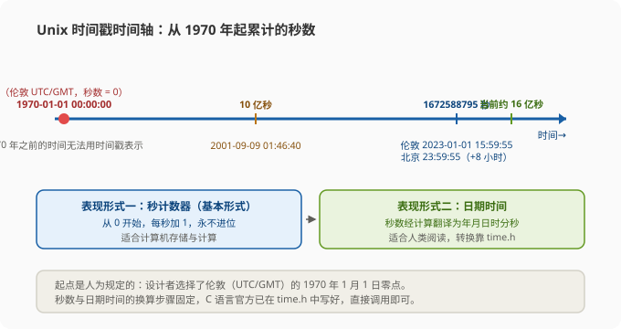
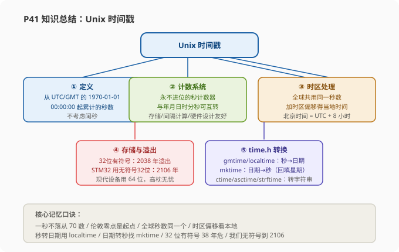

# STM32 [12-1] Unix 时间戳 — 学习笔记

> **视频来源**: [B站 江协科技 STM32入门教程-2023版 p41 [12-1]](https://www.bilibili.com/video/BV1th411z7sn?p=41)
> **芯片型号**: STM32F103C8T6
> **前置知识**: C 语言基础（结构体、指针、printf）、定时器概念（p1-p9）
> **本节定位**: 学习 Unix 时间戳的概念与 time.h 库的日期时间转换方法，为后续 RTC（实时时钟）程序做准备。本小节是纯理论 + 演示课，不写 STM32 代码，代码演示在 VS Code 环境中运行

---

## 一、课程概览：第 12 章 RTC 的开篇

欢迎继续观看 STM32 入门教程。现在我们的课程已经来到**第 12 章**，这一章我们要讲的主要内容是 **RTC 实时时钟**，对应手册的位置是第 16 章。

**RTC 本质上是一个定时器**，但和之前学的通用定时器不一样——这个定时器是**专门用来产生年月日时分秒这种日期和时间信息**的。所以学会了 STM32 的 RTC，就可以在 STM32 内部拥有一个独立运行的钟表，想要记录或读取日期和时间，就可以通过操作 RTC 来实现。

RTC 这个外设比较特殊，它和**备份寄存器 BKP**、**电源控制 PWR** 这两章关联性比较强，在 RTC 这一章里，BKP 和 PWR 也会经常出来串门。所以这一大节老师把 BKP 和 RTC 放在一起讲，这样整体思路会比较清晰；PWR 电源控制放到下一节再讲。

这一大节计划分成三个小节：

1. **第一小节（本节）**：单独讲一下时间戳这个东西——这也是个蛮有意思的知识点。想要使用我们这款 STM32 的 RTC，学习时间戳的知识是非常必要的；
2. **第二小节**：学习 BKP 和 RTC 外设的结构；
3. **第三小节**：写代码，看两个例程的程序现象。

> **原理**: 为什么学 RTC 要先学时间戳？因为 RTC 内部就是一个秒计数器，它记录的并不是"年月日时分秒"这种人类可读的格式，而是从固定起点累计的秒数。秒数如何翻译成年月日时分秒，如何根据时区换算，正是本节要解决的问题。这些问题不搞清楚，后面写 RTC 显示程序就会一头雾水。

---

## 二、程序现象预览：两个例程

先看一下我们最终的程序现象。本节一共有两个示例代码：

- **12-1 读写备份寄存器**（BKP）
- **12-2 RTC 实时时钟**（OLED 显示年月日时分秒）

### 2.1 例程 12-1：读写备份寄存器（BKP）

下载程序之前，我们要在开发板上做一个操作：**从 VBAT 引脚引出一个 3.3V 电源**。VBAT 是备用电池供电引脚，一般情况下需要接备用电池，但是我们目前的开发板没有电池，所以就直接引出一个 3.3V 电源线，也是一样的效果——这个 3.3V 现在就模拟一个电池的电源。

> **提示**: VBAT 引脚就是专门用来接备用电池的。实验中使用杜邦线把开发板的 3.3V 输出接到 VBAT 引脚上，就等效于给 RTC 和 BKP 接上了备用电池。具体接线位置以开发板丝印为准。

看一下显示屏。这个程序的目的是**在 BKP 备份寄存器写入两个数据，然后再把它们读出来显示**。屏幕上 W 是写的内容（还没写入数据，显示 0），R 是读的内容（默认读出来也都是 0）。按下按键，这时就在两个备份寄存器里分别写入了 0x12345678（12 34 56 78），之后读出来也是 0x12345678，写入和读出一样，没问题。继续按按键会改变数据再写入进去，下面读出来和写入一样，都没问题。

**BKP 和 EEPROM 的对比**：其实 BKP 备份寄存器和之前学的 EEPROM（W25Q64）类似，都是用来存数据的。只是 EEPROM 的数据是真正的掉电不丢失，而 **BKP 的数据是需要 VBAT 引脚接上备用电池来维持的**。只要 VBAT 有电池供电，即使 STM32 主电源断电，BKP 的值也可以维持原样。

老师现场演示了三个实验：

1. **主电源断电实验**：拔掉 STM32 板子最下面这个主电源的接线柱，现在 STM32 断电，但是 VBAT 有电，可以维持 BKP 的数据。再次上电后，在没有写数据的情况下直接读出 BKP，它的数据和断电之前是一样的——这说明 BKP 的数据在主电源断电后得到了保持。
2. **系统复位实验**：按一下复位按键，BKP 的数据也不会被复位。
3. **备用电池断电实验**：把 VBAT 的电池（3.3V 电源线）断电，再次拔掉主电源、重新上电，BKP 的数据就清空了。

> **注意**: BKP 本质上并不能完全掉电不丢失，它的数据需要 VBAT 引脚提供备用电源来维持。这就是 BKP 备份寄存器的特性——如果你的 STM32 接了备用电池，那 BKP 可以完成一些主电源掉电时保存少量数据的任务。

其实，BKP 应用寄存器和 VBAT 引脚的存在，更多的是为了服务 RTC 的。所以我们接着看第二个例程。

### 2.2 例程 12-2：RTC 实时时钟

把第二个例程的现象拆开看，OLED 上显示四行：

1. **第一行是日期**：目前给的是一个测试时间，2023 年 1 月 2 日；
2. **第二行是时间**：目前是 00 时 00 分 00 秒（零时零分零秒）；
3. **第三行是时间戳秒计数器**：目前是 16 亿多——这个数字是什么意思，等会就来学习；
4. **第四行是 RTC 预分频器的计数值**：这个先看一下就行，挺有用的，等我们写代码的时候再研究。

当然，实时时钟光有显示不够，为了保证时间不出错，它还有其他特性：

- **复位后继续计时**：既然在计时，总不能每次复位都重新设置时间吧？按下复位按键，可以看到时间会继续运行，不会复位；
- **主电源断电后继续运行**：实时时钟在系统主电源断电后还要继续运行。就像我们手机关机后，里面的时钟还必须要继续走，否则再开机时间就错了。所以只要在 VBAT 接上了备用电源，我们再断开系统主电源、然后插上，可以看到时间数据不会流失，并且在主电源断开的那段时间里，RTC 会继续走时，不会因为主电源断电而暂停。

> **关键**: RTC 在复位后和主电源掉电后数据不丢失、继续计时，其实就是借用了 BKP 的备份域电源来实现的。所以 RTC 和 BKP 关联程度是比较高的——这就是 RTC 实时时钟程序现象的核心。

### 2.3 老师测试程序时遇到的硬件坑

在讲程序之前，老师还提醒了两个测试程序时遇到的硬件问题：

1. **有的开发板，主电源断电后 VBAT 的电源还会微弱地给整个系统供电**，导致主电源拔掉后，电源指示灯和 OLED 屏幕还会微弱地亮着。这是一个问题，但这个问题其实也不影响最终的实验现象。
2. **有的开发板在进行 RTC 实验时，会出现 RTC 晶振不起振的情况**，这会导致程序卡死在等待晶振起振的地方。这个问题老师还没找到完美的解决方法，但是在学习过程中也是可以有一些替代方法的。

> **注意**: 这两个坑先给大家提个醒。第二个问题（晶振不起振卡死）的替代方法，等后续写代码的时候再说——到时候如果遇到程序卡住的情况，知道有这条路可以绕过去就行。

好，程序现象就看到这里，接下来回到 PPT，来看时间戳这个知识点。

---

## 三、Unix 时间戳：概念篇

在这一小节里，老师会介绍：时间戳是什么东西、为什么要使用时间戳来计时、UTC 和 GMT 是什么，然后重点讲时间戳与日期时间数据如何互相转换。转换涉及 C 语言中的 time.h 官方库，老师会在 VS Code 这个软件里引入这些函数来演示它们的用法。

所以本小节的任务有两个：

1. **了解时间戳到底是什么**；
2. **会使用 C 语言 time.h 库里的函数进行时间戳各种形式数据的转换**。

本小节的内容其实是**计算机领域的一个通用知识点**，不特别用在 STM32 上，所以学完本小节，你走在其他地方说不定也能用得到。

### 3.1 什么是 Unix 时间戳

Unix 时间戳最早是在 Unix 系统里使用的，所以叫 Unix 时间戳。之后很多由 Unix 演变而来的系统（比如 Linux）都继承了 Unix 时间戳的规定。目前 Unix 系、安卓系统等，它们底层的计时系统都是使用的 Unix 时间戳，所以在我们现在经常接触的世界底层，Unix 时间戳还在扮演着重要的角色。

第一条 PPT：Unix 时间戳（Unix Time Stamp）的定义是——**从 UTC 或 GMT 的 1970 年 1 月 1 日 00 时 00 分 00 秒开始所经过的秒数，不考虑闰秒**。

这里大家可能有两个疑问：

- **第一，GMT 是什么东西？**
- **第二，闰年、闰秒这些词我们听到比较多，但这个闰秒是个什么东西？**

这两个知识点老师会在下一张 PPT 里讲解。现在先简单理解这句话：**时间戳是一个计数器数值，这个数值表示从 1970 年 1 月 1 日 00:00:00 开始到现在，总共所经过的秒数**。

### 3.2 时间戳计数系统 vs 年月日时分秒计数系统

时间戳这个计数系统，和我们常说的年月日时分秒这个计数系统有很大差别：

- **年月日时分秒计数系统**：每 60 秒进位一次计为 1 分钟，每 60 分钟进位一次计为 1 小时，之后继续进位就是日月年了；
- **时间戳计数系统**就简单粗暴了：它定义 1970 年 1 月 1 日零点整为 0 秒，之后就只用最基本的秒来计数，**不进位**——60 秒就是 60 秒，100 秒就是 100 秒，1000 秒、10000 秒、1 亿秒，无论这个数量多大，永远都只用秒来计数。

所以从 1970 年记到现在，这个时间戳的秒数已经非常大了，目前这个秒数已经来到 **16 亿多**（约 1.67×10⁹）。这个数量级对于人类来说，16 亿秒肯定是很难理解、很难想象；但是对于计算机来说，一个永不停歇、不进位的秒数，无论是存储还是计算都是非常方便的。所以时间戳在计算机程序的底层应用非常广泛。

**时间戳的秒计数器和日期时间可以互相转化**：在计算机底层我们使用秒计数器来计时；需要给人类观看时，就把它转化为年月日时分秒这样的格式就行了。

### 3.3 用大秒数表示时间的好处与坏处

使用这样一个很大的秒数来表示时间，有很多好处：

1. **简化硬件电路**：在设计 RTC 硬件电路的时候，直接弄一个很大的秒计数器就行了，不需要再考虑什么年月日的计数器进位、大小月、平年闰年这些东西，对硬件电路设计来说非常友好；
2. **时间间隔计算非常方便**：比如"1 月 1 号 8 点到 3 月 1 号 18 点，时间间隔多少小时"这个问题，如果用年月日时分秒来计算，需要考虑的东西就比较多（跨月、跨年、大小月、闰年等）；但如果用秒计数器来算，只需要把两个时刻的秒数相减，再除以一个小时的秒数（3600），就可以很快计算出两个时刻的间隔了；
3. **存储方便**：存储秒数只需要存一个比较大的变量就行了；存储年月日时分秒的话，就得存很多个变量了。

当然，使用秒计数器来比较时间也有坏处——**比较占软件资源**。每次进行秒计数器和日期时间的转换时，软件都要经过一通比较复杂的计算（考虑闰年、大小月等），这会占用一些软件的运行时间和资源。这就是使用时间戳的一些好处和坏处。

### 3.4 时间戳的存储格式与溢出问题（2038 问题）

时间戳存储在一个秒计数系统里，计数器是 **32 位或 64 位的整型变量**。既然要存储这样一个容易增长的秒数，这个数据变量类型还是要定义大一些，对吧？这个变量类型在不同系统里是不一样的：

- 在**早期的 Unix 系统**中，这个秒数大多是用 **32 位有符号整型变量**来存储的。32 位有符号数所能表示的最大数字是 2³¹ − 1（2 的 32 次方除 2 再减 1），大家可以自己按计算器算一下，这个数是 **21 亿多（2147483647）**；
- 这其实有溢出风险，因为目前到 2023 年了，时间戳已经计到 16 亿多，再过几年，32 位有符号数就存不下这么大的数字了。根据计算，**32 位有符号数的时间戳会在 2038 年 1 月 19 号溢出**。到时候，采用 32 位有符号数存储时间戳的设备，系统就会因为数据溢出而出错，这会导致很多不知情的计算机程序崩溃——这就是著名的 **2038 问题**（2038 年危机）。大家感兴趣的话可以往 2038 方向搜一搜；
- 当然，随着操作系统和设备的更新换代，目前的手机、电脑等设备基本上都已经采用 **64 位**的数据来存储时间戳了。64 位时间戳能存储的时间范围非常非常大，总之对于人类来说完全可以高枕无忧。

**最后回到我们这款 STM32F103 的 RTC**：可以看一下手册，它核心计数部分是一个 **32 位的可编程计数器**，这说明我们这款 STM32 的时间戳是 32 位的数据类型。那是不是我们这款 STM32 也会在 2038 年出现问题呢？实际上并不会——因为根据老师的研究，这个时间戳在 STM32 程序中定义的其实是**无符号 32 位（uint32_t）**。无符号 32 位最大数值是 2³² − 1，计算一下要到 **2106 年**才会溢出。虽然不是高枕无忧（有生之年都覆盖不了千年），但有生之年八成是不用担心的。

> **注意**: 记住这个区别——早期 Unix 用 32 位**有符号**（最大值 2³¹−1，2038 年溢出），STM32 的 RTC 秒计数器用 32 位**无符号**（最大值 2³²−1，2106 年溢出）。有符号/无符号一字之差，寿命差了一个世纪。

### 3.5 时区处理：全球共用同一个秒数

世界上所有时区的秒数计数是相同的，不同时区通过添加偏移来得到当地时间。

我们知道，地球上不同经度的地方，它的时间是不一样的。穿过英国伦敦的经线，我们把它叫做**本初子午线**，这个位置的时间是一个时间标准。我们时间戳所说的"1970 年 1 月 1 日 00:00:00"也是指**伦敦时间**的零点。其他地方可以分为 24 个时区，每偏一个时区，时间就要加或减一个小时。

我们处理不同时区的方式是：**所有时区共用同一个时间戳秒数**（在伦敦计数器是 0，在北京也是 0），根据不同时区再添加小时的偏移即可。比如计数器的 0 对应伦敦时间的零点，中国使用北京时间，属于**东八区**的位置，对应北京时间就是早上 8 点——这就是时间戳对不同时区的处理方式。

### 3.6 时间轴图示：时间戳的两种表现形式



下图总结一下上面的内容：

- 这个箭头代表的是一条**时间轴**。在这条时间轴上要定义一个**起点**，时间戳从这个起点开始计时。这个起点是人为规定的，当时的设计者选择了伦敦时间（UTC/GMT）的 **1970 年 1 月 1 日零点**。对于 1970 年之前的时间，时间戳是无法表示的；
- 时间戳有两种表现形式：
  - **基本形式**：用不进位的秒计数器，从 0 开始一秒一秒往后加个数；
  - **翻译形式**：秒计数器经过计算"翻译"出来的日期和时间。比如 0 秒对应伦敦时间 1970 年 1 月 1 日零点；计数器一直累加，比如记到 **10 亿秒**的时候，就对应伦敦时间 2001 年 9 月 9 日 1 时 46 分 40 秒。

我们知道 10 亿秒对应这个日期时间，这背后要经过一些比较复杂的计算：先算 1 年有多少秒，得到现在是第几年；再算 1 天有多少秒，得到现在是这一年的第几天；然后再计算现在是几月几号；最后再计算是几时几分几秒。这里面还需要考虑大月小月、平年闰年这些特殊情况。所以可以想到，这个计算是非常麻烦的。

> **提示**: 但是好在，这个计算步骤是固定的，而且 C 语言官方已经帮我们把程序写好了——这就是我们等会要学的 **time.h** 模块。这里面只有现成的"秒级转换日期时间、日期时间转换秒级"这些函数。所以这里我们只要会调用 time.h 的函数，就可以知道秒数和日期时间的对应关系了。至于计算步骤，我们不用过多去了解，感兴趣的话可以自己研究研究。

举一个例子：把 **1672588795** 这个秒数调用函数换算一下，对应的伦敦时间就是 **2023 年 1 月 1 日 15 时 59 分 55 秒**。最后，在伦敦时间的基础上得到北京时间就非常简单了——每个秒数对应的伦敦时间，再加上 8 个小时，就是对应的北京时间（2023 年 1 月 1 日 23 时 59 分 55 秒）。这就是 Unix 时间戳转换的整个实际思路。

最后给大家推荐一个网站工具：在百度直接搜索"**Unix 时间戳转换**"，就可以看到很多这种时间戳在线转换工具。打开这个网站，里面有做好的转换工具：

- 比如它显示的是**我现在这个时刻对应的秒数**（很多秒），点转换，它就能告诉你对应的北京时间是多少；
- 下面也可以**输入一个日期时间**，点转换，它就能告诉你对应的秒数是多少。

> **提示**: 这个工具好像只能转换北京时间，因为输入的是北京时间，它对应的时间戳（换算成伦敦时间）就是 8 点，这个我们应该也清楚是怎么回事。大家写代码的时候，可以参考这个工具来验证自己的换算结果。

好，时间戳的基本资料就了解这么多，接下来看第二张 PPT，两个科普内容。

---

## 四、GMT 与 UTC：两个科普概念

这一部分主要就是两个科普内容：了解 GMT、UTC 是什么东西，以及为什么会有闰秒这个现象。

### 4.1 GMT：格林尼治标准时间

首先看一下 GMT，它的英文全称是 **Greenwich Mean Time**，翻译成中文就是**格林尼治标准时间**（也有的地方叫格林威治标准时间、格林威治平均时间，都是一个意思）。格林尼治是一个地名，位于英国伦敦，所以如果对格林尼治这个名字不熟悉，可以简单把它理解为**伦敦标准时间**。

格林尼治这个地方有个天文台，可以通过观察天上的太阳和星星来确定地球的自转和公转。所以**格林尼治标准时间就是一种以地球自转为基础的计时系统**：它将地球自转一周的时间间隔等分为 24 小时，以此来确定计时标准。

可以看出来，这种计时方法非常符合我们的直觉——一天的定义就是地球自转一周，然后一天等分 24 小时、再等分 60 分钟、再等分 60 秒，这样就能确定时间基准了（这里只是简单的理解，具体过程可能会更复杂一些）。在以前，格林尼治标准时间是全球计时的时间标准，大家都遵循 GMT 的标准，不同时区再加上对应的小时偏移，这样全球各地的时间就能确定下来了。

**那为什么说 GMT 是"以前"的时间标准呢？** 因为 GMT 有一个致命的问题——**地球自转一周的时间其实是不固定的**。由于潮汐、地震等地球活动的原因，地球目前是越转越慢的。那么你根据一天的时间来定义时间基准，这个时间基准就是在不断变化的：一天等分 24 小时对应固定的秒数，地球越转越慢，那你定义"1 秒"的时间是不是也就越来越长？

一个不固定的时间基准对科学研究影响非常大。比如我们说测量数据要精确到微妙、纳秒，前提是"1 秒"到底是多少必须是一个恒定不变的值。所以为了让时间的定义更标准，科学家又提出了新的计时系统，叫做 **UTC**。

### 4.2 UTC：协调世界时

UTC 的全称是 **Coordinated Universal Time**，中文名叫**协调世界时**。协调世界时是一种**以原子钟为基础**的计时系统：它规定铯 133 原子（一种原子）这样所持续的时间为 1 秒。原子钟是当前最精确的计时装置，**上千万年才误差 1 秒**，所以使用原子钟提供的时间具有"定义明确、恒定不变"这些特性。也就是说，使用原子钟计时，"1 秒"到底是多少，我们就可以定死了。而且我们确定的这个秒长，定义它的时长时是和 1970 年的 GMT 保持一致的。

### 4.3 闰秒机制：为什么要闰秒

现在问题又来了：我们以一个恒定不变的秒来计时，但是地球自转越转越慢，这样接下去，**计时的一天和地球自转的一天就会出现偏差**。时间长了，可能中午 12 点太阳就不是在最高位置了；或者时间再长一些，计时的白天黑夜就会和现实的白昼黑夜颠倒——这是我们不能忍受的。虽然说地球自转变慢的过程非常缓慢，偏差大到白昼黑夜颠倒那得等很久很久，但是科学家对计时的极致追求，不能容忍哪怕 1 秒的偏差。

所以，在原子钟计时系统的基础上，我们得加入**闰秒**的机制来消除"计时一天"和"地球自转一周"的误差。

闰秒的操作流程就是：**当原子钟计时的一天与地球自转一周的时间相差超过 0.9 秒时，UTC 就会执行闰秒，来保证其计时与地球自转的协调一致**。所以闰秒使计时标准变得很不方便——当地球越转越慢、误差超过 0.9 秒时，我们的计时系统就多走 1 秒来"等一下"地球的自转。

> **注意**: 上一次闰秒的时刻是北京时间 **2017 年 1 月 1 日 7 时 59 分 59 秒**，在下一秒时，时钟会突然出现 **7 时 59 分 60 秒**，也就是说这一分钟总共是 61 秒。

这个"时间标准 + 闰秒机制"的设计，就能保证 UTC 既满足科学研究的需要，又满足人类生活的需要，这就是协调世界时的设计思路。UTC 作为现行的时间标准，它比 GMT 更加严谨。但是，**闰秒机制的设计可能也会造成一些程序 bug**——所以大家要有这个准备：**一分钟可能会出现 61 秒的情况**。

> **原理**: 一句话总结 GMT 和 UTC 的区别：GMT 以"地球自转"为准（秒的长短会漂移），UTC 以"原子钟"为准（秒恒定，用闰秒去凑地球自转）。在平时的生活中，大家大多不会追求极致的严谨，所以 GMT 和 UTC 可以看作是一样的——像我们手机、电脑的时间设置里，可能就说我们当前的北京时间是 GMT+8 或者 UTC+8，这都是可以的，这也说明我们使用的是东八区的时间。

### 4.4 回到时间戳定义："不考虑闰秒"的含义

了解了 UTC 和 GMT，再看时间戳定义里的"UTC 或 GMT 的 1970 年 1 月 1 日 00:00:00"——实际上就是**格林尼治的当地时间，也就是伦敦时间**。后面的"不考虑闰秒"，说明目前这个时间戳对闰秒没有实际响应：每次产生闰秒时，时间戳的时间和国家级授时中心的标准时间就会差出 1 秒的偏差。这个了解一下即可。

好，时间戳的计数知识这就清楚了，接下来就是时间部分——学习时间戳中秒计数器和日期时间如何进行相互转换。

---

## 五、time.h：秒数与日期时间的转换函数库

要进行秒计数器和日期时间的相互转换，需要用到 **time.h** 模块。在 C 语言的 time.h 模块里，提供了时间获取和时间戳转换的相关函数，我们可以方便地进行秒计数器、日期时间、字符串之间的转换，使用起来非常方便——直接调函数、填参数就行了。

在 time.h 里主要有这么多函数，但并不是所有都会用到，还有两个不太重要的函数老师没列出来。

**如何学习这些函数呢？** 网上有很多教程，比如菜鸟教程里就有这个模块的讲解和例子，下面这些函数我们都可以点进去学习。大家自学的时候都可以去网上搜索相关资源，其实老师自己也是从这些地方学到的。

回到 PPT，重要的函数给演示一下。这些函数中，有三个对我们最重要：

- **gmtime()**：把秒数转换为 GMT（格林尼治）日期时间的函数；
- **localtime()**：把秒数转换为当地日期时间的函数。这个 localtime 就是在 gmtime 的基础上加了时区的偏移，所以这两个函数非常相似；
- **mktime()**：把日期时间转换为秒数的函数，这个只有当地的时间才行。

有了这三个函数，我们就可以进行时间戳的转换了。看下图，清晰地显示了每个函数的职责，就是各种数据类型之间的转换。


### 5.1 三种数据类型：time_t、struct tm、char*

为了明白这些函数的任务，首先搞清楚三种数据类型都是什么意思。

**第一种：秒计数器数据类型，类型名叫 `time_t`**。我们可以结合程序来看：打开 VS Code 这个软件，这是一个最简单的工程，大家使用任何一种编译器都可以。程序现象是打印输出。在这个工程里我们玩玩 time_t 的相关函数。

为了使用 time.h 模块，首先就是 `#include <time.h>` 引入头文件。之后我们可以定义一个全局变量，数据类型名是刚才说的秒计数器类型 `time_t`，变量名可以自己起一个，这里就叫做 `timeStamp`，整体表示它是一个秒计数器。

`time_t` 其实是一个 `typedef` 定义的类型。我们在它的定义里可以看到：如果不是特别声明要用 32 位的秒计数器，那么一般情况下 `time_t` 就是 `time64_t`；而上面这个 `time64_t` 实际上就是 `int64_t`。所以这里 `time_t` 实际上就是 `int64_t`，是一个 **64 位有符号整型数据**。可以看到，这里的程序使用了 64 位的秒计数器，不用担心溢出问题。`time_t` 数据类型就是用来存储时间戳中那个一直增长的秒数的。

**第二种：日期时间数据类型，类型名叫 `struct tm`**。程序中可以定义 `struct tm` 的变量，这两个词组合在一起代表一个结构体类型名，后面跟结构体变量名，我们可以指定一个变量表示日期时间。`struct tm` 结构体也可以在 time.h 里找到定义，它是一个封装好的结构体类型，结构体的成员有这么多：

| 结构体成员 | 含义 | 取值范围 | 备注 |
|:---|:---|:---|:---|
| `tm_sec` | 秒 | 0 ~ 59 | |
| `tm_min` | 分钟 | 0 ~ 59 | |
| `tm_hour` | 从零点开始的小时 | 0 ~ 23 | |
| `tm_mday` | 一个月的几号 | 1 ~ 31 | |
| `tm_mon` | 从 1 月开始的第几个月 | 0 ~ 11 | **值加 1 才是我们认的月份** |
| `tm_year` | 从 1900 年起的第几年 | ≥ 70 | **值加 1900 才是我们认的年份** |
| `tm_wday` | 从周日开始的星期几 | 0 ~ 6 | 0 表示周日，1~6 表示周一~周六 |
| `tm_yday` | 从 1 月 1 号开始的第几天 | 0 ~ 365 | 平时用得不多 |
| `tm_isdst` | 是否使用夏令时 | 正数/0/负数 | 正数=使用，0=不使用，负数=不知道 |

逐一看一下：

- `tm_sec` 表示秒，取值 0-59；
- `tm_min` 表示分钟，取值 0-59；
- `tm_hour` 表示从零点开始的小时，取值 0-23；
- `tm_mday` 表示一个月的几号，取值 1-31；
- `tm_mon` 表示从 1 月开始的第几个月，取值 0-11。如果是 1 月，它的值是 0；一直到 12 月，值是 11。所以这个值加 1 才是我们所认的月份；
- `tm_year` 表示从 1900 年起的第几年，所以这个值加上 1900 才是我们所认的年份。**注意**：这个年份的偏移是 1900，而我们时间戳的起点是 1970，这两个年份基准不一样，注意区分。所以这个值最小就应该是 70（1970−1900）；
- `tm_wday` 表示从周末开始的星期几，0 表示周日，1 表示周一，2 表示周二，一直到 6 表示周六；
- `tm_yday` 表示从 1 月 1 号开始的第几天，取值 0-365，这个我们平时用得不多；
- 最后一个 `tm_isdst` 表示是否使用夏令时，正数表示使用夏令时，0 表示不使用夏令时，负数表示不知道夏令时。

> **提示**: 关于夏令时——欧美地区的大部分国家，以及其他地区的少部分国家都还在使用夏令时；我国早期也使用过一段时间，但现在我国已经不用夏令时了，所以我们对夏令时这个东西可能比较陌生。夏令时简单来说，就是为了鼓励大家夏天的时候早睡早起、节约电费而设计的。感兴趣的话可以自己百度一下，这里就不给大家详细介绍了。

另外，这个结构体的定义形式，和我们 STM32 库函数处理的方法有所区别：我们 STM32 中使用的是 `typedef struct { ... } 新名字;` 这样的形式定义的；而这里没有使用 typedef，而是在花括号前给结构体起了一个名字叫 `tm`，使用的时候数据类型名就是 `struct tm` 两个词，后面跟着变量名。这样的方式也是可以的，和 STM32 库函数处理的方式是一样的效果，这个大家了解一下即可。

**第三种：字符串数据类型，类型名字 `char*`**。`char*` 就是 char 数据的指针，用来指向一个表示时间的字符串，这个等会给大家演示。在程序中我们可以定义 `char*` 类型名、变量名，指向一个 char 或者指向 tm 结构体都可以。

好，三种数据类型就准备好了，接下来使用函数尝试一下数据类型的转换。

> **提示**: 可以看到这些函数中大量出现了指针的操作。如果不熟悉指针操作，可以先去回顾一下 C 语言的指针教程。大家不用完全理解这些函数的具体写法，只是日常使用的话指针其实可以不用太多——像这些官方的模块真的是方便，用指针就解决；我自己写程序的话，为了方面理解，一般用指针还是比较少的。但这不代表别人都不用指针，所以指针大家还是要好好学学的。

### 5.2 函数一：time() 获取系统时钟

**第一个函数是 `time()`，功能是获取系统时钟**。它的返回值类型是 `time_t`，表示当前系统时钟的秒计数值；参数是 `time_t*`（time_t 指针），这是一个**输出参数**，参数的内容和返回值是一样的。所以这个函数可以通过返回值获取系统时钟，也可以通过输出参数获取系统时钟。

在这个代码中，time 函数就是用来获取当天时间的函数。在电脑里可以直接读取电脑的时间，但是在单片机上是用不了的——因为 STM32 是一个离线的裸机系统，它也不知道现在现实时间是几点几分（没有联网授时的渠道）。所以在 VS Code 中我们实验一下。

```c
#include <stdio.h>
#include <time.h>          // 引入 time.h 头文件，时间戳相关函数都在里面

int main(void)
{
    time_t timeStamp;      // 秒计数器类型变量，用于存储时间戳秒数

    // time() 的两种用法：
    // 用法一：通过返回值获取当前秒数
    timeStamp = time(NULL);            // 参数不需要时传 NULL（空指针）即可
    // 用法二：通过输出参数获取当前秒数（效果一样）
    // time(&timeStamp);

    printf("%ld\n", timeStamp);        // 打印当前时间戳秒数

    return 0;
}
```

运行一下，得到当前时间戳的秒数，对不对呢？我们可以复制一下这个数字，然后在刚才说的**在线工具**里粘贴转换，可以看到转换出的时间和我们当前系统的北京时间是一样的——这说明我们获取的时间是正确的。

> **提示**: 这个获取时间的函数，我们还可以用输出参数来获取，就像注释里写的 `time(&timeStamp)`，参数给 timeStamp 的地址，达到的效果是一样的。运行一下也没有问题。

另外，我们还可以手动给一个数字来测试。比如：

```c
timeStamp = 1672588795;    // 手动指定秒数：对应伦敦 2023-01-01 15:59:55
```

这个值就是前面 PPT 里用的值，它对应的是伦敦时间的 15 时 59 分 55 秒、北京时间的 23 时 59 分 55 秒。把它放到程序里，就相当于我们手动给了一个时间，用这个时间来测试。

有了秒数之后，我们接着把它转换为日期时间的格式，所以继续看第二个函数。

### 5.3 函数二/三：gmtime() / localtime() 把秒数转换为日期时间

**`gmtime()`：将秒数的值转换为格林尼治（伦敦）时间**。参数是 `const time_t*`，即秒数值的指针，这是输入参数；返回值是 `struct tm*`，即日期时间结构体的指针，这是输出。作用就是：秒数转换为日期时间。`localtime()` 和 gmtime 的使用方法完全一样，区别只是**它会根据时区自动添加小时的偏移**，转换成当地时间。

我们在实验里实现一下：

```c
#include <stdio.h>
#include <time.h>

int main(void)
{
    time_t timeStamp = 1672588795;    // 手动指定秒数：伦敦 2023-01-01 15:59:55
    struct tm timeStruct;             // 日期时间结构体变量

    // 把秒数转换为日期时间（返回的是结构体指针）
    // 方法一：右边返回的指针加 * 解引用，等号左右就都是结构体变量
    timeStruct = *gmtime(&timeStamp);       // 伦敦（UTC/GMT）时间
    // timeStruct = *localtime(&timeStamp);  // 本地时间，会自动 +8 小时（东八区）

    // 打印日期时间：注意 tm_year 要 +1900、tm_mon 要 +1 才是真实年份月份
    printf("%d年%d月%d日 %d时%d分%d秒 星期%d\n",
           timeStruct.tm_year + 1900, timeStruct.tm_mon + 1, timeStruct.tm_mday,
           timeStruct.tm_hour, timeStruct.tm_min, timeStruct.tm_sec,
           timeStruct.tm_wday);

    return 0;
}
```

这里要说明一下返回值的处理。gmtime 的返回值是 `struct tm*`，如果我们直接把这个结构体变量放在这里（`timeStruct = gmtime(&timeStamp);`），等号右边是地址，等号左边却是一个变量，这是不行的——**地址不能直接赋给变量**。解决方法有两种：

1. **在右边，函数的返回指针加上 `*` 解引用内容**，这样等号左右就都是变量了，结构体变量之间互相赋值没问题（上面的代码就是方法一）；
2. **右边不加 `*`，左边的变量定义为指针类型**（`struct tm *tmPtr;`），这样等号左右都是指针，结构体指针之间互相赋值也没问题。

这两种方法都是可以的，老师演示时使用了第一种方法。这样我们的转换实际上就已经完成了。

接下来打印看一下。打印的变量是 `timeStruct`，这是一个结构体变量，我们使用点号 `.` 去取结构体成员，比如先看 tm_sec，然后 tm_min、tm_hour，依次看时、分、秒，最后再看星期。在这个软件（VS Code）里可以按 **Ctrl + 空格** 提示成员。

> **关键**: 如果不加年份月份修正，编译运行可以看到，转换出来的日期时间是"70 年 0 月 1 日 15 时 59 分 55 秒 星期 0"，这个 70 年 0 月很明显是不对的——因为刚才说了，`tm_year` 是从 1900 年经过的年数，`tm_mon` 是从 1 月经过的月数。所以我们要得到正确的年份，需要在 `tm_year` 上加 1900 的偏移，月份加 1 的偏移。修正后再试一下，可以看到目前这个秒数对应的伦敦时间是 **2023 年 1 月 1 日 15 时 59 分 55 秒，星期天**，这和 PPT 里给定的伦敦时间是一致的。这一天是不是星期天呢？我们可以查日历验证一下，看到这一天确实是星期天，没有问题。

这就是 gmtime（秒数转换伦敦时间）的函数了。

接着看第三个函数 **`localtime()`，转换当地时间**。这个函数和 gmtime 的使用方法是一样的，作用也和 gmtime 一样，只是 localtime 会根据时区自动添加小时的偏移。在程序中，我们要想转换为本地时间，直接把这个函数名由 gmtime 改成 localtime 就行了——函数内部会根据当前电脑的设置，自动判断我们处于哪个时区，然后把时间加上时区偏移后输出。

运行看一下，可以看到现在的时间是 **2023 年 1 月 1 日 23 时 59 分 55 秒**。localtime 判断我们在东八区，就自动把时间加了 8 个小时、显示为 23 点，这与 PPT 里给定的北京时间是一致的。这就是 gmtime 和 localtime，我们就玩明白了。

### 5.4 函数四：mktime() 把日期时间转换回秒数

接下来学习下一个函数 **`mktime()`**，它就是上面两个函数的逆过程——**将日期时间转换为秒数**。注意 mktime 传入的日期时间需要是**当地的**（当地时间）。

调用 mktime 函数，参数是日期时间结构体指针。我们可以把刚才转换过来的日期时间结构体的地址传进去，之后这个函数就会经过一通计算，给我们返回对应的秒数值，我们就存在 timeStamp 这个变量里。

```c
#include <stdio.h>
#include <time.h>

int main(void)
{
    time_t timeStamp = 1672588795;    // 原始秒数：伦敦 2023-01-01 15:59:55
    struct tm timeStruct;             // 日期时间结构体变量

    // 秒数 → 当地时间（东八区 +8 小时，得到北京 2023-01-01 23:59:55）
    timeStruct = *localtime(&timeStamp);
    printf("%d年%d月%d日 %d时%d分%d秒 星期%d\n",
           timeStruct.tm_year + 1900, timeStruct.tm_mon + 1, timeStruct.tm_mday,
           timeStruct.tm_hour, timeStruct.tm_min, timeStruct.tm_sec,
           timeStruct.tm_wday);

    // 日期时间（当地时间） → 秒数
    timeStamp = mktime(&timeStruct);  // 传入日期时间结构体地址
    printf("%ld\n", timeStamp);       // 打印转换回来的秒数

    return 0;
}
```

最后打印出来看一下现象（老师代码里还掉了一个分号，大家写的时候注意别掉分号）。我们首先给定的是这种秒数，转换成当地时间后是 23 点的这个日期时间；之后根据这个日期时间再转换回秒数。可以发现，**最终的秒数和最初的秒数是一样的**——这说明 mktime 我们给它传入当地时间，是正确的。

那如果我们把这个 localtime 改成 gmtime 呢？再看一下，这时最终的秒数和最初的秒数就**不一样了**。这说明 **mktime 无所谓的"按伦敦时间来算"是不行的，必须以当地时间来计算**——这就是 mktime 看出的现象。

> **原理**: 另外再说明一下，mktime 的参数前面并没有加 const，实际上这个参数即使（看起来）是输入参数，它也是输出参数。它内部的工作过程是这样的：日期时间结构体里有年月日时分秒、星期等数据，但是仅通过年月日时分秒就足以算出我们的秒数了，以前的星期参数实际上是不作为输入参数的。而且，这个函数在算出秒数的同时，还会顺便计算一下当前年月日是星期几，然后**回填到结构体里面的星期（tm_wday）之中**。所以使用这个函数给定一个年月日，我们可以很方便地计算出对应的是星期几——这个功能大家可以自己试一下，老师就不一一演示了。

实际上，time.h 里面重要的部分，到这里我们就已经讲完了。之所以用秒数和日期时间这么麻烦地来回转换，是因为在程序底层确实需要用到这些现成的函数。而下面这三个函数，实际上就是把时间转化为字符串表示，比较简单，我们不用它的函数也能很方便地操作；如果你需要用的话，我们也演示一下使用方法。

### 5.5 函数五/六：ctime() / asctime() 把时间转换为字符串

- **`ctime()`**：把秒数转化为字符串，使用默认的格式；
- **`asctime()`**：把日期时间转化为字符串，使用默认的格式。

对应上图，它们的作用分别是把上面两个类型的数据转化为字符串。具体是什么效果呢？试一下就知道了：

```c
#include <stdio.h>
#include <time.h>

int main(void)
{
    time_t timeStamp = 1672588795;    // 手动指定秒数
    struct tm timeStruct;

    timeStruct = *localtime(&timeStamp);   // 先转成当地时间

    // ctime()：秒数 → 字符串（默认格式）
    char *str;
    str = ctime(&timeStamp);               // 参数是 time_t 指针
    printf("%s", str);

    // asctime()：日期时间 → 字符串（默认格式）
    str = asctime(&timeStruct);            // 参数是 struct tm 指针
    printf("%s", str);

    return 0;
}
```

在这里要用 ctime，参数是 `time_t*`，我们把这个 timeStamp 的地址传进去，返回值是一个 char* 字符串，我们用上面定义的变量来接收它，这样就可以调用 printf 打印出来了。直接把这个字符串打印出来，可以看到输出的内容是类似 **"Sun Jan  1 23:59:55 2023"** 这样的格式——就是日期和时间组合起来的一串英文格式的字符串。

> **注意**: 这个字符串格式看起来比较奇怪（英文星期缩写 + 英文月份缩写 + 时间 + 年份），我们中国一般不用这么奇怪的格式，所以这个函数我们用的不多。

然后 asctime 实际上也是同样的效果，只是它的参数不一样而已。这里调用 asctime，参数要给 tm 结构体的地址，这样就行了。看一下，最终这两个函数运行出来的效果是完全一样的。这两个函数了解一下即可。

### 5.6 函数七：strftime() 自定义格式输出

最后再来试一下最后一个** `strftime()`**。这个函数就比较高级了，它的参数和上面两个一样，但是可以自定义格式。它的作用图和 asctime 是一样的——把日期时间转换为字符串，但格式可以自己指定。

strftime 总共有四个参数：

1. **前面两个参数**：需要传入一个字符数组（存放结果的缓冲区）和数组长度；
2. **第三个参数**：给定自定义的格式字符串；
3. **第四个参数**：把 tm 结构体的地址传进去。

```c
#include <stdio.h>
#include <time.h>

int main(void)
{
    time_t timeStamp = 1672588795;    // 手动指定秒数
    struct tm timeStruct;

    timeStruct = *localtime(&timeStamp);   // 先转成当地时间

    // strftime()：按自定义格式把日期时间转换为字符串
    char str[50];                          // 定义字符数组接收结果，长度给 50
    strftime(str, 50, "%H:%M:%S", &timeStruct);
    //           ↑    ↑      ↑        ↑
    //       字符数组 数组长度  格式串  tm 地址

    printf("%s\n", str);                   // 打印字符串

    return 0;
}
```

首先定义一个 `char` 类型数组，名字叫 str，长度给个 50。下面先把数组 str 传入，再把数组长度 50 传入；第三个参数需要指定格式，怎么指定呢？这里需要参考一个表——我们可以参考这个**格式说明表**（format 说明），点开这个参数就可以看到格式定义，实际上就类似于 printf 的格式说明符：左边是单位符号格式，右边是解释和示例。比如：

- 想显示小时，就是 **%H**；
- 想显示分钟，就是 **%M**；
- 想显示秒，就是 **%S**。

其他这些字母大家都可以一一尝试。在程序中，第三个参数给个字符串，我们想这样显示：先显示小时 `%H`，来个冒号，再显示分钟 `%M`，来个冒号，再显示秒 `%S`，这样子的格式串。然后最后一个参数，我们就把 tm 结构体的地址传进去。格式化完之后，我们普通地 printf 打印一下。

可以看到，它就按照我们指定的格式来打印了，输出了"**15:59:55**"（小时冒号分钟冒号秒）。这个 `%H` 等单位符号，打印时会替换为后面时间的具体值；其他的符号（比如冒号）会保留原样内容。打印的字符串通过前两个参数存到了指定的字符数组里——这就是这个函数的状况。

好，到这里，我们 time.h 的部分主要函数就讲完了。

---

## 六、time.h 其余函数与学习重点

剩下 time.h 里还有几个函数没讲到，大家可以在这个模块的教程里自己学习，主要还有：

- **`clock()`**：可以用来计算程序执行了多长时间；
- **`difftime()`**：可以计算两个时间之间的差值。

其他的函数好像都提到过了。但是，**最重要的函数还是 `localtime` 和 `mktime` 这两个**——这是整个 time.h 里最复杂的两个函数，也是我们之后 STM32 的 RTC 程序会用到的两个。所以这两个重点掌握，其他的了解即可。

> **关键**: 回顾本小节的两个任务——一是了解 Unix 时间戳是什么，二是会进行时间戳不同数据的转换。这两个任务到这里就都完成了。下节课（p42）就要学习 BKP 和 RTC 外设的结构了，把时间戳知识带上，准备进入 RTC 的世界。

---

## 七、知识总结



**本节课的核心脉络**：

1. **为什么先学时间戳**：RTC 内部是秒计数器，显示年月日时分秒需要时间戳换算知识，时间戳是 RTC 的前置知识；
2. **Unix 时间戳定义**：从 UTC/GMT（伦敦）的 1970-01-01 00:00:00 起累计的秒数，不考虑闰秒。1970 年之前无法表示；
3. **计数系统**：永不进位的秒计数器，与年月日时分秒可以互转。好处是简化硬件电路、方便时间间隔计算、方便存储；坏处是转换占用软件资源；
4. **存储格式**：32 位有符号数 2038 年 1 月 19 日溢出（2038 问题）；现代设备用 64 位无忧；STM32 的 RTC 用无符号 32 位，2106 年才溢出；
5. **时区处理**：全球共用同一个秒数，当地时间 = 秒数换算的伦敦时间 + 时区偏移，东八区 +8 小时；
6. **GMT vs UTC**：GMT 以地球自转为基准（秒长会漂移），UTC 以原子钟为基准（秒恒定，加闰秒修正地球自转误差），平时可看作一样；
7. **time.h 三种数据类型**：`time_t`（本质 int64_t，存秒数）、`struct tm`（日期时间结构体，`tm_year`+1900、`tm_mon`+1）、`char*`（字符串指针）；
8. **time.h 七个函数**：`time()` 获取秒数、`gmtime()`/`localtime()` 秒转日期（localtime 自动加时区偏移）、`mktime()` 日期转秒（必须当地时间、自动回填星期）、`ctime()`/`asctime()` 转默认字符串、`strftime()` 自定义格式转字符串。

**记忆口诀**：

> 一秒不落从 70 数，伦敦零点是起点；
> 全球秒数同一个，时区偏移看本地；
> 秒转日期 localtime，日期转秒找 mktime；
> 32 位有符号 38 年危，我们无符号到 2106。

---

*笔记生成时间: 2026-08-06 | 基于 B站视频 BV1th411z7sn p=41 转录*
