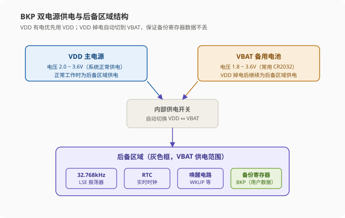
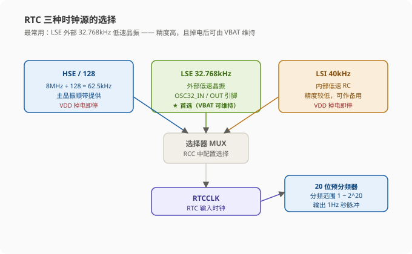
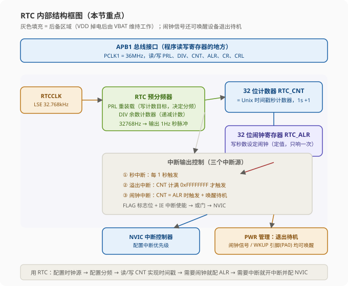
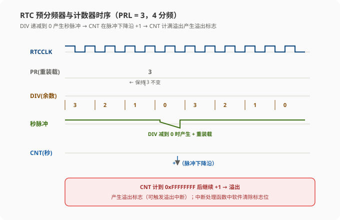
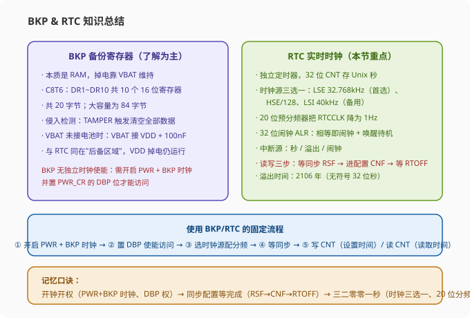

# STM32 [12-2] BKP 备份寄存器 & RTC 实时时钟 — 学习笔记

> **视频来源**: [B站 江协科技 STM32入门教程-2023版 p42 [12-2]](https://www.bilibili.com/video/BV1th411z7sn?p=42)
> **芯片型号**: STM32F103C8T6（中容量设备）
> **前置知识**: 51 单片机 DS1302 时钟芯片、Unix 时间戳（p41）、定时器基础、RCC 时钟树
> **本节定位**: BKP 备份寄存器与 RTC 实时时钟的**纯理论课**——先讲 BKP（内容少，了解即可），再重点讲 RTC 的原理、内部结构、时钟源、外部硬件电路与操作注意事项；代码部分留到下一节

---

## 一、课程概览

大家好，欢迎回来。本节我们学习 BKP 和 RTC 这两个外设。讲解顺序是**先 BKP 后 RTC**——先学习 BKP 的相关资料，再学习 RTC 的资料。

> **关键**: 本节的重点是 **RTC**。BKP 这部分内容比较少，要求也不高——大家知道 BKP 是什么、会读写数据进去就行了；RTC 的部分就需要重点掌握了，后面会详细讲。

为什么把这两个外设放在一起讲？因为它们**关系非常紧密，都位于"后备区域"，共用 VBAT 备用电池供电**。BKP 是"备份寄存器"，可以存用户数据；RTC 是"实时时钟"，负责计时。这两者一起构成了主电源掉电后依然能工作的一小块独立区域。

---

## 二、BKP 备份寄存器简介

### 2.1 什么是 BKP

BKP 的英文全称是 Backup Registers，翻译过来是**备份寄存器**，或者叫**后备寄存器**。

BKP 的用途是**用于存储、维护应用程序数据**——说白了，BKP 就是一块存储器，可以存储自定义的数据，想存什么就存什么。

BKP 存储器的特性是：**当主电源被切断时，它们仍然有 VBAT 电池维持供电**；当系统在待机模式下唤醒，或系统复位、电源复位时，**数据也不会丢失**。

> **原理**: 这一句"系统复位、电源复位、待机唤醒都不丢数据"是**后备区域**的本质特性。普通 RAM 一复位就全清零了，而 BKP 所在的后备区域由独立的电源域供电，只要 VBAT 有电，CPU 怎么复位都不影响它。这个特性上一节（p41）讲 Flash 实验时我们也提到过，后面会做实验验证。

### 2.2 VDD 与 VBAT：两组电源引脚

这里需要先理解两个电源概念：

| 电源 | 含义 | 电压范围 | 作用 |
|:---|:---|:---|:---|
| **VDD** | 系统主电源（组电源） | 2.0 ~ 3.6V | 正常工作时整个芯片的供电 |
| **VBAT** | 备用电池电源 | 1.8 ~ 3.6V | VDD 掉电后维持 BKP / RTC 工作 |

看一下芯片的引脚结构图（低引脚数封装）：图中标红色的部分都是供电引脚：

- 下面这几组 **VDD 和 VSS1、VSS2、VSS3**（注意有的封装是 3 组）是**内部数字部分电路**的供电；
- 这一组 **VDD 和 VSS1** 是**内部模拟部分电路**的供电（模拟电路单独供电，抗干扰更好）；
- **注意**：这里的 VDD 都是系统的组电源，正常使用 STM32 时，这几组主供电全部都需要接到 3.3V 的电源上；
- 最上面还有一个引脚 **VBAT**，这就是**备用电池供电引脚**。

> **关键**: 如果要使用 STM32 内部的 **BKP 和 RTC**，这个 VBAT 引脚**必须接备用电池**，用来维持 BKP 和 RTC 在 VDD 主电源掉电后的供电。
>
> 这里备用电池只有一个正极的供电引脚：接电池时，把电池**正极接到 VBAT**，电池**负极和主电源的负极接在一起**共地即可。

### 2.3 最小系统板上的 VBAT

看一下最小系统板的原理图：VBAT 引脚直接通过**排针**引出来了，这个引脚就位于板子**右上角**的地方，标号叫 VB 或者 VBAT。

另外注意：**如果不接电池的话，VBAT 引脚是悬空的**。但 STM32 参考手册建议：如果没有 VBAT 电池，可以把 **VBAT 引脚接到 VDD（和主电源接到一起），并且再连接一个 100nF 的滤波电容**。

> **提示**: 这个建议大家在**自己设计电路**的时候可以注意一下——不接电池但引脚悬空并不规范，把 VBAT 直接接 VDD 是最稳妥的做法（这也是本章后面"推荐接法"方案的一部分）。

### 2.4 BKP 为什么掉电不丢数据

回到 VBAT 的作用：**当 VDD 主电源断电时，BKP 会切换到 VBAT 供电，这样可以继续维持 BKP 里面的数据**。

如果 VDD 断电、VBAT 也没电了，那 BKP 里的数据就**丢失**了——因为 BKP 本质上是 RAM（随机存储器），**没有掉电不丢失的能力**，数据完全是靠电池"养"着的。

> **原理**: 所以"系统复位、电源复位、待机唤醒数据保持"这个特性是**显然要有的**——否则如果说 VDD 掉电了数据能保持，结果 VDD 一断连 VBAT 数据也跟着清除，那"数据保持"就没有意义了。BKP 的数据保持，本质就是**后备区域一直有电**，仅此而已。

---

## 三、BKP 的额外功能

BKP 还有几个额外的功能，这些功能了解即可，本节暂时不深入：

### 3.1 侵入检测（TAMPER）

第 1 个功能是**侵入检测**：当 TAMPER 引脚产生的**侵入事件**发生时，会**将所有备份寄存器内容清除**。

TAMPER 是一个接到 PC13 的外部引脚。可以看一下引脚定义图：PC13 上有 **TAMPER、RTC 校准输出、RTC 时钟输出**这几个复用功能共用一个引脚（引脚位置就是 VBAT 旁边的 2 号引脚），它们同一时间只能使用一个。

这个侵入检测是一个**安全保密措施**。比如你做一个安全系数非常高的设备，设备需要有**防拆功能**，BKP 里也存了一些敏感数据，这些数据不能被别人窃取或者篡改，那你就可以使用侵入检测功能：

1. 设计电路时，TAMPER 引脚先加一个默认的**上拉或下拉电阻**；
2. 然后引一根线到设备外壳的**防拆开关或触点**；
3. 万一拆开设备，触发开关就会在 TAMPER 引脚上产生**上升沿或下降沿**；
4. 芯片立刻检测到侵入事件，BKP 的数据**自动清零**，并**产生中断**；
5. 在中断里你还可以继续保护设备，比如清除其他重要数据，然后**让设备上锁**。

> **提示**: 另外，**主电源断电后侵入检测仍然有效**——侵入检测电路也在后备区域里，由 VBAT 供电，所以即使设备关机也能防拆。这就是侵入检测的功能，大家先了解一下。

### 3.2 RTC 校准时钟输出

第 2 个功能是 **RTC 校准时钟输出**，也是在 PC13 的位置。通过这个功能可以把 RTC 相关的时钟（比如**秒脉冲**信号）**输出到 PC13 引脚**，供外部设备使用，为别的设备提供时钟信号。

### 3.3 存储 RTC 时钟校准寄存器

第 3 个功能是**存储 RTC 时钟校准寄存器**。这个可以配合上面那个校准时钟输出的功能，结合一些测量方案对 RTC 进行**校准**。

> **原理**: 这个校准功能实际上是 RTC 的配置，放在 RTC 外设的地方讲应该更合适。但 RTC 和 BKP 关联程度比较高，设计的初衷就是把 RTC 的部分功能放在 BKP 里来实现——大家知道这一点就行。

---

## 四、BKP 的用户数据存储容量

最后看一下 BKP 中用户数据的**存储容量**：

| 芯片类别 | BKP 容量 | 举例 |
|:---|:---|:---|
| 中容量、小容量设备 | **20 字节** | STM32F103C8T6 就是中容量 |
| 大容量、互联型设备 | **84 字节** | STM32F103ZET6 等 |

我们用的 C8T6 是中容量设备，BKP 就是 **20 字节**。可以看出 BKP 的容量**非常小**，一般只能用来存储少量的参数（比如校准数据、掉电保存的标志位等）。

> **注意**: 不要指望用 BKP 存大量数据——20 个字节只够存 10 个 16 位数据，用它的场景是"少量、关键、需要掉电不丢"的参数。

---

## 五、BKP 的基本结构（后备区域）

下面看 BKP 的基本结构图。图中**灰色部分我们可以叫做"后备区域"**：

- BKP 处于后备区域，但**后备区域不只有 BKP**，还有 **RTC 的相关电路**也在后备区域里；
- 后备区域的特性：当**主电源掉电**时，后备区域仍然可以有 BKP 的备用电池（VBAT）供电；当**主电源上电**时，后备区域供电会**自动切换到 VDD**——主电源有电就不用备用电池了，这样**可以节省电池电量**。



BKP 位于后备区域，里面主要有：**数据寄存器、控制寄存器、状态寄存器**，以及 **RTC 时钟校准寄存器**这几样东西：

- **数据寄存器是主要部分**，用来存储用户数据的。每个数据寄存器都是 **16 位**的，一个数据寄存器可以存**两个字节**；
- 对于中容量和小容量的设备，里面有 **DR1 到 DR10 共 10 个数据寄存器**——一个寄存器存两个字节，所以中容量是 20 字节（就是上面说的 20 字节）；
- 对于大容量和互联型设备，除了 DR1~DR10，还有 **DR11 一直到 DR42，共 42 个数据寄存器**，容量是 84 字节（就是上面说的 84 字节）。

BKP 还有几个功能（对应结构图下方）：

- **侵入检测**：PC13 位置的 TAMPER 引脚引入一个检测信号，当 TAMPER 产生**上升沿或下降沿**时，**清除 BKP 所有内容**，保护安全数据；
- **RTC 时钟输出**：把 RTC 相关时钟从 PC13 位置的 RTC 引脚**输出到外部使用**；
- **时钟校准输出 + 校准寄存器**：配合校准寄存器可以对 RTC 的时钟进行校准。

> **总结**: 以上这些就是 BKP 外设的结构和功能内容，总体来说不是很多。BKP 的核心记忆点就三条：① 掉电靠 VBAT 保数据；② 中容量 20 字节（DR1~DR10）；③ 侵入检测可以把数据清空。

---

## 六、RTC 实时时钟简介

接下来进入本节的重点——**RTC 外设**。

### 6.1 什么是 RTC

RTC 的全称是 **Real Time Clock（实时时钟）**，中文意思就是实时时钟。

RTC 是一个**独立的定时器**，可以为系统提供**时间和日历**的功能。RTC 的计时一般就是提供**年、月、日、时、分、秒**这种日期时间信息。

之前我们在 51 单片机学过 **DS1302** 这个芯片——DS1302 是**外置的 RTC 芯片**。这个芯片可以独立计时，我们需要设置时间或读取时间时，就通过 **I2C 协议**向它发送或接收数据来完成。

而我们的 STM32 **内部就集成了 RTC 外设**，所以 STM32 可以在内部直接实现 RTC 的功能，**就不用再外挂 RTC 芯片了**。当然，RTC 芯片所必需的元器件（比如**备用电池、RTC 晶振**）就要接到 STM32 上了。

### 6.2 RTC 的特性

RTC 内核时钟配置，系统处于后备区域，**系统复位时数据不清零**，**主电源断电后**可借助 **VBAT 供电继续计时**——这个特性就和之前 BKP 一样。为了保持时钟能一直连续运行不停下来，在主电源断电后 RTC 计时肯定不能停下来，在系统复位时 RTC 寄存器的值肯定也不能复位，**VBAT（检测备用电池）就是必须的了**：主电源断电后，VBAT 电池可以继续维持 BKP 和 RTC 的运行。

RTC 的主要特性有下面几点：

1. **32 位的可编程计数器**——可以对应 **Unix 时间戳**的秒计数器；
2. **20 位的可编程预分频器**——可适配不同频率的输入时钟；
3. **可选择 3 种 RTC 时钟源**。

### 6.3 为什么只用"秒计数器"这一个寄存器（Unix 时间戳的思路）

这一点可以对照框图来理解：可以看到这里**负责计时的装置只有一个 32 位的秒计数器**。

> **原理**: 如果你没学过上一节讲的 Unix 时间戳，可能就会非常疑惑——这不是一个实时时钟外设吗？年月日时分秒呢？我之前学习 DS1302 的时候，那里面可有一堆寄存器的，什么年、月、日、时、分、秒，各种日期时间的信息都往里写——写入对应寄存器就是修改时间，读取对应寄存器就是获取时间。难道这里一大块就只给我一个秒计数器？这种怎么用？

如果你不了解时间戳相关的操作，那确实不太好用这个 RTC。但是我们经过上一节（p41）的学习，应该很容易就能看明白了：

- 显然这个 **32 位可编程计数器就对应的是时间戳里的秒**；
- **读取时间**时：我们先得到这个秒数，然后使用时间戳转换模块里的**转换函数**，就能立刻知道年、月、日、时、分、秒的信息；
- **写入时间**时：先把年月日时分秒信息**转换成时间戳结构体**（`struct tm`），然后调用另一个函数得到秒数，再写入到这个 32 位计数器里。

这样操作这个秒计数器的思路是不是就很清晰了？

> **原理**: 得益于时间戳的设计，这个硬件结构就得到了极大的简化。你看，要想实现年月日时分秒的计时，我们只需要一个 32 位的秒计数器——什么年月日时分的寄存器都不需要再设计了，硬件也不再需要考虑大小月、平年、闰年这些特殊情况，直接一个秒一直加就行了，这无疑极大地简化了硬件电路的设计。
>
> 那当然，硬件简化了，**压力就来到了软件这边**：我们每次读取和写入秒计数器时都要进行时间戳的转化，这需要消耗一定的软件计算资源。

### 6.4 20 位可编程预分频器

就是这个 32 位可编程计数器的设计，接着看下面的第二条：

**20 位的可编程预分频器**——可适配不同频率的输入时钟。这可以继续对应到下面的图来理解：

- 这里 32 位的秒计数器显然**一秒要自增一次**，所以驱动计数器的时钟需要是一个 **1Hz** 的信号；
- 但实际提供给 RTC 模块的时钟（**RTCCLK**）一般频率都比较高，所以显然我们需要在这之间**加入分频器**，给 RTCCLK 降低频率，保证分频器输出给计数器的频率为 **1Hz**，这样才能正确；
- 为了适配各种频率的 RTCCLK，这里就加了一个 **20 位的分频器**，可以选择对输入时钟进行 **1 到 2^20（约 100 万）这么大范围**的分频，这样就可以适配不同频率的输入时钟了。

这就是这个可编程分频器的作用。

---

## 七、RTC 的三种时钟源

最后一点：**可选择 3 种 RTC 时钟源**。分别是：

1. **HSE 时钟除以 128**，通常为 8MHz 除以 128（约 62.5kHz）；
2. **LSE 振荡器时钟**，通常为 **32.768kHz**；
3. **LSI 振荡器时钟**，固定为 **40kHz**。

这三个时钟可以选择其中一个接入到这里的 RTCCLK。

> **原理**: 这三个时钟都是什么意思呢？我们可以看一下之前定时器部分讲过的 RTC 时钟树。这个图就是整个芯片的时钟系统，整个芯片可以有 4 个时钟源：HSE（高速外部时钟信号）、HSI（高速内部时钟信号）、LSE（低速外部时钟信号）、LSI（低速内部时钟信号）。这 4 个名字你要记住：**H 开头是高速、L 开头是低速、E 结尾是外部、I 结尾是内部**，高速/低速 × 内部/外部一组合就是四种情况。高速时钟一般给内核和主要外设使用，低速时钟一般给 RTC、看门狗这些东西使用。

回到本节的 RTC，可以看到时钟树里这块指向 RTC 的箭头就是 RTCCLK，RTCCLK 有三个来源：

### 7.1 第一路：HSE / 128

第一路是 HSE——**外部高速晶振（主晶振）**，我们一般用的都是 8MHz 晶振。8MHz 晶振进来，通过 **128 分频**可以产生 RTCCLK 信号。

为什么要先 128 分频？因为 8MHz 的主晶振**太快了**——如果不预先分频直接给 RTCCLK，即使再通过 RTC 的 20 位分频器，也分不到 1Hz 这么低的频率（20 位分频最大约 100 万分频，8MHz 除以 100 万才 8Hz，还是到不了 1Hz）。所以 8MHz 晶振提前先进行 128 分频，得到约 62.5kHz，之后 20 位的分频器再进行分频，就可以输出 1Hz 的信号给计数器了。

### 7.2 第二路：LSE 32.768kHz（最常用）

中间这路时钟来源是 **LSE 外部低速晶振**。我们在 **OSC32_IN / OSC32_OUT 这两个引脚**上接上外部低速晶振，这个晶振产生的时钟可以直接提供给 RTCCLK。

**OSC32 这两个引脚的晶振是内部 RTC 的专用时钟**。这个晶振的值也不是随便选的，通常跟 RTC 有关的晶振都是统一的数值，就是 **32.768kHz**。

为什么选择这个数字呢？

- **一方面是**：32.768kHz 这个值附近的频率是这个晶振工艺比较合适的频率。你要说非要做一个 1Hz 的晶振，那可能是做不出来，或者做出来体积很大、性能很差；
- **另一方面是**：32768 是一个 **2 的次方数**——**2^15 = 32768**。所以 32.768kHz 的晶振，用一个 **15 位分频器的自然溢出**就可以很方便地得到 1Hz 的频率。

> **原理**: "自然溢出"的意思就是设计一个 15 位的计数器，这个计数器**不用设置计数目标**，直接从 0 开始计，计到最大值 32767，计满后**自然溢出**，这个溢出信号就是 1Hz。自然溢出的好处就是**不用额外设计一个计数目标，也不用比较计数器是不是计到目标值**，这样可以简化电路设计。所以在实时时钟电路里，基本都是统一选用 32.768kHz 的晶振——你只要看到 32.768kHz 的晶振，它八成就是提供给 RTC 的。这是第二路。

### 7.3 第三路：LSI 40kHz

最后看第三路时钟来源：**LSI 内部低速 RC 振荡器**，LSI 固定是 40kHz。如果选择 LSI 当作 RTC 时钟，可以**经过 40 分频**就能得到 1Hz 的计数时钟了。

但内部的 RC 振荡器精度一般**没有外部晶振高**，所以 LSI 给 RTC 用可以当作一个**备用方案**。另外 LSI 还可以提供给看门狗使用——这个先了解一下，之后讲看门狗的时候再说。

### 7.4 我们应该选哪一路？

这三个时钟源里**最常用的就是中间这一路：外部 32.768kHz 的晶振**给 RTC 提供时钟。原因有两个：

- **第一**：中间这一路 32.768kHz 的晶振**本身就是专门给 RTC 使用的**。上下这两路其实是有各自任务的——上面这一路主要作为系统时钟，下面这一路主要作为看门狗时钟，它们只是顺带可以备用当作 RTC 时钟，主用的时钟我们自然还是选专用的；
- **第二（更重要的原因）**：只有中间这一路的时钟可以**通过 VBAT 备用电池供电**，上下两路时钟在**主电源断电后是停止运行**的。所以要想实现 RTC 主电源掉电继续计时的功能，**必须选择中间这一路的 RTC 专用时钟**——如果选择的是上下两路时钟，主电源断电后时钟就暂停了，这会导致计时出错。

> **关键**: 所以三路时钟的取舍：**主要选择中间这一路（LSE 32.768kHz）**，上下两路在特殊情况下可以作为备用方案。



---

## 八、RTC 内部框图详解

回到 RTC 的简介，接下来看 RTC 的框图，看看这个 RTC 外设具体是怎么设计的。

先整体上划分一下（老师原话"整理上划分一下"）：

- **左边**这一块是**核心的分频和计数器计时部分**；
- **右边**这一块是**中断屏蔽寄存器和 NVIC 部分**；
- **上面**这一块是 **APB1 总线接口**部分；
- **下面**这一块是 **PWR 管理**的部分——意思是 RTC 的闹钟可以**唤醒设备退出待机模式**。

图中**灰色填充的部分都属于后备区域**，这些电路在**主电源掉电后可以使用备用电池维持工作**。另外这里还标出，这些模块在**待机时都会继续维持供电**；其他未被填充的部分就是待机时不供电的部分。有关睡眠、停机、待机这些低功耗相关的内容，下节讲 PWR 的时候再细讲，这里了解一下就行。



我们一部分一部分来看。

### 8.1 分频和计数器计时部分

这一块输入的时钟是 **RTCCLK**（前面说过，来源需要在 RCC 里配置，可选三个时钟源，我们主要选中间一路）。因为这三路时钟频率各不相同，而且都远大于我们所需要的 1Hz 的比较计数频率，所以 **RTCCLK 进来首先需要经过 RTC 预分频器进行分频**。

这个分频器有两个计数器组成：

- 上面是**重装载寄存器 RTC_PRL**；
- 下面这个是 **RTC_DIV**，手册里把它叫做**"余数计数器"**。

> **原理**: 这个名字比较奇怪，但它的作用和我们自己学的定时器里面的"重装载值 + 计数器"是一样的——可能是因为已经有一个计数器（CNT）了，所以这个计数器就叫"余数计数器"，但实际上它还是计数器的功能。分频器其实就是一个计数器：**计几个数就是几分频**。所以对于可编程的分频器来说，需要有两个寄存器：一个寄存器不断计数，另一个寄存器我们写入一个计数目标值用来配置是几分频。

在这里：

- **PRL（重装载寄存器）就是计数目标**——写入 6 就是 7 分频，写入 9 就是 10 分频。因为包含计数值，所以**重装载值写入几，就是几加 1 分频**，这个和定时器大致是一样的；
- **DIV（余数计数器）就是每来一个时钟计几个数**。它是一个**递减计数器**：每来一个时钟递减一次，递减到 0，再来一个时钟，一个脉冲产生**溢出信号**，同时 DIV 重新加载重装载值，回到重装载值继续递减。

举个例子：假如输入时钟是 **32768Hz**，为了分频之后得到 1Hz，**PRL 写入 32767**：

1. DIV 计数递减，第一个时钟到来，DIV 递减为 32766；
2. 第二个时钟，DIV 递减为 32765；
3. 第三个时钟，递减为 32764……之后一直在每个输入时钟递减；
4. 直到减为 0，然后再来个输入时钟，就会产生一个**溢出信号**，同时 DIV 回到 32767，如此往复循环；
5. 这样的话，就是每来 **32768 个输入时钟**，分频器溢出一次，产生一个输出脉冲，就是 **32768 分频**；
6. 分频输出后的时钟频率是 **1Hz**，提供给后续的比较计数电路。

### 8.2 32 位计数器 RTC_CNT

然后看计数器部分，这块就比较简单了：**32 位可编程计数器 RTC_CNT**，就是计数器最核心的部分。

我们可以把这个计数器看成是 **Unix 时间戳的秒计数器**，这样借助时间戳的转换函数，就可以很方便地得到年月日时分秒了。

### 8.3 闹钟寄存器 RTC_ALR

在下面这里，RTC 还设计有一个**闹钟寄存器 RTC_ALR**。这个 ALR 也是一个 32 位的寄存器，和上面这个 CNT 是**等宽**的，它的作用顾名思义，就是**设置闹钟**：

- 我们可以在 ALR 写一个**秒数**设定闹钟；
- 当 **CNT 的值跟 ALR 设定的闹钟值一样时**（就是这里画的等号"="），就代表**闹钟响了**；
- 这时就会产生 **RTC_ALR 闹钟信号**，通过右边的中断系统，在中断处理函数里你可以执行相应的操作。

> **提示**: 同时，这个闹钟还**兼任一个功能**——闹钟信号可以让 RTC（芯片）**退出待机模式**。这个功能就可以对应一些应用场景。比如物理设计数据采集设备，说在环境非常恶劣的地方工作（比如海底、高原、深井这些地方），然后要求是每天中午 12 点采集一次环境数据，其他时间为了节省电量、避免频繁唤醒，芯片都必须处于**待机模式**。这样的话，我们就可以用这个 RTC 自带的闹钟功能，定一个中午 12 点的闹钟：**闹钟一响，芯片唤醒、采集数据，完成后继续待机**——这样是不是就可以完成这个任务了。

> **注意**: 另外，这个闹钟值是一个**定值**，只能响一次。所以如果你想实现**周期性的闹钟**，每次闹钟响之后，都需要在**重新设置一下下一个闹钟时间**。这就是闹钟和闹钟唤醒的一个应用场景。

### 8.4 中断系统（三个中断源）

接下来看中断部分。在左边这里，有**三个信号可以触发中断**：

1. **第一个是 RTC 秒中断**：它的来源就是分频输出给 CNT 的计数时钟（1Hz 秒脉冲）。如果开启这个中断，那么程序就会**每秒进入一次 RTC 中断**；
2. **第二个是 RTC 溢出中断**：它的来源是 **CNT 的溢出**——意思就是 CNT 的 32 位计数器计满溢出时，会触发一次中断。所以这个中断**一般不会触发**。我们上一节说过，这个 CNT 定义的是**无符号数**，到 **2106 年**才会溢出，所以这个中断在 2106 年会触发一次。如果你想要采取更晚截止，可以开启这个中断。到 2106 年就是溢出，为了避免不必要的错误，你可以让芯片报警，然后提示"该设备过了使用寿命，请更换设备"。当然在 2106 年之后，这个 STM32 的 RTC 就不太好用了，到时候或许可以通过打补丁的方式继续运行，或者直接淘汰，换用别的时间方案。这个问题就留给后人解决吧；
3. **第三个是 RTC 闹钟中断**：刚才说过，当计数器值和闹钟值相等时触发中断，同时闹钟信号可以把设备从待机模式唤醒。

这三个中断信号到右边这一块，就是**中断比较标志位和中断使能控制**：

- 这些 **FLAG 是对应的中断标志位**；
- **IE 是中断使能**；
- 最后三个信号通过一个**或门**，汇集到 **NVIC 中断控制器**（这应该是不可避免的，中断线最终合为一条）。

> **关键**: 使用中断的流程：需要中断的话，**先允许中断（使能 IE）**，再**配置 NVIC**，最后**写对应的中断函数**即可。

### 8.5 APB1 总线和 APB1 接口

上面这一块 APB1 总线和 APB1 接口，就是我们**程序读写寄存器**的地方了——读写寄存器可以通过 **APB1 总线**来完成。APB1 总线上的设备，RTC 挂在它上面。

### 8.6 PWR 管理（退出待机模式）

最后下面这一块是**退出待机模式**。除了闹钟信号之外，还有一个 **WKUP 引脚**（唤醒引脚，对应 PA0，具体位置可以看引脚图）——**闹钟信号和 WKUP 引脚，都可以唤醒设备**。WKUP 引脚它兼具唤醒的功能，这个我们下节课讲 PWR 的时候再学习。

到这里，这个 APB1 外设框图（RTC 框图）就已经全部聊清楚了。用老师给出的基本结构再总结一下以上内容：

- 最左边是 **RTCCLK 时钟来源**，这一块需要在 RCC 里配置，三个时钟源选择一个当作 RTCCLK；
- 之后 RTCCLK 先通过**预分频器**对时钟进行分频——预分频器是一个**递减计数器**，**重装载值**是计数目标，决定分频系数；
- 分频之后得到 **1Hz 的秒计数信号**，通向 **32 位计数器**，一秒自增一次；
- 下面还有一个 **32 位的闹钟寄存器**，可以设定闹钟——如果不需要闹钟的话，下面这一块可以不用管；
- 然后右边有**三个信号可以触发中断**，分别是**秒信号、计数器溢出信号、闹钟信号**——三个信号先通过中断输出控制，使能的中断才能通过，然后向 CPU 申请，再进入中断；
- 使用要点：配置这个**数据选择器**（时钟源选择），可以选择时钟来源；配置**重装载寄存器**，可以选择分频系数；配置 **32 位计数器**，可以进行日期时间的读写；需要闹钟的话，配置 32 位闹钟值即可；需要中断的话，先允许中断，再配置 NVIC，最后写对应的中断函数即可。

这就是 RTC 外设的主要功能，我们就讲到这里。

---

## 九、RTC 的外部硬件电路

RTC 是 STM32 内部的外设，但外部的一些电路也还是需要的。为了配合 RTC，在最小系统电路上，**外部电路还需要额外加两部分**：

1. **第一部分**：备用电池；
2. **第二部分**：外部低速晶振。

### 9.1 备用电池的供电电路

首先是备用电池的供电部分，老师给了**两个参考电路**：

#### 方案一：简单接法（参考数据手册 5.1.6）

第一个是简单接法：用一个 **3V 的电池**，**负极和系统地相连，正极直接接到 STM32 的 VBAT**，这样就行了。这个供电方式非常简单，参考来源是 STM32 数据手册的 5.1.6 节（电池备份部分）。通俗地说，就是**直接接一个 1.8 到 3.6V 的电池到 VBAT 就行了**。

> **原理**: 另外也可以看到，芯片**内部是有一个供电开关的**：VBAT 有电池时（VDD 掉电），开关拨到备用电池侧，后面电路由 VBAT 供电；VDD 正常时，开关拨到主电源侧，后面电路由 VDD 供电。由 VBAT 供电的后面电路有哪些呢？手册里写得很清楚——有 **32.768kHz 振荡器、RTC、唤醒电路和后备寄存器**。这就是根据数据手册设计的 VBAT 供电方案，这个设计非常简单，一般来说也没问题。

#### 方案二：推荐接法（参考应用手册 4.1.2）

第二种方案是**推荐接法**。这种接法是：**电池通过二极管 D1 向 VBAT 供电**，另外**主电源的 3.3V 也通过二极管 D2 向 VBAT 供电**，最后 VBAT 再加一个 **0.1uF 的电源滤波电容**。

这个供电方案的参考来源是 STM32 的参考应用手册（4.1.2 电池备份区域这一节），其中有几个建议：

1. **建议一**：在一些情况下，电流可能通过 VBAT 和 VDD 之间的**内部二极管**，注入到 VBAT。如果与 VBAT 连接的电源或者电池**不能承受这样的注入电流**，**强烈建议**在外部 VBAT 和电源之间**连接一个低压降的二极管**；
2. **建议二**：如果在应用中**没有外部电池**，建议 VBAT 在外部**连接到 VDD**，并连接一个 **100nF 的退耦滤波电容**。

所以综合这两条建议，我们可以设计出右边的**推荐接法**：

- 电池和主电源**都加二极管**，防止电流倒灌；
- VBAT 加一个 **0.1uF 的电源滤波电容**（0.1uF 就是 100nF）；
- 如果没有备用电池，就由 **3.3V 主电源供电**；如果接了备用电池，就由备用电池供电。

> **提示**: 这是根据参考手册设计的推荐接法。如果你只是**做实验**，那使用左边的简单接法就行了；如果你要**开发完整的产品**，那还是推荐使用右边的接法，这样更保险。

### 9.2 外部低速晶振电路

继续看右边的**外部低速晶振部分**，就是一个典型的晶振电路了：

- 这里 X1 是一个 **32.768kHz 的 RTC 晶振**，这个晶振不分正负极，两个引脚分别接在 **OSC32_IN / OSC32_OUT** 这两个引脚上；
- 晶振两个引脚再分别接一个**匹配电容到地**。

这个电路的设计参考来源还是 STM32 的数据手册（5.3.6 外部时钟源特性），有参考电路：使用一个晶体或陶瓷谐振器产生的低速外部时钟。对于匹配电容 **CL1 和 CL2**，建议使用**高质量（高精度）的 5pF 到 15pF 之间的匹配（负载）电容**。所以对应相应电路的设计，还是得多看看手册——**手册看多了，自然就会了**。老师在示例电路里，实际电容给的是 **10pF**。

### 9.3 实物认识：纽扣电池和晶振

- 这个**备用电池**，我们一般可以选择这样的 **3V 纽扣电池**，型号是 **CR2032**，这是一个非常常用的纽扣电池型号。**注意**：这个纽扣电池**印字（带字）的这一面是正极**，这里也有个正号标志；另一面**比较小的那个电极是负极**，这个比较容易搞错；
- **32.768kHz 的晶振**，我们可以选择这样的**金属圆柱状**的晶振（音叉晶振），这个晶振也比较常见。大家**拆开钟表、计算器**，基本上都能找到这样的元件——就是 32.768kHz 的晶振。晶振的全称是**石英晶体振荡器**，所以我们常做的"石英钟"，名称就来源于这样一个元件；
- 下面这个是我们的最小系统板。这个板子**自带 RTC 晶振电路**：这里这个黑色的元件看起来有 **32.768K** 字样，这也是一种样式的 RTC 晶振；旁边这个金属圆柱状的，是 **8MHz 的外部高速晶振**。不过我们板子**没有自带备用电池**，VBAT 引脚直接通过**右上角的端口**引出来了——如果需要备用电池的话可以接在这里，**或者直接把 3.3V 的主电源接在这里，也能实现功能**。

好，以上就是 RTC 的硬件电路部分。

---

## 十、RTC 的操作注意事项（重点）

最后我们再看一些 RTC 的**操作注意事项**。这些注意事项都是从手册里复制过来的原文，写程序的时候需要注意这些问题，我们一条一条看。

### 10.1 第一条：两步使能对 BKP 和 RTC 的访问

> 原文大意：通过以下操作使能对 BKP 和 RTC 的访问：① 设置 RCC_APB1ENR 的 PWREN 和 BKPEN 位，使能 PWR 和 BKP 时钟；② 设置 PWR_CR 的 DBP 位，使能对 BKP 和 RTC 的访问。

这里就提醒一下：**正常的外设，第一步开启时钟就能用了**，但是 **BKP 和 RTC 这两个外设，开启稍微复杂一些**：

- **第一步**：设置 RCC_APB1ENR（就是开启 APB1 外设时钟的寄存器），要**同时开启 PWR 和 BKP 的时钟**。对于 RTC 来说，**并没有单独开启时钟的选择**；
- **第二步**：设置 **PWR_CR 的 DBP 位**，来使能对 BKP 和 RTC 的访问——这个寄存器配置一下就行。

> **关键**: 总结一下，如果你要使用 BKP 和 RTC，都要先执行这两步：**第一步开启 PWR 和 BKP 的时钟，第二步使用 PWR 使能 BKP 和 RTC 的访问**。这个我们在写程序的时候就要注意一下，按照这个流程来就行。

对应到标准库，大致就是这样的流程（下节课写代码会用到）：

```c
// 第一步：开启 PWR 和 BKP 的时钟（APB1 总线上的外设时钟）
RCC_APB1PeriphClockCmd(RCC_APB1Periph_PWR | RCC_APB1Periph_BKP, ENABLE);

// 第二步：使能对 BKP 和 RTC 的访问（PWR_CR 的 DBP 位）
PWR_BackupAccessCmd(ENABLE);
```

> **原理**: 为什么需要 DBP 位这一步？因为 BKP/RTC 所在的后备区域**由 VBAT 独立供电、且复位时不清数据**，属于"关键区域"。芯片为了防止软件误操作破坏备份数据，特意加了一道"写保护"——必须先置 DBP 位打开访问权限，之后才能读写 BKP 和 RTC 的寄存器。

### 10.2 第二条：等待寄存器同步（RSF 标志）

> 原文大意：如果在读取 RTC 寄存器时，RTC 的 APB1 接口曾经处于禁止状态，那么首先必须等待 RTC_CRL 寄存器中的 RSF（寄存器同步标志）被置 1。

这步对应代码里的一个函数，就是 **RTC 等待同步（RTC_WaitForSynchro）**。一般在**刚上电**的时候，调用这个函数就行了。

**为什么要有这一步呢？** 可以看一下这个图：在这里会有两个时钟，**PCLK1** 和 **RTCCLK**：

- **PCLK1 在主电源掉电时会停止**，所以为了保证 RTC 主电源掉电后正常工作，**RTC 里的寄存器都是在 RTCCLK 的同步下更新的**；
- 当我们用 **PCLK1 驱动的总线**（APB1），去读取 **RTCCLK 驱动的寄存器**时，就会有一个**时钟不同步**的问题：RTC 寄存器**只有在 RTCCLK 的上升沿更新**，但是 **PCLK1 的频率是 36MHz，远大于 RTCCLK 的频率（32.768kHz）**；
- 如果我们在 APB1 刚开启时，就立刻读取 RTC 寄存器，有可能 RTC 寄存器**还没有更新到 APB1 总线上**，这样我们读到的值就是错误的——通常来说就读到 0。

> **关键**: 所以这就要求我们在 APB1 总线刚开启时，**要等一下 RTCCLK**：只要 RTCCLK 来一个上升沿，RTC 把它的寄存器的值同步到 APB1 总线上，这样之后读取的值就都是没有问题的了。这是设计细节的一个问题，当然我们其实也不用管那么多，只需要在**刚上电时调用一个等待同步的函数**就行了。

### 10.3 第三条：进入配置模式（CNF 位）

> 原文大意：必须设置 RTCCLK 驱动的 CRL 寄存器中的 CNF 位，使 RTC 进入配置模式后，才能写入 RTC_PRL、RTC_CNT、RTC_ALR、RTC_CRL 这些寄存器。

这一条其实比较简单：**RTC 会有一个"进入配置模式"的标志位**，把这一位置 1 后才能设置时间。不过这个操作在例程中，**每个写寄存器的函数，它都自动帮我们加上这个操作**了，所以我们就不用再单独调用函数进入配置模式了。

### 10.4 第四条：等待写操作完成（RTOFF 标志）

> 原文大意：对 RTC 任何寄存器的写操作，都必须在前一次写操作结束后进行。可以通过查询 RTC_CRL 寄存器中的 RTOFF（状态位，转写中记为 RTCLF）判断 RTC 寄存器是否处于更新中，当 RTOFF 状态位置 1 时，才可以写入 RTC 寄存器。

这个操作也是调用一个**等待函数**（RTC_WaitForLastTask）之类的东西，跟我们之前读写 Flash 函数是类似的——**写入之前要等待一下**：如果上一次的写入还没完成，你又别急着写下一次了；或者说**每次写入之后，你要等待 RTOFF 为 1，只有 RTOFF 为 1，才算这次写完成**。

**为什么要有这个操作呢？** 其实还是因为这里的 **PCLK1 和 RTCCLK 的频率不一样**：

- 利用 PCLK1 的频率写入之后，这个值**还不能立刻更新到 RTC 的寄存器里**，因为 RTC 寄存器是由 **RTCCLK** 驱动的；
- 所以 PCLK1 写完之后，得**等一下 RTCCLK 的时序**——RTCCLK 来一个上升沿，才更新到 RTC 寄存器里，整个写入过程才算结束了。

> **提示**: 这个操作了解一下，在代码里，有时调用一个等待函数就行。这些就是操作 RTC 的一些注意事项，其实都是些细节问题，这个我们写代码的时候会再给大家提一下。现在大家**先知道有这么回事**就行了。

---

## 十一、数据手册浏览

好，有关 BKP 和 RTC 的知识点就讲这么多。老师照例带大家看一下手册。本期的课程手册内容，主要是**第五章"备份寄存器 BKP"**和**第十六章"RTC 实时时钟"**。

### 11.1 手册中的 BKP 章节

手册里对 BKP 的介绍**非常少**，总共就一页多点，后面就是寄存器描述，这么点内容大家可以抽空自己看一看：

- 前面上面这一段是 BKP 的**简介**；
- 最后的几句，就是 **PWR 操作注意事项的第一条**：写代码第一步，要先开启 PWR 和 BKP 的时钟，再使能对 BKP 和 RTC 的访问；
- 下面这些是 BKP 的**特性和侵入检测**的具体描述，大家可以再看看；
- 之后是 RTC 的**校准**：借助 RTC 的校准时钟输出和校准寄存器的功能，可以对 RTC 进行校准。关于 RTC 的校准和如何提高精度，请看这个文档对应章节。

接着下面就是寄存器描述了：

- 首先，**备份数据寄存器 DR1 到 DR10**，总共 10 个，每个寄存器都是 16 位的，可以在这里存储自己的数据；
- 然后 **RTC 时钟的校准寄存器**：可以配置时钟源的选择和校准值；
- 下面是**控制寄存器**：主要用来配置侵入检测的功能（侵入检测的引脚电平极性、是否开启侵入检测功能）；
- **控制状态寄存器**：是一些标志位等；
- 最后就是**寄存器映射的总表**：里面 DR1 一直到 DR10 排在一起的，中间是一些控制寄存器等，额外还有 **DR11 一直到 DR42**，后面这一块是**大容量和互联型设备才有的**。

> **总结**: 这些就是 BKP 的寄存器，BKP 还是比较简单的，也没有很多东西。

### 11.2 手册中的 RTC 章节

再看一下 RTC：

- 前面是一些简介，这里也写了：**它的开启流程和 BKP 的是一样的**（先开时钟，再使能访问）；
- 这都是一些主要特性，我们基本也都提到过；
- 后面是一些功能描述，还有**系统框图**，这个我们都仔细分析过，大家可以再研究研究，有空的话看一下；
- 之后，继续看 **RTC 寄存器同步**——这个刚才注意事项里说过，这是对这个问题比较详细的描述，大家需要做的，就在 **APB1 开启时调用一个等待同步的函数**就行了；
- 下面是**其他 RTC 的注意事项**，也是我们刚才说的**写入时的注意事项**；
- 下面这个带有一张**时序图**，其实就是对 RTC 工作流程的描述，我们可以仔细看一下，这里面涉及的细节还是很多的。

### 11.3 RTC 工作时序图解读



先看**预分频/计数的时序图**，这里的例子是 **PRL = 3**（而余数计数器的初始值也等于 3），分频器的重装载值 PRL = 3，就对 RTCCLK 进行 **4 分频**：

- 图中第一行是 PR（PRL 的重装载值）——里面的值正在递减？**当然重装载值应该是使用不变的**，所以这个递减应该是**余数计数器 DIV**；
- 可以看到 DIV：3、2、1、0、3、2、1、0……这样不断循环递减。当它减到 0 之后，下一个值变为重装载值，同时触发一个**脉冲**；
- 每个脉冲，下面的 **CNT 就计数一次**。可以看到，这个 CNT 计数的时刻是**脉冲的下降沿**，所以 CNT 计数，相比较分频器溢出的时机，是**慢了一个 RTCCLK 时钟**的；
- 之后 CNT 一直递增，直到 CNT 溢出。

再看**溢出的时序图**：这里 CNT 已经计到非常大的值了——**0xFFFFFFFF**，马上就要溢出了，继续递增，**FFFFFFFF**，溢出之后，在这个时刻产生**溢出脉冲（溢出信号）**，最后**溢出标志位置 1**。如果开启了溢出中断，就进入中断处理函数。在中断处理函数里，由**软件清除**这个溢出标志位。

> **原理**: 这两个时序，其实跟我们之前讲的 RTC 工作流程是一样的，就是时序图体现的细节更多，了解一下即可。

### 11.4 RTC 寄存器描述

之后就是 RTC 的寄存器描述了：

- 首先**控制寄存器的高位**，这是一些**中断使能位**；**控制寄存器的低位**，这是一些**标志位**；
- 这里我们发现，**RTC 和 BKP 的寄存器其实都是 16 位的**——你看这一个寄存器明明就是 32 位的，被它强行拆分为两个来访问了，一个高位、一个低位。

> **原理**: 这应该是为了简化电路设计：对于这些不是那么重要的外设，就没有必要再上 32 位的总线了，16 位的总线足够了，设计也会简单一些。所以这里的寄存器，就都是 16 位一个的。

- 接着看**预分频器重装载寄存器**：这个分频器是 **20 位**的，所以高 16 位里**只有 4 个有效位**，再和下面低 16 位组合在一起，就是 **20 位的重装载值**；
- 下面**预分频器余数寄存器**：这里高位和下面 16 位，就是 **20 位的余数计数器**；
- 然后**计数器寄存器**：高 16 位加低 16 位，这就是**核心的 32 位计数器**了；
- 之后**闹钟寄存器**：高 16 位加低 16 位，这个 **32 位的闹钟值**。

最后就是 RTC 寄存器的一个**汇总表**，就是 RTC 的内容。

---

## 十二、知识总结

### 12.1 本节要点

**BKP 备份寄存器（了解为主）**：

1. 本质是 RAM，数据保持完全依赖 VBAT 备用电池；VDD 掉电、系统复位、待机唤醒都不会丢数据；
2. 中容量/小容量 20 字节（DR1~DR10，10 个 16 位寄存器）；大容量/互联型 84 字节（DR1~DR42）；
3. 侵入检测：TAMPER 引脚（PC13）上升沿/下降沿触发 → 清除全部备份数据 + 产生中断，主电源断电后仍有效；
4. 不接电池时，VBAT 接 VDD + 100nF 滤波电容；
5. 使用前提：开启 PWR + BKP 时钟，并置 PWR_CR 的 DBP 位。

**RTC 实时时钟（本节重点）**：

1. 独立的实时时钟外设，内部集成，无需外挂 DS1302；
2. 核心是一个 **32 位秒计数器 RTC_CNT**，直接对应 Unix 时间戳（p41 内容），配合转换函数实现年月日时分秒；
3. 20 位预分频器（PRL 重装载 + DIV 余数计数器）把 RTCCLK 降为 1Hz；
4. 时钟源三选一：**LSE 32.768kHz（首选）**、HSE/128（62.5kHz）、LSI 40kHz（备用）；只有 LSE 能由 VBAT 维持，掉电后继续走时；
5. 32.768kHz = 2^15，15 位计数器自然溢出得到 1Hz，简化电路设计；
6. 32 位闹钟 ALR：CNT 与 ALR 相等触发闹钟中断，并可唤醒待机模式；闹钟是定值，周期性闹钟要每次重设；
7. 三个中断源：秒中断、溢出中断（2106 年才溢出）、闹钟中断；
8. 操作注意事项：① 开 PWR+BKP 时钟 + 置 DBP；② 读前等同步（RSF）；③ 写前进入配置模式（CNF）；④ 每次写后等完成（RTOFF）。

### 12.2 记忆口诀

> **口诀**: "开钟开权，同步配置等完成，三二零一秒"
>
> - **开钟开权**：开启 PWR + BKP 时钟，置 DBP 位打开访问权；
> - **同步配置等完成**：等同步 RSF → 进配置 CNF → 等 RTOFF；
> - **三二零一秒**：时钟源三选一（LSE 首选）、20 位预分频、32 位秒计数器、输出 1Hz。

### 12.3 总结图



---

*笔记生成时间: 2026-08-06 | 基于 B站视频 BV1th411z7sn p=42 转录*
