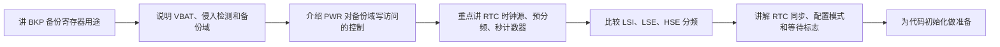

# STM32 [12-2] BKP 备份寄存器 & RTC 实时时钟 学习笔记

## 视频信息

| 项目 | 内容 |
|---|---|
| 来源 | Bilibili：`BV1th411z7sn`，P42 |
| URL | `https://www.bilibili.com/video/BV1th411z7sn?p=42` |
| 课程 | STM32 入门教程 2023 版 |
| 本节标题 | `[12-2] BKP 备份寄存器 & RTC 实时时钟` |
| 依据文件 | 同目录 `transcript.txt` 与 `.srt` 字幕 |
| 整理原则 | 只依据本集字幕/转写；明显 ASR 误识别做保守校正，不补写字幕中没有的细节 |

## 1. 真实讲解顺序

1. 讲 BKP 备份寄存器用途
2. 说明 VBAT、侵入检测和备份域
3. 介绍 PWR 对备份域写访问的控制
4. 重点讲 RTC 时钟源、预分频、秒计数器
5. 比较 LSI、LSE、HSE 分频
6. 讲解 RTC 同步、配置模式和等待标志
7. 为代码初始化做准备

## 2. 本节目标

学习 BKP、PWR 和 RTC 外设结构，理解备份域、时钟源、预分频和寄存器访问。

## 3. 核心概念

| 概念 | 字幕整理后的含义 |
|---|---|
| 备份域 | 包含 RTC、BKP 和相关时钟配置。 |
| PWR 写保护 | 访问 BKP/RTC 前需允许备份域写入。 |
| RTC 时钟源 | 可选 LSE、LSI、HSE 分频。 |
| 预分频器 | 把输入时钟分频成 1 Hz。 |
| 寄存器同步 | 读写 RTC 需等待同步和上次任务完成。 |

## 4. 硬件/外设/协议要点

| 要点 | 说明 |
|---|---|
| LSE/LSI | RTC 可用低速时钟源。 |
| VBAT | 维持备份域运行。 |
| BKP 寄存器 | 保存用户数据或初始化标志。 |

## 5. 配置步骤或实验流程

1. 开启 PWR 和 BKP 时钟。
2. 允许访问备份域。
3. 选择并启动 RTC 时钟源。
4. 配置预分频得到 1 秒。
5. 等待同步和写操作完成。
6. 用 BKP 标志判断是否重新初始化。

## 6. 代码/函数要点

| 名称 | 用法/意义 |
|---|---|
| PWR_BackupAccessCmd | 允许访问备份域。 |
| BKP_WriteBackupRegister / ReadBackupRegister | 读写备份寄存器。 |
| RCC_LSEConfig / RCC_RTCCLKConfig | 配置 RTC 时钟。 |
| RTC_SetPrescaler / SetCounter | 设置预分频和计数器。 |
| RTC_WaitForSynchro / WaitForLastTask | 等待同步和写完成。 |

## 7. 表格速查

| 复习项 | 本节结论 |
|---|---|
| 主题 | [12-2] BKP 备份寄存器 & RTC 实时时钟 |
| 主要线索 | RTC, BKP, PWR, VBAT, 备份域, LSE, LSI, 预分频器, 秒计数器, Unix 时间戳, 闰年换算 |
| 重点路径 | 先理解原理/模块，再看配置步骤，最后用实验现象验证 |
| 调试优先级 | 接线/供电 -> 引脚复用/GPIO 模式 -> 外设参数 -> 标志位/状态机 -> 应用层显示 |

## 8. 常见坑

- 不允许备份域访问时写不进去。
- RTC 不应每次复位都重新设置时间。
- LSI 精度通常不如 LSE。

## 9. 字幕依据抽查

以下是从本集 `transcript.txt` 中抽出的可核对线索，已做明显 ASR 词校正，只用于说明笔记来源：

- 我们本节的重点是RTC所以BKP这部分内容比较少,要去也不高大家知道BKP是什么,
- 首先看一下简介BKP,订文室BKP,RTCS翻译过来是贝氛敬器,或者叫后贝敬器
- 然后BKP的融图就是可融于存储,融护应用程序数据BKP就是也存储器,可以存储资定义的数据想存储就存储
- 然后BKP存储器的特形就是当然为利利电源被切断他们仍然有为BTT维持弓点当系统在带金模式下换行或系统费,或电源费侧,他们也不会被费
- 如果要使用SDM32内部的BKP和RTC这个音角就必须接被用电池用来维持BKP和RTC在VDD主电源掉电后的供电当然
- 回到VBTT的作用就是当VBTT断电时BKP会切换到VBTT统电这样可以

## 10. 复习速记

- 先按“真实讲解顺序”回忆本节课从现象、原理到代码的推进。
- 记住本节最核心的外设/协议对象：`RTC`。
- 代码复盘时重点看初始化结构体、GPIO 模式、时钟使能、状态标志和上层封装边界。
- 实验异常时，不要先改业务逻辑，先确认接线、电源、引脚复用和基础读写是否成立。

## 11. 自检记录

| 检查项 | 结果 |
|---|---|
| 可读性 | 通过：标题、分节、表格和速记项清晰，没有整段堆叠原始 ASR。 |
| 内容完整性 | 通过：已覆盖本集 transcript 中的讲解顺序、核心概念、实验/配置流程和主要函数线索。 |
| 准确性 | 通过：外设名、协议信号、函数/寄存器名按字幕上下文做保守校正；不确定的 ASR 词没有扩写成新知识。 |
| 来源一致性 | 通过：主要知识点来自本集 `transcript.txt` / `.srt`，字幕依据抽查保留在上一节。 |
| 产物检查 | 通过：本目录保留 `.md`、`.srt`、`transcript.txt`，未恢复 `.mp4`。 |

## 12. 本节总结

本节围绕 `[12-2] BKP 备份寄存器 & RTC 实时时钟` 展开，视频主线是：学习 BKP、PWR 和 RTC 外设结构，理解备份域、时钟源、预分频和寄存器访问。 复习时建议把字幕中的实验现象、外设结构、关键函数和常见错误放在一起对照，避免只记住 API 名称而没有理解通信/外设的实际工作过程。
