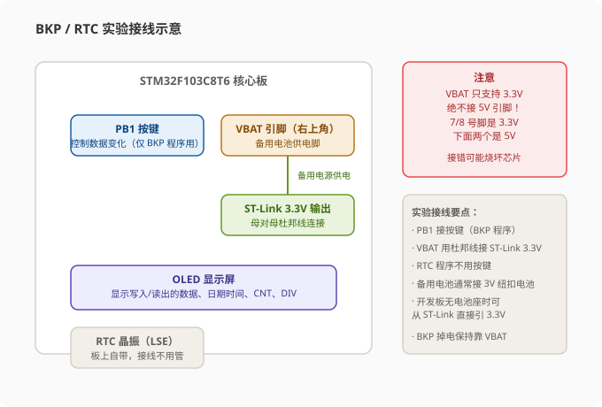
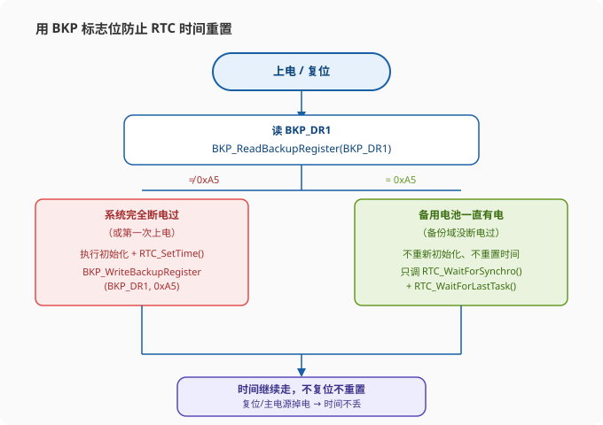
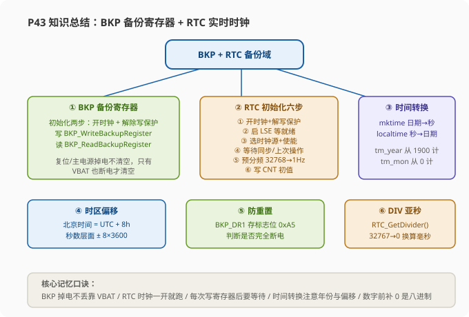

# STM32 [12-3] 读写备份寄存器 & 实时时钟 — 学习笔记

> **视频来源**: [B站 江协科技 STM32入门教程-2023版 p43 [12-3]](https://www.bilibili.com/video/BV1th411z7sn?p=43)
> **芯片型号**: STM32F103C8T6
> **前置知识**: BKP 备份寄存器 & RTC 实时时钟原理简介（p42）、OLED 显示屏驱动、按键（GPIO 输入）
> **本节定位**: 实验课——动手写代码实现 BKP 备份寄存器的读写（验证"掉电数据不丢失"），并驱动 RTC 实时时钟实现一个可走秒、可设置、掉电不重置的实时时钟

---

## 一、课程概览

上节课我们介绍了 BKP 备份寄存器和 RTC 实时时钟的原理，这节课就进入实战——把这两个外设的代码写出来。

课程分成两大块：

1. **读写 BKP 备份寄存器实验**：程序非常小，不需要封装模块，直接在 main 函数里演示。核心逻辑就是"先初始化 → 写数据到备份寄存器 → 再读出来 → 看看写进去和读出来是不是一样"，并在此基础上验证 BKP 最重要的特性——**主电源掉电后数据仍然由备用电池维持**。
2. **RTC 实时时钟实验**：给 RTC 外设新建一个模块（RTC.c / RTC.h）做封装，实现初始化、设置时间、读取时间三大功能，最终做一个"复位和断电都不重置时间"的实时时钟，再用 OLED 把日期、时间、秒计数器、DIV 亚秒值显示出来。

> **提示**: BKP 和 RTC 在芯片内部是"住在一起"的——它们共享同一个备份域，由 VBAT 备用电池供电。所以两个外设的初始化开头部分完全一样：都要开启 PWR 和 BKP 时钟，都要使能"对 BKP 和 RTC 的访问"。这部分代码先学会，后面两处都用得到。

---

## 二、硬件接线

### 2.1 两个程序的接线

先看读写 BKP 程序的接线图：右下角是 OLED 显示屏，**PB1 引脚接一个按键**，用于控制数据的变化（这些都是老朋友了）。重点在板子的右上角——**这个 VBAT 引脚（也叫微背引脚）就是备用电池的供电脚**。

在实际使用中，如果需要备用电池，这个引脚一般接一个 3V 的纽扣电池，接法在 P43 参考资料里给出了两种参考电路，按着那个接就行。

而我们做实验的话，可以直接从 ST-Link 引出一个 **3.3V 的供电**，接到这个 VBAT 引脚上，这样也可以——毕竟开发板上并没有预留电池座。

> **注意**: 供电一定要从 3.3V 引脚引出来！看板子引脚图，7 号和 8 号引脚都是 3.3V 供电，**千万不要接到下面那两个 5V 的引脚**——VBAT 是不支持 5V 供电的，接错烧坏芯片是很有可能的。

接着看 RTC 程序的接线，其实和 BKP 程序**一模一样**：VBAT 接 3.3V 备用电源就行。当然 RTC 这个程序暂时用不到按键。至于 RTC 的外部低速晶振（LSE），经过 RTC 晶振电路，**板上自带就有**，所以 RTC 晶振这部分接线就不用管了。

### 2.2 面包板实操

接线的具体操作：

1. 在 PB1 引脚接一个按键；
2. 找出一根供电母对母的杜邦线，一头接在板子右上角的 VBAT 引脚，另一头接在 **ST-Link 的 3.3V 电源输出口**。

> **注意**: 这根杜邦线一定不要接到 5V 的供电引脚上——接错的话 VBAT 电压过高，会对备份域电路甚至整个芯片造成损坏。

这样引脚接线就完成了。



---

## 三、BKP 备份寄存器读写实验

### 3.1 实验规划

回到工程，复制一份 OLED 显示的代码工程，改个名字叫 **12-1 读写备份寄存器**，打开工程编译一下。

既然来了，就规划一下这个程序应该怎么写。目前想要实现的，就是简单的读写 BKP 的工程，所以大体步骤就是：

1. **初始化 BKP**；
2. **写数据**到某个备份寄存器 DR；
3. **读数据**，看看写进去的和读出来的，是不是一样。

这样就行了。那有关 BKP 的代码其实非常少的，所以这里暂时不再对 BKP 进行模块封装了，直接在主函数里演示一下它的功能就行。

### 3.2 BKP 初始化——只需要两句

BKP 的初始化非常简单。看 P42 最后这里的注意事项，BKP 的初始化步骤就是这两句：

1. **开启 PWR 和 BKP 的时钟**；
2. **使用 PWR 的一个函数，使能对 BKP 和 RTC 的访问**。

然后写入数据的话，BKP 有个写入的函数；读数据，BKP 也有个读出的函数。这就是大体思路。

### 3.3 BKP 固件库函数一览

打开 `BKP.h` 文件，把它拉到最后看一下——这就是 BKP 所有的固件库函数，我们一个一个看。

**第一个：`BKP_DeInit`（恢复缺省配置）**，用来清空 BKP 所有的数据备份寄存器。你看，如果有备用电池的话，BKP 的数据**主电源掉电不清空、复位也不清空**，它就没有被清空的时候。那如果我们确实想要清空，该怎么办呢？调用一下这个函数，所有 BKP 的数据都会变为 0（手动一个个写入 0 也可以）。

**接着四个是配置类函数**：

| 函数 | 作用 |
|:---|:---|
| `BKP_TamperPinLevelConfig` | 配置侵入检测引脚的触发电平（高电平触发还是低电平触发） |
| `BKP_TamperPinCmd` | 是否开启侵入检测功能（需要侵入检测时，要先配置引脚电平，再使能侵入检测） |
| `BKP_ITConfig` | 中断配置，是否开启中断 |
| `BKP_RTCOutputConfig` | 实时钟输出功能配置，可以选择在 RTC 引脚上输出时钟信号（RTC 校准时钟、闹钟脉冲或秒脉冲） |
| `BKP_SetRTCCalibrationValue` | 写入 RTC 校准值，这个其实就是写入 RTC 校准寄存器 |

以上这些函数，就是我们上小节说的"BKP 附带的一些小功能"，了解即可，这节我们都不用。

**下面两个就是读写 BKP 的核心函数**：

- `BKP_WriteBackupRegister`：**写备份寄存器**。第一个参数指定你要写在哪个 DR（DR1~DR42），第二个参数就是要写入的数据，这是一个 16 位的整型数据。
- `BKP_ReadBackupRegister`：**读备份寄存器**。参数指定要读哪个 DR，返回值就是 DR 存的值。

这两个函数非常直观，好理解吧。

**最后四个函数**：中断标志位和清除标志位的函数，老朋友了，这个不用解释。

那这些就是 BKP 的所有库函数，我们就清楚了。之后还要再看一个函数——打开 `PWR.h` 看下去，这是 PWR 外设的库函数，PWR 外设的库函数**下节课再讲**，现在主要关注一个函数：

**`PWR_BackupAccessCmd`（备份寄存器访问使能）**。看一下定义，这个函数的内容就是设置 `PWR_CR` 寄存器里的 DBP 位（即**禁用备份域写保护**），使能对 BKP 和 RTC 的访问。所以这一步，就要调用 PWR 的这个函数。

### 3.4 代码实现：BKP 初始化与读写

函数看完，就可以开始写代码了。

```c
/**
 * @brief  BKP 初始化
 */
void BKP_Init(void)
{
    /* 第一步：开启 PWR 和 BKP 的时钟（都是 APB1 总线上的外设） */
    RCC_APB1PeriphClockCmd(RCC_APB1Periph_PWR | RCC_APB1Periph_BKP, ENABLE);

    /* 第二步：使能对 BKP 和 RTC 的访问（清除备份域的写保护） */
    PWR_BackupAccessCmd(ENABLE);
}
```

> **原理**: 为什么要开启 PWR 时钟？因为 PWR（电源控制）外设本身也在 APB1 总线上，不用它之前当然要先开它的时钟；为什么要用 `PWR_BackupAccessCmd`？因为备份域里的寄存器（BKP 数据寄存器、RTC 的寄存器）默认是**写保护**的——防止程序跑飞时意外修改掉宝贵的备份数据。只有通过 PWR 清掉 DBP 写保护位，才能对 BKP 和 RTC 进行写操作。这也是为什么 BKP 和 RTC 的初始化第一步总是相同的。

第二步使能访问这一步，"初始化就完成了"，这不难。接下来只需调用写函数写数据、读函数读数据，就完成了。

比如我们调用写函数放到这里：

```c
/* 写数据到 BKP_DR1 */
BKP_WriteBackupRegister(BKP_DR1, 0x1234);
```

第二个参数 `BKP_DRx`，其中 x 可以是 1 到 42 其中的一个数字。注意：**只有大容量和互联型才有 42 个 DR**，我们目前这个中容量的芯片（C8T6），DR 的范围是 **1 到 10**，注意不要写超了。比如给个 `BKP_DR1`，直接用第一个 DR，之后就是要写入的数据，要求 16 位的整型数据，随便给一个 `0x1234`，这样就是 BKP 的写操作。

那写进去对不对呢，读出来看看就知道了：

```c
/* 从 BKP_DR1 读出数据 */
uint16_t data = BKP_ReadBackupRegister(BKP_DR1);
```

读刚才写入数据的 DR1，读出的值都会返回出来，存到变量里，再到 OLED 上显示一下：

```c
OLED_ShowHexNum(1, 1, data, 4);      // 1行1列，显示读出的数据，长度4
```

这样简单的测试程序就完整了。

### 3.5 第一个测试：验证 BKP 的掉电保持特性

下载运行，看 OLED 显示的是 `1234`，这说明我们初步的测试是没问题的。

那该数据能不能在**主电源掉电的情况下由备用电池维持**呢？我们继续测试：

1. **把写入的代码注释掉，直接读**：不再往 BKP 写数据，直接读。目前直接读 BKP 数据还是 `1234`，因为芯片目前没有掉过电，BKP 的数据保持原样。
2. **按复位键**：数据依然是 `1234`——**说明复位是不会清空 BKP 的**。
3. **主电源断电再重新上电**：数据依然是 `1234`——**该数据就是由备用电源维持的**。
4. **拔掉备用电源，主电源断电再重新上电**：BKP 的数据就清零了——**说明没有备用电源的话，主电源断电后 BKP 的数据维持不了**。

> **注意**: 最后一个测试正是很多新手掉坑的地方：BKP 的"掉电不丢失"是有前提的——必须要有 VBAT 备用电池（或 3.3V 备用电源）持续给备份域供电。只靠主电源，断电后备份域一样断电，数据照样丢。真实产品中用 BKP 存关键参数时，别忘了设计电池回路。

### 3.6 完善程序：按键改变数据 + 实时刷新显示

接下来完善一下程序，让它跟我们最开始演示的一样：

```c
#include "stm32f10x.h"
#include "OLED.h"
#include "Key.h"

uint16_t WriteData[2] = {0x1234, 0x5678};    // 写入数组（初始值随便给）
uint16_t ReadData[2]  = {0, 0};              // 读出数组

int main(void)
{
    OLED_Init();                             // OLED 初始化
    Key_Init();                              // 按键初始化
    BKP_Init();                              // BKP 初始化

    /* 先在第一行显示当前写入的数据 */
    OLED_ShowString(1, 1, "W:");             // 显示标签
    OLED_ShowHexNum(1, 3, WriteData[0], 4);  // 显示 WriteData[0]
    OLED_ShowHexNum(1, 8, WriteData[1], 4);  // 显示 WriteData[1]

    while (1)
    {
        uint16_t key = Key_GetNum();         // 获取按键键码

        if (key == 1)                        // 按键 1 按下
        {
            WriteData[0]++;                  // 两个数据各自增一次，产生新数据
            WriteData[1]++;

            /* 把新数据同时写入 BKP_DR1 和 BKP_DR2 */
            BKP_WriteBackupRegister(BKP_DR1, WriteData[0]);
            BKP_WriteBackupRegister(BKP_DR2, WriteData[1]);

            /* 刷新显示写入的数据 */
            OLED_ShowHexNum(1, 3, WriteData[0], 4);
            OLED_ShowHexNum(1, 8, WriteData[1], 4);
        }

        /* 无按键时也不断读 BKP 的 DR，刷新到 OLED 显示 */
        ReadData[0] = BKP_ReadBackupRegister(BKP_DR1);
        ReadData[1] = BKP_ReadBackupRegister(BKP_DR2);
        OLED_ShowHexNum(2, 1, ReadData[0], 4);   // 第二行显示读出的数据
        OLED_ShowHexNum(2, 6, ReadData[1], 4);
    }
}
```

> **关键**: 同时写入 DR1 和 DR2 两个备份寄存器，是为了说明**读写多个 DR 也没有问题**——BKP 的每个 DR 都是独立的 16 位存储单元，可以各自存不同的数据。主循环里无论有没有按键，都会不断读 DR 并刷新显示，这样数据一变化（无论是程序写入还是掉电丢失）都能第一时间从屏幕上看到。

**测试现象**：

- 上电后 OLED 第一行显示当前写入数据，第二行暂时什么都没显示（因为还没写入，读出的都是 0）。
- 按下按键，数据变化：写入数据变成了 `1235 5679`。注意——**因为第一次写入之前，按键就已经让它自增了一次**，所以第一次写入是在 `1234 5678` 的基础上自增得到的 `1235 5679`，而不是初始的 `1234 5678`。如果想第一次就是 `1245 5678`，那可以先预写一次。
- 读出的数据（第二行）和写入的数据（第一行）一样，说明读写正常。
- 继续按按键变化数据，写入和读出的都是一样的。
- 之后主电源掉电、再重新上电：**目前上电后还没写入，读出的值却仍然是掉电前最后一次写入的数据**——这正是 BKP 备份寄存器配合备用电池带来的"掉电不丢失"效果。

> **提示**: 这个测试现象里有个很自然的结论——BKP 就像一块"断电也保留的小黑板"：写上去的东西，主电源断了也还在；只有把黑板（备用电池）也拿走，内容才消失。理解了这一点，后面用它来判断"是否完全断电"就顺理成章了。

好，那有关 BKP 的实验我们就讲这么多，大家知道 BKP 的特性、会读写 BKP 就可以了。接下来我们学习下一个代码——**RTC 实时时钟**。

---

## 四、RTC 实时时钟实验

### 4.1 新建模块与初始化流程

回到工程目录，复制 OLED 的代码改一下名字 **12-2 实时时钟**，打开工程编译一下。对于 RTC 的代码，就新建一个模块给它封装一下。

这里快速建立一个模块：在 `HARDWARE` 文件夹右键新建，模块名叫 `RTC`，放在 HARDWARE 文件夹下（后面的步骤快进一下）。模块建好之后，新建一个初始化函数 `RTC_Init` 在里面，来对 RTC 外设进行初始化。

老规矩，先来梳理一下步骤。初始化流程参考 P42 的基本结构图：

1. **第一步（和 BKP 一样）**：在使用 RTC 外设之前，同样执行注意实现的第一点——**开启 PWR 和 BKP 的时钟，使能 BKP 和 RTC 的访问**。这个代码和 BKP 初始化那里是一样的。
2. **第二步：启动 RTC 的时钟**。这里计划使用 **LSE（外部低速晶振）** 作为 RTC 时钟源，所以要用 RCC 模块里的函数开启 LSE 的时钟。这个 LSE 时钟为了省电，默认是关闭的，所以 LSE 需要我们手动开启，软件上解决不了（必须硬件起振）。
3. **第三步：配置 RTCCLK 数据选择器**，指定 LSE 为 RTCCLK。这步的函数也是在 RCC 模块里的。
4. **第四步：先别急着往后看**，注意实现这里的操作——调用两个等待的函数：一个是**等待同步**（`RTC_WaitForSynchro`），另一个是**等待上一次操作完成**（`RTC_WaitForLastTask`）。照例调用一下就可以。
5. **第五步：配置预分频器**，给 PRL 重装载寄存器一个合适的分频值，以确保输出给系统的频率是 1Hz。
6. **第六步：配置 CNT 的值**，给 RTC 一个初始时间。
7. **再之后**：如果需要闹钟，可以配置闹钟值；需要中断，可以配置中断的部分。

> **原理**: 为什么 RTC 不需要"使能函数"？因为这个 RTC 比较简单，固件库并没有使用结构体来配置，而且 RTC 也没有 `RTC_Cmd` 这样的使能函数——只要时钟（RTCCLK）一开启，RTC 就自动开始运行了，不需要最后再"启动"一下。这和之前学的外设（如 USART 要 `USART_Cmd` 使能）不太一样，注意这个区别。

### 4.2 RTC 时钟配置库函数

流程梳理完了，就来看一下函数。展开 Library 文件夹，先看 `RCC.h` 里几个 RTC 时钟配置的函数，这几个函数就是和 RTC 时钟相关的：

| 函数 | 作用 |
|:---|:---|
| `RCC_LSEConfig` | 配置并启动 LSE 外部低速时钟（需要硬件晶振起振） |
| `RCC_LSICmd` | 配置 LSI 内部低速时钟（如果外部时钟不起振，也可以使用内部时钟来实验） |
| `RCC_RTCCLKConfig` | 选择 RTC 的时钟源（RTCCLK），用于配置 PWR（电源）里的数据选择器 |
| `RCC_RTCCLKCmd` | 使能 RTC 时钟 |

另外我们本期还需要用到最后的这个 **`RCC_GetFlagStatus`** 函数——因为这个 RTC 时钟不是软件上启动它就"立即"启动的，调用启动时钟的函数之后，还需要**等待一下标志位**。RCC 有个标志位（`RCC_FLAG_LSERDY`）变为 1 之后，这个时钟才算启动完成、工作稳定。这个也要注意一下。

那有关 RCC 时钟部分的函数就了解这么多。接下来继续看 RTC 固件库（`RTC.h`），拉到最后看下函数：

| 函数 | 作用 |
|:---|:---|
| `RTC_ITConfig` | 配置中断 |
| `RTC_EnterConfigMode` | 进入配置模式——必须设置 RTC 的 CNF 位（进入配置模式），之后才能读写配置寄存器 |
| `RTC_ExitConfigMode` | 退出配置模式——把 CNF 位清掉 |
| `RTC_GetCounter` | 获取 CNT 计数器的值——读实时时间就看这个 |
| `RTC_SetCounter` | 写入 CNT 计数器的值——设置时间就看这个 |
| `RTC_SetPrescaler` | 配置预分频器，这个值会写入预分频器的 PRL 重装载寄存器，用来配置分频系数 |
| `RTC_SetAlarm` | 写入闹钟值，需要配置闹钟的话用这个函数 |
| `RTC_GetDivider` | 获取预分频器中的 DIV（余数）值，一般是为了得到更细分的时间——因为 CNT 计数器间隔最短就是 1 秒，要更细的时间（分秒、毫秒、亚秒），就得靠这个 DIV 来获取 |
| `RTC_WaitForLastTask` | 等待上次操作完成。转到底看实现：要么循环直到 RTOFF 状态位为 1（等待前置写操作结束），要么是清 RTOFF 标志位再循环直到 RTOFF 为 1 |
| `RTC_WaitForSynchro` | 等待同步（对应 P42 注意事项的这一条） |

> **注意**: 这里有个容易搞混的点——P42 注意事项里写"必须设置 CNF 为 1（进入配置模式）之后才能写 PRL 等寄存器"，但这件事**固件库已经帮我们处理了**：`RTC_SetPrescaler`、`RTC_SetCounter`、`RTC_SetAlarm` 等函数内部会自动进入和退出配置模式，不需要手动调用 `RTC_EnterConfigMode` / `RTC_ExitConfigMode`。（后面写代码时会再次印证）

后面还有几个就是和标志位相关的函数了。好，到这里相关的函数就看完了，接下来正式开始写程序。

### 4.3 RTC 初始化代码

回到 `RTC.c` 初始化函数里，按照刚才讲的步骤来初始化外设。
```c
/**
 * @brief  RTC 初始化（使用 LSE 外部低速晶振 32.768kHz）
 */
void RTC_Init(void)
{
    /* 第一步：开启 PWR 和 BKP 时钟，使能 BKP 和 RTC 的访问（和 BKP 初始化一样） */
    RCC_APB1PeriphClockCmd(RCC_APB1Periph_PWR | RCC_APB1Periph_BKP, ENABLE);
    PWR_BackupAccessCmd(ENABLE);

    /* 第二步：开启 LSE 时钟，并等待 LSE 启动完成 */
    RCC_LSEConfig(RCC_LSE_ON);                // 开启 LSE 外部低速晶振
    while (RCC_GetFlagStatus(RCC_FLAG_LSERDY) == RESET);   // 等待 LSE 就绪

    /* 第三步：选择 LSE 作为 RTC 时钟源，并使能 RTC 时钟 */
    RCC_RTCCLKConfig(RCC_RTCCLKSource_LSE);   // 指定 LSE 为 RTCCLK
    RCC_RTCCLKCmd(ENABLE);                    // 使能 RTC 时钟

    /* 第四步：等待同步 + 等待上次操作完成（安全保障措施） */
    RTC_WaitForSynchro();
    RTC_WaitForLastTask();

    /* 第五步：配置预分频器，得到 1Hz 的计数频率 */
    RTC_SetPrescaler(32768 - 1);              // 32768Hz 分频 → 1Hz
    RTC_WaitForLastTask();                    // 写操作后等待完成

    /* 第六步：设置初始时间（秒计数器值） */
    RTC_SetCounter(1672531200);               // 2023-01-01 00:00:00 对应的秒数
    RTC_WaitForLastTask();
}
```

逐段讲解：

**第二步详解**——`RCC_LSEConfig` 的参数有三个：

- `RCC_LSE_OFF`：表示 LSE 振荡器关闭；
- `RCC_LSE_ON`：表示 LSE 振荡器打开；
- `RCC_LSE_Bypass`：表示 LSE 时钟旁路。时钟旁路的意思就是**不接晶振**，直接从 LSE 引脚外部输入一个指定频率的信号，这样也可以当作时钟源，不过用的不多。直接接晶振比较方便，所以外部 LSE 晶振我们就用第二个参数 `RCC_LSE_ON`。

开启 LSE 之后，需要等待 LSE 启动完成。这时调用 `RCC_GetFlagStatus` 获取标志位，转到底看一下参数定义——这个 `RCC_FLAG_LSERDY` 表示 LSE 振荡器时钟准备好了，所以要用这个参数。当然这只是获取一次标志位的状态，要实现"等待标志位为 1"的功能，需要套一个 while 循环：循环里获取标志位，如果标志位不等于 SET（或者说等于 RESET），就继续循环等待。这样时钟就绪后才会继续往下走。至于是不是要加超时等待，就看你的个人考虑了。

**第三步详解**——`RCC_RTCCLKConfig` 的参数有三个：`RCC_RTCCLKSource_LSE`、`RCC_RTCCLKSource_LSI` 和 `RCC_RTCCLKSource_HSE_Div128`，这个跟 P42 这里的三个时钟源是对应的。目前只用 LSE，所以选择 `RCC_RTCCLKSource_LSE`，选择时钟源这个函数就完成了。当然选择 LSE 之后，还要调用一下 `RCC_RTCCLKCmd` 使能 RTC 时钟，参数给 ENABLE，这样 RTC 时钟部分就配置完成了。

**第四步详解**——接着根据初始化的步骤，要调用两个等待的函数：一个是**等待同步**（`RTC_WaitForSynchro`），一个是**等待上次写入操作完成**（`RTC_WaitForLastTask`）。这两个函数刚才都看过，转到底看一下：里面自带的有一个 while 循环实现等待功能，上面这个函数里面也是 while 等待，所以直接调用函数，就可以实现等待的效果。

> **提示**: 这两行代码是一个安全保障措施，防止因为时钟不同步。"等待同步"就在程序刚开始的时候调用一下；"等待上次写入操作完成"——当然在这之前其实也没有写入过 RTC 寄存器，所以正常情况下是不用等的。这两行你要是不写，一般也没啥大问题；写了之后对程序也没有任何影响，所以习惯性加一下，防止意外。

**第五步详解**——之后就可以配置预分频器了。调用 `RTC_SetPrescaler`，参数是分频值。目前预分频器的输入时钟是 LSE，LSE 的频率是 32768Hz（32.768kHz），显然进行 **32768 分频**就是 1Hz 了，所以分频系数要给 `32768 - 1 = 32767`（减一因为计数从 0 开始，16 位就只包含 0~65535）。

因为这个函数是对 PRL 进行的写操作，根据 P42 的注意事项，写操作之后这个值并不是立刻生效的，我们最好等待一下写操作完成。所以在这写完之后，再调用一下 `RTC_WaitForLastTask`。这个等待的函数，可以在每次写入操作之后调用，也可以在写入之前调用，或者前后都调用，这样更保险。总之就是**用这个等待函数把写入操作隔开**就行了。

> **注意**: 再强调一次"进入配置模式"的问题——P42 注意事项里有一条：必须设置 CNF 为 1（进入配置模式）之后才能写入 PRL 等寄存器。那么这个写入预分频器要不要进入配置模式呢？当然要，但是不用我们写。转到底看下 `RTC_SetPrescaler` 的实现：这两行就是把参数写入 PRL 寄存器，在此之前库函数自己就调用了进入配置模式的等待，之后也自带了退出配置模式的等待。`RTC_SetCounter`、`RTC_SetAlarm` 也都自带这些，所以**进入和退出配置模式，不用我们再额外手动调用**。

**第六步详解**——配置预分频器这一步就完成了。接下来初始化的时候给它设置一个初始时间。设置时间要调用哪个函数呢？显然是这个 `RTC_SetCounter`。这里要给它一个 32 位的秒计数器值，就使用视频里的这个例子——**2023年1月1日 00:00:00 对应的秒数 `1672531200`**。当然这一步不是必须的，你要是不预设时间，板子上电后（虚拟的某点）解析出来就是 1970 年（Unix 时间戳的起点）。设置结束后，同样得调用一下等待的函数。

好，到这里 RTC 初始化的步骤就完成了。初始化到这里后，RTC 的秒计数器就会从这个秒数开始，以 1 秒的时间间隔不断递增，读 RTC 就能得到时间了。

### 4.4 第一个测试：RTC 计数

那写到这里就可以进行初步测试了。把这个初始化函数放到头文件里声明一下，编译一下看下没有问题。之后到主函数里进行测试，测试的目的就看下 RTC 有没有按照预设的效果进行计时。

先引用一下头文件，把 RTC 的初始化调用放到主函数里，接着就可以在 while 主循环里不断读取 RTC 的计数值了。读取 RTC 用 `RTC_GetCounter`，参数不需要，返回值就是 RTC 的计数值。直接弄个 OLED 显示一下：

```c
int main(void)
{
    OLED_Init();          // OLED 初始化
    RTC_Init();           // RTC 初始化

    while (1)
    {
        /* 读取秒计数器并显示 */
        OLED_ShowNum(1, 1, RTC_GetCounter(), 10);   // 1行1列显示秒数，数比较大
    }
}
```

编译下载看一下现象——目前可以看出，这里确实显示一个数字，并且从我们预设的数值开始**不断递增，递增的间隔是 1 秒**。这次我们用程序成功测试了 RTC 的计时功能。

### 4.5 常见问题：LSE 晶振起振不了怎么办

当然我实际使用了之后发现，**有些板子的这个现象确实是有问题，就是 RTC 晶振起振不了**。如果 RTC 晶振不起振，这个程序就会卡死在这个位置（`while (RCC_GetFlagStatus(RCC_FLAG_LSERDY) == RESET);`），一直等待 LSE 就绪标志位，实验现象就是 **OLED 什么也不显示**——程序在初始化的时候就卡死了。

那如果 RTC 晶振确实起振不了，为了观察到实验现象，我们可以备选**内部低速时钟 LSI**。程序修改方法就是：

1. `RCC_LSEConfig(RCC_LSE_ON)` 改成 `RCC_LSICmd(ENABLE)`，参数给 ENABLE，启动 LSI；
2. 下面等待标志位改成 `RCC_FLAG_LSIRDY`；
3. 配置时钟源改成 `RCC_RTCCLKSource_LSI`；
4. 因为 LSI 是 40000Hz（约 40kHz），所以预分频系数改成 `40000 - 1`。

这样 RTC 时钟源就由 LSE 切换到了 LSI，下载看也是能正常运行的，只不过时钟源变成了 LSI。

> **提示**: 如果你确实是外部时钟启动不了的话，可以这样改代码观察现象。至于如何让外部晶振启动，这个可能得从硬件上研究——这个套件不方便动板子，大家有兴趣可以自行研究。

讲完 RTC 初始化配置，我们把代码还原成 LSE 的版本。当然这个代码在**每次复位时都会重置时间**（因为初始化里又设置了初始时间），这个问题我们最后再来解决，现在先继续写后续的部分。

---

## 五、设置时间与读取时间

接下来要写的就是两个函数：一个是**设置时间**（`RTC_SetTime`），一个是**读取时间**（`RTC_GetTime`）。这里采用我计划这样写：

- **读取时间**：把读到的秒数转换为年月日时分秒，放到一个数组里；
- **设置时间**：把数组的年月日时分秒转换为秒数，写入到 CNT。

这样做的程序会变得容易理解。如果水平玩得比较溜，也可以定义结构体来组织时间，再用结构体指针传参，这都是可以的。

### 5.1 定义时间数组

那这里在上面我先定义一个数组，类型给 `uint16_t`（16 位），数组名叫 `MyRTC_Time`，里面分别存放年月日时分秒：`2023年1月1日 15时59分55秒`：

```c
uint16_t MyRTC_Time[] = {2023, 1, 1, 15, 59, 55};   // 年月日时分秒
```

因为这个年份 2023 超过了 `uint8_t`（一个字节）数据的范围，所以直接整个数组定义成 16 位的，稍微浪费一点空间。

之后我们写两个函数：设置时间函数，把这个数组的时间刷新到 RTC 外设里；读取时间函数，把 RTC 外设的时间刷新到这个数组里。

### 5.2 C 语言的坑：数字前的 0

另外，在这里额外提一个注意实现——时间值如果是各位数（如 9 分），最好不要在前面补 0，比如写成 `09`，这样行不行啊？数学上没问题，但在 C 语言中一定要记住：**在数字前面加 0 是有问题的**。

因为 C 语言有个坑：**以 0 开头的数字是八进制**。当然八进制和十进制的 0~7 是一样的，但如果你写的时间是"23年9分"，觉得不好看，要写成"23年09分"，这就有问题了——会报个错误，因为八进制中数字 9 是无效的。

> **注意**: 所以在 C 语言程序里，数字前面千万不要随便补 0。虽然数学上前面补 0 没问题，但在 C 语言中，前面补 0 的数字是八进制。再举个例子：如果在程序里写个判断 `if (123 == 0123)`，这个判断会不会成立呢？理解了我刚才说的，应该知道这个判断是不成立的（0123 八进制 = 83 十进制）。之前某品牌计算器有个密码锁的 bug，很多人留言说"设置密码不能以 0 开头，一旦以 0 开头，程序就不能判断正确密码了"，就是同一个原因。

### 5.3 使用 time.h 库函数

好，回到这个程序继续来写。首先来一个函数 `RTC_SetTime`，在这里面把数组的时间转换为秒数，写入到 CNT 中，所以这需要用到 time 库的函数了。先包含头文件 `#include <time.h>`，这是标准 C 库，一般用尖括号（`<time.h>`），用引号也完全没问题。

那包含之后，先右键打开 `time.h` 这个文件看看，这个文件和我们之前（VS 编译器）里的有些区别。看下：

- 首先 `time_t` 的类型定义——在 Settings 里就是**32 位整型**；
- 之后是 `struct tm` 结构体的成员：秒 `tm_sec` 范围 0 到 60，第二个是 `tm_min` 0 到 60，还有 `tm_hour`、`tm_mday`、`tm_mon`、`tm_year` 等；
- 然后这些函数的用法也有些变化。其中 `mktime` 函数本来是用来获取系统时钟的，但在 STM32 里没有系统时钟——或者说 RTC 本身就是"时钟"，所以在 RTC 的程序里，mktime 的"自动获取时间"能力用不了（只用它的数学转换功能）；
- 还有一个问题是：STM32 也不知道当前处于哪个时区，所以 `gmtime` 和 `localtime` 就没有区分了。目前程序的做法是**用 `gmtime` 代替 `localtime`** 来实现日期时间转换，并且两者始终都是伦敦时间（UTC 格林威治时间）。要换时区的话，自己再加偏移就行，也不麻烦。

> **原理**: `struct tm` 里的 `tm_year` 是从 1900 年开始计算的。也就是说结构体里存的年份 = 实际年份 - 1900。比如 2023 年存进去就是 123。所以在填充结构体时要做偏移：`tm_year = 2023 - 1900`；反过来读出时再加回来：`实际年份 = tm_year + 1900`。同理 `tm_mon` 是从 0 开始（0 = 1 月），也要做类似的 ±1 偏移。这是使用标准 C 时间库最容易漏掉的细节。

### 5.4 RTC_SetTime：设置时间

看完这个模块就可以上手了。先定义两个变量：一个是 `time_t` 变量 `time_cnt`（秒计数器）；另一个是用于转换的 `struct tm` 变量 `time_date`。

之后把数组的时间填充到 `time_date` 结构体里：

```c
void RTC_SetTime(void)
{
    time_t time_cnt;                    // 秒计数器（32位）
    struct tm time_date;                // 日期时间结构体

    /* 把数组的时间填充到结构体（注意偏移） */
    time_date.tm_year = MyRTC_Time[0] - 1900;   // 年份偏移（tm_year 从 1900 开始计）
    time_date.tm_mon  = MyRTC_Time[1] - 1;      // 月份偏移（tm_mon 从 0 开始计）
    time_date.tm_mday = MyRTC_Time[2];          // 日
    time_date.tm_hour = MyRTC_Time[3];          // 时
    time_date.tm_min  = MyRTC_Time[4];          // 分
    time_date.tm_sec  = MyRTC_Time[5];          // 秒

    /* 第二步：调用 mktime 把日期时间转换为秒数 */
    time_cnt = mktime(&time_date);              // 参数是结构体指针，返回秒数

    /* 第三步：调用 RTC_SetCounter 把秒数写入 CNT */
    RTC_SetCounter(time_cnt);           // 写入秒计数器
    RTC_WaitForLastTask();              // 写入寄存器后等待操作完成
}
```

这个函数的全部流程主要就是三步：

1. **第一步**：把数组指定的时间，填充到 `struct tm` 结构体里；
2. **第二步**：使用 `mktime` 函数得到秒数；
3. **第三步**：将秒数写入到 RTC 的 CNT 中。

这就是设置时间。

### 5.5 RTC_GetTime：读取时间


接下来写读取时间的函数 `RTC_GetTime`。同样先定义秒计数器和日期时间变量，流程和上面是**反过来**的：

```c
void RTC_GetTime(void)
{
    time_t time_cnt;                    // 秒计数器（32位）
    struct tm time_date;                // 日期时间结构体

    /* 第一步：读取 RTC 的秒数 */
    time_cnt = RTC_GetCounter();        // 获取当前秒数

    /* 第二步：使用 localtime 把秒数转换为日期时间 */
    time_date = *localtime(&time_cnt);  // 参数是秒数地址，返回结构体指针，取内容

    /* 第三步：把结构体的日期时间转移到数组 */
    MyRTC_Time[0] = time_date.tm_year + 1900;   // 年
    MyRTC_Time[1] = time_date.tm_mon + 1;       // 月
    MyRTC_Time[2] = time_date.tm_mday;          // 日
    MyRTC_Time[3] = time_date.tm_hour;          // 时
    MyRTC_Time[4] = time_date.tm_min;           // 分
    MyRTC_Time[5] = time_date.tm_sec;           // 秒
}```

逐段解释：

1. **第一步**：`RTC_GetCounter` 获取 RTC 当前的秒数，存到 `time_cnt`；
2. **第二步**：使用 `localtime` 函数得到日期时间。注意 `localtime` 的参数是秒数的地址（`time_cnt` 的地址），返回值是"指向结构体的指针"（`struct tm*`），所以我们**先取内容**（解引用 `*`）再赋值给 `time_date`；
3. **第三步**：把 `time_date` 的日期时间转移到数组里。其实不转移到数组也可以——你要是会用结构体，直接使用这个结构体也行。我们转移一下降低使用难度，把赋值左右反过来即可。

这样读取时间转移就完成了。

### 5.6 主函数测试

现在就可以进行测试了。先把这两个函数放到头文件里声明一下，另外这个数组也声明为外部可调用（`extern`）。这个做法其实就是**使用数组变量传参**。单个的变量必须要加 `extern`，数组的话我试了一下不加也行。

好，那主函数就是这个东西：

```c
int main(void)
{
    OLED_Init();                // OLED 初始化
    RTC_Init();                 // RTC 初始化

    /* 先显示一次静态标签 */
    OLED_ShowString(1, 1, "Date:");        // 第一行标签：日期
    OLED_ShowString(2, 1, "Time:");        // 第二行标签：时间
    OLED_ShowString(3, 1, "CNT:");         // 第三行标签：秒计数器

    while (1)
    {
        RTC_GetTime();         // 读取时间，刷新到 MyRTC_Time 数组

        /* 第一行：显示日期 */
        OLED_ShowNum(1, 6, MyRTC_Time[0], 4);    // 年
        OLED_ShowNum(1, 11, MyRTC_Time[1], 2);   // 月
        OLED_ShowNum(1, 14, MyRTC_Time[2], 2);   // 日

        /* 第二行：显示时间 */
        OLED_ShowNum(2, 6, MyRTC_Time[3], 2);    // 时
        OLED_ShowNum(2, 9, MyRTC_Time[4], 2);    // 分
        OLED_ShowNum(2, 12, MyRTC_Time[5], 2);   // 秒

        /* 第三行：显示当前秒数 */
        OLED_ShowNum(3, 6, RTC_GetCounter(), 10);
    }
}
```

> **提示**: 主循环里先调用 `RTC_GetTime`，把 CNT 当前的时间值刷新到 `MyRTC_Time` 数组里，然后直接取数组数据显示就行了。显示用 `OLED_ShowNum`（十进制），年给长度 4，月日时分秒给长度 2，CNT 秒数比较大给长度 10。
编译下载看一下。目前显示的是：第 1 行日期 `2023年1月1日`，第 2 行时间 `16:...`（初始设的 15:59:55，编译下载又过了几秒，所以已经进位到 16 点了），第 3 行计数器从预设值开始走。

### 5.7 测试 RTC_SetTime 功能

注意：目前**还没有调用 `RTC_SetTime`**，所以数组的时间没有被用到（初始化里用的是 `RTC_SetCounter` 直接写秒数）。想测试 `RTC_SetTime` 的功能是否正常，可以把初始化里的 `RTC_SetCounter` 代码注释掉，直接调用 `RTC_SetTime`，这样初始化时就会把数组给定的时间写入 RTC 了。

那这里会遇到一个报错，是因为在这个 C 文件里，`RTC_SetTime` 函数的定义在调用位置的后面。解决方法：把下面这个函数放到调用的前面声明一下，或者在这个文件里包含自己的 `RTC.h` 头文件也行。总之保证每个 C 文件中，**函数调用的前面有对应的函数定义或者声明**。

这样就在初始化的时候用 `RTC_SetTime` 写入数组的时间。如果你在程序中途想设置时间，流程就是：先修改数组（`MyRTC_Time`），再调用 `RTC_SetTime` 就行了。

那看一下现在程序的现象：可以看到，目前显示的就是数组给定的时间 `23:59`（把数组改成 23 点 59 分 55 秒），并且之后时间日期的进位都是没有问题的。

---

## 六、时区偏移：从伦敦时间到北京时间

那现在我们就做出了一个"基于伦敦时间（UTC）的时钟"。如果你不关注秒计数器和日期时间的对应关系的话，直接用这个伦敦时间的时钟记北京时间也是完全没有问题的。但如果你要保证完全符合时间戳的规范，让时间变成一个**真正的北京时间**，那在程序中还要进行时区偏移。

怎么加呢？其实也很简单。比如读取时间的函数里，从 CNT 秒数转换出来的日期时间要变成北京时间，可以给小时直接加 8（东八区）。但这样直接加 8 肯定是不行的——要考虑**进位**的问题：要是 20 点加 8 就变成 28 点了，所以在小时后面直接加 8 比较麻烦。

那就可以考虑：**读取秒数之后，加上 8 个小时的秒数偏移**。8 个小时对应 `8 × 3600 = 28800` 秒。对秒数加 8 小时之后再转换一次，就不用再管进位的问题了（进位由 `mktime`/`localtime` 自动处理），非常方便。同时**写入时间**的时候，要对应减去 8 个小时的秒数。这样就实现了时区的转换，并且秒计数更加严格、符合时间戳的规范。

```c
/* 读取时间时：加 8 小时偏移（东八区），再转换 */
time_cnt = RTC_GetCounter() + 8 * 3600;    // +8小时 = +28800秒
time_date = *localtime(&time_cnt);

/* 设置时间时：先减 8 小时偏移，再写入 */
time_cnt = mktime(&time_date) - 8 * 3600;  // 把北京时间转回伦敦时间再写入
RTC_SetCounter(time_cnt);
```

编译下载看一下：可以看到时间是 `23点59分`，对应到秒数后面是 `...88795...`，这样就和我们 P43 这里写的"北京时间与时间戳的对应关系"是一致的了。这才是一个**真正意义上的北京时间**。

> **注意**: 如果你不加时区偏移，而是通过"真·伦敦时间"来记录北京时间，可以，但是那样秒计数和北京时间就对应不上了——`time_cnt` 永远是 UTC 时间对应的秒数，而屏幕上显示的却是北京时间，两者差 8 小时。做时间戳解析、跨时区换算时就会对不上。所以要么完全用 UTC，要么加偏移用北京时间，别混着来。

好，有关时区偏移的部分我们就清楚了。

---

## 七、用 BKP 防止时间重置

还要完成一个刚才遗留的问题——目前每次复位时间都会重置，这显然是不行的。

那在程序中时间重置的原因，就是每次复位后都调用了初始化函数，在这个初始化函数里，我们自己手动把时间（重新）设定了，所以说这个初始化代码**要有判断地去执行**：

- 当**系统完全断电**（备用电池也断电）时，就执行这个初始化（重新设置时间）；
- 当系统**只是主电源断电**（备用电池没断）时，就不需要执行这个初始化了。

那怎么样才能知道系统是完全断电的，还是只有主电源断电的呢？这就需要用到我们**刚写的 BKP**了。

> **原理**: 可以在 BKP 里随便写个数据当"标志位"。如果上电检查该数据**没被清除**，就表示备用电池是存在的（备份域一直有电），上电时就不用再重新初始化（时间还在走）。如果上电检查该数据**被清除**了，就表示系统完全断电过（备份域也没电了），就需要重新初始化。BKP 的 DR 复位不清空、主电源掉电不清空、只有备份域彻底断电才清空——这三个特性正好拿来做"完全断电"的检测器。

思路清楚了，就可以来写代码了。首先在这里加一个 `if`：

```c
/* 初始化代码（RTC_Init 里的时钟、分频等 + 设置初始时间） */
void RTC_Init(void)
{
    ...
    /* 设置初始时间（只在系统完全断电后执行） */
    if (BKP_ReadBackupRegister(BKP_DR1) != 0xA5)   // 标志位不是 0xA5
    {
        /* 完全断电过 / 第一次上电：需要重新设置时间 */
        RTC_SetTime();                             // 把数组时间写入 RTC
        BKP_WriteBackupRegister(BKP_DR1, 0xA5);    // 写入标志位 0xA5
    }
    else
    {
        /* 备用电池一直有电：不用重新设置时间 */
        RTC_WaitForSynchro();                      // 这两条等待也调用一下，防止意外
        RTC_WaitForLastTask();
    }
}
```

逐段解释：

- 如果 `BKP_ReadBackupRegister(BKP_DR1)` 的值不等于 `0xA5`，就把后面一大块初始化代码（设置时间部分）放到 if 的括号里。那**第一次上电时**或者**系统完全断电之后**，BKP_DR1 读的是 0，if 成立，执行初始化、设置时间；
- 初始化之后，就要写入 BKP_DR1：`BKP_WriteBackupRegister(BKP_DR1, 0xA5)`。这样初始化之后标志位就是 A5 了，下次读到这个数，就说明已经初始化过了，并且**主电源掉电、备用电池没断**，就不用再重复初始化了，避免时间重置；
- 那最后还要加个 else：如果已经初始化过了，不用重新设置时间，但这两条等待的代码（`RTC_WaitForSynchro` 和 `RTC_WaitForLastTask`）最好也调用一下，防止意外。

> **关键**: 这里"随便写入一个数当作标志位"（0xA5 可以换成任意你喜欢的值），核心思路就是**借用 BKP 的特性**——备份寄存器在复位和主电源掉电时内容不变，只有备份域（连 VBAT 一起）彻底断电才会清零。于是 DR 里的值就成了一个天然的"是否完全断电过"的指示灯。这是 BKP 最经典的应用场景之一。

这样这个**防止重复初始化和时间重置的代码**就完整了。

再测试一下：

- 按复位键：可以看到**时间继续运行，不会重置**；
- 断掉主电源：时间仍然继续运行（备用电池维持着备份域，RTC 继续走秒）；
- 当然如果**完全断电**（备用电源也拔掉），BKP_DR1 的数据自动清零，这时再上电，就会重新初始化（重新设置时间）。

这就是目前程序的完整现象。



---

## 八、DIV 预分频器：获取亚秒（毫秒级）时间

最后我们再来演示一下**亚秒**（sub-second）时间吧。

在主函数里，在第四行刷新显示一个 DIV。复制一份 OLED 显示代码，在 4 行 1 列显示 `DIV:`，再在 4 行 6 列显示一个 `RTC_GetDivider()`：

```c
OLED_ShowString(4, 1, "DIV:");                  // 第四行标签
OLED_ShowNum(4, 6, RTC_GetDivider(), 5);        // 显示 DIV 的值
```

编译下载看一下。可以看到，最后一个 DIV 在**快速递减**，递减的范围是 **32767 到 0**；DIV 每递减一轮（从 32767 到 0），秒数加 1。

> **原理**: 为什么 DIV 是 32767 到 0 快速递减？预分频器就是对一个时钟周期内的 32768 个脉冲做计数，计数完成就产生一个 1Hz 的秒信号送给 CNT。所以 DIV（分频器的余数）实际上把**每一秒又细分成了 32768 份**——它就是秒之内的"小数部分"。用它就可以对秒数进行更细的划分。

利用这个数，就可以对秒数进一步细分，比如显示毫秒。

怎么转换呢？比如我们要转换成毫秒：1 秒 = 1000 毫秒，所以我们要把 **32767 到 0** 这个变化范围，映射（线性变换）到 **0 到 999** 这个范围。怎么变呢？看代码：

```c
/* 把 DIV（32767→0）线性变换为毫秒（0→999） */
float ms = (32767 - RTC_GetDivider()) / 32767.0 * 999;
```

步骤拆解：

1. 先计算 `32767 - DIV`：DIV 是 32767 时结果是 0，DIV 是 0 时结果是 32767——这样范围就是 0 到 32767 了（方向反过来，从递减变递增）；
2. 之后对这个值**缩放**：除以 32767，再乘 999——0 到 32767 就映射到了 0 到 999；
3. 为了防止丢失小数，在除数里加个 `.0`（写 `32767.0`），**变为浮点运算**，这样就行了。

下载看一下：可以看到这里最后一个值的变化范围就由原来的 32767 到 0，转换成了 **0 到 999**，表示毫秒。

> **提示**: 这就是获取 DIV 的一个用途——你想得到什么范围，就对这个值做线性变换：想要 0~99 就乘 99，想要 0~9999 就乘 9999，套路都是一样的。最后在演示中老师把这个毫秒显示撤掉了，目前保留显示原生的 DIV。

好，用到这个程序的内容就全部讲完了，本节课程到这里也结束了，我们下节再见。

---

## 九、知识总结



**本节课的核心脉络**：

1. **BKP 备份寄存器**：初始化只需两步（开 PWR+BKP 时钟、`PWR_BackupAccessCmd(ENABLE)` 解除写保护）；读写用 `BKP_WriteBackupRegister` / `BKP_ReadBackupRegister`；数据复位不清空、主电源掉电不清空，**只有 VBAT 备用电源也断电才清空**。DR 数量：中容量（C8T6）1~10，大容量/互联型 1~42。
2. **RTC 初始化六步**：① 开 PWR+BKP 时钟、解除写保护 → ② 启动 LSE 并等 `LSERDY` 就绪 → ③ 选择 LSE 为 RTCCLK 并使能 RTC 时钟 → ④ `RTC_WaitForSynchro` + `RTC_WaitForLastTask` → ⑤ `RTC_SetPrescaler(32768-1)` 得到 1Hz → ⑥ `RTC_SetCounter` 设置初始秒数。
3. **RTC 特点**：没有使能函数（时钟一开就跑）、没有结构体配置；**进入/退出配置模式由库函数内部处理**，我们不用手动调；每次写寄存器后要 `RTC_WaitForLastTask`。
4. **时间转换**：用标准 C 库 `time.h`——`mktime`（日期时间→秒数）、`localtime`/`gmtime`（秒数→日期时间）；`tm_year` 从 1900 开始、`tm_mon` 从 0 开始，务必做偏移。STM32 上 mktime 只能做数学转换，localtime/gmtime 都按伦敦时间处理。
5. **时区偏移**：北京时间 = UTC + 8 小时，在**秒数层面** ±`8*3600`，进位自动处理。
6. **防重置**：用 `BKP_DR1` 存标志位（如 0xA5），上电读它判断是否完全断电过——没断电就不重新初始化，时间继续走。
7. **DIV 亚秒**：`RTC_GetDivider()` 返回 32767→0 的秒内细分值，线性变换可得到毫秒（0~999）。
8. **C 语言坑**：数字前补 0 = 八进制（`0123` ≠ 123，`09` 直接编译报错）。

```
            BKP + RTC 备份域（VBAT 备用电池供电）
   ├── BKP（16位备份寄存器 DR1~DR10）
   │      写: BKP_WriteBackupRegister(DR, 数据)
   │      读: BKP_ReadBackupRegister(DR)
   │      用途: 掉电存参数 / 判"是否完全断电"标志位
   └── RTC（秒计数器 CNT）
          时钟源 LSE 32768Hz → 预分频 32768 → 1Hz → CNT 每秒+1
          秒数↔日期时间: mktime / localtime（注意年份+时区偏移）
          亚秒: RTC_GetDivider() → DIV 32767→0 → 换算毫秒
          初始化六步口诀: 开时钟→解除写保护→启LSE→选时钟源→分频→设初值
```

---

*笔记生成时间: 2026-08-06 | 基于 B站视频 BV1th411z7sn p=43 转录*
