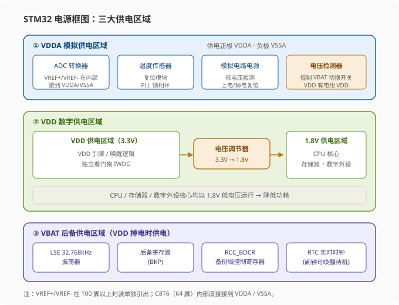
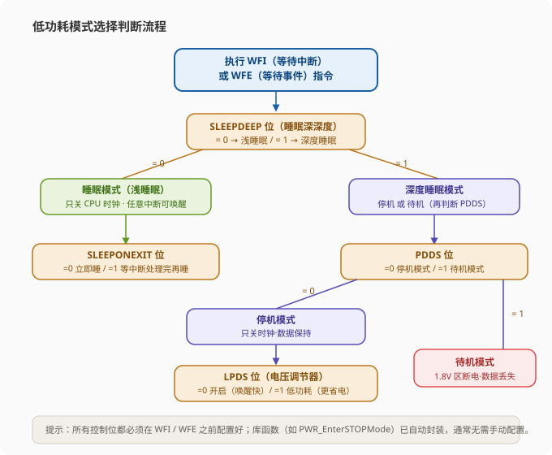
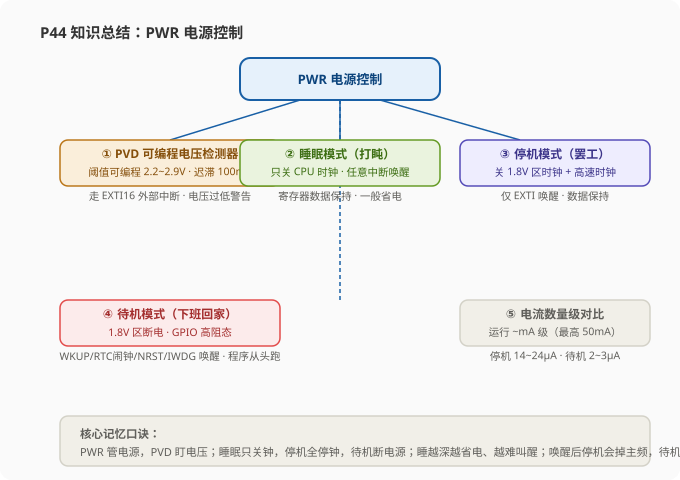

# STM32 [13-1] PWR 电源控制 — 学习笔记

> **视频来源**: [B站 江协科技 STM32入门教程-2023版 p44 [13-1]](https://www.bilibili.com/video/BV1th411z7sn?p=44)
> **芯片型号**: STM32F103C8T6
> **前置知识**: 串口（p13-p16）、外部中断（p9）、RTC 实时时钟（p42-p43）、备份域（p42）
> **本节定位**: 学习 PWR 电源控制外设，重点掌握三种低功耗模式（睡眠、停机、待机）的原理、配置方法、唤醒方式与电路影响，并演示四个配套程序（13-1 至 13-4）

---

## 一、课程概览

这节课我们来学习 STM32 的 **PWR 电源控制**（PWS 是听错了，正确缩写是 PWR）。本节课的重点就是这里涉及的**三种低功耗模式**：**睡眠模式、停机模式和待机模式**。

低功耗模式的目的，简单来说就是**省电**。这对于一些使用电池供电、又需要长时间待机的设备来说十分重要。所以我们本节课的任务就是：学习电源控制部分，看看如何配置这些低功耗模式，让 STM32 在空闲时能够尽可能地节省电量。

本节课总共有**四个程序**：

| 序号 | 程序名 | 说明 |
|:---|:---|:---|
| 13-1 | 修改主频 | 通过降低主频来降低功耗（不属于低功耗模式） |
| 13-2 | 睡眠模式 + 串口发送接收 | 串口收到数据后唤醒 CPU 回发数据，空闲时睡觉 |
| 13-3 | 停止模式 + 对射式红外计数 | 外部中断唤醒，空闲时深度睡眠 |
| 13-4 | 待机模式 + RTC 实时时钟 | RTC 闹钟定时唤醒，其余时间待机 |

因为低功耗模式的代码都不是很多，所以这节课给大家演示的程序比较多。

---

## 二、程序演示（四个示例程序）

### 2.1 程序 13-1：修改主频

**修改主频不属于真正的低功耗模式，但也是降低 STM32 功耗的一种方法**。这个代码非常简单，就是初始化 OLED 后显示一下 `SystemCoreClock` 这个变量，这个变量指示当前主频的频率；之后主循环以 1 秒为周期让某个字符串闪烁显示。

看程序现象：目前可以看到第一行 `SystemCoreClock`（系统主频）显示 36MHz；第二行我们让它以 1 秒为周期显示，但现在实际上是 2 秒的周期——这是因为系统主频正常情况下是 72MHz，现在我们将它降到了 36MHz，所以运行时间就是原来的 2 倍，闪烁变慢了。

那在这个程序的哪个部分去改主频呢？当然是在 `SystemInit` 这个系统主频初始化函数里。`SystemInit` 是用来配置时钟的，在 `system_stm32f10x.c` 文件里，它给我们预留好了配置时钟的**宏定义**，我们只需要将其中一个宏定义注释掉，就能直接配置系统主频，非常简单。

> **关键**: 目前看到我是把 36MHz 的宏定义解除注释（启用），所以目前主频就是 36MHz。这个文件在我改之前，默认是 72MHz。如果我们把 72MHz 的宏解除注释、把 36MHz 的宏注释掉，这样系统主频就是 72MHz。想配置为其他的频率也是同理：先把原来的注释掉，再解除对应频率的宏定义即可，非常简单。

```c
// 在 stm32f10x.h / system_stm32f10x.c 中，系统时钟宏定义选择（示例）
// 想用哪个主频，就解除哪个宏定义，其余全部注释掉：
//#define SYSCLK_FREQ_HSE    HSE_VALUE   // 直接使用 HSE 外部高速时钟（8MHz）
//#define SYSCLK_FREQ_24MHz   24000000   // 24MHz
//#define SYSCLK_FREQ_36MHz   36000000   // 36MHz  ← 当前解除注释，主频 = 36MHz
//#define SYSCLK_FREQ_48MHz   48000000   // 48MHz
//#define SYSCLK_FREQ_56MHz   56000000   // 56MHz
#define SYSCLK_FREQ_72MHz    72000000   // 72MHz（默认）
```

```c
// main.c 主程序核心（节选）
OLED_Init();
OLED_ShowString(1, 1, "SystemClock:");      // 第 1 行提示
OLED_ShowNum(1, 13, SystemCoreClock / 1000000, 2);  // 显示主频（单位 MHz）

while (1)
{
    OLED_ShowString(2, 1, "Running!");      // 2 秒亮 / 2 秒灭（主频 36MHz 时）
    Delay_ms(1000);
    OLED_ShowString(2, 1, "       ");       // 清掉显示
    Delay_ms(1000);
}
```

我们编辑、下载看一下：可以看到目前显示主频是 72MHz，OLED 闪烁的周期是 1 秒，这是默认主频 72MHz 的正常现象。这就是修改主频这个程序的现象。有关这个文件的小节解释，以及配置主频的更多方法，我们写程序的时候再来介绍。

### 2.2 程序 13-2：睡眠模式 + 串口发送接收

第二个程序是**睡眠模式加串口的发送和接收**，这个程序就是从串口例程直接复制过来的。这个代码的功能就是：当收到一个字节时，中断触发置标志位，主循环查询到标志位时读取数据，并用串口发送数据。

在这个功能后面，我又新加了一段代码——这就是用于配置**睡眠模式**的关键代码，实际上就这一句 `PWR_EnterSLEEPMode(...)`，执行完这一句芯片就进入睡眠了。

> **原理**: 睡眠的目的是什么？如果串口一直没收到数据，这个主循环也会一直空转查询标志位，这是无意义的耗电操作，不如我们就让它睡眠。收到数据后自动退出睡眠，执行完任务后继续睡眠。这样在空闲时芯片一直在睡眠，可以降低系统功耗。

```c
// main.c 睡眠模式核心代码（在串口例程基础上修改）
#include "stm32f10x.h"
#include "OLED.h"
#include "Serial.h"

uint8_t RxData;                 // 接收到的数据
uint8_t RxFlag;                 // 接收标志位

void Serial_IRQHandler(void)    // 串口中断服务函数
{
    if (USART_GetITStatus(USART1, USART_IT_RXNE) == SET)
    {
        RxData = USART_ReceiveData(USART1);   // 读走数据，清除 RXNE
        RxFlag = 1;                           // 置标志位
    }
}

int main(void)
{
    OLED_Init();
    Serial_Init();              // 串口初始化（GPIO + USART + NVIC 中断）
    while (1)
    {
        if (RxFlag == 1)        // 查询到标志位
        {
            RxFlag = 0;                          // 清除标志位
            OLED_ShowHexNum(2, 1, RxData, 2);    // OLED 显示接收的数据
            Serial_SendByte(RxData);             // 串口回传数据
        }
        /* 关键：执行完任务后进入睡眠模式（WFI 等待中断唤醒） */
        PWR_EnterSLEEPMode(PWR_SLEEPEntry_WFI, PWR_STOPEntry_WFI);
    }
}
```

> **注意（本节最重要的提醒）**: 芯片在三种低功耗模式下，是**没法直接再下载程序**的。你看现在是下载成功的，如果直接再点下载就会提示报错——这是因为芯片现在在睡眠，不会理会调试端口了。解决办法也很简单，需要三步操作：
> 1. **按住复位键不放**
> 2. **点下载按钮**
> 3. **然后松开复位键**
>
> 这样就能下载程序了。我们本节三种低功耗模式下，都需要这样下载程序，大家注意一下。另外，如果程序运行卡死导致调试端口失效，其实也可以这样来解决。

然后看程序现象：目前是串口发送加接收，我们按照串口例程的接线接好串口，然后打开串口随便发送一个数据，可以看到串口助手成功接收并回传这个数据——这个现象和之前用串口例程时是一样的。但是细节就在于看一下 OLED：**只有在我们发送数据的时刻，OLED 才会显示一次更新**；在空闲时芯片一直都在睡眠。这就是在不影响程序功能的前提下，使用睡眠模式节省电量的例子，就是这个程序的功能价值。

### 2.3 程序 13-3：停止模式 + 对射式红外计数

第三个程序是**停止模式加对射式红外传感器计数**。这个程序是在之前外部中断（对射式红外）例程的代码基础上修改的，类似的操作。这里我加入了 "Running" 的指示，以及最后进入停止模式的代码，然后下载看一下。

> **提示**: 下载的操作还是刚才那样——按住复位键不放、点下载、再松手。

先看一下现象：每遮挡一次，OLED 计数一次，也显示 "Running"；但没有外部红外触发时，就一直处于停止模式。整体就是第三个程序的现象——**空闲时芯片深度睡眠，红外遮挡时通过外部中断唤醒计数**。

```c
// main.c 停止模式核心代码（在外部中断计数例程基础上修改）
int main(void)
{
    OLED_Init();
    CountSensor_Init();               // 对射式红外（外部中断 EXTI）初始化
    while (1)
    {
        OLED_ShowNum(1, 1, CountSensor_Get(), 5);   // 显示计数
        OLED_ShowString(2, 1, "Running!");          // 运行指示

        /* 进入停机模式（电压调节器开启 + WFI 方式），并等待外部中断唤醒 */
        PWR_EnterSTOPMode(PWR_Regulator_ON, PWR_STOPEntry_WFI);

        /* 唤醒后第一件事：重新配置系统时钟（恢复 72MHz，原因见后面"停机模式"章节） */
        SystemInit();
    }
}
```

### 2.4 程序 13-4：待机模式 + RTC 实时时钟

最后我们来看第四个程序：**待机模式加 RTC 实时时钟**。这个程序是在 RTC 例程的基础上加入了待机模式。

目前这个程序我使用的是 **LSE 外部低速时钟**。如果你没有 RTC 晶振，或者 RTC 晶振不起振，也可以使用 **LSI 内部低速时钟**。**LSI 在待机模式下可以继续工作**。

在这个位置可以加入唤醒后要执行的功能。在进入待机模式之前，可以关闭各个外设的时钟，以最大化省电。我目前是用 RTC 闹钟唤醒来实现的：这个程序会用 RTC 设定闹钟，每隔固定时间会自动唤醒一次。这里我演示的是**每隔 10 秒唤醒一次**；唤醒之后执行一遍程序任务，然后继续待机。

```c
// main.c 待机模式 + RTC 核心代码（在 RTC 例程基础上修改）
int main(void)
{
    OLED_Init();
    RTC_Init();                       // RTC 初始化（LSE 时钟 + 闹钟每 10 秒）

    /* 唤醒后执行的程序任务（待机唤醒 = 复位，程序从头运行） */
    OLED_ShowTime();                  // 显示当前时间
    OLED_ShowAlarm();                 // 显示闹钟时间（下次唤醒时间）

    /* 进入待机模式前可关闭各外设时钟，最大程度省电 */
    RCC_APB2PeriphClockCmd(... , DISABLE);   // 按需关闭不需要的外设时钟

    /* 进入待机模式，等待 RTC 闹钟唤醒 */
    PWR_EnterSTANDBYMode();
}
```

> **注意**: 待机模式的唤醒相当于一次复位，程序从 `main` 开头重新执行。RTC 闹钟唤醒后要重新设定下一次闹钟，程序才能继续定时唤醒。

看下程序现象：按住复位键不放、下载、再松手。可以看到 OLED 上显示了当前时间和闹钟时间，随后进入待机；等一会闹钟触发之后自动唤醒一次，设定新的闹钟、执行程序功能，然后继续待机，等待下一次唤醒。这就是使用 RTC 和闹钟配合待机模式的**自动唤醒程序**，非常适合那种需要每隔一段时间操作一次、空闲时间又需要最大化省电的设备。

---

## 三、PWR 外设简介

看完了程序，我们回到理论部分，看 PWR 的理论知识。

首先，**PWR 应该是 Power Control，也就是电源控制**。PWR 就是 Power 的缩写。**PWR 的作用就是负责管理 STM32 内部的电源供电部分**，可以实现**可编程电压检测器**和**低功耗模式**的功能。

PWR 有一部分是硬件介绍，就是告诉你内部供电电路的结构是什么样的，这也是设计硬件电路时要考虑的，暂时不涉及程序设计；程序设计的功能主要就是两个：

1. **可编程电压检测器（PVD）**
2. **低功耗模式**

---

## 四、低功耗模式的必要性

先理解为什么要学低功耗模式。**低功耗模式的重要性就是：可在系统空闲时降低 STM32 的功耗，延长设备使用时间**。尤其是像一些用电池供电的设备，对空闲时的耗电量是有极大要求的。

比如**数据采集设备、测温设备、游标卡尺、血压计**等等。这些产品都有个特点：在他们的生命周期里，绝大部分时间都是**空闲状态**。

但是我们知道，单片机程序一旦开始正常运行，程序永远都不会停下来——所以主程序最后一般是一个死循环。即使需要空闲、让程序停下来，那也得来个空循环，让程序一直转着卡住；但是程序运行就会耗电，**空循环的耗电量也是很大的**。

> **类比（老师的遥控器例子）**: 比如遥控器，如果不用它的时候程序一直在空循环，那么用不到几天电池就没电了，这显然是不行的。所以说对于这些设备，我们需要这样的低功耗模式：在空闲状态时，关闭不必要的硬件，比如说直接把 CPU 断电，或者关闭时钟，这样程序自然就不运行了。

但是，低功耗模式下，我们也需要**保留必要的唤醒电路**，比如串口接收数据的中断唤醒、外部中断唤醒、RTC 闹钟唤醒等等。在需要设备工作时，STM32 能够立刻重新投入工作，这样才行。如果只考虑进入的低功耗，而不考虑唤醒，STM32 睡不醒，那就跟直接断电没区别了。

所以低功耗模式，我们要考虑三点：**关闭了哪些硬件、保留了哪些硬件、以及如何去唤醒**。当然，关闭越多的硬件，设备越省电，唤醒就越麻烦——这也是这三种低功耗模式在设计时互相区分的地方。

---

## 五、电源框图（三大供电区域）

接下来看电源框图。这个图就是 STM32 内部的供电方案，其中有些部分我们之前也已经了解过（上节课 RTC 的备份域），现在再来整体看看。

这个图可以分为**三个部分**：

| 供电区域 | 英文 | 主要包含 |
|:---|:---|:---|
| 最上面 | 模拟部分供电 **VDDA** | ADC 转换器、温度传感器、复位模块、PLL 锁相环 |
| 中间 | 数字部分供电（两块区域） | **VDD 区域**（引脚、唤醒逻辑、独立看门狗）和 **1.8V 区域**（CPU 核心、存储器、内置数字外设） |
| 最下面 | 后备供电 **VBAT** | LSE 振荡器、后备寄存器、RCC_BDCR、RTC |



**VDDA 供电区域**主要负责模拟部分的供电，其中包括 ADC 转换器、温度传感器、复位模块、PLL 锁相环，这些电路的供电正极是 VDDA、负极是 VSSA。其中 ADC 转换器还有两个参考电压的供电引脚，叫做 **VREF+ 和 VREF-**。这两个引脚在引脚较多的型号里会单独引出来，但引脚少的型号（比如我们这个 C8T6），VREF+ 和 VREF- 在内部就已经分别接到了 VDDA 和 VSSA。

**中间部分**的数字供电有两部分组成：左边部分是 **VDD 供电区域**，其中包括 VDD 引脚、唤醒逻辑和独立看门狗；右边部分是 VDD 通过**电压调节器**降到 1.8V，提供给后面这块 **1.8V 供电区域**。1.8V 区域包括 CPU 核心、存储器和内置数字外设。

> **原理**: 可以看出来，STM32 内部的大部分关键电路——CPU、存储器和外设——其实都是以 **1.8V 的低电压运行**的。当这些电路需要与 VDD（3.3V）交流时，才通过电平转换电路转换到 3.3V。所以我们从 VDD 引脚看，好像 STM32 内部全是 3.3V，但实际上它内部的 CPU、存储器都是以 1.8V 供电运行的。**使用低电压运行的主要目的就是降低功耗**——数字电路内部的供电电压低，功耗就相对低。

这个**电压调节器**的作用就是给 1.8V 区供电。因为我们后面会提到 1.8V 区域和电压调节器，要知道它是干什么的。

**最下面**就是我们上节课提到的 **VBAT 后备供电区域**，其中包括 LSE 32.768kHz 振荡器、后备寄存器、RCC_BDCR 寄存器和 RTC。其中 RCC_BDCR 是 RCC 的寄存器，叫做**备份域控制寄存器**，也是和后备区有关的寄存器，所以也可以由 VBAT 供电。

这里还有一个**电压检测器**，它可以控制这个开关：**VDD 有电时由 VDD 供电，VDD 没电时由 VBAT 供电**。

> **关键**: 大家需要了解的是 STM32 内部有哪些部分供电区域，以及每部分供电区域里都有啥，就是这个框图的内容。重点记住：**CPU 核心、存储器和数字外设都属于 1.8V 供电区域**；带 1.8V 电压运行逻辑的所有 VDD 供电区域，它们的位置要清楚。

---

## 六、上电复位与掉电复位（POR / PDR）

接下来看两个图：分别是**上电复位和掉电复位**，还有**可编程电压检测器**。这两个内容了解就可以了，我快速讲一下。

**上电复位和掉电复位**的意思是：当 VDD 或者 VDDA 电压过低时，内部电路直接产生复位，让 STM32 复位后不要乱操作。这个复位和不复位的界限之间，设置了一个**40mV 的迟滞电压**：大于上升沿阈值（POR 上电复位）就解除复位，小于下降沿阈值（PDR 掉电复位）就产生复位。

> **原理**: 这是一个典型的迟滞比较器，设置两个阈值的作用，就是防止电压在某个阈值附近波动时，造成复位信号来回抖动。复位信号绝大多数是低电平有效的，所以在前面和后面电压波动的时候是复位的，中间电压正常的时候不复位。

这个电压上升沿和下降沿的阈值是几十毫伏到一伏多，还有这里解除复位后持续多长时间，这些参数可以看一下**数据手册 5.3.3 节"内部复位和电源控制模块特性"**里面的表：

| 参数 | 含义 | 典型值 |
|:---|:---|:---|
| PDR 掉电复位阈值（下降沿） | 电压低于此值产生掉电复位 | 1.88V |
| POR 上电复位阈值（上升沿） | 电压高于此值解除上电复位 | 1.92V |
| 迟滞电压 | 1.92V - 1.88V | 40mV |
| tRSTTEMPO | 复位持续时间 | 2.5ms |

所以如果忽略迟滞的话，简单来说就是：**大于一点就复位上电，低于一点就复位掉电**。这个上电复位和掉电复位知道一下就行，也不需要我们操作什么，是芯片内部自动完成的。

---

## 七、可编程电压检测器（PVD）

然后看**可编程电压检测器（PVD）**。它的功能流程和上面 POR/PDR 差不多，都是监测 VDD 和 VDDA 的供电电压。但是 PVD 的区别就是：

1. **它的阈值电压是可以使用程序指定的**，可以自定义调节，可选范围可以看一下数据手册——配置 `PWR_CR` 寄存器的 PLS 三个位，可以选右边这么多阈值。因为这里同样是迟滞比较，所以有两个阈值，**可选范围是 2.2V 到 2.9V 左右**。
2. **PVD 上显和下显之间的迟滞电压是 100mV**。

可以看到 PVD 的电压是比上电掉电复位的电压要高的。画个头就是：**3.3V 是正常的供电**；当这个电压降低，在 2.9V 到 2.2V 之间，属于 PVD 监测的范围，可以通过 PVD 设置一个警告线；之后再降低到 1.9V 以下，就是复位电路的监测范围；低于 VDD 复位阈值就直接复位不能动了。**这就是这两个电压检测电路的分工任务**。

> **注意**: 当然，PVD 触发之后，芯片还是能正常工作的，只不过是电压过低，该提醒一下任务了。所以看下面这个 **PVD 输出**——这是一个比较器信号：**VDD 过低时是 1，VDD 正常时是 0**。这个信号可以用于申请中断，在上升沿或者下降沿触发中断，以便提醒程序做出适当的处理。

因为这个 PVD 中断申请是通过**外部中断（EXTI）**实现的，我们可以看一下外部中断的框图：PVD 输出的信号是接到 EXTI 第 16 根线上来的。所以如果要使用 PVD 的话，**记得要配置外部中断**。

另外下面这里还有 **RTC 闹钟信号**，也接到了外部中断（EXTI 第 17 根线）。其实 RTC 自己是有中断的，那为什么还要借到外部中断呢？这个等会就知道了——因为低功耗模式设计的是**只有外部中断可以唤醒停止模式**，其他这些设备（RTC 闹钟、USB 唤醒、以太网唤醒）要想唤醒停止模式的话，都可以通过借到外部中断来实现。USB 唤醒事件和以太网唤醒事件，也都只有它们的外部中断唤醒信号接过来，目的也是为了唤醒停止模式。这个了解一下即可。

> **提示**: 两个电压检测电路的讲解就这么多。PVD 不是本节课的重点，大家了解即可，后续需要的话可以再研究。

---

## 八、低功耗模式一览

接下来就是本节课的重点——**低功耗模式**。

这个表是**低功耗模式一览表**，其中对三个模式进行了详细的对比。我们看一下：

- 第一列：低功耗模式（有哪几种）
- 第二列：**如何配置**才能进入我们想要的模式
- 第三列：对于该模式进入之后**如何去唤醒**（也就是模式的退出方法）——毕竟我们肯定不能让它一睡不醒，该干活的时候还是要醒来干活的
- 后面几列：每个模式对电路的操作，关闭了哪些东西（哪些电路不能用了）、保留了哪些东西（哪些电路还是正常工作的）

> **关键**: 首先，低功耗模式有三种：**睡眠、停机和待机**。这三种模式从上到下关闭的电路越来越多，对应的从上到下是**越来越省电**；同时从上到下也是**越来越难唤醒**的。这符合我们的常识——睡得越深、关得越多、越省电、越难叫醒。

---

## 九、三种低功耗模式详解

### 9.1 睡眠模式（Sleep）

首先看一下**睡眠模式**。请想象：睡眠就像是**打了个盹**（打盹）。

**如何进入**：直接调用 **WFI** 或者 **WFE** 指令即可进入。这两个东西是内核的指令，对应中断处理也有对应的好处，直接调用即可。

- **WFI（Wait For Interrupt，等待中断）**：意思就是"我先睡了，如果有中断发生的话，再叫我起来"。所以对应的唤醒条件就是**任意中断**。用 WFI 进入的睡眠模式，任何外设发生任何中断时，芯片都会立刻醒来——因为中断发生了，睡醒了之后的第一件事，一般就是处理中断函数。
- **WFE（Wait For Event，等待事件）**：对应的唤醒条件就是**唤醒事件**。这个事件可以是外部中断配置为事件模式，也可以是使能了外设中断（产生了中断）但是没有配置 NVIC。用 WFE 进入的睡眠模式，产生唤醒事件时会立刻醒来，醒来之后一般不需要进中断函数，直接使用睡眠的地方继续执行。

> **原理**: 就是 WFI 和 WFE 的作用。相同的是：调用任意一个之后芯片都进入睡眠；不同的是：WFI 进入的用中断唤醒，WFE 进入的等事件唤醒。

**睡眠模式对电路的影响**：

| 区域 | 影响 |
|:---|:---|
| 对 1.8V 区域时钟的影响 | **CPU 时钟关**，对其他时钟和 ADC 时钟无影响 |
| 对 VDD 区域时钟的影响 | 对电压调节器的操作是**开** |

所以睡眠模式对电路的影响就是**只把 CPU 时钟关了**，对其他电路没有任何操作。CPU 时钟关，程序就会暂停，不会继续运行；CPU 不运行，芯片功耗就会降低。

> **原理（关闭时钟 vs 关闭电源）**: 这里还给出了一个知识点——关闭电路通常有两个做法，一个是**关闭时钟**，另一个是**关闭电源**。关闭时钟：所有的运算和时序操作都会暂停，但是寄存器和程序计数器（PC）里面保存的数据还可以维持，不会消失。关闭电源：电路直接断电，电路的操作和数据都会直接流失。所以**关闭电源比关闭时钟更省电**。这个比较关键的地方，就是对 1.8V 区域和 VDD 区域的时钟控制。

**睡眠模式总结**：它关了的东西很少，就只是把 CPU 时钟关了，程序暂停进行，寄存器数据都还在；它的唤醒条件也是比较宽松的，任何的中断触发，CPU 都会醒来干活。所以睡眠模式相当于**打了个盹，身体还在工作**。在省电程度上评价为：**一般省电**。

### 9.2 停机模式（Stop）

第二个是**停机模式**。如何进入停机模式呢？

首先，**SLEEPDEEP 位设置为 1**，告诉 CPU 你可以进入深度睡眠模式了。另外 **PDDS 位**是用来区分它是停机模式还是下面的待机模式的：**PDDS = 0 进入停机模式，PDDS = 1 进入待机模式**。所以想要进入停机模式，PDDS 要清零。

之后，**LPDS 位**是用来设置电压调节器是开启还是进入低功耗模式的：**LPDS = 0 电压调节器开启，LPDS = 1 电压调节器进入低功耗**。

最后把这两位配置好了，再调用 **WFI 或者 WFE**，芯片就可以进入停机模式了。

```c
// 停机模式进入方式（库函数封装，内部就是配置上述位 + 执行 WFI/WFE）
PWR_EnterSTOPMode(PWR_Regulator_ON,        /* 电压调节器：PWR_Regulator_ON 开启
                                            或 PWR_Regulator_LowPower 低功耗 */
                  PWR_STOPEntry_WFI);      /* 进入方式：WFI 等待中断 / WFE 等待事件 */
```

**停机模式的唤醒**：因为这个模式下芯片睡得更深、关的东西更多，所以唤醒条件就苛刻一些——**只有外部中断才能唤醒**。刚才睡眠模式是任意中断（所有外设的中断都可以），现在停机模式要求只有外部中断（EXTI）才能唤醒，其他中断唤醒不了。

> **提示**: 刚才我们还提到了 PVD、RTC 闹钟、USB 唤醒、以太网唤醒都借到外部中断，所以这四个信号也可以唤醒停机模式。因为这里并没有区分 WFI 和 WFE，其实也可以推测得到：WFI 进入的停机模式要用外部中断的**中断模式**唤醒；WFE 进入的停机模式要用外部中断的**事件模式**唤醒。

**停机模式对电路的操作**：

1. **关闭所有 1.8V 区的时钟**——这一次就是不仅 CPU 不能运行，外设也运行不了，定时器会暂停，串口收发数据也会暂停。不过由于**没有关闭电源**，所以 CPU 和外设的寄存器数据都是维持原样的。
2. **HSI 和 HSE 振荡器关闭**——既然 CPU 和外设的时钟都关了，那这两个高速时钟显然也没用了，所以 HSI 内部高速时钟和 HSE 外部高速时钟会关闭。当然，它没提到的 **LSI 和 LSE 这两个低速时钟并不会自动关闭**，如果之前开启过这两个时钟，它们还可以继续运行。
3. **电压调节器**可以选择是开启还是进入低功耗模式（由 LPDS 位控制）。开启和低功耗模式有点区别，其实区别也不大：电压调节器无论是开启还是低功耗，都可以维持 1.8V 区域寄存器和存储器的数据内容；区别就是**低功耗模式更省电一些**，同时低功耗模式在唤醒时要花更多的时间；相反电压调节器开启的话，就是更耗电一些，唤醒更快。

> **类比（老师的停机模式比喻）**: 停机模式相当于**整个人都罢工了——脑子不工作、身体也不工作**，只有有人用外部中断过来敲我，我才会醒来干活。在省电程度上评价为：**非常省电**。

### 9.3 待机模式（Standby）

最后看**待机模式**。进入的话和停机模式差不多：首先 SLEEPDEEP 位也是置 1，即将进入深度睡眠；然后 **PDDS 位置 1**，表示即将进入待机模式；最后再调用 WFI 或者 WFE，就可以进入待机模式了。

```c
// 待机模式进入方式（库函数封装，内部配置 PDDS=1 + 执行 WFI/WFE）
PWR_EnterSTANDBYMode();
```

**唤醒条件**：普通外设的中断和外部中断**都无法唤醒**待机模式。待机模式只有这几个指定的信号才能唤醒：

1. **WKUP 引脚（PA0）的上升沿**——可以看一下引脚定义图，这里 PA0 标注了 WKUP，此时 WKUP 引脚的位置就是 PA0 的位置。
2. **RTC 闹钟事件**——这个我们的示例代码和上节 RTC 提到过，RTC 闹钟可以唤醒待机模式，使用场景就是芯片被搁置一段时间自动工作一次。
3. **NRST 引脚上的外部复位**——意思就是按下复位键，它也是能唤醒的。
4. **IWDG 独立看门狗复位**——这个了解下就行了，看门狗我们后续课程会介绍。

可以看出待机模式只有这四个指定的信号能唤醒，其他信号都唤醒不了，**唤醒条件最为苛刻**。

**待机模式对电路的操作**：基本上是能关的全都关了：

1. **1.8V 区的时钟关闭**，两个高速时钟（HSI、HSE）关闭。
2. **电压调节器关闭**——这意味着 1.8V 区的电源直接关闭，内部的存储器和寄存器的数据**全部流失**。
3. 但是与停止模式不同，它**并不会自动关闭 LSI 和 LSE 两个低速时钟**，因为这两个时钟还要维持 RTC 和独立看门狗的运行，所以不会关闭。

> **类比（老师的待机模式比喻）**: 待机模式相当于这个人**直接下班回家睡觉了**，没有指定的这几个事，它是不会轻易回来工作的。在省电程度上评价为：**极为省电**。

> **注意（待机模式下 GPIO 变成高阻态）**: 在待机模式下，所有的 GPIO 都变为**高阻态**。对于输出来说，既不输出高电平也不输出低电平，呈现高阻态；对于输入来说，不上拉也不下拉，呈现**浮空输入**状态。实际上 GPIO 的配置里没有高阻态的配置，它其实就是浮空输入配置——浮空输入对于输出而言就是高阻态。所以说，如果你提前点亮了一个灯，进入待机模式后，无论这个灯之前是高电平点亮还是低电平点亮，它都会熄灭——GPIO 对外不输出高电平，也不流过电流。

---

## 十、低功耗模式的选择与判断流程

以上就是这三种低功耗模式的详细介绍以及它们之间的区别，大家对这几种模式应该有了大概的了解。下面对这里的一些细节问题再补充和总结一下。

**首先是模式选择的问题**。刚才的表述出现了很多寄存器，这些模式又有一些更细的划分：比如睡眠模式有使用 WFI 进入和使用 WFE 进入的区别，停机模式有电压调节器开启和低功耗的区别。我们如何配置才能指定模式呢？看下面这个图就比较清晰。**但这些寄存器实际上库函数已经帮我们封装好了，不是我们自己配置的**；但是多了解一些，对我们理解程序还是有很大的帮助的。

首先这里要先执行 **WFI（等待中断）或者 WFE（等待事件）指令**——这两个指令是最终开启低功耗模式的触发条件，配置其他的寄存器都要在这两个指令之前。



看这个判断流程：一旦 WFI 或者 WFE 执行了，芯片直接进入某个低功耗模式，那它就会按照这个流程判断：

1. **先看 SLEEPDEEP 位是不是 0**：如果 SLEEPDEEP = 0，就是**浅睡眠**，对应的是**睡眠模式**；如果 SLEEPDEEP = 1，表示要进入**深度睡眠模式**，对应的是**停机或者待机模式**（停机和待机都可以叫做深度睡眠模式）。
2. 但普通的睡眠模式还有一个细分的功能，通过 **SLEEPONEXIT 这一位**来决定：这位等于 0 时，无论程序在哪里调用 WFI 或 WFE，都会立刻进入睡眠；这位等于 1 时，执行 WFI 或 WFE 之后，它会等待中断退出，等所有中断处理完成之后，再进入睡眠。这可能考虑到中断还有一些紧急的任务，最好不要被睡眠打断了，所以等等也无妨。**但这两个细分模式我们一般可以不用管**——只要不在中断处理函数里调用 WFI 或 WFE，其实它们的效果是一样的。我们 WFI、WFE 可以放在主循环里，如果主循环执行到了，自然也代表中断处理完成。如果你想在中断处理函数里调用 WFI、WFE，并且想中断结束后再睡眠，才需要考虑这个模式。
3. 进入深度睡眠模式，它会继续判断 **PDDS 位**：如果 PDDS = 0，就进入的是**停机模式**；如果 PDDS = 1，就进入的是**待机模式**。
4. 在停机模式下，它还会继续判断 **LPDS 位**：如果 LPDS = 0，就是停机模式且电压调节器开启；如果 LPDS = 1，就是停机模式且电压调节器进入低功耗。**电压调节器低功耗的特性就是：更省电，但是唤醒延迟更高**。

这就是模式选择的一个判断流程，通过这个图看得应该就比较清晰了。

---

## 十一、三种模式特性总结

最后再分别总结一下这三个模式的一些特性。

### 11.1 睡眠模式特性

1. **执行完 WFI/WFE 指令后 STM32 进入睡眠模式，程序暂停运行，唤醒后程序从暂停的地方继续运行**。一般我们可以在主循环的最后执行一下 WFI/WFE：主循环执行一遍就睡眠，唤醒之后主循环又会执行一遍，再睡眠——每唤醒一次主循环执行一遍。
2. **SLEEPONEXIT 位决定 STM32 执行完 WFI/WFE 后是立刻进入睡眠，还是等 STM32 从最低优先级的终端（中断）处理程序中退出时进入睡眠**，这个刚才说过。
3. **在睡眠模式下，所有的 GPIO 都保持它们在运行模式时的状态**。比如如果你在程序里点亮了一个灯，灯已经叫出了高低电平，再进入睡眠，是维持原样的。
4. **WFI 指令进入的睡眠模式，可被任意一个 NVIC 使能的中断唤醒**。
5. **WFE 指令进入的睡眠模式，可被唤醒事件唤醒**。

这个唤醒事件还是比较复杂的，可以看下参考手册睡眠模式这一节，有对睡眠模式的唤醒事件描述。概括说，唤醒事件可以通过下面方式产生：

- 第一种：在**外设控制寄存器**里使能一个中断，而不在 **NVIC** 中使能，并且还要在**系统控制寄存器**里使能 **SEVONPEND** 位，这样产生唤醒事件，并且唤醒后要及时清除挂起位。
- 第二种：**配置 EXTI 为事件模式**，这个直接配置几个寄存器就行。

所以看到这个事件唤醒还是有点麻烦的。你要是觉得麻烦，直接使用**中断唤醒**的方式也是可以的，还简单一些。

### 11.2 停机模式特性

1. **和睡眠模式一样，执行完 WFI/WFE 指令后 STM32 进入停机模式，程序唤醒后从暂停的地方继续运行**。因为睡眠模式和停机模式中寄存器和存储器内容都可以维持，所以唤醒后程序可以直接在暂停的地方继续运行。
2. **1.8V 供电区的所有时钟都被禁止，HSI、HSE 被禁止，SRAM 和寄存器内容被保留下来**。这个刚才那个一览表讲过了——CPU 和外设的时钟停了，但是没有断电，SRAM 和寄存器数据还可以维持。
3. **在停机模式下，所有的 GPIO 都保持它们在运行模式时的状态**，这个和睡眠模式一样。GPIO 在进入睡眠或者停机模式时暂停，并且高低电平维持暂停前一刻的状态。
4. **当一个中断或唤醒事件导致退出停机模式时，HSI 被选择作为系统时钟**——这一条是涉及编程的注意事项！

> **注意（本节最重要的坑之一）**: 我们的程序在初始化（SystemInit）时，使用的是 **HSE 外部高速时钟**，通过 **PLL 倍频**得到 72MHz 主频。但是进入停机模式后，PLL 和 HSE 都停了；而且**退出停机模式时，它并不会自动帮我们开启 PLL 和 HSE，而是默认用 HSI 的 8MHz 直接作为主频**。所以如果你忽略了这个问题，那么就会出现一个现象：你程序刚开始是 72MHz 的主频，但是进入停机模式再唤醒之后，就变成 8MHz 的主频了。这是一个问题。所以我们一般在停机模式唤醒后，第一时间就是**重新启动 HSE、配置主频为 72MHz**。这个操作也不麻烦，配置的话使用库函数帮我们写好了，我们只需要在主函数上加一行 `SystemInit()` 就行。

5. **当电压调节器处于低功耗模式（LPDS）时，从停机模式退出时会有一段额外的启动延时**——这就是刚才 LPDS 开启和低功耗模式的区别：低功耗更省电，但是从停机模式退出时会有一段额外的启动延时。
6. **WFI 进入的停机模式可被任意一个 EXTI 中断唤醒；WFE 进入的停机模式可被任意一个 EXTI 事件唤醒**。停机模式只能通过 EXTI 唤醒：中断模式唤醒 WFI，事件模式唤醒 WFE。

### 11.3 待机模式特性

1. **执行完 WFI/WFE 指令后 STM32 进入待机模式，唤醒后程序从头开始运行**——这个和上面的模式就有区别了。待机模式要唤醒，程序是从头开始运行的，因为待机模式把内部大部分电路的电源直接断了，数据都丢失了，唤醒之后程序也无法继续，只能从头开始。
2. **待机模式下 1.8V 供电区域被断电，PLL、HSI 和 HSE 也被断电，寄存器和 SRAM 内容丢失，只有备份的寄存器和待机电路维持供电**。能断的电都断了，不过备份寄存器和待机电路还可以维持供电的。
3. **在待机模式下，所有的 GPIO 变为高阻态**（前面详细讲过）。
4. **唤醒条件**：WKUP 引脚上升沿、RTC 闹钟事件的上升沿、NRST 引脚外部复位、IWDG 复位退出待机模式——这四个是待机模式的唤醒条件，前面讲过。

---

## 十二、数据手册导读：供电电流特征（5.3.5）

刚才我们说了，睡眠模式是一般省电、停机模式是非常省电、待机模式是极为省电。说这么多省电，到底有多省电呢？我们看一下数据手册。

在数据手册 **5.3.5 供电电流特征**里有介绍，这里的参数比较多，我就没往 PPT 里放——因为耗电量在不同工作条件下都是不同的，做产品的话具体值还是以实测为准。现在我们就大概看一下官方给的一些参数表，看一下各个模式的功耗范围。

**首先看正常运行模式下的供电电流**（从 Flash 运行），条件是外部时钟使能、使能所有外设和关闭所有外设两种情况，然后各个主频下的电流消耗在右边。可以看到功耗电流是几到几十毫安，**最高是 50mA 左右，最低是 7mA 左右**。上下对比：使能所有外设比关闭所有外设更耗电。所以为了省电，不需要的外设我们可以把它时钟关掉。

另外对于频率来说，**降低主频对于省电也是很关键的**——降低主频后，耗电电流下降也很明显。所以如果需要设备长期运行，并且对于主频和性能没那么高要求的话，降低主频也是一个不错的选择。

然后这个图里可以看到主频、温度和功耗的关系：

| 主频 | 电流（约） |
|:---|:---|
| 72MHz | 40mA |
| 36MHz（降一半） | 20mA（降一半） |
| 18MHz（再降一半） | 10mA（再降一半） |
| 9MHz（再降一半） | 5mA（继续降一半） |

> **原理**: 主频和功耗大概上是一个正比的关系。主频每降低一半，功耗大概也降低一半，但只是大概一半的关系，并不是严格对应的。然后再看温度：温度升高，耗电量也是上升的，但影响并不是很大。这就是这个图可以看出来的结论。

**接着看睡眠模式下的供电电流**：它的功耗也是毫安级别的，从几毫安到几十毫安不等。但是整体上来看，比正常运行的功耗是低一些的——正常运行最大刚才看的是 50mA 左右，在睡眠模式下最大电流降低到 30mA 左右，会省一些电。但是功耗也是毫安级别的，只能算是一般般。

**再看停机模式和待机模式下的供电电流**（这些是测试条件，大家可以仔细看看右边数据）：首先电流的单位是**微安**级别。在停机模式下，3.3V 供电电压下耗电电流**典型值是 14 到 24 微安**，这个就非常省电；在待机模式下，电流会进一步降低，**典型值是 2 到 3 微安左右**，可以算是极为省电。

> **类比（电池续航估算）**: 举个例子，为了方便计算我近似取个值：假设正常运行电流是 30mA，停机模式电流是 30 微安，待机模式是 3 微安。那么对应一个 3 安时（3000mAh）的电池来说：
>
> - 正常运行能用 **10 个小时**
> - 停机模式能用 **1 万个小时**
> - 待机模式能用 **10 万个小时**
>
> 这个对比差别就比较大了吧。所以如果落到产品上使用了电池供电，低功耗模式还是要考虑用一下的。

最后看到**备份区域的供电电流也非常低**，RTC 开启的情况下也只需要 **1.45 微安**，所以备用电池接上一个，基本不用担心没电的。

有关 STM32 各个状态下的电流消耗我们就看到这里，剩下的一些表格和数据大家可以直接看看。

---

## 十三、参考手册导读：电源控制（PWR）

最后我们还是照例看看参考手册。我们本节讲的内容对应参考手册**第四节"电源控制（PWR）"**。

**首先是这个整体的电源框图**：内部电源有哪些区域、通过哪些引脚供电，这个了解下。下面有些详细的解释：

- **独立的 ADC 转换器供电和参考电压**：这是 VDDA 和 VREF- 相关引脚的介绍。100 脚和 144 脚封装有单独的 VREF- 引脚；64 脚或更少的封装没有 VREF-，它们在芯片内部与 ADC 的电源相连。
- **电池备份区域**：这里有一些警告和建议，这个我们上节讲 ADC 供电的时候说过。当然这里还有一个注释写的是：**因为模拟开关只能通过少量的电流（3mA），在待机模式下使用 PC13-PC15 的 I/O 供电是有限制的——速度必须限制在 2MHz 以下，最大负载为 30pF。而且这些 I/O 绝对不能当做电流源，如驱动 LED**。

> **注意（结合最小系统板）**: 这里它特意强调了，PC13 到 PC15 端口绝对不能驱动 LED。但有意思的是，我们这个**最小系统板**它上面有两个 LED：一个是电源指示灯，另一个是接在 GPIO 口的测试灯，并且接在 GPIO 的测试灯它就正好位于 PC13。所以说我们这个最小系统板的电路设计是违背了这条注意事项的。不过好在这个 PC13 的小 LED 电流并不是很大，目前也没有什么问题；但是它要是真导致 GPIO 损坏，也不能怪它没提醒你。所以我们在做产品之前，还是要仔细阅读手册——知道的越多，就越不容易犯错。

然后继续：**电压调节器**有三个模式：正常运转、低功耗和停止供电。再接下来是**上电复位和掉电复位**的介绍（这个图和功能我们也讲过），下面是**可编程电压检测器**，大家可以看一下。

之后就是**低功耗模式的介绍**了：**低功耗一览表**总共有睡眠、停机、待机三种模式。下面是一些**省电建议**：

- **降低系统时钟频率**后功耗会明显降低（刚才通过那个数据手册也看过）。
- **外部时钟的控制**：不需要的外设，我们可以把它的时钟关掉，以减少功耗。另外，在睡眠之前也可以关闭所有外设的时钟来省电，不过这样睡眠模式下的外设就干不了活了。
- **睡眠模式**：直接调用 WFI 或 WFE 进入睡眠模式，可以选择立刻睡眠或者等中断结束后再睡眠，退出睡眠在这里也有介绍，和我们 PPT 讲的一样。
- **停止模式**：如何进入、如何退出，以及现在的注意事项，大家可以自己再看看。
- **待机模式**：这介绍也可以再看看。
- 最后这里有个**低功耗模式下的自动唤醒**，这里的意思就是：**使用 RTC 可以在停止模式或待机模式下定期唤醒干活**——这个就是我们第四个示例代码演示的现象。

接下来就是寄存器描述了：

**控制寄存器（PWR_CR）**里面是一些控制位，比如：
- **DBP 位**：取消后备区域写保护
- **PLS**：选择 PVD 电平
- **PDDS**：选择是停止模式还是待机模式
- **LPDS**：选择停止模式下电压调节器是开启还是低功耗

**控制状态寄存器（PWR_CSR）**里面是一些控制位和标志位，标志位只读不影响，可以读取标志位。

**最后就是寄存器总表了**：PWR 外设的寄存器不多，**总共就两个**。

> **提示**: 好了，到这里本集 PWR 的知识点我就讲完了。我们下小节来学习低功耗模式的相关代码。

---

## 十四、知识总结



**本节课的核心脉络**：

1. **PWR 是什么**：Power Control，电源控制。负责管理 STM32 内部的电源供电，实现两大功能——可编程电压检测器（PVD）和低功耗模式。
2. **三大供电区域**：VDDA（模拟部分：ADC、温度传感器、复位模块、PLL）、VDD 数字部分（VDD 区域 + 电压调节器降压得到的 1.8V 区域）、VBAT 后备供电（LSE、后备寄存器、RCC_BDCR、RTC）。核心电路以 1.8V 低电压运行以降低功耗。
3. **POR / PDR**：上电复位（1.92V 上升沿）和掉电复位（1.88V 下降沿），带 40mV 迟滞，复位持续 2.5ms，芯片自动完成，无需配置。
4. **PVD**：阈值可编程（PLS 三位，2.2~2.9V，迟滞 100mV），电压过低时通过 EXTI16 触发外部中断，用于紧急处理；PVD 触发后芯片仍可正常工作。
5. **三种低功耗模式对比**（从上到下越来越省电、越来越难唤醒）：

| 模式 | 进入方法 | 关闭/保留 | 唤醒方式 | 省电程度 |
|:---|:---|:---|:---|:---|
| 睡眠模式 | 直接调 WFI / WFE | 只关 CPU 时钟，数据全保留 | 任意中断（WFI）/ 唤醒事件（WFE） | 一般省电（mA 级） |
| 停机模式 | SLEEPDEEP=1 + PDDS=0 + WFI/WFE | 关 1.8V 区时钟 + HSI/HSE，数据保留；电压调节器可开启或低功耗 | 仅外部中断 EXTI（PVD/RTC闹钟/USB等借道） | 非常省电（14~24µA） |
| 待机模式 | SLEEPDEEP=1 + PDDS=1 + WFI/WFE | 1.8V 区断电，数据全丢；仅备份域和待机电路供电；GPIO 高阻态 | WKUP 上升沿 / RTC 闹钟 / NRST / IWDG | 极为省电（2~3µA） |

6. **模式选择判断流程**：执行 WFI/WFE 之前配好所有控制位 → SLEEPDEEP 区分浅睡眠/深度睡眠 → PDDS 区分停机/待机 → LPDS 区分停机时电压调节器模式。
7. **两个实战大坑**：
   - **停机模式唤醒后主频掉回 8MHz**：唤醒后第一件事调用 `SystemInit()` 恢复 72MHz。
   - **低功耗模式下不能直接下载程序**：按住复位键不放 → 点下载 → 松开复位键。
8. **PC13-PC15 后备区引脚限制**：不能驱动 LED 等大电流负载（模拟开关仅 3mA、速度 ≤2MHz、负载 ≤30pF）——最小系统板接 PC13 的测试灯就违反了此条。
9. **电池续航量级**：正常运行 mA 级（最高 50mA）→ 停机 µA 级（14~24µA）→ 待机 µA 级（2~3µA），同容量电池续航可差 1 万倍量级。

**记忆口诀**：

```
PWR 管电源，两大功能记心间：
PVD 盯电压，过低触发外部中断；
低功耗三兄弟——睡眠、停机、待机，
睡越深越省电、越难叫醒；
睡眠只关 CPU 钟，任意中断叫得醒；
停机连高速钟也停，只能 EXTI 敲醒，
醒来主频掉 8M，SystemInit 要补丁；
待机直接断电源，数据全丢从头跑，
唤醒只剩四件事：WKUP、闹钟、复位、看门狗。
```

---

*笔记生成时间: 2026-08-06 | 基于 B站视频 BV1th411z7sn p=44 转录*
