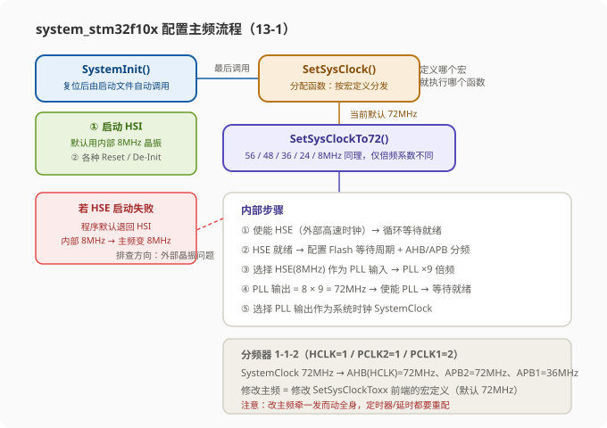
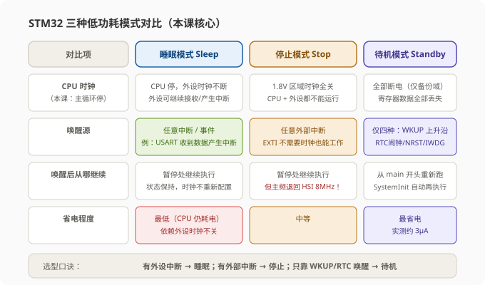
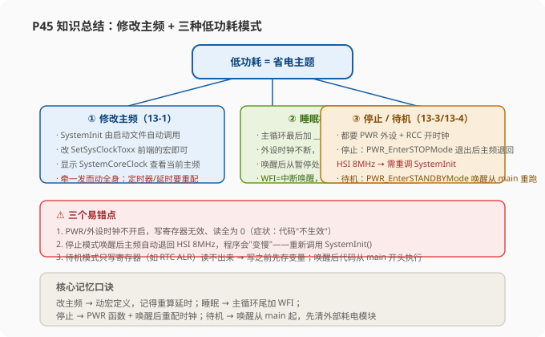

# STM32 修改主频 & 睡眠模式 & 停止模式 & 待机模式 — 学习笔记

> **视频来源**: [B站 江协科技 STM32入门教程-2023版 p45 [13-2]](https://www.bilibili.com/video/BV1th411z7sn?p=45)
> **芯片型号**: STM32F103C8T6（MD 中容量）
> **前置知识**: 时钟树与 RCC（p14）、OLED 显示（p5）、USART 串口收发（p12）、外部中断（p10）、RTC 实时时钟（p42）
> **本节定位**: 低功耗模式的代码实战——修改系统主频降低功耗，并用睡眠、停止、待机三种低功耗模式让程序在空闲时"歇下来"，掌握每种模式的选择依据、实现方式与唤醒后的注意事项

---

## 一、课程概览：本课要解决什么问题

上一节（P44）我们从理论上讲解了 PWR 电源控制与三种低功耗模式的区别，这一节进入代码部分。本节所有代码都**在之前代码的基础上修改而来**，接线基本与之前对应工程一致，不需要新的硬件。整节课包含四个代码工程：

| 工程 | 内容 | 基于哪个旧工程 | 新增接线 |
|:---|:---|:---|:---|
| 13-1 | 修改主频 | OLED 显示工程 | 无（只需 OLED） |
| 13-2 | 睡眠模式 + 串口发送接收 | 9-2 串口发送接收 | USB 转串口模块（CH340） |
| 13-3 | 停止模式 + 对射式红外传感器计次 | 10-3 外部中断计次 | 对射式红外模块（DO 接 PB14） |
| 13-4 | 待机模式 + RTC 实时时钟 | 12-2 RTC 实时时钟 | OLED + PA0（WKUP）引线 + VBAT（可不接） |

> **提示**: 学习本节时始终带着一个问题——**"程序空闲的时候，CPU 在干什么？"** 如果程序靠中断触发工作、没有中断时无事可做，那主循环空转就是在白耗电，这就是低功耗模式的用武之地。

---

## 二、四个工程的接线

### 2.1 13-1 修改主频

不需要接其他模块，直接一个显示屏显示一下即可，非常简单。

### 2.2 13-2 睡眠模式 + 串口发送接收

与串口发送接收实验的接线一样：拿出一个 CH340（USB 转串口模块），GND 接 GND，**RXD 接 PA9**（对应 STM32 的 TX 引脚），**TXD 接 PA10**（对应 STM32 的 RX 引脚）。发送和接收要交叉接，别搞错了。

### 2.3 13-3 停止模式 + 对射式红外传感器计次

与外部中断计次的接线一样：拿出对射式红外模块，VCC 接 3.3V，GND 接 GND，DO 输出接到 STM32 的 **PB14** 引脚。

### 2.4 13-4 待机模式 + RTC 实时时钟

- 右下角接上 OLED 显示屏；
- PA0 这里引出来了一根线。这根线的意思是：**我们可以手动把 PA0 接到 3.3V 或者断开**。因为 PA0 还有一个功能是 WKUP（唤醒引脚），可以唤醒待机模式，且 WKUP 引脚上升沿也有效。但这个地方不好接按键，所以直接用一根线短接到 3.3V，手动产生一个上升沿，测试 WKUP 引脚是不是有效果；
- RTC 这里还有备用电源 VBAT，这个接不接都行。因为我们需要在待机模式唤醒之后继续运行，而唤醒之后如果没有主电源，程序是运行不了的，所以**主电源是不能断电的**。主电源不断电的话，备用电源接不接就都一样了。

---

## 三、13-1 修改主频：研究 system 文件，用宏定义换主频

### 3.1 任务引入：降低主频来降低功耗

复制 OLED 显示工程，改名 13-1 修改主频，编译一下。在这个工程里，我们主要的任务是研究 `system_stm32f10x.c` 和 `system_stm32f10x.h` 这两个文件。这两个文件之前也介绍过一点，这里更进一步研究一下，看看这些代码是怎么工作的——我们利用它里面给我们提供的宏，完成修改主频的任务。**降低主频可以用来降低功耗，也算是契合本节的低功耗主题了。**

### 3.2 回顾时钟树：主频从哪来、分到哪里去

这两个 system 文件是用来配置系统时钟的，也就是配置 **RCC 时钟树**。看 PPT 的时钟树传播电路图：

- **左边是 4 个时钟源**：HSI（内部高速）、HSE（外部高速）、LSI（内部低速）、LSE（外部低速）；
- **右边是各个外设**，也就是使用时钟的地方。

我们用的最多的是 **HCLK、APB1、APB2** 三个时钟。另外还有一些时钟，它们的来源不走 APB1/APB2 这条主线，比如 Flash 接口的时钟直接来源于 HCLK（AHB 总线），RTC 的时钟直接来源于 LSE/LSI 低速时钟，这些我们在课程中暂时不过多关心。

> **原理**: 我们主要关心两件事：① 外部的 8MHz 无源晶振如何选择、如何倍频，才能得到 72MHz 的 SystemClock 系统主频；② 系统主频如何去分配，才能得到 HCLK、APB1、APB2 的时钟频率。

我们之前课程里一直保持**默认配置**：晶振 8MHz，主频 72MHz，HCLK 和 APB2 是 72MHz，APB1 是 36MHz。但这些都不是绝对的，可以根据自己的需求更改。

> **注意**: 讲师建议一般还是不要改。毕竟目前绝大多数程序都是按照默认配置写的，随意更改可能会造成一些问题。

### 3.3 system 文件对外提供的"三个东西"

回到程序，看它怎么配置 RCC 时钟树。这个 `.c` 文件最开始写了一大堆注释，这个注释就是对 system 文件的介绍，读懂这些注释就差不多能理解这个文件了，所以注释还是得好好看一下。英文不好的话用软件翻译一下就行，难得他写了这么多注释，不看白不看。

注释第一条的意思：**System 这两个文件提供了两个外部可调用的函数和一个外部可调用的变量**：

| 名称 | 类型 | 作用 |
|:---|:---|:---|
| `SystemInit()` | 函数 | 配置时钟树，是整个文件最主要的东西。使用 HSE 配置主频为 72MHz 就是它干的活 |
| `SystemCoreClock` | 变量 | 表示主频频率的值。想知道目前主频是多少，直接显示这个变量就行 |
| `SystemCoreClockUpdate()` | 函数 | 更新上面这个变量 |

这几个东西的用途讲师又简单解释了一遍：

- **SystemInit()**：使用 HSE 配置主频为 72MHz。并且这个函数在复位后、执行 main 函数之前，在启动文件中已经自动调用了。所以 main 函数一进来使用，时钟就配置好了，不用我们操心；
- **SystemCoreClock**：只有最开始的一次赋值。之后如果我们改变了主频频率，这个值不会自动跟着变化；
- **SystemCoreClockUpdate()**：所以我们需要调用一下这个函数，根据当前的配置更新 SystemCoreClock 这个变量。

> **关键**: `SystemCoreClock` 这个变量不会随主频变化自动更新。修改主频后想读取正确的主频值，务必先调用一次 `SystemCoreClockUpdate()`。

### 3.4 更改主频的宏定义与预编译

接着往后看，下面这一块就是用来更改主频的宏定义了。注释写着"解除对应的注释来选择想要的系统主频"。

代码里有这样一段**预编译**逻辑：

```c
#if defined(STM32F10X_LD_VL) || defined(STM32F10X_MD_VL) || defined(STM32F10X_HD_VL)
// 如果你使用的是 VL（Value line，低功耗值线）系列：
// 可选主频只有两个：HSE 的 8MHz 和 24MHz
#define SYSCLK_FREQ_HSE    8000000
#define SYSCLK_FREQ_24MHz  24000000
#else
// 其他系列（标准系列）可选主频就多了：
// 8MHz、24MHz、36MHz、48MHz、56MHz 和 72MHz
#define SYSCLK_FREQ_HSE    8000000
#define SYSCLK_FREQ_24MHz  24000000
#define SYSCLK_FREQ_36MHz  36000000
#define SYSCLK_FREQ_48MHz  48000000
#define SYSCLK_FREQ_56MHz  56000000
#define SYSCLK_FREQ_72MHz  72000000
#endif
```

当前解除注释的是 72MHz，所以主频默认就是 72MHz。

> **原理**: 这个 `#if` 的写法叫做**预编译**，主要是用来兼容不同型号的设备。意思是如果我们定义了这些宏，整个文件就只有 `#if` 分支里有效，下面这些代码相当于没写不用看；否则（没有定义这些宏）就是下面这些代码有效，上面那些相当于没写。所以在看带预编译的代码时，我们一定要清楚当前我们的设备是什么——**STM32F103C8T6 是 MD 中容量（Medium-density）系列**，所以就看下面这一块，在这里可以修改主频频率。

**怎么改？** 如果想改成 36MHz，那把 72MHz 的宏注释掉，再把 36MHz 的宏解除注释即可。

### 3.5 解除文件的"只读"属性

当前这个文件是**只读**的，其实无法更改。在 Keil 的文件列表里，这些文件的图标带了一个锁的符号，就代表它是只读的。

解除只读的方法：打开工程文件夹，或者在文件上右键 → "打开包含的文件夹"，这样它就可以直接打开文件夹并定位到这个文件。在这里右键 → 属性，把"只读"的勾去掉。如果你想整个文件夹或者整个工程的文件都去除只读，在外面对整个文件夹操作，然后把这个只读勾掉就行了。

回到 Keil，可以看到这个文件的只读标志已经没有了，这时候我们就可以修改代码了。

### 3.6 追源码：修改一个宏，如何作用到时钟的配置？

先不改它，我们看看简单的修改一个宏定义，它是如何作用到时钟的配置的呢？继续看代码。

首先找到 **SystemInit()**（这是最先调用的函数）。它里面的代码都是直接操作寄存器的写法，看不懂没关系，它这里都有注释：

- 第一步：**开启 HSI**，因为默认使用的是内部的 8MHz 晶振；
- 之后这些操作可以看到都是各种 Reset（复位）、各种 De-Init（恢复默认配置）；
- 恢复完之后，调用 **SetSysClock()** 函数。

转到 SetSysClock() 函数继续挖掘，这个函数里我们就能知道为什么改变宏定义就可以修改主频了。可以看到这个函数实际上就是一个**分配函数**：根据你定义的不同宏定义，选择执行不同的配置函数。比如前面解除了"72MHz"这个宏，那它就执行 `SetSysClockTo72()` 这个函数；如果解除了"36MHz"的宏，那就执行 `SetSysClockTo36()`。根据所选宏执行不同的函数。

我们解除的是默认的 72MHz 这个，那继续挖掘 `SetSysClockTo72()`。

### 3.7 SetSysClockTo72()：正式的时钟配置部分

好，到这里才是正式的时钟配置部分。配置第一步：

```c
/* 第一步：使能 HSE（外部高速时钟） */
RCC->CR |= ((uint32_t)RCC_CR_HSEON);

/* 第二步：循环等待 HSE 就绪，或超时退出 */
HSEStatus = RCC->CR & RCC_CR_HSERDY;
if (HSEStatus == RCC_CR_HSERDY)
{
    /* 如果 HSE 就绪位等于 1，表示晶振启动成功，进入 if */
    /* 配置第一步：设置 Flash 的等待周期（这个不用多管） */
    FLASH->ACR = FLASH_ACR_PRFTBE | FLASH_ACR_LATENCY_2;

    /* 配置 HSE 到 PCLK1 / PCLK2 的分频器 */
    RCC->CFGR |= RCC_CFGR_HPRE_DIV1;   // HCLK（AHB）= SystemClock / 1
    RCC->CFGR |= RCC_CFGR_PPRE2_DIV1;  // APB2 = HCLK / 1
    RCC->CFGR |= RCC_CFGR_PPRE1_DIV2;  // APB1 = HCLK / 2
    ...
}
```

可以看到这里的分频是 **1-1-2**，对应时钟树就是：这里 1 分频（AHB）、这里 1 分频（APB2）、这里 2 分频（APB1）。如果 SystemClock 是 72MHz 的话，这样 AHB 和 APB2 就是 72MHz，APB1 是 36MHz。

接着（代码里根据型号有一段 `#ifdef STM32F10X_CL` 互联型的判断），我们这个是 MD 中容量，所以互联型里面不看，看 else 里的：

```c
/* 配置锁相环 PLL */
RCC->CFGR &= (uint32_t)((uint32_t)~(RCC_CFGR_PLLSRC | RCC_CFGR_PLLXTPRE |
                                    RCC_CFGR_PLLMULL));
RCC->CFGR |= RCC_CFGR_PLLSRC_HSE;      // 选择 HSE(8MHz) 作为 PLL 输入
RCC->CFGR |= RCC_CFGR_PLLMULL9;        // 锁相环选择 9 倍频
```

这里配置的是锁相环（PLL）：HSE 是 8MHz，锁相环选择 **9 倍频**，最终锁相环输出就是 **8 × 9 = 72MHz**。然后继续：

```c
/* 使能锁相环，等待锁相环就绪 */
RCC->CR |= RCC_CR_PLLON;
while((RCC->CR & RCC_CR_PLLRDY) == 0) {}

/* 选择锁相环的输出作为系统时钟 */
RCC->CFGR &= (uint32_t)((uint32_t)~(RCC_CFGR_SW));
RCC->CFGR |= RCC_CFGR_SW_PLL;
/* 等待锁相环成为系统时钟 */
while((RCC->CFGR & RCC_CFGR_SWS) != RCC_CFGR_SWS_PLL) {}
```

对应时钟树的图，刚才执行的配置就是：**选择外部的 8MHz 晶振作为锁相环输入，锁相环进行 9 倍频，输出 72MHz，选择为 SystemClock**。这就是 SystemInit() 的 Init 函数干的一伙活。

### 3.8 HSE 启动失败的处理与各频率组合

代码最后还有一个 `#if 0` 块（被注释掉的），写的是：如果 HSE 启动失败，用程序会有错误的时钟，可以在这里加些代码解决这个错误。同时我们也可以看出：如果 HSE 没接或者 HSE 坏了，那么上面代码都不执行，程序的默认会使用最开始启动的 **HSI 内部 8MHz 作为系统时钟**。

> **注意**: 如果你发现你的主频变成了 8MHz，那可能是外部晶振有问题了。你可以在这个 `#if 0` 里加一些代码，如果确实执行到 if 里面，那就说明确实是 HSE 有问题。

除了 `SetSysClockTo72()`，还有 `SetSysClockTo56()`、`SetSysClockTo48()` 等，执行流程几乎一样，主要区别就是**锁相环的倍频系数**：

| 目标主频 | 路径 | 计算 |
|:---|:---|:---|
| 72MHz | HSE × 9 | 8 × 9 = 72MHz（走上面一路直接 ×9） |
| 56MHz | HSE × 7 | 8 × 7 = 56MHz |
| 48MHz | HSE × 6 | 8 × 6 = 48MHz |
| 36MHz | HSE × 2 × 9 | 8 × 2 × 9 = 36MHz（HSE 进来走下面一路先 ×2） |
| 24MHz | HSE × 2 × 6 | 8 × 2 × 6 = 24MHz |
| 8MHz | 直接使用 HSE | 不经过锁相环倍频，主频就是 8MHz |

### 3.9 时钟配置流程总结

画个图总结一下：



整个流程：**SystemInit() 进来首先启动 HSI → 各种恢复默认配置 → 调用 SetSysClock() → SetSysClock() 是分配函数，根据解除注释的宏定义选择执行不同的配置函数（SetSysClockTo72/56/48 等）→ 在 To72 等函数里才真正配置（选择 HSE 作为锁相环输入、锁相环倍频、选择锁相环输出作为主频）→ 主频就是 72MHz**。

### 3.10 写代码：显示当前主频

流程说完，接下来完成代码。刚才说了有个变量可以表示当前主频（SystemCoreClock），那我们显示一下看看。在 main 函数里：

```c
#include "stm32f10x.h"      // 设备头文件（已包含 system 的头文件）
#include "OLED.h"

int main(void)
{
    OLED_Init();

    /* 第一行：显示 "SystemClock:" 字符串 */
    OLED_ShowString(1, 1, "SystemClock:");

    /* 第二行：显示 SystemCoreClock 变量的值 */
    OLED_ShowNum(1, 8, SystemCoreClock, 8);

    while (1)
    {
    }
}
```

> **提示**: SystemCoreClock 的头文件不需要再包含了，因为这个头文件（`stm32f10x.h`）里面已经包含过了。字符串长度给 8，是因为 72000000 一共 8 位数字。

编译下载看一下：目前显示的主频确实就是 72MHz，没问题。

### 3.11 写代码：加个 Running 闪烁指示运行速度

为了直观对比主频变化前后程序的运行速度，我们在主循环里加一个"呼吸灯式"的 Running 字串，闪烁周期约 1 秒：

```c
while (1)
{
    OLED_ShowString(2, 1, "Running");  // 第 2 行显示 Running
    Delay_ms(500);                     // 延时 500ms
    OLED_ShowString(2, 1, "       ");  // 再显示 7 个空格，把 Running 擦掉
    Delay_ms(500);                     // 再延时 500ms，构成 1 秒周期
}
```

> **提示**: 这里显示空格擦掉旧字符，是 OLED 显示常见的小技巧——字符是覆盖式的，不擦掉旧内容就会出现残影叠加。

编译下载，可以看到目前显示已经正常：Running 闪烁周期 1 秒。

### 3.12 修改主频实验：72MHz → 36MHz

开始修改主频。到 system 文件的最开始，把 72MHz 的宏注释掉、36MHz 的宏解除注释。36MHz 是 72MHz 的一半，方便观察。编译下载后可以看到：

- 第一行主频频率显示的就是 **36MHz**；
- 第二行 Running 闪烁**变慢了**，目前闪烁周期变成了 2 秒。

说明主频确实降低了一半。切换主频就是这么简单，其他的频率大家都可以自己再尝试一下。

### 3.13 修改主频的坑：牵一发而动全身

还有一个问题要特别说一下：**修改主频后，有很多涉及定时器（计时）的计算都要重新匹配一下**。比如这个 Delay 函数，代码默认用的是 72MHz 主频，转到定义看一下：`Delay_us` 里默认值是 72。所以在 72MHz 主频下，延时的时间是正确的；降低主频后，延时的时间**不会自动变化**。

> **关键**: 如果你想在任何主频下延时时间都是正确的，程序就别写死。可以用 SystemCoreClock 这个变量来做计算，把这个变量也带入计算（例如 `Delay_us` 内部把 72 换成 `SystemCoreClock / 1000000`）。

从这里我们也可以看出来，**修改主频是一个牵一发而动全身的事情**：改完之后很多涉及精确计时的计算都要重新匹配好。所以一般考虑一下，讲师不推荐随便修改主频，除非产品真的有需求，并且可以调整好每个需要计算的地方。

---

## 四、13-2 睡眠模式 + 串口发送接收：主循环末尾加一句 WFI

### 4.1 场景引入：下位机为什么需要睡眠

复制 9-2（串口发送接收）工程，改名 13-2 睡眠模式。在这个工程基础上，我们要为它加入低功耗的代码。

设想一个场景：目前要用 STM32 做一个**下位机**，下位机接收电脑通过串口发过来的指令，然后执行相应的功能。电脑随时都有可能通过串口发来指令，当然也可以几个小时、几天都不发指令。为了随时能响应指令，STM32 就得时刻准备着——比如主循环就一直在不断的检查标志位。但是如果你一直不发指令，这些操作都没啥意义，还比较费电。

你可能会说：把这把代码放在中断里就行了。但是**即使主循环空着，它 CPU 也是在不断耗电的**。

> **原理**: 对于这种靠中断触发、没有中断的时候就没什么活的代码，我们就可以给它加入低功耗模式：空闲的时候就低功耗，中断来了再醒来干活就行了。

### 4.2 模式选择：这个程序能用哪种低功耗模式？

看 PPT，对于当前这个程序，可以加入哪一种低功耗模式呢？

- **睡眠模式——可以**。CPU 时钟停，程序不再执行，但是外设的时钟不会关，USART 硬件电路还是可以接收数据的。USART 收到数据后产生中断唤醒 CPU；
- **停机模式（Stop，也叫停字模式）——不行**。这两个叫法都是一个意思，PPT 上也是"停机模式""停字模式"都有出现过，大家知道是一个东西就行。这个模式下所有 **1.8V 区域**的时钟都关了，CPU 和外设都不能运行，那自然 USART 也收不到数据、产生不了中断了；并且 USART 的中断也不能唤醒停机模式。所以以目前这个程序的功能，用不了停机模式；
- **待机模式——自然也不行**。

所以目前这个程序功能只能加上**睡眠模式**省一点电。

> **关键**: 选模式看唤醒源：**睡眠模式**靠外设中断唤醒（外设时钟还开着）；**停止模式**只能靠外部中断唤醒（EXTI 不需要时钟）；**待机模式**只能靠 WKUP/RTC 闹钟/复位/看门狗唤醒。程序靠什么唤醒，就选对应能支持它的模式。

### 4.3 先加 Running 指示，看睡眠前的情况

在睡眠模式之前，先加一个 Running 的指示，看一下不加睡眠的情况：

```c
OLED_ShowString(2, 1, "Running");   // 2 行 1 列显示 Running
Delay_ms(100);                      // 延时 100ms
OLED_ShowString(2, 1, "       ");   // 再显示空格把 Running 清除
```

编译下载，可以看到：此时我们并没有发送数据，主循环也是在不断运行的。打开串口助手随便发送一个数据，数据收发都没问题。但是**没有数据发送时主循环还在不断运行，这是耗电操作**——我们可以用睡眠模式来优化这部分耗电。

### 4.4 睡眠模式的实现：__WFI() 指令

怎么使用睡眠模式呢？很简单，我们在主循环的最后加上一个 `__WFI()` 指令即可。

WFI 指令的格式是：

```c
__WFI();    // 两个下划线 + WFI + 括号 + 分号
```

> **原理**: 睡眠模式还有个指令是 `__WFE()`，他俩的区别就是**唤醒方式不同**：WFI 是中断唤醒，WFE 是事件唤醒。讲师推荐使用 WFI 中断唤醒，因为事件模式配置可能比较麻烦，并且中断模式唤醒，在带有中断的程序里修改比较方便。所以我们工程就直接用 WFI。

转到定义看一下，它对应的就是一个 CPU 的汇编指令（在 `core_cm3.h` 中），再往下就看不到定义了，所以这个指令格式记住就行。

其实睡眠模式简单的加上这一句就完成了。但通过 PPT 的流程框图可以看到，这里其实还涉及两个寄存器的位：一个是 **SLEEPDEEP**，另一个是 **SLEEPONEXIT**。这两个位，官方并没有给我们提供一个比较方便的配置方法，所以我们暂时就不配了，直接使用 WFI 指令，它进入的就是默认的睡眠模式（立刻睡眠）。如果确实想配置的话，得使用操作寄存器的方式完成。

### 4.5 深入：SCB 里的系统控制寄存器 SCR

这两个位位于**内核（Cortex-M3）的系统控制块 SCB** 里。打开内核的头文件（`core_cm3.h`），找到系统控制寄存器 **SCR（System Control Register）**，可以看到这里就是低功耗相关的三个位：

| 位 | 名称 | 作用 |
|:---|:---|:---|
| 第 1 个 | SEVONPEND | 是事件唤醒睡眠模式需要设置的位 |
| 第 2 个 | SLEEPDEEP | 决定是进入睡眠模式还是深度睡眠模式（停止/待机） |
| 第 3 个 | SLEEPONEXIT | 决定是立刻睡眠，还是等中断返回后睡眠 |

如果想配置这三个位，得在程序中用操作寄存器的方式实现，比如在 `__WFI()` 上面写 `SCB->SCR |= xxx`，这个得对照寄存器的位来写。当然我们不要求这么多，进入睡眠模式的话这三个位暂时就不配，保持默认值就行。

### 4.6 睡眠模式完整代码与测试

睡眠模式的代码就这样：

```c
int main(void)
{
    Serial_Init();            // 初始化串口（USART1，PA9/PA10）
    OLED_Init();              // 初始化 OLED

    OLED_ShowString(1, 1, "Sleep Mode");   // 提示当前是睡眠模式实验

    while (1)
    {
        if (Serial_GetRxFlag() == 1)        // 检查接收标志位
        {
            OLED_ShowString(2, 1, "Running");   // 收到数据，闪烁一次
            Delay_ms(100);
            OLED_ShowString(2, 1, "       ");
            Serial_SendByte(Serial_GetRxData());  // 回传收到的数据
        }

        __WFI();    // ← 睡眠模式核心：主循环最后一句，等中断唤醒
    }
}
```

> **注意**: 接收标志位 `RxFlag` 是在 USART1 中断函数里置 1 的。睡眠模式下 CPU 停了，但 USART 外设还开着，收到数据照样进中断、置标志位——这就是睡眠模式能在"外设工作、CPU 睡眠"下工作的根本原因。

编译下载测试：

- 第 2 行不再显示 Running，说明主循环目前是停下来了，CPU 正在睡眠；
- 用串口助手发送一个数据：**每发送一次，Running 闪烁一次，接收区回传一次数据**；
- 这次程序在收到数据之后可以唤醒工作一次。在不影响程序功能的前提下，CPU 能在空闲时睡眠，只耗一点电——这就是睡眠模式的作用。

### 4.7 程序执行流程分析

回到程序分析一下执行流程：

1. 程序开始初始化，把串口配置好，进入主循环；
2. 检查标志位（没有数据时标志位为 0，跳过），Running 闪烁一次；
3. 在主循环的最后执行 `__WFI()`，**CPU 会立刻睡眠**，程序停在 WFI 指令这里；
4. CPU 睡眠，但是各种外设（比如 USART）还是工作状态；
5. 等到用串口助手发送数据时，USART 外设收到数据产生中断，唤醒 CPU；
6. 睡眠模式唤醒之后，程序在暂停的地方继续运行。程序继续运行到 WFI 之后，但唤醒之后中断也是会立刻响应的，所以程序在跳回主循环（再次循环）之前，**先进入 USART 的中断函数**；
7. 在中断函数里：读取数据，把接收标志位置 1，然后退出中断；
8. 回到主循环开头，这时接收标志位刚刚置 1，所以依据程序逻辑执行数据回传和显示的功能；
9. 唤醒的功能执行完之后，Running 闪烁一次；最后程序又来到 WFI 的位置——这是一个新的睡眠周期，CPU 再次进入睡眠；
10. 正好我们需要它唤醒后执行的功能也执行完了，这时再进入睡眠，那就是恰到好处。

> **关键**: 睡眠模式一般可以在主循环的最后加个 `__WFI()` 指令，每来一个中断先进中断函数（响应中断），再执行一遍程序功能（处理数据）。这套"WFI 放主循环末尾"的写法，就是睡眠模式的标准用法。

---

## 五、13-3 停止模式 + 对射式红外传感器计次：唤醒后记得重配时钟

### 5.1 任务引入：外部中断计次也能省电

复制 10-3（外部中断计次）工程，改名 13-3 停止模式 + 对射式红外传感器计次。这个代码的思路和上一个睡眠模式非常像：你看这个传感器计次总是被触发，但是如果外部一直没有中断信号的话，那这个计次就是没有意义的耗电操作。如果几个小时、几天都没有外部中断触发计次，那我这个 OLED 也没必要一直刷新对吧。

所以对于这个代码，在空闲的时候我们可以让它进入低功耗。因为这个代码可以使用**外部中断触发唤醒**，所以我们可以让它进入**更为省电的停止模式**。

### 5.2 为什么停止模式能用外部中断唤醒？

在停止模式下，1.8V 区域的时钟关闭，CPU 和外设都没有时钟。但是**外部中断的工作是不需要时钟的**——这一点从代码里也可以看出来：配置外部中断的时候，根本就没有开启 EXTI 时钟的步骤，这也是 EXTI 能在时钟关闭的情况下工作的原因，因为它不需要时钟。

### 5.3 PWR 外设库函数总览

刚才讲的睡眠模式其实都只是内核的操作，睡眠模式涉及的几个寄存器也都在内核里，跟 PWR 外设关系不大，所以刚才我们都没用到 PWR 的函数。而停止模式涉及到**内核之外的电源操作**，这就需要用到 PWR 外设了。

打开 PWR.c 看一下函数，这些就是 PWR 外设的相关函数，看着也不太多。逐一介绍：

| 函数 | 作用 |
|:---|:---|
| `PWR_DeInit()` | 复位配置，这个不用多说 |
| `PWR_BackupAccessCmd()` | 使能后备区域的访问（上节 BKP 用过） |
| `PWR_PVDLevelConfig()` + `PWR_PVDCmd()` | 配置 PVD 的阈值电压，然后使能 PVD 功能。需要用 PVD 的话就先执行阈值配置，再使能一下 |
| `PWR_WakeUpPinCmd()` | 使能位于 PA0 位置的 WKUP 引脚。配合待机模式使用——待机模式可以用 WKUP 引脚的上升沿唤醒。用不用这个功能有一个开关，需要开启 WKUP 唤醒功能的话就得调用这个函数使能一下 |
| `PWR_EnterSTOPMode()` | 进入停止模式，一会要用到 |
| `PWR_EnterSTANDBYMode()` | 进入待机模式，下个代码要用到 |
| `PWR_GetFlagStatus()` / `PWR_ClearFlag()` | 获取标志位 / 清除标志位的函数 |

### 5.4 先加 Running 指示看现象

在加入停止模式之前，还是先加一个 Running 的指示，在主循环下面加一个 OLED_ShowString(2,1,"Running")，Delay 100ms，再把 Running 清除。当然这个在代码里并不是必须的，加它主要是为了指示主循环是不是在不断运转，方便观察实验现象。

先看一下当前代码的现象：编译下载，按一下复位键（按住复位键不放再松手），遮挡一下这个传感器，可以看到数值是在计数，但是在没有遮挡信号的时候，它还是在不断的运转——这个耗电的操作我们可以用停止模式来优化一下。

### 5.5 开启 PWR 时钟

停止模式和待机模式都需要 PWR 外设干活，所以首先我们要**开启 PWR 的时钟**：

```c
RCC_APB1PeriphClockCmd(RCC_APB1Periph_PWR, ENABLE);   // PWR 挂在 APB1 总线上
```

> **关键**: 这个时钟一定不要忘了开启！**如果外设没开时钟，那么写入寄存器是无效的，读取寄存器也全都是 0**——表现为代码好像"没生效"。这个现象大家可以自己试一下。

### 5.6 调用 PWR_EnterSTOPMode() 进入停止模式

时钟开启之后，我们想让它在主循环的最后进入停止模式，那可以直接调用这个函数：

```c
PWR_EnterSTOPMode(PWR_Regulator_ON, PWR_STOPEntry_WFI);
```

这个函数有两个参数：

1. **第一个参数**：指定稳压器（Regulator）在停止模式里的状态——开启（`PWR_Regulator_ON`）或者低功耗（`PWR_Regulator_LowPower`），这个随意的，目前讲师选择开启；
2. **第二个参数**：停止模式的入口参数——选择 `PWR_STOPEntry_WFI` 进入停止模式，还是 `PWR_STOPEntry_WFE` 进入停止模式。这里选择 WFI 进入。

这样进入停止模式的代码就完成了。

### 5.7 PWR_EnterSTOPMode() 内部干了什么？

这一句代码里面干了什么？转到定义看函数内部：

1. **读取 `PWR->CR` 寄存器**，放到临时变量 `tmpreg` 里；
2. **清除 PDDS 和 LPDS 位**。其中清除 PDDS 就代表选择停止模式——对应 PPT 这里：PDDS=0 时，在这个判断会执行上面的操作，进入停止模式（PDDS=1 则是待机模式）；
3. **根据指定的参数设置 LPDS 位**：如果这个参数选择 `PWR_Regulator_ON`（调节器开启），那这里 LPDS=0；如果选择 `PWR_Regulator_LowPower`（低功耗），那这里 LPDS=1。对应 PPT 里的判断：LPDS=0 继续往下开启，LPDS=1 进入低功耗；
4. 之后把临时变量**写回 `PWR->CR` 寄存器**，参数生效；
5. 最后**设置内核的 SLEEPDEEP 位**：这里或等于 SLEEPDEEP 的掩码，就是把 SLEEPDEEP 位置 1。对应 PPT 里的判断，在这个判断它会执行下面的流程；
6. 这时 SLEEPDEEP、PDDS、LPDS 都已配置好，最后调用 `__WFI()` 或者 `__WFE()`。可以看到函数最后就是一个 if：如果第二个参数给的是 `PWR_STOPEntry_WFI`，那它就执行 `__WFI()`，否则执行 `__WFE()`。执行到这个位置，芯片就会进入停止模式，程序暂停运行；
7. 函数最后还有一行，这一行是停止模式**唤醒之后才能执行到的**：可以看到在退出停止模式后，官方很贴心的帮我们把 SLEEPDEEP 位又清除了。

> **原理**: 进入停止模式这个函数，把配置各种寄存器、调用指令（WFI/WFE）在这一个函数里就都完成了。在程序里，我们只需要调用这一个函数就可以了。

### 5.8 测试现象：主频退回 8MHz 的问题

测试看下程序现象：按复位、下载、松手，可以看到在空闲时（没有遮挡），主循环已经停止运行了。我们遮挡试一下：可以看到**每遮挡一次，Running 运转一下**。

不过我们还注意到一个现象：比如现在我按下复位键，可以看到**复位后的第一次遮挡，Running 运转很快，是正常的时间；而我们遮挡之后，Running 运转就变得很慢了**。这是什么原因呢？

看 PPT，这里之前提到过，原因就在这里：**退出停止模式时，HSI 被选为系统时钟**。在复位后第一次进入停止模式前，SystemInit 还处理配置的事，配置的是 HSE→PLL×9 倍频的 72MHz 主频，所以复位后第一次遮挡 Running 运转很快。而之后，进入停止模式再退出时，**默认时钟就变成 HSI 了，HSI 是 8MHz**，随后唤醒之后的程序运行就会明显变慢——就是刚才现象的原因。

### 5.9 解决：退出停止模式后重新调用 SystemInit()

找到原因，解决起来也很简单：我们只需要在退出停止模式之后**重新调用 SystemInit()**，重新启动 HSE、配置 72MHz 主频就行了。所以在程序里，我们简单的来一个 SystemInit() 就可以了：

```c
while (1)
{
    if (EXTI 触发标志)   // 有遮挡信号，执行计数和显示
    {
        CountValue = GetCount();       // 读取计数值
        OLED_ShowNum(1, 1, CountValue, 5);   // 显示计数值
        OLED_ShowString(2, 1, "Running");
        Delay_ms(100);
        OLED_ShowString(2, 1, "       ");
    }

    PWR_EnterSTOPMode(PWR_Regulator_ON, PWR_STOPEntry_WFI);  // 进入停止模式

    SystemInit();   // ← 唤醒后重新配置时钟（HSE→PLL×9→72MHz）
}
```

编译下载测试：可以看到，这时遮挡之后，Running 运转速度是正常的。这样我们就解决了停止模式退出后主频变为 8MHz 的问题。

> **关键**: 停止模式唤醒后，芯片沿用退出前的程序指针继续执行，但**时钟退回 HSI 8MHz**。凡是"停止模式 + 对运行速度有要求"的场景，唤醒后都要重新调用 `SystemInit()` 恢复 72MHz。

### 5.10 停止模式程序执行流程

最后再梳理一遍：复位后，初始化，进入主循环，然后进入这个函数（PWR_EnterSTOPMode），执行到 `__WFI()` 这一句之后，程序立刻暂停。等外部中断发生时，芯片唤醒——这时芯片先进入外部中断函数，执行一遍（计数加一）。中断函数退出后，程序再到这里继续运行（PWR_EnterSTOPMode 剩余的清除 SLEEPDEEP 位）。然后程序退出（返回主循环），执行一遍 SystemInit() 配置时钟，之后主循环回到开头，执行一遍这个流程，最后就是再执行这个函数进入停止模式。

---

## 六、13-4 待机模式 + RTC 实时时钟：唤醒从 main 重跑

### 6.1 任务规划与显示布局

复制 12-2（RTC 实时时钟）工程，改名 13-4 待机模式 + RTC。在这个工程里，我们的主要任务有三个：

1. **配置 RTC 闹钟**；
2. **进入待机模式**；
3. **使用闹钟中断唤醒待机模式**。

开始写代码之前，先把目前的显示布局重新规划一下。目前 OLED 上已经没有位置了，那么：

| 行 | 显示内容 | 说明 |
|:---|:---|:---|
| 第 1 行 | CNT | 秒计数 |
| 第 2 行 | ALR | 闹钟值（放在一行六列） |
| 第 3 行 | ALRF | 闹钟标志位 |
| 第 4 行 | Running | 运行指示（放下面） |

原来的年、月、日、时、分、秒就不再显示了。看下现象：按复位、下载、松手，第 1 行显示秒数，后面的还没有东西。

### 6.2 任务一：设定闹钟为"当前秒数 + 10"

目前先实现第一个任务：设定闹钟。我们可以在主循环上面设定，每次复位后设定闹钟值。闹钟值也不用特别去记，我们直接设为**当前秒数 + 10**，这样每次复位后闹钟就都是 10 秒后了。

怎么设定闹钟呢？到 RTC.c 里看函数，很明显用第一个 `RTC_SetAlarm()` 就行了。闹钟值也是一个 32 位的值，我们直接给它 `RTC_GetCounter()`（当前秒数）加 10：

```c
uint32_t Alarm;                          // 定义一个变量保存闹钟值
Alarm = RTC_GetCounter() + 10;           // 闹钟 = 当前秒数 + 10（10 秒后）
RTC_SetAlarm(Alarm);                     // 写入闹钟寄存器
OLED_ShowNum(2, 6, Alarm, 10);           // 第 2 行第 6 列显示闹钟值
```

> **原理**: 这个"当前秒数 + 10"的技巧很实用——不用把闹钟写死，每次复位后自动设定一个 10 秒后的闹钟，方便观察，又不需要额外计算。

### 6.3 只写寄存器：为什么写之前要先存变量？

这里有个问题：**闹钟寄存器（ALR）是只写的，写进去之后就读不出来了**。怎么看出寄存器是只写还是可读可写呢？可以看一下手册的寄存器描述部分——打开 RTC 的寄存器描述，这个闹钟寄存器下面有一排字母 W，这个就是对应位的读写特征：

- 只有一个 W，就代表对应的位**只能写入不能读出**（写后即消失）；
- 上面比如 CNT 计数器对应的位都是 **RW**，代表可读可写；
- 再往上比如 DR 日期寄存器，这里写的是 **R**，代表只能读不能写。

> **提示**: 这些读写特征的字母含义可以看一下文档的第一章，里面有个表，各种缩写和对应的意思，大家可以自行查看。

因为闹钟寄存器是只写的，库函数也没有 `RTC_GetAlarm()` 这样的函数，所以为了避免写进去就不知道值了，我们可以在写之前给它**存下来**：先定义一个变量 `uint32_t Alarm`，等于我们要写入的闹钟值；之后把这个变量写入 `RTC_SetAlarm(Alarm)`；显示的话就直接显示这个变量就行。这样闹钟设定和显示的代码就完成了。

### 6.4 看闹钟标志位：验证闹钟会触发

随着 CNT 增大，CNT 会和 ALR 相等，然后触发闹钟标志位置 1。如果开启了闹钟中断，那还会进一步进入中断函数。在这个代码里我们暂时就不开中断了，直接显示一下闹钟标志位，看看闹钟到的时候会不会置 1：

```c
while (1)
{
    OLED_ShowNum(1, 1, RTC_GetCounter(), 10);              // 第 1 行：CNT 秒计数
    OLED_ShowNum(3, 6, RTC_GetFlagStatus(RTC_FLAG_ALR), 1); // 第 3 行：闹钟标志位

    OLED_ShowString(4, 1, "Running");     // 第 4 行 Running 指示
    Delay_ms(100);
    OLED_ShowString(4, 1, "       ");
}
```

看程序现象：第一行的 CNT 不断递增，第二行的 ALR 是复位后设定的值，第三行是闹钟标志位。等一下，CNT 等于 ALR 时 ALRF 置 1——并且可以发现它是**在 CNT 等于 ALR 的最后时刻，ALRF 才置 1**。好，这样我们的闹钟测试是没有问题的。

### 6.5 加入待机模式：别忘了再开一次 PWR 时钟

回到代码，现在就可以加入待机模式来测试了。想进入待机模式，需要使用 PWR 的函数（`PWR_EnterSTANDBYMode`）。使用之前还是别忘了开时钟。

虽然在这个代码里，`RTC_Init()` 这个函数里面已经开启过 PWR 的时钟（因为 RTC 备份域访问需要 PWR 参与），但是我们使用待机模式的话，最好还是再开一次，**保持每部分代码的独立性**。所以可以复制这一条放这里：

```c
RCC_APB1PeriphClockCmd(RCC_APB1Periph_PWR, ENABLE);   // 开启 PWR 时钟
```

> **注意**: 时钟已经开起了，再开一遍不会有任何问题；但忘记开时钟，外设就不会工作。如果认为 RTC_Init 里已经开过了，外面这句代码就省略，那么待机模式的代码就会对 RTC_Init 有依赖性，增大了代码之间的耦合性——没有 RTC_Init，待机模式就不能正常工作。现在有 RTC_Init 没问题，但如果日后改变程序，不用 RTC 这一块了，把 RTC_Init 代码去掉，就很可能会引起很隐蔽的 bug。所以**该写的代码我们最后还是写完整**。

### 6.6 PWR_EnterSTANDBYMode() 内部干了什么？

进入待机模式还是同样的操作：在主循环的最后调用函数，到 PWR.c 里找一下，调用 `PWR_EnterSTANDBYMode()` 就行了。这个函数干了什么活呢？转定义看一下：

1. **第一步：清除 WKUP 标志位**；
2. **第二步：选择 STANDBY 模式**，实际上就是把 PDDS 置 1——PDDS=1 表示进入待机模式；
3. **第三步：设置 SLEEPDEEP 位，进入深度睡眠**（这一段不用看，是判断分支）；
4. **最后一步：调用 WFI 指令进入待机模式**。

可以看到对于待机模式，其实**并没有区分 WFI 和 WFE**——入口这里也不能选择，统一都调用的是 WFI。

> **原理**: WFI 和 WFE 的区别就是唤醒方式的不同（中断唤醒 vs 事件唤醒）。但看 PPT，对于待机模式，它的唤醒源是指定的四种事件（WKUP 上升沿、RTC 闹钟、NRST 复位、IWDG 看门狗），没有对中断唤醒和事件唤醒做区分，所以我们也就不用去分，直接调用 WFI 进入待机，然后这四个唤醒事件都能唤醒就行。

### 6.7 待机模式完整代码与测试

```c
#include "stm32f10x.h"
#include "OLED.h"
#include "RTC.h"

int main(void)
{
    OLED_Init();
    RTC_Init();                        // 初始化 RTC（内部自带开启 PWR 时钟）
    RCC_APB1PeriphClockCmd(RCC_APB1Periph_PWR, ENABLE);  // 再开一次，保持代码独立

    /* 设定闹钟 = 当前秒数 + 10 */
    uint32_t Alarm;
    Alarm = RTC_GetCounter() + 10;
    RTC_SetAlarm(Alarm);

    while (1)
    {
        OLED_ShowNum(1, 1, RTC_GetCounter(), 10);              // CNT
        OLED_ShowNum(2, 6, Alarm, 10);                         // ALR
        OLED_ShowNum(3, 6, RTC_GetFlagStatus(RTC_FLAG_ALR), 1); // ALRF

        OLED_ShowString(4, 1, "Running");
        Delay_ms(100);
        OLED_ShowString(4, 1, "       ");

        PWR_EnterSTANDBYMode();    // ← 进入待机模式，唤醒后从 main 重新执行
    }
}
```

测试：复位后 Running 闪烁一次进入待机，但这时屏幕也不会刷新了。等一等，过一会**闹钟触发，再次进入模式唤醒，屏幕和闹钟值刷新一下，Running 闪烁一次**。

通过这个现象我们可以确定：**待机模式唤醒后，程序是重新从 main 开始执行的**。因为我们闹钟设定的代码在主循环之前，如果程序不是从 main 开始的，那闹钟值也不会更新，对吧。

### 6.8 待机模式唤醒后的特殊之处

- 进入待机模式之后，**高速时钟也都会关闭**；退出待机模式，程序从 main 开始执行。在程序刚开始的时候，启动文件会自动调用 SystemInit()，所以**待机模式我们就不用像停止模式那样，自己调用 SystemInit()**；
- 因为在启动文件里 SystemInit 的调用发生在 main 之前，而程序一旦执行到 PWR_EnterSTANDBYMode() 这条语句就停住了，**这条语句之后的代码就再也执行不到了**——因为待机模式退出，程序从 main 重新开始；
- 并且这个主循环实际上也只有执行一遍的机会——进入待机之后它就停了，唤醒后从 main 开头重新跑。**把这个主循环去掉也是可以的**。

> **关键**: 停止模式 = 从暂停处继续（时钟要自己重配）；待机模式 = 从 main 重跑（时钟自动配置，但寄存器内容全部丢失，之前的局部变量、外设配置统统清零）。

### 6.9 待机前的电源设计：别捡了芝麻丢了西瓜

待机模式追求的是**极度省电**，但光 STM32 自己一个省电还不行。所以一般在进入待机模式之前，我们都要尽可能地把外部挂的模块都关掉。比如说：我 STM32 待机了，外面还得显示屏在显示，或者外面还有一个电机在嗡嗡的转——**外部模块的耗电远超 STM32 本身**，这时再给 STM32 待机、不管外部模块，那不就是捡了芝麻丢了西瓜了吗？

所以 STM32 进入待机模式之前，**一定要把外部接的模块能停的都停掉，能断链的都断掉**，这样才能最大化省电。这个功能需要进行电源电路设计：

- 可以选一个**带使能端的稳压芯片**；
- 或者自己设计电路，把其他模块的供电加个开关。

程序这里就简单模拟一下：在待机模式之前来个 OLED_Clear() 清屏表示一下，为了看得清晰，再显示一个字符串（放在 4 行 9 列，显示"待机"提示），显示停留时间长一点（Delay 1 秒），这样进入待机前屏幕上有提示。

### 6.10 WKUP 引脚唤醒功能

之后我们还可以设计一下 WKUP 引脚唤醒的功能，这个其实非常简单。看一下函数，调用 `PWR_WakeUpPinCmd()`，放到初始化函数的底部，参数给一个 ENABLE，就一条代码就行了：

```c
PWR_WakeUpPinCmd(PWR_WakeUpPin_1, ENABLE);   // 使能 PA0 的 WKUP 引脚
```

> **提示**: 那这个会不会和目前使用的 GPIO 引脚冲突、还需不需要配置输出呢？**这个是不需要的**。看手册 PWR 的寄存器描述：这一位（的描述）——使能 WKUP 引脚后，WKUP 引脚被强制为下拉的配置，所以不用再配置 GPIO 了。

测试 WKUP：复位下载松手，WKUP 引脚默认是下拉的，引脚悬空就是低电平。然后我们把这个线插到高电平试一下：可以看到 **WKUP 接高电平的时刻，待机模式被唤醒**。当然 WKUP 引脚也不仅仅有手动给电平，外部的模块或者别的传感器信号也都可以接过来用于唤醒——这就是 WKUP 引脚的唤醒功能。

### 6.11 最后的最后：待机电流实测小实验

验证一下待机模式到底是不是像手册里说的那样省电。手册里说待机模式的电流只有 **3μA 左右**，这个是不是真的呢？讲师为此进行了测试：

- 单独找了个板子，把电源供电线正极给（串）串联一个万用表测电流。最开始测试，待机模式的电流高达 **1 毫安多**，远超手册里说的 3μA，那说明很明显，这个电源指示灯肯定是耗电的。所以先把电源指示灯去掉了；
- 再测试电流仍然有几百微安，说明还有别的东西耗电。之后就把板子背面的 **LDO 稳压器**去掉了——这个 LDO 虽然我们并没有用，但既然接在电路里它就会有电流流过；
- 最后去掉电源指示灯和 LDO 之后，待机模式的电流就下降到 **3μA** 了。

> **注意**: 这个排查思路很重要——省电电流降不下去，一定是有"看似没用但实际在耗电"的东西。板载的 LED、LDO、分压电阻都是常见"偷电贼"。

最后演示一下现象（演示程序做了改动：OLED 显示时间给 10 秒，待机模式的时间给 100 秒，方便测试）：先给板子下载程序（换到下载程序的电源，LDO 是接的），复位下载松手，再把板子换到测试电流上。用万用表看电流：

- 一开始是正常工作的电流，目前显示 20 多毫安——正常工作就是 20 多毫安；
- 等一会儿等它进入待机，可以看到供电电流瞬间降为零；
- 换到更小的毫安档，可以看到目前待机的供电电流是 **3.3μA**，这又和手册上的数据基本是一致的。

这样我们从硬件上也验证了待机模式省电的正确性。另外从这个实验我们也可以看出：**使用待机模式省电，一定要想办法把外部能关的一切耗电电路都关掉**，否则你的待机模式就无法做到真正的极度省电。

---

## 七、三种低功耗模式对比总结



| 对比项 | 睡眠模式 Sleep | 停止模式 Stop | 待机模式 Standby |
|:---|:---|:---|:---|
| CPU 时钟 | 停止，外设时钟不断 | 1.8V 区域时钟全关，CPU+外设都不能运行 | 全部断电（仅备份域），寄存器数据全部丢失 |
| 唤醒源 | 任意中断 / 事件（如 USART 收数据） | 任意外部中断（EXTI 不需要时钟） | 仅四种：WKUP 上升沿、RTC 闹钟、NRST 复位、IWDG |
| 唤醒后 | 从暂停处继续，状态保持 | 从暂停处继续，但**主频退回 HSI 8MHz** | **从 main 重新执行**，SystemInit 自动再跑 |
| 实现方式 | 主循环末尾 `__WFI()`（睡眠模式核心） | `PWR_EnterSTOPMode(Regulator_ON, WFI)` | `PWR_EnterSTANDBYMode()` |
| 省电程度 | 最低 | 中等 | 最省电（实测约 3μA） |
| 典型场景 | 串口等外设中断触发的工作 | 外部中断触发的工作 | WKUP/RTC 闹钟周期性唤醒的极低功耗设备 |

---

## 八、知识总结



**本节课三个工程的共性套路**：

1. **改主频（13-1）**：改 system 文件里解除注释的宏（默认 72MHz）→ 重新编译下载 → 用 `SystemCoreClock` 变量验证主频 → 观察 Running 闪烁变慢。注意改主频后定时器/延时要重配，可用 `SystemCoreClock` 参与计算；
2. **睡眠（13-2）**：主循环末尾加 `__WFI()` → USART 收到数据产生中断唤醒 → 先进中断函数再回主循环处理数据。外设时钟不断是它的关键特征；
3. **停止（13-3）**：先开 PWR 时钟 → 主循环末尾调 `PWR_EnterSTOPMode()` → 外部中断唤醒 → **唤醒后要重新调用 `SystemInit()` 恢复 72MHz**；
4. **待机（13-4）**：先开 PWR 时钟（保持代码独立）→ 设定 RTC 闹钟 → 主循环末尾调 `PWR_EnterSTANDBYMode()` → 唤醒从 main 重跑（自动恢复时钟）→ 可选 WKUP 引脚唤醒 → 进入待机前先关外部耗电模块。

**记忆口诀**：
> 睡眠末尾加 WFI，外设中断随时醒；停止靠 EXTI，醒来记得重配钟；待机唤醒回 main，WKUP/闹钟来唤醒，先清外部耗电户，3 微安才叫真省电。

---

*笔记生成时间: 2026-08-06 | 基于 B站视频 BV1th411z7sn p=45 转录*
