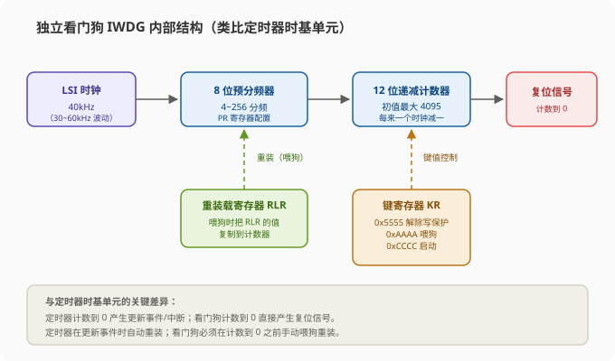
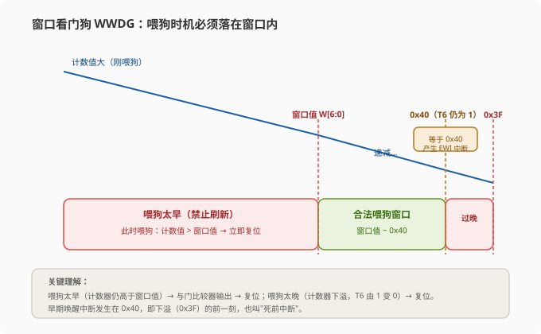
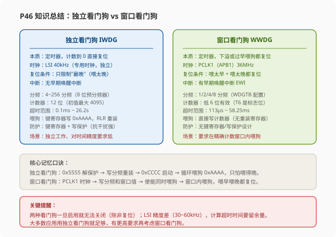

# STM32 [14-1] WDG 看门狗 — 学习笔记

> **视频来源**: [B站 江协科技 STM32入门教程-2023版 p46 [14-1]](https://www.bilibili.com/video/BV1th411z7sn?p=46)
> **芯片型号**: STM32F103C8T6
> **前置知识**: 定时器的时基单元（预分频器 PSC + 计数器 CNT + 自动重装寄存器 ARR，p11）、PWR 低功耗模式（p45）、复位系统、OLED 显示与按键工程
> **本节定位**: 理论课——讲解看门狗（WatchDog，WDG）的原理、为什么需要它、它本质上就是一个定时器，并分别详解独立看门狗（IWDG）和窗口看门狗（WWDG）的框图、寄存器、超时时间计算，以及两个演示程序的运行现象（完整的代码实现放在下一节 p47）

---

## 一、课程概览：看门狗是什么

这一节我们要学习的内容是 **STM32 里的看门狗**。STM32 内部有**两个看门狗**，分别是**独立看门狗（IWDG）**和**窗口看门狗（WWDG）**。两者的作用基本相同，只是侧重点不一样。

看门狗简单来说，就是**程序运行的一个保障措施**：我们必须在程序中定期"喂狗"，如果程序出问题卡死了，没有在规定的时间喂狗，那么看门狗硬件电路就会自动帮我们复位一下，防止程序长时间卡死。

老师打了一个非常生活化的比方：就像我们写了一个程序，突然它不动了，我们就会习惯性地去按一下复位键；或者说手机、电脑卡死不动了，我们也会习惯性地把它重启来解决。**看门狗就是自动完成"按复位键"这个操作的一个硬件电路**——在程序卡死的情况下，自动帮我们复位一下。

> **原理**: 看门狗的本质是一个定时器。在指定的时间范围内，如果程序没有执行喂狗操作，看门狗硬件电路就自动产生复位信号。所以看门狗并不复杂，用老师的话说——"看门狗也不复杂，就是个自动复位电路"。

---

## 二、程序演示：先看现象

按照老师的惯例，先看一下本节程序的演示，对看门狗建立直观印象。本节一共两个程序：**14-1 独立看门狗** 和 **14-2 窗口看门狗**。两个程序都是基于 OLED 显示工程做的，OLED 用来显示复位来源，按键用来模拟"程序卡死"。

### 2.1 独立看门狗程序

**程序结构（老师口述整理，完整代码在下一节 p47）：**

```c
int main(void)
{
    OLED_Init();
    /* ① 判断复位来源：是看门狗复位，还是上电/按复位键复位 */
    if (检查"独立看门狗复位标志位")
    {
        OLED_ShowString(2, 1, "独立看门狗RST");  // 看门狗复位 → 第二行显示
        RCC_ClearFlag();                          // 清除复位标志位
    }
    else
    {
        OLED_ShowString(3, 1, "正常RST");         // 正常复位 → 第三行显示
        RCC_ClearFlag();
    }

    /* ② 独立看门狗初始化：最大喂狗时间（超时时间）设为 1000ms */
    IWDG_Init(超时时间 = 1000ms);

    while (1)
    {
        IWDG_ReloadCounter();     // ③ 不断喂狗，喂狗间隔 < 1000ms
        Delay_ms(喂狗间隔);        //    目前喂狗间隔远小于 1000ms
        Key_GetNum();             // ④ 按键扫描：按住不放 → 主循环阻塞
    }
}
```

程序进来，首先执行判断：看这个程序**是因为看门狗复位而从头执行的，还是因为上电（或按复位键）而从头执行的**。

- 如果是看门狗复位：OLED **第二行**显示"独立看门狗 RST"的字串；
- 如果是正常复位：OLED **第三行**显示"正常 RST"的字串。

接下来这一块是独立看门狗初始化，设置的**最大喂狗时间（超时时间）是 1000ms**。这样我们在主循环里，就不断地调用喂狗函数执行喂狗，且**喂狗间隔不能超过上面配置的 1000ms**。目前程序里喂狗的间隔设置得远小于 1000ms，所以只要主循环不断正常运行，独立看门狗就不会自行复位。

最后在这个位置，老师加了一个按键获取键码（按键扫描）的函数。在这个函数里面，采用**主循环扫描**的方式：有时候按键按下不放的话，程序就会**卡死在这个函数里**。所以老师把按键扫描放到主循环里——按下按键不放，就用来模拟程序卡死的状况。程序一卡死，喂狗程序无法及时执行，独立看门狗就会复位，让程序从头开始执行。

**演示现象：**

1. 下载程序后正常复位，第三行显示"正常 RST"；
2. 之后主循环不断执行，并在第四行显示喂狗状态指示（"显示→清除"反复闪烁），表示程序正在正常运行并不断喂狗；
3. 然后按上面的按键**按住不放**，主循环卡死，无法喂狗，第二行就会显示"独立看门狗 RST"——这个复位就是独立看门狗产生的。

简单总结：**如果不及时喂狗，程序就会复位。**

> **提示**: 复位来源为什么能区分？靠的是 RCC 的复位标志位（独立看门狗复位对应 `RCC_FLAG_IWDGRST`）。判断之后必须调用 `RCC_ClearFlag()` 清除标志位，否则这个标志位按复位键也不会自动清零，下次就会误判。详细的代码处理在 p47 再展开。

### 2.2 窗口看门狗程序

窗口看门狗和独立看门狗类似，都是"不喂狗就复位"，但是**窗口看门狗对喂狗时间要求更严格一些**：它有一个喂狗时间的窗口，必须在这个时间窗口内喂狗——**喂狗晚了不行，喂狗早了也不行**。

程序进来，首先还是判断复位来源：是窗口看门狗导致的复位，还是正常上电和复位键导致的复位。之后窗口看门狗初始化，这里设置的**喂狗时间窗口是 30~50ms**——喂狗的间隔必须在 30ms 到 50ms 之间，喂得太早、喂得太晚都不行。

然后看主循环里，这一条是喂狗程序，上面底下的时间间隔是 **20ms + 20ms = 40ms**，目前的间隔正好处于时间窗口内。然后按键扫描还是用来模拟程序卡死。

**演示现象：**

1. 首先还是正常复位，第三行显示"正常 RST"；
2. 之后主循环不断执行，显示喂狗状态指示；
3. 然后按上面的按键，程序卡死，没有及时喂狗，这样第二行就会显示"窗口看门狗 RST"——窗口看门狗产生了复位。

> **注意**: 按键只能模拟"晚喂狗"（来不及喂狗导致复位）这一种现象；而"早喂狗"（喂得太快，窗口还没打开）同样会复位——这个现象老师说明确说"我们写程序的时候，再来演示吧"，所以本节只演示到按键阻塞导致的晚喂狗。

### 2.3 小结

看完这两个代码的演示，大家现在对看门狗应该了解得差不多了。其实看门狗也不复杂，**就是个自动复位电路**。下面进入正式的理论讲解。

---

## 三、看门狗简介

### 3.1 为什么需要看门狗

看门狗，英文是 WatchDog，简称 **WDG**。它的作用顾名思义，就是"**看大门**"——不过这里的大门指的是**程序**。

所以看门狗的作用第一条就是：**看门狗可以监视程序的运行状态**。当程序因为**设计漏洞、硬件故障、电磁干扰**等原因出现**卡死**或**跑飞**现象时，看门狗能及时复位程序，避免程序陷入长时间的"罢工"状态，保证系统的**可靠性和安全性**。

### 3.2 程序设计的困境与看门狗的定位

写过代码的人都知道，程序的设计是非常讲究逻辑的：每一种可能、每一种状态，都要在写程序的时候预先注意到。否则一旦出现了程序没有预料到的情况，程序的运行就会出现卡死、跑飞、胡乱运行的状况。

- 这一点在我们现在这些简单的测试程序里还很少出现，因为程序其实并不复杂，任务也很简单；
- 但是对于一些大型项目，各种状态和可能都是非常非常多的，写程序的时候一不小心就会留下 bug。甚至可以说，**在大型项目中 bug 根本无法避免**——因为可能的状态太多了，只能让这些意想不到的情况发生，让程序卡死或崩溃。

那有哪几个办法呢？老师总结了三条：

1. **编程经验**：我们作为程序员，要有丰富的经验，避免一些常见的 bug；
2. **程序迭代**：程序要进行迭代，发现 bug 后及时修补；
3. **看门狗兜底**：程序出现卡死崩溃的意外后，看门狗帮我们"按下复位键"。

虽然看门狗**不能解决 bug 本身**，但是也可以**极大地提高程序的健壮性**——因为很多 bug 都是偶然发生的，简单地复位一下，就会有很大概率让程序恢复正常。

> **关键**: 看门狗不是用来"掩盖 bug"的。合理的做法是：首先合理规划程序逻辑，可预见的漏洞尽量直接写好处理方法，**最后才轮到看门狗兜底**——这样才是比较好的思路。不能因为有看门狗，就在程序里写大量的死循环、不规范化到处跳来跳去，卡死了就让看门狗来兜底，这样恐怕不太好。

### 3.3 除了设计漏洞，还有硬件故障和电磁干扰

在老师写的讲义里，除了程序本身的设计漏洞，还会有**硬件故障**、**电磁干扰**的原因让程序出问题：

- **硬件故障**：比如我们想读取传感器的数据，结果传感器坏了，总是不应答，程序不就卡死了吗？
- **电磁干扰**：这个一般出现在恶劣的环境中。很强的电磁干扰，可能导致这些电子元器件逻辑出错，有的甚至出现程序跑飞的现象——程序不知道跑到哪个奇怪的地方去了。

假设你的设备遇到一阵强电磁干扰：**有看门狗的话，干扰过后，程序复位，回到正轨**；**没有看门狗的话**，可能受到干扰，程序就仍然卡死在某个地方了。所以出现状况时，我们需要看门狗及时复位程序，避免程序陷入长时间的罢工状态。

老师最后还特别强调了两点：

> **注意**: ① 对于硬件故障——如果是关键设备的故障，**复位也没用的话**，那看门狗也无能为力，因为看门狗就是简单地复位一下；② 对于程序设计漏洞——这里主要针对的是**无法预料、无法预防**的漏洞，而不是说你有了看门狗就可以故意写一堆死循环等着它来兜底。合理规划程序，可预见的漏洞尽量直接写好处理方法，最后才是看门狗兜底。

### 3.4 看门狗的本质：一个定时器

看门狗本质上是一个**定时器**。在指定时间范围内，程序没有执行喂狗操作时（喂狗就是重置计数器），看门狗硬件电路就自动产生复位信号。

看一下结构，它的结构和**定时器是非常相似的**。以我们学过的定时器时基单元为例：

- 时基单元由**预分频器、计数器、自动重装寄存器**组成；
- 左边是输入时钟（比如 72MHz），先经过预分频器（比如 2 分频，72MHz ÷ 2 = 36MHz）；
- 计数器可以向上计数，也可以向下计数，看门狗使用的是**向下计数**；
- 计数器减到 0 以后：**定时器产生更新事件和中断，而看门狗直接产生复位信号**——这是两者的关键差异；
- 重装方式：定时器是在更新事件时**自动重装**，而看门狗需要我们在计数器减到 0 之前**手动重装**（因为减到 0 就复位了）。这个手动重装操作，就是**喂狗**。

所以喂狗操作其实就是**重置计数器**：把计数器的值加大。程序正常运行时，为了避免复位，就得在这个计数器减到 0 之前，及时把计数器的值加大——这个操作就是喂狗。如果程序卡死，没有及时加大计数器的值，那减到 0 之后，就自动复位了。

> **原理**: 为什么看门狗"防止程序卡死"？可以把计数器想象成一个倒计时的沙漏：正常时程序每隔一段时间把沙漏翻回去（喂狗）；程序一旦卡死，沙漏没人翻，沙子漏完（计数器减到 0），看门狗就"哐当"一下把系统复位。沙漏（定时器）+ 没人翻沙就报警（复位）——这就是看门狗的全部秘密。

### 3.5 两个看门狗的基本区别

STM32 类似有两个看门狗，一个是独立看门狗，一个是窗口看门狗。先建立一个整体印象：

**独立看门狗（IWDG）**的特点：**独立运行**、**对时间精度要求较低**。

- **独立运行**：独立看门狗的时钟是专用的 **LSI（低速内部时钟）**，即使主时钟出现问题，看门狗也能正常工作——这就是"独立"命名的原因；
- **对时间精度要求较低**：独立看门狗只有一个**最晚时间界限**，喂狗间隔只要不超过这个最晚界限就行了。很快地喂、疯狂地喂、连续不间断地喂，那都没问题。

**窗口看门狗（WWDG）**相比较就严格一些：要求看门狗在**精确计数窗口**范围内喂狗。意思就是，喂狗的时间有一个**最晚的界限，也有一个最早的界限**，必须在这个界限的窗口范围内喂狗——这也是"窗口"命名的原因。

> **原理**: 为什么需要窗口看门狗？因为对独立看门狗来说，可能程序就卡死在喂狗的部分、或者程序跑飞但喂狗代码也意外执行、或者程序有时候很快喂狗、有时候又比较慢喂狗——这些状态，独立看门狗都检测不到。但是窗口看门狗可以检测到这个问题，因为它对喂狗的时间窗口卡得很死，快了慢了都不行。

最后，窗口看门狗使用的是 **APB1（PCLK1）的时钟**，没有专用的时钟，所以不算是独立的。



---

## 四、独立看门狗 IWDG 详解

### 4.1 框图分析（类比定时器）

这个框图大家可以类比定时器的时基单元来看。我们学过定时器时基单元：有预分频器、计数器和自动重装寄存器。而独立看门狗框图里，这一块是**预分频器**，这一块是**计数器**，这一块是**重装载寄存器**——基本就是一样的结构。

**时钟来源（LSI）**：预分频器之前的输入时钟，是 **LSI 内部低速时钟**，频率为 **40kHz**。

**预分频器**：这个预分频器只有 **8 位**，所以最大只能进行 256 分频。上面的预分频寄存器 **IWDG_PR** 可以配置分频系数。这个 PR 和定时器的 **PSC** 是一个意思——它们都是分频器，可能不是同一个人设计的，所以这里的很多写法都不太一样，不过大家要知道它们其实是一个意思。

**计数器**：经过预分频器分频之后，时钟驱动计数器，**每来一个时钟，计数器减一个数**。这个计数器是 **12 位**的，所以最大值是 2^12 − 1 = **4095**。当计数减到 0 之后，产生复位。

**重装载寄存器（IWDG_RLR）**：正常运行时，为了避免复位，我们可以提前在重装载寄存器写一个值。IWDG_RLR 和定时器的 ARR（自动重装寄存器）是一样的。当我们预先写好这个值之后，在运行过程中，在**键寄存器**里写一个特定数据控制电路喂狗，这时重装值就会复制到当前的计数器中，计数器就会回到重装值，重新向下计数。

**状态寄存器（IWDG_SR）**：这个寄存器没什么东西，只有两个"更新（就绪）"标志位，基本不能看。

**供电域**：独立看门狗的功能处于 **VDD 供电域**，即使在**停机（Stop）**和**待机（Standby）**模式下，看门狗仍然正常工作。上一节 PWR 也说过，**独立看门狗复位也是退出（唤醒）待机模式的四个条件之一**。

> **提示**: 独立看门狗框图只需要类比定时器时基单元就能记下来：LSI（40kHz）→ 8 位预分频器（PR 配置，最大 256 分频）→ 12 位递减计数器（减到 0 复位）→ 重装载寄存器 RLR（喂狗时把值复制回计数器）。唯一的"新面孔"是下面的键寄存器。

### 4.2 键寄存器与写保护

**键寄存器（IWDG_KR）**这个东西我们之前没见过，它有什么用呢？

第一条：键寄存器本身是一个**控制寄存器**，用于控制硬件电路的工作。比如刚才说到的喂狗操作，就是通过**在键寄存器写入 0xAAAA** 完成的。

那为什么**要用键寄存器**呢？我直接定义一个控制寄存器，其中一个位写 1 就喂狗，这样不也行吗？老师解释了第二、三条：

> **原理**: 在可能存在干扰的情况下，一般通过在整个键寄存器写入**特定值**，来代替"控制寄存器写入一个位"的功能，以**降低硬件电路受到干扰的概率**。为什么能降低干扰？你看，独立看门狗工作的环境是什么？是程序可能跑飞、可能收到电子干扰，程序做出"错误操作"都是有可能的。如果你只在寄存器中设置一个位，那这一位就可能在误操作中变成 1 或者变成 0，这个概率是比较大的——所以单独设置一位来执行控制，在这里很危险。这时我们就可以通过在整个键寄存器写入一个特定值，来代替写入一个位的操作。

比如键寄存器是 16 位的，**只有写入 0xAAAA 这个特定数据，才会执行喂狗操作**，这样就降低了误操作的概率。比如程序跑飞胡乱设置各个寄存器，键寄存器也受到适当的影响，它可能会变成 0x0000、0xFFFF、或者别的任意数——**但它恰好变成 0xAAAA 这个数的概率是非常小的**。就像是一个**密码**一样，只有输对密码才能执行功能，所以下次一般是"撞"不出来的。

> **提示**: 另外我们也可以看出来，这些"密码"都设置得很刁钻——0xAAAA、0xCCCC、0x5555 都是 1 和 0 交替混合的（0xAAAA = 1010 1010 1010 1010），很难靠误操作"碰"出来。

**键值功能表**（对照手册键寄存器 IWDG_KR 的描述）：

| 键寄存器写入值 | 功能 |
|:---:|:---|
| `0xCCCC` | **启动独立看门狗** |
| `0xAAAA` | 把 RLR 中的值**重新加载到计数器**（喂狗） |
| `0x5555` | **解除** PR / RLR 的写保护 |
| 写入其他值 | **启动** PR / RLR 的写保护 |

> **关键**: 记住键寄存器的三个键值——**0x5555 解除写保护、0xAAAA 喂狗、0xCCCC 启动**。这实际上是"密码"式设计：只有写入指定键值才能执行对应功能，写其他值就恢复写保护，从而防止程序跑飞或干扰导致的误操作。

最后两条是写保护的逻辑：一方面就是强制指定必须写入指定的键值，所以指定键值的"抗干扰能力"是很强的。

> **原理**: 这里还有 **PR 和 RLR 两个寄存器**，它们也有防误操作的功能：对 PR 和 RLR 的写操作可以设置一个写保护措施，只有在键寄存器写入 0x5555 才能解除写保护；一旦写入其他键值，PR 和 RLR 再次被保护——这样 PR、RLR 就跟键寄存器一起被保护起来了。防误操作就是键寄存器设计的初衷。

### 4.3 超时时间计算

独立看门狗的超时时间计算，和定时器的溢出时间计算是一样的。这里有一个公式：

**T = T<sub>LSI</sub> × PR 分频系数 × (RL + 1)**

其中 **T<sub>LSI</sub> = 1 / f<sub>LSI</sub>**。这个公式用时间计算，用频率计算也是一样的——溢出频率 = LSI 频率 ÷ 分频系数 ÷ (RL+1)。对于定时器的话就是 72MHz ÷ (PSC+1) ÷ (ARR+1)，这是一举同工（殊途同归）的。

通过时间计算来理解：

- LSI 输入时钟 40kHz，f<sub>LSI</sub> = 40kHz，那么 T<sub>LSI</sub>（周期）= 1/40kHz = **0.025ms**；
- 每 0.025ms 来一个输入时钟，这个输入时钟经过分频器分频，相当于计数时间加倍——加多少倍呢？看下面 PR 值和分频系数的对应关系；
- 这里并不是 PR 写几就是几分频，它只有几个固定的分频系数选项；
- 最后 RL 就是计数目标，乘以 (RL + 1) 就是最终的超时时间。

比如 RL 给 99，那超时时间就是 0.025ms × 16 × 100 = 40ms（假设 16 分频）——大家自己算一下，就是当前参数下的超时时间。

**PR 值与分频系数对应关系：**

| PR[2:0]（IWDG_PR） | 分频系数 |
|:---:|:---:|
| 0 | 4 分频 |
| 1 | 8 分频 |
| 2 | 16 分频 |
| 3 | 32 分频 |
| 4 | 64 分频 |
| 5 | 128 分频 |
| 6 | 256 分频 |

### 4.4 超时时间表验证

手册时间配置表里各个参数的最短时间和最长时间为什么是这些值，大家现在就知道了吧。验证一下（T<sub>LSI</sub> = 0.025ms 固定，RL 范围 0~4095，即 RL+1 范围 1~4096）：

- **PR=0（4 分频）**：最短时间，RL 给 0，RL+1 = 1：0.025ms × 4 × 1 = **0.1ms**（对应表里的 0.1ms 最小值）；最长时间，RL 给最大值 0xFFF = 4095，RL+1 = 4096：0.025ms × 4 × 4096 = **409.6ms ≈ 0.41s**；
- **PR=1（8 分频）**：0.025ms × 8 × (RL+1)，最短 0.2ms、最长 819.2ms ≈ 0.82s；
- 之后都是类似的算法，每次分频系数变为原来的 2 倍，最短时间和最长时间也都逐渐变为 2 倍递增。

| 预分频系数 | 计数周期 | 最短超时（RL=0） | 最长超时（RL=4095） |
|:---:|:---:|:---:|:---:|
| ÷4 | 0.1ms | 0.1ms | 409.6ms（≈0.41s） |
| ÷8 | 0.2ms | 0.2ms | 819.2ms（≈0.82s） |
| ÷16 | 0.4ms | 0.4ms | 1.64s |
| ÷32 | 0.8ms | 0.8ms | 3.28s |
| ÷64 | 1.6ms | 1.6ms | 6.55s |
| ÷128 | 3.2ms | 3.2ms | 13.1s |
| ÷256 | 6.4ms | 6.4ms | 26.2s |

> **关键**: 独立看门狗超时时间的计算，简单来说**和定时器定时时间的计算是一样的**——都是"输入时钟周期 × 分频系数 × (重装值 + 1)"。公式中用的是 RL+1（不是 RL），因为计数器从 RL 减到 0 一共要 (RL+1) 个时钟。这里独立看门狗的内容就讲完了：内容包括**硬件电路如何工作、如何通过键寄存器控制电路运行、如何写入 PR 和 RLR 寄存器来确定超时时间**。

---

## 五、窗口看门狗 WWDG 详解

### 5.1 与独立看门狗设计风格不同

窗口看门狗从功能上来说和独立看门狗还是比较像的，大体上看只是比独立看门狗**多了一个"最早喂狗时间"的限制**。但是大家在写代码的时候也会发现：这个窗口看门狗，无论是**框图的设计**，还是**寄存器的分布和命名规则**，或是**程序的配置流程**，和独立看门狗都不是一个思路。

可能是两个看门狗侧重点不一样吧——当然老师感觉应该还是因为**这两个外设不是同一个人设计的**，所以设计的思路有所不同。这个大家先有个总体的印象，学的时候不要硬套独立看门狗的思路。

### 5.2 框图结构

这是窗口看门狗的结构框图：

- **左下角是时钟源部分**：这个时钟源是 **PCLK1（APB1）**，也就是 36MHz 的时钟进来；
- **右边是预分频器**：预分频器名字右边的叫 **WDGTB**，实际上和独立看门狗的 PR（定时器的 PSC）都是一个东西——都是用于配置计数器时钟频率的；同时分频系数也是计算计数器溢出时间的重要参数；
- **上面是 6 位递减计数器**：这个计数器是位于**控制寄存器 CR** 里的，计数器和控制寄存器合二为一；
- **窗口看门狗没有重装载寄存器**（没有 ARR 这种东西）：那如何给计数器喂狗呢？这个我们**直接在计数器写入数据**，想写多少就写多少；
- **上面这一块是窗口值**（W[6:0]）：喂狗的最早时间界限就写在这里存起来；
- **最后左边是复位信号的产生逻辑**：什么情况下会产生复位，由这几个逻辑门来决定。



### 5.3 T6 位与"6 位递减计数器"（关键理解）

详细看一下计数器的工作流程。首先还是从左下角看，时钟来源是 PCLK1，是 36MHz 的时钟，进来之后还是先经过一个预分频器进行分频。分频之后的时钟去驱动计数器进行计数，这个计数器也和独立看门狗一样，是一个递减计数器——**每来一个时钟，减一次**。

这个计数器比较特殊：从框图来看，这里写了 **T6 到 T0 总共 7 个位**，但下面却写的是**6 位递减计数器**，这是为什么呢？

> **原理**: 因为这个计数器只有 **T5~T0 这 6 位是有效的计数值**，最高位 **T6 被用作"下溢标志位"**：T6 位等于 1 时，表示计数器还没下溢（还没减完）；T6 位等于 0 时，表示计数器已下溢（减到 0 了）。不过对硬件电路来说，T6 位其实也是计数器的一部分，只是 T6 位被单独拎出来当作比较位（下溢标志）而已。

**举个例子**（假设初值 0x7F，T6=1，低 6 位 = 0x3F）：

1. 由这个计数器初始值，我们给 0x7F（0111 1111）；
2. 那么来一个计数脉冲，直接变为 0x7E；再来一个变为 0x7D；以此类推，不断地减；
3. 直到减为 0x40（0100 0000）——减到这个数时是一个**关键节点**，此时包括 T6 位在内的值是 **0x40**，**要特别记住，等会还会用到**；
4. 也就是说，此时如果把 T6 位也当作计数器的一部分，那计数器的值实际上才减了一半，对吧（从 0x7F 到 0x40，还剩 0x40）；
5. 但是如果我们把 T6 位剥离出去当作下溢标志、把低 6 位当作计数器，那此时的状态就是：低 6 位计数值为 0x00（0x40 的低 6 位），**已经减到 0 了**；
6. 再减一次，下一个值是什么呢？就是 **0x3F**（0011 1111），这时最高位 T6 由 1 变为 0，就代表计数器下溢了——这时最高位 T6 就通过这个线路产生复位信号。

**总结一下**：如果你把 T6 位看作是计数器的一部分，那整个计数器是减到 0x40（还没复位）；而如果你把 T6 位当成下溢标志、低 6 位当作计数器，那是低 6 位的计数值减到 0 之后，再减（下溢）才有复位。

> **注意**: 因为我们后面还会多次提到这个 T6 位，而且手册的描述有时候把 T6 位和计数器当作一个整体（T[6:0]），有时候又把 T6 位剥离出来（T[5:0]）——所以这里一定要理解清楚，否则等会儿就搞混了。

### 5.4 复位信号的产生（左边的逻辑）

看完计数器，再看左边的复位信号产生逻辑：

- **WDGA 是窗口看门狗的使能位**，置 1 就使能窗口看门狗；
- 使能位控制的是一个**与门（AND gate）**。这种与门的连接方式我们之前遇到过很多次了，它的作用就类似于一个**开关**：左边是控制信号，右边是输入信号，上边是输出。控制信号给 1，输出 = 输入，开关导通；控制信号给 0，输出 = 0，与输入无关，开关断开；
- 开关右边就是**复位信号的来源**，这里有两个来源，用**或门**连接，任意一个都可以复位。

**两个复位来源：**

**来源一：计数器下溢。** 下溢信号比较多位——就是"计数器使能且 T6 等于 0"。当 T6 变为 0 时，就代表计数器下溢，下溢标志通过这个线路，变为 1，或门有效，输出 1，产生复位信号。所以下面这一路就是：**T6 为 0 就代表计数器下溢，就产生复位信号**。

> **原理**: 正常运行状态下，我们必须**始终保证 T6 为 1**（也就是喂狗要赶在下溢之前），这样才能避免复位。下面这一块实现的功能和独立看门狗基本是一样的——如果不及时喂狗，6 位计数器递减到下溢，就产生复位。

**来源二：过早喂狗（窗口值比较）。** 喂狗时间的最早界限由上面窗口值（W[6:0]）来实现：

1. 首先我们要计算一个最早界限的窗口值 W6~W0，这个窗口值之后是固定不变的；
2. 当我们执行**写入 CR 操作**（写入 CR 其实就是写入计数器 T[6:0]，也就是喂狗）时，这个与门开关就会打开；
3. 在喂狗时，这个**比较器**开始工作：它比较我们当前的计数器值（T6~T0）和窗口值（W6~W0）；
4. 如果当前计数器值**大于**窗口值，比较结果就等于 1，通过或门，也可以产生复位。

**窗口看门狗最早时间窗口的实现流程**就是：喂狗的时候，我把当前计数值和我预设的窗口值比较，如果发现你的"狗粮"还剩得非常充足，你喂得这么频繁，肯定是有问题啊——那我就给你复位一下，怪你喂得太早了。

> **关键**: 这就是窗口看门狗的全部内容——**喂狗太晚**：6 位计数器递减到下溢（T6 变 0），复位；**喂狗太早**：计数值还超过窗口值（比较器输出 1），复位。所以窗口看门狗要求喂狗时机必须卡在"窗口值 ~ 下溢"之间。

### 5.5 工作特性

窗口看门狗的工作特性，通过刚才的讲解应该就很好理解了：

1. **特性一**：当递减计数器 **T6~T0**（包含 T6 位）的值**小于 0x40** 时，WWDG 产生复位。注意这里的 T6~T0 **包含 T6 位**，所以是减到 0x40 之后，**再减一次**（变为 0x3F）才复位；
2. **特性二**：当递减计数器 T6~T0 在窗口之外（即喂狗时计数值还大于窗口值）喂狗，WWDG 产生复位——**不能过早喂狗**；
3. **特性三（新内容）**：当递减计数器 T6~T0 **等于 0x40** 时，可以产生**早期唤醒中断（EWI，Early Wakeup Interrupt）**，用于重装计数器（喂狗），以避免 WWDG 复位。

**关于早期唤醒中断（EWI）：**

> **原理**: 注意是**等于 0x40** 时产生早期中断，而上面是**小于 0x40** 时产生复位。0x40 时 T6 还是 1，还没下溢；再减一个数，变为 0x3F 才下溢复位。所以这个中断其实就发生在**下溢的前一刻**——因此这个中断也可以叫做"**死前中断**"：马上就要下溢复位了，要不要干点啥？

在早期唤醒中断里，我们一般可以用来执行一些**紧急操作**，比如：

- **保存重要数据**；
- **关闭危险的设备**（比如切断执行机构的电源）等；
- 还有一种思路：既然要超时复位了，但是我们可以在中断里执行一些措施来缓解问题；或者这个任务不是很危险、超时的，我就只想做一些提示，不想让它复位了——这样的话，就可以在早期唤醒中断里直接执行喂狗复位系统，然后提示一些信息就完事了，这样也是一种思路。

最后一条：**定期写入计数器进行喂狗，以避免窗口看门狗复位**——这个刚才也说过。

### 5.6 工作示意图

看一下下面这个工作示意图（纵轴是包含 T6 位的 CNT 计数值 T[6:0]）：

- 喂狗之后，在这个数据（初值）开始递减；
- 如果这个计数值很大，**高于窗口值 W6~W0**，你又不能急着喂狗——**在这一块是不允许刷新的**（一喂就复位，因为太早）；
- 之后，当计数值小于窗口值，进入刷新窗口（合法喂狗窗口），**可以喂狗**；
- 当然喂狗也不能太晚啊，要在再减到 **0x3F** 之前喂。0x3F 这个值就是 T6 位刚好等于 0（下溢）的时刻；
- 所以下面这里 T6 位在这个时刻变为 0，同时复位信号也在这个时刻产生。

这就是工作示意图展示的内容。

### 5.7 超时时间与窗口时间计算

来看窗口看门狗的超时时间计算，这里有两个公式：

- **超时时间（T<sub>WWDG</sub>）**：喂狗的最晚时间；
- **窗口时间（T<sub>WIN</sub>）**：喂狗的最早时间。

**超时时间公式：**

**T<sub>WWDG</sub> = T<sub>PCLK1</sub> × 4096 × WDGTB 分频系数 × (T[5:0] + 1)**

其中 **T<sub>PCLK1</sub> = 1 / f<sub>PCLK1</sub>**。这个和刚才独立看门狗的计算机制一样，这里**多乘一个 4096**，是因为这里 PCLK1 进来之后，其实是先执行了一个**固定的 4096 分频**——这个固定分频在框图里没有画出来，实际上是有的。因为 PCLK1（36MHz）的频率还是太快了，先固定分频一下，这样计数周期才合适。

**WDGTB 预分频寄存器值 → 分频系数的关系：**

| WDGTB（CFR 寄存器） | 分频系数 |
|:---:|:---:|
| 0 | 1 分频 |
| 1 | 2 分频 |
| 2 | 4 分频 |
| 3 | 8 分频 |

分频系数 = 2<sup>WDGTB</sup>，只有这 4 种选择。这个表和刚才独立看门狗一样，就是进行一个寄存器值和分频系数的对应关系。

> **注意**: 再看计数器——这里公式里写的是 **T[5:0]**，一定要注意：刚才我们写的都是 T6~T0（**包含 T6 位**），而这里公式里是 **T[5:0]**（**不含 T6 位**）。这样的话 T[5:0] 就是减到 0（下溢）后复位，所以超时时间的公式直接把 T[5:0] 拿来计算就行了。

**窗口时间公式（手册里并没有给出，是老师总结的）：**

**T<sub>WIN</sub> = T<sub>PCLK1</sub> × 4096 × WDGTB 分频系数 × (T[5:0] − W[5:0])**

这个和上面差不多，主要区别就是后面这里：上面超时时间是计数器减到 0（下溢）的时间，而这个是计数器减到窗口值的时间，所以我们拿 T[5:0] − W[5:0] 就可以算出窗口时间了。同时也要注意，这个 **W[5:0] 也是不包含 W6 位的**。然后从上面的示意图可以看出，**计数值等于窗口值时就已经可以喂狗了**，所以这里公式后面就不用再加 1 了。

**超时时间表验证**（PCLK1 = 36MHz，T<sub>PCLK1</sub> ≈ 0.0278μs）：

- 比如 WDGTB = 0，分频系数为 1，T<sub>PCLK1</sub> 是 36MHz 分之一，得到周期 0.0278μs 这个数（单位是 μs），然后 ×4096、再 ×1；
- 当计数器初值给最小值 0 时：0.0278μs × 4096 × 1 = **113μs**（最小超时时间）；当计数器给最大值（6 位计数器最大值 = 2^6 − 1 = 63，+1 = 64）时：0.0278μs × 4096 × 64 = **7.28ms**（最大超时时间）；
- 分频系数逐级 2 倍递增，最小时间和最大时间也都 2 倍递增——这是比较类数据（预分频表）的计算方法。

| WDGTB | 分频系数 | 最小超时（T=0） | 最大超时（T=63） |
|:---:|:---:|:---:|:---:|
| 0 | ÷1 | 113μs | 7.28ms |
| 1 | ÷2 | 227μs | 14.56ms |
| 2 | ÷4 | 455μs | 29.13ms |
| 3 | ÷8 | 911μs | 58.25ms |

> **提示**: 窗口时间手册里并没有给出比较表和数据，但按照这个公式套进去计算就行。一般思路是：**先确定超时时间，确定计数器值，然后再计算窗口时间**，就很好算了。比如要超时 50ms，选 ÷8 分频，先算出 T[5:0]，再用 T[5:0] − W[5:0] 反推窗口值——具体的计算过程在下一节写代码时会演示。

---

## 六、独立看门狗 vs 窗口看门狗

最后总结一下两个看门狗的差别：

| 对比项 | 独立看门狗（IWDG） | 窗口看门狗（WWDG） |
|:---|:---|:---|
| **复位条件** | 计数器减到 0 后复位 | 计数器 T[5:0] 减到 0（下溢）后复位 + 过早喂狗（计数值超过窗口值）复位 |
| **中断** | 没有 | 有一个**早期唤醒中断（EWI）** |
| **时钟源** | 40kHz 的 **LSI**（专用时钟，独立） | 36MHz 的 **PCLK1（APB1）** |
| **预分频选择** | 4~256 分频，共 7 档 | 1/2/4/8 分频，共 4 种 |
| **计数器位数** | 12 位（初值最大 4095） | 有效计数只有 **6 位**（T5~T0，T6 是下溢标志位） |
| **超时时间范围** | 时钟又慢、分频又大、计数器位数又多，自然时间就大一些：**0.1ms ~ 26.2s** | 时钟快、分频小、计数器位数少，时间比较小：**113μs ~ 58.25ms** |
| **喂狗方式** | 在键寄存器写入键值（0xAAAA），RLR 的固定值重装到计数器 | **直接写计数器**，写多少装多少（无重装载寄存器） |
| **防护操作** | 有键寄存器和写保护，很难受到干扰（误操作）影响 | 并没有这个设计 |
| **使用场合** | 一般用于**独立工作、对时间精度要求较低**的场合 | 一般用于要求看门狗在**精确计数窗口**内喂狗的场合 |

> **关键**: 对使用者来说，老师认为大多数场合用**独立看门狗就足够了**——因为大部分情况下，我们想要的功能，就是简单的"程序卡死或跑飞了，帮我复位一下就行"。当你有更高的需求时，再考虑用窗口看门狗。

---

## 七、数据手册导读

本节内容主要涉及手册里的**第 16 章独立看门狗**和**第 18 章窗口看门狗**，逐一看一下：

### 7.1 独立看门狗（手册第 16 章）

**简介 / 主要性能和功能描述**：这些我们刚介绍过，略过。

**硬件看门狗**：如果用户在**选项字节**中选择了启用硬件看门狗，那么在系统上电复位后，看门狗会自动开始运行，一直计时——这样即使程序在开启看门狗之前就死机了（程序没来得及初始化看门狗），也会自动复位，会更加安全。这个配置需要在选项字节（option bytes）中进行，配置时需要注意读写保护的设置。

**看门狗超时时间表**：这个要刚才讲的一分一档对应着看（就是 4.4 节那张表）。

> **注意**: 手册里有一个注释：这个内部的 40kHz 时钟（LSI）其实**并不是很精确**，会在 **30kHz 到 60kHz** 之间变化。所以我们在计算超时时间时，如果参数比较"卡"（接近临界），**要给这些变化多留一些余量**。

**寄存器描述**：

- **键寄存器（IWDG_KR）**：这里是一些键值和它对应的功能。可以看到这里**只有启动看门狗的键值，没有关闭看门狗的键值**。实际上无论是独立看门狗还是窗口看门狗，**一旦启用就无法关闭了**——这样可以防止误操作又把它关了。跟安全性有关，"既然养狗了，怎么会让你随便弃养呢？"是吧；
- **预分频寄存器（IWDG_PR）**：配置分频系数；
- **重装载寄存器（IWDG_RLR）**：配置重装值；
- **状态寄存器（IWDG_SR）**：这个看着都比较简单，就完了。

> **提示**: 另外可以注意到，看门狗的计数器（CNT）**并没有提供给我们读写**，所以看门狗运行的时候，内部计数器记到哪个值我们是不知道的。这对于调试和观察实验现象来说可能不太友好，不过影响也不大。

### 7.2 窗口看门狗（手册第 18 章）

**简介 / 主要特性**：自己看。这框图我们也分析过一遍，这里简单介绍。其中有一句话：**在系统复位以后，看门狗总是处于关闭状态；设置 WWDG_CR 寄存器的 WDGA 位能够开启看门狗，之后它不能再被关闭，除非发生复位**——窗口看门狗也是开了就不能随便关了，除非复位。

**计数器状态**：计数器处于**自由运行状态**，即使看门狗被禁止，计数器仍然继续计数（自由运行）。当看门狗被启用时，**T6 位必须被设置为 1**，以防止立即产生一个复位。

> **关键**: 所以我们在开启窗口看门狗的时候，一定要手动给一个重装值（计数器初值），并且 T6 位给 1——以防止开启的时候，计数器刚好很低，立刻就复位了。这也是下一节代码里 `WWDG_Enable(初值)` 为什么要带参数的原因。

**寄存器描述**：

- **控制寄存器（WWDG_CR）**：WDGA 是使能位，后面是 T6~T0。手册里写的是 7 位计数器，但实际上 **T6 位是标志位（下溢标志），低 6 位（T5~T0）才是有用的计数值**。那为什么这个计数器要合并在控制寄存器里呢？老师推测：可能是为了让"**开启看门狗**"和"**重装计数器**"这两个操作能够**同时进行**吧；
- **配置寄存器（WWDG_CFR）**：里面是 **WDGTB 预分频配置**和**窗口值 W[6:0]** 配置；
- **状态寄存器（WWDG_SR）**：状态寄存器，主要有一个早期唤醒中断标志位（EWIF）；
- 然后就是**寄存器总表**。

> **提示**: 整体来看，手册里对看门狗的描述都不算很多，大家可以在仔细看一遍。本节理论课到这里就结束了，下一小节我们学习**代码部分**（p47 独立看门狗 & 窗口看门狗实验）。

---

## 八、知识总结



### 本节核心脉络

1. **看门狗是什么**：程序运行的保障措施，本质是一个**定时器**——程序定期喂狗（重置计数器），程序卡死没喂狗，计数器减到 0，看门狗自动产生**复位信号**。就是一个"自动按复位键的电路"。
2. **为什么需要**：大型项目 bug 无法避免 + 硬件故障 + 电磁干扰，都可能让程序卡死/跑飞；看门狗及时复位，极大提高程序健壮性。但关键设备故障、复位也没用的场景，看门狗也无能为力；也不能用看门狗掩盖故意制造的 bug。
3. **独立看门狗 IWDG**：LSI（40kHz）→ 8 位预分频器（PR，4~256 分频）→ 12 位递减计数器（初值最大 4095）→ 减到 0 复位。喂狗靠**键寄存器**（0x5555 解保护 / 0xAAAA 喂狗 / 0xCCCC 启动）——"密码"式设计抗误操作干扰。超时公式 **T = T<sub>LSI</sub> × PR × (RL+1)**，范围 0.1ms ~ 26.2s。
4. **窗口看门狗 WWDG**：PCLK1（36MHz）→ 固定 4096 分频 → WDGTB 预分频（1/2/4/8）→ 6 位递减计数器（T6 是下溢标志位）。喂狗**直接写计数器**。复位条件：**喂太早（计数值 > 窗口值）+ 喂太晚（下溢到 0x3F）**。有**早期唤醒中断 EWI**（计数值等于 0x40 时触发，"死前中断"）。超时公式 **T = T<sub>PCLK1</sub> × 4096 × WDGTB × (T[5:0]+1)**，窗口公式 **T<sub>WIN</sub> = T<sub>PCLK1</sub> × 4096 × WDGTB × (T[5:0] − W[5:0])**，范围 113μs ~ 58.25ms。
5. **两者区别一句话**：独立看门狗只限制"最晚"（别超过超时时间才喂狗），窗口看门狗既限制"最早"又限制"最晚"（必须在窗口内喂狗）。

### 记忆口诀

- **看门狗本质**：定时器 + 喂狗（重置计数器）+ 减到 0 自动复位。
- **独立看门狗**：LSI 慢时钟、大分频、12 位计数器 → 超时最长到 26 秒；键寄存器三键值——**5555 解保护、AAAA 喂狗、CCCC 启动**，启动后无法关闭。
- **窗口看门狗**：PCLK1 快时钟、固定 4096 分频、6 位计数器 → 超时最长只有 58.25ms；**喂早喂晚都复位**，只有窗口内合法；T6 是下溢标志，0x40 触发"死前中断"EWI。
- **T6 位**：合在一起看是 7 位（T[6:0]）减到 0x40，剥离开看是 6 位（T[5:0]）减到 0 再减一（0x3F）才复位。
- **使用选择**：大多数场合用独立看门狗就够，有更高要求（要检测程序运行节奏异常）再上窗口看门狗。

### 下一步

下一节（p47）将基于本节的理论，动手写两个看门狗的代码：利用 RCC 复位标志位判断复位来源、计算并配置超时时间、实现喂狗，并通过实验验证喂狗时机的边界（早喂、晚喂分别会怎样）。

---

*笔记生成时间: 2026-08-06 | 基于 B站视频 BV1th411z7sn p=46 转录*
