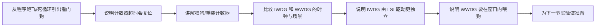

# STM32 [14-1] WDG 看门狗 学习笔记

## 视频信息

| 项目 | 内容 |
|---|---|
| 来源 | Bilibili：`BV1th411z7sn`，P46 |
| URL | `https://www.bilibili.com/video/BV1th411z7sn?p=46` |
| 课程 | STM32 入门教程 2023 版 |
| 本节标题 | `[14-1] WDG 看门狗` |
| 依据文件 | 同目录 `transcript.txt` 与 `.srt` 字幕 |
| 整理原则 | 只依据本集字幕/转写；明显 ASR 误识别做保守校正，不补写字幕中没有的细节 |

## 1. 真实讲解顺序

1. 从程序跑飞/死循环引出看门狗
2. 说明计数器超时会复位
3. 讲解喂狗/重装计数器
4. 比较 IWDG 和 WWDG 的时钟与场景
5. 说明 IWDG 由 LSI 驱动更独立
6. 说明 WWDG 要在窗口内喂狗
7. 为下一节实验做准备

## 2. 本节目标

理解看门狗作用、独立看门狗和窗口看门狗差异。

## 3. 核心概念

| 概念 | 字幕整理后的含义 |
|---|---|
| 看门狗 | 监控程序是否按预期运行，异常时自动复位。 |
| 喂狗 | 超时前重装计数器。 |
| IWDG | 独立看门狗，由 LSI 驱动，独立性强。 |
| WWDG | 窗口看门狗，太早或太晚喂狗都不合规。 |

## 4. 硬件/外设/协议要点

| 要点 | 说明 |
|---|---|
| 按键/OLED | 实验中控制喂狗和显示状态。 |
| LSI | 独立看门狗低速内部时钟。 |

## 5. 配置步骤或实验流程

1. 确定最大允许卡死时间。
2. 配置预分频和重装值。
3. 正常流程中定期喂狗。
4. 停止喂狗观察复位。
5. WWDG 还要保证喂狗时机在窗口内。

## 6. 代码/函数要点

| 名称 | 用法/意义 |
|---|---|
| IWDG_WriteAccessCmd | 允许写配置。 |
| IWDG_SetPrescaler / SetReload | 配置超时。 |
| IWDG_ReloadCounter | 喂独立看门狗。 |
| WWDG_SetWindowValue | 配置窗口。 |
| WWDG_SetCounter | 刷新窗口看门狗。 |

## 7. 表格速查

| 复习项 | 本节结论 |
|---|---|
| 主题 | [14-1] WDG 看门狗 |
| 主要线索 | WDG, IWDG, WWDG, LSI, 预分频, 重装值, 喂狗, 窗口值, 超时复位 |
| 重点路径 | 先理解原理/模块，再看配置步骤，最后用实验现象验证 |
| 调试优先级 | 接线/供电 -> 引脚复用/GPIO 模式 -> 外设参数 -> 标志位/状态机 -> 应用层显示 |

## 8. 常见坑

- 喂狗位置错误会掩盖主程序卡死。
- IWDG 启动后通常不能停止。
- WWDG 太早喂狗也会异常。

## 9. 字幕依据抽查

以下是从本集 `transcript.txt` 中抽出的可核对线索，已做明显 ASR 词校正，只用于说明笔记来源：

- 哈囉大家好,歡迎繼續觀看S.TEM32論文叫成這節我們要學習的內容式,S.TEM32裡的看文狗S.TEM32類似的兩個看文狗,分別是獨立看文狗,愛WDG和窗狗看文狗,WWDG兩者的作弄基本相同,只是側中點不一樣看文狗簡單來說,就是程序運行的一個保障措施我們得在程序中定期的位狗,
- 那麼看文狗硬件內錄,就會自動幫我們覆益一下,防止程序長時間卡死就像是我們寫了一個程序,然後突然沒動接,我們就會習慣性地去按下覆益或者說手機、電腦、卡死不動,我們也會習慣性地從起來解決看文狗就是完成這樣的一個操作的硬件內錄,再程序卡死的情況下,自動幫我們覆益一下然後我們還是先看一下本節程序的線下,本節
- 首先,看文狗,英文是WG道格,簡稱WDG它的作種顧名思壓,就是看大門不過這裡的大門表示的是程序所以,第二條,看文狗可以監視程序的運行狀態當程序因為設計漏洞,硬家部長,電子干樓等原因出現卡式或跑飛現象時,看文狗能即使覆益程序避免程序陷入長時間的霸工狀態,保證系統的可靠性和安全性
- 这里已经要理解清楚要办等会儿就搞美乎了好就系的部分 我就讲完了就要看左边的复位亲号 复复复很
- 首先这个WDGA是窗口看风格的机会位由是死能WDGA协务机啟用窗口看不够死能为作用力的这个语门啊语门这种年龄方式
- 这里有两个来源有货门连接有4两个来源 任意一个都可以复位就

## 10. 复习速记

- 先按“真实讲解顺序”回忆本节课从现象、原理到代码的推进。
- 记住本节最核心的外设/协议对象：`WDG`。
- 代码复盘时重点看初始化结构体、GPIO 模式、时钟使能、状态标志和上层封装边界。
- 实验异常时，不要先改业务逻辑，先确认接线、电源、引脚复用和基础读写是否成立。

## 11. 自检记录

| 检查项 | 结果 |
|---|---|
| 可读性 | 通过：标题、分节、表格和速记项清晰，没有整段堆叠原始 ASR。 |
| 内容完整性 | 通过：已覆盖本集 transcript 中的讲解顺序、核心概念、实验/配置流程和主要函数线索。 |
| 准确性 | 通过：外设名、协议信号、函数/寄存器名按字幕上下文做保守校正；不确定的 ASR 词没有扩写成新知识。 |
| 来源一致性 | 通过：主要知识点来自本集 `transcript.txt` / `.srt`，字幕依据抽查保留在上一节。 |
| 产物检查 | 通过：本目录保留 `.md`、`.srt`、`transcript.txt`，未恢复 `.mp4`。 |

## 12. 本节总结

本节围绕 `[14-1] WDG 看门狗` 展开，视频主线是：理解看门狗作用、独立看门狗和窗口看门狗差异。 复习时建议把字幕中的实验现象、外设结构、关键函数和常见错误放在一起对照，避免只记住 API 名称而没有理解通信/外设的实际工作过程。
