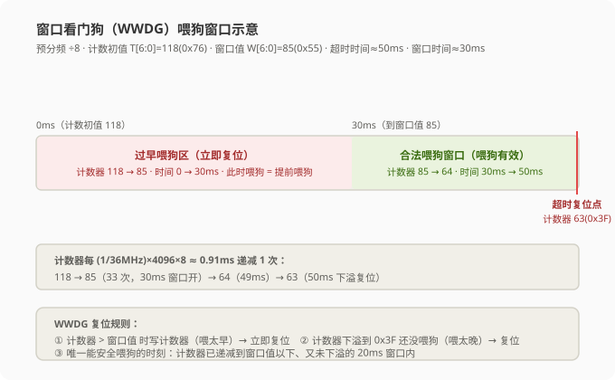
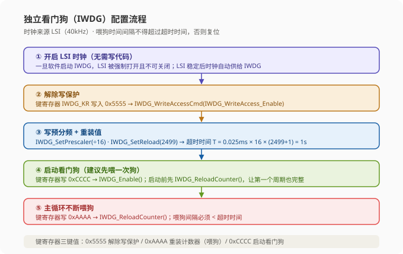
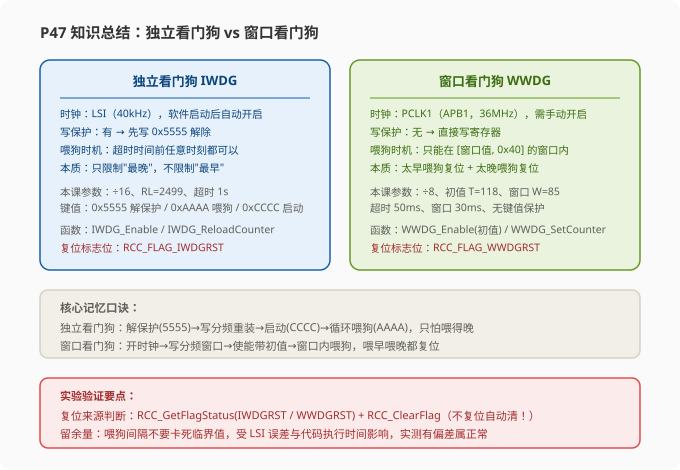

# STM32 [14-2] 独立看门狗 & 窗口看门狗 — 学习笔记

> **视频来源**: [B站 江协科技 STM32入门教程-2023版 p47 [14-2]](https://www.bilibili.com/video/BV1th411z7sn?p=47)
> **芯片型号**: STM32F103C8T6
> **前置知识**: 看门狗原理（p46 [14-1]，含独立看门狗 IWDG 与窗口看门狗 WWDG 的框图、寄存器、超时公式）、OLED 显示工程、按键与延时函数、PWR 低功耗中的复位概念
> **本节定位**: 代码实战课——在 OLED 工程基础上，分别实现独立看门狗与窗口看门狗的初始化、喂狗、复位来源判断（利用 RCC 复位标志位），并通过实验验证喂狗时机

---

## 一、课程概览

这一小节我们来学习**看门狗的代码部分**。上一节（p46）已经详细介绍了独立看门狗（IWDG）和窗口看门狗（WWDG）的原理、框图和寄存器，这一节就是动手写代码，把两个看门狗的实验做出来。

整节课的节奏是：先看硬件接线 → 搭工程 → 对照框图总结配置流程 → 逐个看库函数 → 写初始化与喂狗代码 → 下载观察现象 → 通过改参数验证喂狗时机的边界。两个看门狗的实验结构非常相似，学会独立看门狗，窗口看门狗只需要在它的工程上改一改即可。

> **提示**: 看门狗的代码本身不复杂，所以老师**不单独建模块**（不像之前那样建一个 `Buzzer.c`、`MPU6050.c` 之类），而是直接把看门狗的配置代码写在 `main.c` 主函数里。这样代码量小、看门狗配置一目了然。

---

## 二、硬件接线

打开实验原理图（14-1 看门狗实验接线图），两个看门狗代码的接线都非常简单：

| STM32 引脚 | 外设 | 说明 |
|:---|:---|:---|
| 右下角 `PB8/PB9` | OLED（I2C） | 用于显示复位来源、运行状态等实验信息 |
| 上面 `PB1` | 按键 | 用于实验时"阻塞"主循环，暂停喂狗，从而触发看门狗复位 |

> **注意**: 窗口看门狗实验的接线和独立看门狗**完全一样**——OLED 显示 + PB1 按键，硬件部分不需要任何改动，只换程序即可。老师演示时也是直接复制工程改代码，没有动接线。

---

## 三、独立看门狗实验：工程准备

回到工程文件夹，复制 OLED 显示工程的模板，把工程改名为 **"14-1 独立看门狗"**，打开工程后先编译一下，确保模板工程本身没问题。

> **关键**: 看门狗的实验程序需要在上一节的 OLED 显示工程基础上做，因为要用 OLED 显示复位标志，判断复位到底是什么原因引起的。后续所有代码都在这个工程的主函数里写。

接下来就在这个工程的基础上测试独立看门狗的功能。

---

## 四、独立看门狗配置流程（对照框图）

回到 PPT，根据上一节的资料总结独立看门狗的配置流程。对照框图从左到右看：

1. **开启时钟**：只有 LSI 时钟开启了，独立看门狗才能运行。所以使用独立看门狗之前 LSI 必须得开启。
2. **解除写保护**：写入预分频器和重装载寄存器之前，必须先解除写保护（键寄存器写 0x5555）。
3. **写入预分频和重装值**：预分频和重装值具体写多少，通过超时时间公式计算。
4. **启动独立看门狗**：配置完成之后执行启动函数（键寄存器写 0xCCCC）。
5. **主循环喂狗**：主循环里不断执行喂狗（键寄存器写 0xAAAA）。

### 4.1 为什么"开启 LSI 时钟"不用写代码？

在配置流程中，第一步"开启 LSI 时钟"这一步**并不需要我们自己写代码**。为什么？查数据手册（第六章独立看门狗小节）里有一句话：

> 如果独立看门狗已经由硬件选项或软件启动，LSI 振荡器将被强制在打开状态，并且不能被关闭。在 LSI 振荡器稳定后，时钟随即提供给 IWDG。

也就是说：**一旦我们开启独立看门狗，LSI 就会被强制打开**；等 LSI 稳定以后，时钟就自动供给独立看门狗了。所以我们这里的"开启 LSI 时钟"这一步不需要再写代码，直接进入下一步。

> **原理**: 独立看门狗的特殊之处在于它的时钟源 LSI（低速内部振荡器）是"跟狗绑定"的——狗一启用，时钟就自动跟着开。这与窗口看门狗完全不同：窗口看门狗的时钟来自 APB1（PCLK1），需要手动开启。这一点在后面写窗口看门狗时会再次对比强调。

---

## 五、独立看门狗库函数逐一看

回到代码，看看我们这些操作都对应库函数里的哪些函数。打开 `IWDG.h`，看最后面的函数声明。独立看门狗总共就这几个函数，都非常简单：

| 库函数 | 作用 | 键寄存器写入值 |
|:---|:---|:---|
| `IWDG_WriteAccessCmd()` | 写使能控制（解除/启动写保护） | 参数 Enable = `0x5555`，Disable = `0x0000` |
| `IWDG_SetPrescaler()` | 写入预分频寄存器 PR | — |
| `IWDG_SetReload()` | 写入重装载寄存器 RLR | — |
| `IWDG_ReloadCounter()` | 重新装载计数器（喂狗） | `0xAAAA` |
| `IWDG_Enable()` | 启动独立看门狗 | `0xCCCC` |
| `IWDG_GetFlagStatus()` | 获取标志位（等待写操作完成等） | — |

### 5.1 写使能控制函数

第一个函数 `IWDG_WriteAccessCmd(IWDG_WriteAccess_Enable/Disable)`，就是写使能控制。转到定义看一下，它的操作就是在**键寄存器（IWDG_KR）写入这个参数**。再看参数定义：

- `IWDG_WriteAccess_Enable` = `0x5555` —— 键寄存器写入 0x5555，就是**解除键保护（写使能）**
- `IWDG_WriteAccess_Disable` = `0x0000` —— 写入其他值（如 0x0000），就是**启动键保护（写禁止）**

所以第一个函数的参数含义就清楚了。

### 5.2 写预分频和重装值

`IWDG_SetPrescaler(预分频值)` 和 `IWDG_SetReload(重装值)` 也非常简单：写预分频值就是写 PR 寄存器，写重装值就是写 RLR 寄存器，两个都是直接往寄存器里写值。

### 5.3 喂狗函数

`IWDG_ReloadCounter()` 是重新装载计数器，也就是"喂狗"。它的操作就是在键寄存器写入 `0xAAAA`，对应手册中"重装载计数器"的操作。

### 5.4 启动函数

`IWDG_Enable()` 启动独立看门狗。不用看也知道它的操作——在键寄存器写入 `0xCCCC`。

### 5.5 获取标志位

最后一个 `IWDG_GetFlagStatus()` 获取标志位状态，这个不用多说了。

> **关键**: 记住键寄存器的三个键值——**0x5555 解除写保护、0xAAAA 喂狗、0xCCCC 启动**。库函数本质上就是在正确的时间往键寄存器写正确的键值，理解了键值就理解了独立看门狗的全部操作。

---

## 六、RCC 复位标志位：判断复位来源

除了上面的 IWDG 库函数，还要看一个 RCC 的库函数。之前实验代码里我们想知道：**曾经复位的时候，到底是看门狗导致的复位，还是上电复位、或按复位按键导致的复位？** 这个判断可以通过 RCC 的一个标志位来实现。

打开 `RCC.h`，找到我们需要用的**查看标志位的函数**，以及查看完标志位之后不要忘了调用的**清除标志位的函数**。

### 6.1 RCC 标志位能查看哪些事件？

RCC 的标志位主要分两类：

**第一类：时钟就绪（Ready）标志**——比如 HSI、HSE 等等这些时钟的 Ready，用来判断时钟是不是准备好了。这个功能我们在配置 RCC 时钟的时候已经用过了。

**第二类：各种复位标志位**（Reset Flag）：

| 标志位 | 含义 |
|:---|:---|
| `RCC_FLAG_PINRST` | 复位引脚复位（按下复位按键复位时置 1） |
| `RCC_FLAG_PORRST` | 上电复位（POR） |
| `RCC_FLAG_PDRRST` | 掉电复位（PDR，上一节 PWR 讲过） |
| `RCC_FLAG_SFTRST` | 软件复位 |
| `RCC_FLAG_IWDGRST` | 独立看门狗复位 |
| `RCC_FLAG_WWDGRST` | 窗口看门狗复位 |
| `RCC_FLAG_LPWRRST` | 低功耗复位 |

本节主要查看 **IWDGRST（独立看门狗复位）和 WWDGRST（窗口看门狗复位）** 这两个标志位，来判断复位到底是不是看门狗引起的。其余的标志位了解即可。

> **关键**: 查看标志位用 `RCC_GetFlagStatus(标志位)`，返回值是 `SET` 或 `RESET`；查看完标志位**必须调用 `RCC_ClearFlag()` 清除标志位**。为什么必须清？因为这个标志位**即使按下复位按键也不会自动清除**——如果判断之后不清理，那么下次即使是一次正常的复位按键复位，也会被误判成看门狗复位，这样判断就错了。

---

## 七、编写独立看门狗代码（一）：复位来源判断与显示

到这一步库函数都看完了，开始写代码。在初始化独立看门狗之前，先把前面的准备工作完成：

```c
#include "stm32f10x.h"                  // 设备头文件
#include "OLED.h"                       // OLED 显示
#include "Key.h"                        // 按键（最终程序使用）
#include "Delay.h"                      // 延时

int main(void)
{
    OLED_Init();                        // 初始化 OLED
    OLED_ShowString(1, 1, "IWDGTest");  // 第一行第一列显示测试程序名称

    /* 使用 RCC 查看标志位的函数，区分"独立看门狗复位"和"普通复位" */
    if (RCC_GetFlagStatus(RCC_FLAG_IWDGRST) == SET)
    {
        /* 本次复位是独立看门狗导致的 */
        OLED_ShowString(2, 1, "IWDGRST");   // 第二行显示 IWDGRST
        RCC_ClearFlag();                    // 清除复位标志位
        Delay_ms(500);                      // 停留 500ms
        OLED_Clear();                       // 清屏（显示完把字符串清除）
        Delay_ms(100);                      // 这个延时不要也行
    }
    else
    {
        /* 本次复位是普通复位（上电/复位按键） */
        OLED_ShowString(3, 1, "RST");       // 第三行显示 RST
        RCC_ClearFlag();                    // 清除复位标志位
    }
```

**这段代码逐句解释：**

- 第一行显示字符串 `"IWDGTest"`，标示这是独立看门狗的测试程序。
- `RCC_GetFlagStatus(RCC_FLAG_IWDGRST)` 查看独立看门狗复位标志位，返回值只有 `SET` 或 `RESET` 两种。
- **如果标志位 == SET**：说明本次复位是独立看门狗导致的，在第二行显示 `"IWDGRST"`，然后 `RCC_ClearFlag()` 清除标志位；停留 500ms 后把第二行的字符串清掉，再加 100ms 延时（这个延时可有可无）。
- **否则（RESET）**：说明这是一次普通的复位（上电复位或按复位按键），在第三行显示 `"RST"`。
- 两组显示分开在第二、第三行，方便区分"看门狗复位"和"普通复位"两种现象。

> **注意（重要坑点）**: 标志位判断之后**必须在 if 里面清除标志位**。根据实测，这个标志位即使按下复位按键也不会自动清零。如果你判断之后不清除它，那么下次即使是正常的复位按键复位，也会被判定成看门狗复位，这样判断结果就完全错了。

先下载看一下当前的现象：第一行显示 `IWDGTest`，按下复位按键，第三行显示 `RST`——因为此刻还没启用看门狗，所以复位一定是普通复位。确认显示正常后，继续写独立看门狗的初始化代码。

---

## 八、编写独立看门狗代码（二）：初始化与参数计算

接下来初始化独立看门狗：

```c
    /* 配置独立看门狗 */
    IWDG_WriteAccessCmd(IWDG_WriteAccess_Enable);  // ① 解除写保护（键值 0x5555）
    IWDG_SetPrescaler(IWDG_Prescaler_16);          // ② 配置预分频：16 分频
    IWDG_SetReload(2499);                          // ③ 配置重装值：2499
    IWDG_ReloadCounter();                          // ④ 先喂一次狗
    IWDG_Enable();                                 // ⑤ 启动独立看门狗

    while (1)
    {
        Delay_ms(800);                             // 喂狗间隔时间（测试用）
        IWDG_ReloadCounter();                      // 主循环不断喂狗
    }
}
```

对照配置流程逐步解释：

- **第一步（开启 LSI 时钟）**：前面讲过，启动看门狗时 LSI 会被强制打开，所以这里不需要手动写开启时钟的代码。
- **第二步（解除写保护）**：`IWDG_WriteAccessCmd(IWDG_WriteAccess_Enable)`，参数用 Enable（0x5555）解除写保护。
- **第三步（配置预分频和重装值）**：`IWDG_SetPrescaler(IWDG_Prescaler_16)` 和 `IWDG_SetReload(2499)`，具体值下面计算。
- **第四步（先喂一次狗）**：启动之前先 `IWDG_ReloadCounter()` 喂一次狗，这样启动后的第一个喂狗周期就是完整的超时时间，比较稳妥。
- **第五步（启动）**：`IWDG_Enable()` 启动独立看门狗。

> **提示**: 喂狗（Reload）或使能（Enable）的时候，会在键寄存器写入 0x5555 之外的键值，这**顺便就给寄存器启动了写保护**。所以写完寄存器之后，我们不用再手动去启动写保护了——库函数启动时已经自动写保护了。

### 8.1 预分频与重装值怎么算？

回到 PPT 看超时时间公式和时间配置表。计算之前，先确定想要的**超时时间**，这个值具体多少要根据项目要求来定。如果没有特别要求，启动后过个一两秒再复位也不影响的话，超时时间可以设得稍微大一点。

本例设定**超时时间为 1 秒（1000ms）**，即要求**喂狗时间间隔不能超过 1 秒**。

已知公式：**T = T<sub>LSI</sub> × PR × (RL + 1)**，其中 T<sub>LSI</sub> = 1/40kHz = 0.025ms，PR 为预分频值，RL 为重装值。

PR 和 RL 都是待定的数值，且它们的值可以有多组组合，并不是固定的——随着预分频系数的不同，RL 也有不同的选择。看下表（预分频与超时范围）：

| 预分频系数 | 计数频率 | 最长超时（RL 最大 4096） |
|:---:|:---:|:---:|
| ÷4 | 10kHz | 约 0.41s |
| ÷8 | 5kHz | 约 0.82s |
| ÷16 | 2.5kHz | 约 1.64s |
| ÷32 | 1.25kHz | 约 3.28s |
| ÷64 | 625Hz | 约 6.55s |
| ÷128 | 312.5Hz | 约 13.1s |
| ÷256 | 156.25Hz | 约 26.2s |

对于 1 秒的超时时间，可以看到**前两个预分频（÷4、÷8）不能选择**，因为这两个预分频下计数的最长时间都达不到 1 秒。剩下的预分频都可以选择，因为它们能覆盖的最短和最长时间都包含了 1 秒。

> **提示（选预分频的技巧）**: 在可选的预分频里，应该**优先选择预分频小的**，这样可以充分利用重装值来减小时间误差。原因：有时带入公式计算得到的 RL 是一个小数，而 RL 只能取整数，四舍五入取整就会造成误差。如果预分频小、计数快，取整后造成的误差就比较小。如果你不介意这点误差，其他预分频也都可以选——毕竟独立看门狗对时钟要求不高，而且 LSI 本身也会有较大误差。

所以对 1 秒的超时时间，**16 分频就是最佳选择**。计算 RL：

RL + 1 = 1000ms ÷ (0.025ms × 16) = 1000 ÷ 0.4 = 2500

RL = 2500 − 1 = **2499**

这个计算结果是整数，不会因为取整造成误差。回到程序，重装值必须在 0 到 0xFFF 之间（即 0~4095），2499 处于这个范围，所以直接写 2499。这样超时时间就确定好了，是 1 秒。

---

## 九、独立看门狗实验：测试喂狗时机

下载程序测试喂狗的效果。喂狗的代码在主循环里不断执行，先把喂狗的时间间隔设为 **800ms**，观察现象：按下复位按键，可以看到**除了第一次复位之外，之后都不会再复位了**——因为目前我们的喂狗时间满足要求（800ms < 1000ms）。

接着修改程序，把喂狗时间间隔改成 **1200ms** 再下载观察：可以看到这时**会不断地显示"独立看门狗复位"**——因为目前我们的喂狗时间不满足要求（1200ms > 1000ms），看门狗计数到超时还没等到喂狗，就复位了。

再看一下临界时间：直接改成 **1000ms**，可以看到对于 1000ms 它是不复位的；加大一点到 **1010ms** 试一下，可以看到这样就不行了（复位）。

> **注意**: 喂狗的临界时间大概就是 1000ms 左右。因为这个 LSI 可能有些误差，并且代码执行也需要一些时间，所以如果实测的时间和设定的不太一样，这也是正常的，只要这个时间在 1000ms 左右就行。我们一般需要**多留些时间余量**，不要卡得这么死。

---

## 十、独立看门狗最终程序：按键阻塞 + 运行指示

测试完喂狗时机，最后完善一下最终的程序。把按键功能拿过来：在最上面包含按键的头文件 `Key.h`，在主循环里调用 `Key_GetNum()` 扫描按键。**按键按住不放时主循环会阻塞**（卡在按键等待里），主循环一阻塞就不能执行喂狗，独立看门狗就会复位。

下面再来个"运行指示灯"，这样看着更清楚一点：OLED 第四行显示 `Running`，显示完再把它清除，这样反复"显示→清除"形成闪烁效果，表示程序正在正常跑。

```c
    while (1)
    {
        Key_GetNum();                        // 按键扫描：按住不放 → 主循环阻塞
        OLED_ShowString(4, 1, "Running");    // 第四行显示运行状态（闪烁指示）
        Delay_ms(200);                       // 延时 200ms
        OLED_Clear();                        // 清除（配合显示形成闪烁）
        Delay_ms(600);                       // 延时 600ms
        IWDG_ReloadCounter();                // 喂狗
    }
}
```

主循环里两个延时分别给 200ms 和 600ms，加起来主循环执行的时间大概就是 **800 多毫秒**，距离 1000ms 的超时时间还有大概 **200ms 的余量**，这就是最终的程序代码。

下载测试：正常情况下 OLED 第四行不断"闪烁显示"喂狗状态，程序不会复位；然后**按住 PB1 按键不放**，程序阻塞不能喂狗，就会引起独立看门狗复位——这就是独立看门狗的程序现象。

> **关键**: 最终程序里喂狗间隔留了 200ms 余量，这是嵌入式程序设计的常用做法——**喂狗间隔要离超时时间远一些**，否则任何一点时序抖动（中断、显示耗时）都可能让程序意外复位。给看门狗留余量，就像给工程留安全裕量。

---

## 十一、窗口看门狗实验：工程与代码框架修改

第一个代码到这里就讲完了。接下来学习下一个代码——**窗口看门狗**。回到工程文件夹，复制一下独立看门狗的工程，在这个工程基础上修改，改名为 **"14-2 窗口看门狗"**，打开工程。

其实这两个看门狗的代码结构差不多，我们直接在这里改一下：

1. **初始化显示字符串**：`"IWDGTest"` 改成 `"WWDGTest"`。
2. **复位标志位判断**：转到定义看一下，选择 `RCC_FLAG_WWDGRST`（窗口看门狗复位标志位），显示字符串也改成 `"WWDGRST"`。
3. **删掉独立看门狗复位判断代码**：待会儿在这里对应写上窗口看门狗的复位判断。
4. **删掉独立看门狗喂狗**：待会儿写上窗口看门狗的喂狗。

这样窗口看门狗的代码框架就改好了，先编译一下确认没有问题。

---

## 十二、窗口看门狗配置流程（对照框图）

回到 PPT 看窗口看门狗的配置流程，先看框图：

1. **开启 APB1 时钟**：因为窗口看门狗的时钟来源是 **PCLK1（APB1）**，所以第一步需要**我们自己**开启窗口看门狗（WWDG）的 APB1 时钟。这一点与独立看门狗不同——独立看门狗的 LSI 时钟是自动开启的，而窗口看门狗必须手动开。
2. **配置各计数器、比较值、预分频和窗口值**：窗口看门狗**没有写保护**，所以第二步可以直接写这些寄存器。
3. **写入控制寄存器 CR**：控制寄存器 CR 包含看门狗使能位、计数器值和计数器有效位，这些东西需要一起设置，放在第三步统一执行。
4. **主循环喂狗**：在主循环中不断向计数器写入想要的装载值，就可以进行喂狗。

### 12.1 窗口看门狗库函数一览

流程看完，再看一下库函数。打开 `WWDG.h`，这些是窗口看门狗的函数：

| 库函数 | 作用 |
|:---|:---|
| `WWDG_DeInit()` | 恢复默认配置 |
| `WWDG_SetPrescaler()` | 写入预分频器 |
| `WWDG_SetWindowValue()` | 写入窗口值（与预分频函数配套使用） |
| `WWDG_EnableIT()` | 使能中断（只有一个中断源，所以不需要指定中断号） |
| `WWDG_SetCounter()` | 写入计数器（喂狗就用这个函数） |
| `WWDG_Enable()` | 使能窗口看门狗 |
| `WWDG_GetFlagStatus()` / `WWDG_ClearFlag()` | 获取 / 清除比较位标志（EWIF） |

### 12.2 为什么 `WWDG_Enable()` 也有一个参数？

注意 `WWDG_Enable()` 这个使能函数**还有一个参数**，并且和上面 `WWDG_SetCounter()` 的参数是一样的（都是计数器初值）。为什么这么设置？

上一节（p46）最后讲过：因为**计数器是自由运行状态**，一旦使能的时候，计数器可能是任何值。为了避免**刚一使能就立马复位**，所以我们在使能的时候，需要**顺便同时喂狗**。在库函数里的体现就是：使能函数里也有一个参数，需要指定使能的时候喂狗多少。

> **原理**: 窗口看门狗启动瞬间，计数器如果刚好处于很低的数值（接近 0x3F 下溢点），那么下一秒就复位了，程序根本来不及喂狗。所以使能时必须"顺手"把计数器重新装到一个安全的高值——这正是 `WWDG_Enable(初值)` 参数存在的意义：**使能的同时完成第一次喂狗**。

---

## 十三、窗口看门狗参数计算

回到 PPT，这里有窗口看门狗的超时时间公式。在计算之前，根据项目要求确定想要的**超时时间**和**窗口时间**。这里测试的话就自己随便定：设定**超时时间为 50ms**，**窗口时间为 30ms**。

### 13.1 确定预分频和计数器初值

首先要确定预分频系数。看手册的时间配置表，想要设置 50ms 的超时时间，**只能选择最后一个预分频（÷8）**——因为只有 ÷8 的时间范围包含 50ms，前面三个（÷1、÷2、÷4）都记不了这么久。

> **注意**: 窗口看门狗的时间上限是固定的。如果想设置 60ms 的超时时间怎么办？从表来看，窗口看门狗最大只能记 **58.25ms**，再长就超出能力范围了。除非改变 PCLK1 的时钟频率，不过并不建议这样做——系统的 APB1 时钟是固定的，别为看门狗去动系统时钟。

预分频确定：**WDGTB = 3，分频系数 = 2³ = 8**。

- T<sub>PCLK1</sub> = 1/36MHz ≈ 27.8ns
- 每个计数周期 = 27.8ns × 4096 × 8 ≈ 0.91ms

接着算计数器初值 T[5:0]。超时时间 50ms，打开计算器：

T[5:0] + 1 = 50ms ÷ 0.91ms ≈ 54.95，取整为 **55**

T[5:0] = 55 − 1 = **54**

这里取整会有一点点误差，但把 T[5:0] 定为 54 后，实际超时时间 = 55 × 0.91ms ≈ 50.05ms，正好满足 50ms 的要求。这样**超时时间的参数就确定下来了：预分频给 8，T[5:0] 给 54**。

### 13.2 计算窗口值

窗口时间确定之后，窗口值就简单了。窗口时间为 30ms：

窗口对应计数个数 = 30ms ÷ 0.91ms ≈ 33

W[5:0] = T[5:0] − 33 = 54 − 33 = **21**

所以窗口值 W[5:0] 需要给 21。窗口打开时计数器已经递减了 33 次，即 30ms 之后窗口打开，一直开到 50ms 超时，这中间的 20ms 就是合法的喂狗窗口。

### 13.3 计数器与窗口值的 T6 位（计数器有效位）

计数器初值 T[5:0] = 54 只是低 6 位的值。看 PPT 框图，**还有一个 T6 位（计数器有效位）也必须要设置为 1**。所以在 54 的基础上需要**或上 0x40**，也就是把计数器最高位的 T6 位设置为 1：

```c
54 | 0x40    // = 118，写入 CR 的 T[6:0]
```

同理，窗口值 W[5:0] = 21，它也有一个 **W6 位需要或上 0x40 置 1**：

```c
21 | 0x40    // = 85，写入 CFR 的 W[6:0]
```

> **提示**: 这里用按位或（`|`）或者用加法（`+64`）效果都一样，因为 54（和 21）这个值比较小，二进制最高位本来就是 0，没有"或"到那个位上，所以"或"和"加"的结果完全一致。

---

## 十四、编写窗口看门狗代码

回到主函数，来初始化窗口看门狗：

```c
    /* ① 开启 APB1 外设时钟（必须手动写） */
    RCC_APB1PeriphClockCmd(RCC_APB1Periph_WWDG, ENABLE);

    /* ② 设置预分频和窗口值 */
    WWDG_SetPrescaler(WWDG_Prescaler_8);   // 预分频 8
    WWDG_SetWindowValue(21 | 0x40);        // 窗口值 W[6:0] = 85（21 + T6 位）

    /* ③ 使能窗口看门狗（带初值，使能的同时喂狗） */
    WWDG_Enable(54 | 0x40);                // 计数器初值 T[6:0] = 118（54 + T6 位）

    while (1)
    {
        OLED_ShowString(4, 1, "Running");  // 显示运行状态
        Delay_ms(20);
        OLED_Clear();                      // 清除
        Delay_ms(20);
        WWDG_SetCounter(54 | 0x40);        // ④ 主循环喂狗（写相同的计数器值）
    }
}
```

**代码解释：**

- **① 开时钟**：`RCC_APB1PeriphClockCmd(RCC_APB1Periph_WWDG, ENABLE)`——窗口看门狗挂在 APB1 总线上，这一步必须自己写（对比独立看门狗自动开 LSI）。
- **② 配置**：预分频 8；窗口值写 `21 | 0x40`（W6 置 1）。WWDG 没有写保护，所以直接写寄存器，不需要解除写保护。
- **③ 使能**：`WWDG_Enable(54 | 0x40)`——把计数器初值 118 作为参数传进去，使能的同时完成第一次喂狗。
- **④ 主循环喂狗**：`WWDG_SetCounter(54 | 0x40)`——窗口看门狗没有"重装载寄存器"，它是**通过直接写计数器来实现喂狗**的。使能的时候需要手动写入初值，喂狗的时候也需要不断写入初值，所以把 `54 | 0x40 = 118` 写入到这里。

> **关键**: 窗口看门狗喂狗的本质就是"把计数器重新装回初值"。当前配置下超时时间 50ms、窗口时间 30ms，所以**主循环喂狗时机必须控制在 30ms ~ 50ms 之间**——早了窗口还没开，晚了计数器已经下溢。

### 14.1 使能位 WDGA 与"读改写"操作

控制寄存器 CR 还有一个最高位 **WDGA 使能位**。看一下库函数对使能位是怎么操作的：

- `WWDG_Enable()` 的实现是设置 `0x80`，也就是把 CR 最高位（WDGA）置 1，看门狗使能。
- `WWDG_SetCounter()` 这类写计数器值的操作，在写入 CR 之前会先做**位屏蔽（Mask = 0x7F）**，把最高位清零，再写入计数器值——这样写计数器时不会碰到最高位的 WDGA 使能位。

于是有个疑问：喂狗写计数器时把最高位写成 0，会不会同时把看门狗给关掉了？**完全不用担心**——因为上一小节说过，**一旦使能看门狗之后，看门狗是不能再被关闭的**。所以即使写计数器时高位写入 0，这个操作也是无效的，WDGA 位仍然是 1。

这里顺带介绍一下**读改写（Read-Modify-Write）**操作，在函数库中非常常见。一个典型的读改写操作分三步：

1. **先把寄存器读到临时变量里**；
2. **用按位与（&）/按位或（|）的操作改变临时变量的指定几位**；
3. **把临时变量写回到寄存器**。

这样做的好处有三点：一是可以**单独改变寄存器的某几位，而不影响其他位**；二是如果连续更改多次不同的位，这样的操作**效率比较高**；三是所有更改的位在写回寄存器的时候**同时生效**。

> **提示**: 在窗口看门狗这里，喂狗就是直接写入计数器（`WWDG_SetCounter`），**不需要再做读改写操作**——因为对最高位的 WDGA 写 0 没有任何作用（看门狗一旦使能不可关闭），所以你可以直接写低几位，不用考虑这个操作会影响到最高位的使能位。上面库函数里的掩码 `0x7F`、以及其它类似的位置，大家都可以自己再看看。

---

## 十五、窗口看门狗实验：第一次喂狗太早的 bug

目前的参数配置得完整了：超时时间 50ms，窗口时间 30ms。主循环里两个延时都是 20ms，加起来是 40ms，再加上代码执行的耗时，目前应该是 40 多毫秒——只要不超 50ms 就行。

**不过目前的程序其实是有问题的**，大家能看出问题在哪吗？先看实验现象：下载运行，可以看到**目前一直都在触发窗口看门狗复位**。为什么？

我们主循环一直以 40 多毫秒的间隔喂狗，是处于 30~50ms 这个合法范围的，为什么会一直触发复位呢？问题就在**这两条语句的执行时序**：程序执行到 `WWDG_Enable(118)` 时，窗口看门狗同时执行了**第一次喂狗**；然后很快就执行到循环体里的 `WWDG_SetCounter(118)`，执行了**第二次喂狗**。这里到这里的时间间隔**肯定小于 30ms**——于是**喂狗太快了**（太早），此时计数器还高于窗口值，窗口还没打开，所以看门狗会立刻复位。下载运行到第一次喂狗之后立刻复位，就这样陷入了"复位→喂狗→复位"的死循环。

> **注意（本节最大的坑）**: 使能函数里已经"顺便"喂了第一次狗，如果主循环开头紧接着又喂第二次狗，两次喂狗几乎连在一起，间隔远小于窗口时间 30ms，就属于**提前喂狗**——在窗口打开之前喂狗会**立即复位**，这正是窗口看门狗和独立看门狗最大的区别：独立看门狗只怕喂晚了，窗口看门狗**喂早了、喂晚了都会复位**。

**解决方法**：把喂狗的代码**放在延时之后**就行了。第一次喂狗在使能时（t=0），先经过 40 多毫秒的延时，再执行第二次喂狗（t≈40ms），此时计数器已递减到窗口值以下，喂狗合法。这样就能避免第一次和第二次喂狗时间过短的问题。

> **提示（另一种写法）**: 如果你觉得"使能第一次喂狗"和"下面第二次喂狗"之间的时序不好把握，也可以把使能的代码和下面的喂狗放在一起，并且加到一个 if 判断变量里作为判断：**如果是第一次进入，就只剩下"使能顺便喂狗"这一条程序；如果不是第一次进入，就只剩下单独喂狗这一条程序**。这样写也行。

修改代码后重新下载测试，可以看到**现在程序就没有复位了**。

---

## 十六、窗口看门狗实验：验证窗口边界

现在程序不复位了，说明 40ms 的喂狗间隔在合法窗口内。接下来验证窗口值和超时时间的边界。过早喂狗（窗口）这边不太好模拟，我们直接改程序：

1. **验证窗口值（最快喂狗时机）**：目前喂狗间隔是 40ms（OLED 显示也是比较耗时的）。先注释掉延时，直接把喂狗间隔改成 **30ms**——这是最快的窗口值。下载观察：可以看到**现在不断复位**，说明 30ms 是过快喂狗了（喂得太早，窗口还没打开）。加到 **31ms** 再试：可以看到**已经不复位了**，说明 31ms 是没问题的。这就说明**最快喂狗的窗口值确实是 30ms 左右**。

2. **验证超时时间（最晚喂狗时机）**：把延时改成 **50ms** 试一下：可以看到目前**已经再次复位**了——喂得太晚，计数器已经下溢。改小点到 **49ms** 再试一下：可以看到**目前就不复位了**。这说明**超时时间确实是 50ms 左右**。

> **原理**: 为什么 30ms 复位、31ms 就不复位？因为窗口值 W[6:0] = 85 对应的时间点就是 30ms——计数器从 118 递减到 85 需要 33 个计数周期（约 30ms）。30ms 喂狗时计数器还刚好在 85 附近，稍有抖动就高于窗口值，触发"提前喂狗"复位；31ms 时计数器已经稳定低于 85，进入合法窗口。同理，50ms 时计数器已下溢到 0x3F，49ms 时还差一个周期才下溢，所以 49ms 能救回来。

通过这两个实验，就**大致验证了我们计算参数的正确性**。其他时间的参数大家可以在自行计算后，再验证一下。

---

## 十七、独立看门狗 vs 窗口看门狗

两种看门狗都学完了，最后把它们的区别整理成一张表：

| 对比项 | 独立看门狗（IWDG） | 窗口看门狗（WWDG） |
|:---|:---|:---|
| 时钟来源 | LSI（40kHz），启动后**自动开启** | PCLK1（APB1，36MHz），**需手动开启** |
| 是否需解写保护 | 有写保护，先写键值 0x5555 | 无写保护，直接写寄存器 |
| 喂狗方式 | 键寄存器写 0xAAAA（重装载计数器） | 直接写计数器 CR 的 T[6:0] |
| 喂狗时机 | 超时前**任意时刻**喂狗都行 | 只能在**窗口值~下溢点**之间喂狗 |
| 复位条件 | 超时（喂太晚）复位 | 喂太早复位 + 喂太晚复位 |
| 超时时间调节 | 预分频 PR + 重装值 RL | 预分频 WDGTB + 计数器初值 T[5:0] |
| 本课参数 | ÷16、RL=2499、超时 1s | ÷8、T=118、W=85、超时 50ms |
| 复位标志位 | `RCC_FLAG_IWDGRST` | `RCC_FLAG_WWDGRST` |
| 时间上限 | 可到几十秒（LSI 较慢） | 最大约 58.25ms（受 PCLK1 限制） |



> **关键**: 一句话概括两者区别——**独立看门狗只限制"最晚"（别超过超时时间才喂狗），窗口看门狗既限制"最早"又限制"最晚"（必须在窗口内喂狗）**。所以窗口看门狗对喂狗时机的要求更苛刻，适合对程序运行节奏要求更严格的场景。

---

## 十八、知识总结



### 本节核心脉络

1. **硬件接线**：OLED（右下角，显示信息）+ PB1 按键（阻塞喂狗），两个实验接线相同，只改程序。
2. **独立看门狗配置流程**：LSI 时钟自动开启 → 解除写保护（0x5555）→ 写预分频 + 重装值 → 启动（0xCCCC）→ 主循环喂狗（0xAAAA）。
3. **复位来源判断**：`RCC_GetFlagStatus(RCC_FLAG_IWDGRST / WWDGRST)` 查看复位标志，判断后**必须 `RCC_ClearFlag()` 清除**（该标志位按复位键不会自动清零）。
4. **IWDG 参数计算**：T = 0.025ms × PR × (RL+1)，1s 超时选 ÷16，RL = 2499；实测临界喂狗间隔约 1000ms，要留余量。
5. **WWDG 配置流程**：手动开 APB1 时钟 → 写预分频 + 窗口值（无写保护）→ `WWDG_Enable(初值)` 使能并顺便喂狗 → 主循环 `WWDG_SetCounter(初值)` 喂狗。
6. **WWDG 参数计算**：T[5:0] = 超时时间÷计数周期 − 1 = 54，W[5:0] = T[5:0] − 窗口计数 = 21，两个都要或上 0x40 置 T6/W6 位。
7. **WWDG 喂狗时机**：必须在窗口值~下溢点（30~50ms）之间喂狗，过早喂狗立即复位、过晚喂狗下溢复位——实验用 30/31ms 验证窗口，50/49ms 验证超时。



### 记忆口诀

- **独立看门狗**：解保护（5555）→ 写分频重装 → 启动（CCCC）→ 循环喂狗（AAAA），**只怕喂得晚**，喂狗留余量。
- **窗口看门狗**：开时钟 → 写分频窗口 → 使能带初值 → 窗口内喂狗，**喂早喂晚都复位**。
- **复位判断**：GetFlagStatus 查看，ClearFlag 清除，**不清理就会误判**。

---

*笔记生成时间: 2026-08-06 | 基于 B站视频 BV1th411z7sn p=47 转录*
