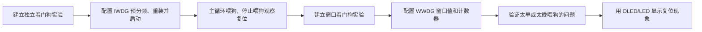

# STM32 [14-2] 独立看门狗 & 窗口看门狗 学习笔记

## 视频信息

| 项目 | 内容 |
|---|---|
| 来源 | Bilibili：`BV1th411z7sn`，P47 |
| URL | `https://www.bilibili.com/video/BV1th411z7sn?p=47` |
| 课程 | STM32 入门教程 2023 版 |
| 本节标题 | `[14-2] 独立看门狗 & 窗口看门狗` |
| 依据文件 | 同目录 `transcript.txt` 与 `.srt` 字幕 |
| 整理原则 | 只依据本集字幕/转写；明显 ASR 误识别做保守校正，不补写字幕中没有的细节 |

## 1. 真实讲解顺序

1. 建立独立看门狗实验
2. 配置 IWDG 预分频、重装并启动
3. 主循环喂狗，停止喂狗观察复位
4. 建立窗口看门狗实验
5. 配置 WWDG 窗口值和计数器
6. 验证太早或太晚喂狗的问题
7. 用 OLED/LED 显示复位现象

## 2. 本节目标

编写独立看门狗和窗口看门狗实验，验证超时复位和窗口喂狗规则。

## 3. 核心概念

| 概念 | 字幕整理后的含义 |
|---|---|
| IWDG 实验 | 超时前 ReloadCounter 就不复位。 |
| WWDG 实验 | 必须等计数器进入窗口后刷新。 |
| 复位判断 | 通过显示初始化状态或复位标志观察。 |
| 时间参数 | 预分频、重装值、窗口值决定区间。 |

## 4. 硬件/外设/协议要点

| 要点 | 说明 |
|---|---|
| 按键 | 控制喂狗或制造延时。 |
| OLED/LED | 观察是否复位。 |
| 内部看门狗 | 不依赖外部模块。 |

## 5. 配置步骤或实验流程

1. IWDG：写访问、预分频、重装、Reload、Enable。
2. 主循环定期喂狗，加入长延时制造超时。
3. WWDG：开启时钟，配置预分频、窗口值、计数器。
4. 在合法窗口内刷新。
5. 改变时机观察复位。

## 6. 代码/函数要点

| 名称 | 用法/意义 |
|---|---|
| IWDG_ReloadCounter | 独立看门狗喂狗。 |
| IWDG_Enable | 启动独立看门狗。 |
| WWDG_Enable | 启动窗口看门狗。 |
| WWDG_SetCounter | 刷新 WWDG。 |
| RCC_GetFlagStatus | 辅助判断复位来源。 |

## 7. 表格速查

| 复习项 | 本节结论 |
|---|---|
| 主题 | [14-2] 独立看门狗 & 窗口看门狗 |
| 主要线索 | WDG, IWDG, WWDG, LSI, 预分频, 重装值, 喂狗, 窗口值, 超时复位 |
| 重点路径 | 先理解原理/模块，再看配置步骤，最后用实验现象验证 |
| 调试优先级 | 接线/供电 -> 引脚复用/GPIO 模式 -> 外设参数 -> 标志位/状态机 -> 应用层显示 |

## 8. 常见坑

- 调试断点可能导致看门狗复位。
- 窗口上下限要算清楚。
- 一直复位时先拉长超时时间。

## 9. 字幕依据抽查

以下是从本集 `transcript.txt` 中抽出的可核对线索，已做明显 ASR 词校正，只用于说明笔记来源：

- 打开状态并且不能被关闭在RSR正道气稳定后十中顾应给RWDG这一次就说
- 我们就是写入预分明器和重装进入其来当然在写入这两个进入机之前不用忘了
- 这里的第二步就是解除写宝户水后第三步是写入预分明和重装值预分明和重装值距离写有多少呢
- 最后面的喊出声明独立开门狗总共有这么些喊出版来自飞上点的第一个爱WDGRatterXXX可慢的就是写死能控制可以转到第一看一下
- 接着另一种就是各种类赛特标志位其中拼类赛的就是按副一件副位的时候会自疑POR PDR就是上节讲的上电副位和调量副位稍不得外是转家副位引底判论的我去到个是独立看门口副位温德我去到个是窗口看门口副最後一个是低功耗的副位
- 那么本节主要会查看资量个独立看门口和窗口看门口的副位标志位一次来判断这个副位到底是不是看门口引起的所以这个还说大家先了解一下好到

## 10. 复习速记

- 先按“真实讲解顺序”回忆本节课从现象、原理到代码的推进。
- 记住本节最核心的外设/协议对象：`WDG`。
- 代码复盘时重点看初始化结构体、GPIO 模式、时钟使能、状态标志和上层封装边界。
- 实验异常时，不要先改业务逻辑，先确认接线、电源、引脚复用和基础读写是否成立。

## 11. 自检记录

| 检查项 | 结果 |
|---|---|
| 可读性 | 通过：标题、分节、表格和速记项清晰，没有整段堆叠原始 ASR。 |
| 内容完整性 | 通过：已覆盖本集 transcript 中的讲解顺序、核心概念、实验/配置流程和主要函数线索。 |
| 准确性 | 通过：外设名、协议信号、函数/寄存器名按字幕上下文做保守校正；不确定的 ASR 词没有扩写成新知识。 |
| 来源一致性 | 通过：主要知识点来自本集 `transcript.txt` / `.srt`，字幕依据抽查保留在上一节。 |
| 产物检查 | 通过：本目录保留 `.md`、`.srt`、`transcript.txt`，未恢复 `.mp4`。 |

## 12. 本节总结

本节围绕 `[14-2] 独立看门狗 & 窗口看门狗` 展开，视频主线是：编写独立看门狗和窗口看门狗实验，验证超时复位和窗口喂狗规则。 复习时建议把字幕中的实验现象、外设结构、关键函数和常见错误放在一起对照，避免只记住 API 名称而没有理解通信/外设的实际工作过程。
