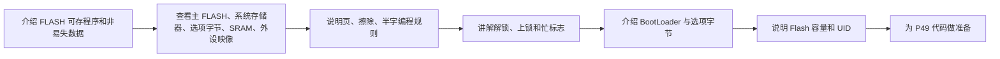

# STM32 [15-1] FLASH 闪存 学习笔记

## 视频信息

| 项目 | 内容 |
|---|---|
| 来源 | Bilibili：`BV1th411z7sn`，P48 |
| URL | `https://www.bilibili.com/video/BV1th411z7sn?p=48` |
| 课程 | STM32 入门教程 2023 版 |
| 本节标题 | `[15-1] FLASH 闪存` |
| 依据文件 | 同目录 `transcript.txt` 与 `.srt` 字幕 |
| 整理原则 | 只依据本集字幕/转写；明显 ASR 误识别做保守校正，不补写字幕中没有的细节 |

## 1. 真实讲解顺序

1. 介绍 FLASH 可存程序和非易失数据
2. 查看主 FLASH、系统存储器、选项字节、SRAM、外设映像
3. 说明页、擦除、半字编程规则
4. 讲解解锁、上锁和忙标志
5. 介绍 BootLoader 与选项字节
6. 说明 Flash 容量和 UID
7. 为 P49 代码做准备

## 2. 本节目标

理解 STM32 内部 FLASH 的存储结构、擦写规则、地址映射和器件电子签名。

## 3. 核心概念

| 概念 | 字幕整理后的含义 |
|---|---|
| 内部 FLASH | 通常存放程序，也可保存少量掉电参数。 |
| 页擦除 | STM32F103 擦除以页为单位。 |
| 半字编程 | 课程常用 16 位写入。 |
| 存储器映像 | 0x08000000 起为主 FLASH，0x20000000 起为 SRAM。 |
| 器件电子签名 | 包含容量和唯一 ID。 |

## 4. 硬件/外设/协议要点

| 要点 | 说明 |
|---|---|
| 内部 FLASH | 直接操作芯片内部存储。 |
| ST-Link Utility | 查看 FLASH 内容辅助调试。 |
| OLED | 后续显示参数或 UID。 |

## 5. 配置步骤或实验流程

1. 选择避开程序区的 FLASH 地址。
2. 写入前 FLASH_Unlock。
3. 擦除目标页。
4. 按半字写入数据。
5. 等待完成并 FLASH_Lock。
6. 读取可直接用指针访问地址。

## 6. 代码/函数要点

| 名称 | 用法/意义 |
|---|---|
| FLASH_Unlock / FLASH_Lock | 写擦前后控制。 |
| FLASH_ErasePage | 擦除页。 |
| FLASH_ProgramHalfWord | 写半字。 |
| FLASH_GetStatus | 检查状态。 |
| UID / Flash Size 地址 | 读取容量和唯一 ID。 |

## 7. 表格速查

| 复习项 | 本节结论 |
|---|---|
| 主题 | [15-1] FLASH 闪存 |
| 主要线索 | FLASH, 0x08000000, 页擦除, 半字编程, 解锁/上锁, Store, MyFlash, ST-Link Utility, Flash Size, UID |
| 重点路径 | 先理解原理/模块，再看配置步骤，最后用实验现象验证 |
| 调试优先级 | 接线/供电 -> 引脚复用/GPIO 模式 -> 外设参数 -> 标志位/状态机 -> 应用层显示 |

## 8. 常见坑

- 不要写到程序占用区。
- 写前必须擦除且粒度是页。
- 擦写次数有限，不适合高频保存。

## 9. 字幕依据抽查

以下是从本集 `transcript.txt` 中抽出的可核对线索，已做明显 ASR 词校正，只用于说明笔记来源：

- 我们学习的内容是STIM32的不耐起FLASH大家FLASH是一个通用的名字,表示的是一种非议实性,也是调量不留资的存住器
- 我们自先学习SPI的时候,用的WR5K64形片,就是一种FLASH存住器形片而本节,
- 我们所说的FLASH这特制STIM32的内部FLASH,有时候
- 下载程序调量后,肯定不会消失,对吧这说明程序存住在了一个非议实性的存住器中这个存住器,也是一种FLASH让
- 首先看一下简介第1条STIM32F1系列的扶乃习包含成续冲武器系统冲武器和选项字节三个部分通过散传冲助器接口,外色可以对成续冲武器和选项字节进行插组合边层
- 首先扶乃习包含成续冲器,系统冲器和选项字节这三个部分这个

## 10. 复习速记

- 先按“真实讲解顺序”回忆本节课从现象、原理到代码的推进。
- 记住本节最核心的外设/协议对象：`FLASH`。
- 代码复盘时重点看初始化结构体、GPIO 模式、时钟使能、状态标志和上层封装边界。
- 实验异常时，不要先改业务逻辑，先确认接线、电源、引脚复用和基础读写是否成立。

## 11. 自检记录

| 检查项 | 结果 |
|---|---|
| 可读性 | 通过：标题、分节、表格和速记项清晰，没有整段堆叠原始 ASR。 |
| 内容完整性 | 通过：已覆盖本集 transcript 中的讲解顺序、核心概念、实验/配置流程和主要函数线索。 |
| 准确性 | 通过：外设名、协议信号、函数/寄存器名按字幕上下文做保守校正；不确定的 ASR 词没有扩写成新知识。 |
| 来源一致性 | 通过：主要知识点来自本集 `transcript.txt` / `.srt`，字幕依据抽查保留在上一节。 |
| 产物检查 | 通过：本目录保留 `.md`、`.srt`、`transcript.txt`，未恢复 `.mp4`。 |

## 12. 本节总结

本节围绕 `[15-1] FLASH 闪存` 展开，视频主线是：理解 STM32 内部 FLASH 的存储结构、擦写规则、地址映射和器件电子签名。 复习时建议把字幕中的实验现象、外设结构、关键函数和常见错误放在一起对照，避免只记住 API 名称而没有理解通信/外设的实际工作过程。
