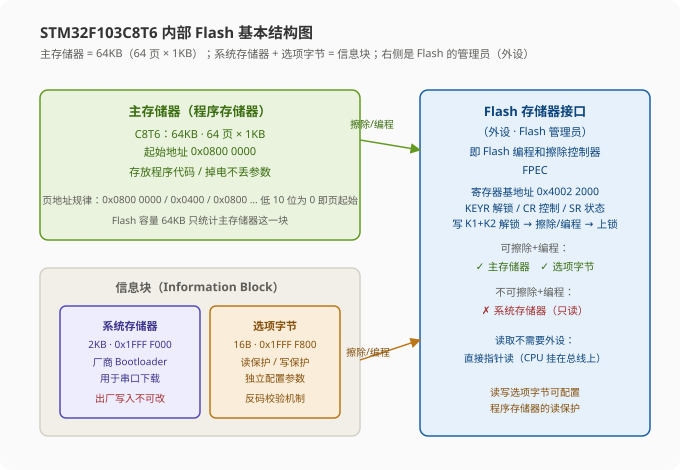
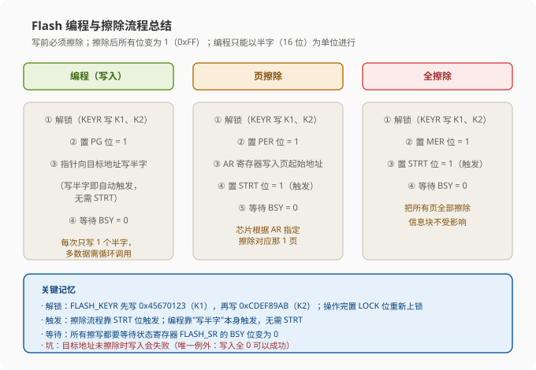
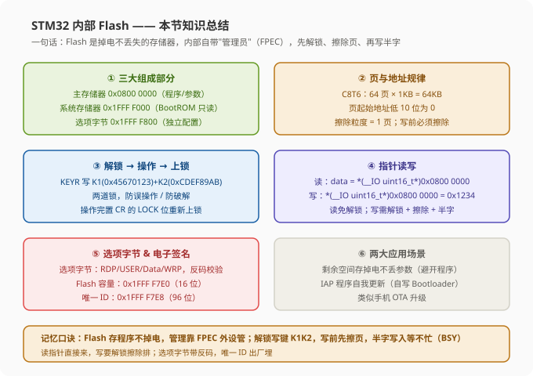

# STM32 [15-1] 内部 FLASH 闪存 — 学习笔记

> **视频来源**: [B站 江协科技 STM32入门教程-2023版 p48 [15-1]](https://www.bilibili.com/video/BV1th411z7sn?p=48)
> **芯片型号**: STM32F103C8T6
> **前置知识**: 存储器映像（p2）、SPI 外设与 W25Q64 存储芯片（p12-1 等）、独立看门狗 IWDG（p20）、C 语言指针与 volatile
> **本节定位**: 认识 STM32 内部 FLASH 的结构与特性，学习如何用程序对内部 FLASH 进行"读 / 写 / 擦除"，并顺带掌握器件电子签名（Flash 容量 + 96 位唯一 ID）的读取

---

## 一、课程概览：先认识"内部 FLASH"

老师开场先纠正一个概念：**FLASH（闪存）是一个通用的名字，它表示的是一类"非易失性"存储器——也就是掉电不丢失的存储器**。

其实在之前的课程里我们已经接触过 FLASH 了：学习 SPI 的时候，用的 **W25Q64** 芯片就是一种 FLASH 存储器芯片。而本节所说的 FLASH，**特指 STM32 的内部 FLASH**——也就是我们下载程序时，程序所存放的那个地方。

> **原理**: 为什么程序下载后，拔掉电源再重新上电，程序还在、还能正常运行？因为程序存储在一个非易失性的存储器中，这个存储器就是 STM32 内部的 FLASH。它是"掉电不丢"的，和 SRAM（运行内存，掉电丢失）形成鲜明对比。

所以本节的任务很明确：**学会用程序去读写"存放程序"的这个存储器**。读，是为了把它当作一个掉电不丢失的"仓库"来存数据；写，是为了以后能做更高级的事（比如程序自我升级 IAP）。

---

## 二、先看程序现象（两个 Demo）

本节共两个代码：

1. **15-1 读写内部 Flash**：利用内部 Flash 程序存储器的剩余空间，来存储一些掉电不丢失的参数
2. **15-2 读写芯片 ID**：非常简单的"顺便讲一下"内容，用指针读取出厂写好的 ID

### 2.1 15-1 读写内部 Flash 的现象

这个程序的目的，就是**利用内部 Flash 程序存储器的剩余空间，存储一些掉电不丢失的参数**。

为什么要把参数存到内部 Flash？老师这样解释：如果我们的配置参数需要掉电不丢失地保存，通常的做法是**外挂一个存储器芯片**（比如 W25Q64），但这样显然会增加经济成本。而 STM32 本身不就有一个掉电不丢失的存储器（Flash）吗？**我们直接把参数存在这里，是不是又方便又节省成本？**

程序大致是这样设计的（细节下节课写代码时再展开）：

- OLED 上显示 **Flash 标志**（Flash_Flag）和 **Data 数组**
- **Flash 标志**当作"标志位"用，内容随便定义，这里定义的是 `0xA5`。它的作用就是**判断之前是不是存储过数据**：如果存过，就直接读取；如果没存过，就先初始化一遍
  - 这个"先用一个标志判断有没有存过数据"的思路，和之前 RTC 课程里备份寄存器（Backup Register）的代码是一样的
- **Data 数组**就是要掉电保存的数据

操作现象：

1. 按下按键变化测试数据，**每变化一次，数据就更新存储到 Flash 里**
2. 此时 4 个数据分别是 `0x5A`、`0xF1`、`0x4?` 等等（随便变的测试值）
3. **直接把整个系统断电，再重新上电**——可以看到数据仍然存在，和之前保存的一样
4. 继续变化几次，再断电存起，数据也是存在的
5. 再按复位键，数据也不会丢失
6. 如果想清零这些数据，就按 **K2 按键**，把所有参数清零

> **关键**: 整个电路**不需要外挂任何存储芯片**，电路上也不需要增加任何新设备。利用内部 Flash 实现"掉电不丢失数据"这个功能，是一个非常灵活、非常节省成本的方案。这是内部 Flash 最典型的应用。

### 2.2 15-2 读写芯片 ID 的现象

这个代码非常简单，这节课就顺便讲一下。STM32 出厂时，在**固定的地址**下存储了出厂写入的 ID 数据，我们**直接使用指针操作的方式读取**，就可以得到 ID 了。

现象里显示两个 ID：

- **第 1 个是 Flash 容量（FlashSize）**：读出来是 `0x0040`，表示 Flash 的总量，单位是 KB。换算成十进制就是 `64`（KB），正好对应 C8T6 的 64KB Flash。如果是容量更大的芯片，读出来的数会大于 64，数据有些不一样也是正常的
- **第 2 个是唯一 ID（UID）**：96 位的芯片唯一 ID，**每个芯片的 ID 都不一样**。老师当前这块芯片读出来是这个数据，大家可以自己读取看看，肯定和老师的这个不一样

---

## 三、Flash 简介与存储器映像回顾

回到 PPT 看本节的内容，首先看简介第一条：

> **STM32F1 系列的 Flash 包含程序存储器、系统存储器、选项字节三个部分。通过 Flash 存储器接口（外设），外部可以对程序存储器和选项字节进行擦除和编程。**

这三个部分之前介绍过，老师带我们回顾一下 STM32 内部的存储空间映像：

| 区域 | 起始地址 | 存储介质 | 存放内容 |
|:---|:---|:---|:---|
| 程序存储器（主 Flash） | `0x0800 0000` | Flash（掉电不丢） | 存放程序代码 |
| 系统存储器 | `0x1FFF F000` | Flash（出厂写入） | 厂商 Bootloader，用于串口下载 |
| 选项字节 | `0x1FFF F800` | Flash | 一些独立的配置参数 |
| 运行内存（SRAM） | `0x2000 0000` | SRAM（掉电丢失） | 变量等运行数据 |
| 外设寄存器 | `0x4000 0000` | — | 各外设的寄存器 |

其中：

- **代码区就是掉电不丢失的存储介质，是 Flash**；**运行区是掉电丢失的存储介质，是 SRAM**
- **程序存储器是三者之中空间最大、最主要的部分**，所以也称**主存储器（Main Flash）**。起始地址是 `0x0800 0000` 开头，用来存放程序代码
- **系统存储器**起始地址是 `0x1FFF F000` 开头，存放厂商写好的 BootROM（启动程序），用于串口下载程序
- **选项字节**起始地址是 `0x1FFF F800` 开头，存放一些独立的配置参数

> **提示**: 这些起始地址要记下来。当你看到一个存储器的地址时，一眼就能知道它属于什么区域、有什么特性、大概是做什么的。这是看懂 STM32 一切的基石。

那么，怎么操作这些存储器呢？—— 就需要用到 **Flash 存储器接口**。这个接口是一个**外设**，是 Flash 的"管理员"。因为 Flash 的操作很麻烦，涉及到**擦除、编程、等待忙结束**等等操作，所以我们需要把"指令"和"数据"写入到这个外设的相应寄存器，然后这个外设就会**自动去操作对应的存储空间**。

> **原理**: Flash 存储器接口可以对**程序存储器和选项字节**这两部分进行擦除和编程。对比上面的三个部分，唯独没有系统存储器这个区域——因为系统存储器是**厂商出厂写入的 BootROM 程序**，是不允许我们修改的。

---

## 四、Flash 的两个应用场景

PPT 列出了"读写 Flash 的应用场景"两个图：

### 4.1 场景一：利用剩余空间保存掉电不丢失的用户数据

刚才的 Demo 就是这个用法。对我们这个 C8T6 芯片来说，程序存储器容量是 64KB，一般我们写个简单的程序，可能只占最前面的很小一部分空间，**剩下的大片空闲空间就可以利用起来**——比如存一下我们自定义的数据，这样既方便，又能充分利用资源。

> **注意**: 在选取存储区域时，**一定不要覆盖原有的程序**！要不然程序自己把自己破坏了，程序就运行不了了。一般存储少量的参数，**选最后几个扇区（页）** 就行了。至于如何查看程序所占空间的大小，下小节也会介绍。

### 4.2 场景二：在程序中编程（IAP），实现程序自我更新

前面说存用户数据时要避开程序本身，以免破坏程序；但如果我们就**非要修改程序本身**，会发生什么？这就是第二个场景——**在程序中编程（IAP），用程序来修改程序本身，实现程序的自我更新**。

> **提示**: IAP 在数码圈还有个大家更熟悉的技术叫 **OTA**（Over The Air），两者是类似的东西，都是用来实现程序升级的。但 IAP 升级程序的功能比较复杂，本课程暂时不深入设计，之后有机会再说。

这里有两个重要概念，老师重点解释：

**① ICP —— 在线（电路中）编程，更新整个程序**

ICP 是 *In-Circuit Programming* 的缩写，因为直译过来也可以叫"在电路中编程"。意思就是下载程序时，**只需要留几个引脚线连接调试器就行，不用把芯片拆下来**，就叫在电路中编程。ICP 用于更新程序存储器的**全部内容**，它通过两种途径下载程序：

- **JTAG/SWD 协议**：SWD 就是仿真器（调试器）下载程序，也就是我们一直在用的 Keil 用 ST-Link 通过 SWD 下载程序。每次下载都**把整个程序完全更新掉**
- **系统加载程序（Bootloader）**：就是系统存储器里的厂商 Bootloader，使用**串口下载**，串口下载也是更新整个程序，就是我们一直在用的串口下载方式

**② IAP —— 在程序中编程，可以灵活地只更新部分程序**

IAP 是 *In-Application Programming* 的缩写，它可以使用微控制器支持的**任意种通信接口**下载程序。怎么实现呢？

1. 我们首先需要**自己写一个 Bootloader 程序**，并且存放在程序更新时不会覆盖的地方（比如放在程序区后面）
2. 需要更新程序时，**控制程序跳转到这个自己写的 Bootloader 里**
3. 在这里面就可以接收**任意一种通信接口传过来的数据**（比如串口、USB、CAN、SPI 等等），这些数据就是待更新的程序
4. 然后控制 Flash 读写，**把收到的程序写入到前面程序正常运行的地方**
5. 写完之后，**再控制程序跳转回正常运行的地方，或者直接复位**，这样程序就完成了自我升级

> **原理**: 这个过程其实和系统存储器的 Bootloader 一样——程序要实现自我升级，在升级过程中肯定需要"自带一个辅助的小机器人（Bootloader）来临时干活"。只不过系统存储器 Bootloader 的固件只能由原厂用特定方式下载到固定位置，使用方式也不方便，只能配置出厂启动方式。而**自己写 Bootloader 的话，就可以想怎么收就怎么收，想写哪里就写哪里，想怎么启动就怎么启动**，整个升级过程程序都可以自主完成。在程序中编程更进一步，就可以直接实现远程升级了。

老师总结：有关 IAP 的内容就讲这么多，更进一步的内容大家自己研究。本节内容我们就掌握**最基本的对 Flash 的读写**，这也是实现 IAP 的基础。

---

## 五、Flash 模块组织（手册 1.2 节）

这个表是中容量产品的 Flash 分配情况。我们这块 C8T6 的 Flash 容量是 64KB，**属于中容量产品**。对小容量产品和大容量产品，Flash 的分配方式有些区别，可以参考手册。

> **注意**: Flash 这一章的内容，在手册里是**单独列出来的**，并不在之前的参考手册里。我们需要打开**《STM32F10x Flash 编程手册》**，打开之后可以看到这一个章节是单独的一章内容，别找错位置。打开 **1.2 节"Flash 模块组织"**。

### 5.1 小 / 中 / 大容量产品对比

| 产品 | 总容量 | 每页大小 | 页数 |
|:---|:---|:---|:---|
| 小容量产品 | 32KB | 1KB | 32 页 |
| 中容量产品 | 128KB | 1KB | 128 页 |
| 大容量产品 | 512KB | 2KB | 256 页 |

对于 C8T6（64KB）来说，它只有中容量产品最大容量的一半，所以页也只有一半——页地址从 `0x00` 到 `0x3F`，**总共 64 页，每页 1KB，共 64KB**。

### 5.2 页的起始地址规律

- 第一个页的起始地址，就是程序存储器的起始地址 `0x0800 0000`
- 之后一页接一页，依次顺序分配
- 每页起始地址的规律：`0x0800 0000` → `0x0800 0400` → `0x0800 0800` → `0x0800 0C00` → `0x0800 1000` → `0x0800 1400` → …… 最后一直到 `0x0800 FC00`（64KB 的最后一页）

> **关键**: 所以，只要地址是以 `0x0800 0000` / `0x0800 0400` / `0x0800 0800` / `0x0800 0C00` …… 这种"低 10 位全为 0"结尾的，**都一定是页的起始地址**。这个规律稍微记一下，以后代码里如果想指定某一页去擦除，就需要用到这个规律来算出页的起始地址。

### 5.3 三个部分与 Flash 存储器接口

继续看表：

- **系统存储器**：起始地址是 `0x1FFF F000`，容量是 2KB，之前介绍过（厂商 Bootloader）
- **选项字节**：起始地址是 `0x1FFF F800`，总共 16 个字节，但只有几个字节的位置有效，后面还会再讲到
- **Flash 存储器接口（寄存器）**：包括控制寄存器、状态寄存器等，这是一个外设，起始地址是 `0x4002 2000`，每个寄存器都是 4 字节（32 位）

> **注意**: 手册上说的"Flash 容量 64KB"，指的是**主存储器**这一块。下面信息块里的这两个东西（系统存储器和选项字节）虽然也是 Flash，但**并不统计在 Flash 容量里**。



> **原理**: 整个 Flash 分为主存储器、系统存储器、选项字节三部分。左边是 Flash 存储器接口（外设），它还有另一个名称叫 **Flash 编程和擦除控制器（FPEC）**，知道这两个名称其实是一个东西就行。这个控制器就是 Flash 的管理员，它可以对主存储器进行擦除和编程，也可以对选项字节进行擦除和编程；但系统存储器是不允许擦除和编程的。选项字节里有很大一部分配置位，其实配置的就是**主存储器的读保护**，所以右边画出的"写入选项字节，可以配置主存储器的读保护"。

---

## 六、解锁与上锁（FPEC 的安全机制）

操作 FPEC（Flash 编程和擦除控制器）来对程序存储器和选项字节进行擦除和编程，**第一步必须是解锁**。

这和之前学过的东西一脉相承：**W25Q64 写入之前需要"写使能"，独立看门狗 IWDG 写之前需要"解锁"**，目的都是防止误操作。解锁的方式也和独立看门狗一样，**通过在键寄存器中写入指定的键值**来实现。

> **原理**: 使用键寄存器的好处，就是更能防止误操作——每一个"钥匙"都必须配对正确才能完成。从英文名也能看出来：键（Key）可以译作"钥匙"的意思，所以更形象的翻译，可以把它叫做**钥匙寄存器（KEYR）**。

### 6.1 三个键值

FPEC 提供三个键值，相当于三把开锁的钥匙：

| 键值 | 数值 | 用途 |
|:---|:---|:---|
| `RDPRT` | `0xA5` | 解除读保护（RDP 解锁） |
| `KEY1` | `0x45670123` | 解锁主锁（第一步） |
| `KEY2` | `0xCDEF89AB` | 解锁主锁（第二步） |

为什么是这些值？通过手册可以看到，实际上是**随便定的**——只要规定得不是很简单、不是随便就能把锁撬开就行。

### 6.2 解锁过程

1. 复位后 FPEC 受保护，不能写入 FLASH_CR——因为保护状态下 FLASH_CR 没有使能
2. 在 **FLASH_KEYR 键寄存器**中：**先写入 KEY1，再写入 KEY2**，解锁成功

> **注意**: 这个锁是 KEYR 键寄存器设置的，怎么"开锁"呢？要先用 K1 钥匙、再用 K2 钥匙，先后都对了才能解锁成功。所以**这个锁的安全性非常高——有两道锁**：即使程序跑飞了，碰巧写对了 K1，那也难以保证下次又碰巧写对 K2。所以非人为的情况下基本不可能解锁。

**第三点，还有进一步的保护措施**：错误的操作序列会在下次复位前**锁死 FPEC 和 FLASH_CR**。它发现程序在长时间"敲锁"时，一旦没有写对，整个模块就会完全锁死，除非复位。整个解锁操作的安全性非常高。

### 6.3 上锁过程

解锁之后，操作完整后，要**尽快把 Flash 重新上锁**，以防止意外情况。上锁的操作很简单：**设置 FLASH_CR 中的 LOCK 位为 1**，就能锁住 FPEC 和 FLASH_CR。

> **关键**: 操作 Flash 的第一步就是解锁；操作完整后就上锁。记住"解锁 → 操作 → 上锁"这个铁律，跟用保险柜一样：开柜、办事、锁柜。

---

## 七、使用指针访问存储器（读 / 写）

因为 STM32 内部的存储器（包括 Flash）是**直接挂在总线上的**，所以读取某个存储器就非常简单——直接用 C 语言的**指针**来访问。这个指针的套路，在老师之前发布的指针教程里也讲过。

### 7.1 用指针读 Flash

```c
uint16_t data = *(__IO uint16_t *)0x08000000;   // 读地址 0x08000000 处的 16 位数据
```

这个代码什么意思？我们一步一步分析：

**第一步：给定要读取存储器的地址**。比如要读取 `0x0800 0000` 这个地址下的数据，就把这个地址写到这里。因为这个指针目前只指向一个元素，所以**也可以不写 `[0]`**；但是如果想对这个地址进行加减（即按数组下标访问），那就必须加上 `[0]`，并在 `[]` 里面进行加减，否则运算的优先级会有问题。总之，如果你不敢肯定各个运算符的优先级，那多加几个括号肯定是最保险的。

**第二步：这个地址前面加上强制类型转换**。把地址强制转换为 `(__IO uint16_t *)` 的指针类型：

- 想以 **16 位**的方式读取指定地址的数据 → 转换成 `uint16_t *`
- 想以 **8 位**的方式读取 → 转换成 `uint8_t *`
- 想以 **32 位**的方式读取 → 转换成 `uint32_t *`
- 想读取**浮点类型** → 转换成 `float *` 或 `double *`

这完全根据你要读取的数据类型来决定。

**第三步：认识 `__IO`（volatile）**。这个指针类型前面还加了两个下划线 `__IO`，在 Keil 的工程中它是一个宏定义，**对应 C 语言的关键字 `volatile`**。volatile 就是"易变的"数据。在这个数据类型前面加上 volatile，是一个安全保证措施——在 STM32 上（默认优化等级）没有什么影响，加这个关键字的目的，用通俗的话来说就是**防止编译器优化**。

> **原理（volatile 详解）**: Keil 编译器默认情况下是最低优化等级，这时候加不加 volatile 都没有影响。如果提高编译优化等级，就会出现问题了。编译优化有什么用？就是去除无用的冗余代码、降低代码空间、提升运行效率。但优化之后，编译器在某些地方可能会"弄巧成拙"：
> - 比如你想用**延时变量**来浪费时间做延时，编译器可能会说："你这段延时变量没什么用，还白白浪费时间，我直接给优化掉"，不知道你浪费时间了，这就容易出错。因为我们的本意就是靠浪费时间来延时，这时就可以在延时变量的定义前面加上 volatile，告诉编译器："我无论对这个变量干什么，你都原封不动地去执行，别给我优化掉。"
> - 另外，编译器还会利用**缓存**来加速代码：如果要频繁访问内存中的某个变量，最常见的优化方式就是先把变量转移到高速缓存（比如 CPU 寄存器，寄存器访问速度最快）里，再次调用就直接用缓存了，用完之后再写回内存。但**如果你的程序有多个线程**（比如中断服务函数里也修改了这个变量），那可能缓存并不知道你改了，程序还在调用缓存的变量，就会造成**数据更改不一致**的问题。这时我们的做法也是在变量定义前面加 volatile，告诉编译器："这个变量是易变的，每次访问你都得执行到位，要直接从内存里取，不要走缓存。"
> - **总结**：如果开启了编译器优化，那么"无意义但必须执行的变量、多线程更改的变量、直接访问寄存器相关的程序"都需要加上 volatile，防止被编译器优化。如果默认不开编译器优化，那就无所谓了，加不加都一样。
>
> 所以这里我们要直接访问寄存器，为了严谨，可以加上 volatile，告诉编译器："我要直接了当地访问指定程序，不要给我优化或者造成乱子。"

**第四步：解引用取值**。第二步完成之后，这里面的部分（`(__IO uint16_t *)0x08000000`）就是一个指针变量，并且这个指针已经指向了 `0x0800 0000` 这个位置。最后一步就是**使用解引用 `*` 把这个指针指向的存储器内容取出来**，取出来之后可以把它赋值给指定类型的变量，这样就完成了指定地址读取的任务。

> **关键**: 对于 Flash 的**读取**来说，是**不需要解锁**的。因为读取只是查看、不对 Flash 进行更改，读写权限很低，不用解锁直接就读。

### 7.2 用指针写 Flash

```c
*(__IO uint16_t *)0x08000000 = 0x1234;   // 向地址 0x08000000 写入 16 位数据 0x1234
```

写的意思就很明显了：左边和上面一样，先给定地址，再强制转为指针，最后指针取内容（解引用），这样就是一个"指定地址的指针"，我们直接对它赋值（比如 `0x1234`），就能完成指定地址的写功能。

> **注意**: 因为**这个语句是写入数据，并且指定的是 Flash 的地址**。Flash 在程序运行时是**只读**的，不能轻易更改。而我们本节需要对 Flash 进行更改，这个所需的权限就比较高——**需要提前解锁，并且还要套用后面的擦除流程**（下面一节讲）。
>
> 但如果你写的是 SRAM 的地址（比如 `0x2000 0000`），那可以直接写出来，因为 **SRAM 在程序运行时是可读可写的**，不需要解锁也不需要擦除流程。

好，这就是使用指针访问寄存器的示范代码：**读可以直接读；写入 Flash 需要解锁，并且执行后面的流程**。

---

## 八、Flash 编程与擦除流程

接下来看三个流程图：

1. **编程（写入）**
2. **页擦除** —— Flash 也是写入前必须擦除，擦除之后所有的数据位都变为 1（`0xFF`）；**擦除的最小单位就是 1 页**
3. **全擦除** —— 把所有页都给擦除掉

> **提示**: 这一小节的流程，**库函数已经帮我们都写好了**，我们直接调用整体的函数即可，非常简单。这里我们只大概了解一下详细步骤，研究的时候心里有数就行。按"从下往上看"的顺序，先看擦除再看编程。

### 8.1 全擦除流程

1. **读 LOCK 位**：看芯片有没有上锁
2. 如果 LOCK 位等于 1（已上锁），就执行**解锁过程**——在 KEYR 寄存器先写 K1、再写 K2
   - 如果当前没上锁就不用解锁了，这是流程图里的判断步骤
   - **在固件库中并没有这个判断**，函数是直接执行解锁过程——没锁也执行解锁，比较简单直接，效果都一样
3. 解锁之后：先置**控制寄存器 FLASH_CR 的 MER 位**为 1（全擦除使能），再置 **STRT 位**为 1
   - **STRT 位置 1 是触发条件**：STRT 置 1 之后芯片就开始干活；芯片看到 MER 位是 1，就知道接下来要干的活是全擦除，内部电路就会自动执行全擦除的过程
4. 擦除也是需要花一段时间的，所以擦除过程开始后，程序要执行等待：**判断状态寄存器 FLASH_SR 的 BSY 位**是否置 1
   - BSY 位表示芯片是否处于忙状态，BSY 位 = 1 表示芯片忙
   - 所以如果判断 BSY 等于 1，就跳转回来继续循环判断，直到 BSY 等于 0 才跳出循环，这样擦除过程就结束了
5. 最后一步写的是"**读出 Flash 中所有页的数据**"——这是**测试程序才要做的**，正常情况下擦除过程我们不验证就成功了。如果还要再读出来验证一下，这工作量太大了，所以这里的最后一步我们就不管了

### 8.2 页擦除流程

和全擦除类似：

1. 第一步一样，是**解锁**的流程
2. 第二步：置**控制寄存器 FLASH_CR 的 PER 位**为 1（页擦除使能）
3. 然后在 **AR 地址寄存器**中选择要擦除的页
4. 最后置控制寄存器的 **STRT 位**为 1（也是触发条件），STRT 置 1 后芯片开始干活
5. 芯片看到 PER 位等于 1，知道接下来要执行页擦除；但页擦除不止于"页"，芯片还需要知道**具体要擦除哪一页**，所以它会继续看 AR 寄存器的数据。AR 寄存器我们要**提前写出一个页的起始地址**，这样芯片就会把指定的那一页给擦除掉
6. 擦除开始之后也要**等待 BSY 位**，最后读出 Flash 的数据（测试用，不用看）

### 8.3 编程（写入）流程

擦除完之后，就可以执行写入的操作了。

> **注意**: Flash 在写入之前会**检查指定地址有没有擦除**：如果没有擦除就写入，Flash 不会执行写入操作（不执行编程）——**唯一的例外是写入全 0**。因为不擦除就写入可能会写入错误，但"全写入 0"的话，由于 Flash 只能把 1 写成 0（1→0 可以，0→1 不行），所以写入肯定没问题。

编程流程：

1. 第一步也是**解锁**
2. 第二步：置**控制寄存器 FLASH_CR 的 PG 位**为 1（编程使能），表示我们即将写入数据
3. 第三步：就在**指定的地址写入半字**。这一步需要用到刚才说的那句代码——用指针在指定地址写入数据，写入什么数据在这里指定即可
4. 写入数据这个代码本身就**触发开始的条件**，不需要像擦除那样置 STRT 位。半字写完之后芯片会处于忙状态，我们**等待一下 BSY 清零**，这样写入数据的过程就完成了
5. **每执行这样一个流程只能写入一个半字**，如果要写很多数据，那不断循环调用这个流程就可以了

### 8.4 数据单位与"半字编程"的讲究

在 STM32 中有几种数据单位：

| 名称 | 英文 | 位数 |
|:---|:---|:---|
| 字 | Word | 32 位 |
| 半字 | Half-word | 16 位 |
| 字节 | Byte | 8 位 |

> **关键**: Flash 的**写入工作只能以半字（16 位）的形式进行**，一次性写入两个字节。
> - 你要写入 32 位（一个字）？→ **分两次完成**
> - 你只想写入 8 位（一个字节）？→ **这就比较麻烦了**：想单独写入一个字节、还要保留另一个字节的原始数据的话，只能把**整页数据都读到 SRAM**，在 SRAM 里随意修改，改完之后**把整页擦除**，最后**把整页都写回去**
> - 所以如果你想像 SRAM 那样随心所欲地读写 Flash，最好的办法就是：**先把整一页读到 SRAM → 在 SRAM 中修改 → 擦除整页 → 整体写回去**



---

## 九、选项字节（Option Bytes）

选项字节这块"大概了解一下就行"。选项字节的地址是 `0x1FFF F800`，这一块的这些数据，总共只有 **16 个字节**。把这些寄存器展开，就是下面这个图，对应 16 个字节。

### 9.1 反码（互补）机制

其中有**一大半的名称前面都带了个 n**，比如 `RDP` 和 `nRDP`、`USER` 和 `nUSER` 等等。这个意思就是：

- 你在写入 `RDP` 数据时，要同时在 `nRDP` 写入**数据的反码**（按位取反）
- 其他的也是一样：写入这个寄存器时，要在对应的 n 寄存器写入反码，**这样写入操作才是有效的**
- 如果芯片检测到这两个寄存器不是反码的关系，就代表数据无效、有错误，对应的功能就不执行——这是一个**安全保障措施**

> **提示**: 这个写入反码的过程，硬件会自动计算并写入，不需要我们操心。用库函数的话就更简单了，都帮我们封装好了，直接调用库函数就行。

### 9.2 每个寄存器的功能

去掉所有带 n 的，就剩下 8 个字节寄存器了：

| 字节 | 名称 | 功能 |
|:---|:---|:---|
| 第 1 个 | `RDP` | 读保护配置位。写入 `RDPRT`（就是刚才说的 `0xA5`）解除读保护；如果 RDP 不是 `0xA5`，Flash 就是读保护状态，无法通过调试器读取程序，避免程序被别人窃取 |
| 第 2 个 | `USER` | 一些零散的配置位：可配置硬件看门狗、进入停机/待机模式时是否复位等等，了解一下就行 |
| 第 3、4 个 | `Data0` / `Data1` | 芯片没有定义功能，用户可自定义使用 |
| 最后 4 个 | `WRP0` ~ `WRP3` | 写保护配置 |

**写保护（WRP）的分配方式**：

- **中容量产品**：一个位对应保护 4 个扇区（页）。四个字节共 32 位，一位保护 4 页 → `32 × 4 = 128 页`，正好对应中容量产品的最大 128 页
- **小容量产品**：也是一位对应保护 4 页，但小容量产品最大只有 32KB，所以只需要一个字节 `WRP0` 就够了（`8 位 × 4 页 = 32 页`），其他三个字节用不到
- **大容量产品**：一个位只能保护 2 页，这样四个字节就不够用了，所以规定：`WRP3` 的最高位这一位，直接把**剩下的所有页**一起都保护了

### 9.3 选项字节的擦除与编程流程

因为选项字节本身也是 Flash，所以它也得擦除。手册并没有给流程图，只给了文字流程，文字流程和流程图细节上有些出入，我们抓关键部分：

**选项字节擦除流程**：

1. 第一步其实也是**解锁 Flash**（这里文字并没有写，是隐含的）
2. 文字版的流程多了一步：**检查 SR 的 BSY 位**，确认没有其他正定义的 Flash 操作——这实际上就是"忙等待"：如果当前已经在忙了，先等一下。这一步在刚才的流程图里并没有提醒
3. 然后下一步，**解锁选项字节**。选项字节里面还有一个**单独的锁**：在解锁 Flash 的时候，还需要再解锁选项字节的锁，之后才能操作选项字节
   - 整个 Flash 的锁是 `KEYR`；选项字节的小锁是下面的 **`OPTKEYR`**
   - 解锁这个小锁是另一个流程：我们需要在 OPTKEYR 里**先写 K1、再写 K2**，这样就解锁选项字节的小锁了
4. 解锁小锁之后，和之前的擦除类似：置控制寄存器 CR 的 **OPTER 位**为 1，表示即将擦除选项字节；之后置 CR 的 **STRT 位**为 1，触发硬件开始干活，硬件就会启动擦除选项字节的工作
5. **等待 BSY 位变为 0**，擦除选项字节就完成了

**选项字节编程流程**（和 Flash 写入差不多）：

1. 先检查 BSY，然后解锁小锁（OPTKEYR 写 K1、K2）
2. 之后置 CR 的 **OPTPG 位**为 1，表示即将写入选项字节
3. 再之后写入要编程的半字到指定地址（指针写入）
4. 最后**等待忙（BSY）**，这样写入选项字节就完成了

> **关键**: 选项字节的操作比普通 Flash 多了一个环节——**除了解锁 Flash（KEYR），还要解锁选项字节自己的小锁（OPTKEYR）**，两个锁都开了才能对选项字节进行擦除和编程。

---

## 十、器件电子签名（电子签名）

最后花几分钟学一下**器件电子签名**，非常简单，学完 Flash 顺便学习一下。

**电子签名存放在 Flash 存储器接口模块的系统存储器区域**（"系统存储器"区域），包含芯片识别信息，**在出厂时编写，不可更改**。使用指针读取指定地址下的存储器，就可以获取电子签名。

> **原理**: 电子签名其实就是 STM32 的 ID。它的存储区域是系统存储器——系统存储器不仅有厂商 Bootloader（BootROM），还有几个字节的 ID。系统存储器起始地址是 `0x1FFF F000`。

这里有两段数据：

| 数据 | 基地址 | 大小 | 含义 |
|:---|:---|:---|:---|
| Flash 容量寄存器 | `0x1FFF F7E0` | 16 位 | Flash 的总量，单位 KB（C8T6 读出 `0x0040` = 64KB） |
| 产品唯一标识寄存器 | `0x1FFF F7E8` | 96 位 | 每个芯片的唯一 ID，也叫"芯片身份证号" |

- 第一个是 **Flash 容量寄存器**，基地址 `0x1FFF F7E0`——通过地址也可以确定它的位置就是系统存储器。它的大小是 16 位，值就是 Flash 总量（KB）
- 第二个是**产品唯一标识寄存器**，有的也叫"每个芯片的身份证号"。数据存放的基地址是 `0x1FFF F7E8`，大小是 **96 位**，每一个芯片的这 96 位数据都不一样

> **提示（应用）**: 使用这个唯一 ID 可以做些加密的小操作。比如：可以写一个程序，**只能在指定设备运行**；也可以在程序的多处加入 ID 判断，如果不是指定设备的 ID，就不执行程序功能。这样即使你的程序被别人盗走了，放到别的设备上也难以运行。

电子签名总共就是这么多内容，非常简单。

---

## 十一、Flash 编程手册导读与重要注意事项

最后，老师带我们大概看一遍 Flash 编程手册：

- **开头是 IAP 和 ICP 的一些介绍**：对 Flash 编程实现 IAP，在量产产品时是一个非常方便的功能，有利于便捷地进行程序升级
- **一些数据定义**：小容量/中容量/大容量是什么意思、字/半字/字节的定义等等，手册里都有介绍
- **概述部分**：Flash 编程主要特点是一个比较重要的定义——**要读写 Flash，首先你得知道它是怎么分配的**，小/中/大容量的分配方式都在表里体现出来了
- **说明文字**：**正在执行写入/擦除的时候，不能同时进行读取**；写入/擦除时，必须打开 FLASH_CR 中相应的那个位，库函数第一步就已经打开了，不要去动它就行

### 11.1 设计相关（了解即可）

手册里还有一些**设计与 CPU 运行**相关的内容，比较抽象，不用过多关心，也不需要我们自己干什么：

- **预取缓冲区**：可以提前读取程序来加快代码执行
- **半周期访问**：主频较低的时候，可以开启半周期访问来加快代码执行

这些随便看看即可。

### 11.2 重要注意：编程过程中 CPU 会暂停！

Flash 编程部分里有几条说明：

- **一次只能写入一个半字**，任何非半字的数据都会产生**总线错误**
- 还有一个比较重要的注意事件：**在编程过程中，任何读写 Flash 的操作都会使 CPU 暂停，直到 Flash 编程结束**

> **原理**: 这其实是读写内部 Flash 存储数据的一个**弊端**。为什么 CPU 会暂停？因为 CPU 执行代码需要读取 Flash（程序就存在 Flash 里），而 Flash 正在被编程、读不了，所以 CPU 也就没法执行，程序就会暂停。
>
> 这会带来什么问题？—— **假如你使用内部 Flash 存储数据，同时你的中断代码又在频繁执行**。这样，读写 Flash 的时候，中断代码就无法执行，这可能导致中断无法执行。
>
> **老师的真实项目案例**：之前做的一个项目，用 STM32 去驱动一个**点阵屏**。点阵屏需要用定时器中断不断地扫描刷新，否则屏幕就不会亮。同时，老师又使用了内部 Flash 来存储一些配置参数。测试的时候就出现了问题：**一旦内部 Flash 读写，整个屏幕就会快速地闪一下**——数据量不是大问题，但非常影响用户体验。原因就是：读写 Flash 会导致中断扫描点阵屏的代码暂停，扫描一暂停，屏幕就会闪一下。所以最后只能放弃用内部 Flash 存储数据。

> **注意**: 这是 Flash 存储的一大弊端。如果你的程序里有需要**频繁执行、且对时间要求严格的中断**的话，那就要**慎用内部 Flash 来存储数据**。

### 11.3 编程流程中的注意项

- **如果目标地址没有擦除，不会执行编程，同时提出警告**；唯一的例外是写入 `0xFFFF`，这个没有问题
- **如果目标地址为写保护，也是不执行编程并提出警告**
- **页擦除**：文字版的流程和流程图一致；**整片擦除**也一样，其中有一个说明——**整片擦除时，信息块不受影响**
- **选项字节的编程**：选项字节在 FPEC 解锁后，还要再向 OPTKEYR 写入 K1 和 K2，解锁单独的小锁；这里写的是 **FPEC 会自动计算高字节的反码**，所以反码不用我们操心
- **当 Flash 有保护（读保护）时，会自动执行整片擦除**，防止代码被盗

### 11.4 反码记法（读选项字节时注意）

选项字节的组织和每个字节的定义这块可以看看，但有个注意事项：**这里的位都是用的反码记法——1 表示无效，0 表示有效**。因为 Flash 擦除之后都是 1，所以 1 会用来作为默认情况。比如写保护：**1 是默认的（不实行写保护），而 0 才是实行写保护**，这个注意一下。

### 11.5 寄存器总表

| 寄存器 | 作用 |
|:---|:---|
| `FLASH_ACR` | Flash 访问控制寄存器（预取缓存等，了解即可） |
| `FLASH_KEYR` | 键寄存器：写 K1、K2 解锁 Flash（主锁） |
| `FLASH_OPTKEYR` | 选项字节键寄存器：写 K1、K2 解锁选项字节（小锁） |
| `FLASH_SR` | 状态寄存器：表示电路工作状态，重点了解 **BSY 忙碌位** |
| `FLASH_CR` | 控制寄存器：重点了解 **LOCK**（上锁）、**STRT**（开始/触发）、**MER**（整片擦除）、**PER**（页擦除）、**PG**（编程）、**OPTER**（选项字节擦除）、**OPTPG**（选项字节编程） |
| `FLASH_AR` | 地址寄存器：配合页擦除，指定要擦除的页（写入页起始地址） |
| `FLASH_OBR` | 选项字节寄存器：把 Flash 里的选项字节内容加载进来，内容与选项字节对应 |
| `FLASH_WRPR` | 写保护寄存器：读取写保护的内容 |

### 11.6 器件电子签名手册内容

参考手册（或编程手册）里的"**器件电子签名**"章节，内容非常少：

- 电子签名是出场编写的，包含芯片识别信息
- **Flash 容量寄存器**：基地址 `0x1FFF F7E0`，里面有 16 个数据位，表示 Flash 容量（KB）
- **产品唯一身份标识寄存器**：有什么用呢？比如作为**序列号、作为密码、用来构建安全机制的认证过程**。这 96 位数据可以**字节为单位读取，也可以半字或字的方式读取**，然后基地址就是 `0x1FFF F7E8`，读出来的内容就是芯片 ID 数据

---

## 十二、知识总结



**本节课的核心脉络**：

1. **Flash 是什么**：通用的"非易失性存储器"名字，掉电不丢失。本节的 Flash 特指 STM32 内部 Flash——程序存放的地方，也可以用来存掉电不丢的参数
2. **三大组成部分**：主存储器（`0x0800 0000`，存程序，容量最大）、系统存储器（`0x1FFF F000`，厂商 BootROM，只读）、选项字节（`0x1FFF F800`，独立配置）；Flash 容量 64KB 只统计主存储器
3. **页与地址**：C8T6 共 64 页 × 1KB；页起始地址低 10 位全为 0（`0x0800 0000 / 0x0400 / 0x0800 …`）；擦除以页为单位，写前必须擦除，擦除后数据为 0xFF
4. **解锁与上锁**：KEYR 先写 K1（`0x45670123`）再写 K2（`0xCDEF89AB`）解锁；操作完置 CR 的 LOCK 位重新上锁；两道锁安全性极高
5. **指针读写**：读 `*(__IO uint16_t*)0x08000000` 免解锁；写需解锁 + 擦除 + 半字流程；`__IO` = volatile，防编译器优化
6. **编程与擦除**：编程置 PG 位写半字（自动触发）；页擦除置 PER + AR 写页地址 + STRT；全擦除置 MER + STRT；都要等待 BSY = 0
7. **选项字节**：反码（互补）校验机制；RDP 读保护（0xA5 解除）、USER 配置、Data0/1 用户自定义、WRP 写保护；操作需解锁 OPTKEYR 小锁
8. **电子签名**：Flash 容量 `0x1FFF F7E0`（16 位）、唯一 ID `0x1FFF F7E8`（96 位），出厂写入，可做加密/序列号/授权
9. **两大应用场景**：剩余空间存掉电参数（避开程序区）；IAP 程序自我更新（自写 Bootloader，类似 OTA）
10. **重要注意**：编程过程中 CPU 暂停 → 影响中断实时性（点阵屏闪烁案例）→ 慎用 Flash 存数据

**记忆口诀**：

```
Flash 存程序不掉电，管理靠 FPEC 外设管；
解锁写键 K1K2，写前先擦页，半字写入等不忙（BSY）；
读指针直接来，写要解锁擦除排；
选项字节带反码，唯一 ID 出厂埋。
```

---

*笔记生成时间: 2026-08-06 | 基于 B站视频 BV1th411z7sn p=48 转录*
