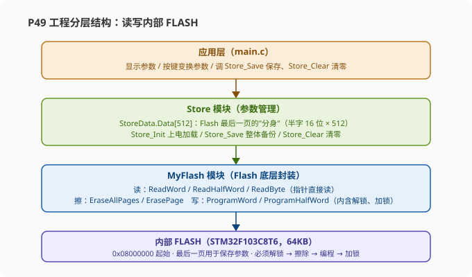
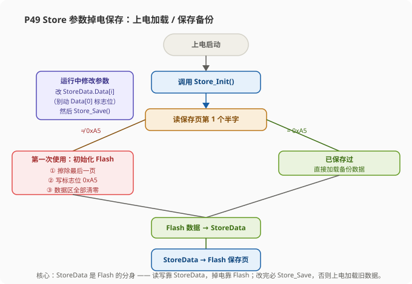
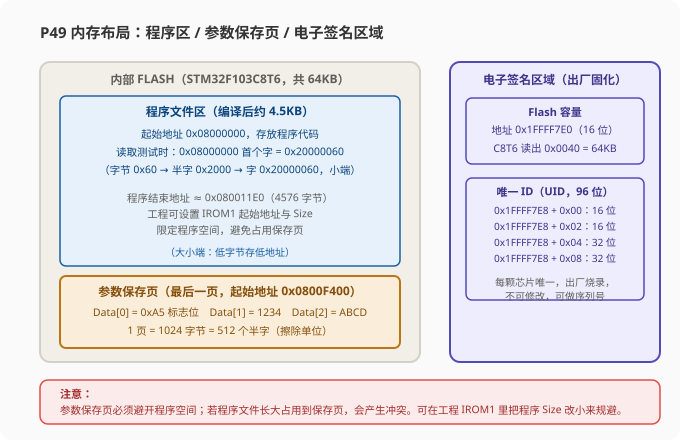
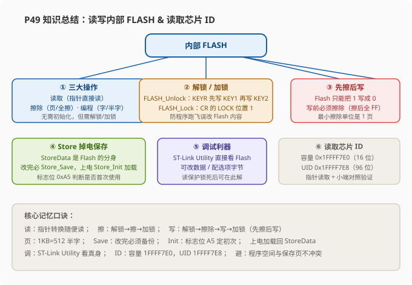

# STM32 [15-2] 读写内部 FLASH & 读取芯片 ID — 学习笔记

> **视频来源**: [B站 江协科技 STM32入门教程-2023版 p49 [15-2]](https://www.bilibili.com/video/BV1th411z7sn?p=49)
> **芯片型号**: STM32F103C8T6（64KB 内部 FLASH、20KB SRAM）
> **前置知识**: GPIO 按键与 OLED 显示、W25Q64 外挂 FLASH 芯片的读写经验、ST-Link 下载与调试（ST-Link Utility 安装见 9-6 视频）
> **本节定位**: 实战课。一是读写 STM32 内部 FLASH 实现"参数掉电不丢失"（MyFlash 底层 + Store 上层 + ST-Link Utility 可视化调试）；二是从电子签名区域读取 Flash 容量与唯一 ID（UID）

---

## 一、课程概览：两个实验程序与硬件接线

本节课要写两个实验程序，接线都非常简单：

- **程序 15-1「读写内部 FLASH」**：右下角接一个 OLED，左上角在 **PB1 和 PB11** 引脚上插两个按键（KEY1、KEY2），用于触发擦除、写入、保存等测试动作。
- **程序 15-2「读取芯片 ID」**：只接一个 OLED，能把测量结果显示出来就可以了。

面包板上已经接好：右下角 OLED、左上角两个按键。回到工程文件，复制 OLED 的工程，改名"15-1 读写内部 FLASH"，打开、编译，确认工程正常再写代码。

> **提示**: 两个程序都用到了前几课的 OLED 和按键模块（`OLED.h`、`Key.h`），直接拿 OLED 工程来改最省事。按键 KEY1=PB1、KEY2=PB11。

---

## 二、工程结构规划：MyFlash 底层 + Store 上层 + 应用层

在写代码之前，先规划一下工程结构。整个工程计划建立两个底层模块：

1. **MyFlash 模块（最底层）**：实现 FLASH 最基本的三个功能——**读取、擦除、编程（写入）**。
2. **Store 模块（在 MyFlash 之上）**：主要实现**参数数据的读写和存储管理**。因为最终应用层实现的功能是任意读写参数，并且参数掉电不丢失。至于你存在什么地方、怎么擦除、用什么存储策略，这些并不是应用层所关心的。

各层职责划分：

- 在 **Store 这一层**，我们会定义一个 `StoreData` 数据。需要掉电不丢失的参数就写到 Store 数据里，调用保存函数，Store 数据就自动备份到 FLASH；上电后，Store_Init 会自动再把 FLASH 里的数据读回到 Store 数据里。这是存储管理策略，主要就在 Store 这一层实现。
- 最后是**应用层**（操作 Store 数据的部分）：想要保存参数，就写到 Store 的数据，再调用保存的数据备份到 FLASH，这样就能实现最终功能。



---

## 三、调试利器：ST-Link Utility（直接查看 / 修改 FLASH）

本节的代码调试有一个非常强大的辅助工具：**ST-Link Utility**（9-6 视频讲过它的获取和安装方法，可以参考）。安装好之后，桌面上会有这样的图标，打开它。

使用之前，需要用 ST-Link 把 STM32 连接好，然后点击 **Connect（连接）**。连接之后，下面这个窗口里显示的就是 FLASH 里面存储的数据。

### 3.1 为什么这个工具这么方便？

之前用 W25Q64 那种外挂 FLASH 芯片时，芯片里存了什么根本看不到——只能先写入再读取，整个流程跑完没问题才算成功；一旦读取的和写入的不同，也不清楚是写入错了还是读取错了，对调试很不友好。

而本节有了这个工具，芯片里存的 FLASH 数据**一目了然**，可以单独测试读取、单独测试写入，验证程序功能非常方便，所以要充分利用好这个软件。

### 3.2 界面操作：地址、大小、数据宽度

界面里几个关键设置：

- **起始地址**：可以指定想要查看的地址，目前是 `0x08000000`，这是整个 FLASH 的基地址（程序代码的起始地址），下面的内容就从这里开始，存的就是程序代码。
- **查看长度**：从起始地址开始，总共查看多少个字节。目前 `0x10000` 就查看 64KB 的字节数。

> **原理**: 为什么 `0x10000` 就是 64KB？转十进制是 65536，再除以 1024 就得 64KB，这是进制的基础计算。

- **数据宽度**：可以设定以 32 位、16 位还是 8 位的形式显示，分别对应**字、半字、字节**。32 位就是 4 个字节显示在一个格子里；16 位是 2 个字节一个格子；8 位是 1 个字节一个格子。这就是显示模式，很好理解。

### 3.3 直接修改 FLASH 数据

这个工具还有一个更强大的功能：**可以直接任意修改 FLASH 的数据**。如果看某个数据不爽，可以先选中，再单击一下，就可以直接更改数据，改成 `0x66`，这个数据就真的变成 `0x66` 了。

当然，目前我改的是程序文件，正常程序不要随便改，会把程序破坏。从效果上看它可以任意更改数据，但是也可以想到，底层其实也是有限制地在写入——这就是 FLASH 的基本特性。

> **注意**: 通过这个软件不用写代码就能实现读取 FLASH 和写入 FLASH，适合用来测试验证。但它改的是芯片里的真实数据，改坏了程序文件芯片就"跑不动"了，需要重新下载程序才能恢复。

### 3.4 选项字节的读写

还有一个功能：选项字节（Option Bytes）的读写。打开配置界面，这里就是**读保护、用户配置部分（字节 1、字节 2）、写保护**这四个部分的配置，随便点就能配置。比如"写保护"点一下，就对应选项字节里的一个位配置。配置完之后点击应用/写入，选项字节就自动配置好了，也不用写任何代码，非常方便。

> **提示**: ST-Link Utility 对 FLASH 的读取、写入、选项字节的读写都可以可视化操作。待会儿程序实现的功能就是这个效果，测试时可以在这里对照验证。

### 3.5 救砖：读保护锁死后如何恢复

老师特别强调了一个救砖技巧：**用代码配置读保护/写保护容易把芯片锁死**。如果用代码配置了写保护，把 FLASH 给写保护了，而程序里又没有预留解除写保护的程序，锁死之后芯片就没法下载程序了——靠芯片自己肯定救不活。但可以用这个软件的配置，在选项字节配置里把读保护/写保护都去掉，再点一下应用，就能救活芯片。

> **注意**: 如果你的芯片已经被读保护/写保护锁住、无法下载程序了，记得用 ST-Link Utility 救它：连接 → 选项字节配置 → 去掉保护 → 应用/下载。

---

## 四、FLASH 基础操作与库函数解读（stm32f10x_flash）

先看一下参考手册（FLASH 编程部分）里 FLASH 的基础代码，其实并不难，就三个操作：

1. **第一个操作：读取数据**。直接把这句代码封装一下就完事了（用指针去读 FLASH 地址的内容）。
2. **第二个操作：擦除**。可以使用**全擦除**或者**页擦除**，这两个功能分别都有库函数封装好了。要记得：**擦除之前手动调用解锁函数，擦除执行完之后一般要再加锁一下**。
3. **第三个操作：编程（写入）**。也有对应的库函数，调用函数就行，但**写入之后的加锁也不要忘了**。

> **关键**: FLASH **不需要初始化**，直接操作即可。但**写入、擦除之前必须解锁，操作完成后要加锁**——防止程序跑飞时误改 FLASH 内容。

### 4.1 库函数的三部分划分：Bank1 / Bank2

打开库函数 `stm32f10x_flash.c` 和 `stm32f10x_flash.h`，头文件里就是 FLASH 的所有函数，被分成了三个部分：

1. **第一部分**：所有 F1 系列设备都可以使用的函数。
2. **第二部分**：所有设备都可以使用的新函数。
3. **第三部分**：只有 **XL 加大容量**（高密度）的设备才可以使用的函数。并且第三部分函数有个**预编译**（条件编译），只有定义了对应的宏，这些函数才是有效的。

本节只需要使用上面第一部分的函数，下面的部分都用不到。那为什么还要加下面这两部分呢？在 C 文件的前面有说明。简单来说就是：**最开始这个系列只有小容量 LD、中容量 MD 和大容量 HD**；之后加大容量 XL 产品推出，XL 直接又加了一块新的独立闪存，所以 **XL 产品总共有两块闪存**，新加的这一块叫 **Bank 2**，原来小中大容量的这一块叫 **Bank 1**。

> **原理**: "Bank 1 / Bank 2"是加大容量（XL）产品才有的概念。加大容量产品推出后，ST 又对 XL 系列进行了适配更新。函数名里带 Bank1 / Bank2 字样的，都是加大容量才会用到的。大家不要被这个"Bank"迷惑。

### 4.2 关键库函数逐个看

- **前面三个函数**：这些是说内部代码相关的，不用深入了解，也不需要我们调用，所以不用看。
- **FLASH_Unlock（解锁）**：转到定义看，是不是在 KEYR 寄存器先写 KEY1、再写 KEY2？这是解锁流程，对应参考手册里的解锁流程。
- **FLASH_Lock（加锁）**：把 CR 寄存器的 LOCK 位设置为 1，对应参考手册里的加锁操作，非常直观。
- **FLASH_ErasePage（页擦除）**：给一个页的起始地址，函数内部完成之后这一页就被擦除了，返回值是这个操作的完成状态。
- **FLASH_EraseAllPages（全擦除）**：擦除所有页。
- **FLASH_EraseOptionBytes（擦除选项字节）**：擦除选项字节。
- **FLASH_ProgramWord（编程字）**：在指定地址写入一个字（32 位）。
- **FLASH_ProgramHalfWord（编程半字）**：在指定地址写入一个半字（16 位）。

#### 返回值 FLASH_Status

可以看到下面这些操作都有返回值来告知状态。转到定义看，这是一个**枚举**。编程完成后会返回编程状态：

| 返回值 | 含义 |
|:---|:---|
| `FLASH_BUSY` | 芯片正忙 |
| `FLASH_ERROR_PG` | 编程错误 |
| `FLASH_ERROR_WRP` | 写保护错误 |
| `FLASH_COMPLETE` | 编程完全没问题，完成 |
| `FLASH_TIMEOUT` | 超时 |

> **提示**: 这就是函数返回状态的功能。编程完成后想确认操作是否落实，可以检查返回值；不想知道状态也可以不管。

#### 库函数内部流程（以页擦除为例）

拿页擦除转到定义看（内部不看的代码跳过，看主要流程）：

1. **第一步等待忙**（`FLASH_WaitForLastOperation`），可以等上一次操作完成；
2. 置 CR 寄存器的 **PER 位**（页擦除使能）；
3. **AR 写入页地址**，置 CR 的 **STRT 位**开始擦除；
4. 擦除开始后**继续等待忙**——前后都有等待，是最保险的写法；
5. 最后等待结束后把 **PER 位清零**，方便后续操作。

这就是页擦除的过程，对应参考手册里页擦除的流程。**全擦除**（`FLASH_EraseAllPages`）类似：先等待 → 置 **MER 位**（全擦除使能）→ AR 写 `0xFFFFFFFF` 置 STRT 开始 → 后等待 → 最后 **MER 位复位**防止影响后续操作。

**擦除选项字节**（`FLASH_EraseOptionBytes`）：先等待 → **解锁选项字节**（OPTWRE 位）→ 置 **OPTER 位**，再置 STRT 开始 → 等待忙。下面还有一段程序，目的是**维持读保护的原始状态**，大概了解就行了。

#### 编程函数内部流程

下面两个函数 `FLASH_ProgramWord` 和 `FLASH_ProgramHalfWord` 就分别是**在指定地址写入字和写入半字**。

先看写半字（`FLASH_ProgramHalfWord`），关键步骤：等待忙 → 置 **PG 位**（编程使能）→ 把这个地址**强制转换为指针**，在指针指向的地址写入数据 Data → 后等待 → **PG 位恢复为 0**。是不是对应参考手册里编程的过程？用指针写入，和刚才读取的写法一样。

再看写全字（`FLASH_ProgramWord`）：它是**写两次半字**——先在指定地址写入 Data 的**低 16 位**，地址 +2 再写入**高 16 位**。这就讲清楚了。

#### 选项字节的写入

选项字节有四个部分：自定义的 **Data0 和 Data1**、**写保护**、**读保护**、**用户选项**的三个配置位，就分别用这四个函数来写入：

- `FLASH_ProgramOptionByteData`：写自定义的 Data0 / Data1；
- `FLASH_EnableWriteProtection`：写保护；
- `FLASH_ReadOutProtection`：读保护；
- `FLASH_UserOptionByteConfig`：用户选项的三个配置位。

这些函数内部细节感兴趣的话自己看看。只有下面这三个**读取**选项字节的函数要了解一下：

- `FLASH_GetUserOptionByte`：获取用户选项字节当前状态；
- `FLASH_GetWriteProtectionOptionByte`：获取写保护状态；
- `FLASH_GetReadOutProtectionStatus`：获取读保护状态。

还有一个获取自定义 Data0 和 Data1 的，没有给函数，用指针访问就行了。

#### 状态与中断相关函数

- `FLASH_GetPrefetchBufferStatus`：获取预取缓冲状态，不用了解。
- 之后是 `FLASH_ITConfig`（中断配置）、`FLASH_GetFlagStatus`（获取标志位）、`FLASH_ClearFlag`（清除标志位）。
- 最后两个是 `FLASH_GetStatus`（获取状态）和 `FLASH_WaitForLastOperation`（等待上一次操作）。`FLASH_WaitForLastOperation` 内部就是等待忙——等待 BSY 位为 0。

> **提示**: 刚才看上面这些函数在执行写/擦操作时，库函数内部就已经调用了等待忙的函数了，所以最后一个等待函数并不需要我们单独调用。

---

## 五、MyFlash 模块（一）：读取

在工程中新建一个模块，模块名叫 **MyFlash**。我们要实现最开始规划的三个功能：读取、擦除、编程。MyFlash **不需要初始化**，所以直接开始写读取的部分。

### 5.1 读取函数：读字 / 读半字 / 读字节

先写一个**读取 32 位字**的函数：返回值是读取的数据，肯定是 `uint32_t` 类型；参数要指定地址，C 语言中地址都是 32 位的，所以参数也是 `uint32_t` 类型。

函数体里只需要写一句代码：把"使用指针访问存储地址"的格式复制过来——指针的地址就用形参 Address，想以 32 位字的形式读取，就把指针强制转换为 `uint32_t` 型。

```c
uint32_t MyFlash_ReadWord(uint32_t Address)
{
    return *(volatile uint32_t *)Address;    // 把地址强制转为 32 位指针，取出指针指向的字
}
```

> **原理**: 前面的 `volatile` 转到定义可以看到是 `__IO`（展开就是 `volatile`），上面还有 `__O` 也是 volatile——都是为了严谨，表现出变量的读写特性。`*(volatile uint32_t *)Address` 的意思是：把数字 Address 当作"指向 uint32_t 的指针"，再取出它指向的内容（强制转换和取值写在一行，要先 `(uint32_t *)` 再 `*`）。不加 volatile 也能正常读写，加上更严谨。

再复制两份，就能得到半字和字节的读取：

```c
uint16_t MyFlash_ReadHalfWord(uint32_t Address)    // 读取 16 位半字
{
    return *(volatile uint16_t *)Address;          // 指针强制转换为 16 位
}

uint8_t MyFlash_ReadByte(uint32_t Address)         // 读取 8 位字节
{
    return *(volatile uint8_t *)Address;           // 指针强制转换为 8 位
}
```

如果我们想以半字 16 位的形式读出来呢？形参地址必须还是 32 位的，访问时强制转换改成 16 位指针，返回值也改成 16 位，就是读取半字；以字节 8 位读取，强制转 8 位指针、返回 8 位数据，就是读取字节。

> **注意**: 这里的"地址必须都是 32 位的"与指针的类型（32/16/8 位）无关——地址是 **32 位地址空间**；只有 32 位的变量才足够传得下这么大的地址。如果你对指针的操作不熟悉，这里可能不太好理解，是一个可能有疑惑的点。

### 5.2 测试：用程序把程序代码本身读出来

把这三个函数放到头文件声明，先编译一下，没问题。然后到主函数测试。先引用库里的 OLED 头文件，`OLED_Init` 初始化，直接 `OLED_ShowHexNum` 一行一列显示：

```c
#include "stm32f10x.h"
#include "OLED.h"
#include "MyFlash.h"

int main(void)
{
    OLED_Init();

    OLED_ShowHexNum(1, 1, MyFlash_ReadWord(0x08000000), 8);      // 第 1 行：按 32 位字读
    OLED_ShowHexNum(2, 1, MyFlash_ReadHalfWord(0x08000000), 4);  // 第 2 行：按 16 位半字读
    OLED_ShowHexNum(3, 1, MyFlash_ReadByte(0x08000000), 2);      // 第 3 行：按 8 位字节读

    while (1)
    {
    }
}
```

地址给 `0x08000000`，显示长度 8 / 4 / 2 位，三个函数在第 1、2、3 行，看不同形式读出来的区别。这个测试程序非常有意思：**用程序把程序代码本身读出来**。

下载程序。注意：使用完 ST-Link Utility 要记得点按钮断开连接，否则它占用设备，下载就会出错。断开再下载，OLED 显示：

- 第 1 行读取字显示 `20000060`；第 2 行读取半字显示 `2000`；第 3 行读取字节显示 `60`。

这个数据对不对呢？用 ST-Link Utility 验证：起始地址 `0x08000000`、大小 `0x10000`，数据宽度先看 32 位——工具清晰地显示了 `0x08000000` 地址下第一个 32 位的字数据是 `0x20000060`，和 OLED 显示的一样，读取没问题。再把数据宽度设置成 16 位，第一个半字是 `0x2000`；第 3 行读的是 8 位字节，第一个字节是 `0x60`。

> **原理**: 观察数据是一小段模式成组的：以字节读取第一个就是 `0x60`；以半字读取，前两个字节组合到一起（高位在前）就是 `0x2000`；以字读取，前四个字节组合到一起就是 `0x20000060`。反过来看就是**小端存储**（低字节存低地址）。

回到代码，换个地址再测试一下，比如 `0x08000040`：以字读取是 `0x08000035`，按字节成组的数据就反过来是 `35 00 00 08`。用软件再验证：连接，按字节读取是 `35 00 00 08`，按半字读取是 `0x0035`，按 32 位读取是 `0x08000035`，没问题。这个可以理解吧？**读取的功能就验证通过了。**

---

## 六、MyFlash 模块（二）：擦除

读取测试结束，回到代码，继续写下一个功能：**擦除**。先实现一个全擦除的功能。

### 6.1 全擦除 / 页擦除

```c
void MyFlash_EraseAllPages(void)
{
    FLASH_Unlock();             // 第一步：对 FLASH 解锁
    FLASH_EraseAllPages();      // 第二步：调用库函数全擦除
    FLASH_Lock();               // 第三步：加锁
}
```

第一步对 FLASH 解锁（`FLASH_Unlock`）；第二步调用库里的 `FLASH_EraseAllPages`；第三步，擦除完成后最好再给 FLASH 加锁（`FLASH_Lock`）。这样就完成了，非常简单。

> **提示**: 封装实现的具体流程（各种位操作、等待忙等等）在库函数里已经处理好了，但**库函数并不包含解锁和加锁**，需要我们自己调用实现。库函数的返回值表示编程状态，严谨的话可以判断一下，出错时做个提醒，这里我们先不管返回值。

再实现一下页擦除：

```c
void MyFlash_ErasePage(uint32_t PageAddress)    // 参数：页地址（uint32_t）
{
    FLASH_Unlock();                             // 第一步：解锁
    FLASH_ErasePage(PageAddress);               // 第二步：调用库函数页擦除，把页地址传过去
    FLASH_Lock();                               // 第三步：加锁
}
```

参数需要给定**页的地址**，所以是 `uint32_t` 类型。同样：解锁 → 调用 `FLASH_ErasePage`（把页地址传过去）→ 加锁，页擦除函数就完成了。

### 6.2 测试：全擦除的现象

把函数放到头文件声明，编译一下看有没有问题，然后拿到主函数直接测试。先把按键的功能拿过来（`Key_Init` 初始化，`Key_Num = Key_GetNum()`）：

```c
#include "stm32f10x.h"
#include "OLED.h"
#include "MyFlash.h"
#include "Key.h"

int main(void)
{
    OLED_Init();
    Key_Init();

    OLED_ShowHexNum(1, 1, MyFlash_ReadWord(0x08000000), 8);      // 显示读取测试的数字
    OLED_ShowHexNum(2, 1, MyFlash_ReadHalfWord(0x08000000), 4);
    OLED_ShowHexNum(3, 1, MyFlash_ReadByte(0x08000000), 2);

    while (1)
    {
        uint8_t KeyNum = Key_GetNum();
        if (KeyNum == 1)                        // KEY1：全擦除
        {
            MyFlash_EraseAllPages();            // 把整个 FLASH 都擦除
        }
        if (KeyNum == 2)                        // KEY2：擦除第一页
        {
            MyFlash_ErasePage(0x08000000);      // 把 FLASH 第一页（0x400 个字节）擦掉
        }
    }
}
```

下载看一下：目前显示读取测试数字，按 KEY2 每次 OLED 都刷新，没问题；按下 KEY1——好像没反应；再按 KEY2，OLED 没刷新。

实际上按下 KEY1 的时候，**整个 FLASH 已经擦除了，程序文件不复存在**。当前 OLED 显示的数值没有消失，是因为 **OLED 有显存**，保存了最后一次显示的内容。断电重新上电，OLED 无任何显示，怎么按键都没反应——这就是 FLASH 全擦除的现象。

> **关键**: 全擦除就相当于程序做了个"自我了结"，现在整个芯片是空白的。用 ST-Link Utility 连接验证，可以看到 FLASH 里全部都是 `0xFF`，这就是全擦除的现象。

**全擦除一般不要随便玩**，要不程序全没了还得重新下载。但如果想设计安全保障——比如设备被拆机就触发全擦除，程序肯定不会被盗；程序放在"保险箱"（读保护）里，全擦除直接销毁，比放保险箱还安全，对吧。不过要按使用场景选择。注意：**全擦除之后程序没法恢复**。

### 6.3 测试：页擦除的现象

接下来试一下页擦除。重新下载程序，按下 K2 页擦除——第一页擦完了，OLED 也不刷新了，因为程序第一页没了，程序残缺没法运行。

再用 ST-Link 连接看一下：前面（第一页）都是 `0xFF`，往后翻可以看到到第二页时数据还是存在的。`0x08000400` 就是**第二页的起始地址**——这个函数只会把第一页擦掉，其他页不受影响。

现在如果想让他擦第二页，就把这个地址改成 `0x08000400`。试一下：下载，按下 K2，走到这个地址看看——第一页没被擦；`0x08000400` 开始的第二页被擦除了；`0x08000800` 开始的第三页没被擦。**页擦除的现象我们就搞明白了。**

> **提示**: 擦除的最小单位是"页"，C8T6 每页 1KB（`0x400` 字节）。给页擦除函数传哪一页的起始地址，哪一页就被擦成 `0xFF`，别的页不受影响。

---

## 七、MyFlash 模块（三）：编程（写入）

继续写下一个功能：**编程**。写两个函数。

### 7.1 写入字 / 写入半字

```c
void MyFlash_ProgramWord(uint32_t Address, uint32_t Data)    // 写入一个字（32 位）
{
    FLASH_Unlock();                     // 第一步：解锁
    FLASH_ProgramWord(Address, Data);   // 第二步：调用库函数，把地址和数据传进去
    FLASH_Lock();                       // 第三步：加锁
}
```

写入一个字，参数要两个：在哪里写（`uint32_t` 地址）、写什么（`uint32_t` 数据）。内部还是老套路：解锁 → 库函数 → 加锁。封装一层并没有太多操作，因为库函数已经封装得很完善了。

```c
void MyFlash_ProgramHalfWord(uint32_t Address, uint16_t Data) // 写入一个半字（16 位）
{
    FLASH_Unlock();                          // 第一步：解锁
    FLASH_ProgramHalfWord(Address, Data);    // 第二步：调用库函数，把地址和数据传进去
    FLASH_Lock();                            // 第三步：加锁
}
```

写半字：参数第一个是 `uint32_t` 地址，第二个因为只需要写半字，所以是 `uint16_t` 数据。同样三步完成。

> **注意**: 对于编程来说，我们就只能写到这了——只有写入字和写入半字的函数，**没有写入字节的**。因为写入字节比较麻烦，最好用"改写区域"的方式来实现，所以库函数没有写入字节的函数。

### 7.2 测试：擦除后写入最后一页

把这两个函数放到头文件声明，编译一下开始测试。写入的时候不要破坏程序本身，所以可以在 FLASH 的**最后一页**写入测试数据，这样不影响程序。对于 64KB 的 FLASH，最后一页的起始地址就是 `0x0800F400`，我们就在这个位置写入测试。

**写入之前一定要先擦除**，所以先调用页擦除，页地址填最后一页 `0x0800F400`，之后就可以写入了：

```c
#include "stm32f10x.h"
#include "OLED.h"
#include "MyFlash.h"
#include "Key.h"

int main(void)
{
    OLED_Init();
    Key_Init();

    OLED_ShowHexNum(1, 1, MyFlash_ReadWord(0x08000000), 8);   // 第一行照旧显示读取测试

    while (1)
    {
        uint8_t KeyNum = Key_GetNum();
        if (KeyNum == 1)
        {
            /* 写入之前一定要先擦除目标页 */
            MyFlash_ErasePage(0x0800F400);                 // 先擦除最后一页
            MyFlash_ProgramWord(0x0800F400, 0x11223344);   // 写入一个 32 位字
            MyFlash_ProgramHalfWord(0x0800F404, 0xABCD);   // 地址往后加一点，写入一个 16 位半字

            /* 读回验证并显示 */
            OLED_ShowHexNum(2, 1, MyFlash_ReadWord(0x0800F400), 8);
            OLED_ShowHexNum(3, 1, MyFlash_ReadHalfWord(0x0800F404), 4);
        }
    }
}
```

下载后连接 ST-Link Utility，可以看到 `0x0800F400` 和 `0x0800F404` 的写入没问题；但也可以看到之前 `0x0800F404` 和 `0x0800F400` 的数据没有了——这是因为我们在写入新数据之前又执行了页擦除，所以原来的数据就丢失了。

**这就是写入数据的测试。**

> **关键**: "先擦后写"是 FLASH 的铁律：FLASH 的存储单元只能把 1 写成 0（编程只能清 0），想把 0 变回 1 只能靠擦除（擦除把整页恢复成全 `0xFF`）。所以每次想修改数据，都要先擦除整页，再重新写入整页需要保留的数据。

到这里，FLASH 的底层代码（读取、擦除、编程）就写完了。

---

## 八、Store 模块：参数掉电不丢失

接下来完成更上层的 Store 模块，实现的功能是**参数掉电不丢失**。

### 8.1 为什么需要 Store 层？

继续在 FLASH 层之上建立一个 Store 模块，用 Store 数据来管理 FLASH 的最后一页，实现参数的任意读写和保存。因为 **FLASH 每次都是先擦除再写入，擦除之后还容易丢失数据**，所以管理数据还是靠 Store 数据，需要备份时再统一转到 FLASH 里，这是一个比较好的方案。

### 8.2 StoreData 数据结构

在 Store 模块里先定义一个 Store 数据结构体。数据类型可以定为 8 位，但为了方便还是跟 FLASH 的半字统一，用 `uint16_t` 类型。数据数量给 512：每个数据 16 位两个字节，正好对应 FLASH 的一页 1024 字节。

```c
typedef struct
{
    uint16_t Data[512];    // 512 个半字 = 1024 字节，正好对应 FLASH 的一页
} Store_Data;
```

这个代码依赖于 MyFlash，别忘了 include `MyFlash.h`。下面代码用宏 `STORE_START_ADDRESS` / `STORE_SIZE` 表示保存页地址和数据数量，宏的定义与好处在 9.1 节再讲。

### 8.3 Store_Init：首次初始化 + 上电加载

接下来写数据初始化函数 `Store_Init`。首先判断这个 FLASH 是不是第一次使用：FLASH 和 RAM 上电默认都是 `0xFF`（空白），所以第一次使用要给 FLASH 的各个存储单元都清零。判断方法就是**定一个标志位**——把 FLASH 最后一页的第一个半字当作标志位，取出后如果不等于 `0xA5`（自己随便规定的一个标志位），就说明是第一次使用，要干啥？

```c
void Store_Init(void)
{
    uint16_t i;

    /* 第一步：判断是不是第一次使用 —— 检查保存页第一个半字标志位 */
    if (MyFlash_ReadHalfWord(STORE_START_ADDRESS) != 0xA5)
    {
        /* 第一次使用：擦除 → 写标志位 → 数据区清零 */
        MyFlash_ErasePage(STORE_START_ADDRESS);                    // 把最后一页擦掉
        MyFlash_ProgramHalfWord(STORE_START_ADDRESS, 0xA5);        // 在起始地址写标志位 0xA5

        for (i = 1; i < 512; i ++)     // 注意 i 要从 1 开始而不是 0：第一个半字是标志位，剩下的才是有效数据
        {
            MyFlash_ProgramHalfWord(STORE_START_ADDRESS + i * 2, 0x0000);   // 每个半字地址 = 起始地址 + i*2，写 0 清零
        }
    }

    /* 第二步：上电加载 —— 把 FLASH 备份的数据恢复到 StoreData */
    for (i = 0; i < 512; i ++)
    {
        StoreData.Data[i] = MyFlash_ReadHalfWord(STORE_START_ADDRESS + i * 2);   // 起始地址 + i*2 依次读回
    }
}
```

注意这个循环里，每个半字的地址是：起始地址 + i*2（因为**一个半字占用两个地址**），所以 i 要乘 2。写入半字给 `0x0000`，这就是**初始化 FLASH 的过程**。

没初始化的时候，FLASH 最后一页应该全是 `0xFF`；初始化之后，最后一页的第一个半字是标志位 A5，剩下的数据全是 0。

这就是 Store 的第一大部分：**第一次使用时对 FLASH 初始化**。还有第二部分——**上电时把 FLASH 的数据转存到 Store 数据里**，实现掉电不丢失。循环 i 从 0 开始，标志位也要转到 Store 数据里：调用 `MyFlash_ReadHalfWord`（起始地址 + i*2），读出来依次放到 `StoreData.Data[i]`，把备份数据恢复到 Store 数据里。

### 8.4 Store_Save / Store_Clear

修改参数的时候，就先任意更改这个数据（除了标志位的其他数据），更改了之后把这个数据**整体备份到 FLASH 的最后一页**。所以下面再来个 `Store_Save` 备份保存函数：

```c
void Store_Save(void)
{
    uint16_t i;

    /* 保存分两步：先擦除最后一页（整页擦），再把数据整体备份到 FLASH */
    MyFlash_ErasePage(STORE_START_ADDRESS);

    for (i = 0; i < 512; i ++)
    {
        /* 每个数据的地址 = 起始地址 + i*2，数据是 StoreData.Data[i] */
        MyFlash_ProgramHalfWord(STORE_START_ADDRESS + i * 2, StoreData.Data[i]);
    }
}
```

到这里 Store 模块的代码就差不多了，画个图梳理一下：FLASH 最后一页直接读写不方便、效率低还容易丢数据，所以我们在 Store 模块里定义一个数据，**它就是 FLASH 的分身**，读写业务数据直接对 Store 数据，非常方便。

但 Store 数据要掉电丢失，需要 FLASH 配合：Store 每次更改时把数据整体备份到 FLASH，上电时再把 FLASH 里的数据加载回 Store——这样 Store 数据是不是就相当于也**掉电不丢失**了？判断 FLASH 之前有没有保存过数据就靠标志位：是 `0xA5` 说明保存过了，上电直接加载；不是 `0xA5` 说明第一次使用，先初始化再加载。



> **提示**: 这就是参数保存整体的思路。但这个思路是老师自己想的，**并不是固定的**——如果你有别的能说得通的思路，那都可以尝试实现一下。

最后，这个模块再加一个**清零函数** `Store_Clear`：数据实现了掉电不丢失，正常情况下不太方便把所有数据清零，所以加一个方便使用。

```c
void Store_Clear(void)
{
    uint16_t i;

    for (i = 1; i < 512; i ++)     // 注意 i 从 1 开始：不要把标志位清零
    {
        StoreData.Data[i] = 0x0000;    // 把每一个用户数据都归零
    }

    Store_Save();    // 清零之后一定要调用 Store_Save 同步到 FLASH
}
```

清零之后一定要记住调用 `Store_Save` 同步更新到 FLASH 里。我们**每次修改完数据后都要 Store_Save 一下**，保证数据和 FLASH 数据一样；如果你不 Store_Save，那下次上电加载的就是以前保存的数据。

### 8.5 测试：用 ST-Link 验证 FLASH 内容

到这里 Store 模块就写完了，接下来测试。头文件声明一下函数，另外 `StoreData` 也声明为外部可调用（`extern`），数据量可以不写，没有影响。

主函数测试：现在用更上层的 Store 模块，不再需要直接操作 FLASH，把 `MyFlash.h` 改成 `Store.h`，下面有关 FLASH 的操作全部删掉。上电先调用 `Store_Init()`：第一次使用触发 FLASH 初始化，然后把 FLASH 备份的数据加载回 Store 数据，实现掉电不丢失。

之后留一些按键配置的参数，按键按下后就可以存储——位置先放到 StoreData 里：`Data[0]` 是标志位千万不要动，放到数据第 1 个里放个 `0x1234`，再来个数据第 2 个放个 `0xABCD`。修改完的时候就可以放心了，一定要记得来个 `Store_Save` 把 Store 数据备份到 FLASH：

```c
#include "stm32f10x.h"
#include "OLED.h"
#include "Store.h"
#include "Key.h"

int main(void)
{
    OLED_Init();
    Key_Init();

    Store_Init();    // 上电初始化：首次使用触发 FLASH 初始化，然后把 FLASH 备份的数据加载回 StoreData

    while (1)
    {
        uint8_t KeyNum = Key_GetNum();
        if (KeyNum == 1)                       // KEY1：修改参数并保存
        {
            StoreData.Data[1] = 0x1234;        // 注意 Data[0] 是标志位，千万不要动
            StoreData.Data[2] = 0xABCD;
            Store_Save();                      // 修改完一定要 Store_Save 备份到 FLASH
        }
    }
}
```

如果现在断电，数据内容流失，但 FLASH 已保存好；再上电时 `Store_Init` 就会读回掉电前保存的数据。

现在测试一下，下载看一下（OLED 还没显示，先看 FLASH 内容是否符合预期）：ST-Link Utility 翻到最后一页，第一个数据是 A5 标志位，其他数据都初始化为 0。断开连接，按下 KEY1 备份两个数据，再连接翻一下：第 1 个半字 A5，第 2 个半字 1234，第 3 个半字 ABCD，完全符合预期。

### 8.6 最终程序现象

这次没问题了，接下来实现最终程序的现象：OLED 显示几个数据，按键变换参数、清零参数：

```c
#include "stm32f10x.h"
#include "OLED.h"
#include "Store.h"
#include "Key.h"

int main(void)
{
    OLED_Init();
    Key_Init();

    Store_Init();    // 上电加载 FLASH 里保存的参数

    while (1)
    {
        uint8_t KeyNum = Key_GetNum();

        if (KeyNum == 1)                       // KEY1：随意变换参数并保存
        {
            StoreData.Data[1] ++;              // Data[0] 是标志位，千万不要动
            StoreData.Data[2] += 2;
            StoreData.Data[3] += 3;
            StoreData.Data[4] += 4;
            Store_Save();                      // 变换好之后保存到 FLASH
        }
        if (KeyNum == 2)                       // KEY2：把所有参数清零
        {
            Store_Clear();
        }

        OLED_ShowHexNum(1, 1, StoreData.Data[0], 2);   // 第 1 行：标志位（始终是 A5）
        OLED_ShowHexNum(2, 1, StoreData.Data[1], 4);   // 第 2 行：Data1
        OLED_ShowHexNum(2, 6, StoreData.Data[2], 4);   // 第 2 行：Data2
        OLED_ShowHexNum(3, 1, StoreData.Data[3], 4);   // 第 3 行：Data3
        OLED_ShowHexNum(3, 6, StoreData.Data[4], 4);   // 第 3 行：Data4
    }
}
```

这个参数变换的数据可以根据实际需求来，这里用自增随便变换一下（Data1++、Data2+=2、Data3+=3、Data4+=4），变换好之后 `Store_Save` 保存；按 KEY2 就清零所有参数，调用 `Store_Clear`。

下载看一下：OLED 第 1 行是标志位（一直 A5，别去改），剩下的已显示 1234 和 ABCD，是之前保存的。按 K1 变换测试数据、按 K2 清零参数；**断电重新上电，数据仍然保持原样**，按按键数据也不丢失——这就是最终程序的现象。

---

## 九、代码优化与工程配置

回到程序，这里还有几个问题可以说一下。

### 9.1 用宏定义提取参数

首先优化可以提取一下参数。比如这里的**页起始地址**出现了非常多次——如果你想换一页存储，就得改很多地方。对这种出现次数多、又可能修改的数据，最好用宏定义替换：

```c
#define STORE_START_ADDRESS   0x0800F400   // 参数保存页的起始地址
#define STORE_SIZE            512          // StoreData 的数据数量
```

定义之后，所有这个地址（`0x0800F400`）都可以用宏代替，改参数就方便了。数据数量 512 也可以修改：如果你没那么多参数，改成 64 个都可以，程序效率会高一些，所以把 512 也提取成宏 `STORE_SIZE`，下面所有 512 都用这个宏代替。

> **关键**: 宏定义大家也要学会使用。一般**大量出现的可被替换参数**，或者为了**强调某个数据的特殊意义**，就可以用宏定义替换。

### 9.2 程序空间与用户数据空间的冲突

下一个问题：目前 FLASH 前面部分是程序文件，最后一页是用户数据。我们的假设是程序文件比较小，最后一页肯定没用到，所以放心使用最后一页。

但如果程序比较大，占到了最后一页，**程序和用户数据存储的位置就冲突了**；或者说如果程序非常多，最后几页很大一部分都是留着程序的，用户数据的空间就小了。这种冲突如果没发现，会产生比较大的隐患。

那如何解决？可以给程序文件**限定一个程序范围**，不让它分配到后面用户数据的空间。打开工程选项（Options for Target），下面有一个给代码数据分配的空间起始地址和范围（IROM1）：起始地址是 `0x08000000`（整个 FLASH 的起始），Size 是 `0x10000`——默认全部 64KB 都是程序代码分配的空间。

如果你打算把 FLASH 的部分空间留着自己用，可以把程序空间的 Size 改小点，比如改成 `0x8000`（32KB）。这样编译后的代码无论如何也不会分配到最后一页；如果改得过小，编译的时候也会报错（空间不够）。

然后这个下载程序的**起始地址**也可以改：比如你想写一个引导程序（BootLoader）放在 FLASH 的部分区域，可以在这里修改下载的起始位置。右边是片上 RAM 的起始地址和大小：`0x20000000` 开始，大小 `0x5000`，对应 20KB（C8T6 的 SRAM）。

> **注意**: 默认全部 64KB 都分配给程序代码，参数保存页只是"约定俗成"用了最后一页。如果程序长大占用到保存页，程序和数据就打架了。要么把程序空间 Size 改小，要么把保存页选到更靠前更保险的位置——用宏定义的好处就是换页只需改一个地方。

### 9.3 下载选项：擦除扇区

下一个问题：工程设置里的下载选项（Flash Download），我们要选第二个：**擦除扇区（Erase Sectors）**，有时也叫页擦除。

- 第 1 个是每次下载代码都**整片擦除**再下载；
- 第 2 个是**用到哪一页就擦哪一页**，下载速度更快些。

如果你下载 FLASH 部分程序数据（比如 BootLoader），也最好选页擦除的下载，否则每次下载程序修改都整片擦除了，这个问题要注意。

### 9.4 查看程序占用空间

再下一个问题：想知道程序编译之后到底占用多大的空间。全部编译一下，下面有一行信息就显示了 Program Size（程序大小），其中有四个数。

| 字段 | 含义 |
|:---|:---|
| `Code` | 代码占用 |
| `RO-data` | 只读数据占用（常量等） |
| `RW-data` | 读写数据占用（已初始化变量） |
| `ZI-data` | 零初始化数据占用（未初始化变量，运行时占 RAM） |

这四个数分别是什么意思，时间关系不细说了，感兴趣可以网上搜。**只需要记住：前三个数相加（Code + RO-data + RW-data）就是程序占用 FLASH 的大小；后两个数相加（RW-data + ZI-data）就是占用 SRAM 的大小。**

这个程序大小，也可以（在编译信息里）双击打开一个 **.map 文件**，这是详细的编译信息，感兴趣可以研究。看最后面也有程序的大小和具体结果：第二行是占用 SRAM 的大小，最后一行是占用 FLASH 的大小，这里是 **4576 字节（4.17KB）**。看完就关掉，否则每次编译后都会弹窗问是否重新加载（下载），很烦人。

验证一下：程序下载后用 ST-Link Utility 看，程序代码在这个位置终止，地址是 `0x11E0`——用计算器转换，16 进制的 `0x11E0` 对应十进制就是 4576，观察的数据和编译结果相符，没问题。

**好，到这里，这个读写内部 FLASH 的程序和讲解中注意的思想，就全部讲完了。**

---

## 十、第二个程序：读取芯片 ID

第二个程序非常简单：复制 OLED 工程，改名"15-2 读取芯片 ID"，编译。这些数据的存储位置非常简单——只要用指针读地址下的数据就可以获取。打开芯片手册，这里划出来了各个存储区域，其中就有**电子签名区域**（在 `0x1FFFF7xx` 这一段，出厂时烧录好的只读信息）。

### 10.1 读取 Flash 容量

先读一下芯片的 Flash 容量。主函数：`OLED_Init`，`OLED_ShowString` 1 号 1 列显示 "Flsz:"，`OLED_ShowHexNum` 1 号 8 列显示容量。容量从哪读？复制 MyFlash 的指针读取格式，给这个数据的**起始地址** `0x1FFFF7E0`。这个存储器是 16 位的，所以以 16 位形式读取：

```c
#include "stm32f10x.h"
#include "OLED.h"

int main(void)
{
    OLED_Init();

    /* 芯片 Flash 容量：位于电子签名区域 0x1FFFF7E0，16 位，读出值就是多少 KB */
    OLED_ShowString(1, 1, "Flsz:");
    OLED_ShowHexNum(1, 8, *(volatile uint16_t *)0x1FFFF7E0, 4);

    /* 芯片唯一 ID（UID）：位于电子签名区域 0x1FFFF7E8，共 96 位 */
    OLED_ShowString(2, 1, "UID:");
    OLED_ShowHexNum(2, 6, *(volatile uint16_t *)(0x1FFFF7E8 + 0x00), 4);   // UID 第 1 个 16 位
    OLED_ShowHexNum(2, 11, *(volatile uint16_t *)(0x1FFFF7E8 + 0x02), 4);  // UID 第 2 个 16 位
    OLED_ShowHexNum(3, 1, *(volatile uint32_t *)(0x1FFFF7E8 + 0x04), 8);   // UID 第 3 个 32 位
    OLED_ShowHexNum(4, 1, *(volatile uint32_t *)(0x1FFFF7E8 + 0x08), 8);   // UID 第 4 个 32 位

    while (1)
    {
    }
}
```

下载看一下：存储容量显示为 `0x0040`，就是 64K。有的芯片容量会跟大家不一样，这是正常的，跟芯片型号有关。

### 10.2 读取 UID

回到程序继续写，来显示这个 **UID**。第二行 1 列显示 "UID:"，使用**基地址** `0x1FFFF7E8`，读取形式可以选半字或全字。既然可以细化为 16 位，就先用 16 位读：第 1 个 16 位显示在 2 号 6 列；复制继续在 2 号 11 列，第 2 个 16 位是基地址加 `0x02` 的地址偏移，这个也可以想到。

> **注意**: 这里有个坑：**地址有加减，就一定得加过括号后再（传给指针）读取**，否则运算优先级会出问题——`*(volatile uint16_t *)(0x1FFFF7E8 + 0x02)` 是先算地址再转指针；不加括号，强制转换优先级高于加法，指针就指错了地方。

继续在 3 号 1 列：下一个存储器地址偏移是 `0x04`，并且这两个 16 位是 32 位合在一起的，所以按 32 位读取（按 16 位也都可以，这里多展示几种方式）。最后在 4 号 1 列看最后一个，地址偏移 `0x08`，也以 32 位方式读出。

所以 UID 一共 96 位（12 字节），分成了 2 个 16 位 + 2 个 32 位来读：

| UID 组成部分 | 地址（基地址 0x1FFFF7E8） | 读取宽度 |
|:---|:---|:---|
| 第 1 个 16 位 | 0x1FFFF7E8 + 0x00 | 16 位 |
| 第 2 个 16 位 | 0x1FFFF7E8 + 0x02 | 16 位 |
| 第 3 个 32 位 | 0x1FFFF7E8 + 0x04 | 32 位 |
| 第 4 个 32 位 | 0x1FFFF7E8 + 0x08 | 32 位 |

这样读取 Flash 容量和 UID 的程序实际上就写完了，就是一个**纯读取类**的演示程序。下载试一下。

### 10.3 用 ST-Link Utility 验证

OLED 显示的 UID 对不对？用 ST-Link Utility 验证：连接，查看的起始地址填 UID 的起始地址（`0x1FFFF7E8`），按**小端模式**看：第 1 个 16 位、第 2 个 16 位、第 3 个 32 位、第 4 个 32 位都对得上，说明 UID 读取没问题。

电子签名区域后面还有一些数据，手册里没找到描述，可能是其他重要的保留数据，不用管。

**好，第二个程序到这里也就写完了，本节课程到这里也就全部结束了。**



---

## 十一、知识总结



**本节课的核心脉络**：

1. **FLASH 三大操作**：读取（指针直接读）、擦除（页/全擦）、编程（字/半字）。**不需要初始化**，但**擦除和编程前必须解锁、完成后必须加锁**。
2. **先擦后写**：FLASH 只能把 1 写成 0，把 0 变回 1 只能靠擦除；写前必须擦除整页。最小擦除单位是 1 页（1KB = 512 个半字）。
3. **库函数**（`stm32f10x_flash`）：第一部分所有 F1 可用；第三部分只有 XL 加大容量可用（Bank1/Bank2 是加大容量才有的概念）。函数内部已封装等待忙等流程，但解锁/加锁要自己调用，返回值 `FLASH_Status` 可查编程状态。
4. **MyFlash 封装**：`ReadWord/ReadHalfWord/ReadByte`、`EraseAllPages/ErasePage`、`ProgramWord/ProgramHalfWord`，内部统一"解锁 → 库函数 → 加锁"。
5. **Store 掉电保存**：StoreData 是 FLASH 最后一页的"分身"——读写靠 StoreData，持久化靠 FLASH；改完必 `Store_Save`，上电 `Store_Init` 加载；标志位 `0xA5` 判断是否首次使用；`Store_Clear` 清零后也要 Store_Save。
6. **调试神器**：ST-Link Utility 可直接查看/修改 FLASH、配置选项字节；芯片被读保护锁死后用它解除保护救砖。
7. **工程配置**：宏定义提取地址与数量；IROM1 限制程序空间避免与保存页冲突；下载选项选"擦除扇区"；Program Size 前三个数相加 = FLASH 占用，后两个数相加 = RAM 占用（可用 .map 文件核对，与 ST-Link Utility 观察的程序结束地址相符）。
8. **读取芯片 ID**：电子签名区域只读——Flash 容量在 `0x1FFFF7E0`（16 位，值即 KB 数）；UID 在 `0x1FFFF7E8`（96 位，可拆成 2×16 位 + 2×32 位读取），地址有偏移要加括号；用小端模式在 ST-Link Utility 里对照验证。

**记忆口诀**：读：指针转换随便读；擦：解锁→擦→加锁；写：解锁→擦除→写→加锁（先擦后写）；改完必 Save、上电必 Init、标志位 A5 定初次；程序空间与保存页别打架。

---

*笔记生成时间: 2026-08-06 | 基于 B站视频 BV1th411z7sn p=49 转录*
