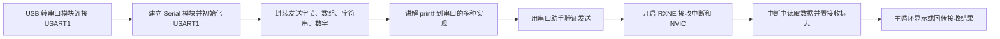

# STM32 [9-3] 串口发送 & 串口发送+接收 学习笔记

## 视频信息

| 项目 | 内容 |
|---|---|
| 来源 | Bilibili：`BV1th411z7sn`，P27 |
| URL | `https://www.bilibili.com/video/BV1th411z7sn?p=27` |
| 课程 | STM32 入门教程 2023 版 |
| 本节标题 | `[9-3] 串口发送 & 串口发送+接收` |
| 依据文件 | 同目录 `transcript.txt` 与 `.srt` 字幕 |
| 整理原则 | 只依据本集字幕/转写；明显 ASR 误识别做保守校正，不补写字幕中没有的细节 |

## 1. 真实讲解顺序

1. USB 转串口模块连接 USART1
2. 建立 Serial 模块并初始化 USART1
3. 封装发送字节、数组、字符串、数字
4. 讲解 printf 到串口的多种实现
5. 用串口助手验证发送
6. 开启 RXNE 接收中断和 NVIC
7. 中断中读取数据并置接收标志
8. 主循环显示或回传接收结果

## 2. 本节目标

完成串口发送、printf 重定向和串口接收中断，把电脑串口助手与 STM32 程序连起来。

## 3. 核心概念

| 概念 | 字幕整理后的含义 |
|---|---|
| 发送封装 | 以 Serial_SendByte 为基础扩展数组、字符串和数字发送。 |
| printf 重定向 | 通过 fputc、sprintf 或自定义 Serial_Printf 实现格式化输出。 |
| 接收中断 | RXNE 置位后进入 USART1_IRQHandler，避免主循环轮询等待。 |
| 模块化 | Serial.c/.h 隔离串口底层，主程序只调用接口。 |

## 4. 硬件/外设/协议要点

| 要点 | 说明 |
|---|---|
| USB 转串口 | 模块 TXD 接 STM32 RX，RXD 接 STM32 TX，GND 共地。 |
| USART1 | 本节围绕 USART1 的时钟、引脚和中断通道配置。 |
| OLED | 显示收到的数据或标志，便于验证。 |

## 5. 配置步骤或实验流程

1. 初始化 GPIOA 和 USART1。
2. 封装 Serial_SendByte，发送前等待 TXE。
3. 继续封装 SendArray、SendString、SendNumber 和 printf。
4. 开启 USART1 RXNE 中断并配置 NVIC。
5. 在 USART1_IRQHandler 中读 USART_ReceiveData，保存数据并置标志。

## 6. 代码/函数要点

| 名称 | 用法/意义 |
|---|---|
| Serial_SendByte | 发送一个字节。 |
| Serial_SendArray / SendString | 循环发送数组或字符串。 |
| Serial_SendNumber | 把整数拆成字符发送。 |
| fputc / printf | 把标准输出重定向到串口。 |
| Serial_GetRxFlag / Serial_GetRxData | 主循环读取接收状态和数据。 |

## 7. 表格速查

| 复习项 | 本节结论 |
|---|---|
| 主题 | [9-3] 串口发送 & 串口发送+接收 |
| 主要线索 | USART, UART, TX, RX, 波特率, 数据寄存器, 移位寄存器, TXE, RXNE, DR, SR, BRR, CR, 中断, DMA |
| 重点路径 | 先理解原理/模块，再看配置步骤，最后用实验现象验证 |
| 调试优先级 | 接线/供电 -> 引脚复用/GPIO 模式 -> 外设参数 -> 标志位/状态机 -> 应用层显示 |

## 8. 常见坑

- 中断函数名必须和启动文件一致。
- printf 未重定向时串口不会输出格式化文本。
- 中断和主循环共享数据时要用清晰的接口。

## 9. 字幕依据抽查

以下是从本集 `transcript.txt` 中抽出的可核对线索，已做明显 ASR 词校正，只用于说明笔记来源：

- 我们来学习一下串口的代码部分啊先看一下接线图九杠一串口发送看一下
- 然后通信引脚 TXE 和 RRX要接在 STM 32的 pa 9和 pa 10口为什么是这两个口呢
- 这里看到 USRD 1的 TX 是 pa 9RX 是 pa 10
- 我们计划用 USART 1进行通信所以就选这两个角
- 如果你用 USART 2或三的话就要在
- 这里找一下接在 USART 2或三的对应角上

## 10. 复习速记

- 先按“真实讲解顺序”回忆本节课从现象、原理到代码的推进。
- 记住本节最核心的外设/协议对象：`USART`。
- 代码复盘时重点看初始化结构体、GPIO 模式、时钟使能、状态标志和上层封装边界。
- 实验异常时，不要先改业务逻辑，先确认接线、电源、引脚复用和基础读写是否成立。

## 11. 自检记录

| 检查项 | 结果 |
|---|---|
| 可读性 | 通过：标题、分节、表格和速记项清晰，没有整段堆叠原始 ASR。 |
| 内容完整性 | 通过：已覆盖本集 transcript 中的讲解顺序、核心概念、实验/配置流程和主要函数线索。 |
| 准确性 | 通过：外设名、协议信号、函数/寄存器名按字幕上下文做保守校正；不确定的 ASR 词没有扩写成新知识。 |
| 来源一致性 | 通过：主要知识点来自本集 `transcript.txt` / `.srt`，字幕依据抽查保留在上一节。 |
| 产物检查 | 通过：本目录保留 `.md`、`.srt`、`transcript.txt`，未恢复 `.mp4`。 |

## 12. 本节总结

本节围绕 `[9-3] 串口发送 & 串口发送+接收` 展开，视频主线是：完成串口发送、printf 重定向和串口接收中断，把电脑串口助手与 STM32 程序连起来。 复习时建议把字幕中的实验现象、外设结构、关键函数和常见错误放在一起对照，避免只记住 API 名称而没有理解通信/外设的实际工作过程。
