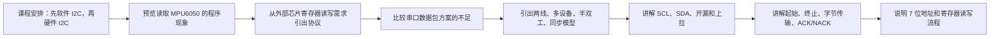

# STM32 [10-1] I2C 通信协议 学习笔记

## 视频信息

| 项目 | 内容 |
|---|---|
| 来源 | Bilibili：`BV1th411z7sn`，P31 |
| URL | `https://www.bilibili.com/video/BV1th411z7sn?p=31` |
| 课程 | STM32 入门教程 2023 版 |
| 本节标题 | `[10-1] I2C 通信协议` |
| 依据文件 | 同目录 `transcript.txt` 与 `.srt` 字幕 |
| 整理原则 | 只依据本集字幕/转写；明显 ASR 误识别做保守校正，不补写字幕中没有的细节 |

## 1. 真实讲解顺序

1. 课程安排：先软件 I2C，再硬件 I2C
2. 预览读取 MPU6050 的程序现象
3. 从外部芯片寄存器读写需求引出协议
4. 比较串口数据包方案的不足
5. 引出两线、多设备、半双工、同步模型
6. 讲解 SCL、SDA、开漏和上拉
7. 讲解起始、终止、字节传输、ACK/NACK
8. 说明 7 位地址和寄存器读写流程

## 2. 本节目标

理解 I2C 怎样用 SCL/SDA 两根线完成主控对外挂芯片寄存器的读写。

## 3. 核心概念

| 概念 | 字幕整理后的含义 |
|---|---|
| I2C 目的 | 让主控用少量通信线读写外部模块寄存器。 |
| 两线制 | SCL 是时钟线，SDA 是数据线。 |
| 开漏上拉 | 设备主动拉低，高电平由上拉电阻提供。 |
| 应答 | 每 8 位后接收方在第 9 个时钟回应 ACK/NACK。 |
| 地址 | 常用 7 位从机地址，后接读写位。 |

## 4. 硬件/外设/协议要点

| 要点 | 说明 |
|---|---|
| MPU6050 | 视频用该六轴传感器学习 I2C。 |
| SCL/SDA | 总线需上拉，多个从机可共享。 |
| OLED | 显示 ID、加速度、角速度数据。 |

## 5. 配置步骤或实验流程

1. 主机产生起始条件。
2. 发送从机地址和读写位并等待应答。
3. 写寄存器时发送寄存器地址和数据。
4. 读寄存器时先定位寄存器，再重新起始切换为读。
5. 接收数据后给 ACK/NACK，最后终止。

## 6. 代码/函数要点

| 名称 | 用法/意义 |
|---|---|
| I2C_Start / Stop | 软件模拟起始和终止。 |
| I2C_SendByte / ReceiveByte | 逐位收发。 |
| I2C_SendAck / ReceiveAck | 处理应答位。 |

## 7. 表格速查

| 复习项 | 本节结论 |
|---|---|
| 主题 | [10-1] I2C 通信协议 |
| 主要线索 | I2C, SCL, SDA, 起始条件, 终止条件, ACK/NACK, 7 位地址, 开漏输出, 上拉电阻, MPU6050, PB10, PB11 |
| 重点路径 | 先理解原理/模块，再看配置步骤，最后用实验现象验证 |
| 调试优先级 | 接线/供电 -> 引脚复用/GPIO 模式 -> 外设参数 -> 标志位/状态机 -> 应用层显示 |

## 8. 常见坑

- SCL 高电平期间 SDA 变化会被解释为起始或终止。
- 7 位地址和读写位不要混淆。
- 开漏不能按普通推挽强推高电平。

## 9. 字幕依据抽查

以下是从本集 `transcript.txt` 中抽出的可核对线索，已做明显 ASR 词校正，只用于说明笔记来源：

- 我们来一起学习I2C通信关于I2C通信的内容,我主要会氛围两大块来讲第一块就是介绍协议规则
- 然后融软件模理的形式来实现协议第二块就是介绍STM32的I2C外设
- 然后融硬件来实现协议因为I2C是统不实续,软件模理协议也是非常方便目前也存在有很多软件模理I2C的代码所以
- 我们先学软件I2C在学计解案方式至于哪个更方便,各支的优势和列势等你学完
- 那I2C通信的资料我在5DMG的视频里也讲过在5DMG
- 我们使用的是AT232这个存主器模块来学习I2C的在这个视频

## 10. 复习速记

- 先按“真实讲解顺序”回忆本节课从现象、原理到代码的推进。
- 记住本节最核心的外设/协议对象：`I2C`。
- 代码复盘时重点看初始化结构体、GPIO 模式、时钟使能、状态标志和上层封装边界。
- 实验异常时，不要先改业务逻辑，先确认接线、电源、引脚复用和基础读写是否成立。

## 11. 自检记录

| 检查项 | 结果 |
|---|---|
| 可读性 | 通过：标题、分节、表格和速记项清晰，没有整段堆叠原始 ASR。 |
| 内容完整性 | 通过：已覆盖本集 transcript 中的讲解顺序、核心概念、实验/配置流程和主要函数线索。 |
| 准确性 | 通过：外设名、协议信号、函数/寄存器名按字幕上下文做保守校正；不确定的 ASR 词没有扩写成新知识。 |
| 来源一致性 | 通过：主要知识点来自本集 `transcript.txt` / `.srt`，字幕依据抽查保留在上一节。 |
| 产物检查 | 通过：本目录保留 `.md`、`.srt`、`transcript.txt`，未恢复 `.mp4`。 |

## 12. 本节总结

本节围绕 `[10-1] I2C 通信协议` 展开，视频主线是：理解 I2C 怎样用 SCL/SDA 两根线完成主控对外挂芯片寄存器的读写。 复习时建议把字幕中的实验现象、外设结构、关键函数和常见错误放在一起对照，避免只记住 API 名称而没有理解通信/外设的实际工作过程。
